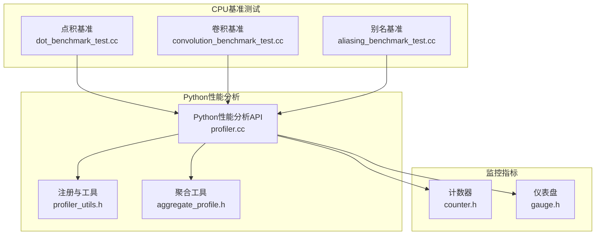
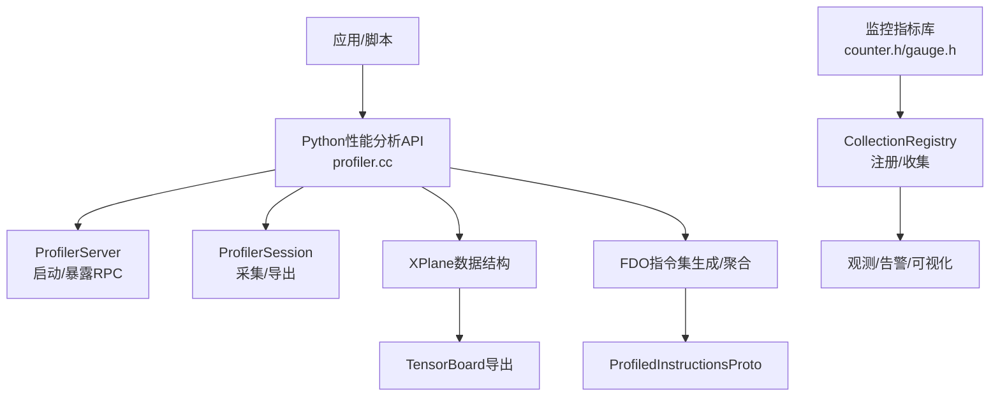
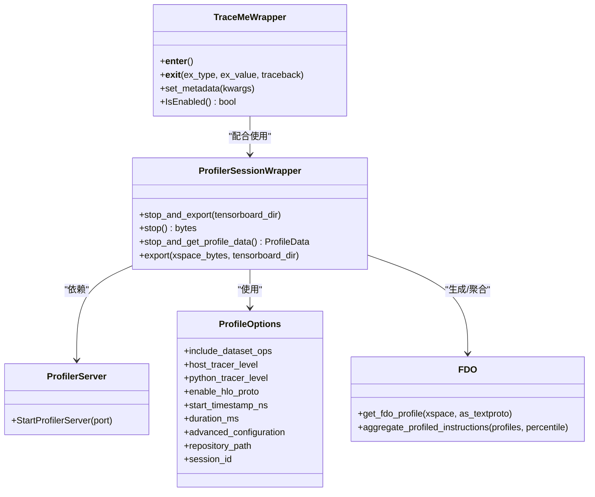
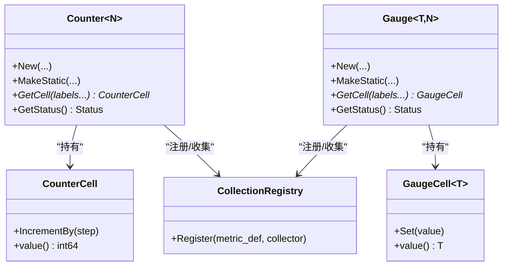
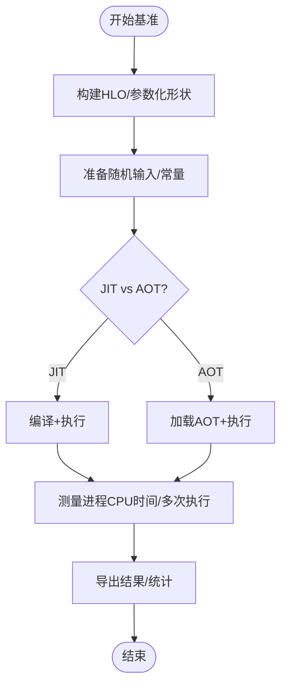
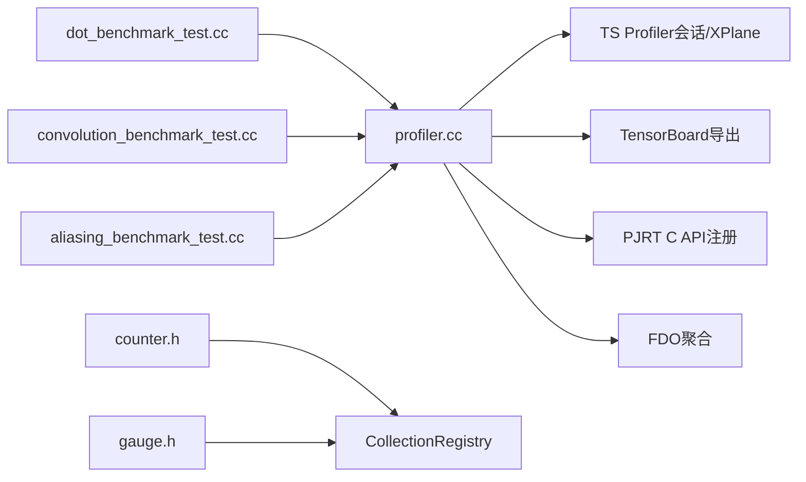

# 性能分析工具

<cite>
**本文引用的文件**
- [xla/python/profiler.cc](file://xla/python/profiler.cc)
- [xla/python/profiler_utils.h](file://xla/python/profiler_utils.h)
- [xla/python/aggregate_profile.h](file://xla/python/aggregate_profile.h)
- [xla/tsl/lib/monitoring/counter.h](file://xla/tsl/lib/monitoring/counter.h)
- [xla/tsl/lib/monitoring/gauge.h](file://xla/tsl/lib/monitoring/gauge.h)
- [xla/backends/cpu/benchmarks/dot_benchmark_test.cc](file://xla/backends/cpu/benchmarks/dot_benchmark_test.cc)
- [xla/backends/cpu/benchmarks/convolution_benchmark_test.cc](file://xla/backends/cpu/benchmarks/convolution_benchmark_test.cc)
- [xla/backends/cpu/benchmarks/aliasing_benchmark_test.cc](file://xla/backends/cpu/benchmarks/aliasing_benchmark_test.cc)
</cite>

## 目录
1. [简介](#简介)
2. [项目结构](#项目结构)
3. [核心组件](#核心组件)
4. [架构总览](#架构总览)
5. [组件详解](#组件详解)
6. [依赖关系分析](#依赖关系分析)
7. [性能考量](#性能考量)
8. [故障排查指南](#故障排查指南)
9. [结论](#结论)
10. [附录](#附录)

## 简介
本文件面向XLA性能分析工具的专业文档，聚焦以下能力：
- 基准测试工具：基于CPU后端的HLO基准测试，覆盖点积、卷积、别名等场景，支持JIT/AOT对比、进程CPU时间测量与多参数组合。
- Python性能分析器：封装TraceMe上下文、ProfilerServer、ProfileOptions、会话采集与导出、FDO指令集聚合等。
- CPU/GPU服务端性能监控：通过监控指标库（计数器/仪表盘）进行资源利用率与运行时状态的观测与收集。

文档将系统阐述性能指标采集、分析方法与优化建议，并给出识别性能瓶颈、测量执行时间与服务延迟、内存使用分析、并行度评估与资源利用率监控的具体实践路径。

## 项目结构
围绕性能分析的关键代码分布在如下模块：
- Python侧性能分析接口与工具：xla/python/profiler.cc、xla/python/profiler_utils.h、xla/python/aggregate_profile.h
- 监控指标库：xla/tsl/lib/monitoring/counter.h、xla/tsl/lib/monitoring/gauge.h
- CPU基准测试：xla/backends/cpu/benchmarks/*.cc（点积、卷积、别名）

**图表来源**
- [xla/python/profiler.cc](file://xla/python/profiler.cc#L151-L387)
- [xla/python/profiler_utils.h](file://xla/python/profiler_utils.h#L19-L25)
- [xla/python/aggregate_profile.h](file://xla/python/aggregate_profile.h#L24-L31)
- [xla/tsl/lib/monitoring/counter.h](file://xla/tsl/lib/monitoring/counter.h#L151-L280)
- [xla/tsl/lib/monitoring/gauge.h](file://xla/tsl/lib/monitoring/gauge.h#L211-L378)
- [xla/backends/cpu/benchmarks/dot_benchmark_test.cc](file://xla/backends/cpu/benchmarks/dot_benchmark_test.cc#L77-L153)
- [xla/backends/cpu/benchmarks/convolution_benchmark_test.cc](file://xla/backends/cpu/benchmarks/convolution_benchmark_test.cc#L646-L662)
- [xla/backends/cpu/benchmarks/aliasing_benchmark_test.cc](file://xla/backends/cpu/benchmarks/aliasing_benchmark_test.cc#L30-L54)

**章节来源**
- [xla/python/profiler.cc](file://xla/python/profiler.cc#L151-L387)
- [xla/tsl/lib/monitoring/counter.h](file://xla/tsl/lib/monitoring/counter.h#L151-L280)
- [xla/tsl/lib/monitoring/gauge.h](file://xla/tsl/lib/monitoring/gauge.h#L211-L378)
- [xla/backends/cpu/benchmarks/dot_benchmark_test.cc](file://xla/backends/cpu/benchmarks/dot_benchmark_test.cc#L77-L153)
- [xla/backends/cpu/benchmarks/convolution_benchmark_test.cc](file://xla/backends/cpu/benchmarks/convolution_benchmark_test.cc#L646-L662)
- [xla/backends/cpu/benchmarks/aliasing_benchmark_test.cc](file://xla/backends/cpu/benchmarks/aliasing_benchmark_test.cc#L30-L54)

## 核心组件
- Python性能分析器
  - 提供ProfilerServer启动、ProfilerSession生命周期管理、ProfileOptions配置、TraceMe上下文、XPlane到ProfiledInstructions转换与聚合、FDO指令集生成与导出。
- 监控指标库
  - 计数器Counter与仪表盘Gauge，支持标签化、线程安全、注册收集，用于CPU/GPU服务端资源利用率与状态观测。
- CPU基准测试
  - 点积、卷积、别名等典型算子/模式的基准用例，支持参数化扫描、JIT/AOT对比、进程CPU时间测量。

**章节来源**
- [xla/python/profiler.cc](file://xla/python/profiler.cc#L151-L387)
- [xla/tsl/lib/monitoring/counter.h](file://xla/tsl/lib/monitoring/counter.h#L151-L280)
- [xla/tsl/lib/monitoring/gauge.h](file://xla/tsl/lib/monitoring/gauge.h#L211-L378)
- [xla/backends/cpu/benchmarks/dot_benchmark_test.cc](file://xla/backends/cpu/benchmarks/dot_benchmark_test.cc#L77-L153)
- [xla/backends/cpu/benchmarks/convolution_benchmark_test.cc](file://xla/backends/cpu/benchmarks/convolution_benchmark_test.cc#L646-L662)
- [xla/backends/cpu/benchmarks/aliasing_benchmark_test.cc](file://xla/backends/cpu/benchmarks/aliasing_benchmark_test.cc#L30-L54)

## 架构总览
下图展示了Python性能分析器与底层TS Profiler、XPlane、TensorBoard之间的交互，以及监控指标在服务端的采集与注册流程。

**图表来源**
- [xla/python/profiler.cc](file://xla/python/profiler.cc#L151-L387)
- [xla/tsl/lib/monitoring/counter.h](file://xla/tsl/lib/monitoring/counter.h#L190-L225)
- [xla/tsl/lib/monitoring/gauge.h](file://xla/tsl/lib/monitoring/gauge.h#L265-L293)

## 组件详解

### Python性能分析器（profiler.cc）
- ProfilerServer：提供启动ProfilerServer的能力，便于远程采集。
- ProfilerSession：封装会话生命周期，支持stop_and_export导出到TensorBoard、stop获取XSpace字节串、stop_and_get_profile_data返回Python层ProfileData对象、export从已有XSpace导出。
- ProfileOptions：可配置主机追踪级别、Python追踪级别、是否包含数据集操作、是否启用HLO Proto、开始时间戳、持续时间、高级配置、仓库路径、会话ID等。
- TraceMe：轻量级TraceMe包装，支持关键字元数据注入、上下文管理、启用状态查询。
- FDO与聚合：提供从XSpace生成ProfiledInstructionsProto、按百分位聚合多个ProfiledInstructionsProto的能力，便于跨多次运行统计热点与成本分布。

**图表来源**
- [xla/python/profiler.cc](file://xla/python/profiler.cc#L151-L387)

**章节来源**
- [xla/python/profiler.cc](file://xla/python/profiler.cc#L151-L387)
- [xla/python/profiler_utils.h](file://xla/python/profiler_utils.h#L19-L25)
- [xla/python/aggregate_profile.h](file://xla/python/aggregate_profile.h#L24-L31)

### 监控指标库（counter.h / gauge.h）
- Counter：累积型整数指标，支持标签化、线程安全、按需创建Cell、注册到CollectionRegistry统一收集。
- Gauge：瞬时值指标，支持int64/string/bool/回调等类型，提供原子或互斥保护的Set/value访问。
- 收集机制：通过CollectionRegistry在统一入口收集各MetricDef定义的指标值，便于服务端观测与可视化。

**图表来源**
- [xla/tsl/lib/monitoring/counter.h](file://xla/tsl/lib/monitoring/counter.h#L151-L280)
- [xla/tsl/lib/monitoring/gauge.h](file://xla/tsl/lib/monitoring/gauge.h#L211-L378)

**章节来源**
- [xla/tsl/lib/monitoring/counter.h](file://xla/tsl/lib/monitoring/counter.h#L151-L280)
- [xla/tsl/lib/monitoring/gauge.h](file://xla/tsl/lib/monitoring/gauge.h#L211-L378)

### CPU基准测试（点积/卷积/别名）
- 点积基准（dot_benchmark_test.cc）
  - 支持批量点积与通用Dot构造，参数化输入形状、数据类型、批维/收缩维配置；注册JIT/AOT两种模式，测量进程CPU时间。
- 卷积基准（convolution_benchmark_test.cc）
  - 覆盖1D/2D常规与分组卷积、转置（反向梯度）卷积、不同填充策略与布局；参数化批量、空间尺寸、通道数、核尺寸、步幅、分组数；注册基准并设置进程CPU时间测量。
- 别名基准（aliasing_benchmark_test.cc）
  - 以HLO别名声明为测试入口，验证带别名的执行路径，参数化执行次数，评估别名对性能的影响。

**图表来源**
- [xla/backends/cpu/benchmarks/dot_benchmark_test.cc](file://xla/backends/cpu/benchmarks/dot_benchmark_test.cc#L77-L153)
- [xla/backends/cpu/benchmarks/convolution_benchmark_test.cc](file://xla/backends/cpu/benchmarks/convolution_benchmark_test.cc#L646-L662)
- [xla/backends/cpu/benchmarks/aliasing_benchmark_test.cc](file://xla/backends/cpu/benchmarks/aliasing_benchmark_test.cc#L30-L54)

**章节来源**
- [xla/backends/cpu/benchmarks/dot_benchmark_test.cc](file://xla/backends/cpu/benchmarks/dot_benchmark_test.cc#L77-L153)
- [xla/backends/cpu/benchmarks/convolution_benchmark_test.cc](file://xla/backends/cpu/benchmarks/convolution_benchmark_test.cc#L646-L662)
- [xla/backends/cpu/benchmarks/aliasing_benchmark_test.cc](file://xla/backends/cpu/benchmarks/aliasing_benchmark_test.cc#L30-L54)

## 依赖关系分析
- Python性能分析器依赖TS Profiler会话、XPlane与TensorBoard导出能力，同时通过PJRT C API注册插件式Profiler。
- 监控指标库通过CollectionRegistry集中注册与收集，避免直接耦合具体观测系统。
- 基准测试通过HLO构建与参数化扫描，驱动执行路径并输出可复现的性能数据。

**图表来源**
- [xla/python/profiler.cc](file://xla/python/profiler.cc#L151-L387)
- [xla/tsl/lib/monitoring/counter.h](file://xla/tsl/lib/monitoring/counter.h#L190-L225)
- [xla/tsl/lib/monitoring/gauge.h](file://xla/tsl/lib/monitoring/gauge.h#L265-L293)
- [xla/backends/cpu/benchmarks/dot_benchmark_test.cc](file://xla/backends/cpu/benchmarks/dot_benchmark_test.cc#L77-L153)
- [xla/backends/cpu/benchmarks/convolution_benchmark_test.cc](file://xla/backends/cpu/benchmarks/convolution_benchmark_test.cc#L646-L662)
- [xla/backends/cpu/benchmarks/aliasing_benchmark_test.cc](file://xla/backends/cpu/benchmarks/aliasing_benchmark_test.cc#L30-L54)

**章节来源**
- [xla/python/profiler.cc](file://xla/python/profiler.cc#L151-L387)
- [xla/tsl/lib/monitoring/counter.h](file://xla/tsl/lib/monitoring/counter.h#L190-L225)
- [xla/tsl/lib/monitoring/gauge.h](file://xla/tsl/lib/monitoring/gauge.h#L265-L293)
- [xla/backends/cpu/benchmarks/dot_benchmark_test.cc](file://xla/backends/cpu/benchmarks/dot_benchmark_test.cc#L77-L153)
- [xla/backends/cpu/benchmarks/convolution_benchmark_test.cc](file://xla/backends/cpu/benchmarks/convolution_benchmark_test.cc#L646-L662)
- [xla/backends/cpu/benchmarks/aliasing_benchmark_test.cc](file://xla/backends/cpu/benchmarks/aliasing_benchmark_test.cc#L30-L54)

## 性能考量
- 执行时间与延迟测量
  - 使用ProfilerSession.stop_and_get_profile_data获取XPlane，结合TensorBoard可视化；或使用stop导出XSpace字节串，再由工具链解析。
  - 基准测试中通过benchmark框架与进程CPU时间测量，确保结果稳定与可复现。
- 内存使用分析
  - 通过ProfilerSession采集的数据与XPlane中的内存事件进行关联分析；结合监控指标库的Gauge记录峰值/瞬时内存占用。
- 并行度评估
  - 在ProfileOptions中调整主机/Python追踪级别，观察线程调度与并发开销；基准测试中通过不同参数组合评估并行效率。
- 资源利用率监控
  - 使用Counter/Gauge记录吞吐、错误、队列长度等关键指标，结合CollectionRegistry统一收集，便于服务端观测与告警。

[本节为通用指导，无需特定文件引用]

## 故障排查指南
- 启动ProfilerServer失败
  - 检查端口占用与权限；确认已正确调用ProfilerServer.start_server并传入有效端口。
- 会话采集异常
  - 确认ProfilerSession初始化与停止顺序正确；检查stop_and_export的TensorBoard目录是否存在且有写权限。
- FDO聚合失败
  - 确保输入的ProfiledInstructionsProto序列有效；检查percentile参数范围与序列非空。
- 监控指标未显示
  - 检查MetricDef命名唯一性与标签数量匹配；确认CollectionRegistry注册成功且收集器可用。

**章节来源**
- [xla/python/profiler.cc](file://xla/python/profiler.cc#L151-L387)
- [xla/tsl/lib/monitoring/counter.h](file://xla/tsl/lib/monitoring/counter.h#L190-L225)
- [xla/tsl/lib/monitoring/gauge.h](file://xla/tsl/lib/monitoring/gauge.h#L265-L293)

## 结论
XLA性能分析工具通过Python侧Profiler API、TS Profiler与XPlane、TensorBoard导出，以及监控指标库，形成了从单机基准测试到服务端资源观测的完整闭环。结合点积、卷积、别名等典型基准用例，可系统地识别性能瓶颈、量化执行时间与延迟、评估并行度与资源利用率，并通过FDO聚合与回归检测验证优化效果。

[本节为总结，无需特定文件引用]

## 附录
- 性能测试示例（步骤说明）
  - 启动ProfilerServer并指定端口。
  - 创建ProfilerSession并配置ProfileOptions（如启用HLO Proto、设置追踪级别）。
  - 包裹待测代码于TraceMe上下文中，或在基准测试中使用benchmark框架。
  - 停止会话并导出到TensorBoard，或获取XSpace字节串进行后续处理。
  - 对多轮运行的ProfiledInstructionsProto进行百分位聚合，识别热点与成本分布。
  - 使用Counter/Gauge记录关键指标，结合CollectionRegistry进行统一观测。

[本节为概念性内容，无需特定文件引用]