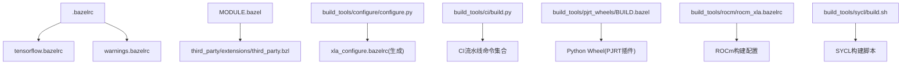
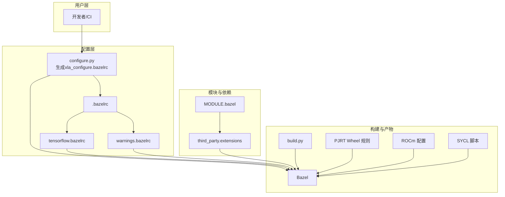
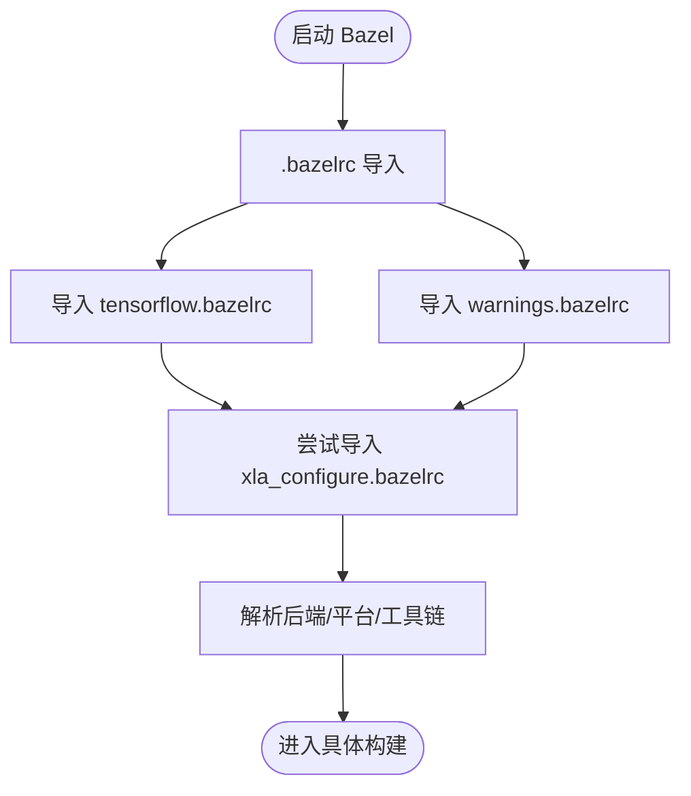
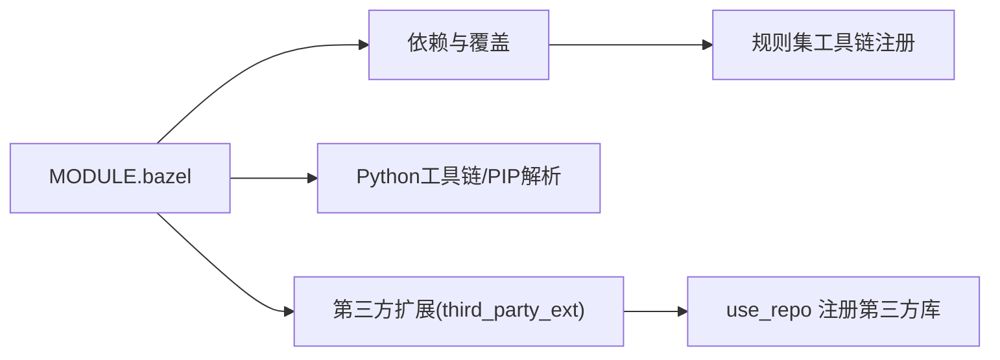
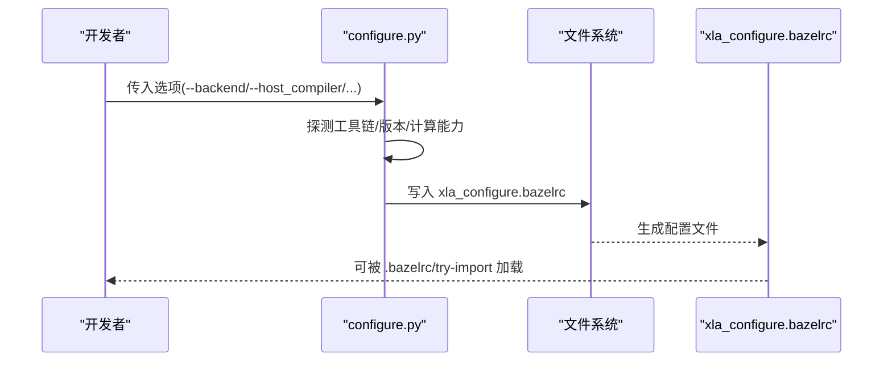
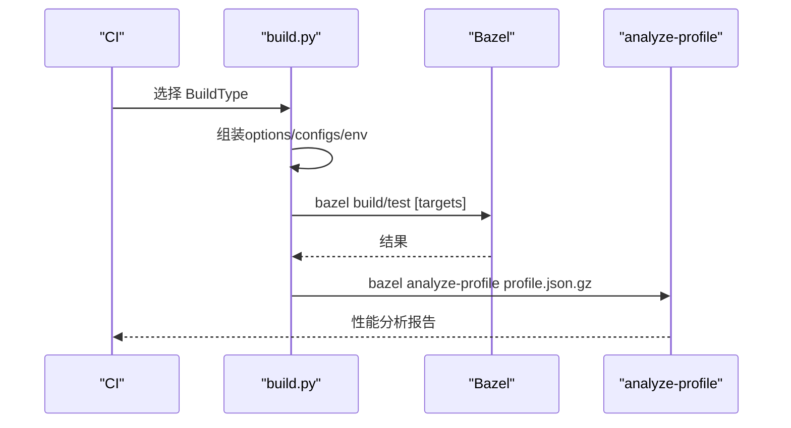
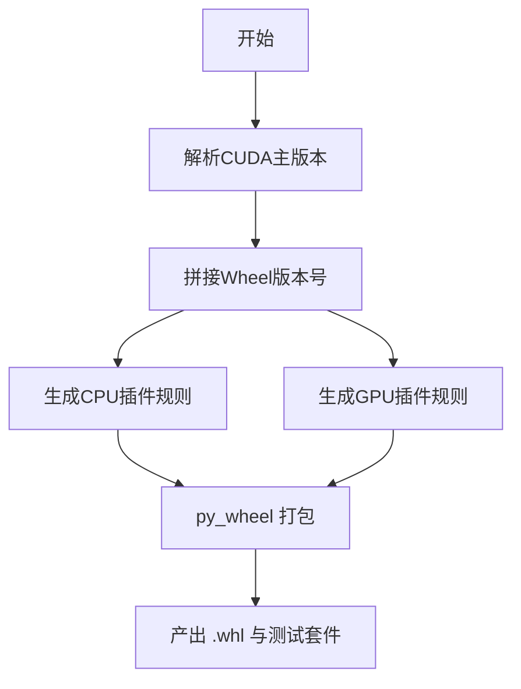
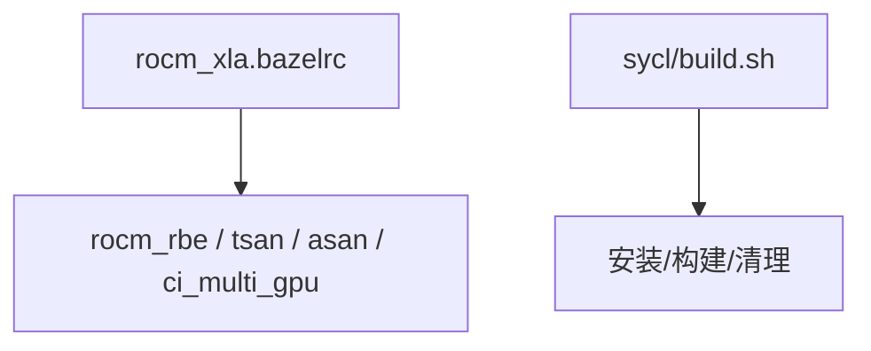
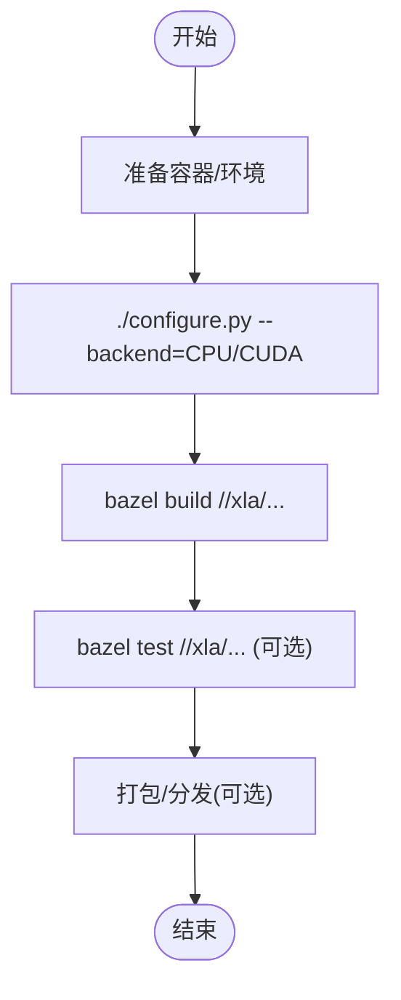
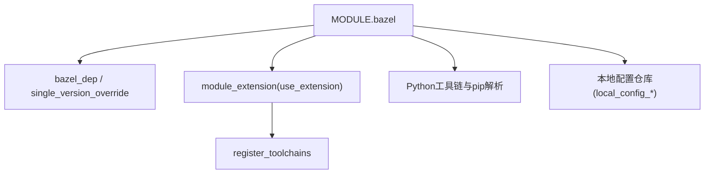

# 构建系统

<cite>
**本文引用的文件**
- [.bazelrc](file://.bazelrc)
- [MODULE.bazel](file://MODULE.bazel)
- [tensorflow.bazelrc](file://tensorflow.bazelrc)
- [warnings.bazelrc](file://warnings.bazelrc)
- [build_tools/configure/configure.py](file://build_tools/configure/configure.py)
- [build_tools/ci/build.py](file://build_tools/ci/build.py)
- [build_tools/pjrt_wheels/BUILD.bazel](file://build_tools/pjrt_wheels/BUILD.bazel)
- [build_tools/rocm/rocm_xla.bazelrc](file://build_tools/rocm/rocm_xla.bazelrc)
- [build_tools/rocm/rocm_xla_ci.bazelrc](file://build_tools/rocm/rocm_xla_ci.bazelrc)
- [build_tools/sycl/build.sh](file://build_tools/sycl/build.sh)
- [third_party/extensions/third_party.bzl](file://third_party/extensions/third_party.bzl)
- [docs/build_from_source.md](file://docs/build_from_source.md)
</cite>

## 目录
1. [简介](#简介)
2. [项目结构](#项目结构)
3. [核心组件](#核心组件)
4. [架构总览](#架构总览)
5. [详细组件分析](#详细组件分析)
6. [依赖分析](#依赖分析)
7. [性能考虑](#性能考虑)
8. [故障排除指南](#故障排除指南)
9. [结论](#结论)
10. [附录](#附录)

## 简介
本文件面向XLA构建系统的使用者与维护者，系统性梳理基于Bazel的构建配置、CI/CD流水线与跨平台编译支持。内容涵盖构建规则、依赖管理、编译选项配置、自定义构建、交叉编译与增量构建优化、缓存策略与并行编译配置，以及常见问题排查方法。文档同时提供从零搭建开发环境、编译源码与打包发布的实践步骤，并以图示方式呈现关键流程。

## 项目结构
XLA采用Bazel模块化组织，根目录通过MODULE.bazel声明外部依赖与模块扩展；构建配置由多份.bazelrc文件协同完成，其中tensorflow.bazelrc提供通用构建选项，.bazelrc负责导入与合并；build_tools目录提供配置脚本、CI构建器、特定后端（ROCm、SYCL）配置与轮子打包规则；third_party/extensions集中注册第三方库；docs提供从源码构建的指导。

**图表来源**
- [.bazelrc](file://.bazelrc#L1-L21)
- [tensorflow.bazelrc](file://tensorflow.bazelrc#L1-L761)
- [warnings.bazelrc](file://warnings.bazelrc#L1-L98)
- [MODULE.bazel](file://MODULE.bazel#L1-L244)
- [third_party/extensions/third_party.bzl](file://third_party/extensions/third_party.bzl#L1-L95)
- [build_tools/configure/configure.py](file://build_tools/configure/configure.py#L1-L625)
- [build_tools/ci/build.py](file://build_tools/ci/build.py#L1-L957)
- [build_tools/pjrt_wheels/BUILD.bazel](file://build_tools/pjrt_wheels/BUILD.bazel#L1-L173)
- [build_tools/rocm/rocm_xla.bazelrc](file://build_tools/rocm/rocm_xla.bazelrc#L1-L104)
- [build_tools/sycl/build.sh](file://build_tools/sycl/build.sh#L1-L47)

**章节来源**
- [.bazelrc](file://.bazelrc#L1-L21)
- [MODULE.bazel](file://MODULE.bazel#L1-L244)
- [tensorflow.bazelrc](file://tensorflow.bazelrc#L1-L761)
- [warnings.bazelrc](file://warnings.bazelrc#L1-L98)
- [third_party/extensions/third_party.bzl](file://third_party/extensions/third_party.bzl#L1-L95)

## 核心组件
- 根配置与导入链
  - .bazelrc：启用Bzlmod开关、加载tensorflow.bazelrc与warnings.bazelrc，并尝试导入xla_configure.bazelrc。
  - tensorflow.bazelrc：提供平台、后端、远程执行、缓存、交叉编译等大量构建配置片段与默认选项。
  - warnings.bazelrc：统一将警告视为错误，并对第三方代码静默处理。
- 模块与依赖
  - MODULE.bazel：声明Bazel模块依赖、单版本覆盖与补丁、Python工具链与pip解析、第三方扩展注册、规则集工具链注册等。
  - third_party.extensions：集中注册众多第三方库，便于在不同后端与目标间复用。
- 配置与CI
  - configure.py：交互式生成xla_configure.bazelrc，自动探测工具链与CUDA能力，注入后端与编译器选择、标签过滤等。
  - build.py：CI构建器，按BuildType枚举生成标准化的bazel命令，含并行、重试、测试过滤、RBE参数等。
- 轮子与插件
  - pjrt_wheels/BUILD.bazel：定义CPU/GPU PJRT插件Wheel的构建规则、入口点与版本拼接逻辑。
- 后端与工具链
  - rocm_xla.bazelrc/rocm_xla_ci.bazelrc：ROCm专用构建与CI配置，含Sanitizer、多卡运行、忽略列表等。
  - sycl/build.sh：SYCL后端构建脚本，封装安装与构建流程。
- 文档与示例
  - docs/build_from_source.md：Linux/CPU/GPU构建步骤、容器化建议与Hermetic CUDA说明。

**章节来源**
- [.bazelrc](file://.bazelrc#L1-L21)
- [tensorflow.bazelrc](file://tensorflow.bazelrc#L1-L761)
- [warnings.bazelrc](file://warnings.bazelrc#L1-L98)
- [MODULE.bazel](file://MODULE.bazel#L1-L244)
- [third_party/extensions/third_party.bzl](file://third_party/extensions/third_party.bzl#L1-L95)
- [build_tools/configure/configure.py](file://build_tools/configure/configure.py#L1-L625)
- [build_tools/ci/build.py](file://build_tools/ci/build.py#L1-L957)
- [build_tools/pjrt_wheels/BUILD.bazel](file://build_tools/pjrt_wheels/BUILD.bazel#L1-L173)
- [build_tools/rocm/rocm_xla.bazelrc](file://build_tools/rocm/rocm_xla.bazelrc#L1-L104)
- [build_tools/rocm/rocm_xla_ci.bazelrc](file://build_tools/rocm/rocm_xla_ci.bazelrc#L1-L3)
- [build_tools/sycl/build.sh](file://build_tools/sycl/build.sh#L1-L47)
- [docs/build_from_source.md](file://docs/build_from_source.md#L1-L184)

## 架构总览
下图展示了XLA构建系统的关键交互：用户通过configure.py生成后端配置，Bazel读取根.bazelrc与tensorflow.bazelrc，结合MODULE.bazel与第三方扩展完成依赖解析与工具链注册；CI通过build.py统一调度；ROCm/SYCL等后端通过专用.bazelrc或脚本参与构建；最终产出二进制与Wheel。

**图表来源**
- [.bazelrc](file://.bazelrc#L1-L21)
- [tensorflow.bazelrc](file://tensorflow.bazelrc#L1-L761)
- [warnings.bazelrc](file://warnings.bazelrc#L1-L98)
- [MODULE.bazel](file://MODULE.bazel#L1-L244)
- [third_party/extensions/third_party.bzl](file://third_party/extensions/third_party.bzl#L1-L95)
- [build_tools/configure/configure.py](file://build_tools/configure/configure.py#L1-L625)
- [build_tools/ci/build.py](file://build_tools/ci/build.py#L1-L957)
- [build_tools/pjrt_wheels/BUILD.bazel](file://build_tools/pjrt_wheels/BUILD.bazel#L1-L173)
- [build_tools/rocm/rocm_xla.bazelrc](file://build_tools/rocm/rocm_xla.bazelrc#L1-L104)
- [build_tools/sycl/build.sh](file://build_tools/sycl/build.sh#L1-L47)

## 详细组件分析

### 组件A：构建配置与导入链
- .bazelrc
  - 控制Bzlmod开关与工具链分辨率，导入tensorflow.bazelrc与warnings.bazelrc，并尝试导入xla_configure.bazelrc。
  - 建议：保持与tensorflow.bazelrc的导入顺序，确保后端配置片段生效。
- tensorflow.bazelrc
  - 提供平台、后端、远程执行、缓存、交叉编译、测试过滤等大量配置片段，是构建选项的“大仓库”。
  - 关键片段：CUDA/ROCm/SYCL、RBE、缓存、交叉编译、PJRT发布配置等。
- warnings.bazelrc
  - 将警告视为错误，并对第三方头文件静默处理，避免噪声干扰。

**图表来源**
- [.bazelrc](file://.bazelrc#L1-L21)
- [tensorflow.bazelrc](file://tensorflow.bazelrc#L1-L761)
- [warnings.bazelrc](file://warnings.bazelrc#L1-L98)

**章节来源**
- [.bazelrc](file://.bazelrc#L1-L21)
- [tensorflow.bazelrc](file://tensorflow.bazelrc#L1-L761)
- [warnings.bazelrc](file://warnings.bazelrc#L1-L98)

### 组件B：模块与依赖管理
- MODULE.bazel
  - 声明Bazel模块依赖与单版本覆盖，应用补丁，注册Python工具链与pip解析，注册第三方扩展与规则集工具链。
  - 影响：决定外部库版本、补丁与工具链可用性，直接影响后端（CUDA/ROCm/SYCL）与编译器选择。
- third_party.extensions
  - 统一注册大量第三方库（如cuDNN/NCCL/Triton/ROCm设备库等），便于在不同后端与目标间共享。

**图表来源**
- [MODULE.bazel](file://MODULE.bazel#L1-L244)
- [third_party/extensions/third_party.bzl](file://third_party/extensions/third_party.bzl#L1-L95)

**章节来源**
- [MODULE.bazel](file://MODULE.bazel#L1-L244)
- [third_party/extensions/third_party.bzl](file://third_party/extensions/third_party.bzl#L1-L95)

### 组件C：配置脚本与后端选择
- configure.py
  - 自动探测Clang/GCC/LD路径与版本，查询CUDA计算能力，生成xla_configure.bazelrc。
  - 支持后端：CPU/CUDA/ROCm/SYCL；主机编译器：Clang/GCC；CUDA编译器：Clang/NVCC；ROCm编译器：HIPCC；SYCL编译器：ICPX。
  - 输出：构建配置片段（后端、编译器、链接器、标签过滤、环境变量等）。

**图表来源**
- [build_tools/configure/configure.py](file://build_tools/configure/configure.py#L1-L625)
- [.bazelrc](file://.bazelrc#L20-L21)

**章节来源**
- [build_tools/configure/configure.py](file://build_tools/configure/configure.py#L1-L625)
- [.bazelrc](file://.bazelrc#L20-L21)

### 组件D：CI构建器与流水线
- build.py
  - 定义多种BuildType（Linux x86 CPU/GPU、Windows x86 CPU、macOS、JAX/TensorFlow集成等），按类型组装bazel命令。
  - 默认选项：颜色、测试输出、并行、重试、BES上传、jobs数等；按后端注入标签过滤与环境变量。
  - 多GPU场景：通过run_under与环境变量控制并行度与可见设备。

**图表来源**
- [build_tools/ci/build.py](file://build_tools/ci/build.py#L1-L957)

**章节来源**
- [build_tools/ci/build.py](file://build_tools/ci/build.py#L1-L957)

### 组件E：轮子与插件打包
- pjrt_wheels/BUILD.bazel
  - 定义CPU/GPU PJRT插件Wheel的构建规则，使用py_wheel与cc_binary，按CUDA主版本动态生成插件名与入口点。
  - 版本号：由nightly时间戳与release candidate编号拼接，遵循PEP 440。

**图表来源**
- [build_tools/pjrt_wheels/BUILD.bazel](file://build_tools/pjrt_wheels/BUILD.bazel#L1-L173)

**章节来源**
- [build_tools/pjrt_wheels/BUILD.bazel](file://build_tools/pjrt_wheels/BUILD.bazel#L1-L173)

### 组件F：ROCm与SYCL后端配置
- rocm_xla.bazelrc/rocm_xla_ci.bazelrc
  - 提供ROCm专用构建与CI配置，含Sanitizer（ASAN/TSAN）、多卡运行、忽略列表、RBE参数等。
- sycl/build.sh
  - 封装SYCL后端构建流程，包括安装Bazel、OneAPI、克隆仓库与清理。

**图表来源**
- [build_tools/rocm/rocm_xla.bazelrc](file://build_tools/rocm/rocm_xla.bazelrc#L1-L104)
- [build_tools/rocm/rocm_xla_ci.bazelrc](file://build_tools/rocm/rocm_xla_ci.bazelrc#L1-L3)
- [build_tools/sycl/build.sh](file://build_tools/sycl/build.sh#L1-L47)

**章节来源**
- [build_tools/rocm/rocm_xla.bazelrc](file://build_tools/rocm/rocm_xla.bazelrc#L1-L104)
- [build_tools/rocm/rocm_xla_ci.bazelrc](file://build_tools/rocm/rocm_xla_ci.bazelrc#L1-L3)
- [build_tools/sycl/build.sh](file://build_tools/sycl/build.sh#L1-L47)

### 组件G：从源码构建与发布示例
- docs/build_from_source.md
  - Linux CPU/GPU构建步骤、容器化建议（ml-build镜像）、Hermetic CUDA说明、JAX容器内构建XLA目标示例。
  - 建议：优先使用容器，减少本地环境差异；GPU构建时可手动指定CUDA计算能力。

**图表来源**
- [docs/build_from_source.md](file://docs/build_from_source.md#L1-L184)

**章节来源**
- [docs/build_from_source.md](file://docs/build_from_source.md#L1-L184)

## 依赖分析
- 模块依赖与版本控制
  - MODULE.bazel通过bazel_dep与single_version_override管理依赖版本与补丁，确保跨平台一致性。
- 第三方扩展
  - third_party.extensions统一注册大量第三方库，减少重复定义，提升复用效率。
- 工具链与后端
  - rules_ml_toolchain注册CUDA/ROCm/SYCL工具链；MODULE.bazel中注册本地配置仓库，驱动后端可用性。

**图表来源**
- [MODULE.bazel](file://MODULE.bazel#L1-L244)
- [third_party/extensions/third_party.bzl](file://third_party/extensions/third_party.bzl#L1-L95)

**章节来源**
- [MODULE.bazel](file://MODULE.bazel#L1-L244)
- [third_party/extensions/third_party.bzl](file://third_party/extensions/third_party.bzl#L1-L95)

## 性能考虑
- 并行与缓存
  - CI构建器默认启用高并发与BES异步上传；tensorflow.bazelrc提供公共缓存配置与RBE选项，建议在CI中开启远程缓存以加速增量构建。
- 测试过滤与标签
  - 通过build/test_tag_filters按后端与GPU能力精确筛选测试，减少无效执行。
- 诊断与分析
  - CI构建器生成profile.json.gz并通过bazel analyze-profile进行分析，定位瓶颈。

**章节来源**
- [build_tools/ci/build.py](file://build_tools/ci/build.py#L38-L48)
- [tensorflow.bazelrc](file://tensorflow.bazelrc#L641-L656)
- [build_tools/ci/build.py](file://build_tools/ci/build.py#L257-L257)

## 故障排除指南
- 配置未生效
  - 检查.xla_configure.bazelrc是否被.try-import加载；确认后端与编译器组合是否受支持。
- CUDA/ROCm/SYCL不可用
  - 确认MODULE.bazel中的本地配置仓库已注册；检查工具链版本与补丁是否匹配。
- 测试失败或超时
  - 使用--test_output=all与--verbose_failures获取详细日志；必要时降低并行度或启用Sanitizer忽略列表。
- 缓存命中率低
  - 统一使用Hermetic工具链与固定版本依赖；在CI中启用远程缓存并校验权限。

**章节来源**
- [build_tools/configure/configure.py](file://build_tools/configure/configure.py#L1-L625)
- [build_tools/rocm/rocm_xla.bazelrc](file://build_tools/rocm/rocm_xla.bazelrc#L1-L104)
- [tensorflow.bazelrc](file://tensorflow.bazelrc#L468-L582)

## 结论
XLA构建系统通过模块化依赖、可组合的.bazelrc片段与统一的CI构建器，实现了跨平台、多后端的一致构建体验。配合Hermetic工具链与远程缓存，可在保证可重复性的同时显著提升构建效率。建议在日常开发中优先使用容器与configure.py生成的配置，并在CI中启用远程缓存与性能分析，持续优化构建稳定性与速度。

## 附录
- 快速开始（Linux）
  - 使用ml-build容器，执行configure.py选择后端，再运行bazel build。
- 快速开始（Windows/macOS）
  - 参考docs/build_from_source.md中的步骤，或在CI配置片段中选择对应平台配置。
- 自定义构建
  - 在xla_configure.bazelrc中追加copt/linkopt与环境变量；在MODULE.bazel中调整依赖版本与补丁。
- 交叉编译
  - 使用tensorflow.bazelrc中的cross_compile与RBE配置，按目标平台设置执行与宿主平台。

**章节来源**
- [docs/build_from_source.md](file://docs/build_from_source.md#L1-L184)
- [tensorflow.bazelrc](file://tensorflow.bazelrc#L658-L725)
- [MODULE.bazel](file://MODULE.bazel#L1-L244)