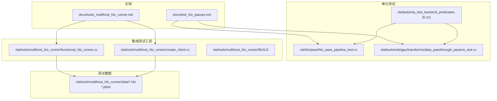
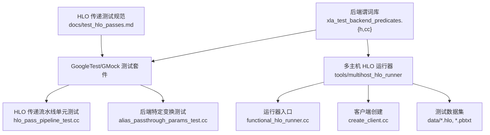
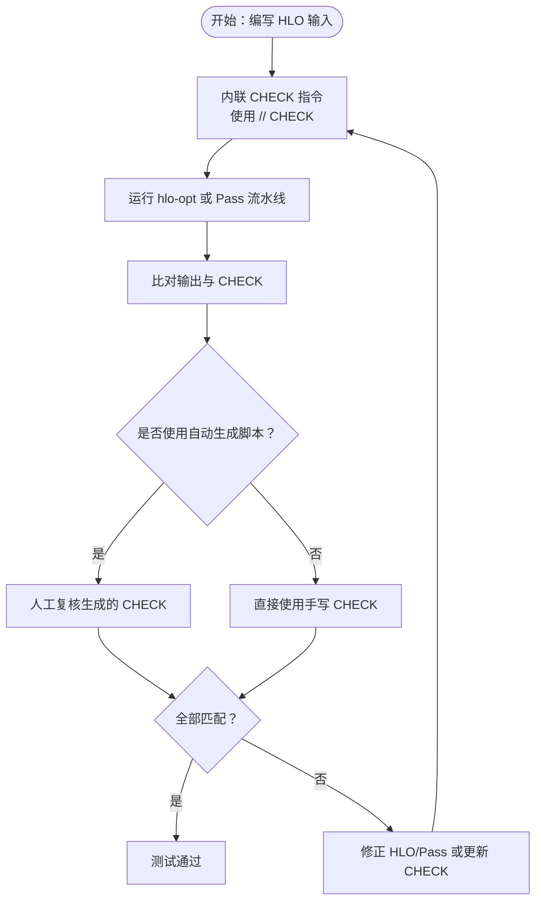
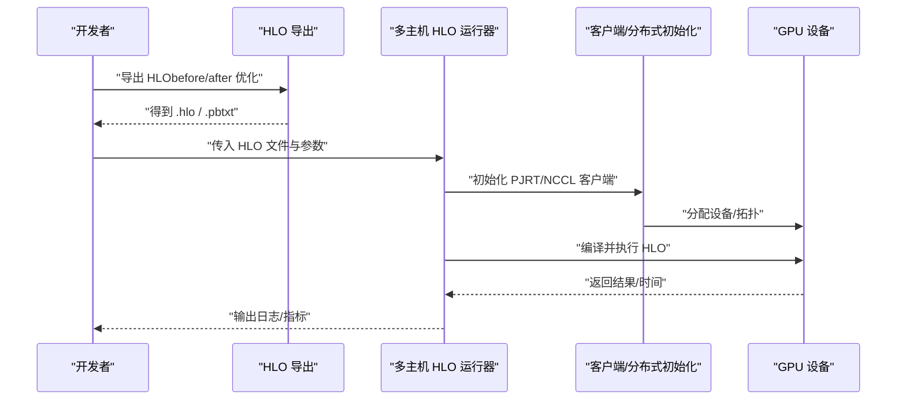
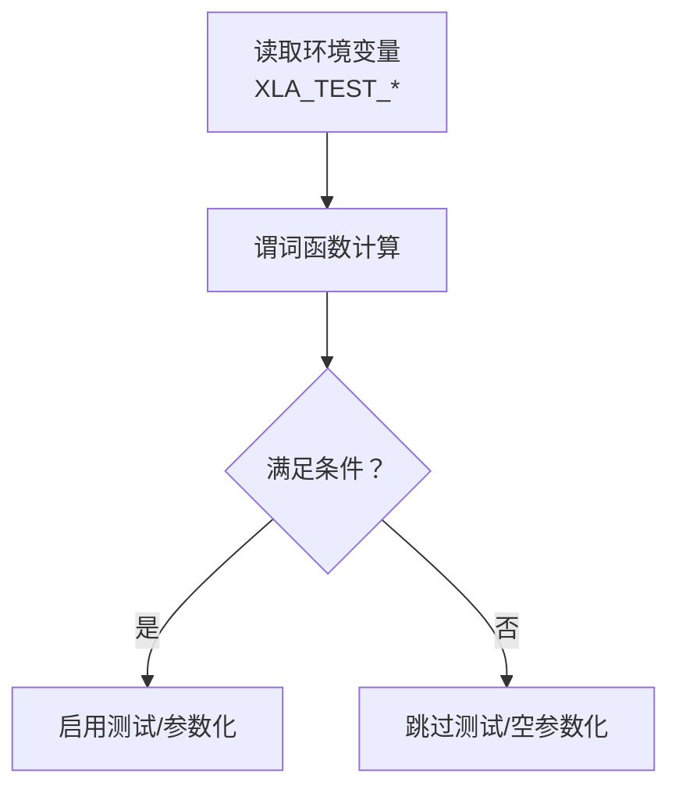
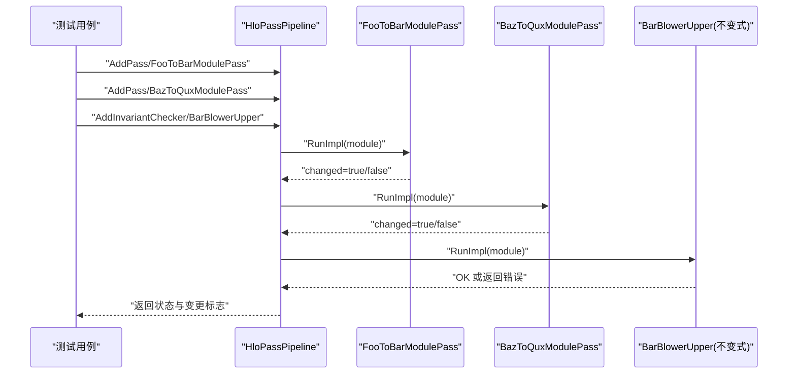
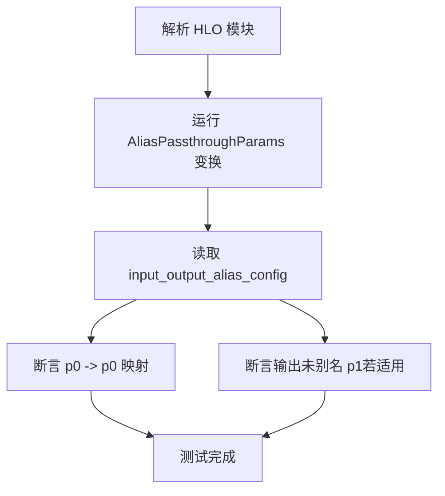
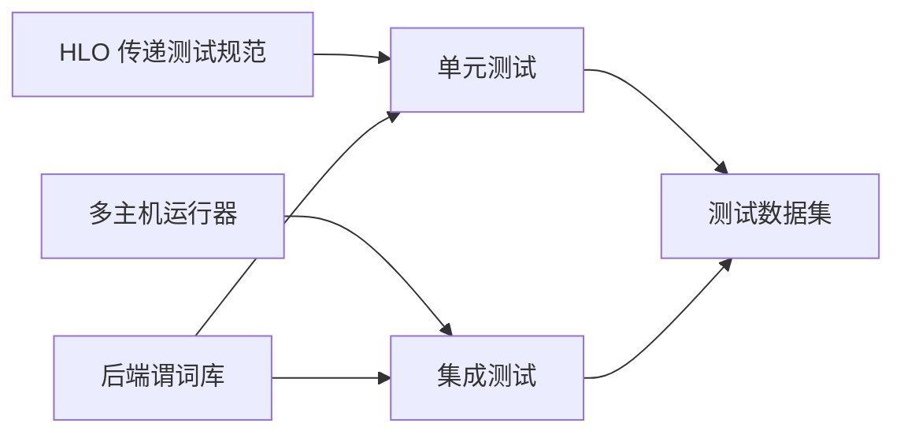

# 测试框架

<cite>
**本文引用的文件**
- [docs/test_hlo_passes.md](file://docs/test_hlo_passes.md)
- [docs/tools_multihost_hlo_runner.md](file://docs/tools_multihost_hlo_runner.md)
- [xla/tests/xla_test_backend_predicates.h](file://xla/tests/xla_test_backend_predicates.h)
- [xla/tests/xla_test_backend_predicates.cc](file://xla/tests/xla_test_backend_predicates.cc)
- [xla/hlo/pass/hlo_pass_pipeline_test.cc](file://xla/hlo/pass/hlo_pass_pipeline_test.cc)
- [xla/backends/gpu/transforms/alias_passthrough_params_test.cc](file://xla/backends/gpu/transforms/alias_passthrough_params_test.cc)
- [xla/tools/multihost_hlo_runner/functional_hlo_runner.cc](file://xla/tools/multihost_hlo_runner/functional_hlo_runner.cc)
- [xla/tools/multihost_hlo_runner/create_client.cc](file://xla/tools/multihost_hlo_runner/create_client.cc)
- [xla/tools/multihost_hlo_runner/BUILD](file://xla/tools/multihost_hlo_runner/BUILD)
- [xla/tools/multihost_hlo_runner/data/sharded_2_devices.hlo](file://xla/tools/multihost_hlo_runner/data/sharded_2_devices.hlo)
- [xla/tools/multihost_hlo_runner/data/single_device.hlo](file://xla/tools/multihost_hlo_runner/data/single_device.hlo)
- [xla/tools/multihost_hlo_runner/data/fp8_gemm_loop.hlo](file://xla/tools/multihost_hlo_runner/data/fp8_gemm_loop.hlo)
- [xla/tools/multihost_hlo_runner/data/transformer_engine_softmax.hlo](file://xla/tools/multihost_hlo_runner/data/transformer_engine_softmax.hlo)
- [xla/tools/multihost_hlo_runner/data/multiple_gemm_fusions.hlo](file://xla/tools/multihost_hlo_runner/data/multiple_gemm_fusions.hlo)
- [xla/tools/multihost_hlo_runner/data/auto_layout.hlo](file://xla/tools/multihost_hlo_runner/data/auto_layout.hlo)
- [xla/tools/multihost_hlo_runner/data/sharded_computation.hlo](file://xla/tools/multihost_hlo_runner/data/sharded_computation.hlo)
- [xla/tools/multihost_hlo_runner/data/while_with_known_trip_count.hlo](file://xla/tools/multihost_hlo_runner/data/while_with_known_trip_count.hlo)
- [xla/tools/multihost_hlo_runner/data/fixed_layout.hlo](file://xla/tools/multihost_hlo_runner/data/fixed_layout.hlo)
- [xla/tools/multihost_hlo_runner/data/dynamic_shaped_arguments.hlo](file://xla/tools/multihost_hlo_runner/data/dynamic_shaped_arguments.hlo)
- [xla/tools/multihost_hlo_runner/data/single_device_tupled.hlo](file://xla/tools/multihost_hlo_runner/data/single_device_tupled.hlo)
- [xla/tools/multihost_hlo_runner/data/single_gemm_fusion.hlo](file://xla/tools/multihost_hlo_runner/data/single_gemm_fusion.hlo)
- [xla/tools/multihost_hlo_runner/data/sharded_16_devices.hlo](file://xla/tools/multihost_hlo_runner/data/sharded_16_devices.hlo)
- [xla/tools/multihost_hlo_runner/data/sharded_unoptimized_hlo_snapshot.pbtxt](file://xla/tools/multihost_hlo_runner/data/sharded_unoptimized_hlo_snapshot.pbtxt)
</cite>

## 目录
1. [简介](#简介)
2. [项目结构](#项目结构)
3. [核心组件](#核心组件)
4. [架构总览](#架构总览)
5. [详细组件分析](#详细组件分析)
6. [依赖关系分析](#依赖关系分析)
7. [性能考量](#性能考量)
8. [故障排查指南](#故障排查指南)
9. [结论](#结论)
10. [附录](#附录)

## 简介
本文件系统性梳理 XLA 的测试体系，覆盖单元测试、集成测试、HLO 传递测试与多主机 HLO 运行器（Multi-Host HLO Runner）的架构、测试用例编写规范与执行流程，并提供可操作的测试示例路径、测试数据准备、断言方法与结果验证技巧。同时记录持续集成与性能回归检测相关实践，帮助开发者高效编写与维护高质量测试。

## 项目结构
XLA 的测试分布在多个层次：
- 文档层：提供 HLO 传递测试与多主机 HLO 运行器使用指南
- 单元测试层：以 GoogleTest/GMock 为主，覆盖 HLO 传递流水线、后端特定变换等
- 集成测试层：通过多主机 HLO 运行器在真实硬件或仿真环境下执行复杂 HLO 模块
- 工具与数据层：提供运行器、测试数据集与构建脚本

**图示来源**
- [docs/test_hlo_passes.md](file://docs/test_hlo_passes.md#L1-L88)
- [docs/tools_multihost_hlo_runner.md](file://docs/tools_multihost_hlo_runner.md#L1-L153)
- [xla/hlo/pass/hlo_pass_pipeline_test.cc](file://xla/hlo/pass/hlo_pass_pipeline_test.cc#L1-L391)
- [xla/backends/gpu/transforms/alias_passthrough_params_test.cc](file://xla/backends/gpu/transforms/alias_passthrough_params_test.cc#L1-L89)
- [xla/tests/xla_test_backend_predicates.h](file://xla/tests/xla_test_backend_predicates.h#L1-L118)
- [xla/tests/xla_test_backend_predicates.cc](file://xla/tests/xla_test_backend_predicates.cc#L1-L118)
- [xla/tools/multihost_hlo_runner/functional_hlo_runner.cc](file://xla/tools/multihost_hlo_runner/functional_hlo_runner.cc)
- [xla/tools/multihost_hlo_runner/create_client.cc](file://xla/tools/multihost_hlo_runner/create_client.cc)
- [xla/tools/multihost_hlo_runner/BUILD](file://xla/tools/multihost_hlo_runner/BUILD)

**章节来源**
- [docs/test_hlo_passes.md](file://docs/test_hlo_passes.md#L1-L88)
- [docs/tools_multihost_hlo_runner.md](file://docs/tools_multihost_hlo_runner.md#L1-L153)

## 核心组件
- HLO 传递测试规范与工具链：基于 FileCheck/LIT 的 HLO 传递测试方法，支持 CHECK 前缀与自动化生成脚本
- 多主机 HLO 运行器：支持单进程/多进程、单节点/多节点复现 HLO，便于集成测试与回归验证
- 后端谓词与参数化测试：通过环境变量驱动的后端谓词，实现跨设备/后端的条件跳过与参数化
- HLO 传递流水线单元测试：验证模块级传递的变更、不变与不变式检查器行为

**章节来源**
- [docs/test_hlo_passes.md](file://docs/test_hlo_passes.md#L1-L88)
- [docs/tools_multihost_hlo_runner.md](file://docs/tools_multihost_hlo_runner.md#L1-L153)
- [xla/tests/xla_test_backend_predicates.h](file://xla/tests/xla_test_backend_predicates.h#L1-L118)
- [xla/tests/xla_test_backend_predicates.cc](file://xla/tests/xla_test_backend_predicates.cc#L1-L118)
- [xla/hlo/pass/hlo_pass_pipeline_test.cc](file://xla/hlo/pass/hlo_pass_pipeline_test.cc#L1-L391)

## 架构总览
下图展示了测试框架的整体架构：文档指导层、测试实现层、工具与数据层之间的关系，以及关键执行路径。

**图示来源**
- [docs/test_hlo_passes.md](file://docs/test_hlo_passes.md#L1-L88)
- [xla/hlo/pass/hlo_pass_pipeline_test.cc](file://xla/hlo/pass/hlo_pass_pipeline_test.cc#L1-L391)
- [xla/backends/gpu/transforms/alias_passthrough_params_test.cc](file://xla/backends/gpu/transforms/alias_passthrough_params_test.cc#L1-L89)
- [xla/tools/multihost_hlo_runner/functional_hlo_runner.cc](file://xla/tools/multihost_hlo_runner/functional_hlo_runner.cc)
- [xla/tools/multihost_hlo_runner/create_client.cc](file://xla/tools/multihost_hlo_runner/create_client.cc)
- [xla/tools/multihost_hlo_runner/data/sharded_2_devices.hlo](file://xla/tools/multihost_hlo_runner/data/sharded_2_devices.hlo)
- [xla/tests/xla_test_backend_predicates.h](file://xla/tests/xla_test_backend_predicates.h#L1-L118)
- [xla/tests/xla_test_backend_predicates.cc](file://xla/tests/xla_test_backend_predicates.cc#L1-L118)

## 详细组件分析

### HLO 传递测试（FileCheck/LIT）
- 测试风格
  - 使用 FileCheck 在输入 HLO 中内联 CHECK 行，统一使用“// CHECK”作为分隔符
  - 推荐将 CHECK 与输入 IR 局部对齐，提升可读性与可维护性
  - 对于 GPU 测试，可结合 LIT 运行器与 hlo-opt，按后端目标生成对应前缀的 CHECK
- 自动化辅助
  - 提供 generate_hlo_test_checks.py 脚本，自动插入 CHECK 指令，需人工复核一致性
- 不推荐的做法
  - 避免遍历结果图进行逐节点匹配，此类测试难以阅读与调试

**图示来源**
- [docs/test_hlo_passes.md](file://docs/test_hlo_passes.md#L6-L87)

**章节来源**
- [docs/test_hlo_passes.md](file://docs/test_hlo_passes.md#L1-L88)

### 多主机 HLO 运行器（集成测试）
- 功能概述
  - 支持在单 GPU 或多 GPU 上运行 HLO 模块；可仅编译不运行
  - 支持单进程与多进程（MPI/SLURM），单节点与多节点场景
- 关键参数
  - --run=false：仅编译，必要时可利用持久化自动调优缓存
  - --hlo_argument_mode=uninitialized：减少初始化开销与主机内存占用
  - --run_xla_backend_only 或 --xla_disable_all_hlo_passes：避免重复编译导致的错误
- 典型流程
  - 从模型导出 HLO（before/after 优化）
  - 使用运行器在目标拓扑上复现，校验数值与性能指标

**图示来源**
- [docs/tools_multihost_hlo_runner.md](file://docs/tools_multihost_hlo_runner.md#L1-L153)
- [xla/tools/multihost_hlo_runner/functional_hlo_runner.cc](file://xla/tools/multihost_hlo_runner/functional_hlo_runner.cc)
- [xla/tools/multihost_hlo_runner/create_client.cc](file://xla/tools/multihost_hlo_runner/create_client.cc)

**章节来源**
- [docs/tools_multihost_hlo_runner.md](file://docs/tools_multihost_hlo_runner.md#L1-L153)

### 后端谓词与参数化测试
- 目标
  - 基于环境变量（XLA_TEST_DEVICE、XLA_TEST_DEVICE_TYPE、XLA_TEST_MODIFIERS）判断当前后端，动态启用/禁用测试或参数化输入
- 常用谓词
  - DeviceIs/DeviceTypeIs/HasModifiers/BackendLike/BackendIsExactly/BackendIsStrict
  - BackendSupportsFloat64/BackendSupportsComplex128
  - Empty<T>() 用于参数化测试中生成空输入集合
- 使用建议
  - 在测试套件中通过谓词包裹条件逻辑，必要时配合 GTEST_SKIP()/GTEST_ALLOW_UNINSTANTIATED_PARAMETERIZED_TEST()

**图示来源**
- [xla/tests/xla_test_backend_predicates.h](file://xla/tests/xla_test_backend_predicates.h#L25-L118)
- [xla/tests/xla_test_backend_predicates.cc](file://xla/tests/xla_test_backend_predicates.cc#L27-L118)

**章节来源**
- [xla/tests/xla_test_backend_predicates.h](file://xla/tests/xla_test_backend_predicates.h#L1-L118)
- [xla/tests/xla_test_backend_predicates.cc](file://xla/tests/xla_test_backend_predicates.cc#L1-L118)

### HLO 传递流水线单元测试
- 测试要点
  - 验证模块级传递是否改变图结构（changed/unchanged）
  - 异步线程执行流中的传递应用范围
  - 不变式检查器（Invariant Checker）在流水线中的失败传播
  - 传递元数据（Pass Metadata）的设置与校验
- 示例参考
  - 模块名重命名传递、根指令名称反转、混合流水线、不变式检查器失败、无变更场景

**图示来源**
- [xla/hlo/pass/hlo_pass_pipeline_test.cc](file://xla/hlo/pass/hlo_pass_pipeline_test.cc#L48-L352)

**章节来源**
- [xla/hlo/pass/hlo_pass_pipeline_test.cc](file://xla/hlo/pass/hlo_pass_pipeline_test.cc#L1-L391)

### 后端特定变换测试（示例：GPU 别名透传参数）
- 目标
  - 验证别名透传参数变换在 tuple 输出中的行为，确保不会对同一参数建立多重别名
- 断言要点
  - 通过 input_output_alias_config 获取别名映射，断言参数到参数的别名关系
  - 预设别名场景下的行为一致性

**图示来源**
- [xla/backends/gpu/transforms/alias_passthrough_params_test.cc](file://xla/backends/gpu/transforms/alias_passthrough_params_test.cc#L26-L85)

**章节来源**
- [xla/backends/gpu/transforms/alias_passthrough_params_test.cc](file://xla/backends/gpu/transforms/alias_passthrough_params_test.cc#L1-L89)

## 依赖关系分析
- 组件耦合
  - HLO 传递测试依赖文档规范与工具链（FileCheck/LIT/generate_hlo_test_checks.py）
  - 多主机运行器依赖 PJRT/NCCL 客户端与测试数据集
  - 后端谓词为所有测试提供统一的后端感知能力
- 外部依赖
  - GoogleTest/GMock 用于单元测试
  - Bazel 构建系统管理测试目标与运行器构建

**图示来源**
- [docs/test_hlo_passes.md](file://docs/test_hlo_passes.md#L1-L88)
- [docs/tools_multihost_hlo_runner.md](file://docs/tools_multihost_hlo_runner.md#L1-L153)
- [xla/tests/xla_test_backend_predicates.h](file://xla/tests/xla_test_backend_predicates.h#L1-L118)
- [xla/tools/multihost_hlo_runner/BUILD](file://xla/tools/multihost_hlo_runner/BUILD)

**章节来源**
- [docs/test_hlo_passes.md](file://docs/test_hlo_passes.md#L1-L88)
- [docs/tools_multihost_hlo_runner.md](file://docs/tools_multihost_hlo_runner.md#L1-L153)
- [xla/tools/multihost_hlo_runner/BUILD](file://xla/tools/multihost_hlo_runner/BUILD)

## 性能考量
- 测试数据准备
  - 使用 --hlo_argument_mode=uninitialized 减少初始化成本
  - 优先选择代表性 HLO（如单设备/多设备、融合/非融合、动态形状等）
- 执行策略
  - 将高成本 HLO 仅在 CI 的专用阶段运行，或按后端谓词条件化执行
  - 对 GPU 场景，合理设置 CUDA_VISIBLE_DEVICES 与 NCCL 参数
- 回归检测
  - 结合运行器输出的时间戳与吞吐指标，建立阈值告警
  - 对关键算子（如 GEMM、softmax）建立基准集，定期对比

[本节为通用指导，无需列出具体文件来源]

## 故障排查指南
- 多主机运行器常见问题
  - GPU 数量不足或 CUDA_VISIBLE_DEVICES 设置错误：检查设备可见性与数量
  - 运行优化后 HLO 报错：使用 --xla_disable_all_hlo_passes 或 --run_xla_backend_only
  - 多进程/多节点：确认 MPI/SLURM 环境变量传递正确
- HLO 传递测试
  - CHECK 不匹配：使用 generate_hlo_test_checks.py 生成候选 CHECK，再人工核对
  - 不变式检查器失败：定位失败传递并修正 PASS 名称或 HLO 输入
- 后端谓词
  - 环境变量缺失：确保通过 xla_test 宏设置 XLA_TEST_DEVICE/TYPE/MODIFIERS

**章节来源**
- [docs/tools_multihost_hlo_runner.md](file://docs/tools_multihost_hlo_runner.md#L36-L44)
- [docs/test_hlo_passes.md](file://docs/test_hlo_passes.md#L69-L87)
- [xla/tests/xla_test_backend_predicates.cc](file://xla/tests/xla_test_backend_predicates.cc#L41-L48)

## 结论
XLA 测试框架以文档规范为纲、以 GoogleTest 为核心、以多主机运行器为集成验证手段，辅以后端谓词与丰富的测试数据集，形成覆盖单元、传递与集成的完整测试体系。遵循本文的编写规范与执行流程，可显著提升测试质量与可维护性，并为持续集成与性能回归检测提供可靠支撑。

[本节为总结性内容，无需列出具体文件来源]

## 附录

### 测试用例编写规范速查
- HLO 传递测试
  - 内联 CHECK，使用“// CHECK”
  - 优先采用 LIT+FileCheck 流程
  - 自动生成 CHECK 后务必人工复核
- 多主机运行器
  - 明确 HLO 类型（before/after 优化）
  - 正确设置 --run/--run_xla_backend_only/--hlo_argument_mode
  - 多进程场景下确保环境变量传递
- 后端谓词
  - 使用谓词控制测试启用/跳过
  - 参数化测试中使用 Empty<T>() 生成空输入集

**章节来源**
- [docs/test_hlo_passes.md](file://docs/test_hlo_passes.md#L6-L87)
- [docs/tools_multihost_hlo_runner.md](file://docs/tools_multihost_hlo_runner.md#L14-L94)
- [xla/tests/xla_test_backend_predicates.h](file://xla/tests/xla_test_backend_predicates.h#L25-L118)

### 测试数据清单（示例）
- 单设备/多设备 HLO
  - [single_device.hlo](file://xla/tools/multihost_hlo_runner/data/single_device.hlo)
  - [sharded_2_devices.hlo](file://xla/tools/multihost_hlo_runner/data/sharded_2_devices.hlo)
  - [sharded_16_devices.hlo](file://xla/tools/multihost_hlo_runner/data/sharded_16_devices.hlo)
- 特定算子/模式
  - [single_gemm_fusion.hlo](file://xla/tools/multihost_hlo_runner/data/single_gemm_fusion.hlo)
  - [multiple_gemm_fusions.hlo](file://xla/tools/multihost_hlo_runner/data/multiple_gemm_fusions.hlo)
  - [fp8_gemm_loop.hlo](file://xla/tools/multihost_hlo_runner/data/fp8_gemm_loop.hlo)
  - [transformer_engine_softmax.hlo](file://xla/tools/multihost_hlo_runner/data/transformer_engine_softmax.hlo)
- 布局与形状
  - [auto_layout.hlo](file://xla/tools/multihost_hlo_runner/data/auto_layout.hlo)
  - [fixed_layout.hlo](file://xla/tools/multihost_hlo_runner/data/fixed_layout.hlo)
  - [dynamic_shaped_arguments.hlo](file://xla/tools/multihost_hlo_runner/data/dynamic_shaped_arguments.hlo)
- 复杂控制流
  - [while_with_known_trip_count.hlo](file://xla/tools/multihost_hlo_runner/data/while_with_known_trip_count.hlo)
- 组合/嵌套
  - [sharded_computation.hlo](file://xla/tools/multihost_hlo_runner/data/sharded_computation.hlo)
  - [single_device_tupled.hlo](file://xla/tools/multihost_hlo_runner/data/single_device_tupled.hlo)
- 未优化快照
  - [sharded_unoptimized_hlo_snapshot.pbtxt](file://xla/tools/multihost_hlo_runner/data/sharded_unoptimized_hlo_snapshot.pbtxt)

**章节来源**
- [xla/tools/multihost_hlo_runner/data/single_device.hlo](file://xla/tools/multihost_hlo_runner/data/single_device.hlo)
- [xla/tools/multihost_hlo_runner/data/sharded_2_devices.hlo](file://xla/tools/multihost_hlo_runner/data/sharded_2_devices.hlo)
- [xla/tools/multihost_hlo_runner/data/sharded_16_devices.hlo](file://xla/tools/multihost_hlo_runner/data/sharded_16_devices.hlo)
- [xla/tools/multihost_hlo_runner/data/single_gemm_fusion.hlo](file://xla/tools/multihost_hlo_runner/data/single_gemm_fusion.hlo)
- [xla/tools/multihost_hlo_runner/data/multiple_gemm_fusions.hlo](file://xla/tools/multihost_hlo_runner/data/multiple_gemm_fusions.hlo)
- [xla/tools/multihost_hlo_runner/data/fp8_gemm_loop.hlo](file://xla/tools/multihost_hlo_runner/data/fp8_gemm_loop.hlo)
- [xla/tools/multihost_hlo_runner/data/transformer_engine_softmax.hlo](file://xla/tools/multihost_hlo_runner/data/transformer_engine_softmax.hlo)
- [xla/tools/multihost_hlo_runner/data/auto_layout.hlo](file://xla/tools/multihost_hlo_runner/data/auto_layout.hlo)
- [xla/tools/multihost_hlo_runner/data/fixed_layout.hlo](file://xla/tools/multihost_hlo_runner/data/fixed_layout.hlo)
- [xla/tools/multihost_hlo_runner/data/dynamic_shaped_arguments.hlo](file://xla/tools/multihost_hlo_runner/data/dynamic_shaped_arguments.hlo)
- [xla/tools/multihost_hlo_runner/data/while_with_known_trip_count.hlo](file://xla/tools/multihost_hlo_runner/data/while_with_known_trip_count.hlo)
- [xla/tools/multihost_hlo_runner/data/sharded_computation.hlo](file://xla/tools/multihost_hlo_runner/data/sharded_computation.hlo)
- [xla/tools/multihost_hlo_runner/data/single_device_tupled.hlo](file://xla/tools/multihost_hlo_runner/data/single_device_tupled.hlo)
- [xla/tools/multihost_hlo_runner/data/sharded_unoptimized_hlo_snapshot.pbtxt](file://xla/tools/multihost_hlo_runner/data/sharded_unoptimized_hlo_snapshot.pbtxt)