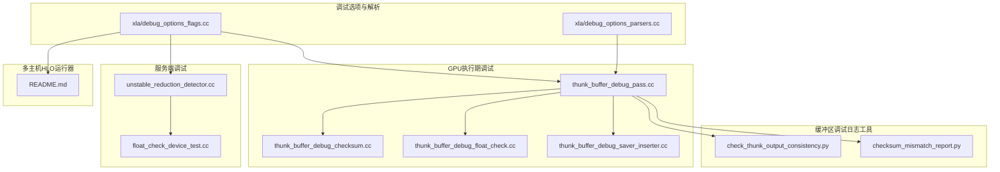
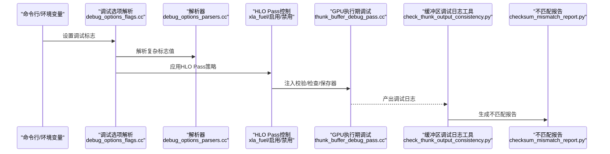
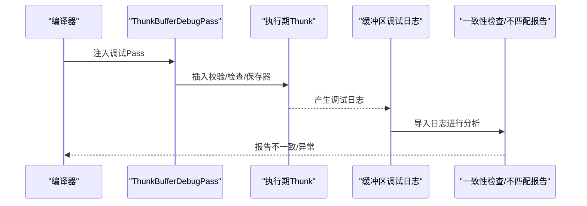
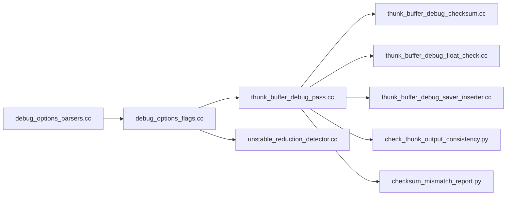

# 调试工具

<cite>
**本文引用的文件**
- [xla\debug_options_flags.cc](file://xla/debug_options_flags.cc)
- [xla\debug_options_parsers.cc](file://xla/debug_options_parsers.cc)
- [xla\backends\gpu\runtime\thunk_buffer_debug_pass.cc](file://xla/backends/gpu/runtime/thunk_buffer_debug_pass.cc)
- [xla\backends\gpu\runtime\thunk_buffer_debug_checksum.cc](file://xla/backends/gpu/runtime/thunk_buffer_debug_checksum.cc)
- [xla\backends\gpu\runtime\thunk_buffer_debug_float_check.cc](file://xla/backends/gpu/runtime/thunk_buffer_debug_float_check.cc)
- [xla\backends\gpu\runtime\thunk_buffer_debug_saver_inserter.cc](file://xla/backends/gpu/runtime/thunk_buffer_debug_saver_inserter.cc)
- [xla\service\debug\unstable_reduction_detector.cc](file://xla/service/debug/unstable_reduction_detector.cc)
- [xla\service\debug\float_check_device_test.cc](file://xla/service/debug/float_check_device_test.cc)
- [xla\tools\buffer_debug_log\check_thunk_output_consistency.py](file://xla/tools/buffer_debug_log/check_thunk_output_consistency.py)
- [xla\tools\buffer_debug_log\checksum_mismatch_report.py](file://xla/tools/buffer_debug_log/checksum_mismatch_report.py)
- [xla\tools\multihost_hlo_runner\README.md](file://xla/tools/multihost_hlo_runner/README.md)
</cite>

## 目录
1. [简介](#简介)
2. [项目结构](#项目结构)
3. [核心组件](#核心组件)
4. [架构总览](#架构总览)
5. [组件详解](#组件详解)
6. [依赖关系分析](#依赖关系分析)
7. [性能考量](#性能考量)
8. [故障排查指南](#故障排查指南)
9. [结论](#结论)
10. [附录](#附录)

## 简介
本文件系统性梳理XLA中的调试工具链，重点覆盖以下三类能力：
- HLO反向二分查找工具：用于定位导致错误或性能退化的HLO优化步骤，支持基于“燃料”（fuel）机制控制优化执行范围，结合日志与可视化输出辅助定位。
- HLO优化工具：通过命令行开关启用/禁用特定HLO Pass，或仅运行指定Pass集合，配合HLO转储与HTML可视化，快速验证优化效果。
- 服务端调试工具：面向GPU执行路径的缓冲区一致性校验、浮点数值检查与缓冲区保存器插入，以及不稳定的归约算子检测，帮助发现数值稳定性与内存问题。

文档提供各工具的使用场景、操作方法、命令行示例、工作流程、最佳实践与常见问题解决方案，并解释配置项、输出格式与结果解读方法。

## 项目结构
围绕调试工具的相关代码主要分布在如下位置：
- 调试选项与解析：xla/debug_options_flags.cc、xla/debug_options_parsers.cc
- GPU执行期调试：xla/backends/gpu/runtime 下的 thunk_buffer_debug_* 相关实现
- 服务端不稳定归约检测：xla/service/debug/unstable_reduction_detector.cc
- 缓冲区调试日志工具：xla/tools/buffer_debug_log 下的 Python 工具
- 多主机HLO运行器：xla/tools/multihost_hlo_runner/README.md

图表来源
- [xla/debug_options_flags.cc](file://xla/debug_options_flags.cc#L557-L800)
- [xla/debug_options_parsers.cc](file://xla/debug_options_parsers.cc#L28-L73)
- [xla/backends/gpu/runtime/thunk_buffer_debug_pass.cc](file://xla/backends/gpu/runtime/thunk_buffer_debug_pass.cc#L35-L65)
- [xla/backends/gpu/runtime/thunk_buffer_debug_checksum.cc](file://xla/backends/gpu/runtime/thunk_buffer_debug_checksum.cc)
- [xla/backends/gpu/runtime/thunk_buffer_debug_float_check.cc](file://xla/backends/gpu/runtime/thunk_buffer_debug_float_check.cc)
- [xla/backends/gpu/runtime/thunk_buffer_debug_saver_inserter.cc](file://xla/backends/gpu/runtime/thunk_buffer_debug_saver_inserter.cc)
- [xla/service/debug/unstable_reduction_detector.cc](file://xla/service/debug/unstable_reduction_detector.cc#L77-L105)
- [xla/service/debug/float_check_device_test.cc](file://xla/service/debug/float_check_device_test.cc)
- [xla/tools/buffer_debug_log/check_thunk_output_consistency.py](file://xla/tools/buffer_debug_log/check_thunk_output_consistency.py)
- [xla/tools/buffer_debug_log/checksum_mismatch_report.py](file://xla/tools/buffer_debug_log/checksum_mismatch_report.py)
- [xla/tools/multihost_hlo_runner/README.md](file://xla/tools/multihost_hlo_runner/README.md#L1-L3)

章节来源
- [xla/debug_options_flags.cc](file://xla/debug_options_flags.cc#L557-L800)
- [xla/debug_options_parsers.cc](file://xla/debug_options_parsers.cc#L28-L73)
- [xla/backends/gpu/runtime/thunk_buffer_debug_pass.cc](file://xla/backends/gpu/runtime/thunk_buffer_debug_pass.cc#L35-L65)
- [xla/service/debug/unstable_reduction_detector.cc](file://xla/service/debug/unstable_reduction_detector.cc#L77-L105)
- [xla/tools/buffer_debug_log/check_thunk_output_consistency.py](file://xla/tools/buffer_debug_log/check_thunk_output_consistency.py)
- [xla/tools/buffer_debug_log/checksum_mismatch_report.py](file://xla/tools/buffer_debug_log/checksum_mismatch_report.py)
- [xla/tools/multihost_hlo_runner/README.md](file://xla/tools/multihost_hlo_runner/README.md#L1-L3)

## 核心组件
- 调试选项与标志系统
  - 提供大量可调参数，涵盖HLO Pass启用/禁用、HLO转储、图形化可视化、GPU执行期调试开关、不稳定性检测模式等。
  - 支持“燃料”（xla_fuel）机制，按Pass粒度限制执行次数，便于反向二分定位问题Pass。
- GPU执行期调试管线
  - 在Thunk序列上注入缓冲区校验、浮点数检查与缓冲区保存器，用于运行时数据一致性与数值稳定性检测。
- 不稳定归约检测器
  - 扫描模块中的归约算子，依据配置决定是否告警或失败，辅助定位数值不稳定的计算路径。
- 缓冲区调试日志工具
  - 提供Python脚本对缓冲区调试日志进行一致性检查与不匹配报告生成，辅助离线分析。
- 多主机HLO运行器
  - 提供跨主机的HLO执行与对比工具，便于分布式场景下的HLO一致性验证。

章节来源
- [xla/debug_options_flags.cc](file://xla/debug_options_flags.cc#L172-L507)
- [xla/backends/gpu/runtime/thunk_buffer_debug_pass.cc](file://xla/backends/gpu/runtime/thunk_buffer_debug_pass.cc#L35-L65)
- [xla/service/debug/unstable_reduction_detector.cc](file://xla/service/debug/unstable_reduction_detector.cc#L77-L105)
- [xla/tools/buffer_debug_log/check_thunk_output_consistency.py](file://xla/tools/buffer_debug_log/check_thunk_output_consistency.py)
- [xla/tools/multihost_hlo_runner/README.md](file://xla/tools/multihost_hlo_runner/README.md#L1-L3)

## 架构总览
下图展示了从调试选项到执行期调试与日志分析的整体链路：

图表来源
- [xla/debug_options_flags.cc](file://xla/debug_options_flags.cc#L557-L800)
- [xla/debug_options_parsers.cc](file://xla/debug_options_parsers.cc#L28-L73)
- [xla/backends/gpu/runtime/thunk_buffer_debug_pass.cc](file://xla/backends/gpu/runtime/thunk_buffer_debug_pass.cc#L35-L65)
- [xla/tools/buffer_debug_log/check_thunk_output_consistency.py](file://xla/tools/buffer_debug_log/check_thunk_output_consistency.py)
- [xla/tools/buffer_debug_log/checksum_mismatch_report.py](file://xla/tools/buffer_debug_log/checksum_mismatch_report.py)

## 组件详解

### HLO反向二分查找工具
- 功能概述
  - 基于“燃料”（fuel）机制，按HLO Pass粒度限制执行次数，逐步缩小问题范围；结合HLO转储与可视化，定位导致错误或性能退化的Pass。
- 使用场景
  - 编译时间过长、运行时异常、数值不一致等需要快速定位具体优化步骤。
- 操作方法与命令行示例
  - 启用/禁用特定HLO Pass：
    - 启用：--xla_enable_hlo_passes_only=PassA,PassB
    - 禁用：--xla_disable_hlo_passes=PassC,PassD
  - 仅运行指定Pass集合：
    - --xla_enable_hlo_passes_only=...
  - 控制执行范围（反向二分）：
    - --xla_fuel=PassA=1,PassB=1,...（逐个Pass尝试）
  - 配合HLO转储：
    - --xla_dump_hlo_as_html=true
    - --xla_dump_hlo_as_long_text=true
    - --xla_dump_enable_mlir_pretty_form=true
- 工作流程
  1) 初始全量Pass运行，确认问题存在。
  2) 使用--xla_fuel为可疑Pass设置较小燃料，逐步剔除无影响的Pass。
  3) 结合HLO转储与可视化比对，定位具体Pass。
- 最佳实践
  - 先用--xla_enable_hlo_passes_only限定目标Pass集合，再用--xla_fuel进行二分。
  - 保留HLO转储以便回溯分析。
- 常见问题
  - 燃料设置不当导致Pass未被执行：检查--xla_fuel格式与Pass名称大小写。
  - HLO转储过大：调整--xla_dump_max_hlo_modules与--xla_dump_include_timestamp。

章节来源
- [xla/debug_options_flags.cc](file://xla/debug_options_flags.cc#L636-L654)
- [xla/debug_options_flags.cc](file://xla/debug_options_flags.cc#L763-L800)
- [xla/debug_options_flags.cc](file://xla/debug_options_flags.cc#L196-L206)

### HLO优化工具
- 功能概述
  - 通过命令行开关控制HLO Pass的启用/禁用，支持增量修改（+/-）与前缀自动补全，便于精细调整优化序列。
- 使用场景
  - 验证某次优化是否引入回归；对比不同优化组合的性能与正确性。
- 操作方法与命令行示例
  - 增量修改重复枚举标志：
    - --xla_enable_hlo_passes_only=+PassA,-PassB
  - 清空后新增：
    - --xla_enable_hlo_passes_only=PassC,PassD
- 输出与结果解读
  - HLO转储文件（HTML/文本/MLIR美化形式）用于对比优化前后差异。
  - 可视化图谱有助于理解融合、布局与分配变化。
- 最佳实践
  - 将关键Pass分组，先验证小组合，再扩展到完整序列。
  - 与--xla_dump_module_metadata配合，获取更丰富的元信息。

章节来源
- [xla/debug_options_flags.cc](file://xla/debug_options_flags.cc#L64-L101)
- [xla/debug_options_flags.cc](file://xla/debug_options_flags.cc#L196-L206)
- [xla/debug_options_flags.cc](file://xla/debug_options_flags.cc#L557-L655)

### 服务端调试工具（GPU执行期）
- 功能概述
  - 在Thunk序列中注入缓冲区校验、浮点数检查与缓冲区保存器，用于运行时数据一致性与数值稳定性检测。
- 使用场景
  - 运行时出现NaN/Inf、缓冲区越界、中间结果不一致等问题。
- 操作方法与命令行示例
  - 开启缓冲区校验：
    - --xla_gpu_experimental_enable_checksum_tracing_on_thunks=true
  - 开启浮点数检查：
    - --xla_gpu_detect_nan=DETECTION_MODE_FAIL
    - --xla_gpu_detect_inf=DETECTION_MODE_FAIL
  - 开启缓冲区保存器：
    - --xla_gpu_experimental_enable_buffer_saver_on_thunks=true
- 工作流程
  1) 在编译阶段注入调试Pass（thunk_buffer_debug_pass.cc）。
  2) 运行时执行Thunk序列，触发校验/检查/保存逻辑。
  3) 通过日志与缓冲区调试日志工具进行离线分析。
- 最佳实践
  - 优先开启校验与浮点检查，定位问题后再开启缓冲区保存器以降低开销。
  - 结合HLO转储与执行日志，建立“输入→中间结果→输出”的证据链。
- 常见问题
  - 浮点检查误报：根据模型特性调整检测模式（告警/失败）。
  - 保存器导致性能下降：仅在问题复现时临时开启。

图表来源
- [xla/backends/gpu/runtime/thunk_buffer_debug_pass.cc](file://xla/backends/gpu/runtime/thunk_buffer_debug_pass.cc#L35-L65)
- [xla/backends/gpu/runtime/thunk_buffer_debug_checksum.cc](file://xla/backends/gpu/runtime/thunk_buffer_debug_checksum.cc)
- [xla/backends/gpu/runtime/thunk_buffer_debug_float_check.cc](file://xla/backends/gpu/runtime/thunk_buffer_debug_float_check.cc)
- [xla/backends/gpu/runtime/thunk_buffer_debug_saver_inserter.cc](file://xla/backends/gpu/runtime/thunk_buffer_debug_saver_inserter.cc)
- [xla/tools/buffer_debug_log/check_thunk_output_consistency.py](file://xla/tools/buffer_debug_log/check_thunk_output_consistency.py)
- [xla/tools/buffer_debug_log/checksum_mismatch_report.py](file://xla/tools/buffer_debug_log/checksum_mismatch_report.py)

章节来源
- [xla/backends/gpu/runtime/thunk_buffer_debug_pass.cc](file://xla/backends/gpu/runtime/thunk_buffer_debug_pass.cc#L35-L65)
- [xla/backends/gpu/runtime/thunk_buffer_debug_checksum.cc](file://xla/backends/gpu/runtime/thunk_buffer_debug_checksum.cc)
- [xla/backends/gpu/runtime/thunk_buffer_debug_float_check.cc](file://xla/backends/gpu/runtime/thunk_buffer_debug_float_check.cc)
- [xla/backends/gpu/runtime/thunk_buffer_debug_saver_inserter.cc](file://xla/backends/gpu/runtime/thunk_buffer_debug_saver_inserter.cc)
- [xla/tools/buffer_debug_log/check_thunk_output_consistency.py](file://xla/tools/buffer_debug_log/check_thunk_output_consistency.py)
- [xla/tools/buffer_debug_log/checksum_mismatch_report.py](file://xla/tools/buffer_debug_log/checksum_mismatch_report.py)

### 不稳定归约检测器
- 功能概述
  - 扫描HLO模块中的归约算子，依据配置决定是否告警或失败，辅助定位数值不稳定的计算路径。
- 使用场景
  - 训练/推理过程中出现梯度爆炸、损失震荡或结果不可复现。
- 操作方法与命令行示例
  - 设置检测模式：
    - --xla_detect_unstable_reductions=DETECTION_MODE_FAIL
    - --xla_detect_unstable_reductions_post_optimizations=DETECTION_MODE_WARN
- 工作流程
  1) 编译阶段启用检测器。
  2) 运行时扫描模块，收集不稳定归约列表。
  3) 根据配置输出警告或抛出错误。
- 最佳实践
  - 在开发阶段使用DETECTION_MODE_WARN，在CI中使用DETECTION_MODE_FAIL。
  - 结合源码元数据输出，定位具体算子来源。
- 常见问题
  - 检测误报：检查归约类型与数值范围，必要时放宽阈值或禁用特定检测。

章节来源
- [xla/service/debug/unstable_reduction_detector.cc](file://xla/service/debug/unstable_reduction_detector.cc#L77-L105)

### 多主机HLO运行器
- 功能概述
  - 提供跨主机的HLO执行与对比工具，便于分布式场景下的HLO一致性验证。
- 使用场景
  - 多设备/多进程环境下验证HLO生成一致性与执行行为。
- 操作方法与命令行示例
  - 参考公共文档与源码注释中的入口说明，结合多主机配置运行。
- 最佳实践
  - 先在单机验证，再扩展到多机；确保环境变量与设备可见性一致。
- 常见问题
  - 设备可见性差异导致结果不一致：统一设备枚举与环境变量。

章节来源
- [xla/tools/multihost_hlo_runner/README.md](file://xla/tools/multihost_hlo_runner/README.md#L1-L3)

## 依赖关系分析
- 调试选项与解析
  - debug_options_flags.cc 提供标志注册与Setter，debug_options_parsers.cc 提供复杂标志解析（如区间、枚举增删）。
- 执行期调试
  - thunk_buffer_debug_pass.cc 作为入口，调度 checksum、float_check、saver_inserter 三类功能。
- 服务端检测
  - unstable_reduction_detector.cc 读取DebugOptions配置，扫描HLO模块并按策略输出。
- 日志与报告
  - Python工具对GPU生成的调试日志进行一致性检查与不匹配报告生成。

图表来源
- [xla/debug_options_flags.cc](file://xla/debug_options_flags.cc#L557-L800)
- [xla/debug_options_parsers.cc](file://xla/debug_options_parsers.cc#L28-L73)
- [xla/backends/gpu/runtime/thunk_buffer_debug_pass.cc](file://xla/backends/gpu/runtime/thunk_buffer_debug_pass.cc#L35-L65)
- [xla/backends/gpu/runtime/thunk_buffer_debug_checksum.cc](file://xla/backends/gpu/runtime/thunk_buffer_debug_checksum.cc)
- [xla/backends/gpu/runtime/thunk_buffer_debug_float_check.cc](file://xla/backends/gpu/runtime/thunk_buffer_debug_float_check.cc)
- [xla/backends/gpu/runtime/thunk_buffer_debug_saver_inserter.cc](file://xla/backends/gpu/runtime/thunk_buffer_debug_saver_inserter.cc)
- [xla/service/debug/unstable_reduction_detector.cc](file://xla/service/debug/unstable_reduction_detector.cc#L77-L105)
- [xla/tools/buffer_debug_log/check_thunk_output_consistency.py](file://xla/tools/buffer_debug_log/check_thunk_output_consistency.py)
- [xla/tools/buffer_debug_log/checksum_mismatch_report.py](file://xla/tools/buffer_debug_log/checksum_mismatch_report.py)

## 性能考量
- 燃料（xla_fuel）机制
  - 通过限制特定Pass的执行次数，显著缩短定位时间；建议从最小可行集合开始二分。
- 执行期调试开销
  - 校验与保存器会增加带宽与延迟，仅在问题复现阶段启用；浮点检查可在失败模式下减少误报。
- HLO转储
  - HTML/MLIR美化转储便于分析但体积较大，建议在定位完成后关闭或限制数量。

## 故障排查指南
- HLO反向二分定位失败
  - 检查--xla_fuel格式与Pass名称大小写；确认--xla_enable_hlo_passes_only与--xla_disable_hlo_passes无冲突。
- 执行期崩溃或异常
  - 开启--xla_gpu_experimental_enable_checksum_tracing_on_thunks与--xla_gpu_experimental_enable_buffer_saver_on_thunks，结合日志工具进行离线分析。
- NaN/Inf传播
  - 使用--xla_gpu_detect_nan=DETECTION_MODE_FAIL与--xla_gpu_detect_inf=DETECTION_MODE_FAIL快速定位；随后缩小到具体算子。
- 不稳定归约
  - 在开发阶段使用DETECTION_MODE_WARN，CI中使用DETECTION_MODE_FAIL；结合源码元数据定位。

章节来源
- [xla/debug_options_flags.cc](file://xla/debug_options_flags.cc#L636-L654)
- [xla/debug_options_flags.cc](file://xla/debug_options_flags.cc#L763-L800)
- [xla/backends/gpu/runtime/thunk_buffer_debug_pass.cc](file://xla/backends/gpu/runtime/thunk_buffer_debug_pass.cc#L35-L65)
- [xla/service/debug/unstable_reduction_detector.cc](file://xla/service/debug/unstable_reduction_detector.cc#L77-L105)

## 结论
XLA调试工具链通过“调试选项—执行期调试—日志分析—不稳定检测”的闭环，为HLO优化与执行期问题提供了系统化的定位手段。建议在日常开发中优先使用HLO反向二分与不稳定归约检测，在问题复现阶段启用执行期调试与日志分析工具，以获得高效率与高精度的调试体验。

## 附录
- 关键配置项速查
  - HLO Pass控制：--xla_enable_hlo_passes_only、--xla_disable_hlo_passes
  - 燃料控制：--xla_fuel
  - HLO转储：--xla_dump_hlo_as_html、--xla_dump_hlo_as_long_text、--xla_dump_enable_mlir_pretty_form
  - 执行期调试：--xla_gpu_experimental_enable_checksum_tracing_on_thunks、--xla_gpu_experimental_enable_buffer_saver_on_thunks、--xla_gpu_detect_nan、--xla_gpu_detect_inf
  - 不稳定归约：--xla_detect_unstable_reductions、--xla_detect_unstable_reductions_post_optimizations