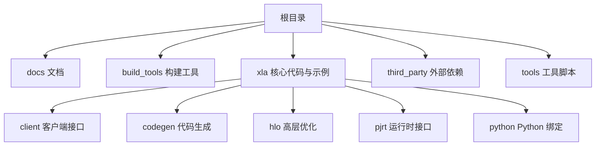
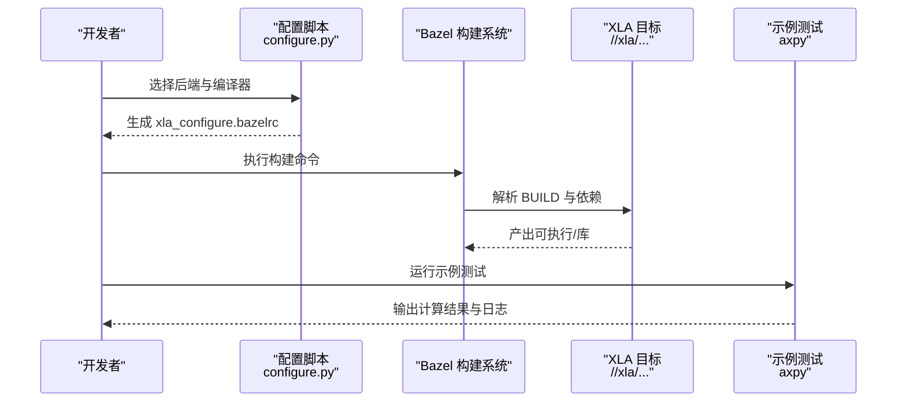
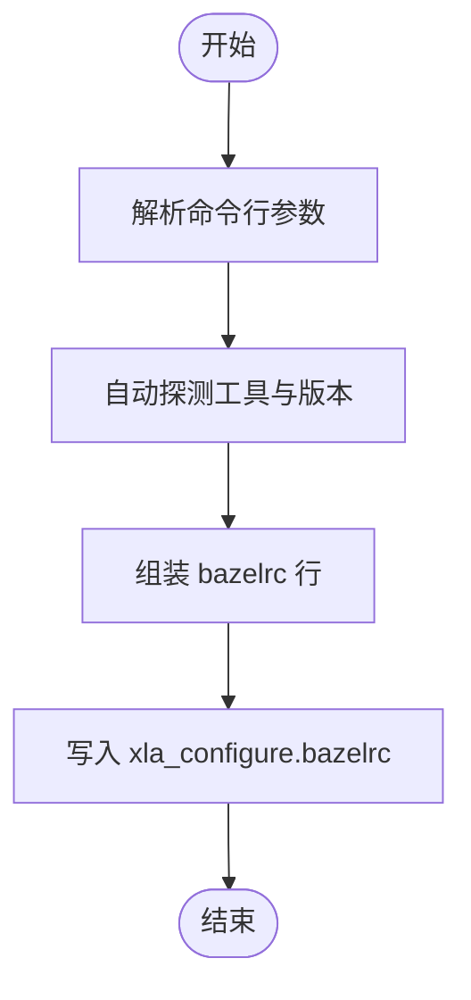
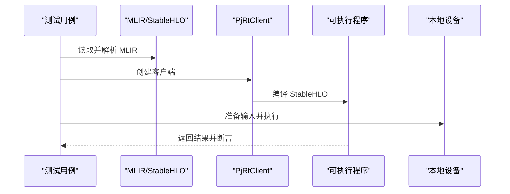

# 快速开始

<cite>
**本文引用的文件**
- [README.md](file://README.md)
- [docs/developer_guide.md](file://docs/developer_guide.md)
- [docs/build_from_source.md](file://docs/build_from_source.md)
- [docs/developer_environment.md](file://docs/developer_environment.md)
- [docs/contributing.md](file://docs/contributing.md)
- [build_tools/configure/configure.py](file://build_tools/configure/configure.py)
- [xla/examples/axpy/README.md](file://xla/examples/axpy/README.md)
- [xla/examples/axpy/stablehlo_axpy.mlir](file://xla/examples/axpy/stablehlo_axpy.mlir)
- [requirements_lock_3_12.txt](file://requirements_lock_3_12.txt)
</cite>

## 目录
1. [简介](#简介)
2. [项目结构](#项目结构)
3. [核心组件](#核心组件)
4. [架构总览](#架构总览)
5. [详细组件分析](#详细组件分析)
6. [依赖关系分析](#依赖关系分析)
7. [性能考虑](#性能考虑)
8. [故障排查指南](#故障排查指南)
9. [结论](#结论)
10. [附录](#附录)

## 简介
本“快速开始”面向三类用户：
- ML 框架使用者：通过各自生态（如 PyTorch、TensorFlow、JAX）使用 XLA 编译与加速推理/训练，无需直接克隆或构建 XLA 仓库。
- XLA 贡献者与集成开发者：需要在本地搭建可构建、可测试的开发环境，并能运行示例与测试。
- 硬件后端开发者：需要针对特定后端（CPU/GPU/ROCm/SYCL）进行配置与验证。

本指南覆盖安装、开发环境配置、基础构建步骤、简单示例，以及常见问题与优化建议，帮助你从零开始顺利运行第一个 XLA 程序。

## 项目结构
XLA 采用模块化组织，核心目录与用途概览：
- docs：官方文档，包含开发者指南、构建说明、贡献流程等
- build_tools：构建与配置工具链，含 configure 脚本、CI 工具、第三方依赖管理等
- xla：XLA 核心源码与示例，按功能域划分（client、codegen、hlo、pjrt、python 等）
- third_party：外部依赖（如 MLIR、StableHLO、CUDA/cuDNN、ROCm、SYCL 等）
- tools：CI/工具脚本与交叉编译工具链

章节来源
- file://README.md#L1-L50

## 核心组件
- 构建配置与环境
  - 使用配置脚本生成 bazelrc，自动检测并注入编译器、CUDA/cuDNN/NCCL、计算能力等参数
  - 支持 CPU/GPU/ROCm/SYCL 后端选择与编译器组合
- 开发者环境
  - 推荐使用 ml-build 容器镜像，内置 Clang 与构建工具
  - 提供 LSP/clangd 的 compile_commands.json 生成方法
- 示例与最小工作流
  - StableHLO axpy 示例展示从 MLIR 到可执行程序的完整流程
- 依赖锁定
  - 提供 Python 依赖版本锁定清单，便于复现环境

章节来源
- file://docs/developer_guide.md#L33-L124
- file://docs/build_from_source.md#L8-L184
- file://docs/developer_environment.md#L1-L71
- file://xla/examples/axpy/README.md#L1-L190
- file://requirements_lock_3_12.txt#L1-L116

## 架构总览
下图展示了从配置到构建、再到示例运行的端到端流程：

图表来源
- [build_tools/configure/configure.py](file://build_tools/configure/configure.py#L574-L625)
- [docs/build_from_source.md](file://docs/build_from_source.md#L8-L184)
- [xla/examples/axpy/README.md](file://xla/examples/axpy/README.md#L149-L190)

## 详细组件分析

### 组件一：构建配置与编译器选择
- 功能要点
  - 自动发现并注入 Clang/GCC、lld、CUDA/cuDNN/NCCL、计算能力等
  - 生成 bazelrc，包含后端与编译器组合、标签过滤、编译选项等
  - 支持 hermetic（隔离）构建，减少宿主环境差异
- 关键流程
  - 解析参数（后端、主机编译器、CUDA/ROCm/SYCL 编译器、计算能力等）
  - 自动探测工具与版本（如 nvidia-smi 获取计算能力）
  - 写入 xla_configure.bazelrc，供 Bazel 读取

图表来源
- [build_tools/configure/configure.py](file://build_tools/configure/configure.py#L475-L625)

章节来源
- file://build_tools/configure/configure.py#L16-L625

### 组件二：开发者环境与 LSP/clangd
- LSP 设置
  - 通过 Bazel 查询生成 compile_commands.json，供 clangd 解析
  - 在编辑器中启用符号跳转、补全、错误提示等功能
- 构建清理与依赖检查
  - 层级检查（layering_check）确保 BUILD 文件显式声明所有依赖
  - 使用 bant 与 buildozer 去除未使用依赖，提升可维护性

章节来源
- file://docs/developer_environment.md#L1-L71

### 组件三：示例：StableHLO axpy
- 目标
  - 展示如何从 MLIR/StableHLO 程序编译并执行到本地设备
- 步骤
  - 准备 StableHLO 程序（MLIR 文件）
  - 创建 PjRtClient 并解析 MLIR
  - 编译为可执行程序
  - 准备输入数据并执行，校验输出
- 可运行目标
  - 示例测试用例可直接通过 Bazel 运行

图表来源
- [xla/examples/axpy/README.md](file://xla/examples/axpy/README.md#L57-L147)
- [xla/examples/axpy/stablehlo_axpy.mlir](file://xla/examples/axpy/stablehlo_axpy.mlir#L1-L10)

章节来源
- file://xla/examples/axpy/README.md#L1-L190
- file://xla/examples/axpy/stablehlo_axpy.mlir#L1-L10

## 依赖关系分析
- Python 依赖
  - 通过锁定清单固定 numpy、lit、ml-dtypes 等版本，保证可复现
- 构建与运行时
  - Bazel 作为构建入口；容器镜像提供一致的编译环境
  - CUDA/cuDNN/NCCL 与计算能力由配置脚本注入到 bazelrc

图表来源
- [requirements_lock_3_12.txt](file://requirements_lock_3_12.txt#L1-L116)
- [docs/developer_guide.md](file://docs/developer_guide.md#L33-L124)

章节来源
- file://requirements_lock_3_12.txt#L1-L116
- file://docs/developer_guide.md#L33-L124

## 性能考虑
- 首次构建耗时较长，因为需要同时构建 XLA、MLIR、StableHLO 等子系统
- 使用容器镜像可显著降低环境差异带来的性能波动
- 对于 GPU 构建，建议在有 GPU 的机器上自动探测计算能力，或在无 GPU 环境下手动指定计算能力
- 通过层叠优化与融合 Pass 提升算子效率，遵循贡献指南中的优化策略

## 故障排查指南
- 无法找到 nvidia-smi 或计算能力探测失败
  - 在无 GPU 环境下，需手动传入计算能力参数
  - 参考构建文档中的 CUDA 计算能力指定方式
- 编译器版本不匹配
  - 确认 Clang/GCC 版本与 bazelrc 注入一致
  - 使用 hermetic 构建避免宿主环境干扰
- LSP/clangd 无法识别头文件
  - 重新生成 compile_commands.json 并重启编辑器
- 依赖缺失或版本冲突
  - 使用锁定清单安装 Python 依赖
  - 清理未使用的 BUILD 依赖，减少耦合

章节来源
- file://docs/build_from_source.md#L8-L184
- file://docs/developer_environment.md#L1-L71
- file://docs/contributing.md#L166-L220

## 结论
通过本指南，你可以：
- 面向不同用户角色选择合适的入门路径
- 快速完成开发环境搭建与首次构建
- 成功运行最小示例，理解从 StableHLO 到可执行程序的流程
- 掌握常见问题的定位与解决思路

## 附录

### A. 不同用户群体的入门路径
- ML 框架使用者
  - 直接参考各框架文档（PyTorch、TensorFlow、JAX），无需克隆/构建 XLA 仓库
- XLA 贡献者/集成开发者
  - 完成 Bazel/Bazelisk 安装与容器准备
  - 使用配置脚本生成 bazelrc，执行构建与测试
  - 运行示例测试，验证最小工作流
- 硬件后端开发者
  - 明确后端（CPU/GPU/ROCm/SYCL）与编译器组合
  - 在容器内或本地 hermetic 环境中完成配置与构建

章节来源
- file://README.md#L17-L35
- file://docs/developer_guide.md#L33-L124
- file://docs/build_from_source.md#L8-L184

### B. 从零开始的完整设置流程（步骤清单）
- 安装与准备
  - 安装 Bazel/Bazelisk
  - 准备 Docker 环境（推荐使用 ml-build 镜像）
- 克隆与配置
  - 克隆仓库并进入目录
  - 运行配置脚本选择后端与编译器
- 构建与验证
  - 执行 Bazel 构建
  - 运行示例测试，核对输出
- 可选：LSP/clangd 与依赖清理
  - 生成 compile_commands.json
  - 使用 bant/buildozer 清理未使用依赖

章节来源
- file://docs/developer_guide.md#L18-L124
- file://docs/developer_environment.md#L15-L71
- file://xla/examples/axpy/README.md#L149-L190