# 内存管理与优化

<cite>
**本文引用的文件**
- [xla\pjrt\tracked_device_buffer.h](file://xla/pjrt/tracked_device_buffer.h)
- [xla\pjrt\abstract_tracked_device_buffer.h](file://xla/pjrt/abstract_tracked_device_buffer.h)
- [xla\pjrt\raw_buffer.h](file://xla/pjrt/raw_buffer.h)
- [xla\pjrt\compiled_memory_stats.h](file://xla/pjrt/compiled_memory_stats.h)
- [docs\oom_debugging.md](file://docs/oom_debugging.md)
- [docs\persisted_autotuning.md](file://docs/persisted_autotuning.md)
- [xla\backends\gpu\runtime\host_memory_pool.cc](file://xla/backends/gpu/runtime/host_memory_pool.cc)
- [xla\backends\gpu\runtime\collective_memory.cc](file://xla/backends/gpu/runtime/collective_memory.cc)
- [xla\backends\gpu\runtime\collective_memory_requests.cc](file://xla/backends/gpu/runtime/collective_memory_requests.cc)
- [xla\hlo\transforms\memory_space_propagation.cc](file://xla/hlo/transforms/memory_space_propagation.cc)
- [xla\hlo\transforms\convert_memory_placement_to_internal_annotations.cc](file://xla/hlo/transforms/convert_memory_placement_to_internal_annotations.cc)
- [xla\hlo\transforms\simplifiers\hlo_memory_scheduler.cc](file://xla/hlo/transforms/simplifiers/hlo_memory_scheduler.cc)
- [xla\hlo\experimental\auto_sharding\auto_sharding_memory.cc](file://xla/hlo/experimental/auto_sharding/auto_sharding_memory.cc)
- [xla\pjrt\gpu\tfrt\tracked_gpu_device_buffer.cc](file://xla/pjrt/gpu/tfrt/tracked_gpu_device_buffer.cc)
- [xla\pjrt\cpu\tracked_cpu_device_buffer.cc](file://xla/pjrt/cpu/tracked_cpu_device_buffer.cc)
- [xla\pjrt\gpu\tfrt\tracked_gpu_device_buffer_test.cc](file://xla/pjrt/gpu/tfrt/tracked_gpu_device_buffer_test.cc)
- [xla\pjrt\cpu\tracked_cpu_device_buffer_test.cc](file://xla/pjrt/cpu/tracked_cpu_device_buffer_test.cc)
- [xla\pjrt\tracked_device_buffer_test.cc](file://xla/pjrt/tracked_device_buffer_test.cc)
- [xla\pjrt\raw_buffer_test.cc](file://xla/pjrt/raw_buffer_test.cc)
- [xla\backends\cpu\codegen\contiguous_section_memory_manager.cc](file://xla/backends/cpu/codegen/contiguous_section_memory_manager.cc)
- [xla\backends\cpu\codegen\jit_memory_mapper.cc](file://xla/backends/cpu/codegen/jit_memory_mapper.cc)
- [xla\backends\gpu\collectives\nccl_symmetric_memory.cc](file://xla/backends/gpu/collectives/nccl_symmetric_memory.cc)
- [xla\hlo\transforms\simplifiers\host_memory_transfer_asyncifier.cc](file://xla/hlo/transforms/simplifiers/host_memory_transfer_asyncifier.cc)
</cite>

## 目录
1. [简介](#简介)
2. [项目结构](#项目结构)
3. [核心组件](#核心组件)
4. [架构总览](#架构总览)
5. [详细组件分析](#详细组件分析)
6. [依赖关系分析](#依赖关系分析)
7. [性能考量](#性能考量)
8. [故障排查指南](#故障排查指南)
9. [结论](#结论)
10. [附录](#附录)

## 简介
本指南聚焦于XLA在PJRT接口层的内存管理与优化实践，覆盖以下主题：
- 内存分配策略：设备侧缓冲区跟踪、生命周期与事件同步、别名与捐赠机制
- 缓冲区管理：原始缓冲区视图切片、主机/设备间异步传输、动态形状元数据处理
- 内存优化技术：内存空间传播、内存调度、自动分片内存估算、持久化自动调优
- OOM诊断与解决：XProf内存查看器定位峰值、临时张量与输入输出分析
- 持久化自动调优：融合内核参数缓存、跨运行复用、版本与硬件兼容性
- 多设备协调：主机内存池、集合通信内存、NCCL对称内存与事件序列化

## 项目结构
XLA的内存管理主要分布在以下层次：
- PJRT层：抽象缓冲区、设备缓冲区跟踪、原始缓冲区与事件系统
- 后端层：CPU/GPU特定的内存映射、JIT内存布局、集合通信内存
- HLO变换层：内存空间传播、内存调度、内存注解转换
- 文档与工具：OOM调试、持久化自动调优

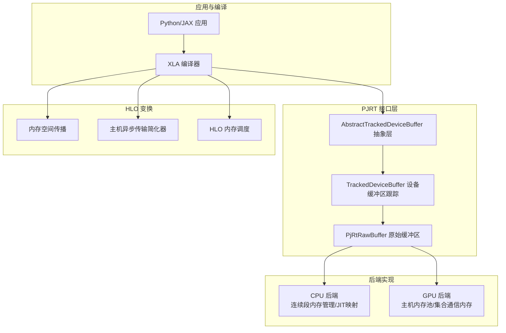

**图表来源**
- [xla\pjrt\abstract_tracked_device_buffer.h](file://xla/pjrt/abstract_tracked_device_buffer.h#L40-L126)
- [xla\pjrt\tracked_device_buffer.h](file://xla/pjrt/tracked_device_buffer.h#L102-L220)
- [xla\pjrt\raw_buffer.h](file://xla/pjrt/raw_buffer.h#L40-L182)
- [xla\backends\cpu\codegen\contiguous_section_memory_manager.cc](file://xla/backends/cpu/codegen/contiguous_section_memory_manager.cc)
- [xla\backends\cpu\codegen\jit_memory_mapper.cc](file://xla/backends/cpu/codegen/jit_memory_mapper.cc)
- [xla\backends\gpu\runtime\host_memory_pool.cc](file://xla/backends/gpu/runtime/host_memory_pool.cc)
- [xla\backends\gpu\runtime\collective_memory.cc](file://xla/backends/gpu/runtime/collective_memory.cc)
- [xla\hlo\transforms\memory_space_propagation.cc](file://xla/hlo/transforms/memory_space_propagation.cc)
- [xla\hlo\transforms\simplifiers\host_memory_transfer_asyncifier.cc](file://xla/hlo/transforms/simplifiers/host_memory_transfer_asyncifier.cc)
- [xla\hlo\transforms\simplifiers\hlo_memory_scheduler.cc](file://xla/hlo/transforms/simplifiers/hlo_memory_scheduler.cc)

**章节来源**
- [xla\pjrt\abstract_tracked_device_buffer.h](file://xla/pjrt/abstract_tracked_device_buffer.h#L40-L126)
- [xla\pjrt\tracked_device_buffer.h](file://xla/pjrt/tracked_device_buffer.h#L102-L220)
- [xla\pjrt\raw_buffer.h](file://xla/pjrt/raw_buffer.h#L40-L182)

## 核心组件
- 抽象设备缓冲区（AbstractTrackedDeviceBuffer）
  - 提供定义事件、使用事件、删除与就绪未来等统一接口，屏蔽不同内存空间差异
  - 支持克隆带控制依赖、阻塞等待操作完成等高级语义
- 设备缓冲区跟踪（TrackedDeviceBuffer）
  - 维护定义事件与使用事件集合，支持多流事件序列化与释放时机控制
  - 提供捐赠确认、添加使用事件、锁定转移使用事件等能力
- 原始缓冲区（PjRtRawBuffer/CommonPjRtRawBuffer）
  - 直接访问设备内存指针，支持子范围切片、批量切片、动态形状读取
  - 提供主机/设备异步拷贝、事件返回、就绪事件构造等
- 编译期内存统计（CompiledMemoryStats）
  - 记录生成代码、参数、输出、临时、峰值等静态内存占用，便于预算与优化

**章节来源**
- [xla\pjrt\abstract_tracked_device_buffer.h](file://xla/pjrt/abstract_tracked_device_buffer.h#L40-L126)
- [xla\pjrt\tracked_device_buffer.h](file://xla/pjrt/tracked_device_buffer.h#L102-L220)
- [xla\pjrt\raw_buffer.h](file://xla/pjrt/raw_buffer.h#L40-L182)
- [xla\pjrt\compiled_memory_stats.h](file://xla/pjrt/compiled_memory_stats.h#L33-L61)

## 架构总览
XLA内存管理以PJRT为核心，围绕“缓冲区跟踪—原始缓冲区—后端实现”三层展开；HLO变换层负责内存空间与调度优化；文档与工具提供OOM诊断与自动调优支撑。

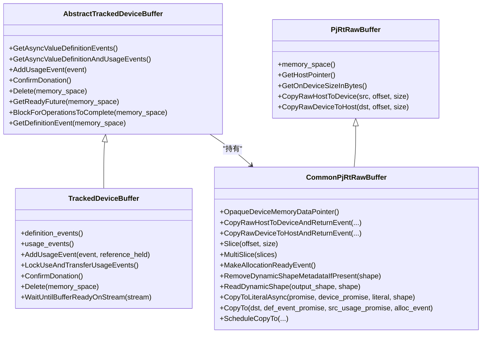

**图表来源**
- [xla\pjrt\abstract_tracked_device_buffer.h](file://xla/pjrt/abstract_tracked_device_buffer.h#L40-L126)
- [xla\pjrt\tracked_device_buffer.h](file://xla/pjrt/tracked_device_buffer.h#L102-L220)
- [xla\pjrt\raw_buffer.h](file://xla/pjrt/raw_buffer.h#L40-L182)

## 详细组件分析

### 设备缓冲区跟踪（TrackedDeviceBuffer）
- 定义事件与使用事件
  - 定义事件确保内容就绪后再使用；使用事件用于多流同步与释放时机控制
  - 支持锁定转移使用事件，避免后续再使用该缓冲区
- 捐赠与引用保持
  - 捐赠成功后需调用确认，防止重复释放
  - 使用时可选择是否在事件完成后仍保持引用，影响释放时机
- 流同步与等待
  - 提供按流等待缓冲区准备就绪的能力，保障跨流一致性

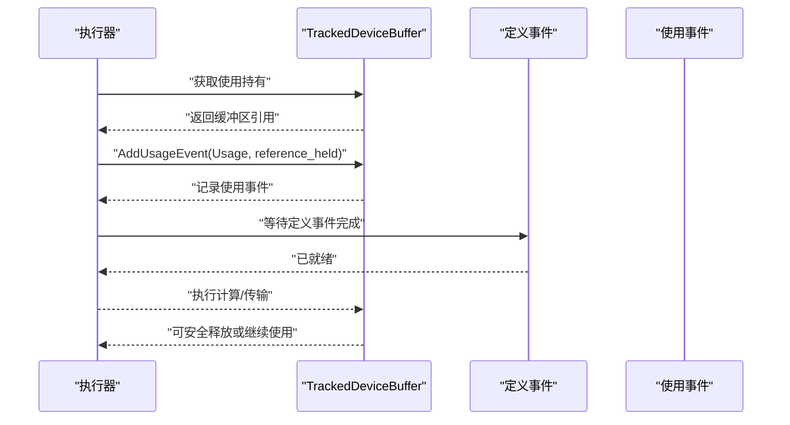

**图表来源**
- [xla\pjrt\tracked_device_buffer.h](file://xla/pjrt/tracked_device_buffer.h#L137-L164)
- [xla\pjrt\tracked_device_buffer.h](file://xla/pjrt/tracked_device_buffer.h#L181-L186)

**章节来源**
- [xla\pjrt\tracked_device_buffer.h](file://xla/pjrt/tracked_device_buffer.h#L102-L220)

### 原始缓冲区（PjRtRawBuffer/CommonPjRtRawBuffer）
- 直接内存访问
  - 提供设备内存指针访问与大小查询，支持主机/设备异步拷贝
- 切片与批量切片
  - 支持偏移切片与批量切片，提升多片段传输效率
- 动态形状与就绪事件
  - 支持动态形状元数据移除与读取，构造分配就绪事件
- 跨缓冲区复制
  - 提供直接复制到目标缓冲区的接口，并通过事件承诺保证时序

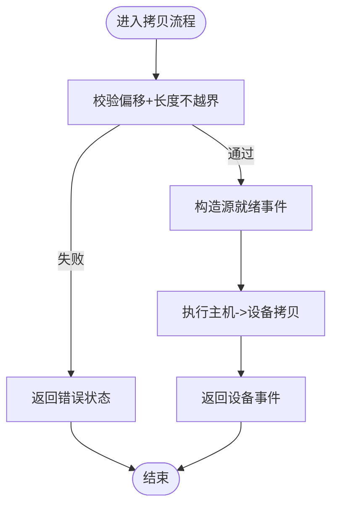

**图表来源**
- [xla\pjrt\raw_buffer.h](file://xla/pjrt/raw_buffer.h#L86-L114)
- [xla\pjrt\raw_buffer.h](file://xla/pjrt/raw_buffer.h#L166-L172)

**章节来源**
- [xla\pjrt\raw_buffer.h](file://xla/pjrt/raw_buffer.h#L40-L182)

### 抽象缓冲区（AbstractTrackedDeviceBuffer）
- 统一接口
  - 定义事件、使用事件、删除、就绪未来、阻塞等待、定义事件集合等
- 捐赠与外部引用
  - ScopedHold模型区分使用、外部引用与捐赠三种持有类型，严格控制并发与生命周期
- 兼容性扩展
  - 支持克隆带控制依赖、按流等待就绪等扩展能力

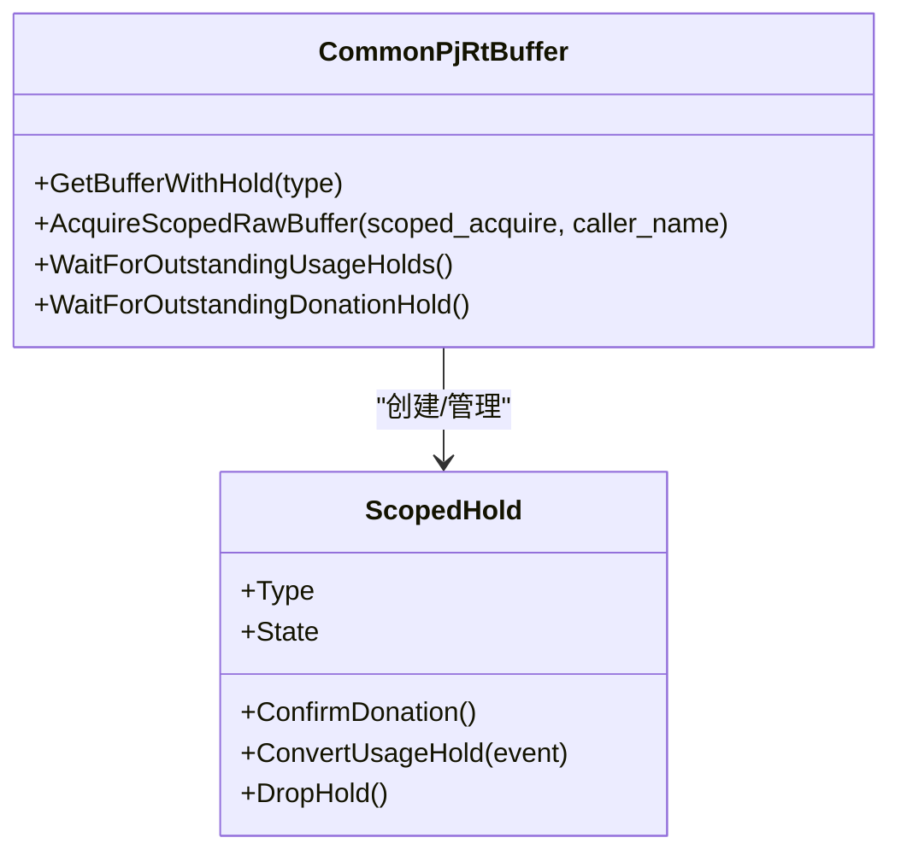

**图表来源**
- [xla\pjrt\abstract_tracked_device_buffer.h](file://xla/pjrt/abstract_tracked_device_buffer.h#L128-L340)

**章节来源**
- [xla\pjrt\abstract_tracked_device_buffer.h](file://xla/pjrt/abstract_tracked_device_buffer.h#L40-L126)
- [xla\pjrt\abstract_tracked_device_buffer.h](file://xla/pjrt/abstract_tracked_device_buffer.h#L128-L340)

### 编译期内存统计（CompiledMemoryStats）
- 静态内存预算
  - 记录生成代码、参数、输出、临时、峰值等统计，便于运行前内存预算与优化
- 序列化与反序列化
  - 支持协议缓冲区序列化，便于持久化与跨进程传递

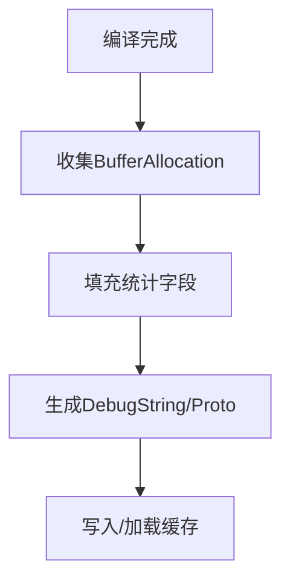

**图表来源**
- [xla\pjrt\compiled_memory_stats.h](file://xla/pjrt/compiled_memory_stats.h#L59-L61)

**章节来源**
- [xla\pjrt\compiled_memory_stats.h](file://xla/pjrt/compiled_memory_stats.h#L28-L61)

### HLO内存空间传播与调度
- 内存空间传播
  - 将内存空间标注从HLO节点传播到具体缓冲区，指导分配与迁移
- 主机异步传输简化器
  - 将主机与设备之间的传输转换为异步形式，减少同步开销
- HLO内存调度
  - 在指令层面进行内存复用与重排，降低峰值内存

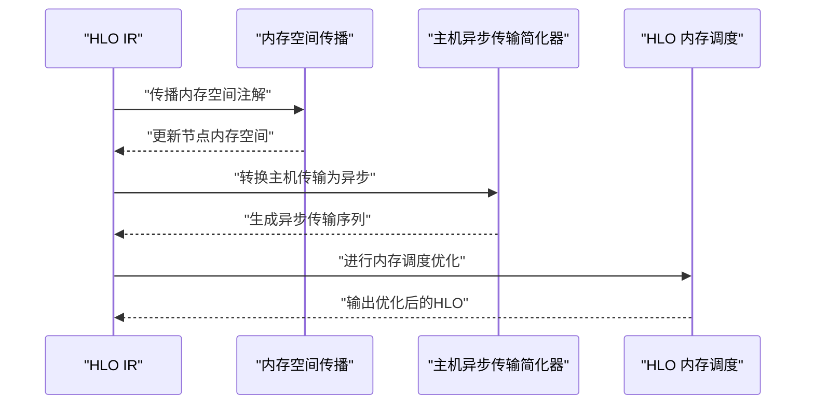

**图表来源**
- [xla\hlo\transforms\memory_space_propagation.cc](file://xla/hlo/transforms/memory_space_propagation.cc)
- [xla\hlo\transforms\simplifiers\host_memory_transfer_asyncifier.cc](file://xla/hlo/transforms/simplifiers/host_memory_transfer_asyncifier.cc)
- [xla\hlo\transforms\simplifiers\hlo_memory_scheduler.cc](file://xla/hlo/transforms/simplifiers/hlo_memory_scheduler.cc)

**章节来源**
- [xla\hlo\transforms\memory_space_propagation.cc](file://xla/hlo/transforms/memory_space_propagation.cc)
- [xla\hlo\transforms\simplifiers\host_memory_transfer_asyncifier.cc](file://xla/hlo/transforms/simplifiers/host_memory_transfer_asyncifier.cc)
- [xla\hlo\transforms\simplifiers\hlo_memory_scheduler.cc](file://xla/hlo/transforms/simplifiers/hlo_memory_scheduler.cc)

### 自动分片与内存估算
- 自动分片内存
  - 基于代价模型与内存约束进行分片决策，减少单设备内存压力
- 内存注解转换
  - 将内存放置注解转换为内部注解，驱动后续分配与迁移

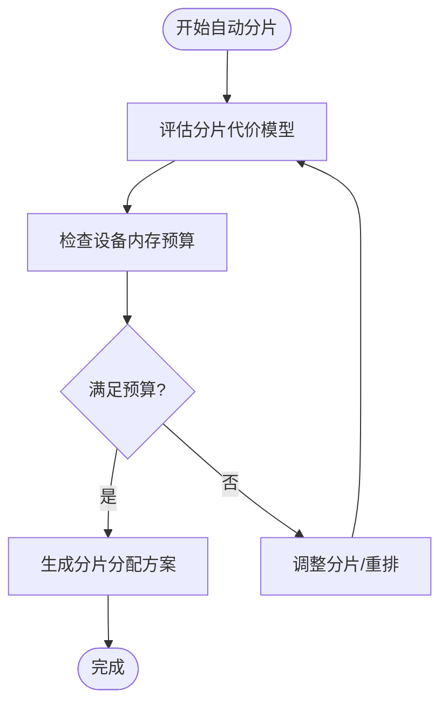

**图表来源**
- [xla\hlo\experimental\auto_sharding\auto_sharding_memory.cc](file://xla/hlo/experimental/auto_sharding/auto_sharding_memory.cc)

**章节来源**
- [xla\hlo\experimental\auto_sharding\auto_sharding_memory.cc](file://xla/hlo/experimental/auto_sharding/auto_sharding_memory.cc)

### GPU后端内存特性
- 主机内存池
  - 提供主机侧内存池化分配，降低频繁分配开销
- 集合通信内存
  - 为集合通信（如NCCL）预留与复用内存，减少峰值
- NCCL对称内存
  - 在多设备场景下进行对称内存布局，提升通信效率

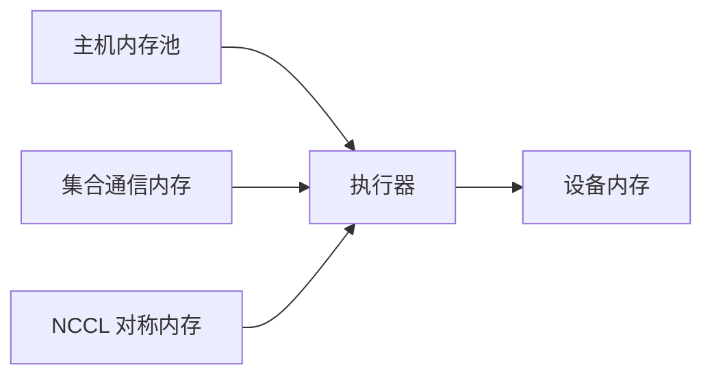

**图表来源**
- [xla\backends\gpu\runtime\host_memory_pool.cc](file://xla/backends/gpu/runtime/host_memory_pool.cc)
- [xla\backends\gpu\runtime\collective_memory.cc](file://xla/backends/gpu/runtime/collective_memory.cc)
- [xla\backends\gpu\collectives\nccl_symmetric_memory.cc](file://xla/backends/gpu/collectives/nccl_symmetric_memory.cc)

**章节来源**
- [xla\backends\gpu\runtime\host_memory_pool.cc](file://xla/backends/gpu/runtime/host_memory_pool.cc)
- [xla\backends\gpu\runtime\collective_memory.cc](file://xla/backends/gpu/runtime/collective_memory.cc)
- [xla\backends\gpu\collectives\nccl_symmetric_memory.cc](file://xla/backends/gpu/collectives/nccl_symmetric_memory.cc)

### CPU后端内存特性
- 连续段内存管理
  - 将相邻缓冲区映射到连续内存段，提升缓存局部性
- JIT内存映射
  - 在JIT阶段进行内存布局优化，减少运行时分配与拷贝

**章节来源**
- [xla\backends\cpu\codegen\contiguous_section_memory_manager.cc](file://xla/backends/cpu/codegen/contiguous_section_memory_manager.cc)
- [xla\backends\cpu\codegen\jit_memory_mapper.cc](file://xla/backends/cpu/codegen/jit_memory_mapper.cc)

## 依赖关系分析
- 组件耦合
  - AbstractTrackedDeviceBuffer与TrackedDeviceBuffer强耦合，后者依赖前者提供的事件与生命周期语义
  - CommonPjRtRawBuffer作为PjRtRawBuffer的通用实现，向上提供统一接口，向下对接后端驱动
- 直接与间接依赖
  - PJRT层依赖后端驱动（CPU/GPU）提供的设备地址与分配器
  - HLO变换层依赖编译器生成的BufferAllocation信息，驱动内存优化
- 循环依赖
  - 当前设计通过抽象层隔离，避免循环依赖
- 外部依赖与集成点
  - GPU后端依赖NCCL、CUDA/ROCm等驱动；CPU后端依赖本地内存与线程池

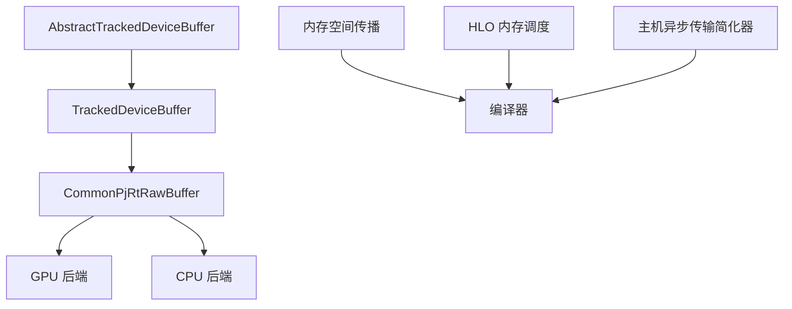

**图表来源**
- [xla\pjrt\abstract_tracked_device_buffer.h](file://xla/pjrt/abstract_tracked_device_buffer.h#L40-L126)
- [xla\pjrt\tracked_device_buffer.h](file://xla/pjrt/tracked_device_buffer.h#L102-L220)
- [xla\pjrt\raw_buffer.h](file://xla/pjrt/raw_buffer.h#L40-L182)
- [xla\hlo\transforms\memory_space_propagation.cc](file://xla/hlo/transforms/memory_space_propagation.cc)
- [xla\hlo\transforms\simplifiers\hlo_memory_scheduler.cc](file://xla/hlo/transforms/simplifiers/hlo_memory_scheduler.cc)
- [xla\hlo\transforms\simplifiers\host_memory_transfer_asyncifier.cc](file://xla/hlo/transforms/simplifiers/host_memory_transfer_asyncifier.cc)

**章节来源**
- [xla\pjrt\abstract_tracked_device_buffer.h](file://xla/pjrt/abstract_tracked_device_buffer.h#L40-L126)
- [xla\pjrt\tracked_device_buffer.h](file://xla/pjrt/tracked_device_buffer.h#L102-L220)
- [xla\pjrt\raw_buffer.h](file://xla/pjrt/raw_buffer.h#L40-L182)

## 性能考量
- 内存预算与复用
  - 使用CompiledMemoryStats进行静态预算，结合HLO内存调度减少峰值
- 异步传输与事件驱动
  - 主机异步传输简化器降低同步阻塞，配合事件序列化避免竞态
- 别名与捐赠
  - 参数/输出别名与缓冲区捐赠减少额外分配与拷贝
- 设备侧优化
  - GPU主机内存池与集合通信内存池化，CPU连续段内存管理提升缓存命中

[本节为通用性能建议，无需列出具体文件来源]

## 故障排查指南

### OOM诊断与解决
- 使用XProf内存查看器
  - 通过JAX的trace捕获性能剖析，启动XProf并打开Memory Viewer工具
  - 关注HBM内存类型与峰值时刻的HLO算子，识别高临时张量与输入/输出
- 结合文档步骤
  - 按文档指引安装与启动XProf，定位峰值内存分配点，分析缓冲区图表

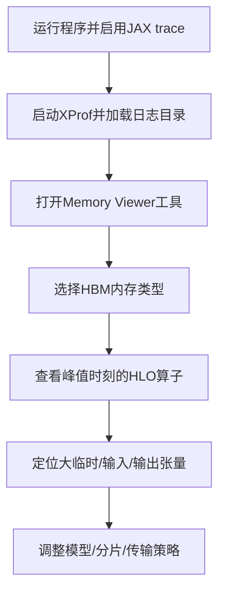

**图表来源**
- [docs\oom_debugging.md](file://docs/oom_debugging.md#L13-L87)

**章节来源**
- [docs\oom_debugging.md](file://docs/oom_debugging.md#L1-L88)

### 持久化自动调优（GPU）
- 缓存目录方式
  - 通过per-fusion缓存目录，跨运行复用融合内核参数，加速后续编译
  - 注意缓存目录存在性与可写性、版本兼容与手动失效策略
- 单文件加载/导出
  - 支持将所有融合结果导出/加载到单一文件，便于测试与CI复用

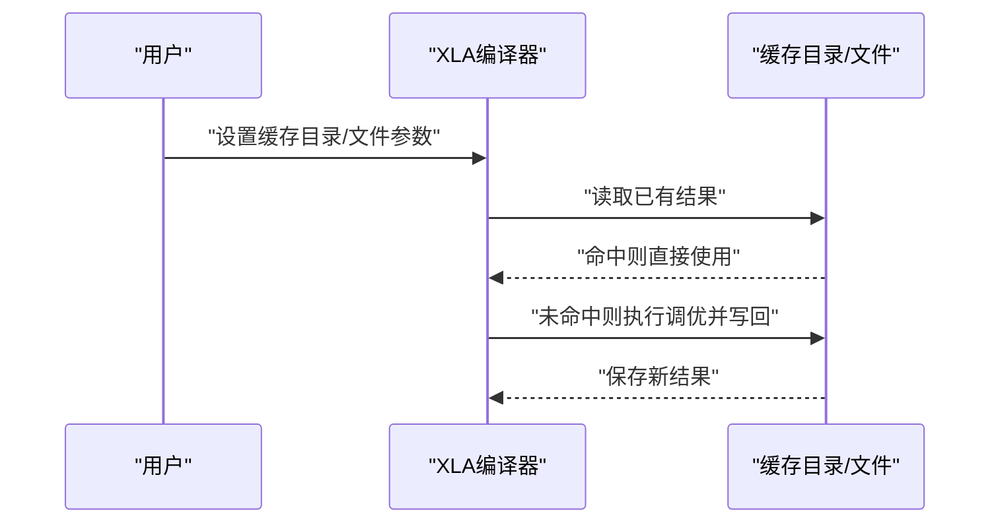

**图表来源**
- [docs\persisted_autotuning.md](file://docs/persisted_autotuning.md#L13-L50)
- [docs\persisted_autotuning.md](file://docs/persisted_autotuning.md#L64-L98)

**章节来源**
- [docs\persisted_autotuning.md](file://docs/persisted_autotuning.md#L1-L109)

### 内存泄漏与碎片化分析
- 泄漏检测
  - 通过TrackedDeviceBuffer的定义/使用事件与删除接口，确保引用计数与生命周期正确
  - 使用ScopedHold模型避免捐赠未确认导致的悬挂引用
- 碎片化分析
  - 利用主机内存池与集合通信内存池化，减少频繁小块分配
  - 在CPU路径下采用连续段内存管理，降低跨页碎片

**章节来源**
- [xla\pjrt\tracked_device_buffer.h](file://xla/pjrt/tracked_device_buffer.h#L102-L220)
- [xla\pjrt\abstract_tracked_device_buffer.h](file://xla/pjrt/abstract_tracked_device_buffer.h#L128-L340)
- [xla\backends\gpu\runtime\host_memory_pool.cc](file://xla/backends/gpu/runtime/host_memory_pool.cc)
- [xla\backends\cpu\codegen\contiguous_section_memory_manager.cc](file://xla/backends/cpu/codegen/contiguous_section_memory_manager.cc)

### 多设备内存协调与共享
- 主机内存池与集合通信内存
  - 在多设备场景下，统一管理主机侧与设备侧内存，减少峰值与碎片
- NCCL对称内存
  - 对称布局提升多设备通信效率，降低带宽瓶颈
- 事件序列化
  - 通过BufferSequencingEventRef确保跨设备/跨流的同步与释放顺序

**章节来源**
- [xla\backends\gpu\runtime\collective_memory.cc](file://xla/backends/gpu/runtime/collective_memory.cc)
- [xla\backends\gpu\collectives\nccl_symmetric_memory.cc](file://xla/backends/gpu/collectives/nccl_symmetric_memory.cc)
- [xla\pjrt\tracked_device_buffer.h](file://xla/pjrt/tracked_device_buffer.h#L137-L164)

## 结论
XLA的内存管理以PJRT抽象为核心，结合HLO变换与后端实现，形成从编译期预算到运行期事件驱动的完整闭环。通过内存空间传播、异步传输、别名与捐赠、池化与对称布局等技术，显著降低峰值内存与碎片化风险。配合XProf内存查看器与持久化自动调优，可在复杂多设备环境中实现稳定高效的内存使用模式。

[本节为总结性内容，无需列出具体文件来源]

## 附录
- 测试参考
  - GPU与CPU设备缓冲区跟踪单元测试，验证事件序列化与生命周期行为
  - 原始缓冲区切片与拷贝测试，验证对齐与边界条件

**章节来源**
- [xla\pjrt\gpu\tfrt\tracked_gpu_device_buffer_test.cc](file://xla/pjrt/gpu/tfrt/tracked_gpu_device_buffer_test.cc)
- [xla\pjrt\cpu\tracked_cpu_device_buffer_test.cc](file://xla/pjrt/cpu/tracked_cpu_device_buffer_test.cc)
- [xla\pjrt\tracked_device_buffer_test.cc](file://xla/pjrt/tracked_device_buffer_test.cc)
- [xla\pjrt\raw_buffer_test.cc](file://xla/pjrt/raw_buffer_test.cc)