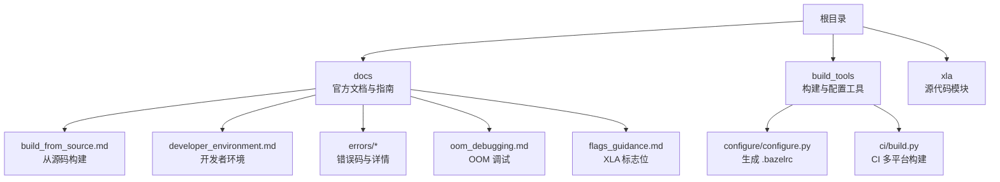
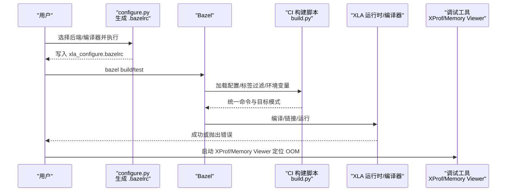
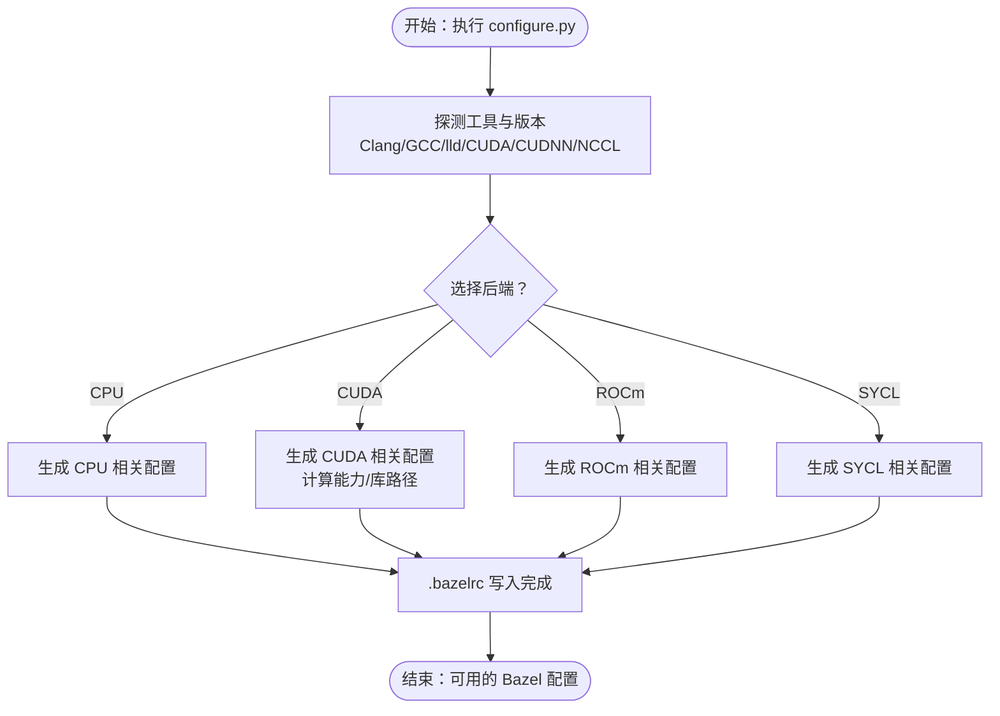
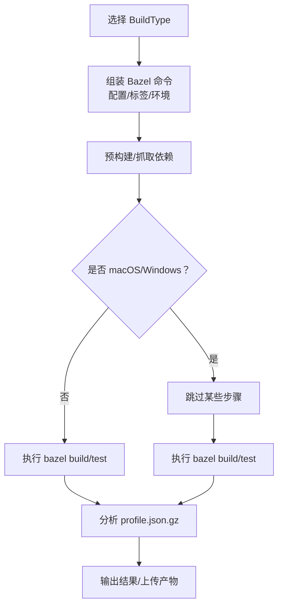
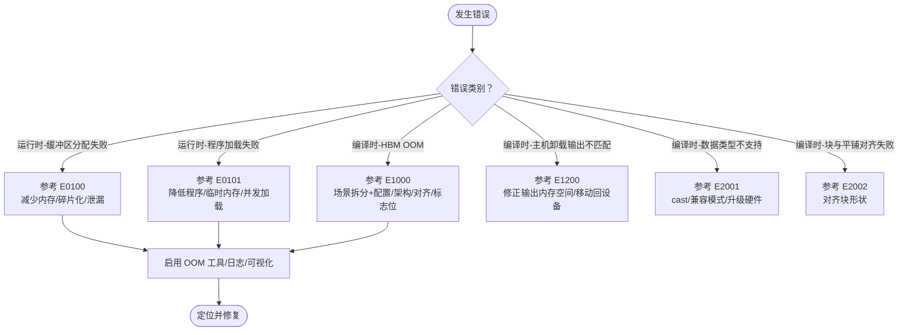

# 常见问题解答

<cite>
**本文引用的文件**
- [README.md](file://README.md)
- [CONTRIBUTING.md](file://CONTRIBUTING.md)
- [docs/build_from_source.md](file://docs/build_from_source.md)
- [docs/developer_environment.md](file://docs/developer_environment.md)
- [docs/error_codes.md](file://docs/error_codes.md)
- [docs/errors_overview.md](file://docs/errors_overview.md)
- [docs/errors/error_0100.md](file://docs/errors/error_0100.md)
- [docs/errors/error_0101.md](file://docs/errors/error_0101.md)
- [docs/errors/error_1000.md](file://docs/errors/error_1000.md)
- [docs/errors/error_1200.md](file://docs/errors/error_1200.md)
- [docs/errors/error_2001.md](file://docs/errors/error_2001.md)
- [docs/errors/error_2002.md](file://docs/errors/error_2002.md)
- [docs/oom_debugging.md](file://docs/oom_debugging.md)
- [docs/flags_guidance.md](file://docs/flags_guidance.md)
- [build_tools/configure/configure.py](file://build_tools/configure/configure.py)
- [build_tools/ci/build.py](file://build_tools/ci/build.py)
</cite>

## 目录
1. [简介](#简介)
2. [项目结构](#项目结构)
3. [核心组件](#核心组件)
4. [架构总览](#架构总览)
5. [详细组件分析](#详细组件分析)
6. [依赖关系分析](#依赖关系分析)
7. [性能注意事项](#性能注意事项)
8. [故障排除指南](#故障排除指南)
9. [结论](#结论)
10. [附录](#附录)

## 简介
本文件面向使用与贡献 XLA 的用户，系统化整理了常见问题与解决方案，覆盖构建问题、环境配置、编译选项、运行时内存与类型不匹配等。内容基于仓库内的官方文档与脚本，提供可复用的排查步骤、问题自检清单与社区支持渠道，帮助不同经验水平的用户快速定位并解决问题。

## 项目结构
- 文档与指南集中在 docs 目录，包含构建、开发者环境、错误码索引与各类错误详解、调试工具与标志位指导等。
- 构建与配置相关工具位于 build_tools 目录，如 configure 脚本用于生成 Bazel 配置，CI 脚本用于多平台/后端的自动化构建与测试。
- 顶层 README 提供项目概述与入门指引；CONTRIBUTING 指向贡献流程。

**图表来源**
- [docs/build_from_source.md](file://docs/build_from_source.md#L1-L184)
- [docs/developer_environment.md](file://docs/developer_environment.md#L1-L71)
- [docs/errors/error_0100.md](file://docs/errors/error_0100.md#L1-L86)
- [docs/oom_debugging.md](file://docs/oom_debugging.md#L1-L88)
- [docs/flags_guidance.md](file://docs/flags_guidance.md#L1-L101)
- [build_tools/configure/configure.py](file://build_tools/configure/configure.py#L1-L625)
- [build_tools/ci/build.py](file://build_tools/ci/build.py#L1-L957)

**章节来源**
- [README.md](file://README.md#L1-L50)
- [docs/build_from_source.md](file://docs/build_from_source.md#L1-L184)
- [docs/developer_environment.md](file://docs/developer_environment.md#L1-L71)

## 核心组件
- 构建配置与环境
  - 使用 configure.py 生成 xla_configure.bazelrc，自动探测编译器、CUDA/CUDNN/NCCL 版本与计算能力，并注入 Bazel 环境变量与配置。
  - 支持 CPU/GPU/ROCm/SYCL 后端选择与主机编译器（Clang/GCC）切换。
- CI 构建与测试
  - CI 脚本定义多种 BuildType，覆盖 Linux/macOS/Windows、CPU/GPU/OneAPI 等组合，统一 Bazel 命令、标签过滤与环境变量。
- 错误码与调试
  - 错误码索引与各错误类别的成因、场景与调试建议；OOM 调试工具链与 XProf Memory Viewer 使用说明。
- 开发者环境
  - LSP/clangd 与 compile_commands.json 生成；构建清理与依赖检查工具链（Buildozer、bant）。

**章节来源**
- [build_tools/configure/configure.py](file://build_tools/configure/configure.py#L1-L625)
- [build_tools/ci/build.py](file://build_tools/ci/build.py#L1-L957)
- [docs/error_codes.md](file://docs/error_codes.md#L1-L22)
- [docs/errors_overview.md](file://docs/errors_overview.md#L1-L37)
- [docs/oom_debugging.md](file://docs/oom_debugging.md#L1-L88)
- [docs/developer_environment.md](file://docs/developer_environment.md#L1-L71)

## 架构总览
下图展示从“用户发起构建/运行”到“Bazel 执行、加载配置、调用后端”的整体流程，以及关键错误点与调试入口。

**图表来源**
- [build_tools/configure/configure.py](file://build_tools/configure/configure.py#L574-L625)
- [build_tools/ci/build.py](file://build_tools/ci/build.py#L183-L259)
- [docs/oom_debugging.md](file://docs/oom_debugging.md#L1-L88)

## 详细组件分析

### 构建配置与环境设置
- 自动化配置
  - 探测 Clang/GCC、lld、CUDA/CUDNN/NCCL 版本与计算能力，写入 .bazelrc，注入环境变量与 Bazel 配置。
  - 支持 Hermetic（隔离）构建与本地路径覆盖，便于在容器或受限环境中复现。
- 开发者环境
  - 通过 generate_compile_commands.py 生成 compile_commands.json，配合 clangd/LSP 实现跳转、补全与内联诊断。
  - 提供构建清理与依赖检查工具链，减少 CI 复杂度与 PR 反馈成本。

**图表来源**
- [build_tools/configure/configure.py](file://build_tools/configure/configure.py#L254-L472)

**章节来源**
- [build_tools/configure/configure.py](file://build_tools/configure/configure.py#L1-L625)
- [docs/developer_environment.md](file://docs/developer_environment.md#L1-L71)

### CI 构建与测试
- 多平台/后端矩阵
  - 定义多种 BuildType，覆盖 Linux/macOS/Windows、CPU/GPU/OneAPI 等组合。
  - 统一 Bazel 命令、标签过滤（按 GPU 计算能力、厂商与功能）、环境变量与目标模式。
- 关键流程
  - 先执行“仅抓取/预构建”阶段以尽早发现配置问题，再执行实际构建/测试与性能分析。

**图表来源**
- [build_tools/ci/build.py](file://build_tools/ci/build.py#L183-L259)

**章节来源**
- [build_tools/ci/build.py](file://build_tools/ci/build.py#L1-L957)

### 错误码与调试策略
- 错误码索引
  - 包含运行时与编译时错误分类，如缓冲区分配失败、程序加载失败、HBM OOM、主机卸载输出不匹配、硬件不支持的数据类型、块与平铺对齐失败等。
- 调试方法
  - OOM 场景：区分“意外大张量”“聚合占用”“TC/SC 占用不平衡”，并提供配置调整、架构优化、对齐与标记、XLA 标志位与重计算等手段。
  - 类型不匹配：在兼容模式下进行自动转换，必要时手动 cast 到硬件原生类型。
  - 输出空间不匹配：明确输出应位于设备或主机内存，修正布局或添加移动回设备的注解。
  - OOM 调试工具：使用 XProf Memory Viewer 观察峰值占用与生命周期，结合日志追踪张量路径。

**图表来源**
- [docs/error_codes.md](file://docs/error_codes.md#L1-L22)
- [docs/errors/error_0100.md](file://docs/errors/error_0100.md#L1-L86)
- [docs/errors/error_0101.md](file://docs/errors/error_0101.md#L1-L74)
- [docs/errors/error_1000.md](file://docs/errors/error_1000.md#L1-L227)
- [docs/errors/error_1200.md](file://docs/errors/error_1200.md#L1-L61)
- [docs/errors/error_2001.md](file://docs/errors/error_2001.md#L1-L89)
- [docs/errors/error_2002.md](file://docs/errors/error_2002.md#L1-L54)
- [docs/oom_debugging.md](file://docs/oom_debugging.md#L1-L88)

**章节来源**
- [docs/error_codes.md](file://docs/error_codes.md#L1-L22)
- [docs/errors_overview.md](file://docs/errors_overview.md#L1-L37)
- [docs/errors/error_0100.md](file://docs/errors/error_0100.md#L1-L86)
- [docs/errors/error_0101.md](file://docs/errors/error_0101.md#L1-L74)
- [docs/errors/error_1000.md](file://docs/errors/error_1000.md#L1-L227)
- [docs/errors/error_1200.md](file://docs/errors/error_1200.md#L1-L61)
- [docs/errors/error_2001.md](file://docs/errors/error_2001.md#L1-L89)
- [docs/errors/error_2002.md](file://docs/errors/error_2002.md#L1-L54)
- [docs/oom_debugging.md](file://docs/oom_debugging.md#L1-L88)

### XLA 标志位与性能/内存权衡
- 正确性与性能
  - 提供与 pipelining、异步通信、融合策略相关的标志位，建议按文档组合使用并评估影响。
- 内存
  - 提供调度器、融合与阈值等内存相关标志位，仅在出现 HBM OOM 时调整，避免影响性能。
- 平台特定
  - TPU/GPU 各有专用标志位，建议先确认默认行为，再按工作负载微调。

**章节来源**
- [docs/flags_guidance.md](file://docs/flags_guidance.md#L1-L101)

## 依赖关系分析
- configure.py 与 .bazelrc
  - configure.py 将工具链与库路径注入 Bazel 环境变量，生成可被 Bazel 读取的 .bazelrc。
- CI 构建脚本与标签过滤
  - CI 脚本根据 BuildType 设置标签过滤与环境变量，确保目标与平台匹配。
- 错误码与调试工具
  - 错误码文档与调试工具（XProf/Memory Viewer）形成闭环，从定位到修复的完整链路。

**图表来源**
- [build_tools/configure/configure.py](file://build_tools/configure/configure.py#L593-L614)
- [build_tools/ci/build.py](file://build_tools/ci/build.py#L183-L259)
- [docs/errors_overview.md](file://docs/errors_overview.md#L1-L37)
- [docs/oom_debugging.md](file://docs/oom_debugging.md#L1-L88)

**章节来源**
- [build_tools/configure/configure.py](file://build_tools/configure/configure.py#L1-L625)
- [build_tools/ci/build.py](file://build_tools/ci/build.py#L1-L957)
- [docs/errors_overview.md](file://docs/errors_overview.md#L1-L37)
- [docs/oom_debugging.md](file://docs/oom_debugging.md#L1-L88)

## 性能注意事项
- 在未出现内存问题前，优先保持默认标志位，避免不必要的性能回退。
- 对于延迟敏感推理或大规模训练，可按 flags_guidance 中的建议组合启用异步/流水线/融合策略，但需在回归测试中验证正确性。
- GPU/TPU 平台各有专用优化开关，建议先在小规模任务上验证效果再推广。

[本节为通用建议，无需特定文件引用]

## 故障排除指南

### 快速自检清单（构建与环境）
- 已正确安装并选择后端
  - 使用 configure.py 生成 .bazelrc，确认主机编译器与 CUDA/CUDNN/NCCL 版本、计算能力已正确注入。
- 环境变量与路径
  - 确认 LD_LIBRARY_PATH、PYTHON_BIN_PATH、CC/Bazel 编译器路径等环境变量有效。
- 平台与标签过滤
  - CI/本地构建使用的标签过滤与目标模式一致，避免跨平台差异导致的失败。
- LSP/clangd
  - 已生成 compile_commands.json 并在编辑器中启用 LSP，以便快速定位编译错误与头文件问题。

**章节来源**
- [build_tools/configure/configure.py](file://build_tools/configure/configure.py#L574-L625)
- [docs/developer_environment.md](file://docs/developer_environment.md#L1-L71)

### 常见构建问题与解决
- 无法找到编译器/工具
  - 现象：找不到 clang/gcc 或 lld。
  - 处理：通过 configure.py 的 --clang_path/--gcc_path/--lld_path 显式指定，或调整 PATH。
- CUDA/CUDNN/NCCL 版本不匹配
  - 现象：链接/运行时报库版本冲突。
  - 处理：使用 hermetic 版本或本地路径覆盖，确保版本与计算能力匹配。
- 无 GPU 环境仍需构建 CUDA 目标
  - 现象：机器无 GPU 但仍需生成 CUDA 目标。
  - 处理：通过 configure.py 手动指定计算能力，或使用容器镜像。

**章节来源**
- [docs/build_from_source.md](file://docs/build_from_source.md#L1-L184)
- [build_tools/configure/configure.py](file://build_tools/configure/configure.py#L574-L625)

### 运行时内存问题（OOM）
- 缓冲区分配失败（E0100）
  - 现象：尝试分配设备缓冲区失败，可能由总内存不足或碎片导致。
  - 处理：减小批大小、参数分片、缩短序列长度、启用缓冲区捐赠、优化布局与对齐、避免内存泄漏。
- 程序加载失败（E0101）
  - 现象：编译后的程序无法加载到 HBM，可能因程序过大或碎片。
  - 处理：减少程序临时内存、降低并发加载、释放数据缓冲区。
- HBM OOM（E1000）
  - 现象：编译期检查发现静态/动态/常量/系统开销总和超过 HBM。
  - 处理：区分“TC/SC 占用不平衡”“异常大张量”“聚合占用”，分别采用平衡 TC/SC、移除调试张量、配置调整、架构优化、对齐与标志位、重计算等策略。
- OOM 调试工具链
  - 使用 XProf/Memory Viewer 观察峰值占用与生命周期，结合日志与可视化定位瓶颈。

**章节来源**
- [docs/errors/error_0100.md](file://docs/errors/error_0100.md#L1-L86)
- [docs/errors/error_0101.md](file://docs/errors/error_0101.md#L1-L74)
- [docs/errors/error_1000.md](file://docs/errors/error_1000.md#L1-L227)
- [docs/oom_debugging.md](file://docs/oom_debugging.md#L1-L88)

### 数据类型与硬件对齐问题
- 不支持的右侧数据类型（E2001）
  - 现象：矩阵乘法的 RHS 数据类型在当前硬件上不被原生支持。
  - 处理：手动 cast 到硬件原生类型，检查兼容模式，或升级硬件。
- 块与平铺对齐失败（E2002）
  - 现象：输入/输出块形状与硬件平铺不满足整除或全尺寸例外。
  - 处理：调整块形状使其满足平铺约束。

**章节来源**
- [docs/errors/error_2001.md](file://docs/errors/error_2001.md#L1-L89)
- [docs/errors/error_2002.md](file://docs/errors/error_2002.md#L1-L54)

### 主机卸载输出不匹配（E1200）
- 现象：被显式卸载到主机内存的张量作为设备内存的程序输出返回。
- 处理：若期望主机输出，显式设置输出内存空间为主机；若期望设备输出，插入移动回设备的注解并用日志追踪路径。

**章节来源**
- [docs/errors/error_1200.md](file://docs/errors/error_1200.md#L1-L61)

### 标志位与性能/内存权衡
- 仅在出现 HBM OOM 时调整内存相关标志位，避免影响性能。
- 性能相关标志位建议按文档组合启用，并在回归测试中验证正确性。

**章节来源**
- [docs/flags_guidance.md](file://docs/flags_guidance.md#L1-L101)

## 结论
通过规范化的构建配置、完善的 CI 流程与系统化的错误码与调试工具链，XLA 在多平台与多后端环境下提供了稳定可靠的开发与运行体验。建议在日常工作中遵循“默认配置优先、按需微调”的原则，并在遇到问题时按本文提供的自检清单与步骤快速定位与修复。

[本节为总结，无需特定文件引用]

## 附录

### 社区支持与获取帮助
- 项目主页与资源：参见根 README 中的项目主页与社区资源链接。
- 贡献指南：参见 CONTRIBUTING 指向的文档。
- 联系方式：维护者邮箱与社区空间信息见 README。

**章节来源**
- [README.md](file://README.md#L1-L50)
- [CONTRIBUTING.md](file://CONTRIBUTING.md#L1-L5)