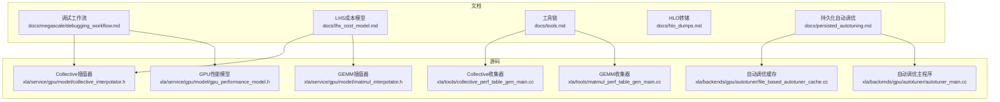
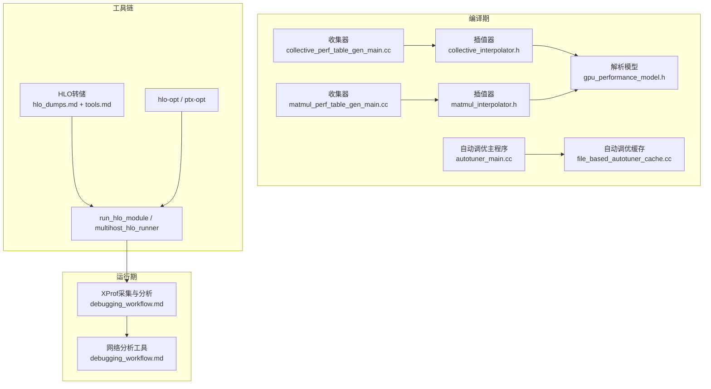
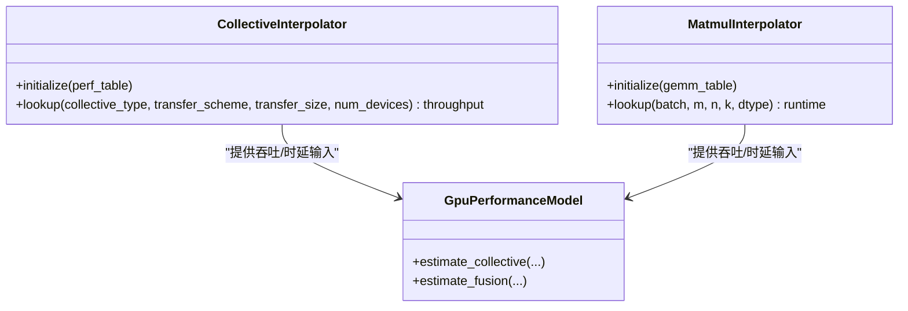
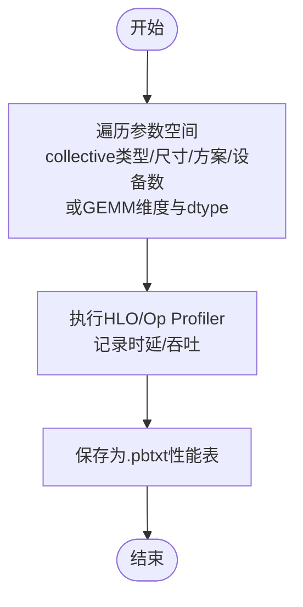
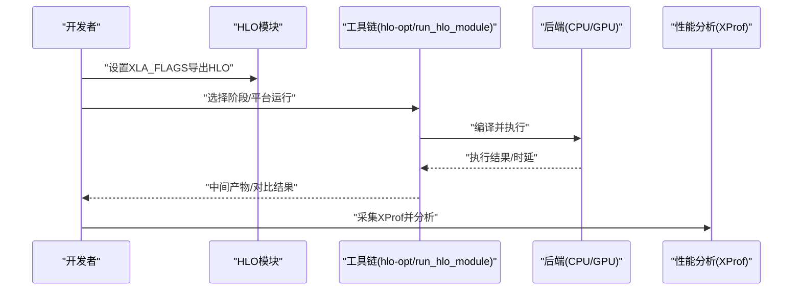
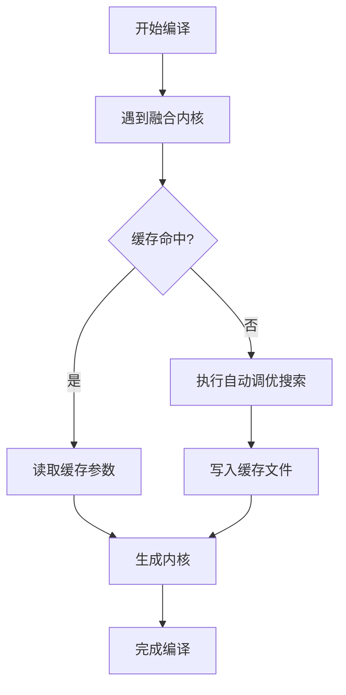
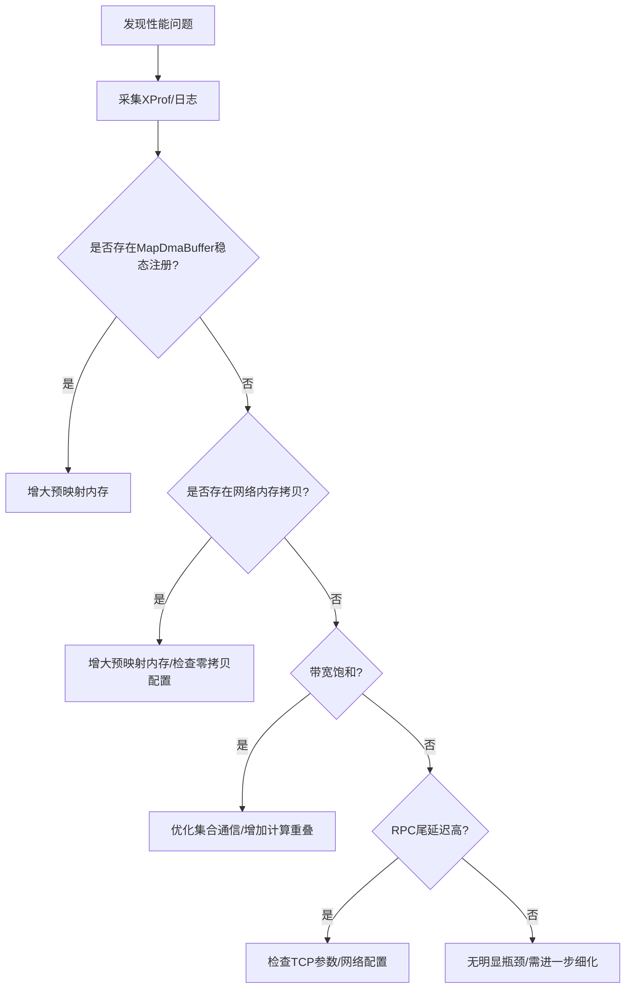
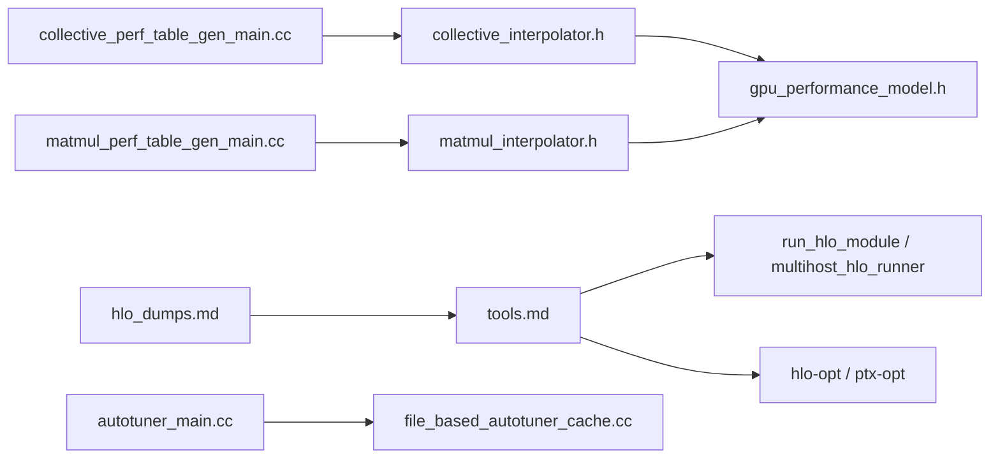

# 性能问题诊断

<cite>
**本文引用的文件**
- [docs/megascale/debugging_workflow.md](file://docs/megascale/debugging_workflow.md)
- [docs/lhs_cost_model.md](file://docs/lhs_cost_model.md)
- [docs/tools.md](file://docs/tools.md)
- [docs/hlo_dumps.md](file://docs/hlo_dumps.md)
- [docs/persisted_autotuning.md](file://docs/persisted_autotuning.md)
- [xla/service/gpu/model/collective_interpolator.h](file://xla/service/gpu/model/collective_interpolator.h)
- [xla/service/gpu/model/matmul_interpolator.h](file://xla/service/gpu/model/matmul_interpolator.h)
- [xla/service/gpu/model/gpu_performance_model.h](file://xla/service/gpu/model/gpu_performance_model.h)
- [xla/tools/collective_perf_table_gen_main.cc](file://xla/tools/collective_perf_table_gen_main.cc)
- [xla/tools/matmul_perf_table_gen_main.cc](file://xla/tools/matmul_perf_table_gen_main.cc)
- [xla/backends/gpu/autotuner/autotuner_main.cc](file://xla/backends/gpu/autotuner/autotuner_main.cc)
- [xla/backends/gpu/autotuner/file_based_autotuner_cache.cc](file://xla/backends/gpu/autotuner/file_based_autotuner_cache.cc)
</cite>

## 目录
1. [简介](#简介)
2. [项目结构](#项目结构)
3. [核心组件](#核心组件)
4. [架构总览](#架构总览)
5. [详细组件分析](#详细组件分析)
6. [依赖关系分析](#依赖关系分析)
7. [性能考量](#性能考量)
8. [故障排查指南](#故障排查指南)
9. [结论](#结论)
10. [附录](#附录)

## 简介
本指南面向在XLA上进行性能问题诊断与优化的工程师，系统讲解成本模型（Cost Model）的工作原理、性能瓶颈识别方法、编译统计与成本分析工具的使用、性能基准测试的实施与结果分析，以及不同硬件平台（CPU/GPU/TPU）上的调优策略与最佳实践。文档同时覆盖编译时优化与运行时优化的关注点与解决路径，并通过流程图与序列图帮助快速定位问题根因。

## 项目结构
围绕性能诊断与成本模型，XLA仓库中与本主题直接相关的关键文档与源码模块如下：
- 文档：调试工作流、LHS成本模型、工具链、HLO转储、持久化自动调优
- 源码：GPU成本模型插值器、收集器、自动调优缓存与入口

图表来源
- [docs/megascale/debugging_workflow.md](file://docs/megascale/debugging_workflow.md#L1-L316)
- [docs/lhs_cost_model.md](file://docs/lhs_cost_model.md#L1-L236)
- [docs/tools.md](file://docs/tools.md#L1-L334)
- [docs/hlo_dumps.md](file://docs/hlo_dumps.md#L1-L261)
- [docs/persisted_autotuning.md](file://docs/persisted_autotuning.md#L1-L109)
- [xla/service/gpu/model/collective_interpolator.h](file://xla/service/gpu/model/collective_interpolator.h)
- [xla/service/gpu/model/matmul_interpolator.h](file://xla/service/gpu/model/matmul_interpolator.h)
- [xla/service/gpu/model/gpu_performance_model.h](file://xla/service/gpu/model/gpu_performance_model.h)
- [xla/tools/collective_perf_table_gen_main.cc](file://xla/tools/collective_perf_table_gen_main.cc)
- [xla/tools/matmul_perf_table_gen_main.cc](file://xla/tools/matmul_perf_table_gen_main.cc)
- [xla/backends/gpu/autotuner/file_based_autotuner_cache.cc](file://xla/backends/gpu/autotuner/file_based_autotuner_cache.cc)
- [xla/backends/gpu/autotuner/autotuner_main.cc](file://xla/backends/gpu/autotuner/autotuner_main.cc)

章节来源
- [docs/megascale/debugging_workflow.md](file://docs/megascale/debugging_workflow.md#L1-L316)
- [docs/lhs_cost_model.md](file://docs/lhs_cost_model.md#L1-L236)
- [docs/tools.md](file://docs/tools.md#L1-L334)
- [docs/hlo_dumps.md](file://docs/hlo_dumps.md#L1-L261)
- [docs/persisted_autotuning.md](file://docs/persisted_autotuning.md#L1-L109)

## 核心组件
- 成本模型与调度：LHS（延迟隐藏调度）通过统一成本模型指导调度，模型由“性能表+解析模型”构成，覆盖IC Interconnect集体通信与GEMM等关键算子。
- 收集器与插值器：收集器生成硬件/拓扑相关的性能表；插值器在编译期基于查询点进行加权平均估计吞吐/时延。
- 工具链与转储：提供HLO转储、多后端运行、阶段化编译输出、隔离问题指令等工具，支撑快速迭代与定位。
- 自动调优与缓存：对GPU融合内核进行参数搜索并持久化结果，加速后续编译与回归检测。
- 调试工作流：针对挂起、带宽/延迟瓶颈、内存拷贝、网络拓扑等问题提供系统化定位步骤与XProf分析建议。

章节来源
- [docs/lhs_cost_model.md](file://docs/lhs_cost_model.md#L1-L236)
- [docs/tools.md](file://docs/tools.md#L1-L334)
- [docs/hlo_dumps.md](file://docs/hlo_dumps.md#L1-L261)
- [docs/persisted_autotuning.md](file://docs/persisted_autotuning.md#L1-L109)
- [docs/megascale/debugging_workflow.md](file://docs/megascale/debugging_workflow.md#L190-L316)

## 架构总览
下图展示从“编译期成本建模”到“运行期性能观测”的整体闭环，包括收集器、插值器、工具链与自动调优缓存的协作关系。

图表来源
- [xla/tools/collective_perf_table_gen_main.cc](file://xla/tools/collective_perf_table_gen_main.cc)
- [xla/tools/matmul_perf_table_gen_main.cc](file://xla/tools/matmul_perf_table_gen_main.cc)
- [xla/service/gpu/model/collective_interpolator.h](file://xla/service/gpu/model/collective_interpolator.h)
- [xla/service/gpu/model/matmul_interpolator.h](file://xla/service/gpu/model/matmul_interpolator.h)
- [xla/service/gpu/model/gpu_performance_model.h](file://xla/service/gpu/model/gpu_performance_model.h)
- [xla/backends/gpu/autotuner/file_based_autotuner_cache.cc](file://xla/backends/gpu/autotuner/file_based_autotuner_cache.cc)
- [xla/backends/gpu/autotuner/autotuner_main.cc](file://xla/backends/gpu/autotuner/autotuner_main.cc)
- [docs/hlo_dumps.md](file://docs/hlo_dumps.md#L1-L261)
- [docs/tools.md](file://docs/tools.md#L1-L334)
- [docs/megascale/debugging_workflow.md](file://docs/megascale/debugging_workflow.md#L190-L316)

## 详细组件分析

### 组件A：LHS成本模型与插值器
- 统一成本模型：结合“性能表（表格法）+解析模型（S曲线/融合成本）”，用于估计集体通信吞吐与GEMM时延。
- 集体通信插值器：以(collective_type, transfer_scheme)为键，构建二维平面索引(transfer_size, num_devices)，采用加权平均检索吞吐。
- GEMM插值器：在(batch,m,n,k)四维空间进行加权平均插值，结合FLOPS饱和特性外推更大规模矩阵乘法性能。
- 解析模型：S曲线模型输入NIC速度、RTT、启动开销等网络属性，估算集体通信时延；融合成本模型评估其他内核运行时间。

图表来源
- [xla/service/gpu/model/collective_interpolator.h](file://xla/service/gpu/model/collective_interpolator.h)
- [xla/service/gpu/model/matmul_interpolator.h](file://xla/service/gpu/model/matmul_interpolator.h)
- [xla/service/gpu/model/gpu_performance_model.h](file://xla/service/gpu/model/gpu_performance_model.h)

章节来源
- [docs/lhs_cost_model.md](file://docs/lhs_cost_model.md#L1-L236)
- [xla/service/gpu/model/collective_interpolator.h](file://xla/service/gpu/model/collective_interpolator.h)
- [xla/service/gpu/model/matmul_interpolator.h](file://xla/service/gpu/model/matmul_interpolator.h)
- [xla/service/gpu/model/gpu_performance_model.h](file://xla/service/gpu/model/gpu_performance_model.h)

### 组件B：性能表收集器
- 集体通信收集器：在静态参数空间（collective类型、传输大小、传输方案、设备数）上测量并生成latency表，供插值器消费。
- GEMM收集器：在(batch, m, n, k, dtype)空间测量矩阵乘法性能，生成latency表。
- 输出格式：.pbtxt，便于加载与跨平台复用。

图表来源
- [xla/tools/collective_perf_table_gen_main.cc](file://xla/tools/collective_perf_table_gen_main.cc)
- [xla/tools/matmul_perf_table_gen_main.cc](file://xla/tools/matmul_perf_table_gen_main.cc)

章节来源
- [docs/lhs_cost_model.md](file://docs/lhs_cost_model.md#L22-L180)
- [xla/tools/collective_perf_table_gen_main.cc](file://xla/tools/collective_perf_table_gen_main.cc)
- [xla/tools/matmul_perf_table_gen_main.cc](file://xla/tools/matmul_perf_table_gen_main.cc)

### 组件C：工具链与HLO转储
- HLO转储：支持文本、Proto、快照、Graphviz等多种格式；可按正则匹配特定优化阶段导出中间产物。
- 多后端运行：run_hlo_module与multihost_hlo_runner支持CPU/GPU/多机SPMD运行与正确性对比。
- 阶段化编译：hlo-opt支持HLO/LLVM/TritonIR等多阶段输出，便于定位瓶颈所在阶段。
- 隔离问题指令：isolate_hlo提取单条指令及其上下文，形成最小可复现子图。

图表来源
- [docs/tools.md](file://docs/tools.md#L22-L183)
- [docs/hlo_dumps.md](file://docs/hlo_dumps.md#L18-L100)

章节来源
- [docs/tools.md](file://docs/tools.md#L1-L334)
- [docs/hlo_dumps.md](file://docs/hlo_dumps.md#L1-L261)

### 组件D：自动调优与持久化缓存
- GPU融合内核参数搜索：对块/网格/分块等超参进行自动搜索，显著提升内核性能。
- 持久化缓存：按融合单元粒度缓存结果，跨多次编译/模型复用，减少重复搜索时间。
- 测试场景：可在测试中导出/加载缓存，保证稳定与可重复的性能基线。

图表来源
- [docs/persisted_autotuning.md](file://docs/persisted_autotuning.md#L1-L109)
- [xla/backends/gpu/autotuner/file_based_autotuner_cache.cc](file://xla/backends/gpu/autotuner/file_based_autotuner_cache.cc)
- [xla/backends/gpu/autotuner/autotuner_main.cc](file://xla/backends/gpu/autotuner/autotuner_main.cc)

章节来源
- [docs/persisted_autotuning.md](file://docs/persisted_autotuning.md#L1-L109)
- [xla/backends/gpu/autotuner/file_based_autotuner_cache.cc](file://xla/backends/gpu/autotuner/file_based_autotuner_cache.cc)
- [xla/backends/gpu/autotuner/autotuner_main.cc](file://xla/backends/gpu/autotuner/autotuner_main.cc)

### 组件E：调试工作流与运行期分析
- 挂起/卡顿：通过日志定位坏芯片、网络链路、模块不一致、指纹不匹配、数据输入停滞等根因。
- 运行期分析：XProf采集、DMA缓冲映射异常检查、网络零拷贝路径中的内存拷贝、RPC尾延迟、带宽占用与Slack时间分析。
- 网络分析：利用Colab Notebook生成时间线，识别高带宽需求/高延迟瓶颈，指导拓扑与设置优化。

图表来源
- [docs/megascale/debugging_workflow.md](file://docs/megascale/debugging_workflow.md#L190-L316)

章节来源
- [docs/megascale/debugging_workflow.md](file://docs/megascale/debugging_workflow.md#L1-L316)

## 依赖关系分析
- 编译期依赖：收集器产出性能表 → 插值器消费 → 成本模型输入 → 调度决策 → 代码生成。
- 工具链依赖：HLO转储 → 工具链运行 → 结果对比 → XProf采集 → 瓶颈定位。
- 自动调优依赖：编译器触发 → 自动调优器搜索 → 缓存写入 → 后续编译复用。

图表来源
- [xla/tools/collective_perf_table_gen_main.cc](file://xla/tools/collective_perf_table_gen_main.cc)
- [xla/tools/matmul_perf_table_gen_main.cc](file://xla/tools/matmul_perf_table_gen_main.cc)
- [xla/service/gpu/model/collective_interpolator.h](file://xla/service/gpu/model/collective_interpolator.h)
- [xla/service/gpu/model/matmul_interpolator.h](file://xla/service/gpu/model/matmul_interpolator.h)
- [xla/service/gpu/model/gpu_performance_model.h](file://xla/service/gpu/model/gpu_performance_model.h)
- [docs/hlo_dumps.md](file://docs/hlo_dumps.md#L1-L261)
- [docs/tools.md](file://docs/tools.md#L1-L334)
- [xla/backends/gpu/autotuner/autotuner_main.cc](file://xla/backends/gpu/autotuner/autotuner_main.cc)
- [xla/backends/gpu/autotuner/file_based_autotuner_cache.cc](file://xla/backends/gpu/autotuner/file_based_autotuner_cache.cc)

章节来源
- [docs/lhs_cost_model.md](file://docs/lhs_cost_model.md#L1-L236)
- [docs/tools.md](file://docs/tools.md#L1-L334)
- [docs/hlo_dumps.md](file://docs/hlo_dumps.md#L1-L261)
- [docs/persisted_autotuning.md](file://docs/persisted_autotuning.md#L1-L109)

## 性能考量
- 成本模型准确性：性能表需覆盖带宽饱和区域，否则插值器会低估最大吞吐导致大消息时延高估。
- 插值策略：加权平均基于欧几里得距离，查询点越接近已测样本，估计越可靠。
- 自动调优收益：对融合内核参数搜索耗时长的问题，持久化缓存可显著降低编译时间并保持一致性。
- 工具链效率：hlo-opt单步pass运行适合微小回归检测；run_hlo_module对比参考实现有助于快速定位错误与性能差异。
- 运行期观测：XProf与网络分析工具结合，可区分带宽受限与延迟受限两类瓶颈，并据此调整通信/计算重叠策略。

## 故障排查指南
- 挂起/卡顿
  - 坏芯片：检查日志中坏芯片提示，避免该主机继续参与作业。
  - 网络问题：定位链路两端主机，结合网络分析工具确认拓扑与链路质量。
  - 模块不一致/指纹不匹配：核对各Worker运行模块与指纹，确保一致后再继续。
  - 数据输入停滞：确认数据源可达、解析正常且无读取限速。
- 运行期性能
  - DMA缓冲映射异常：在XProf中搜索MapDmaBuffer，增大预映射内存后重试。
  - 网络内存拷贝：检查通信传输路径中的拷贝事件，优化零拷贝配置。
  - 带宽受限：通过Colab网络分析工具生成时间线，识别高带宽区域并优化集合通信/计算重叠。
  - RPC尾延迟高：检查TCP参数与容器网络配置，必要时联系云平台团队。
- 编译期问题
  - 使用HLO转储定位问题阶段，结合hlo-opt按pass运行与隔离指令工具缩小范围。
  - 对GPU融合内核启用持久化自动调优，减少重复搜索时间并保持稳定性。

章节来源
- [docs/megascale/debugging_workflow.md](file://docs/megascale/debugging_workflow.md#L25-L187)
- [docs/tools.md](file://docs/tools.md#L22-L183)
- [docs/hlo_dumps.md](file://docs/hlo_dumps.md#L76-L100)
- [docs/persisted_autotuning.md](file://docs/persisted_autotuning.md#L13-L50)

## 结论
XLA的性能诊断需要“编译期成本模型 + 工具链转储 + 运行期观测”的协同：先用成本模型理解潜在瓶颈，再用工具链定位具体阶段与指令，最后用XProf与网络分析确认根因并验证修复效果。针对不同硬件平台，应分别校准性能表与自动调优策略，持续迭代以获得稳定且可复现的性能基线。

## 附录
- 关键流程与工具路径
  - HLO转储与多后端运行：见工具链文档与HLO转储文档
  - 成本模型与插值器：见LHS成本模型文档与对应头文件
  - 自动调优与缓存：见持久化自动调优文档与相应源码
  - 调试工作流与XProf：见Megascale调试工作流文档