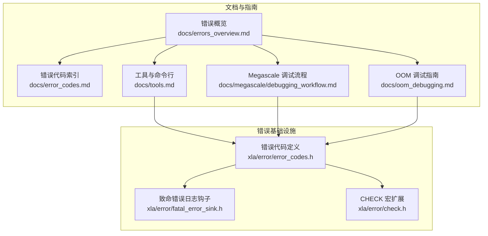
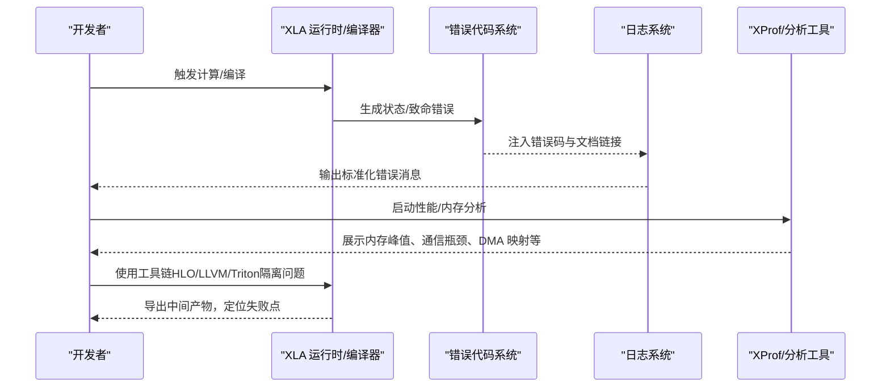
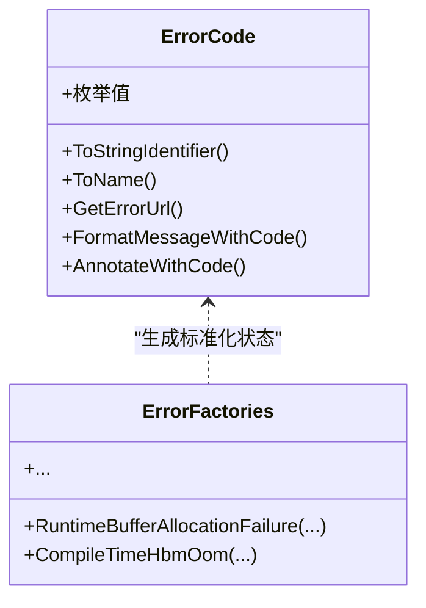
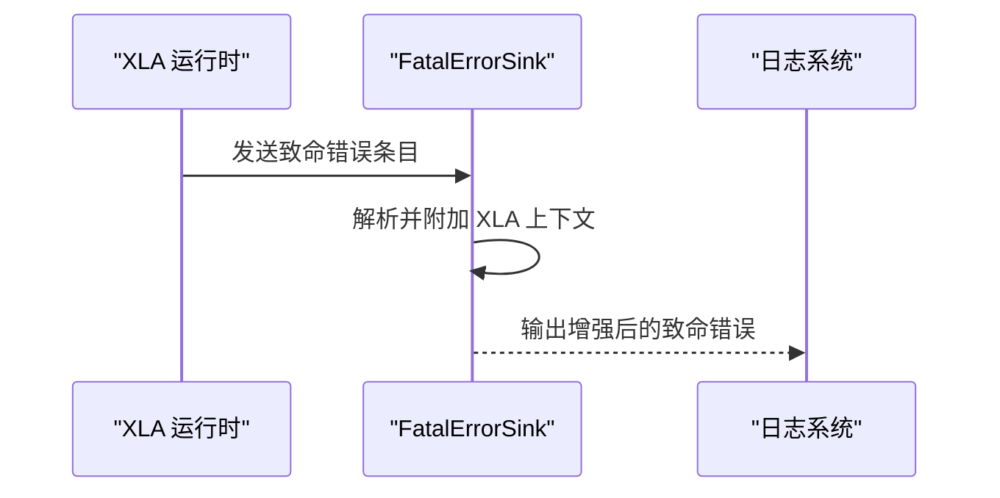
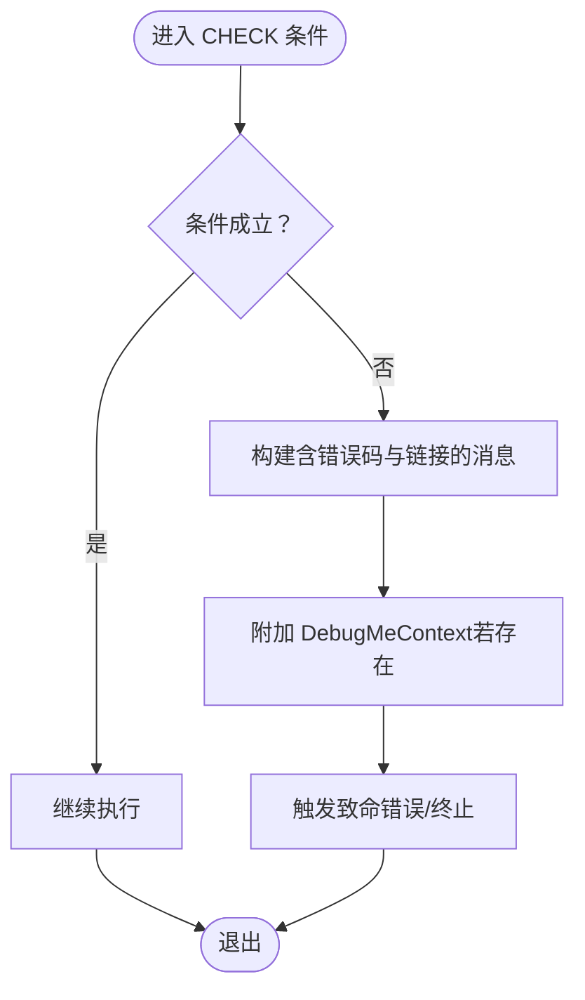
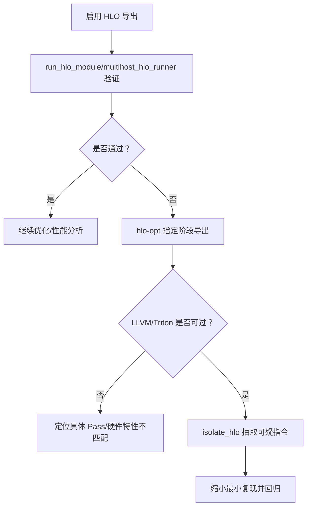
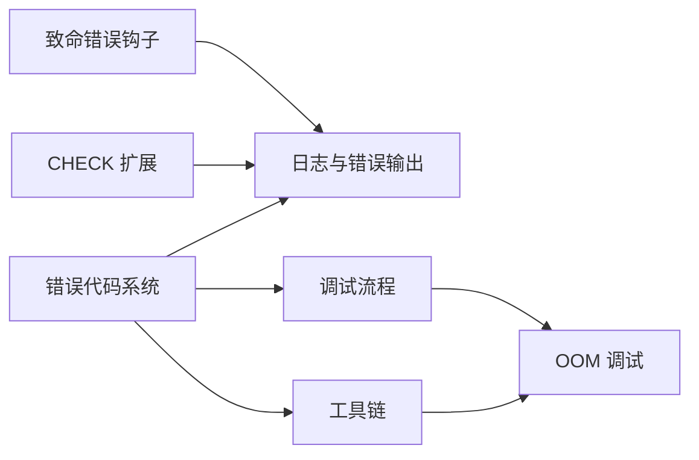
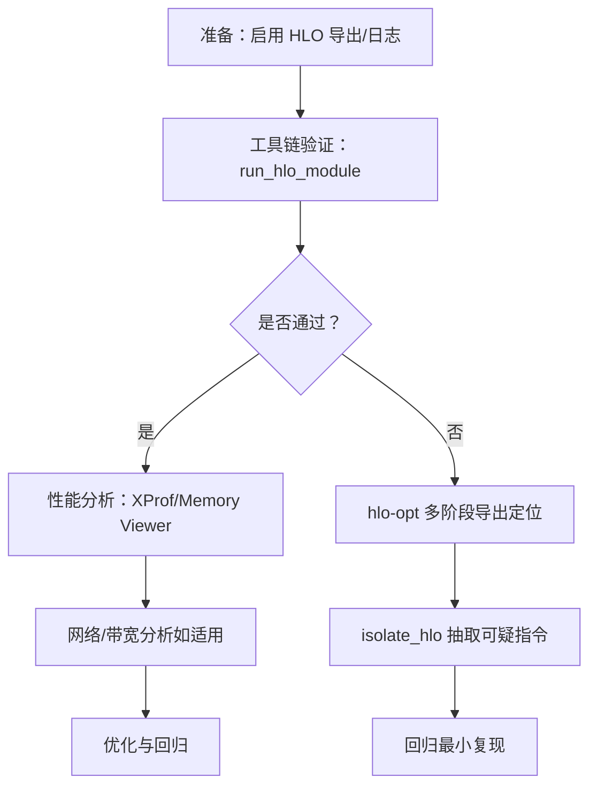

# 故障排除

<cite>
**本文引用的文件**
- [docs/errors_overview.md](file://docs/errors_overview.md)
- [docs/error_codes.md](file://docs/error_codes.md)
- [docs/oom_debugging.md](file://docs/oom_debugging.md)
- [docs/tools.md](file://docs/tools.md)
- [docs/megascale/debugging_workflow.md](file://docs/megascale/debugging_workflow.md)
- [xla/error/error_codes.h](file://xla/error/error_codes.h)
- [xla/error/fatal_error_sink.h](file://xla/error/fatal_error_sink.h)
- [xla/error/check.h](file://xla/error/check.h)
</cite>

## 目录
1. [简介](#简介)
2. [项目结构](#项目结构)
3. [核心组件](#核心组件)
4. [架构总览](#架构总览)
5. [详细组件分析](#详细组件分析)
6. [依赖关系分析](#依赖关系分析)
7. [性能考量](#性能考量)
8. [故障排除指南](#故障排除指南)
9. [结论](#结论)
10. [附录](#附录)

## 简介
本指南面向使用 XLA 的开发者与运维人员，聚焦于常见错误代码、内存溢出（OOM）问题、性能瓶颈与编译失败的系统化诊断方法。内容覆盖调试工作流、工具使用、日志与性能分析技巧，并提供具体案例与可操作的解决方案与预防建议。

## 项目结构
XLA 提供了多层级的故障排除与诊断能力：
- 错误体系与文档：统一的错误代码与分类，配套文档页用于解释与修复建议。
- 工具链：HLO 可视化与运行、多阶段编译产物导出、孤立问题指令等工具。
- 性能分析：XProf 内存查看器、网络分析、DMA 缓冲映射检查等。
- 调试流程：针对大规模训练场景（如 Megascale）的系统化排查步骤。

图表来源
- [docs/errors_overview.md](file://docs/errors_overview.md#L1-L37)
- [docs/error_codes.md](file://docs/error_codes.md#L1-L22)
- [docs/oom_debugging.md](file://docs/oom_debugging.md#L1-L88)
- [docs/tools.md](file://docs/tools.md#L1-L334)
- [docs/megascale/debugging_workflow.md](file://docs/megascale/debugging_workflow.md#L1-L316)
- [xla/error/error_codes.h](file://xla/error/error_codes.h#L1-L266)
- [xla/error/fatal_error_sink.h](file://xla/error/fatal_error_sink.h#L1-L40)
- [xla/error/check.h](file://xla/error/check.h#L1-L53)

章节来源
- [docs/errors_overview.md](file://docs/errors_overview.md#L1-L37)
- [docs/error_codes.md](file://docs/error_codes.md#L1-L22)
- [docs/oom_debugging.md](file://docs/oom_debugging.md#L1-L88)
- [docs/tools.md](file://docs/tools.md#L1-L334)
- [docs/megascale/debugging_workflow.md](file://docs/megascale/debugging_workflow.md#L1-L316)
- [xla/error/error_codes.h](file://xla/error/error_codes.h#L1-L266)
- [xla/error/fatal_error_sink.h](file://xla/error/fatal_error_sink.h#L1-L40)
- [xla/error/check.h](file://xla/error/check.h#L1-L53)

## 核心组件
- 统一错误代码与消息格式：通过集中式枚举与工厂函数生成带标准前缀与文档链接的状态对象，便于跨模块一致化诊断。
- 致命错误日志钩子：在发生致命错误时附加 XLA 特定上下文，辅助快速定位根因。
- CHECK 宏扩展：在保留 Abseil CHECK 行为的同时，注入错误码与调试信息，便于开发期快速定位异常路径。

章节来源
- [xla/error/error_codes.h](file://xla/error/error_codes.h#L35-L102)
- [xla/error/fatal_error_sink.h](file://xla/error/fatal_error_sink.h#L24-L36)
- [xla/error/check.h](file://xla/error/check.h#L21-L50)

## 架构总览
下图展示了从“错误产生/捕获”到“诊断与修复”的关键路径，以及与工具链的交互。

图表来源
- [xla/error/error_codes.h](file://xla/error/error_codes.h#L156-L188)
- [xla/error/fatal_error_sink.h](file://xla/error/fatal_error_sink.h#L26-L35)
- [docs/tools.md](file://docs/tools.md#L22-L114)
- [docs/oom_debugging.md](file://docs/oom_debugging.md#L13-L87)

## 详细组件分析

### 组件A：错误代码与消息格式
- 设计要点
  - 集中式枚举与工厂函数，确保所有错误消息具备统一前缀与文档链接。
  - 支持对现有 absl::Status 的注解，保留原始载荷与源位置信息。
  - 与 CHECK 宏结合，形成“开发期快速失败 + 标准化错误输出”的闭环。

图表来源
- [xla/error/error_codes.h](file://xla/error/error_codes.h#L105-L188)

章节来源
- [xla/error/error_codes.h](file://xla/error/error_codes.h#L35-L188)

### 组件B：致命错误日志钩子
- 设计要点
  - 作为 absl::LogSink 的实现，拦截致命错误并追加 XLA 上下文。
  - 线程安全且幂等，可在进程生命周期内多次注册。

图表来源
- [xla/error/fatal_error_sink.h](file://xla/error/fatal_error_sink.h#L26-L35)

章节来源
- [xla/error/fatal_error_sink.h](file://xla/error/fatal_error_sink.h#L24-L36)

### 组件C：CHECK 宏扩展
- 设计要点
  - 保持 Abseil CHECK 的 API 与行为一致性。
  - 自动注入错误码与文档链接，并在可用时附加 DebugMeContext。

图表来源
- [xla/error/check.h](file://xla/error/check.h#L21-L50)
- [xla/error/error_codes.h](file://xla/error/error_codes.h#L156-L188)

章节来源
- [xla/error/check.h](file://xla/error/check.h#L21-L50)

### 组件D：工具链与调试流程
- HLO 可视化与运行：通过 run_hlo_module 与 multihost_hlo_runner 快速验证优化前后行为。
- 多阶段编译产物导出：hlo-opt 支持 HLO/LLVM/Triton 等阶段输出，便于定位编译失败点。
- 孤立问题指令：isolate_hlo 将可疑指令抽取为最小可复现模块。
- OOM 调试：XProf Memory Viewer 可视化峰值内存与热点算子，指导优化。

图表来源
- [docs/tools.md](file://docs/tools.md#L22-L114)
- [docs/tools.md](file://docs/tools.md#L309-L333)
- [docs/oom_debugging.md](file://docs/oom_debugging.md#L13-L87)

章节来源
- [docs/tools.md](file://docs/tools.md#L22-L114)
- [docs/tools.md](file://docs/tools.md#L184-L274)
- [docs/tools.md](file://docs/tools.md#L309-L333)
- [docs/oom_debugging.md](file://docs/oom_debugging.md#L13-L87)

## 依赖关系分析
- 错误基础设施与文档/工具链的耦合
  - 错误代码系统为所有诊断输出提供统一标识与链接，贯穿日志、工具链与文档。
  - 致命错误钩子与 CHECK 宏扩展共同提升“异常即诊断”的效率。
  - 工具链（HLO/LLVM/Triton）与 OOM 调试工具为根因定位提供数据支撑。

图表来源
- [xla/error/error_codes.h](file://xla/error/error_codes.h#L156-L188)
- [xla/error/fatal_error_sink.h](file://xla/error/fatal_error_sink.h#L26-L35)
- [xla/error/check.h](file://xla/error/check.h#L21-L50)
- [docs/tools.md](file://docs/tools.md#L22-L114)
- [docs/oom_debugging.md](file://docs/oom_debugging.md#L13-L87)
- [docs/megascale/debugging_workflow.md](file://docs/megascale/debugging_workflow.md#L16-L188)

章节来源
- [xla/error/error_codes.h](file://xla/error/error_codes.h#L156-L188)
- [xla/error/fatal_error_sink.h](file://xla/error/fatal_error_sink.h#L26-L35)
- [xla/error/check.h](file://xla/error/check.h#L21-L50)
- [docs/tools.md](file://docs/tools.md#L22-L114)
- [docs/oom_debugging.md](file://docs/oom_debugging.md#L13-L87)
- [docs/megascale/debugging_workflow.md](file://docs/megascale/debugging_workflow.md#L16-L188)

## 性能考量
- 利用 XProf Memory Viewer 识别峰值内存与热点算子，避免过度临时张量与填充浪费。
- 关注 DMA 缓冲映射与零拷贝网络传输，避免运行时频繁映射与额外拷贝。
- 对高带宽需求区域进行网络分析，识别长尾延迟与带宽饱和区间，优化集合通信与数据分片策略。

章节来源
- [docs/oom_debugging.md](file://docs/oom_debugging.md#L190-L316)
- [docs/megascale/debugging_workflow.md](file://docs/megascale/debugging_workflow.md#L190-L316)

## 故障排除指南

### 通用调试工作流程
- 前置准备
  - 启用 HLO 导出以获得全阶段快照。
  - 在需要时开启详细日志模块（如程序执行状态）。
- 分步排查
  - 先用工具链快速验证优化后行为；若失败，逐阶段导出定位失败点。
  - 使用 OOM 调试工具定位峰值内存与热点算子。
  - 结合 Megascale 流程排查挂起、网络与模块指纹不一致等问题。

图表来源
- [docs/tools.md](file://docs/tools.md#L22-L114)
- [docs/tools.md](file://docs/tools.md#L309-L333)
- [docs/oom_debugging.md](file://docs/oom_debugging.md#L13-L87)
- [docs/megascale/debugging_workflow.md](file://docs/megascale/debugging_workflow.md#L16-L188)

章节来源
- [docs/tools.md](file://docs/tools.md#L22-L114)
- [docs/tools.md](file://docs/tools.md#L309-L333)
- [docs/oom_debugging.md](file://docs/oom_debugging.md#L13-L87)
- [docs/megascale/debugging_workflow.md](file://docs/megascale/debugging_workflow.md#L16-L188)

### 常见错误代码与处理建议
- 运行时资源耗尽（缓冲区/程序分配失败）
  - 现象：运行时分配失败，通常伴随峰值内存或输入尺寸异常。
  - 建议：使用 Memory Viewer 定位热点；减少临时张量、调整批大小或布局。
- 编译时 HBM OOM
  - 现象：编译阶段显存不足，常由大矩阵乘或密集临时张量导致。
  - 建议：拆分计算、降低精度、优化分块与布局；必要时调整硬件目标配置。
- 编译时主机卸载输出位置不匹配
  - 现象：主机卸载路径与设备侧输出不一致。
  - 建议：核对主机/设备缓冲区绑定与输出位置约束。
- 编译时不支持的右侧数据类型（硬件）
  - 现象：某些硬件不支持特定数据类型组合。
  - 建议：更换兼容的数据类型或后端路径。
- 编译时 Mosaic 对齐/访问不一致
  - 现象：块与平铺对齐问题或未证明的内存访问对齐。
  - 建议：调整形状/布局以满足对齐约束。
- 编译时 SparseCore 分配失败/副本数无效
  - 现象：稀疏内核分配或逻辑副本数不可行。
  - 建议：检查稀疏结构与副本配置，必要时降级到稠密路径。

章节来源
- [docs/error_codes.md](file://docs/error_codes.md#L5-L22)
- [docs/errors_overview.md](file://docs/errors_overview.md#L18-L36)
- [xla/error/error_codes.h](file://xla/error/error_codes.h#L61-L102)

### 内存溢出（OOM）诊断与修复
- 步骤
  - 使用性能分析工具采集轨迹。
  - 打开 Memory Viewer，聚焦 HBM 峰值与热点算子。
  - 结合 HLO 导出与工具链逐步回退，定位导致峰值的指令或 Pass。
- 常见原因
  - 过大的中间张量、低效填充、过多临时缓冲。
- 修复建议
  - 优化形状/布局，减少临时张量；拆分大算子；降低数据类型精度。

章节来源
- [docs/oom_debugging.md](file://docs/oom_debugging.md#L1-L88)
- [docs/tools.md](file://docs/tools.md#L22-L114)

### 编译失败的诊断方法
- 使用工具链
  - run_hlo_module：快速验证优化后行为。
  - hlo-opt：按阶段导出中间表示，定位失败点。
  - isolate_hlo：抽取可疑指令形成最小复现。
- 日志与错误码
  - 通过标准化错误消息与文档链接快速定位根因。

章节来源
- [docs/tools.md](file://docs/tools.md#L22-L114)
- [docs/tools.md](file://docs/tools.md#L184-L274)
- [docs/tools.md](file://docs/tools.md#L309-L333)
- [xla/error/error_codes.h](file://xla/error/error_codes.h#L156-L188)

### 大规模训练（Megascale）挂起与性能问题
- 挂起诊断
  - 检查致命错误摘要与潜在根因（坏芯片、网络问题、模块不一致、输入停滞等）。
  - 对比各 Worker 的 HLO 指纹与模块状态，确认一致性。
- 性能优化
  - 检查 DMA 缓冲映射与零拷贝网络传输。
  - 使用网络分析工具评估集合通信与带宽占用，优化集合松弛与通信重叠。

章节来源
- [docs/megascale/debugging_workflow.md](file://docs/megascale/debugging_workflow.md#L25-L188)
- [docs/megascale/debugging_workflow.md](file://docs/megascale/debugging_workflow.md#L190-L316)

### 工具使用指南
- HLO 可视化与运行
  - run_hlo_module：默认对比参考解释器，支持多平台。
  - multihost_hlo_runner：支持 SPMD 与跨主机通信。
- 多阶段编译导出
  - hlo-opt：列出阶段、导出 HLO/LLVM/Triton 等。
  - 设备无关编译：指定 GPU 目标配置，无需真实设备。
- 孤立问题指令
  - isolate_hlo：抽取单个指令及其上下文，形成最小复现。

章节来源
- [docs/tools.md](file://docs/tools.md#L22-L114)
- [docs/tools.md](file://docs/tools.md#L184-L274)
- [docs/tools.md](file://docs/tools.md#L309-L333)

### 日志与错误码分析
- 统一错误码与消息格式
  - 所有错误消息均带有标准化前缀与文档链接，便于检索与归档。
- 致命错误钩子
  - 在崩溃前附加 XLA 上下文，帮助快速定位异常路径。
- CHECK 宏扩展
  - 开发期快速失败，自动注入错误码与调试信息。

章节来源
- [xla/error/error_codes.h](file://xla/error/error_codes.h#L156-L188)
- [xla/error/fatal_error_sink.h](file://xla/error/fatal_error_sink.h#L26-L35)
- [xla/error/check.h](file://xla/error/check.h#L21-L50)

### 预防性措施与最佳实践
- 代码层面
  - 使用 CHECK/QCHECK/D CHECK 进行前置校验与不变式检查。
  - 对外部输入与边界条件进行显式校验，避免隐性错误。
- 编译与运行
  - 启用 HLO 导出与性能分析，建立“编译-修改-运行”的快速迭代。
  - 在 CI 中加入关键模型的回归测试与性能阈值告警。
- 运维与监控
  - 对大规模训练场景，持续监控网络延迟与带宽占用，提前发现通信瓶颈。
  - 对 DMA 映射与内存峰值进行基线化，及时发现异常波动。

章节来源
- [xla/error/check.h](file://xla/error/check.h#L21-L50)
- [docs/tools.md](file://docs/tools.md#L22-L114)
- [docs/megascale/debugging_workflow.md](file://docs/megascale/debugging_workflow.md#L190-L316)

## 结论
通过统一的错误代码体系、标准化的日志与致命错误钩子、完善的工具链与系统化的调试流程，XLA 能够有效支撑从开发期到生产环境的故障排除。建议在日常开发中养成“先工具链验证、再逐步回退、最后最小化复现”的习惯，并结合性能分析与网络观测，形成闭环的诊断与优化流程。

## 附录
- 相关文档与页面入口
  - 错误概览与状态机制说明
  - 错误代码索引与分类
  - OOM 调试与 XProf 使用
  - 工具链与命令行说明
  - Megascale 调试流程与性能分析

章节来源
- [docs/errors_overview.md](file://docs/errors_overview.md#L10-L36)
- [docs/error_codes.md](file://docs/error_codes.md#L1-L22)
- [docs/oom_debugging.md](file://docs/oom_debugging.md#L1-L88)
- [docs/tools.md](file://docs/tools.md#L1-L334)
- [docs/megascale/debugging_workflow.md](file://docs/megascale/debugging_workflow.md#L1-L316)