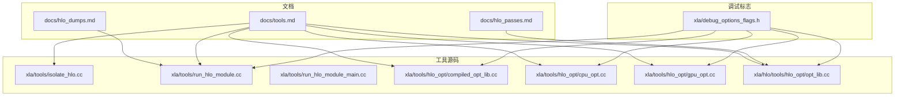
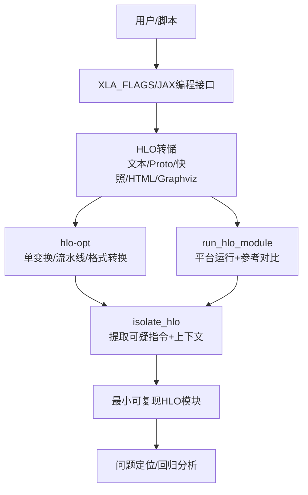
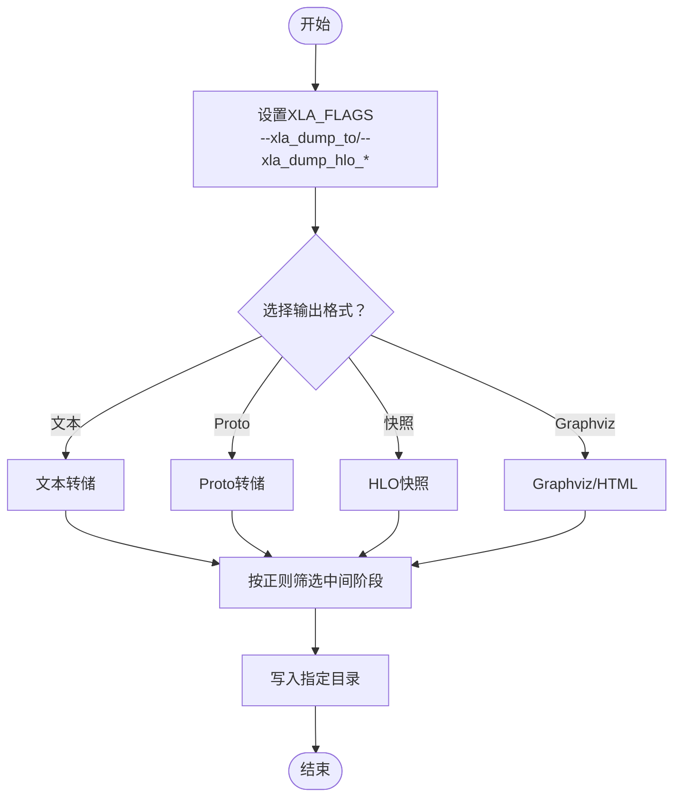
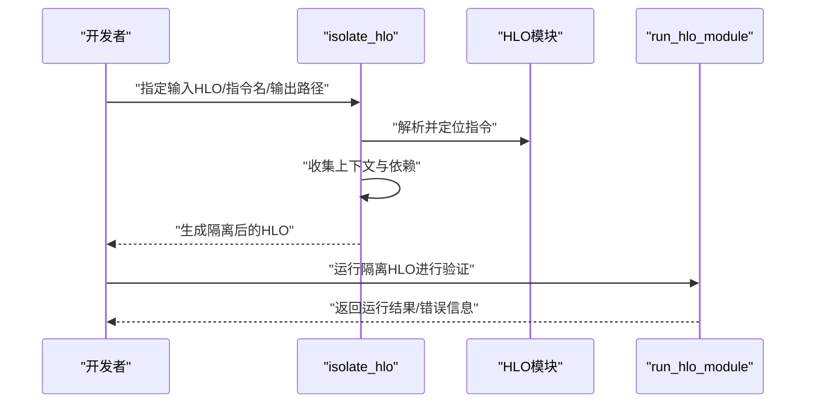
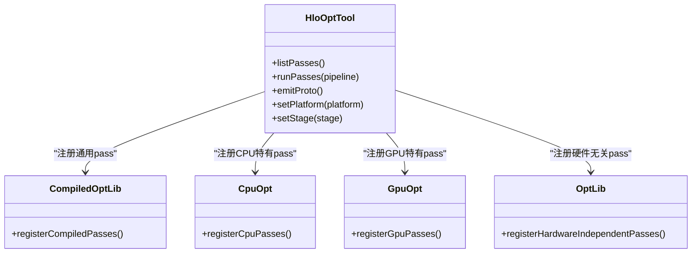
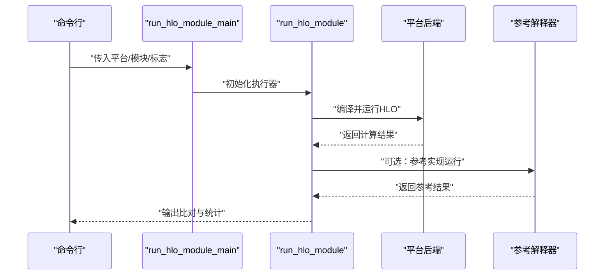
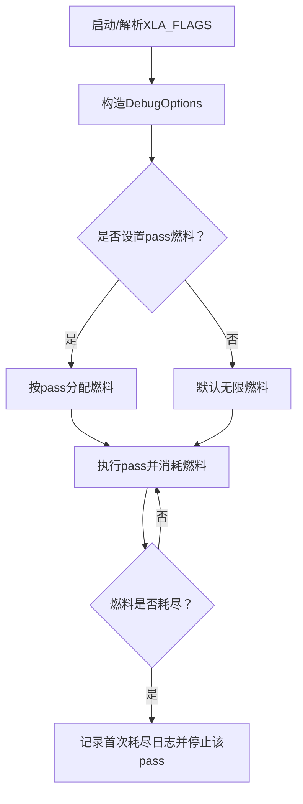
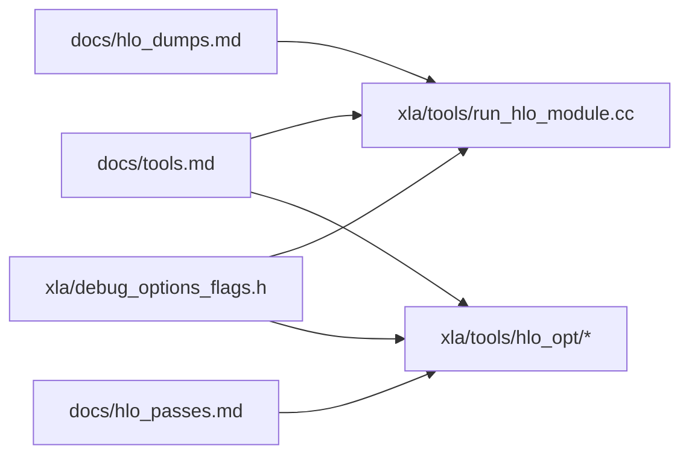

# HLO调试工具

<cite>
**本文引用的文件**
- [docs/hlo_dumps.md](file://docs/hlo_dumps.md)
- [docs/tools.md](file://docs/tools.md)
- [docs/hlo_passes.md](file://docs/hlo_passes.md)
- [xla/debug_options_flags.h](file://xla/debug_options_flags.h)
- [xla/tools/isolate_hlo.cc](file://xla/tools/isolate_hlo.cc)
- [xla/tools/run_hlo_module.cc](file://xla/tools/run_hlo_module.cc)
- [xla/tools/run_hlo_module_main.cc](file://xla/tools/run_hlo_module_main.cc)
- [xla/tools/hlo_opt/compiled_opt_lib.cc](file://xla/tools/hlo_opt/compiled_opt_lib.cc)
- [xla/tools/hlo_opt/cpu_opt.cc](file://xla/tools/hlo_opt/cpu_opt.cc)
- [xla/tools/hlo_opt/gpu_opt.cc](file://xla/tools/hlo_opt/gpu_opt.cc)
- [xla/hlo/tools/hlo_opt/opt_lib.cc](file://xla/hlo/tools/hlo_opt/opt_lib.cc)
</cite>

## 目录
1. [简介](#简介)
2. [项目结构](#项目结构)
3. [核心组件](#核心组件)
4. [架构总览](#架构总览)
5. [详细组件分析](#详细组件分析)
6. [依赖关系分析](#依赖关系分析)
7. [性能考量](#性能考量)
8. [故障排查指南](#故障排查指南)
9. [结论](#结论)
10. [附录](#附录)

## 简介
本文件系统性介绍XLA/HLO调试工具链，覆盖以下主题：
- HLO转储机制：如何启用转储、选择输出格式（文本/协议缓冲/快照/HTML/Graphviz URL）、按编译阶段筛选转储、在JAX中程序化获取HLO。
- HLO二分查找工具（isolate_hlo）：如何从大型HLO模块中提取单个指令及其必要上下文，快速定位导致崩溃或性能问题的根因。
- HLO优化工具（hlo-opt）：如何运行单个HLO变换、构建自定义流水线、转换HLO文本与Proto格式、设备无关/设备相关编译阶段的使用。
- 命令行示例与配置选项：XLA_FLAGS与平台参数、调试标志、输出格式定制、自动调优与目标设备规格文件。
- HLO比较工具：如何对比不同版本或不同配置下的HLO图，辅助理解代码变更对编译器优化的影响。

本指南兼顾工程实践与可读性，既适合初学者快速上手，也提供深入的技术细节以支持高级调试与优化。

## 项目结构
围绕HLO调试与工具，仓库中与本主题直接相关的文档与源码主要分布在如下位置：
- 文档：docs/hlo_dumps.md（HLO转储）、docs/tools.md（工具总览与命令）、docs/hlo_passes.md（HLO变换与优化）
- 工具源码：xla/tools/isolate_hlo.cc（HLO二分查找）、xla/tools/run_hlo_module.cc（运行HLO模块）、xla/tools/hlo_opt/*（HLO优化工具注册与平台适配）
- 调试标志：xla/debug_options_flags.h（调试标志接口与“compiler fuel”等）

图表来源
- [docs/hlo_dumps.md](file://docs/hlo_dumps.md#L1-L261)
- [docs/tools.md](file://docs/tools.md#L1-L334)
- [docs/hlo_passes.md](file://docs/hlo_passes.md#L1-L231)
- [xla/tools/isolate_hlo.cc](file://xla/tools/isolate_hlo.cc)
- [xla/tools/run_hlo_module.cc](file://xla/tools/run_hlo_module.cc)
- [xla/tools/run_hlo_module_main.cc](file://xla/tools/run_hlo_module_main.cc)
- [xla/tools/hlo_opt/compiled_opt_lib.cc](file://xla/tools/hlo_opt/compiled_opt_lib.cc)
- [xla/tools/hlo_opt/cpu_opt.cc](file://xla/tools/hlo_opt/cpu_opt.cc)
- [xla/tools/hlo_opt/gpu_opt.cc](file://xla/tools/hlo_opt/gpu_opt.cc)
- [xla/hlo/tools/hlo_opt/opt_lib.cc](file://xla/hlo/tools/hlo_opt/opt_lib.cc)
- [xla/debug_options_flags.h](file://xla/debug_options_flags.h#L1-L159)

章节来源
- [docs/hlo_dumps.md](file://docs/hlo_dumps.md#L1-L261)
- [docs/tools.md](file://docs/tools.md#L1-L334)
- [docs/hlo_passes.md](file://docs/hlo_passes.md#L1-L231)
- [xla/debug_options_flags.h](file://xla/debug_options_flags.h#L1-L159)

## 核心组件
- HLO转储工具链：通过环境变量或程序化方式触发，支持多种输出格式与中间阶段筛选，便于在不同后端与平台上复现与对比。
- isolate_hlo：从大型HLO模块中抽取特定指令及其上下文，生成最小可复现子模块，加速定位问题。
- hlo-opt：执行单个HLO变换、构建自定义流水线、在多平台阶段间转换HLO表示，支持调试标志与自动调优。
- run_hlo_module：在指定平台（CPU/GPU/Interpreter）上运行预优化HLO并进行正确性比对。
- 调试标志系统：提供XLA_FLAGS解析、默认值管理、线程本地“compiler fuel”等调试能力。

章节来源
- [docs/hlo_dumps.md](file://docs/hlo_dumps.md#L1-L261)
- [docs/tools.md](file://docs/tools.md#L1-L334)
- [xla/tools/isolate_hlo.cc](file://xla/tools/isolate_hlo.cc)
- [xla/tools/run_hlo_module.cc](file://xla/tools/run_hlo_module.cc)
- [xla/tools/run_hlo_module_main.cc](file://xla/tools/run_hlo_module_main.cc)
- [xla/tools/hlo_opt/compiled_opt_lib.cc](file://xla/tools/hlo_opt/compiled_opt_lib.cc)
- [xla/tools/hlo_opt/cpu_opt.cc](file://xla/tools/hlo_opt/cpu_opt.cc)
- [xla/tools/hlo_opt/gpu_opt.cc](file://xla/tools/hlo_opt/gpu_opt.cc)
- [xla/hlo/tools/hlo_opt/opt_lib.cc](file://xla/hlo/tools/hlo_opt/opt_lib.cc)
- [xla/debug_options_flags.h](file://xla/debug_options_flags.h#L1-L159)

## 架构总览
下图展示了HLO调试工具链的整体交互：用户通过XLA_FLAGS或程序化接口触发转储；随后使用run_hlo_module进行运行与比对；用hlo-opt执行单个变换或构建流水线；最后用isolate_hlo提取可疑指令形成最小复现。

图表来源
- [docs/hlo_dumps.md](file://docs/hlo_dumps.md#L1-L261)
- [docs/tools.md](file://docs/tools.md#L1-L334)
- [xla/tools/isolate_hlo.cc](file://xla/tools/isolate_hlo.cc)
- [xla/tools/run_hlo_module.cc](file://xla/tools/run_hlo_module.cc)
- [xla/tools/run_hlo_module_main.cc](file://xla/tools/run_hlo_module_main.cc)
- [xla/tools/hlo_opt/compiled_opt_lib.cc](file://xla/tools/hlo_opt/compiled_opt_lib.cc)
- [xla/tools/hlo_opt/cpu_opt.cc](file://xla/tools/hlo_opt/cpu_opt.cc)
- [xla/tools/hlo_opt/gpu_opt.cc](file://xla/tools/hlo_opt/gpu_opt.cc)
- [xla/hlo/tools/hlo_opt/opt_lib.cc](file://xla/hlo/tools/hlo_opt/opt_lib.cc)

## 详细组件分析

### HLO转储机制
- 启用方式
  - 环境变量：通过XLA_FLAGS设置转储目录与输出格式（文本/Proto/快照/Graphviz URL/HTML）。
  - 中间阶段：使用正则表达式筛选特定编译阶段（如SPMD相关pass）。
  - JAX：程序化获取未优化/优化后的HLO文本，或在编译过程中写入文件。
- 输出格式
  - 文本：人类可读，适合审阅与提交bug报告。
  - Proto：结构化机器可读，适合工具链处理。
  - 快照：包含模块与输入，便于重放。
  - Graphviz/HTML：仅适用于较小图，便于可视化。
- 使用建议
  - 提交bug时包含“before_optimizations/after_optimizations/buffer-assignment”三类文件。
  - 大图场景优先使用interactive_graphviz或按阶段转储。

图表来源
- [docs/hlo_dumps.md](file://docs/hlo_dumps.md#L1-L261)

章节来源
- [docs/hlo_dumps.md](file://docs/hlo_dumps.md#L1-L261)

### HLO二分查找工具（isolate_hlo）
- 功能概述
  - 从大型HLO模块中抽取单个指令及其必要上下文，生成新的小HLO模块，用于最小化复现。
- 典型流程
  - 指定输入HLO（文本/Proto）、指令名、输出路径与格式。
  - 结合run_hlo_module验证抽取结果是否仍能复现问题。
- 最佳实践
  - 优先抽取可疑指令与其“必要使用者/定义者”闭包，避免遗漏依赖。
  - 将抽取得到的最小模块纳入自动化回归测试。

图表来源
- [docs/tools.md](file://docs/tools.md#L309-L333)
- [xla/tools/isolate_hlo.cc](file://xla/tools/isolate_hlo.cc)

章节来源
- [docs/tools.md](file://docs/tools.md#L309-L333)
- [xla/tools/isolate_hlo.cc](file://xla/tools/isolate_hlo.cc)

### HLO优化工具（hlo-opt）
- 单变换执行
  - 支持列出所有可用pass，按名称执行单个或多个pass，构建自定义流水线。
  - 可结合XLA_FLAGS传递调试选项（如特定pass的实验性参数）。
- 阶段转换
  - 在HLO、LLVM IR、PTX（NVIDIA）等阶段之间转换，支持设备无关与设备相关阶段。
  - 设备无关pass可使用轻量版hlo-opt；需要硬件后端时使用完整版。
- 设备无关与平台适配
  - 平台注册：compiled_opt_lib、cpu_opt、gpu_opt分别注册通用与平台特有pass。
  - opt_lib集中注册硬件无关pass，便于统一使用。
- 自动调优与目标设备规格
  - 设备无关编译可通过目标设备规格文件与自动调优结果文件控制生成质量与性能。

图表来源
- [docs/tools.md](file://docs/tools.md#L65-L180)
- [xla/tools/hlo_opt/compiled_opt_lib.cc](file://xla/tools/hlo_opt/compiled_opt_lib.cc)
- [xla/tools/hlo_opt/cpu_opt.cc](file://xla/tools/hlo_opt/cpu_opt.cc)
- [xla/tools/hlo_opt/gpu_opt.cc](file://xla/tools/hlo_opt/gpu_opt.cc)
- [xla/hlo/tools/hlo_opt/opt_lib.cc](file://xla/hlo/tools/hlo_opt/opt_lib.cc)

章节来源
- [docs/tools.md](file://docs/tools.md#L65-L180)
- [xla/tools/hlo_opt/compiled_opt_lib.cc](file://xla/tools/hlo_opt/compiled_opt_lib.cc)
- [xla/tools/hlo_opt/cpu_opt.cc](file://xla/tools/hlo_opt/cpu_opt.cc)
- [xla/tools/hlo_opt/gpu_opt.cc](file://xla/tools/hlo_opt/gpu_opt.cc)
- [xla/hlo/tools/hlo_opt/opt_lib.cc](file://xla/hlo/tools/hlo_opt/opt_lib.cc)

### 运行HLO模块（run_hlo_module）
- 用途
  - 在指定平台（CPU/GPU/Interpreter）上运行预优化HLO，并与参考解释器实现进行结果比对。
- 多模块运行
  - 支持批量运行同一目录下的多个HLO模块，便于大规模回归。
- 多主机（SPMD）支持
  - 提供多主机runner，支持跨主机通信与SPMD场景。

图表来源
- [docs/tools.md](file://docs/tools.md#L22-L64)
- [xla/tools/run_hlo_module_main.cc](file://xla/tools/run_hlo_module_main.cc)
- [xla/tools/run_hlo_module.cc](file://xla/tools/run_hlo_module.cc)

章节来源
- [docs/tools.md](file://docs/tools.md#L22-L64)
- [xla/tools/run_hlo_module_main.cc](file://xla/tools/run_hlo_module_main.cc)
- [xla/tools/run_hlo_module.cc](file://xla/tools/run_hlo_module.cc)

### 调试标志与“compiler fuel”
- XLA_FLAGS解析与默认值
  - 提供从环境变量解析调试标志的能力，支持重置全局状态、获取默认值。
- “Compiler fuel”机制
  - 为每个pass消耗燃料，当燃料耗尽时停止变换，便于二分定位具体pass引发的问题。
  - 支持线程本地燃料池，避免多线程竞争影响。

图表来源
- [xla/debug_options_flags.h](file://xla/debug_options_flags.h#L95-L154)

章节来源
- [xla/debug_options_flags.h](file://xla/debug_options_flags.h#L1-L159)

### HLO比较工具
- 目标
  - 对比不同版本或不同配置下的HLO图，识别由代码变更引起的优化差异。
- 方法
  - 使用hlo-opt转换为统一格式（文本/Proto），再用diff工具或专用比较脚本进行差异分析。
  - 结合run_hlo_module对差异模块进行回归验证，确认性能或行为变化。

章节来源
- [docs/tools.md](file://docs/tools.md#L65-L180)
- [docs/hlo_passes.md](file://docs/hlo_passes.md#L1-L231)

## 依赖关系分析
- 工具与文档耦合
  - docs/hlo_dumps.md与docs/tools.md共同定义了HLO转储与工具使用规范，是工具链落地的依据。
- 工具与实现耦合
  - run_hlo_module依赖平台后端与参考解释器实现；hlo-opt依赖各平台注册表（compiled_opt_lib、cpu_opt、gpu_opt）与硬件无关注册表（opt_lib）。
- 调试标志与工具耦合
  - debug_options_flags.h为工具提供统一的调试标志解析与默认值管理，贯穿转储、运行与优化过程。

图表来源
- [docs/hlo_dumps.md](file://docs/hlo_dumps.md#L1-L261)
- [docs/tools.md](file://docs/tools.md#L1-L334)
- [docs/hlo_passes.md](file://docs/hlo_passes.md#L1-L231)
- [xla/debug_options_flags.h](file://xla/debug_options_flags.h#L1-L159)
- [xla/tools/run_hlo_module.cc](file://xla/tools/run_hlo_module.cc)
- [xla/tools/hlo_opt/compiled_opt_lib.cc](file://xla/tools/hlo_opt/compiled_opt_lib.cc)
- [xla/tools/hlo_opt/cpu_opt.cc](file://xla/tools/hlo_opt/cpu_opt.cc)
- [xla/tools/hlo_opt/gpu_opt.cc](file://xla/tools/hlo_opt/gpu_opt.cc)
- [xla/hlo/tools/hlo_opt/opt_lib.cc](file://xla/hlo/tools/hlo_opt/opt_lib.cc)

章节来源
- [docs/hlo_dumps.md](file://docs/hlo_dumps.md#L1-L261)
- [docs/tools.md](file://docs/tools.md#L1-L334)
- [docs/hlo_passes.md](file://docs/hlo_passes.md#L1-L231)
- [xla/debug_options_flags.h](file://xla/debug_options_flags.h#L1-L159)
- [xla/tools/run_hlo_module.cc](file://xla/tools/run_hlo_module.cc)
- [xla/tools/hlo_opt/compiled_opt_lib.cc](file://xla/tools/hlo_opt/compiled_opt_lib.cc)
- [xla/tools/hlo_opt/cpu_opt.cc](file://xla/tools/hlo_opt/cpu_opt.cc)
- [xla/tools/hlo_opt/gpu_opt.cc](file://xla/tools/hlo_opt/gpu_opt.cc)
- [xla/hlo/tools/hlo_opt/opt_lib.cc](file://xla/hlo/tools/hlo_opt/opt_lib.cc)

## 性能考量
- pass粒度测量
  - 使用hlo-opt单独运行pass并配合计时，可精确测量微小性能回归。
- 自动调优与设备规格
  - 设备无关编译可通过目标设备规格文件与自动调优结果文件控制生成质量，避免真实设备依赖带来的开销。
- 多模块批处理
  - run_hlo_module支持批量运行，提高回归效率；但需注意资源占用与并发控制。

章节来源
- [docs/tools.md](file://docs/tools.md#L143-L180)
- [docs/tools.md](file://docs/tools.md#L262-L274)

## 故障排查指南
- 定位问题步骤
  - 使用XLA_FLAGS开启转储，选择合适格式与中间阶段。
  - 用run_hlo_module在目标平台运行并比对结果。
  - 若问题复杂，使用isolate_hlo提取可疑指令，形成最小复现。
  - 用hlo-opt执行单个或组合pass，逐步缩小范围。
- 常见问题
  - 输出到stdout无二进制数据：确保设置了--xla_dump_to或使用其他格式。
  - 大图可视化困难：改用Graphviz URL/HTML或interactive_graphviz。
  - GPU相关pass需要设备：采用设备无关编译或提供目标设备规格文件与自动调优结果。

章节来源
- [docs/hlo_dumps.md](file://docs/hlo_dumps.md#L72-L75)
- [docs/tools.md](file://docs/tools.md#L309-L333)

## 结论
本指南梳理了XLA/HLO调试工具链的核心能力与使用方法：从HLO转储到运行验证，再到单变换调试与最小化复现，最终通过比较工具量化代码变更影响。借助这些工具与流程，开发者可以高效地定位性能瓶颈与行为异常，并建立稳定的回归保障体系。

## 附录
- 命令行示例与配置要点
  - 转储到目录并选择格式：参考“使用环境变量”与“格式选择”部分。
  - 按阶段转储：使用正则表达式筛选特定pass。
  - JAX程序化获取HLO：参考JAX-specific选项。
  - 运行HLO模块：指定平台与参考平台进行比对。
  - 执行单个/多个HLO变换：使用hlo-opt的--passes与--list-passes。
  - 设备无关编译与自动调优：参考设备无关编译与自动调优章节。
- 相关文档与源码路径
  - HLO转储与格式：docs/hlo_dumps.md
  - 工具总览与命令：docs/tools.md
  - HLO变换与优化：docs/hlo_passes.md
  - 调试标志接口：xla/debug_options_flags.h
  - isolate_hlo源码：xla/tools/isolate_hlo.cc
  - run_hlo_module源码：xla/tools/run_hlo_module.cc、xla/tools/run_hlo_module_main.cc
  - hlo-opt平台注册：xla/tools/hlo_opt/* 与 xla/hlo/tools/hlo_opt/opt_lib.cc