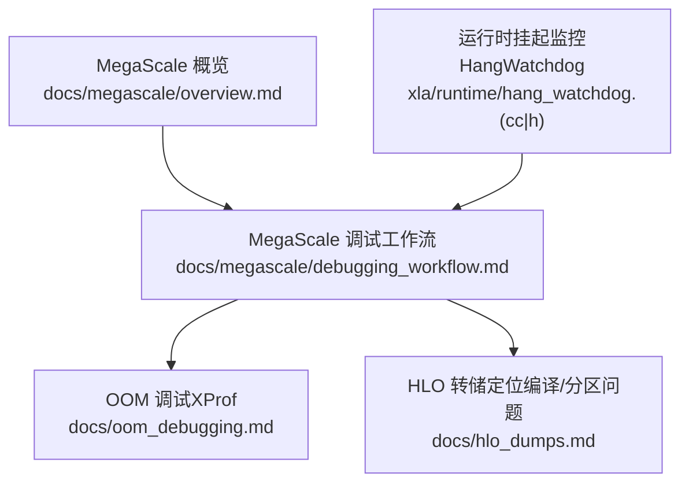
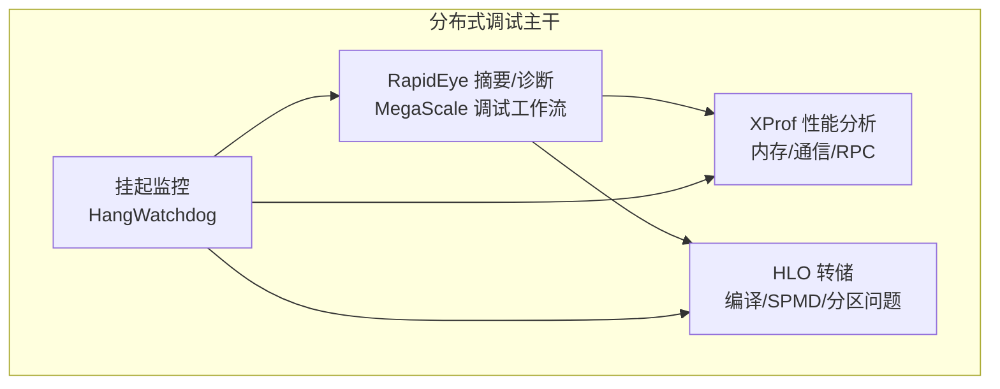
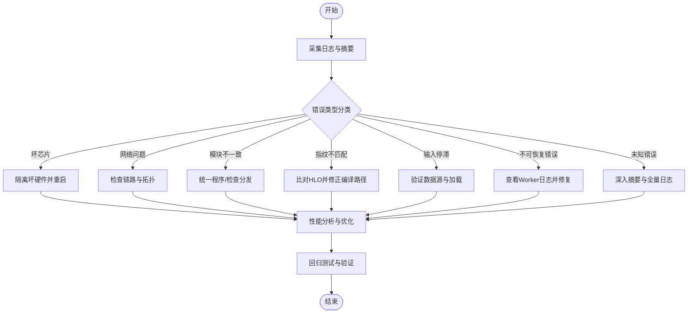
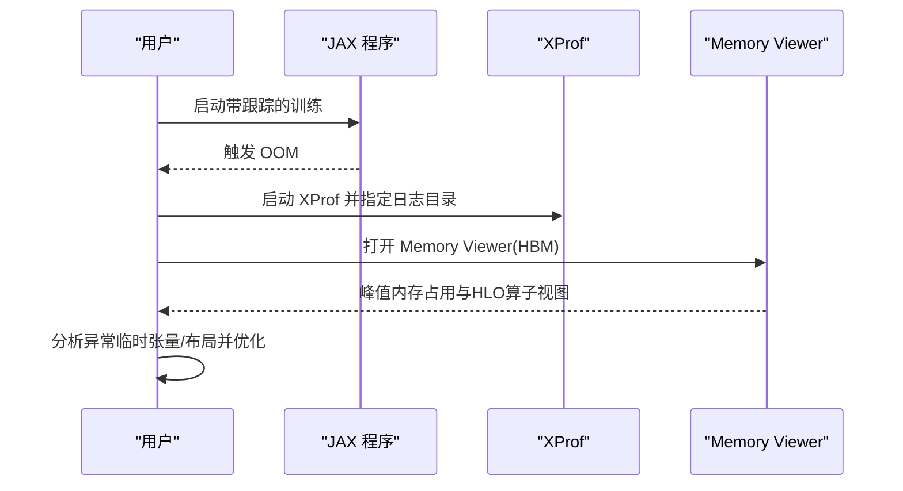
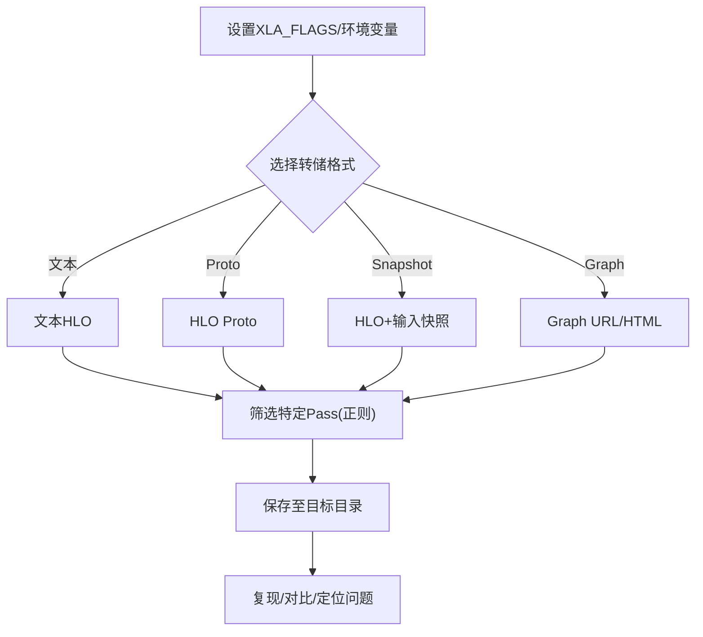
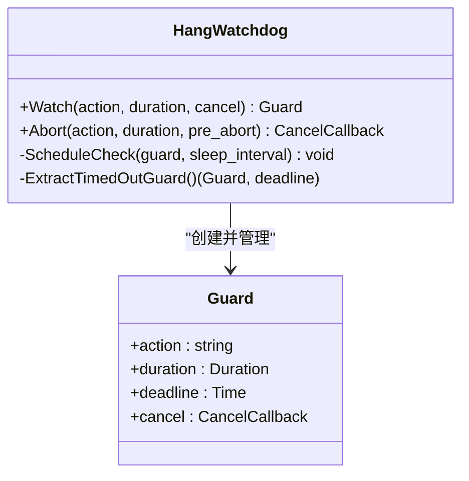
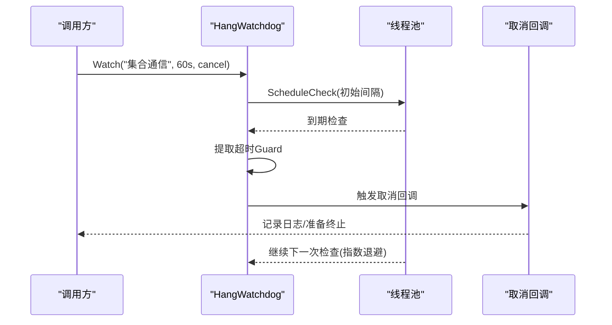
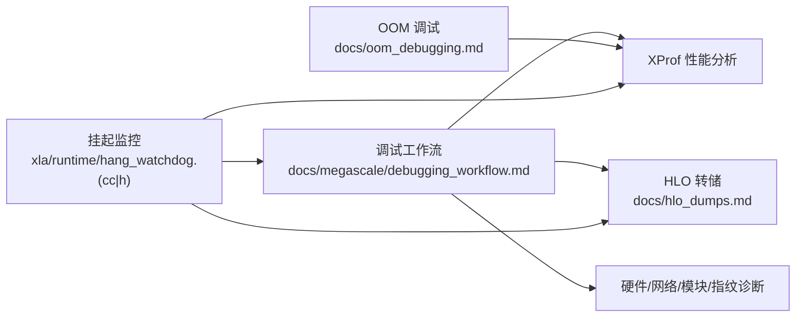

# 分布式调试技术

<cite>
**本文引用的文件**
- [docs/megascale/debugging_workflow.md](file://docs/megascale/debugging_workflow.md)
- [docs/megascale/overview.md](file://docs/megascale/overview.md)
- [docs/oom_debugging.md](file://docs/oom_debugging.md)
- [docs/hlo_dumps.md](file://docs/hlo_dumps.md)
- [xla/runtime/hang_watchdog.cc](file://xla/runtime/hang_watchdog.cc)
- [xla/runtime/hang_watchdog.h](file://xla/runtime/hang_watchdog.h)
</cite>

## 目录
1. [引言](#引言)
2. [项目结构](#项目结构)
3. [核心组件](#核心组件)
4. [架构总览](#架构总览)
5. [详细组件分析](#详细组件分析)
6. [依赖关系分析](#依赖关系分析)
7. [性能考量](#性能考量)
8. [故障排除指南](#故障排除指南)
9. [结论](#结论)
10. [附录](#附录)

## 引言
本指南聚焦于分布式XLA（尤其是Megascale）在多设备、多主机环境下的调试与优化。内容覆盖通信死锁、数据不一致、负载不均衡等典型问题的识别与解决；提供大规模集群下的MegaScale调试工作流；涵盖分布式内存管理（含内存泄漏与碎片）的诊断思路；以及分布式训练中梯度同步与模型并行化调试方法。文中所有技术细节均基于仓库内现有文档与源码实现进行归纳总结。

## 项目结构
围绕分布式调试主题，本仓库中与之直接相关的关键资源分布如下：
- MegaScale调试工作流与术语：位于 docs/megascale 下的 overview 与 debugging_workflow 文档
- 内存溢出（OOM）调试：位于 docs/oom_debugging.md
- HLO 调试转储：位于 docs/hlo_dumps.md
- 运行时挂起监控：位于 xla/runtime/hang_watchdog.(cc|h)

图表来源
- [docs/megascale/overview.md](file://docs/megascale/overview.md#L1-L55)
- [docs/megascale/debugging_workflow.md](file://docs/megascale/debugging_workflow.md#L1-L316)
- [docs/oom_debugging.md](file://docs/oom_debugging.md#L1-L88)
- [docs/hlo_dumps.md](file://docs/hlo_dumps.md#L1-L261)
- [xla/runtime/hang_watchdog.cc](file://xla/runtime/hang_watchdog.cc#L1-L190)
- [xla/runtime/hang_watchdog.h](file://xla/runtime/hang_watchdog.h#L1-L96)

章节来源
- [docs/megascale/overview.md](file://docs/megascale/overview.md#L1-L55)
- [docs/megascale/debugging_workflow.md](file://docs/megascale/debugging_workflow.md#L1-L316)
- [docs/oom_debugging.md](file://docs/oom_debugging.md#L1-L88)
- [docs/hlo_dumps.md](file://docs/hlo_dumps.md#L1-L261)
- [xla/runtime/hang_watchdog.cc](file://xla/runtime/hang_watchdog.cc#L1-L190)
- [xla/runtime/hang_watchdog.h](file://xla/runtime/hang_watchdog.h#L1-L96)

## 核心组件
- MegaScale 调试工作流：提供从错误定位到根因分类、再到性能优化的系统化流程，覆盖硬件故障、网络异常、模块不一致、指纹不匹配、输入停滞、不可恢复错误等场景，并给出性能分析要点（DMA映射、零拷贝、RPC延迟、带宽占用等）。
- OOM 调试（XProf Memory Viewer）：通过内存轨迹可视化峰值占用点，定位高占用算子与布局问题，辅助优化内存使用。
- HLO 转储：支持文本/HLO Proto/HLO Snapshot等多种格式，便于在不同阶段（编译前/后、特定Pass）输出中间表示，用于复现与对比。
- 运行时挂起监控（HangWatchdog）：为关键动作设置超时监控，超时触发取消回调，必要时强制终止进程以避免无限阻塞。

章节来源
- [docs/megascale/debugging_workflow.md](file://docs/megascale/debugging_workflow.md#L16-L316)
- [docs/oom_debugging.md](file://docs/oom_debugging.md#L1-L88)
- [docs/hlo_dumps.md](file://docs/hlo_dumps.md#L1-L261)
- [xla/runtime/hang_watchdog.cc](file://xla/runtime/hang_watchdog.cc#L34-L190)
- [xla/runtime/hang_watchdog.h](file://xla/runtime/hang_watchdog.h#L34-L96)

## 架构总览
下图展示了分布式调试的关键路径：从日志与摘要（RapidEye）到具体根因定位（硬件/网络/模块/指纹），再到性能分析（XProf）与编译中间表示（HLO）回溯。

图表来源
- [docs/megascale/debugging_workflow.md](file://docs/megascale/debugging_workflow.md#L1-L316)
- [docs/oom_debugging.md](file://docs/oom_debugging.md#L1-L88)
- [docs/hlo_dumps.md](file://docs/hlo_dumps.md#L1-L261)
- [xla/runtime/hang_watchdog.cc](file://xla/runtime/hang_watchdog.cc#L34-L190)

## 详细组件分析

### 组件A：MegaScale 调试工作流
- 目标：在多切片/多主机环境下快速定位“卡顿/死锁/性能瓶颈”，并指导修复与优化。
- 关键能力：
  - 错误分类：坏芯片、网络问题、模块不一致、HLO指纹不匹配、数据输入停滞、不可恢复错误、未知错误。
  - 性能分析：DMA映射、零拷贝、RPC延迟、带宽占用、集合通信重叠时间（Slack）。
  - 工具链：HLO转储、XProf Memory Viewer、网络分析笔记本。
- 典型流程：收集摘要 → 定位根因 → 采集证据（HLO/XProf）→ 修复/优化 → 验证。

图表来源
- [docs/megascale/debugging_workflow.md](file://docs/megascale/debugging_workflow.md#L25-L187)

章节来源
- [docs/megascale/debugging_workflow.md](file://docs/megascale/debugging_workflow.md#L1-L316)

### 组件B：OOM 调试（XProf Memory Viewer）
- 目标：可视化峰值内存占用，定位导致OOM的算子与布局问题。
- 关键步骤：
  - 使用 jax.profiler.trace 采集轨迹
  - 启动 XProf 并打开 Memory Viewer，选择 HBM
  - 在峰值点查看 HLO 算子与缓冲区，结合注释定位异常临时张量或填充问题
- 适用场景：训练中显存不足、峰值过高、布局不佳等。

图表来源
- [docs/oom_debugging.md](file://docs/oom_debugging.md#L9-L88)

章节来源
- [docs/oom_debugging.md](file://docs/oom_debugging.md#L1-L88)

### 组件C：HLO 转储与编译中间表示
- 目标：在编译前后/特定Pass阶段输出HLO，用于复现、对比与定位问题。
- 支持格式：文本、HLO Proto、HLO Snapshot、Graph URL/HTML（小图）。
- 关键用法：
  - 环境变量/命令行开关控制转储位置与格式
  - 正则过滤特定Pass（如SPMD/传播）
  - JAX 程序化接口获取原始/优化后的HLO
  - 可在CPU/GPU后端回放HLO以复现问题

图表来源
- [docs/hlo_dumps.md](file://docs/hlo_dumps.md#L14-L261)

章节来源
- [docs/hlo_dumps.md](file://docs/hlo_dumps.md#L1-L261)

### 组件D：运行时挂起监控（HangWatchdog）
- 目标：对关键动作设置超时监控，避免分布式环境下的“假活真停”导致的无限等待。
- 行为特征：
  - Watch 注册动作与超时，返回可撤销的Guard
  - 定期检查最近截止时间，超时触发取消回调
  - 多线程池调度，避免头阻塞；必要时统一触发进程终止
- 适用场景：集合通信、内核执行、跨设备同步等易出现死锁/卡顿的路径。

图表来源
- [xla/runtime/hang_watchdog.h](file://xla/runtime/hang_watchdog.h#L34-L96)

图表来源
- [xla/runtime/hang_watchdog.cc](file://xla/runtime/hang_watchdog.cc#L91-L187)

章节来源
- [xla/runtime/hang_watchdog.cc](file://xla/runtime/hang_watchdog.cc#L1-L190)
- [xla/runtime/hang_watchdog.h](file://xla/runtime/hang_watchdog.h#L1-L96)

## 依赖关系分析
- MegaScale 调试工作流是上层流程中枢，依赖日志摘要（RapidEye）、XProf性能分析与HLO转储作为证据来源。
- HangWatchdog 作为底层运行时保障，独立于上层流程但可被上层动作（如集合通信）包装使用，以防止死锁。
- OOM 调试与HLO转储互补：前者关注内存层面的峰值与布局，后者关注编译/分区层面的结构与Pass变化。

图表来源
- [docs/megascale/debugging_workflow.md](file://docs/megascale/debugging_workflow.md#L1-L316)
- [docs/oom_debugging.md](file://docs/oom_debugging.md#L1-L88)
- [docs/hlo_dumps.md](file://docs/hlo_dumps.md#L1-L261)
- [xla/runtime/hang_watchdog.cc](file://xla/runtime/hang_watchdog.cc#L1-L190)

章节来源
- [docs/megascale/debugging_workflow.md](file://docs/megascale/debugging_workflow.md#L1-L316)
- [docs/oom_debugging.md](file://docs/oom_debugging.md#L1-L88)
- [docs/hlo_dumps.md](file://docs/hlo_dumps.md#L1-L261)
- [xla/runtime/hang_watchdog.cc](file://xla/runtime/hang_watchdog.cc#L1-L190)

## 性能考量
- DMA 映射与零拷贝：关注稳态是否出现 MapDmaBuffer 注册，若频繁出现需增大预映射内存区域，减少动态注册带来的额外开销。
- 网络传输：优先零拷贝；若存在内存复制，应评估是否可通过调整数据布局/集合通信模式降低复制成本。
- 集合通信重叠：观察集合通信的 Slack 时间，过小可能意味着计算与通信未充分重叠，建议优化模型结构或数据分片策略。
- 带宽与延迟：通过网络分析工具生成时间线，识别带宽饱和/突发/尾延迟等现象，针对性优化批大小、通信聚合与拓扑配置。
- 编译与分区：利用 HLO 转储与特定 Pass 输出，定位SPMD/分区导致的通信热点与冗余，必要时调整分片策略或算子融合。

章节来源
- [docs/megascale/debugging_workflow.md](file://docs/megascale/debugging_workflow.md#L190-L316)
- [docs/hlo_dumps.md](file://docs/hlo_dumps.md#L76-L261)

## 故障排除指南
- 通信死锁/卡顿
  - 使用 RapidEye 摘要定位根因（坏芯片/网络/模块不一致/指纹不匹配）
  - 若无明确分类，结合 XProf 与 HLO 转储进一步分析
  - 对关键路径引入 HangWatchdog 监控，超时触发取消回调并记录现场
- 数据不一致
  - 检查模块一致性与HLO指纹一致性，确保各设备运行相同程序
  - 对比不同设备的HLO快照，确认输入/中间张量形状与布局一致
- 负载不均衡
  - 通过 XProf 的集合通信与Slack时间分析，识别重路径
  - 结合网络分析工具定位热点主机/链路，优化数据分片与批大小
- 内存泄漏/碎片
  - 使用 OOM 调试（XProf Memory Viewer）定位峰值占用点与异常临时张量
  - 优化布局、减少冗余临时变量、合并小操作以降低碎片
- 梯度同步问题
  - 在集合通信路径上增加监控与日志，结合HLO转储确认同步算子正确性
  - 对比不同设备的梯度张量，确保数值与形状一致
- 模型并行化调试
  - 使用 HLO 转储观察SPMD/分区Pass输出，定位通信与计算边界
  - 通过网络分析工具评估跨设备通信的聚合与重叠效果

章节来源
- [docs/megascale/debugging_workflow.md](file://docs/megascale/debugging_workflow.md#L25-L187)
- [docs/oom_debugging.md](file://docs/oom_debugging.md#L9-L88)
- [docs/hlo_dumps.md](file://docs/hlo_dumps.md#L76-L261)
- [xla/runtime/hang_watchdog.cc](file://xla/runtime/hang_watchdog.cc#L34-L190)

## 结论
本指南将MegaScale调试工作流、XProf性能分析、HLO转储与运行时挂起监控整合为一套面向多设备/多主机环境的系统化调试方案。通过“先分类、再取证、后优化”的闭环流程，可高效定位并解决分布式训练中的通信死锁、数据不一致、负载不均衡、内存压力等问题。建议在大规模集群中将上述工具与流程常态化使用，以提升稳定性与可维护性。

## 附录
- 实际案例与排障步骤（示例）
  - 案例A：集合通信卡顿
    - 步骤：启用 vmodule 日志与HLO转储 → RapidEye 摘要分类 → 若为网络问题，检查链路与拓扑 → 若为模块不一致，统一程序/检查分发 → 必要时引入 HangWatchdog 监控关键路径 → 优化后回归验证
  - 案例B：训练OOM
    - 步骤：开启 jax.profiler.trace → 启动 XProf Memory Viewer → 定位峰值占用点 → 分析异常临时张量/布局 → 优化布局/减少临时变量 → 回归验证
  - 案例C：梯度同步异常
    - 步骤：HLO 转储对比各设备程序 → 确认同步算子与分片策略 → 检查集合通信日志与XProf轨迹 → 修复后对比梯度一致性

章节来源
- [docs/megascale/debugging_workflow.md](file://docs/megascale/debugging_workflow.md#L1-L316)
- [docs/oom_debugging.md](file://docs/oom_debugging.md#L1-L88)
- [docs/hlo_dumps.md](file://docs/hlo_dumps.md#L1-L261)
- [xla/runtime/hang_watchdog.cc](file://xla/runtime/hang_watchdog.cc#L1-L190)