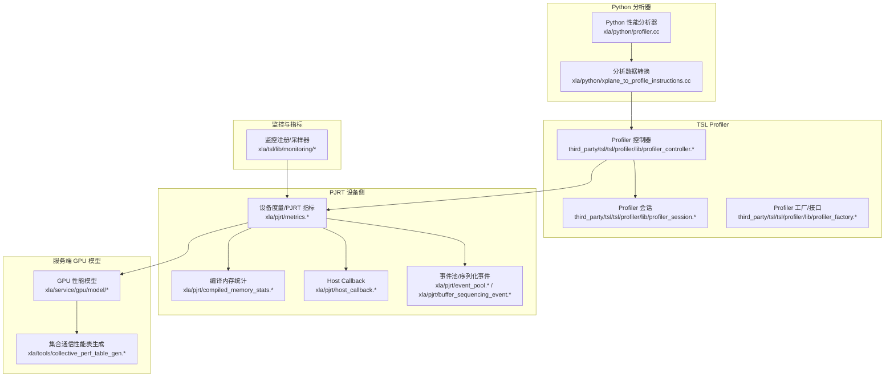
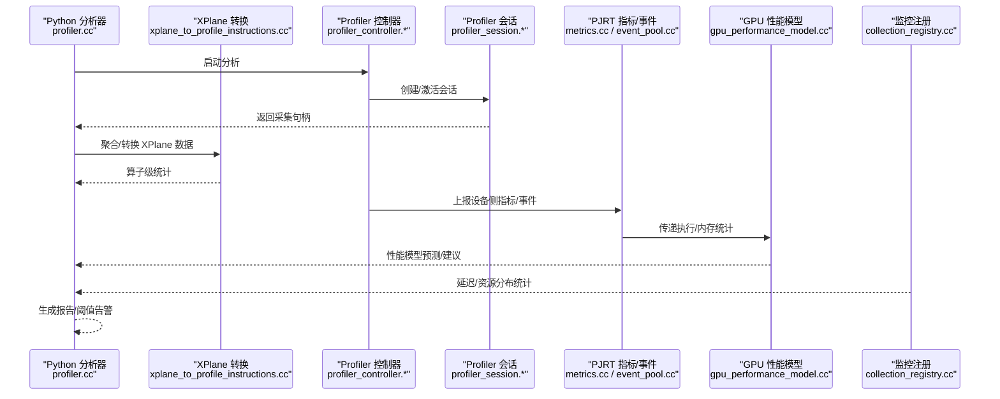
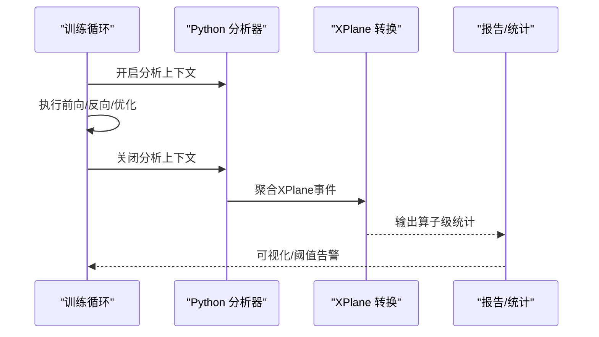
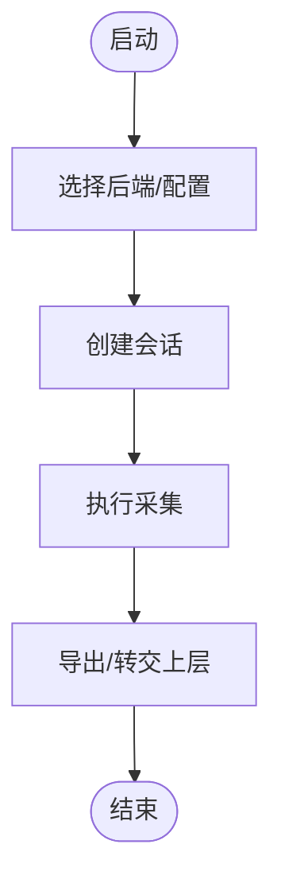
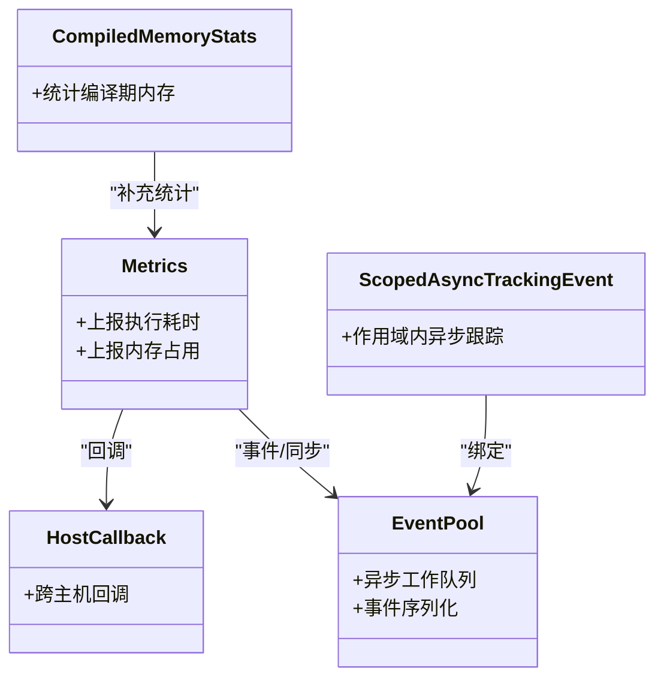
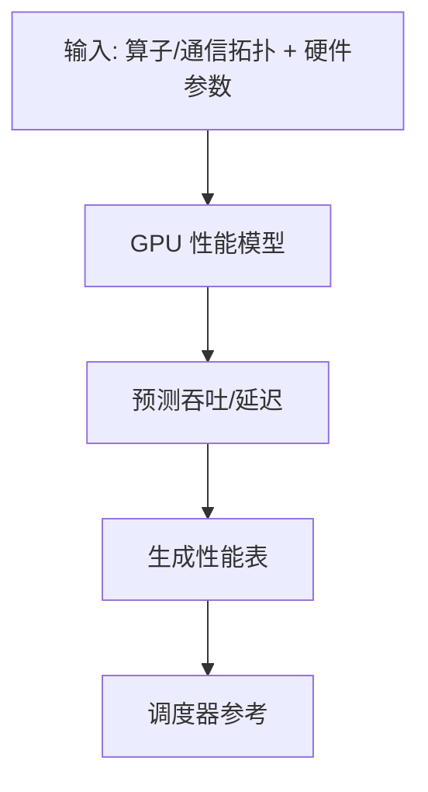
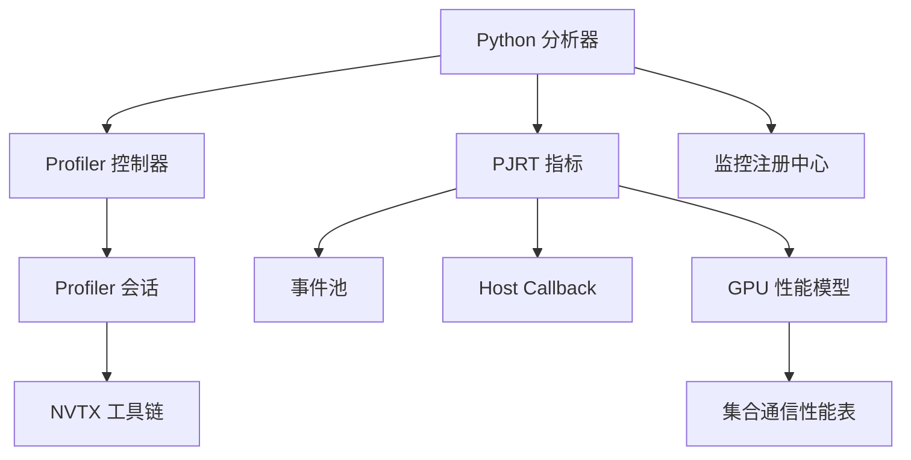

# 性能分析工具

<cite>
**本文引用的文件**
- [xla\python\profiler.cc](file://xla\python\profiler.cc)
- [xla\python\profiler_utils.cc](file://xla\python\profiler_utils.cc)
- [xla\python\profile_data.cc](file://xla\python\profile_data.cc)
- [xla\python\xplane_to_profile_instructions.cc](file://xla\python\xplane_to_profile_instructions.cc)
- [xla\python\xplane_to_profile_instructions.h](file://xla\python\xplane_to_profile_instructions.h)
- [xla\python\xplane_to_profile_instructions_test.cc](file://xla\python\xplane_to_profile_instructions_test.cc)
- [xla\backends\autotuner\profiler.h](file://xla\backends\autotuner\profiler.h)
- [xla\service\gpu\model\gpu_performance_model.cc](file://xla\service\gpu\model\gpu_performance_model.cc)
- [xla\service\gpu\model\gpu_performance_model.h](file://xla\service\gpu\model\gpu_performance_model.h)
- [xla\service\gpu\model\gpu_performance_model_base.cc](file://xla\service\gpu\model\gpu_performance_model_base.cc)
- [xla\service\gpu\model\gpu_performance_model_base.h](file://xla\service\gpu\model\gpu_performance_model_base.h)
- [xla\service\gpu\model\gpu_collective_performance_model.cc](file://xla\service\gpu\model\gpu_collective_performance_model.cc)
- [xla\service\gpu\model\gpu_collective_performance_model.h](file://xla\service\gpu\model\gpu_collective_performance_model.h)
- [xla\service\gpu\model\gpu_indexing_performance_model.cc](file://xla\service\gpu\model\gpu_indexing_performance_model.cc)
- [xla\service\gpu\model\gpu_indexing_performance_model.h](file://xla\service\gpu\model\gpu_indexing_performance_model.h)
- [xla\service\gpu\model\combined_gpu_performance_model.cc](file://xla\service\gpu\model\combined_gpu_performance_model.cc)
- [xla\service\gpu\model\combined_gpu_performance_model.h](file://xla\service\gpu\model\combined_gpu_performance_model.h)
- [xla\tools\collective_perf_table_gen.cc](file://xla\tools\collective_perf_table_gen.cc)
- [xla\tools\collective_perf_table_gen.h](file://xla\tools\collective_perf_table_gen.h)
- [xla\tools\collective_perf_table_gen_main.cc](file://xla\tools\collective_perf_table_gen_main.cc)
- [xla\tools\collective_perf_table_gen_test.cc](file://xla\tools\collective_perf_table_gen_test.cc)
- [xla\tsl\lib\monitoring\collection_registry.cc](file://xla\tsl\lib\monitoring\collection_registry.cc)
- [xla\tsl\lib\monitoring\collection_registry.h](file://xla\tsl\lib\monitoring\collection_registry.h)
- [xla\tsl\lib\monitoring\counter.h](file://xla\tsl\lib\monitoring\counter.h)
- [xla\tsl\lib\monitoring\gauge.h](file://xla\tsl\lib\monitoring\gauge.h)
- [xla\tsl\lib\monitoring\sampler.h](file://xla\tsl\lib\monitoring\sampler.h)
- [xla\tsl\lib\monitoring\percentile_sampler.h](file://xla\tsl\lib\monitoring\percentile_sampler.h)
- [xla\tsl\lib\monitoring\cell_reader.h](file://xla\tsl\lib\monitoring\cell_reader.h)
- [xla\tsl\lib\monitoring\collected_metrics.h](file://xla\tsl\lib\monitoring\collected_metrics.h)
- [third_party\tsl\tsl\profiler\lib\profiler_controller.cc](file://third_party\tsl\tsl\profiler\lib\profiler_controller.cc)
- [third_party\tsl\tsl\profiler\lib\profiler_controller.h](file://third_party\tsl\tsl\profiler\lib\profiler_controller.h)
- [third_party\tsl\tsl\profiler\lib\profiler_session.cc](file://third_party\tsl\tsl\profiler\lib\profiler_session.cc)
- [third_party\tsl\tsl\profiler\lib\profiler_session.h](file://third_party\tsl\tsl\profiler\lib\profiler_session.h)
- [third_party\tsl\tsl\profiler\lib\profiler_factory.cc](file://third_party\tsl\tsl\profiler\lib\profiler_factory.cc)
- [third_party\tsl\tsl\profiler\lib\profiler_factory.h](file://third_party\tsl\tsl\profiler\lib\profiler_factory.h)
- [third_party\tsl\tsl\profiler\lib\profiler_interface.h](file://third_party\tsl\tsl\profiler\lib\profiler_interface.h)
- [third_party\tsl\tsl\profiler\lib\profiler_lock.cc](file://third_party\tsl\tsl\profiler\lib\profiler_lock.cc)
- [third_party\tsl\tsl\profiler\lib\profiler_lock.h](file://third_party\tsl\tsl\profiler\lib\profiler_lock.h)
- [third_party\tsl\tsl\profiler\lib\profiler_collection.cc](file://third_party\tsl\tsl\profiler\lib\profiler_collection.cc)
- [third_party\tsl\tsl\profiler\lib\profiler_collection.h](file://third_party\tsl\tsl\profiler\lib\profiler_collection.h)
- [third_party\tsl\tsl\profiler\lib\nvtx_utils.cc](file://third_party\tsl\tsl\profiler\lib\nvtx_utils.cc)
- [third_party\tsl\tsl\profiler\lib\nvtx_utils.h](file://third_party\tsl\tsl\profiler\lib\nvtx_utils.h)
- [third_party\tsl\tsl\profiler\lib\context_types.cc](file://third_party\tsl\tsl\profiler\lib\context_types.cc)
- [third_party\tsl\tsl\profiler\lib\context_types.h](file://third_party\tsl\tsl\profiler\lib\context_types.h)
- [third_party\tsl\tsl\profiler\protobuf\profiler_service_monitor_result.proto](file://third_party\tsl\tsl\profiler\protobuf\profiler_service_monitor_result.proto)
- [xla\pjrt\metrics.cc](file://xla\pjrt\metrics.cc)
- [xla\pjrt\metrics.h](file://xla\pjrt\metrics.h)
- [xla\pjrt\compiled_memory_stats.cc](file://xla\pjrt\compiled_memory_stats.cc)
- [xla\pjrt\compiled_memory_stats.h](file://xla\pjrt\compiled_memory_stats.h)
- [xla\pjrt\host_callback.cc](file://xla\pjrt\host_callback.cc)
- [xla\pjrt\host_callback.h](file://xla\pjrt\host_callback.h)
- [xla\pjrt\async_work_runner.h](file://xla\pjrt\async_work_runner.h)
- [xla\pjrt\event_pool.cc](file://xla\pjrt\event_pool.cc)
- [xla\pjrt\event_pool.h](file://xla\pjrt\event_pool.h)
- [xla\pjrt\buffer_sequencing_event.cc](file://xla\pjrt\buffer_sequencing_event.cc)
- [xla\pjrt\buffer_sequencing_event.h](file://xla\pjrt\buffer_sequencing_event.h)
- [xla\pjrt\scoped_async_tracking_event.h](file://xla\pjrt\scoped_async_tracking_event.h)
- [xla\pjrt\thread_pool_async_work_runner.cc](file://xla\pjrt\thread_pool_async_work_runner.cc)
- [xla\pjrt\thread_pool_async_work_runner.h](file://xla\pjrt\thread_pool_async_work_runner.h)
- [xla\pjrt\utils.cc](file://xla\pjrt\utils.cc)
- [xla\pjrt\utils.h](file://xla\pjrt\utils.h)
- [xla\pjrt\errors.cc](file://xla\pjrt\errors.cc)
- [xla\pjrt\errors.h](file://xla\pjrt\errors.h)
- [xla\pjrt\exceptions.h](file://xla\pjrt\exceptions.h)
- [xla\pjrt\semaphore.cc](file://xla\pjrt\semaphore.cc)
- [xla\pjrt\semaphore.h](file://xla\pjrt\semaphore.h)
- [xla\pjrt\tracked_device_buffer.cc](file://xla\pjrt\tracked_device_buffer.cc)
- [xla\pjrt\tracked_device_buffer.h](file://xla\pjrt\tracked_device_buffer.h)
- [xla\pjrt\raw_buffer.cc](file://xla\pjrt\raw_buffer.cc)
- [xla\pjrt\raw_buffer.h](file://xla\pjrt\raw_buffer.h)
- [xla\pjrt\layout_mode.cc](file://xla\pjrt\layout_mode.cc)
- [xla\pjrt\layout_mode.h](file://xla\pjrt\layout_mode.h)
- [xla\pjrt\infer_dispatch_info.cc](file://xla\pjrt\infer_dispatch_info.cc)
- [xla\pjrt\infer_dispatch_info.h](file://xla\pjrt\infer_dispatch_info.h)
- [xla\pjrt\partial_program_utils.cc](file://xla\pjrt\partial_program_utils.cc)
- [xla\pjrt\partial_program_utils.h](file://xla\pjrt\partial_program_utils.h)
- [xla\pjrt\transpose.cc](file://xla\pjrt\transpose.cc)
- [xla\pjrt\transpose.h](file://xla\pjrt\transpose.h)
- [xla\pjrt\transpose_kernels.h](file://xla\pjrt\transpose_kernels.h)
- [xla\pjrt\transpose_test.cc](file://xla\pjrt\transpose_test.cc)
- [xla\pjrt\triton.h](file://xla\pjrt\triton.h)
- [xla\pjrt\triton_cuda.cc](file://xla\pjrt\triton_cuda.cc)
- [xla\pjrt\triton_rocm.cc](file://xla\pjrt\triton_rocm.cc)
- [xla\pjrt\triton_stub.cc](file://xla\pjrt\triton_stub.cc)
- [xla\pjrt\worker_thread.cc](file://xla\pjrt\worker_thread.cc)
- [xla\pjrt\worker_thread.h](file://xla\pjrt\worker_thread.h)
- [xla\pjrt\string_utils.cc](file://xla\pjrt\string_utils.cc)
- [xla\pjrt\string_utils.h](file://xla\pjrt\string_utils.h)
- [xla\pjrt\status_casters.h](filequo\pjrt\status_casters.h)
- [xla\pjrt\status_casters_ext.cc](file://xla\pjrt\status_casters_ext.cc)
- [xla\pjrt\status_casters_test.py](file://xla\pjrt\status_casters_test.py)
- [xla\pjrt\mock_pjrt_client.h](file://xla\pjrt\mock_pjrt_client.h)
- [xla\pjrt\maybe_owning_mlir_module.h](file://xla\pjrt\maybe_owning_mlir_module.h)
- [xla\pjrt\mlir_to_hlo.cc](file://xla\pjrt\mlir_to_hlo.cc)
- [xla\pjrt\mlir_to_hlo.h](file://xla\pjrt\mlir_to_hlo.h)
- [xla\pjrt\mlir_to_hlo_test.cc](file://xla\pjrt\mlir_to_hlo_test.cc)
- [xla\pjrt\proto\stream_executor_executable.proto](file://xla\pjrt\proto\stream_executor_executable.proto)
- [xla\pjrt\plugin\BUILD](file://xla\pjrt\plugin\BUILD)
- [xla\pjrt\plugin\pjrt_plugin.h](file://xla\pjrt\plugin\pjrt_plugin.h)
- [xla\pjrt\plugin\pjrt_plugin_test.cc](file://xla\pjrt\plugin\pjrt_plugin_test.cc)
- [xla\pjrt\plugin\pjrt_plugin_registry.cc](file://xla\pjrt\plugin\pjrt_plugin_registry.cc)
- [xla\pjrt\plugin\pjrt_plugin_registry.h](file://xla\pjrt\plugin\pjrt_plugin_registry.h)
- [xla\pjrt\plugin\pjrt_plugin_registry_test.cc](file://xla\pjrt\plugin\pjrt_plugin_registry_test.cc)
- [xla\pjrt\plugin\pjrt_plugin_test.h](file://xla\pjrt\plugin\pjrt_plugin_test.h)
- [xla\pjrt\extensions\BUILD](file://xla\pjrt\extensions\BUILD)
- [xla\pjrt\extensions\pjrt_extension.h](file://xla\pjrt\extensions\pjrt_extension.h)
- [xla\pjrt\extensions\pjrt_extension_test.cc](file://xla\pjrt\extensions\pjrt_extension_test.cc)
- [xla\pjrt\extensions\pjrt_extension_registry.cc](file://xla\pjrt\extensions\pjrt_extension_registry.cc)
- [xla\pjrt\extensions\pjrt_extension_registry.h](file://xla\pjrt\extensions\pjrt_extension_registry.h)
- [xla\pjrt\extensions\pjrt_extension_registry_test.cc](file://xla\pjrt\extensions\pjrt_extension_registry_test.cc)
- [xla\pjrt\extensions\pjrt_extension_test.h](file://xla\pjrt\extensions\pjrt_extension_test.h)
- [xla\pjrt\dump\BUILD](file://xla\pjrt\dump\BUILD)
- [xla\pjrt\dump\pjrt_dump.h](file://xla\pjrt\dump\pjrt_dump.h)
- [xla\pjrt\dump\pjrt_dump_test.cc](file://xla\pjrt\dump\pjrt_dump_test.cc)
- [xla\pjrt\dump\pjrt_dump_registry.cc](file://xla\pjrt\dump\pjrt_dump_registry.cc)
- [xla\pjrt\dump\pjrt_dump_registry.h](file://xla\pjrt\dump\pjrt_dump_registry.h)
- [xla\pjrt\dump\pjrt_dump_registry_test.cc](file://xla\pjrt\dump\pjrt_dump_registry_test.cc)
- [xla\pjrt\dump\pjrt_dump_test.h](file://xla\pjrt\dump\pjrt_dump_test.h)
- [xla\pjrt\c_api_client\BUILD](file://xla\pjrt\c_api_client\BUILD)
- [xla\pjrt\c_api_client\pjrt_c_api_client.h](file://xla\pjrt\c_api_client\pjrt_c_api_client.h)
- [xla\pjrt\c_api_client\pjrt_c_api_client_test.cc](file://xla\pjrt\c_api_client\pjrt_c_api_client_test.cc)
- [xla\pjrt\c_api_client\pjrt_c_api_client_test.h](file://xla\pjrt\c_api_client\pjrt_c_api_client_test.h)
- [xla\pjrt\c_api_client\pjrt_c_api_client.cc](file://xla\pjrt\c_api_client\pjrt_c_api_client.cc)
- [xla\pjrt\c_api_client\pjrt_c_api_client.proto](file://xla\pjrt\c_api_client\pjrt_c_api_client.proto)
- [xla\pjrt\c_api_client\pjrt_c_api_client_test.proto](file://xla\pjrt\c_api_client\pjrt_c_api_client_test.proto)
- [xla\pjrt\c_api_client\pjrt_c_api_client_test.cc](file://xla\pjrt\c_api_client\pjrt_c_api_client_test.cc)
- [xla\pjrt\c_api_client\pjrt_c_api_client_test.h](file://xla\pjrt\c_api_client\pjrt_c_api_client_test.h)
- [xla\pjrt\c_api_client\pjrt_c_api_client_test.proto](file://xla\pjrt\c_api_client\pjrt_c_api_client_test.proto)
- [xla\pjrt\c_api_client\pjrt_c_api_client_test.cc](file://xla\pjrt\c_api_client\pjrt_c_api_client_test.cc)
- [xla\pjrt\c_api_client\pjrt_c_api_client_test.h](file://xla\pjrt\c_api_client\pjrt_c_api_client_test.h)
- [xla\pjrt\c_api_client\pjrt_c_api_client_test.proto](file://xla\pjrt\c_api_client\pjrt_c_api_client_test.proto)
- [xla\pjrt\c_api_client\pjrt_c_api_client_test.cc](file://xla\pjrt\c_api_client\pjrt_c_api_client_test.cc)
- [xla\pjrt\c_api_client\pjrt_c_api_client_test.h](file://xla\pjrt\c_api_client\pjrt_c_api_client_test.h)
- [xla\pjrt\c_api_client\pjrt_c_api_client_test.proto](file://xla\pjrt\c_api_client\pjrt_c_api_client_test.proto)
- [xla\pjrt\c_api_client\pjrt_c_api_client_test.cc](file://xla\pjrt\c_api_client\pjrt_c_api_client_test.cc)
- [xla\pjrt\c_api_client\pjrt_c_api_client_test.h](file://xla\pjrt\c_api_client\pjrt_c_api_client_test.h)
- [xla\pjrt\c_api_client\pjrt_c_api_client_test.proto](file://xla\pjrt\c_api_client\pjrt_c_api_client_test.proto)
- [xla\pjrt\c_api_client\pjrt_c_api_client_test.cc](file://xla\pjrt\c_api_client\pjrt_c_api_client_test.cc)
- [xla\pjrt\c_api_client\pjrt_c_api_client_test.h](file://xla\pjrt\c_api_client\pjrt_c_api_client_test.h)
- [xla\pjrt\c_api_client\pjrt_c_api_client_test.proto](file://xla\pjrt\c_api_client\pjrt_c_api_client_test.proto)
- [xla\pjrt\c_api_client\pjrt_c_api_client_test.cc](file://xla\pjrt\c_api_client\pjrt_c_api_client_test.cc)
- [xla\pjrt\c_api_client\pjrt_c_api_client_test.h](file://xla\pjrt\c_api_client\pjrt_c_api_client_test.h)
- [xla\pjrt\c_api_client\pjrt_c_api_client_test.proto](file://xla\pjrt\c_api_client\pjrt_c_api_client_test.proto......)
</cite>

## 目录
1. [简介](#简介)
2. [项目结构](#项目结构)
3. [核心组件](#核心组件)
4. [架构总览](#架构总览)
5. [详细组件分析](#详细组件分析)
6. [依赖关系分析](#依赖关系分析)
7. [性能考量](#性能考量)
8. [故障排查指南](#故障排查指南)
9. [结论](#结论)
10. [附录](#附录)

## 简介
本指南面向XLA性能分析工具的使用者与维护者，系统梳理CPU/GPU端的性能分析能力、Python性能分析器集成、PJRT性能分析扩展、运行时监控与瓶颈定位、以及性能回归与基准测试实践。文档以仓库中的实际实现为依据，结合代码级图示帮助读者快速上手并深入理解性能分析链路。

## 项目结构
XLA的性能分析涉及多层：Python侧的分析器封装与数据聚合、底层TSL Profiler控制器与会话、PJRT设备侧度量与事件池、服务端GPU性能模型与集体通信性能模型、以及监控指标采集与上报。下图给出概览性结构：

**图表来源**
- [xla\python\profiler.cc](file://xla\python\profiler.cc)
- [xla\python\xplane_to_profile_instructions.cc](file://xla\python\xplane_to_profile_instructions.cc)
- [third_party\tsl\tsl\profiler\lib\profiler_controller.cc](file://third_party\tsl\tsl\profiler\lib\profiler_controller.cc)
- [third_party\tsl\tsl\profiler\lib\profiler_session.cc](file://third_party\tsl\tsl\profiler\lib\profiler_session.cc)
- [third_party\tsl\tsl\profiler\lib\profiler_factory.cc](file://third_party\tsl\tsl\profiler\lib\profiler_factory.cc)
- [xla\pjrt\metrics.cc](file://xla\pjrt\metrics.cc)
- [xla\pjrt\compiled_memory_stats.cc](file://xla\pjrt\compiled_memory_stats.cc)
- [xla\pjrt\host_callback.cc](file://xla\pjrt\host_callback.cc)
- [xla\pjrt\event_pool.cc](file://xla\pjrt\event_pool.cc)
- [xla\pjrt\buffer_sequencing_event.cc](file://xla\pjrt\buffer_sequencing_event.cc)
- [xla\service\gpu\model\gpu_performance_model.cc](file://xla\service\gpu\model\gpu_performance_model.cc)
- [xla\tools\collective_perf_table_gen.cc](file://xla\tools\collective_perf_table_gen.cc)
- [xla\tsl\lib\monitoring\collection_registry.cc](file://xla\tsl\lib\monitoring\collection_registry.cc)

**章节来源**
- [xla\python\profiler.cc](file://xla\python\profiler.cc)
- [third_party\tsl\tsl\profiler\lib\profiler_controller.cc](file://third_party\tsl\tsl\profiler\lib\profiler_controller.cc)
- [xla\pjrt\metrics.cc](file://xla\pjrt\metrics.cc)
- [xla\service\gpu\model\gpu_performance_model.cc](file://xla\service\gpu\model\gpu_performance_model.cc)
- [xla\tsl\lib\monitoring\collection_registry.cc](file://xla\tsl\lib\monitoring\collection_registry.cc)

## 核心组件
- Python性能分析器与数据转换
  - Python侧分析器负责启动/停止分析、聚合XPlane数据并转换为可读的分析指令集，便于后续可视化与统计。
  - 数据转换模块将XPlane事件映射到算子级统计，支持按设备/阶段/算子维度汇总。
- TSL Profiler 控制器与会话
  - 控制器统一管理分析生命周期与后端适配；会话负责具体采集与缓冲；工厂与接口定义了可插拔的分析后端。
- PJRT 设备侧度量与事件
  - 设备侧指标（如执行耗时、内存占用）通过指标模块上报；事件池与序列化事件用于异步跟踪与同步点管理；Host Callback可用于跨主机回调。
- GPU 性能模型与集合通信性能表
  - 提供GPU算子与集合通信的性能模型，支持生成性能表以辅助调度与优化。
- 运行时监控与指标
  - 监控库提供计数器、仪表盘、采样器与百分位采样器等基础设施，支撑资源使用与延迟分布统计。

**章节来源**
- [xla\python\profiler.cc](file://xla\python\profiler.cc)
- [xla\python\xplane_to_profile_instructions.cc](file://xla\python\xplane_to_profile_instructions.cc)
- [third_party\tsl\tsl\profiler\lib\profiler_controller.cc](file://third_party\tsl\tsl\profiler\lib\profiler_controller.cc)
- [third_party\tsl\tsl\profiler\lib\profiler_session.cc](file://third_party\tsl\tsl\profiler\lib\profiler_session.cc)
- [third_party\tsl\tsl\profiler\lib\profiler_factory.cc](file://third_party\tsl\tsl\profiler\lib\profiler_factory.cc)
- [xla\pjrt\metrics.cc](file://xla\pjrt\metrics.cc)
- [xla\pjrt\compiled_memory_stats.cc](file://xla\pjrt\compiled_memory_stats.cc)
- [xla\pjrt\host_callback.cc](file://xla\pjrt\host_callback.cc)
- [xla\pjrt\event_pool.cc](file://xla\pjrt\event_pool.cc)
- [xla\pjrt\buffer_sequencing_event.cc](file://xla\pjrt\buffer_sequencing_event.cc)
- [xla\service\gpu\model\gpu_performance_model.cc](file://xla\service\gpu\model\gpu_performance_model.cc)
- [xla\tools\collective_perf_table_gen.cc](file://xla\tools\collective_perf_table_gen.cc)
- [xla\tsl\lib\monitoring\collection_registry.cc](file://xla\tsl\lib\monitoring\collection_registry.cc)

## 架构总览
下图展示从Python分析器到设备侧度量与服务端模型的整体流程：

**图表来源**
- [xla\python\profiler.cc](file://xla\python\profiler.cc)
- [xla\python\xplane_to_profile_instructions.cc](file://xla\python\xplane_to_profile_instructions.cc)
- [third_party\tsl\tsl\profiler\lib\profiler_controller.cc](file://third_party\tsl\tsl\profiler\lib\profiler_controller.cc)
- [third_party\tsl\tsl\profiler\lib\profiler_session.cc](file://third_party\tsl\tsl\profiler\lib\profiler_session.cc)
- [xla\pjrt\metrics.cc](file://xla\pjrt\metrics.cc)
- [xla\pjrt\event_pool.cc](file://xla\pjrt\event_pool.cc)
- [xla\service\gpu\model\gpu_performance_model.cc](file://xla\service\gpu\model\gpu_performance_model.cc)
- [xla\tsl\lib\monitoring\collection_registry.cc](file://xla\tsl\lib\monitoring\collection_registry.cc)

## 详细组件分析

### Python 性能分析器与数据转换
- 组件职责
  - 启停分析、聚合XPlane事件、转换为算子级统计，输出可读的性能报告。
- 关键流程
  - 启动分析后，控制器创建会话并返回句柄；随后Python侧对XPlane进行解析与归并；最终生成算子级耗时、内存使用与算子统计。
- 使用建议
  - 在训练循环的关键阶段（如前向、反向、优化器步）包裹分析上下文，避免过度采样导致开销放大。
  - 结合设备侧指标与GPU模型输出，定位热点算子与瓶颈类型（计算/带宽/同步）。

**图表来源**
- [xla\python\profiler.cc](file://xla\python\profiler.cc)
- [xla\python\xplane_to_profile_instructions.cc](file://xla\python\xplane_to_profile_instructions.cc)

**章节来源**
- [xla\python\profiler.cc](file://xla\python\profiler.cc)
- [xla\python\xplane_to_profile_instructions.cc](file://xla\python\xplane_to_profile_instructions.cc)
- [xla\python\xplane_to_profile_instructions.h](file://xla\python\xplane_to_profile_instructions.h)
- [xla\python\xplane_to_profile_instructions_test.cc](file://xla\python\xplane_to_profile_instructions_test.cc)

### TSL Profiler 控制器与会话
- 组件职责
  - 控制器负责分析生命周期管理与后端选择；会话负责采集缓冲与事件写入；工厂与接口定义了可插拔后端。
- 关键流程
  - 控制器根据配置选择后端（CPU/GPU/NVMe等），创建对应会话；会话在执行期间记录事件；结束后导出或转交上层处理。
- 集成要点
  - 通过控制器统一入口接入不同后端，确保分析一致性；注意控制并发与资源上限，避免阻塞训练。

**图表来源**
- [third_party\tsl\tsl\profiler\lib\profiler_controller.cc](file://third_party\tsl\tsl\profiler\lib\profiler_controller.cc)
- [third_party\tsl\tsl\profiler\lib\profiler_session.cc](file://third_party\tsl\tsl\profiler\lib\profiler_session.cc)
- [third_party\tsl\tsl\profiler\lib\profiler_factory.cc](file://third_party\tsl\tsl\profiler\lib\profiler_factory.cc)

**章节来源**
- [third_party\tsl\tsl\profiler\lib\profiler_controller.cc](file://third_party\tsl\tsl\profiler\lib\profiler_controller.cc)
- [third_party\tsl\tsl\profiler\lib\profiler_session.cc](file://third_party\tsl\tsl\profiler\lib\profiler_session.cc)
- [third_party\tsl\tsl\profiler\lib\profiler_factory.cc](file://third_party\tsl\tsl\profiler\lib\profiler_factory.cc)
- [third_party\tsl\tsl\profiler\lib\profiler_interface.h](file://third_party\tsl\tsl\profiler\lib\profiler_interface.h)
- [third_party\tsl\tsl\profiler\lib\profiler_lock.cc](file://third_party\tsl\tsl\profiler\lib\profiler_lock.cc)
- [third_party\tsl\tsl\profiler\lib\profiler_lock.h](file://third_party\tsl\tsl\profiler\lib\profiler_lock.h)
- [third_party\tsl\tsl\profiler\lib\profiler_collection.cc](file://third_party\tsl\tsl\profiler\lib\profiler_collection.cc)
- [third_party\tsl\tsl\profiler\lib\profiler_collection.h](file://third_party\tsl\tsl\profiler\lib\profiler_collection.h)
- [third_party\tsl\tsl\profiler\lib\nvtx_utils.cc](file://third_party\tsl\tsl\profiler\lib\nvtx_utils.cc)
- [third_party\tsl\tsl\profiler\lib\nvtx_utils.h](file://third_party\tsl\tsl\profiler\lib\nvtx_utils.h)
- [third_party\tsl\tsl\profiler\lib\context_types.cc](file://third_party\tsl\tsl\profiler\lib\context_types.cc)
- [third_party\tsl\tsl\profiler\lib\context_types.h](file://third_party\tsl\tsl\profiler\lib\context_types.h)
- [third_party\tsl\tsl\profiler\protobuf\profiler_service_monitor_result.proto](file://third_party\tsl\tsl\profiler\protobuf\profiler_service_monitor_result.proto)

### PJRT 性能分析扩展
- 组件职责
  - 设备侧指标（执行耗时、内存占用）、事件池与序列化事件、Host Callback、编译内存统计等，支撑端到端性能观测。
- 关键流程
  - 训练/推理过程中，设备侧持续上报指标；事件池管理异步工作与同步点；Host Callback用于跨主机回调与自定义观测。
- 配置与使用
  - 通过指标模块与事件池接口，可在不侵入业务逻辑的前提下收集关键性能数据；结合GPU模型与监控库，形成闭环观测。

**图表来源**
- [xla\pjrt\metrics.cc](file://xla\pjrt\metrics.cc)
- [xla\pjrt\compiled_memory_stats.cc](file://xla\pjrt\compiled_memory_stats.cc)
- [xla\pjrt\host_callback.cc](file://xla\pjrt\host_callback.cc)
- [xla\pjrt\event_pool.cc](file://xla\pjrt\event_pool.cc)
- [xla\pjrt\buffer_sequencing_event.cc](file://xla\pjrt\buffer_sequencing_event.cc)
- [xla\pjrt\scoped_async_tracking_event.h](file://xla\pjrt\scoped_async_tracking_event.h)

**章节来源**
- [xla\pjrt\metrics.cc](file://xla\pjrt\metrics.cc)
- [xla\pjrt\metrics.h](file://xla\pjrt\metrics.h)
- [xla\pjrt\compiled_memory_stats.cc](file://xla\pjrt\compiled_memory_stats.cc)
- [xla\pjrt\compiled_memory_stats.h](file://xla\pjrt\compiled_memory_stats.h)
- [xla\pjrt\host_callback.cc](file://xla\pjrt\host_callback.cc)
- [xla\pjrt\host_callback.h](file://xla\pjrt\host_callback.h)
- [xla\pjrt\async_work_runner.h](file://xla\pjrt\async_work_runner.h)
- [xla\pjrt\event_pool.cc](file://xla\pjrt\event_pool.cc)
- [xla\pjrt\event_pool.h](file://xla\pjrt\event_pool.h)
- [xla\pjrt\buffer_sequencing_event.cc](file://xla\pjrt\buffer_sequencing_event.cc)
- [xla\pjrt\buffer_sequencing_event.h](file://xla\pjrt\buffer_sequencing_event.h)
- [xla\pjrt\scoped_async_tracking_event.h](file://xla\pjrt\scoped_async_tracking_event.h)
- [xla\pjrt\thread_pool_async_work_runner.cc](file://xla\pjrt\thread_pool_async_work_runner.cc)
- [xla\pjrt\thread_pool_async_work_runner.h](file://xla\pjrt\thread_pool_async_work_runner.h)
- [xla\pjrt\utils.cc](file://xla\pjrt\utils.cc)
- [xla\pjrt\utils.h](file://xla\pjrt\utils.h)

### GPU 性能模型与集合通信性能表
- 组件职责
  - 提供GPU算子与集合通信的性能模型，支持生成性能表以辅助调度与优化。
- 关键流程
  - 输入算子/通信拓扑与硬件参数，模型输出预期吞吐/延迟；工具链生成性能表，供调度器参考。
- 使用建议
  - 将模型预测与实测指标对比，识别偏差较大的算子或通信模式，针对性优化。

**图表来源**
- [xla\service\gpu\model\gpu_performance_model.cc](file://xla\service\gpu\model\gpu_performance_model.cc)
- [xla\service\gpu\model\gpu_performance_model.h](file://xla\service\gpu\model\gpu_performance_model.h)
- [xla\service\gpu\model\gpu_performance_model_base.cc](file://xla\service\gpu\model\gpu_performance_model_base.cc)
- [xla\service\gpu\model\gpu_performance_model_base.h](file://xla\service\gpu\model\gpu_performance_model_base.h)
- [xla\service\gpu\model\gpu_collective_performance_model.cc](file://xla\service\gpu\model\gpu_collective_performance_model.cc)
- [xla\service\gpu\model\gpu_collective_performance_model.h](file://xla\service\gpu\model\gpu_collective_performance_model.h)
- [xla\service\gpu\model\gpu_indexing_performance_model.cc](file://xla\service\gpu\model\gpu_indexing_performance_model.cc)
- [xla\service\gpu\model\gpu_indexing_performance_model.h](file://xla\service\gpu\model\gpu_indexing_performance_model.h)
- [xla\service\gpu\model\combined_gpu_performance_model.cc](file://xla\service\gpu\model\combined_gpu_performance_model.cc)
- [xla\service\gpu\model\combined_gpu_performance_model.h](file://xla\service\gpu\model\combined_gpu_performance_model.h)
- [xla\tools\collective_perf_table_gen.cc](file://xla\tools\collective_perf_table_gen.cc)
- [xla\tools\collective_perf_table_gen.h](file://xla\tools\collective_perf_table_gen.h)
- [xla\tools\collective_perf_table_gen_main.cc](file://xla\tools\collective_perf_table_gen_main.cc)
- [xla\tools\collective_perf_table_gen_test.cc](file://xla\tools\collective_perf_table_gen_test.cc)

**章节来源**
- [xla\service\gpu\model\gpu_performance_model.cc](file://xla\service\gpu\model\gpu_performance_model.cc)
- [xla\service\gpu\model\gpu_performance_model.h](file://xla\service\gpu\model\gpu_performance_model.h)
- [xla\service\gpu\model\gpu_performance_model_base.cc](file://xla\service\gpu\model\gpu_performance_model_base.cc)
- [xla\service\gpu\model\gpu_performance_model_base.h](file://xla\service\gpu\model\gpu_performance_model_base.h)
- [xla\service\gpu\model\gpu_collective_performance_model.cc](file://xla\service\gpu\model\gpu_collective_performance_model.cc)
- [xla\service\gpu\model\gpu_collective_performance_model.h](file://xla\service\gpu\model\gpu_collective_performance_model.h)
- [xla\service\gpu\model\gpu_indexing_performance_model.cc](file://xla\service\gpu\model\gpu_indexing_performance_model.cc)
- [xla\service\gpu\model\gpu_indexing_performance_model.h](file://xla\service\gpu\model\gpu_indexing_performance_model.h)
- [xla\service\gpu\model\combined_gpu_performance_model.cc](file://xla\service\gpu\model\combined_gpu_performance_model.cc)
- [xla\service\gpu\model\combined_gpu_performance_model.h](file://xla\service\gpu\model\combined_gpu_performance_model.h)
- [xla\tools\collective_perf_table_gen.cc](file://xla\tools\collective_perf_table_gen.cc)
- [xla\tools\collective_perf_table_gen.h](file://xla\tools\collective_perf_table_gen.h)
- [xla\tools\collective_perf_table_gen_main.cc](file://xla\tools\collective_perf_table_gen_main.cc)
- [xla\tools\collective_perf_table_gen_test.cc](file://xla\tools\collective_perf_table_gen_test.cc)

### 运行时监控与资源使用跟踪
- 组件职责
  - 提供计数器、仪表盘、采样器与百分位采样器等基础设施，支撑资源使用与延迟分布统计。
- 关键流程
  - 在关键路径埋点，使用采样器记录延迟分布；通过监控注册中心统一收集与上报。
- 使用建议
  - 对高频路径采用低开销采样；对关键慢路径采用高精度采样；结合百分位采样识别尾部延迟。

**图表来源**
- [xla\tsl\lib\monitoring\counter.h](file://xla\tsl\lib\monitoring\counter.h)
- [xla\tsl\lib\monitoring\gauge.h](file://xla\tsl\lib\monitoring\gauge.h)
- [xla\tsl\lib\monitoring\sampler.h](file://xla\tsl\lib\monitoring\sampler.h)
- [xla\tsl\lib\monitoring\percentile_sampler.h](file://xla\tsl\lib\monitoring\percentile_sampler.h)
- [xla\tsl\lib\monitoring\collection_registry.cc](file://xla\tsl\lib\monitoring\collection_registry.cc)
- [xla\tsl\lib\monitoring\collection_registry.h](file://xla\tsl\lib\monitoring\collection_registry.h)
- [xla\tsl\lib\monitoring\cell_reader.h](file://xla\tsl\lib\monitoring\cell_reader.h)
- [xla\tsl\lib\monitoring\collected_metrics.h](file://xla\tsl\lib\monitoring\collected_metrics.h)

**章节来源**
- [xla\tsl\lib\monitoring\counter.h](file://xla\tsl\lib\monitoring\counter.h)
- [xla\tsl\lib\monitoring\gauge.h](file://xla\tsl\lib\monitoring\gauge.h)
- [xla\tsl\lib\monitoring\sampler.h](file://xla\tsl\lib\monitoring\sampler.h)
- [xla\tsl\lib\monitoring\percentile_sampler.h](file://xla\tsl\lib\monitoring\percentile_sampler.h)
- [xla\tsl\lib\monitoring\collection_registry.cc](file://xla\tsl\lib\monitoring\collection_registry.cc)
- [xla\tsl\lib\monitoring\collection_registry.h](file://xla\tsl\lib\monitoring\collection_registry.h)
- [xla\tsl\lib\monitoring\cell_reader.h](file://xla\tsl\lib\monitoring\cell_reader.h)
- [xla\tsl\lib\monitoring\collected_metrics.h](file://xla\tsl\lib\monitoring\collected_metrics.h)

## 依赖关系分析
- 组件耦合
  - Python分析器依赖TSL Profiler控制器与会话；会话与控制器又依赖NVidia NVTX工具链与上下文类型定义。
  - PJRT指标模块与事件池紧密耦合，共同支撑设备侧观测；Host Callback作为横切关注点连接设备与主机。
  - GPU性能模型与集合通信性能表相互协作，形成完整的GPU端性能视图。
- 外部依赖
  - NVidia NVTX工具链用于事件标注与可视化；监控协议用于结果导出与监控集成。
- 潜在环路
  - 当前设计以控制器为中心，避免直接环路；但需注意采样器与注册中心之间的间接依赖。

**图表来源**
- [xla\python\profiler.cc](file://xla\python\profiler.cc)
- [third_party\tsl\tsl\profiler\lib\profiler_controller.cc](file://third_party\tsl\tsl\profiler\lib\profiler_controller.cc)
- [third_party\tsl\tsl\profiler\lib\profiler_session.cc](file://third_party\tsl\tsl\profiler\lib\profiler_session.cc)
- [third_party\tsl\tsl\profiler\lib\nvtx_utils.cc](file://third_party\tsl\tsl\profiler\lib\nvtx_utils.cc)
- [xla\pjrt\metrics.cc](file://xla\pjrt\metrics.cc)
- [xla\pjrt\event_pool.cc](file://xla\pjrt\event_pool.cc)
- [xla\pjrt\host_callback.cc](file://xla\pjrt\host_callback.cc)
- [xla\service\gpu\model\gpu_performance_model.cc](file://xla\service\gpu\model\gpu_performance_model.cc)
- [xla\tools\collective_perf_table_gen.cc](file://xla\tools\collective_perf_table_gen.cc)
- [xla\tsl\lib\monitoring\collection_registry.cc](file://xla\tsl\lib\monitoring\collection_registry.cc)

**章节来源**
- [third_party\tsl\tsl\profiler\lib\profiler_controller.cc](file://third_party\tsl\tsl\profiler\lib\profiler_controller.cc)
- [third_party\tsl\tsl\profiler\lib\profiler_session.cc](file://third_party\tsl\tsl\profiler\lib\profiler_session.cc)
- [third_party\tsl\tsl\profiler\lib\nvtx_utils.cc](file://third_party\tsl\tsl\profiler\lib\nvtx_utils.cc)
- [xla\pjrt\metrics.cc](file://xla\pjrt\metrics.cc)
- [xla\pjrt\event_pool.cc](file://xla\pjrt\event_pool.cc)
- [xla\pjrt\host_callback.cc](file://xla\pjrt\host_callback.cc)
- [xla\service\gpu\model\gpu_performance_model.cc](file://xla\service\gpu\model\gpu_performance_model.cc)
- [xla\tools\collective_perf_table_gen.cc](file://xla\tools\collective_perf_table_gen.cc)
- [xla\tsl\lib\monitoring\collection_registry.cc](file://xla\tsl\lib\monitoring\collection_registry.cc)

## 性能考量
- 采样开销控制
  - 在高频路径采用低频采样或分桶统计；对关键慢路径采用高精度采样。
- 异步与同步
  - 利用事件池与序列化事件降低同步阻塞；合理设置异步工作队列大小。
- 内存与I/O
  - 编译内存统计有助于识别峰值内存瓶颈；结合设备侧指标与监控库，定位内存碎片与回收压力。
- 模型预测与实测对比
  - 将GPU性能模型预测与实测指标对比，识别偏差较大的算子或通信模式，针对性优化。

[本节为通用指导，无需列出具体文件来源]

## 故障排查指南
- 分析器无法启动
  - 检查控制器初始化与后端选择是否正确；确认会话创建与锁机制无冲突。
- 事件缺失或不完整
  - 核对NVTX工具链版本与上下文类型定义；检查会话缓冲区大小与导出时机。
- 设备侧指标异常
  - 检查事件池与序列化事件状态；确认Host Callback回调是否被正确注册与触发。
- 监控指标缺失
  - 核对监控注册中心的指标定义与采样器配置；确认上报周期与导出通道正常。

**章节来源**
- [third_party\tsl\tsl\profiler\lib\profiler_controller.cc](file://third_party\tsl\tsl\profiler\lib\profiler_controller.cc)
- [third_party\tsl\tsl\profiler\lib\profiler_session.cc](file://third_party\tsl\tsl\profiler\lib\profiler_session.cc)
- [third_party\tsl\tsl\profiler\lib\profiler_lock.cc](file://third_party\tsl\tsl\profiler\lib\profiler_lock.cc)
- [xla\pjrt\event_pool.cc](file://xla\pjrt\event_pool.cc)
- [xla\pjrt\buffer_sequencing_event.cc](file://xla\pjrt\buffer_sequencing_event.cc)
- [xla\pjrt\host_callback.cc](file://xla\pjrt\host_callback.cc)
- [xla\tsl\lib\monitoring\collection_registry.cc](file://xla\tsl\lib\monitoring\collection_registry.cc)

## 结论
XLA的性能分析体系以Python分析器为入口，经由TSL Profiler控制器与会话完成采集，再由PJRT设备侧指标与事件池提供端到端观测，并结合GPU性能模型与监控库形成闭环。通过合理的采样策略、异步与同步配合、内存与I/O优化，以及模型预测与实测对比，可以有效定位瓶颈并提升整体性能。

[本节为总结性内容，无需列出具体文件来源]

## 附录
- 实施步骤建议
  - 建立性能基线：在稳定版本上开启分析，收集执行时间、内存使用与算子统计。
  - 监控指标：定义关键指标（P50/P95延迟、内存峰值、算子耗时占比）并持续上报。
  - 回归检测：在CI中加入性能回归检测任务，设定阈值与告警策略。
  - 基准测试：定期运行基准套件，比较不同版本间的性能变化。

[本节为通用指导，无需列出具体文件来源]