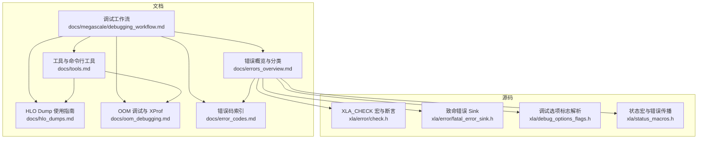
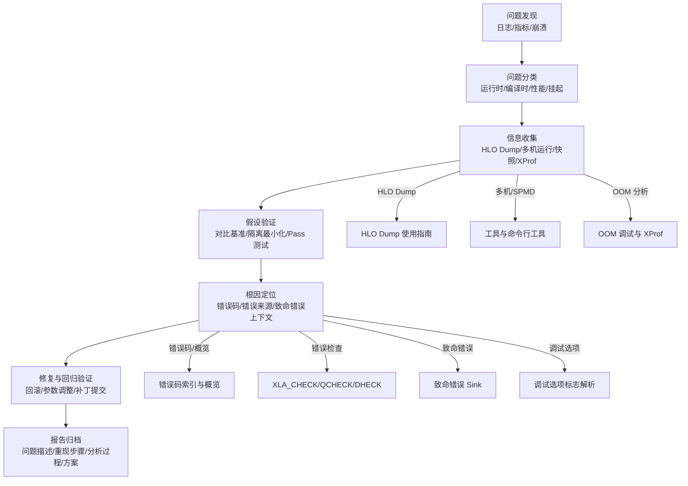
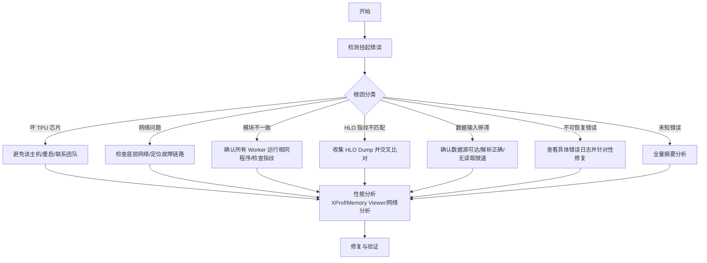
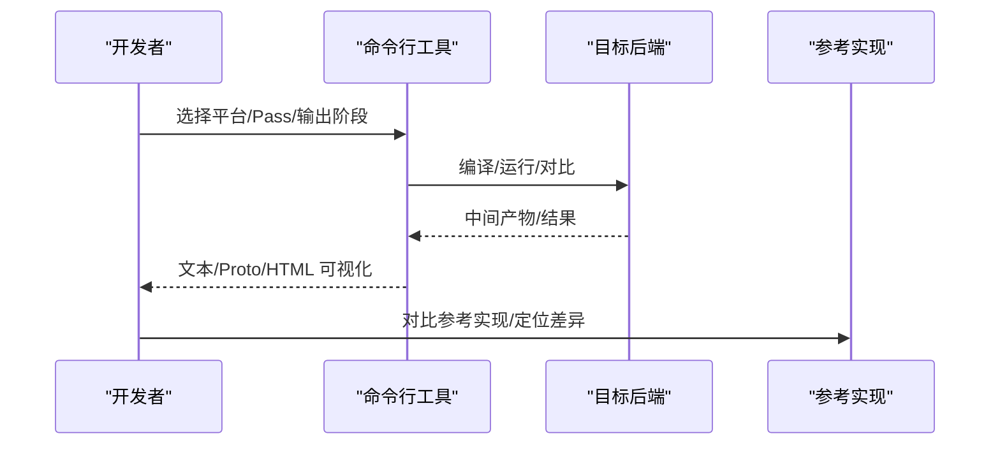
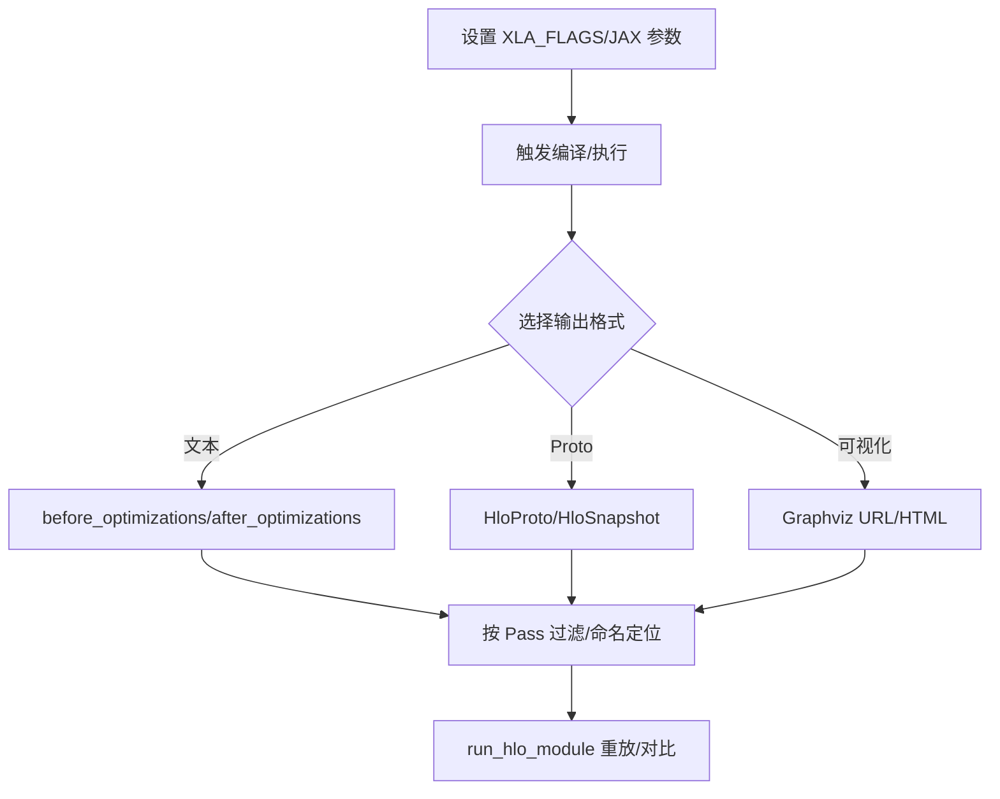
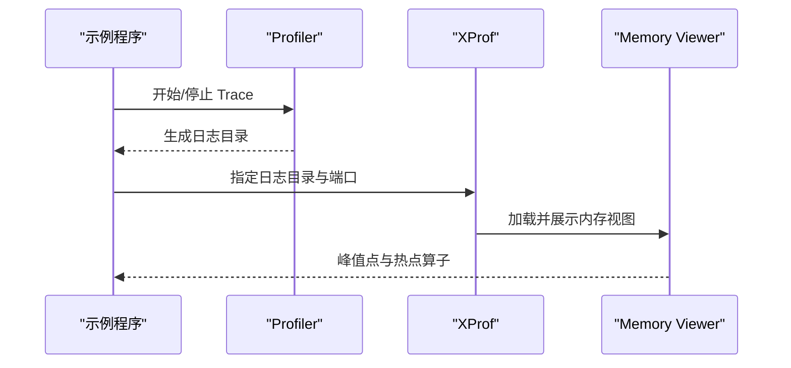
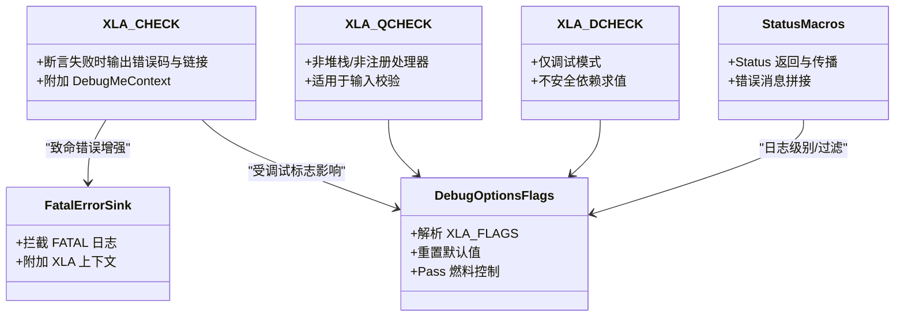
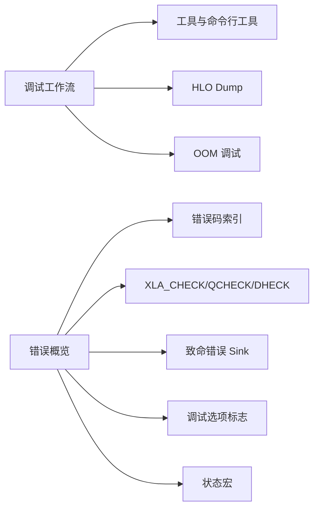

# 调试工作流程

<cite>
**本文引用的文件**
- [docs/megascale/debugging_workflow.md](file://docs/megascale/debugging_workflow.md)
- [docs/tools.md](file://docs/tools.md)
- [docs/hlo_dumps.md](file://docs/hlo_dumps.md)
- [docs/oom_debugging.md](file://docs/oom_debugging.md)
- [docs/error_codes.md](file://docs/error_codes.md)
- [docs/errors_overview.md](file://docs/errors_overview.md)
- [xla/error/check.h](file://xla/error/check.h)
- [xla/error/fatal_error_sink.h](file://xla/error/fatal_error_sink.h)
- [xla/debug_options_flags.h](file://xla/debug_options_flags.h)
- [xla/status_macros.h](file://xla/status_macros.h)
</cite>

## 目录
1. [引言](#引言)
2. [项目结构](#项目结构)
3. [核心组件](#核心组件)
4. [架构总览](#架构总览)
5. [详细组件分析](#详细组件分析)
6. [依赖关系分析](#依赖关系分析)
7. [性能考量](#性能考量)
8. [故障排查指南](#故障排查指南)
9. [结论](#结论)
10. [附录](#附录)

## 引言
本指南面向使用 XLA 的开发者与工程师，提供从问题发现到根因定位与修复闭环的系统化调试流程。内容覆盖问题分类、信息收集、假设验证、工具选择策略、日志与错误处理、以及调试报告的标准化记录方法。文档同时给出针对不同问题类型的工具组合建议（如 HLO Dump、多机 HLO 运行器、XProf 等），并总结常见错误码与错误来源，帮助快速定位瓶颈与异常。

## 项目结构
围绕调试主题，仓库中与之直接相关的核心文档与源码模块如下：
- 文档层：调试工作流、工具与 HLO Dump、OOM 调试、错误码与概览
- 源码层：错误检查与致命错误处理、调试选项标志解析、状态宏与错误传播

图表来源
- [docs/megascale/debugging_workflow.md](file://docs/megascale/debugging_workflow.md#L1-L316)
- [docs/tools.md](file://docs/tools.md#L1-L334)
- [docs/hlo_dumps.md](file://docs/hlo_dumps.md#L1-L261)
- [docs/oom_debugging.md](file://docs/oom_debugging.md#L1-L88)
- [docs/error_codes.md](file://docs/error_codes.md#L1-L22)
- [docs/errors_overview.md](file://docs/errors_overview.md#L1-L37)
- [xla/error/check.h](file://xla/error/check.h#L1-L53)
- [xla/error/fatal_error_sink.h](file://xla/error/fatal_error_sink.h#L1-L40)
- [xla/debug_options_flags.h](file://xla/debug_options_flags.h#L1-L159)
- [xla/status_macros.h](file://xla/status_macros.h#L1-L305)

章节来源
- [docs/megascale/debugging_workflow.md](file://docs/megascale/debugging_workflow.md#L1-L316)
- [docs/tools.md](file://docs/tools.md#L1-L334)
- [docs/hlo_dumps.md](file://docs/hlo_dumps.md#L1-L261)
- [docs/oom_debugging.md](file://docs/oom_debugging.md#L1-L88)
- [docs/error_codes.md](file://docs/error_codes.md#L1-L22)
- [docs/errors_overview.md](file://docs/errors_overview.md#L1-L37)
- [xla/error/check.h](file://xla/error/check.h#L1-L53)
- [xla/error/fatal_error_sink.h](file://xla/error/fatal_error_sink.h#L1-L40)
- [xla/debug_options_flags.h](file://xla/debug_options_flags.h#L1-L159)
- [xla/status_macros.h](file://xla/status_macros.h#L1-L305)

## 核心组件
- 调试工作流（Megascale）：提供挂起、性能、落后节点等场景的诊断步骤与日志定位要点。
- 工具与命令行工具：涵盖 HLO 运行、多机运行、HLO 优化与格式转换、PTX 编译、HLO 隔离等工具链。
- HLO Dump：统一的 HLO 输出机制，支持文本、Proto、快照、可视化等多种格式，并可按编译阶段筛选输出。
- OOM 调试：结合 XProf Memory Viewer 定位峰值内存与热点算子。
- 错误码与错误概览：对运行时与编译时错误进行分类与索引；解释 Status 与 CHECK 失败的区别及处理方式。
- 错误检查与致命错误 Sink：提供 XLA_CHECK/QCHECK/DHECK 宏与致命错误上下文增强。
- 调试选项标志：通过 XLA_FLAGS/环境变量注入调试行为，支持重置默认值、燃料控制等。

章节来源
- [docs/megascale/debugging_workflow.md](file://docs/megascale/debugging_workflow.md#L1-L316)
- [docs/tools.md](file://docs/tools.md#L1-L334)
- [docs/hlo_dumps.md](file://docs/hlo_dumps.md#L1-L261)
- [docs/oom_debugging.md](file://docs/oom_debugging.md#L1-L88)
- [docs/error_codes.md](file://docs/error_codes.md#L1-L22)
- [docs/errors_overview.md](file://docs/errors_overview.md#L1-L37)
- [xla/error/check.h](file://xla/error/check.h#L1-L53)
- [xla/error/fatal_error_sink.h](file://xla/error/fatal_error_sink.h#L1-L40)
- [xla/debug_options_flags.h](file://xla/debug_options_flags.h#L1-L159)
- [xla/status_macros.h](file://xla/status_macros.h#L1-L305)

## 架构总览
下图展示从“问题发现”到“修复闭环”的端到端流程，以及与工具与文档的对应关系：

图表来源
- [docs/megascale/debugging_workflow.md](file://docs/megascale/debugging_workflow.md#L1-L316)
- [docs/tools.md](file://docs/tools.md#L1-L334)
- [docs/hlo_dumps.md](file://docs/hlo_dumps.md#L1-L261)
- [docs/oom_debugging.md](file://docs/oom_debugging.md#L1-L88)
- [docs/error_codes.md](file://docs/error_codes.md#L1-L22)
- [docs/errors_overview.md](file://docs/errors_overview.md#L1-L37)
- [xla/error/check.h](file://xla/error/check.h#L1-L53)
- [xla/error/fatal_error_sink.h](file://xla/error/fatal_error_sink.h#L1-L40)
- [xla/debug_options_flags.h](file://xla/debug_options_flags.h#L1-L159)
- [xla/status_macros.h](file://xla/status_macros.h#L1-L305)

## 详细组件分析

### 组件一：调试工作流（Megascale）
- 挂起问题定位：通过“Megascale 检测到挂起”类日志，区分坏芯片、网络问题、模块不一致、HLO 指纹不匹配、数据输入停滞、不可恢复错误与未知错误等场景。
- 性能问题定位：获取 XProf 会话，检查 DMA 映射、零拷贝通信、网络延迟与带宽、Collective Slack 等。
- 工具配合：HLO Dump、多机 HLO 运行器、网络分析 Notebook、XProf Memory Viewer。

图表来源
- [docs/megascale/debugging_workflow.md](file://docs/megascale/debugging_workflow.md#L25-L188)

章节来源
- [docs/megascale/debugging_workflow.md](file://docs/megascale/debugging_workflow.md#L1-L316)

### 组件二：工具与命令行工具
- HLO 运行与多机运行：run_hlo_module、multihost_hlo_runner 支持平台选择、参考实现对比、SPMD 与跨主机通信。
- HLO 优化与格式转换：hlo-opt 支持多阶段输出（HLO/LLVM/Triton/PTX）、设备无关与设备模式、Pass 注册与自定义流水线。
- PTX 编译：ptx-opt 将 LLVMIR 优化后生成 PTX，并可导出中间 IR。
- HLO 隔离：isolate_hlo 提取单条指令及其上下文，便于最小化复现。

图表来源
- [docs/tools.md](file://docs/tools.md#L22-L334)

章节来源
- [docs/tools.md](file://docs/tools.md#L1-L334)

### 组件三：HLO Dump 配置与分析
- 环境变量与程序化接口：通过 XLA_FLAGS 或 JAX 接口在本地/Colab 环境中启用 HLO Dump，支持文本、Proto、快照、Graphviz URL/HTML 等格式。
- 按 Pass 过滤：使用正则表达式筛选特定阶段（如 SPMD/传播）以减少输出规模。
- 复现实验：使用 run_hlo_module 在 CPU/GPU 后端上用伪数据或快照数据重放，加速迭代。

图表来源
- [docs/hlo_dumps.md](file://docs/hlo_dumps.md#L1-L261)

章节来源
- [docs/hlo_dumps.md](file://docs/hlo_dumps.md#L1-L261)

### 组件四：OOM 调试与 XProf
- 使用 jax.profiler.trace 捕获 Profile，启动 XProf 并打开 Memory Viewer，聚焦 HBM 峰值与热点算子。
- 结合错误概览中的资源耗尽错误类型，定位输入/中间/输出张量的异常尺寸与布局。

图表来源
- [docs/oom_debugging.md](file://docs/oom_debugging.md#L1-L88)

章节来源
- [docs/oom_debugging.md](file://docs/oom_debugging.md#L1-L88)

### 组件五：错误处理与异常捕获
- 错误来源与分类：Status（可恢复）与 CHECK 失败（致命）两类路径，分别用于用户输入校验与内部不变式破坏。
- 错误码索引：按运行时/编译时分类，便于快速映射与检索。
- XLA_CHECK/QCHECK/DHECK 宏：提供与 Abseil CHECK 兼容的 API，附加错误码与 DebugMe 上下文，便于定位。
- 致命错误 Sink：作为 absl::LogSink 的扩展，为致命错误附加额外调试上下文。
- 调试选项标志：通过 XLA_FLAGS/环境变量注入调试行为，支持重置默认值、Pass 燃料控制等。

图表来源
- [xla/error/check.h](file://xla/error/check.h#L1-L53)
- [xla/error/fatal_error_sink.h](file://xla/error/fatal_error_sink.h#L1-L40)
- [xla/debug_options_flags.h](file://xla/debug_options_flags.h#L1-L159)
- [xla/status_macros.h](file://xla/status_macros.h#L1-L305)

章节来源
- [docs/errors_overview.md](file://docs/errors_overview.md#L1-L37)
- [docs/error_codes.md](file://docs/error_codes.md#L1-L22)
- [xla/error/check.h](file://xla/error/check.h#L1-L53)
- [xla/error/fatal_error_sink.h](file://xla/error/fatal_error_sink.h#L1-L40)
- [xla/debug_options_flags.h](file://xla/debug_options_flags.h#L1-L159)
- [xla/status_macros.h](file://xla/status_macros.h#L1-L305)

## 依赖关系分析
- 文档间依赖：调试工作流依赖工具与 HLO Dump；OOM 调试依赖 XProf；错误概览与错误码为定位提供索引。
- 源码间依赖：错误宏与致命错误 Sink 为日志与错误处理提供统一入口；调试选项标志贯穿编译/运行期的调试行为注入。

图表来源
- [docs/megascale/debugging_workflow.md](file://docs/megascale/debugging_workflow.md#L1-L316)
- [docs/tools.md](file://docs/tools.md#L1-L334)
- [docs/hlo_dumps.md](file://docs/hlo_dumps.md#L1-L261)
- [docs/oom_debugging.md](file://docs/oom_debugging.md#L1-L88)
- [docs/error_codes.md](file://docs/error_codes.md#L1-L22)
- [docs/errors_overview.md](file://docs/errors_overview.md#L1-L37)
- [xla/error/check.h](file://xla/error/check.h#L1-L53)
- [xla/error/fatal_error_sink.h](file://xla/error/fatal_error_sink.h#L1-L40)
- [xla/debug_options_flags.h](file://xla/debug_options_flags.h#L1-L159)
- [xla/status_macros.h](file://xla/status_macros.h#L1-L305)

章节来源
- [docs/megascale/debugging_workflow.md](file://docs/megascale/debugging_workflow.md#L1-L316)
- [docs/tools.md](file://docs/tools.md#L1-L334)
- [docs/hlo_dumps.md](file://docs/hlo_dumps.md#L1-L261)
- [docs/oom_debugging.md](file://docs/oom_debugging.md#L1-L88)
- [docs/error_codes.md](file://docs/error_codes.md#L1-L22)
- [docs/errors_overview.md](file://docs/errors_overview.md#L1-L37)
- [xla/error/check.h](file://xla/error/check.h#L1-L53)
- [xla/error/fatal_error_sink.h](file://xla/error/fatal_error_sink.h#L1-L40)
- [xla/debug_options_flags.h](file://xla/debug_options_flags.h#L1-L159)
- [xla/status_macros.h](file://xla/status_macros.h#L1-L305)

## 性能考量
- 通过 XProf 获取通信/计算/内存层面的时序与占用，识别带宽受限、RPC 延迟尾部、Collective Slack 过小等问题。
- 利用 HLO Dump 与多机运行器验证 SPMD 语义一致性，避免模块不一致导致的性能退化。
- 使用 OOM 调试定位峰值内存热点，结合 Memory Viewer 评估输入/中间/输出张量的形状与布局优化空间。

章节来源
- [docs/megascale/debugging_workflow.md](file://docs/megascale/debugging_workflow.md#L190-L316)
- [docs/tools.md](file://docs/tools.md#L1-L334)
- [docs/oom_debugging.md](file://docs/oom_debugging.md#L1-L88)

## 故障排查指南
- 通用步骤
  - 快速定位：依据日志中的“Megascale 检测到挂起/不可恢复错误/未知错误”等关键字，进入对应章节。
  - 证据收集：开启 HLO Dump（文本/Proto/快照），必要时启用 vmodule/verbose 选项；收集 XProf 与网络分析。
  - 假设验证：对比多机/多设备结果，隔离最小化 HLO，运行单个 Pass 观察行为变化。
  - 修复确认：回滚参数/补丁，重复验证；记录变更与效果。
- 工具选择策略
  - 编译/运行一致性：run_hlo_module 与 multihost_hlo_runner。
  - 编译管线观测：hlo-opt（阶段切换/Pass 执行/格式转换）。
  - 设备无关/设备相关：ptx-opt（LLVMIR->PTX）。
  - 最小化复现：isolate_hlo。
- 日志与错误处理
  - 设置合适的日志级别与过滤（参考调试选项标志与环境变量）。
  - 使用 XLA_CHECK/QCHECK/DHECK 宏在关键路径输出上下文信息。
  - 致命错误由 FatalErrorSink 拦截并附加 XLA 上下文，便于根因分析。

章节来源
- [docs/megascale/debugging_workflow.md](file://docs/megascale/debugging_workflow.md#L1-L316)
- [docs/tools.md](file://docs/tools.md#L1-L334)
- [docs/hlo_dumps.md](file://docs/hlo_dumps.md#L1-L261)
- [docs/errors_overview.md](file://docs/errors_overview.md#L1-L37)
- [xla/error/check.h](file://xla/error/check.h#L1-L53)
- [xla/error/fatal_error_sink.h](file://xla/error/fatal_error_sink.h#L1-L40)
- [xla/debug_options_flags.h](file://xla/debug_options_flags.h#L1-L159)
- [xla/status_macros.h](file://xla/status_macros.h#L1-L305)

## 结论
本指南将调试流程结构化为“问题发现—分类—信息收集—假设验证—根因定位—修复—报告归档”的闭环，并配套工具链与错误处理机制，帮助在复杂异构环境中快速收敛问题。建议在日常开发中固化 HLO Dump 与 XProf 的使用习惯，建立最小化复现与对比实验的标准流程，以提升问题定位效率与修复质量。

## 附录
- 调试报告模板（建议字段）
  - 问题描述：现象、时间窗口、影响范围
  - 重现步骤：最小可复现脚本/命令、环境与版本
  - 采集证据：HLO Dump/Proto/快照、XProf、网络分析、日志片段
  - 分析过程：Pass 过滤/对比/隔离、错误码与来源定位
  - 解决方案：参数调整/代码修复/回滚策略、验证结果
  - 后续建议：回归测试、监控告警、文档更新