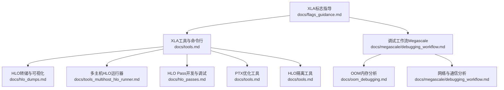
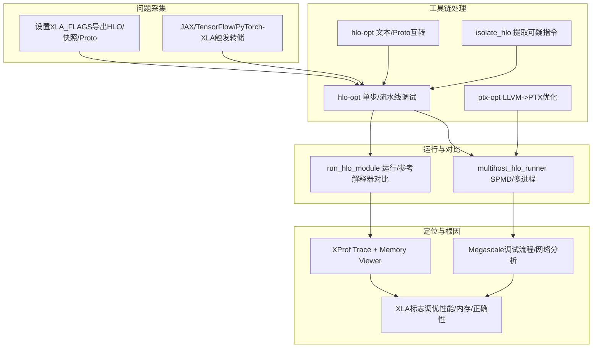
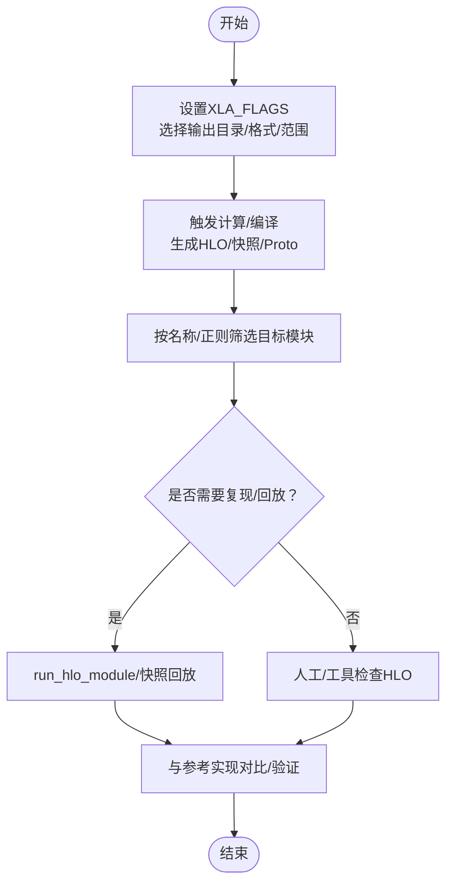
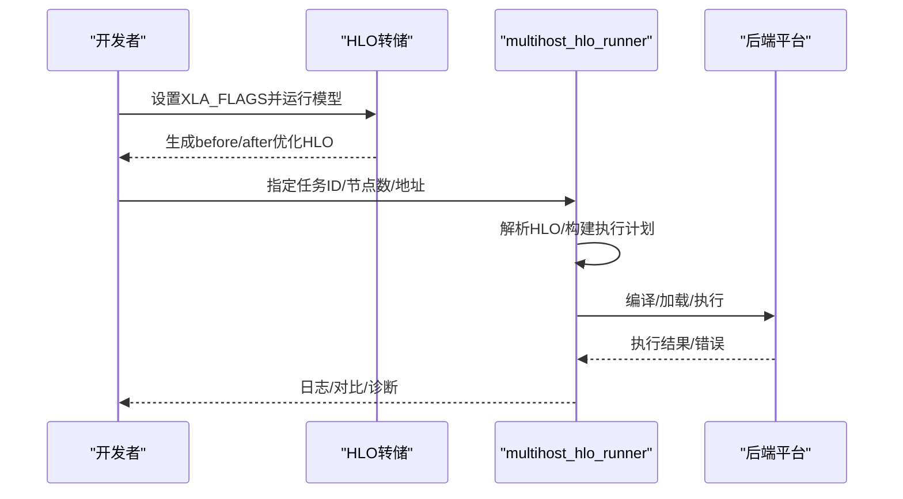
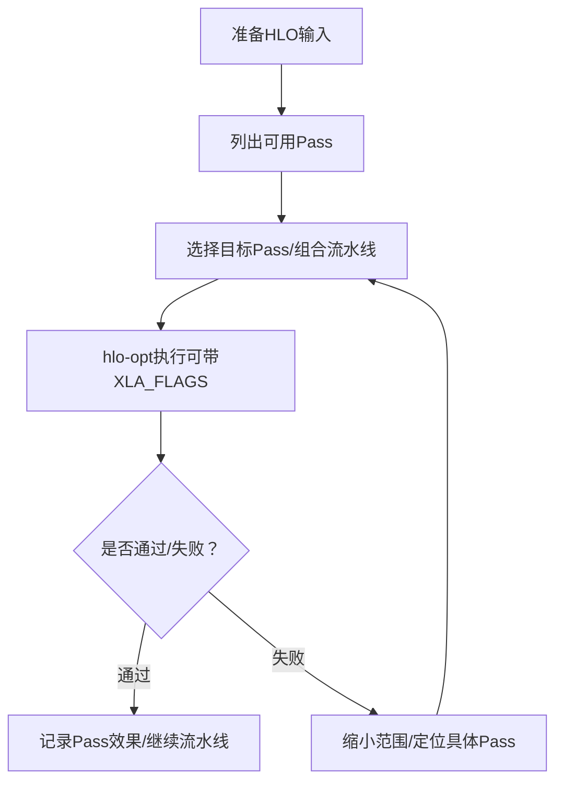
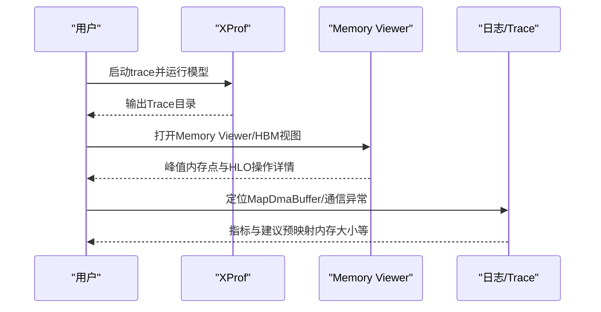
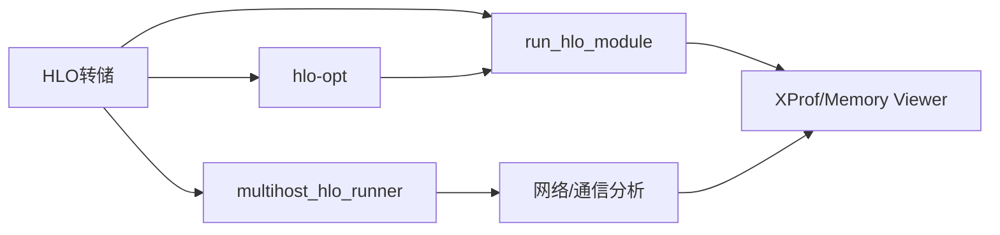

# 调试工具与技术

<cite>
**本文引用的文件**
- [docs/tools.md](file://docs/tools.md)
- [docs/hlo_dumps.md](file://docs/hlo_dumps.md)
- [docs/tools_multihost_hlo_runner.md](file://docs/tools_multihost_hlo_runner.md)
- [docs/megascale/debugging_workflow.md](file://docs/megascale/debugging_workflow.md)
- [docs/oom_debugging.md](file://docs/oom_debugging.md)
- [docs/hlo_passes.md](file://docs/hlo_passes.md)
- [docs/flags_guidance.md](file://docs/flags_guidance.md)
- [xla/tools/multihost_hlo_runner/README.md](file://xla/tools/multihost_hlo_runner/README.md)
</cite>

## 目录
1. [简介](#简介)
2. [项目结构](#项目结构)
3. [核心组件](#核心组件)
4. [架构总览](#架构总览)
5. [详细组件分析](#详细组件分析)
6. [依赖分析](#依赖分析)
7. [性能考虑](#性能考虑)
8. [故障排查指南](#故障排查指南)
9. [结论](#结论)
10. [附录](#附录)

## 简介
本指南面向XLA调试与优化场景，系统梳理HLO转储、多主机HLO运行器、HLO单步/多步调试、二分定位、性能分析与内存OOM诊断等关键能力，并给出从问题识别到根因分析的完整工作流建议。内容覆盖命令行工具用法、配置项说明、分布式与多设备调试技巧，以及在不同后端（CPU/GPU/TPU）上的最佳实践。

## 项目结构
围绕调试与工具链，XLA仓库中与本指南直接相关的主要文档与工具分布如下：
- 工具与命令行：XLA工具页、HLO转储、多主机HLO运行器、HLO Pass开发与调试、PTX优化、HLO隔离工具等
- 调试工作流：Megascale调试流程、OOM内存分析、网络与通信分析
- 性能与标志：XLA标志指导（正确性/性能/内存/其他）

**图表来源**
- [docs/tools.md](file://docs/tools.md#L1-L334)
- [docs/hlo_dumps.md](file://docs/hlo_dumps.md#L1-L261)
- [docs/tools_multihost_hlo_runner.md](file://docs/tools_multihost_hlo_runner.md#L1-L153)
- [docs/megascale/debugging_workflow.md](file://docs/megascale/debugging_workflow.md#L1-L316)
- [docs/oom_debugging.md](file://docs/oom_debugging.md#L1-L88)
- [docs/hlo_passes.md](file://docs/hlo_passes.md#L1-L231)
- [docs/flags_guidance.md](file://docs/flags_guidance.md#L1-L101)

**章节来源**
- [docs/tools.md](file://docs/tools.md#L1-L334)
- [docs/hlo_dumps.md](file://docs/hlo_dumps.md#L1-L261)
- [docs/tools_multihost_hlo_runner.md](file://docs/tools_multihost_hlo_runner.md#L1-L153)
- [docs/megascale/debugging_workflow.md](file://docs/megascale/debugging_workflow.md#L1-L316)
- [docs/oom_debugging.md](file://docs/oom_debugging.md#L1-L88)
- [docs/hlo_passes.md](file://docs/hlo_passes.md#L1-L231)
- [docs/flags_guidance.md](file://docs/flags_guidance.md#L1-L101)

## 核心组件
- HLO转储与可视化：通过XLA_FLAGS输出文本/HLO快照/Proto/HTML/Graphviz等格式，支持按正则筛选特定阶段或Pass
- 多主机HLO运行器：支持SPMD与跨主机通信，可编译不执行或直接运行，便于复现与对比
- HLO单步/多步调试：使用hlo-opt对单个Pass或自定义流水线进行快速验证
- PTX优化：对LLVM IR进一步优化并生成PTX，支持中间阶段转储
- HLO隔离工具：从大型模块中提取可疑指令及其上下文，形成最小可复现子模块
- 性能与内存分析：XProf Trace与Memory Viewer，结合XLA标志进行定位与调优
- 分布式与多设备：Megascale调试流程、网络分析、RPC延迟分析、内存映射与DMA缓冲区检查

**章节来源**
- [docs/tools.md](file://docs/tools.md#L18-L334)
- [docs/hlo_dumps.md](file://docs/hlo_dumps.md#L1-L261)
- [docs/tools_multihost_hlo_runner.md](file://docs/tools_multihost_hlo_runner.md#L1-L153)
- [docs/megascale/debugging_workflow.md](file://docs/megascale/debugging_workflow.md#L1-L316)
- [docs/oom_debugging.md](file://docs/oom_debugging.md#L1-L88)
- [docs/hlo_passes.md](file://docs/hlo_passes.md#L1-L231)
- [docs/flags_guidance.md](file://docs/flags_guidance.md#L1-L101)

## 架构总览
下图展示从“问题采集（HLO转储/Trace）—>工具链处理（hlo-opt/ptx-opt）—>运行与对比（run_hlo_module/multihost_hlo_runner）—>定位与根因（Pass/网络/内存）”的整体流程。

**图表来源**
- [docs/tools.md](file://docs/tools.md#L22-L334)
- [docs/hlo_dumps.md](file://docs/hlo_dumps.md#L18-L261)
- [docs/megascale/debugging_workflow.md](file://docs/megascale/debugging_workflow.md#L190-L316)
- [docs/oom_debugging.md](file://docs/oom_debugging.md#L1-L88)
- [docs/flags_guidance.md](file://docs/flags_guidance.md#L1-L101)

## 详细组件分析

### HLO转储与工作流
- 使用XLA_FLAGS控制输出位置、格式与范围（文本/HLO快照/Proto/HTML/Graphviz），支持按Pass正则筛选
- 在JAX/TF/PyTorch/XLA中可通过环境变量或程序化接口触发转储
- 可将转储用于“复现/回放”，先用假数据运行，再用快照输入重放
- 建议在问题报告中包含“转储前/后/缓冲区分配”三类文件

**图表来源**
- [docs/hlo_dumps.md](file://docs/hlo_dumps.md#L18-L261)
- [docs/tools.md](file://docs/tools.md#L22-L60)

**章节来源**
- [docs/hlo_dumps.md](file://docs/hlo_dumps.md#L1-L261)
- [docs/tools.md](file://docs/tools.md#L12-L60)

### 多主机HLO运行器（SPMD）
- 支持单进程/多GPU、MPI多进程/多节点（SLURM）运行
- 可仅编译不执行，或直接运行；针对已优化HLO需禁用重编译相关开关
- 针对多设备/多进程常见问题提供排障建议（GPU数量/CUDA_VISIBLE_DEVICES/动态模式/NCCL/CUDA/cuDNN）

**图表来源**
- [docs/tools_multihost_hlo_runner.md](file://docs/tools_multihost_hlo_runner.md#L1-L153)
- [xla/tools/multihost_hlo_runner/README.md](file://xla/tools/multihost_hlo_runner/README.md#L1-L3)

**章节来源**
- [docs/tools_multihost_hlo_runner.md](file://docs/tools_multihost_hlo_runner.md#L1-L153)
- [xla/tools/multihost_hlo_runner/README.md](file://xla/tools/multihost_hlo_runner/README.md#L1-L3)

### HLO单步/多步调试与Pass开发
- 使用hlo-opt对单个Pass或自定义流水线进行验证，避免全编译开销
- 支持列出Pass、注册新Pass、运行时计时以检测微小回归
- 结合XLA_FLAGS传入调试参数（如特定Pass阈值）

**图表来源**
- [docs/tools.md](file://docs/tools.md#L184-L274)
- [docs/hlo_passes.md](file://docs/hlo_passes.md#L1-L231)

**章节来源**
- [docs/tools.md](file://docs/tools.md#L184-L274)
- [docs/hlo_passes.md](file://docs/hlo_passes.md#L1-L231)

### PTX优化与中间阶段转储
- 对LLVM IR进行优化并生成PTX，支持在关键阶段转储LLVM IR
- 适用于无GPU设备场景（通过设备规格文件与自动调优缓存）

**章节来源**
- [docs/tools.md](file://docs/tools.md#L295-L308)

### HLO隔离工具（最小化复现）
- 从大型HLO中提取单条指令及其必要上下文，形成最小可复现模块
- 便于提交Bug报告与快速定位

**章节来源**
- [docs/tools.md](file://docs/tools.md#L309-L334)

### 性能分析与XProf使用
- 使用XProf捕获Trace，Memory Viewer查看峰值内存与HLO操作
- 结合Megascale调试流程中的网络分析、RPC延迟分析、DMA缓冲区映射检查等手段定位瓶颈

**图表来源**
- [docs/oom_debugging.md](file://docs/oom_debugging.md#L1-L88)
- [docs/megascale/debugging_workflow.md](file://docs/megascale/debugging_workflow.md#L190-L316)

**章节来源**
- [docs/oom_debugging.md](file://docs/oom_debugging.md#L1-L88)
- [docs/megascale/debugging_workflow.md](file://docs/megascale/debugging_workflow.md#L190-L316)

## 依赖分析
- 工具链耦合关系
  - HLO转储是所有后续分析的基础输入
  - hlo-opt与multihost_hlo_runner共享HLO解析与编译能力
  - XProf与Megascale调试流程相互印证（Trace与日志Digest）
- 关键外部依赖
  - 多主机运行依赖MPI/NCCL/SLURM等分布式环境
  - GPU场景依赖CUDA/cuDNN/PTX/LLVM优化链路

**图表来源**
- [docs/tools.md](file://docs/tools.md#L22-L114)
- [docs/tools_multihost_hlo_runner.md](file://docs/tools_multihost_hlo_runner.md#L1-L153)
- [docs/megascale/debugging_workflow.md](file://docs/megascale/debugging_workflow.md#L190-L316)
- [docs/oom_debugging.md](file://docs/oom_debugging.md#L1-L88)

**章节来源**
- [docs/tools.md](file://docs/tools.md#L22-L114)
- [docs/tools_multihost_hlo_runner.md](file://docs/tools_multihost_hlo_runner.md#L1-L153)
- [docs/megascale/debugging_workflow.md](file://docs/megascale/debugging_workflow.md#L190-L316)
- [docs/oom_debugging.md](file://docs/oom_debugging.md#L1-L88)

## 性能考虑
- 正确性优先：启用边界检查等正确性标志，确保行为稳定后再追求性能
- 性能标志：根据场景选择合适的异步/流水线/融合/调度策略（TPU/GPU各有侧重）
- 内存调度：在内存受限场景下调整调度算法与阈值，权衡编译时间与内存占用
- 其他常用标志：如转储路径、调试开关等，确保可追踪且不影响默认行为

**章节来源**
- [docs/flags_guidance.md](file://docs/flags_guidance.md#L1-L101)

## 故障排查指南
- 通用步骤
  - 采集HLO转储（文本/Proto/快照），必要时按Pass正则筛选
  - 使用run_hlo_module/multihost_hlo_runner进行回放与对比
  - 利用hlo-opt对可疑Pass进行单步验证
  - 使用XProf/Memory Viewer定位峰值内存与热点操作
- 分布式/多设备
  - 检查GPU数量/CUDA_VISIBLE_DEVICES/NCCL初始化
  - 使用Megascale调试流程定位坏芯片/网络问题/模块不一致/指纹不匹配
  - 结合网络分析与RPC延迟分析，确认是否存在高尾延迟或带宽饱和
- 内存OOM
  - 使用XProf Memory Viewer聚焦峰值点，结合HLO操作图表定位大中间量/填充不当
  - 调整XLA内存调度与阈值，或优化模型结构/分片策略

**章节来源**
- [docs/tools.md](file://docs/tools.md#L22-L114)
- [docs/tools_multihost_hlo_runner.md](file://docs/tools_multihost_hlo_runner.md#L36-L44)
- [docs/megascale/debugging_workflow.md](file://docs/megascale/debugging_workflow.md#L25-L188)
- [docs/oom_debugging.md](file://docs/oom_debugging.md#L1-L88)

## 结论
通过“HLO转储—工具链—运行对比—定位根因”的闭环流程，可以高效地完成从问题识别到根因分析的调试工作。配合XProf与Megascale调试流程，可在复杂分布式与多设备环境下快速定位性能瓶颈与稳定性问题。建议在日常开发中养成“先转储、后工具、再回放”的习惯，并结合XLA标志进行针对性调优。

## 附录
- 常用命令与路径
  - HLO转储：参见HLO转储文档中的环境变量与JAX程序化接口
  - 运行HLO模块：参见run_hlo_module与multihost_hlo_runner
  - HLO Pass调试：参见hlo-opt与Pass开发文档
  - PTX优化：参见ptx-opt
  - HLO隔离：参见isolate_hlo
  - 性能与内存：参见XProf与Megascale调试流程
  - 标志指导：参见XLA标志指导文档

**章节来源**
- [docs/tools.md](file://docs/tools.md#L22-L334)
- [docs/hlo_dumps.md](file://docs/hlo_dumps.md#L1-L261)
- [docs/tools_multihost_hlo_runner.md](file://docs/tools_multihost_hlo_runner.md#L1-L153)
- [docs/megascale/debugging_workflow.md](file://docs/megascale/debugging_workflow.md#L1-L316)
- [docs/oom_debugging.md](file://docs/oom_debugging.md#L1-L88)
- [docs/hlo_passes.md](file://docs/hlo_passes.md#L1-L231)
- [docs/flags_guidance.md](file://docs/flags_guidance.md#L1-L101)