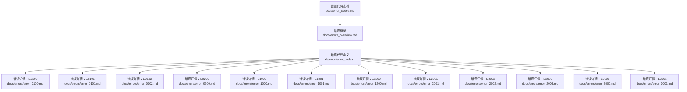
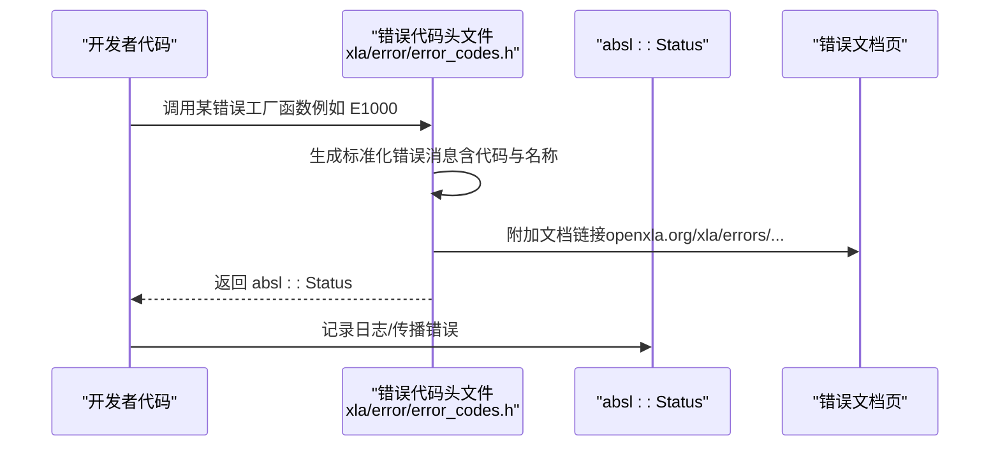
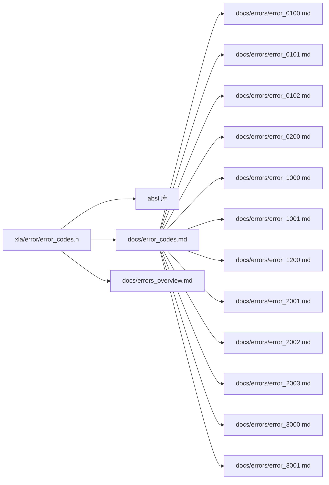

# 错误代码参考

<cite>
**本文引用的文件**
- [docs/error_codes.md](file://docs/error_codes.md)
- [docs/errors_overview.md](file://docs/errors_overview.md)
- [xla/error/error_codes.h](file://xla/error/error_codes.h)
- [docs/errors/error_0100.md](file://docs/errors/error_0100.md)
- [docs/errors/error_0101.md](file://docs/errors/error_0101.md)
- [docs/errors/error_0102.md](file://docs/errors/error_0102.md)
- [docs/errors/error_0200.md](file://docs/errors/error_0200.md)
- [docs/errors/error_1000.md](file://docs/errors/error_1000.md)
- [docs/errors/error_1001.md](file://docs/errors/error_1001.md)
- [docs/errors/error_1200.md](file://docs/errors/error_1200.md)
- [docs/errors/error_2001.md](file://docs/errors/error_2001.md)
- [docs/errors/error_2002.md](file://docs/errors/error_2002.md)
- [docs/errors/error_2003.md](file://docs/errors/error_2003.md)
- [docs/errors/error_3000.md](file://docs/errors/error_3000.md)
- [docs/errors/error_3001.md](file://docs/errors/error_3001.md)
</cite>

## 目录
1. [简介](#简介)
2. [项目结构](#项目结构)
3. [核心组件](#核心组件)
4. [架构总览](#架构总览)
5. [详细组件分析](#详细组件分析)
6. [依赖关系分析](#依赖关系分析)
7. [性能考量](#性能考量)
8. [故障排查指南](#故障排查指南)
9. [结论](#结论)
10. [附录](#附录)

## 简介
本参考文档系统化整理了 XLA 的错误代码体系，覆盖编译期、运行时与配置类错误，按错误类型组织并提供每个错误代码的含义、触发条件、影响范围与修复步骤。同时给出常见错误的快速解决方案与预防措施，并提供错误代码搜索与过滤建议，帮助用户快速定位与解决问题。

## 项目结构
XLA 的错误代码与文档分布于以下位置：
- 错误代码定义：位于 xla/error/error_codes.h，统一声明所有错误代码及其名称、状态码与工厂函数。
- 错误索引与概览：位于 docs/error_codes.md 与 docs/errors_overview.md，提供错误分类与总体说明。
- 各错误代码详情：位于 docs/errors/*.md，每个文件对应一个具体错误代码，包含分类、示例消息、触发原因、调试与工具使用建议等。

图表来源
- [docs/error_codes.md](file://docs/error_codes.md#L1-L22)
- [docs/errors_overview.md](file://docs/errors_overview.md#L1-L37)
- [xla/error/error_codes.h](file://xla/error/error_codes.h#L61-L102)

章节来源
- [docs/error_codes.md](file://docs/error_codes.md#L1-L22)
- [docs/errors_overview.md](file://docs/errors_overview.md#L1-L37)

## 核心组件
- 错误代码清单与工厂函数：通过宏 XLA_ERROR_CODE_LIST 统一声明所有错误代码，生成枚举值、字符串标识、名称映射与带标准格式的消息包装函数。每个错误代码均附带对应的文档链接，便于用户查阅。
- 错误分类与语义：错误代码涵盖通用错误（如取消、未知、资源耗尽等）以及 XLA 特定分类，包括运行时缓冲区分配失败、程序加载失败、输入不匹配、核心意外停机；编译时 HBM/VMEM 溢出、主机卸载输出不匹配、Mosaic 类型/对齐问题、SparseCore 分配失败与副本数不可行等。
- 文档索引与概览：提供错误代码总表与错误来源说明，帮助用户快速定位到具体错误页面。

章节来源
- [xla/error/error_codes.h](file://xla/error/error_codes.h#L61-L102)
- [xla/error/error_codes.h](file://xla/error/error_codes.h#L116-L162)
- [docs/error_codes.md](file://docs/error_codes.md#L1-L22)
- [docs/errors_overview.md](file://docs/errors_overview.md#L18-L36)

## 架构总览
下图展示了错误代码在 XLA 中的生成与使用流程：从错误代码定义出发，生成工厂函数与消息格式化工具，最终在运行时或编译时被调用以形成带有标准前缀与文档链接的错误信息。

图表来源
- [xla/error/error_codes.h](file://xla/error/error_codes.h#L156-L188)

章节来源
- [xla/error/error_codes.h](file://xla/error/error_codes.h#L190-L255)

## 详细组件分析

### 运行时错误
- E0100：缓冲区分配失败
  - 触发条件：设备端内存分配失败，通常由显存不足或碎片导致。
  - 影响范围：单次执行或程序加载阶段。
  - 解决方案：降低批大小、参数分片、缩短序列长度、启用缓冲区捐赠、优化检查点策略、避免内存泄漏、使用工具标记 OOM 时的分配快照。
  - 参考：[E0100 详情](file://docs/errors/error_0100.md#L1-L86)

- E0101：程序分配失败
  - 触发条件：编译后程序无法加载至设备内存。
  - 影响范围：程序加载阶段。
  - 解决方案：减少激活内存、参数分片、缩短序列长度、缓冲区捐赠、调整共享内存占比、管理并发加载程序数量、避免内存泄漏、使用内存/性能分析工具。
  - 参考：[E0101 详情](file://docs/errors/error_0101.md#L1-L74)

- E0102：程序输入缓冲区不匹配
  - 触发条件：实际提供的缓冲区尺寸与编译程序期望不一致，可能因布局差异导致。
  - 影响范围：执行阶段。
  - 解决方案：确保导出与推理环境配置一致、重新导出模型、检查硬件拓扑变化、确认布局兼容性。
  - 参考：[E0102 详情](file://docs/errors/error_0102.md#L1-L58)

- E0200：核心意外停机
  - 触发条件：硬件强制停机，可能由基础设施故障、硬件约束违规或编译器断言失败引起。
  - 影响范围：致命错误，需深入日志分析。
  - 解决方案：区分三类场景（基础设施故障、硬件约束违规、断言失败），分别采取重试/隔离硬件、上报编译器缺陷、调试自定义内核与同步逻辑。
  - 参考：[E0200 详情](file://docs/errors/error_0200.md#L1-L159)

章节来源
- [docs/errors/error_0100.md](file://docs/errors/error_0100.md#L1-L86)
- [docs/errors/error_0101.md](file://docs/errors/error_0101.md#L1-L74)
- [docs/errors/error_0102.md](file://docs/errors/error_0102.md#L1-L58)
- [docs/errors/error_0200.md](file://docs/errors/error_0200.md#L1-L159)

### 编译时错误
- E1000：HBM 内存溢出
  - 触发条件：程序所需 HBM 超过物理容量。
  - 影响范围：编译阶段。
  - 解决方案：平衡 TC/SC 使用、识别异常大张量、聚合分配导致的 OOM、调整配置、优化架构与分片、检查填充与对齐、调节关键 XLA 标志、手动检查点/重计算、使用分析工具定位峰值贡献者。
  - 参考：[E1000 详情](file://docs/errors/error_1000.md#L1-L227)

- E1001：作用域 VMEM 内存溢出
  - 触发条件：指令作用域内临时占用超过限制。
  - 影响范围：编译阶段。
  - 解决方案：区分自定义内核与非内核问题；前者通过调整块大小、设置内核级 VMEM 限制、约束内存着色、必要时提升全局限制；后者上报编译器缺陷。
  - 参考：[E1001 详情](file://docs/errors/error_1001.md#L1-L78)

- E1200：主机卸载输出不匹配
  - 触发条件：标记卸载至主机的张量作为设备输出返回，但入口签名未声明为主机内存。
  - 影响范围：编译阶段。
  - 解决方案：若确需主机输出，显式设置入口输出内存空间为主机；否则插入“移回设备”的标注。
  - 参考：[E1200 详情](file://docs/errors/error_1200.md#L1-L61)

- E2001：硬件不支持的右侧数据类型
  - 触发条件：矩阵乘法右侧操作数的数据类型在当前硬件上不受原生支持。
  - 影响范围：编译阶段。
  - 解决方案：转换为硬件支持类型、检查兼容模式、必要时升级硬件。
  - 参考：[E2001 详情](file://docs/errors/error_2001.md#L1-L89)

- E2002：Mosaic 输入/输出块形状与平铺不匹配
  - 触发条件：块形状不满足硬件平铺整除或全形例外。
  - 影响范围：编译阶段。
  - 解决方案：调整块大小使其与硬件平铺对齐。
  - 参考：[E2002 详情](file://docs/errors/error_2002.md#L1-L54)

- E2003：无法静态证明内存访问对齐
  - 触发条件：编译器无法静态证明动态索引是平铺大小的倍数。
  - 影响范围：编译阶段。
  - 解决方案：显式断言对齐、改用对齐加载/旋转、重排/填充以满足对齐要求。
  - 参考：[E2003 详情](file://docs/errors/error_2003.md#L1-L76)

- E3000：SparseCore 分配失败
  - 触发条件：SparseCore 静态分配无法获得连续内存块。
  - 影响范围：编译阶段。
  - 解决方案：针对 HBM 失败检查分片与上限、针对内部内存失败隔离操作/禁用协同卸载/上报编译器缺陷。
  - 参考：[E3000 详情](file://docs/errors/error_3000.md#L1-L90)

- E3001：SparseCore 无可行逻辑副本数
  - 触发条件：无法确定使中间缓冲区适配 Tilespmem 的逻辑副本数。
  - 影响范围：编译阶段。
  - 解决方案：改进元数据估计、降低批大小。
  - 参考：[E3001 详情](file://docs/errors/error_3001.md#L1-L63)

章节来源
- [docs/errors/error_1000.md](file://docs/errors/error_1000.md#L1-L227)
- [docs/errors/error_1001.md](file://docs/errors/error_1001.md#L1-L78)
- [docs/errors/error_1200.md](file://docs/errors/error_1200.md#L1-L61)
- [docs/errors/error_2001.md](file://docs/errors/error_2001.md#L1-L89)
- [docs/errors/error_2002.md](file://docs/errors/error_2002.md#L1-L54)
- [docs/errors/error_2003.md](file://docs/errors/error_2003.md#L1-L76)
- [docs/errors/error_3000.md](file://docs/errors/error_3000.md#L1-L90)
- [docs/errors/error_3001.md](file://docs/errors/error_3001.md#L1-L63)

### 错误分类与索引
- 运行时错误（TPU）
  - E0100：缓冲区分配失败
  - E0101：程序分配失败
  - E0102：程序输入缓冲区不匹配
  - E0200：核心意外停机
- 编译时错误（TPU）
  - E1000：HBM 内存溢出
  - E1001：作用域 VMEM 内存溢出
  - E1200：主机卸载输出不匹配
  - E2001：硬件不支持的右侧数据类型
  - E2002：Mosaic 输入/输出块形状与平铺不匹配
  - E2003：无法静态证明内存访问对齐
  - E3000：SparseCore 分配失败
  - E3001：SparseCore 无可行逻辑副本数

章节来源
- [docs/error_codes.md](file://docs/error_codes.md#L5-L22)

## 依赖关系分析
- 错误代码定义依赖 absl 状态与字符串工具，用于生成标准化消息与文档链接。
- 文档索引与概览依赖各错误详情页，形成“代码→页面→修复”的闭环。
- 运行时与编译时错误分别由不同路径触发，但都通过统一的错误工厂函数与消息格式化工具进行报告。

图表来源
- [xla/error/error_codes.h](file://xla/error/error_codes.h#L22-L27)
- [docs/error_codes.md](file://docs/error_codes.md#L1-L22)

章节来源
- [xla/error/error_codes.h](file://xla/error/error_codes.h#L1-L266)
- [docs/error_codes.md](file://docs/error_codes.md#L1-L22)

## 性能考量
- 优先采用配置与架构优化（如批大小、分片、混合精度、重计算）降低峰值内存，再考虑调整 XLA 标志。
- 在编译阶段关注重计算策略与内存预算，避免过度增加编译时间与潜在数值不稳定。
- 对于自定义内核，优先通过块大小与内存着色控制 VMEM 使用，必要时提升限制。

## 故障排查指南
- 快速定位
  - 使用错误代码索引快速跳转到对应文档：[错误代码索引](file://docs/error_codes.md#L5-L22)
  - 依据错误类别筛选：运行时/编译时/配置类，结合硬件平台（TPU/GPU）缩小范围。
- 常见快速修复
  - 运行时 OOM：降低批大小、启用缓冲区捐赠、优化检查点、避免内存泄漏。
  - 程序加载失败：减少激活内存、参数分片、缩短序列长度、减少并发加载程序。
  - 输入不匹配：保持导出与推理配置一致、检查硬件拓扑变化。
  - 核心停机：区分基础设施故障、硬件约束违规与断言失败，分别处理。
  - 编译时 HBM/VMEM 溢出：识别异常大张量、优化架构与分片、检查填充与对齐、调节 XLA 标志、使用分析工具。
  - Mosaic 类问题：对齐块形状、显式断言对齐、改用对齐加载/旋转、重排/填充。
  - SparseCore 问题：检查分片与上限、隔离失败操作、必要时禁用协同卸载、上报编译器缺陷。
- 预防措施
  - 在 CI 中加入内存与对齐检查、定期更新硬件/软件栈、保持配置一致性。
  - 使用分析工具（内存/性能分析、XProf）持续监控峰值内存与热点。

章节来源
- [docs/errors_overview.md](file://docs/errors_overview.md#L18-L36)
- [docs/errors/error_0100.md](file://docs/errors/error_0100.md#L51-L86)
- [docs/errors/error_0101.md](file://docs/errors/error_0101.md#L34-L74)
- [docs/errors/error_0102.md](file://docs/errors/error_0102.md#L44-L58)
- [docs/errors/error_0200.md](file://docs/errors/error_0200.md#L30-L159)
- [docs/errors/error_1000.md](file://docs/errors/error_1000.md#L42-L227)
- [docs/errors/error_1001.md](file://docs/errors/error_1001.md#L43-L78)
- [docs/errors/error_1200.md](file://docs/errors/error_1200.md#L35-L61)
- [docs/errors/error_2001.md](file://docs/errors/error_2001.md#L38-L89)
- [docs/errors/error_2002.md](file://docs/errors/error_2002.md#L46-L54)
- [docs/errors/error_2003.md](file://docs/errors/error_2003.md#L48-L76)
- [docs/errors/error_3000.md](file://docs/errors/error_3000.md#L39-L90)
- [docs/errors/error_3001.md](file://docs/errors/error_3001.md#L42-L63)

## 结论
XLA 的错误代码体系以统一的工厂函数与消息格式化为基础，配合详尽的错误文档，实现了跨编译期与运行时的可追踪、可诊断与可修复。通过分类索引与快速修复建议，用户可以高效定位问题并采取针对性措施。建议在日常开发中结合分析工具与配置优化，持续降低错误发生概率。

## 附录
- 错误代码搜索与过滤建议
  - 按类别过滤：运行时/编译时/配置类，结合硬件平台筛选。
  - 按关键词检索：内存、对齐、分片、VMEM/HBM、断言、主机卸载、SparseCore。
  - 使用文档索引页快速跳转到具体错误页面，结合示例消息与调试建议进行定位。