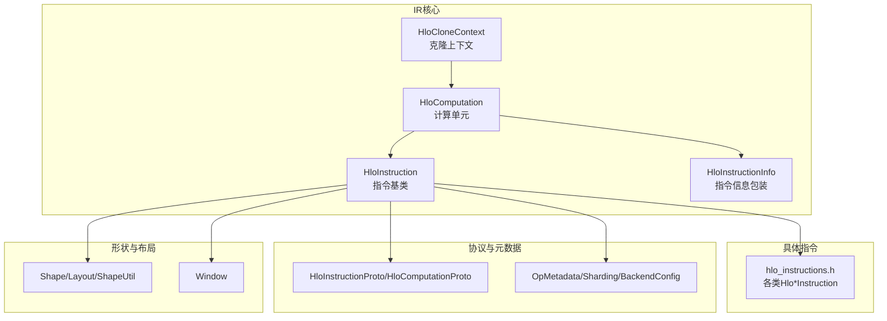
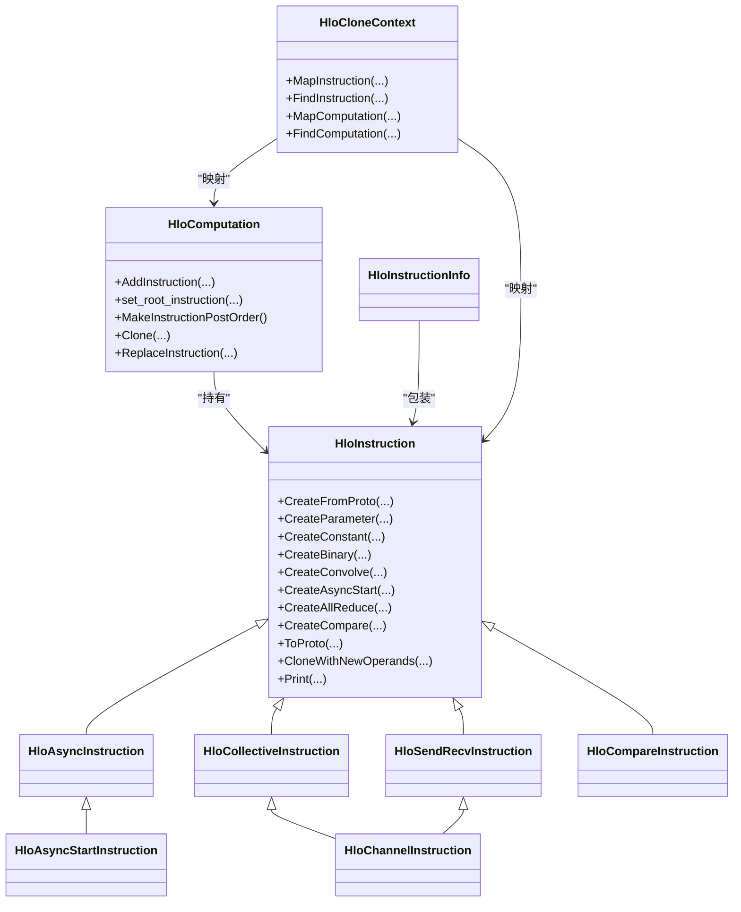
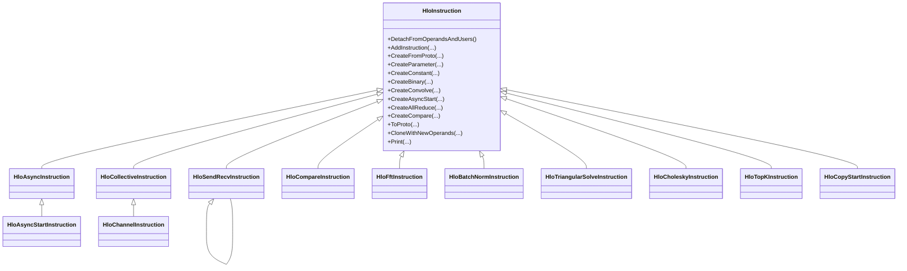
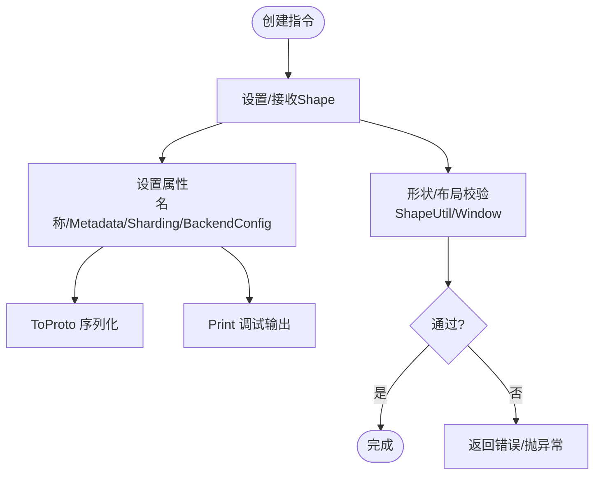
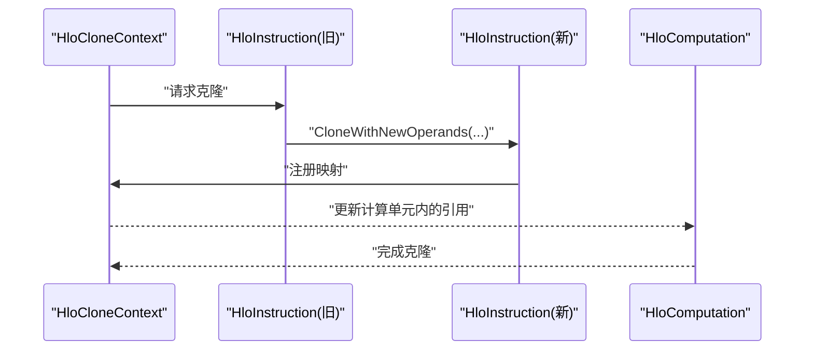
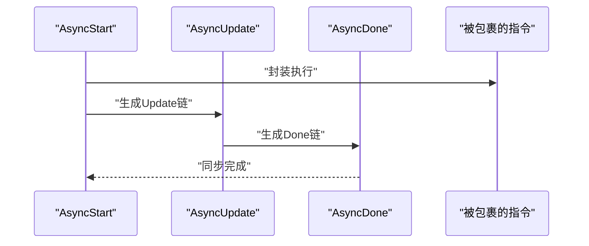
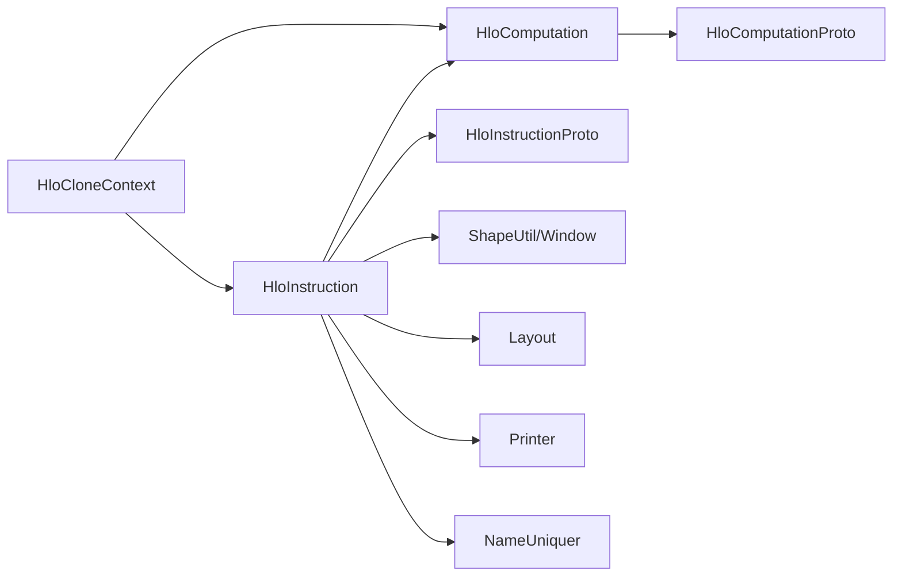

# HLO指令系统

<cite>
**本文引用的文件**
- [hlo_instruction.h](file://xla/hlo/ir/hlo_instruction.h)
- [hlo_instructions.h](file://xla/hlo/ir/hlo_instructions.h)
- [hlo_computation.h](file://xla/hlo/ir/hlo_computation.h)
- [hlo_clone_context.h](file://xla/hlo/ir/hlo_clone_context.h)
- [hlo_opcode.h](file://xla/hlo/ir/hlo_opcode.h)
- [hlo_print_options.h](file://xla/hlo/ir/hlo_print_options.h)
- [hlo_sharding.h](file://xla/hlo/ir/hlo_sharding.h)
- [hlo_domain_metadata.h](file://xla/hlo/ir/hlo_domain_metadata.h)
- [backend_config.h](file://xla/hlo/ir/backend_config.h)
- [dfs_hlo_visitor.h](file://xla/hlo/ir/dfs_hlo_visitor.h)
- [hlo_original_value.h](file://xla/hlo/ir/hlo_original_value.h)
- [hlo_module_metadata.h](file://xla/hlo/ir/hlo_module_metadata.h)
- [shape.h](file://xla/shape.h)
- [shape_util.h](file://xla/shape_util.h)
- [layout.h](file://xla/layout.h)
- [literal.h](file://xla/literal.h)
- [window_util.h](file://xla/window_util.h)
- [replica_group.h](file://xla/hlo/ir/replica_group.h)
- [service/hlo.pb.h](file://xla/service/hlo.pb.h)
- [xla_data.pb.h](file://xla/xla_data.pb.h)
- [printer.h](file://xla/printer.h)
- [comparison_util.h](file://xla/comparison_util.h)
- [mapped_ptr_container_sorter.h](file://xla/hlo/ir/mapped_ptr_container_sorter.h)
- [name_uniquer.h](file://xla/service/name_uniquer.h)
- [shape_pool.h](file://xla/shape_pool.h)
- [online_topsort.h](file://xla/online_topsort.h)
- [ptrvec.h](file://xla/hlo/ir/ptrvec.h)
- [hlo_computation_test.cc](file://xla/hlo/testlib/hlo_computation_test.cc)
- [hlo_instruction_test.cc](file://xla/hlo/testlib/hlo_instruction_test.cc)
</cite>

## 目录
1. [引言](#引言)
2. [项目结构](#项目结构)
3. [核心组件](#核心组件)
4. [架构总览](#架构总览)
5. [详细组件分析](#详细组件分析)
6. [依赖关系分析](#依赖关系分析)
7. [性能考量](#性能考量)
8. [故障排查指南](#故障排查指南)
9. [结论](#结论)
10. [附录：常见用法与示例路径](#附录常见用法与示例路径)

## 引言
本文件面向XLA的高层指令（HLO, High-Level Operations）系统，系统性阐述其设计理念、数据结构、继承体系、属性系统、形状推导与验证机制、克隆/序列化/反序列化流程、调试打印、原型转换与内存布局、以及对异步执行、着色分配与分布式计算的支持。文档同时给出关键实现位置的“章节来源”与“图示来源”，便于读者在代码库中快速定位。

## 项目结构
HLO IR位于xla/hlo/ir目录下，核心由以下模块构成：
- 指令基类与通用能力：HloInstruction、HloInstructionInfo、迭代器与包装器
- 具体指令类型：分布在hlo_instructions.h中的各类子类（算术/逻辑/比较/卷积/FFT/随机/归约/通信/异步/复制等）
- 计算单元：HloComputation（类似函数），管理指令集合、参数、根节点、拓扑序等
- 克隆上下文：HloCloneContext，用于跨对象映射与克隆
- 协议与元数据：HloInstructionProto/HloComputationProto、OpMetadata、Sharding、BackendConfig等
- 形状与布局：Shape、Layout、ShapeUtil、Window等
- 遍历与访问：DfsHloVisitor等

**图示来源**
- [hlo_instruction.h](file://xla/hlo/ir/hlo_instruction.h#L225-L301)
- [hlo_instructions.h](file://xla/hlo/ir/hlo_instructions.h#L60-L97)
- [hlo_computation.h](file://xla/hlo/ir/hlo_computation.h#L84-L120)
- [hlo_clone_context.h](file://xla/hlo/ir/hlo_clone_context.h#L32-L94)

**章节来源**
- [hlo_instruction.h](file://xla/hlo/ir/hlo_instruction.h#L225-L301)
- [hlo_instructions.h](file://xla/hlo/ir/hlo_instructions.h#L60-L97)
- [hlo_computation.h](file://xla/hlo/ir/hlo_computation.h#L84-L120)
- [hlo_clone_context.h](file://xla/hlo/ir/hlo_clone_context.h#L32-L94)

## 核心组件
- HloInstruction：HLO指令的抽象基类，定义了指令的生命周期、属性系统、形状推导接口、序列化/反序列化入口、克隆机制、调试打印、以及与父计算单元的关系。它还提供大量静态工厂方法用于创建常见指令（参数、常量、二元/三元/变参运算、卷积、FFT、随机数、归约、通信、异步、复制等）。
- HloInstructionInfo：在计算单元内部以列表形式存储指令时，携带不可变的opcode与指针，便于遍历与排序。
- HloComputation：代表一个“函数式”的计算单元，包含参数、指令序列、根指令、拓扑序、深度克隆、替换与清理等能力。
- HloCloneContext：跟踪旧对象到新对象的映射，支撑跨对象克隆与一致性维护。
- 具体指令类族：在hlo_instructions.h中按功能域分组，如维度相关（Broadcast/Concatenate/Reduce/Reverse/Sort/Transpose）、通信（AllGather/AllReduce/AllToAll/CollectivePermute/Broadcast/CollectiveBroadcast/CollectivePermute等）、异步（AsyncStart/AsyncUpdate/AsyncDone/CopyStart）、比较（Compare）、三角分解（TriangularSolve/Cholesky）、TopK、Send/Recv等。

**章节来源**
- [hlo_instruction.h](file://xla/hlo/ir/hlo_instruction.h#L225-L301)
- [hlo_instructions.h](file://xla/hlo/ir/hlo_instructions.h#L60-L97)
- [hlo_computation.h](file://xla/hlo/ir/hlo_computation.h#L84-L120)
- [hlo_clone_context.h](file://xla/hlo/ir/hlo_clone_context.h#L32-L94)

## 架构总览
HLO IR采用“指令即节点”的DAG模型，指令之间通过数据依赖与控制依赖建立偏序关系；计算单元作为容器持有指令并确定根输出。指令的形状与布局由Shape/ShapeUtil/Window等工具推导与校验；分布式通信通过通道ID与设备列表抽象；异步执行通过AsyncStart/Update/Done链路表达；克隆与序列化通过HloCloneContext与Proto进行跨边界传递。

**图示来源**
- [hlo_instruction.h](file://xla/hlo/ir/hlo_instruction.h#L225-L301)
- [hlo_instructions.h](file://xla/hlo/ir/hlo_instructions.h#L254-L324)
- [hlo_computation.h](file://xla/hlo/ir/hlo_computation.h#L84-L120)
- [hlo_clone_context.h](file://xla/hlo/ir/hlo_clone_context.h#L32-L94)

## 详细组件分析

### HloInstruction 继承体系与职责划分
- 基类职责：统一生命周期管理（析构时断开与操作数/用户的连接）、属性系统（名称、元数据、着色、后端配置）、形状与布局、序列化/反序列化、克隆、调试打印、与父计算单元的绑定。
- 工厂方法族：覆盖从简单参数/常量到复杂卷积/FFT/随机/通信/异步/复制等指令的创建，确保调用方无需关心底层细节。
- 迭代器与包装器：HloInstructionIterator/HloInstructionUnwrappingIterator等，屏蔽空槽位与指针解包，提供一致的遍历体验。

**图示来源**
- [hlo_instruction.h](file://xla/hlo/ir/hlo_instruction.h#L225-L301)
- [hlo_instructions.h](file://xla/hlo/ir/hlo_instructions.h#L254-L324)
- [hlo_instructions.h](file://xla/hlo/ir/hlo_instructions.h#L416-L443)
- [hlo_instructions.h](file://xla/hlo/ir/hlo_instructions.h#L195-L228)
- [hlo_instructions.h](file://xla/hlo/ir/hlo_instructions.h#L445-L474)
- [hlo_instructions.h](file://xla/hlo/ir/hlo_instructions.h#L476-L502)
- [hlo_instructions.h](file://xla/hlo/ir/hlo_instructions.h#L548-L579)
- [hlo_instructions.h](file://xla/hlo/ir/hlo_instructions.h#L380-L414)

**章节来源**
- [hlo_instruction.h](file://xla/hlo/ir/hlo_instruction.h#L225-L301)
- [hlo_instructions.h](file://xla/hlo/ir/hlo_instructions.h#L195-L228)
- [hlo_instructions.h](file://xla/hlo/ir/hlo_instructions.h#L416-L443)
- [hlo_instructions.h](file://xla/hlo/ir/hlo_instructions.h#L445-L502)
- [hlo_instructions.h](file://xla/hlo/ir/hlo_instructions.h#L548-L579)
- [hlo_instructions.h](file://xla/hlo/ir/hlo_instructions.h#L380-L414)

### 属性系统、形状推导与验证
- 属性系统：名称、OpMetadata、FrontendAttributes、着色（Sharding）、后端配置（BackendConfig）、域元数据（DomainMetadata）等，均在HloInstruction中统一管理，并在ToProto/Print等过程中参与序列化与调试输出。
- 形状推导：HloInstruction构造时接收Shape参数，部分指令（如Reduce/Concatenate/Transpose等）会根据维度参数与输入形状推导输出形状；ShapeUtil/Window等工具提供形状一致性与窗口合法性校验。
- 验证机制：HloInstruction提供IdenticalSlowPath/IdenticalSlowPathIgnoringChannelIdValues等方法，结合EqComputation回调，用于等价性判断与验证；HloComputation提供Equal/EqualIgnoringChannelIdValues等比较接口。

**图示来源**
- [hlo_instruction.h](file://xla/hlo/ir/hlo_instruction.h#L323-L328)
- [hlo_instruction.h](file://xla/hlo/ir/hlo_instruction.h#L385-L408)
- [hlo_instructions.h](file://xla/hlo/ir/hlo_instructions.h#L60-L97)
- [shape_util.h](file://xla/shape_util.h)
- [window_util.h](file://xla/window_util.h)

**章节来源**
- [hlo_instruction.h](file://xla/hlo/ir/hlo_instruction.h#L323-L328)
- [hlo_instruction.h](file://xla/hlo/ir/hlo_instruction.h#L385-L408)
- [hlo_instructions.h](file://xla/hlo/ir/hlo_instructions.h#L60-L97)
- [shape_util.h](file://xla/shape_util.h)
- [window_util.h](file://xla/window_util.h)

### 克隆、序列化与反序列化
- 克隆：HloInstruction提供CloneWithNewOperands/CloneWithNewOperandsAndComputation等模板化克隆接口；HloCloneContext负责跨对象映射，避免重复克隆与悬挂引用。
- 序列化：ToProto将指令与计算单元写入协议缓冲区；HloInstructionProto/HloComputationProto定义了字段与嵌套结构。
- 反序列化：CreateFromProto/CreateComputationFromProto基于映射表重建指令与计算单元之间的依赖关系。

**图示来源**
- [hlo_instruction.h](file://xla/hlo/ir/hlo_instruction.h#L323-L328)
- [hlo_clone_context.h](file://xla/hlo/ir/hlo_clone_context.h#L32-L94)
- [hlo_computation.h](file://xla/hlo/ir/hlo_computation.h#L707-L753)

**章节来源**
- [hlo_instruction.h](file://xla/hlo/ir/hlo_instruction.h#L323-L328)
- [hlo_clone_context.h](file://xla/hlo/ir/hlo_clone_context.h#L32-L94)
- [hlo_computation.h](file://xla/hlo/ir/hlo_computation.h#L707-L753)

### 调试打印、原型转换与内存布局
- 调试打印：HloInstruction::Print与HloComputation::Print支持HloPrintOptions，可定制输出格式；AttributePrinter用于输出额外属性。
- 原型转换：ToProto/FromProto贯穿于克隆与模块传输；HloInstructionInfo与mapped_ptr_container_sorter辅助稳定排序与映射。
- 内存布局：Shape/Layout/ShapeUtil提供形状与布局的描述与一致性检查；HloInstructionInfo与UnwrappingIterator屏蔽空槽位，保证遍历安全。

**章节来源**
- [hlo_instruction.h](file://xla/hlo/ir/hlo_instruction.h#L86-L110)
- [hlo_instruction.h](file://xla/hlo/ir/hlo_instruction.h#L114-L206)
- [hlo_print_options.h](file://xla/hlo/ir/hlo_print_options.h)
- [printer.h](file://xla/printer.h)
- [mapped_ptr_container_sorter.h](file://xla/hlo/ir/mapped_ptr_container_sorter.h#L103-L110)
- [layout.h](file://xla/layout.h)
- [shape.h](file://xla/shape.h)
- [shape_util.h](file://xla/shape_util.h)

### 异步执行、着色分配与分布式计算
- 异步执行：HloAsyncInstruction/HloAsyncStartInstruction/HloAsyncUpdate/HloAsyncDone构成异步链路，支持指定执行线程（主/宿主线程），并可更新链路形状与副作用传播。
- 着色分配：HloInstruction支持着色（Sharding）属性，HloCloneContext在克隆时维护映射，确保着色一致性。
- 分布式计算：HloChannelInstruction/HloCollectiveInstruction族通过channel_id与设备列表（CollectiveDeviceList）抽象跨设备/跨程序通信；AllReduce/AllGather/AllToAll/CollectivePermute/Broadcast等指令提供多样的聚合与搬运语义。

**图示来源**
- [hlo_instructions.h](file://xla/hlo/ir/hlo_instructions.h#L254-L324)
- [hlo_instructions.h](file://xla/hlo/ir/hlo_instructions.h#L326-L378)
- [hlo_instructions.h](file://xla/hlo/ir/hlo_instructions.h#L509-L545)
- [hlo_instructions.h](file://xla/hlo/ir/hlo_instructions.h#L687-L743)

**章节来源**
- [hlo_instructions.h](file://xla/hlo/ir/hlo_instructions.h#L254-L324)
- [hlo_instructions.h](file://xla/hlo/ir/hlo_instructions.h#L326-L378)
- [hlo_instructions.h](file://xla/hlo/ir/hlo_instructions.h#L509-L545)
- [hlo_instructions.h](file://xla/hlo/ir/hlo_instructions.h#L687-L743)
- [hlo_sharding.h](file://xla/hlo/ir/hlo_sharding.h)
- [replica_group.h](file://xla/hlo/ir/replica_group.h)

## 依赖关系分析
- 组件耦合：HloInstruction与HloComputation强耦合（指令属于计算单元、根节点唯一），HloCloneContext横切多个对象，承担映射职责。
- 外部依赖：Shape/ShapeUtil/Layout/Window等基础类型与工具；Protocol Buffer定义的序列化结构；DFS遍历访问器；名称唯一化与打印工具。
- 潜在循环依赖：指令与计算单元之间为单向依赖（指令指向父计算单元），克隆上下文不直接持有指令，仅通过映射表间接关联，避免循环。

**图示来源**
- [hlo_instruction.h](file://xla/hlo/ir/hlo_instruction.h#L225-L301)
- [hlo_computation.h](file://xla/hlo/ir/hlo_computation.h#L84-L120)
- [hlo_clone_context.h](file://xla/hlo/ir/hlo_clone_context.h#L32-L94)
- [service/hlo.pb.h](file://xla/service/hlo.pb.h)
- [xla_data.pb.h](file://xla/xla_data.pb.h)
- [shape_util.h](file://xla/shape_util.h)
- [layout.h](file://xla/layout.h)
- [printer.h](file://xla/printer.h)
- [name_uniquer.h](file://xla/service/name_uniquer.h)

**章节来源**
- [hlo_instruction.h](file://xla/hlo/ir/hlo_instruction.h#L225-L301)
- [hlo_computation.h](file://xla/hlo/ir/hlo_computation.h#L84-L120)
- [hlo_clone_context.h](file://xla/hlo/ir/hlo_clone_context.h#L32-L94)
- [service/hlo.pb.h](file://xla/service/hlo.pb.h)
- [xla_data.pb.h](file://xla/xla_data.pb.h)
- [shape_util.h](file://xla/shape_util.h)
- [layout.h](file://xla/layout.h)
- [printer.h](file://xla/printer.h)
- [name_uniquer.h](file://xla/service/name_uniquer.h)

## 性能考量
- 形状推导与校验：尽量在构建阶段完成形状一致性检查，减少运行期开销。
- 迭代器与遍历：使用UnwrappingIterator屏蔽空槽位，避免无效访问；拓扑序遍历可降低缓存抖动。
- 克隆与映射：通过HloCloneContext集中管理映射，避免重复克隆与悬挂引用，提升序列化/反序列化效率。
- 异步链路：合理拆分AsyncStart/Update/Done，减少长链路阻塞；在需要时合并或折叠链路以降低调度开销。
- 分布式通信：选择合适的collective类型与设备列表，避免跨设备数据迁移瓶颈。

## 故障排查指南
- 名称冲突与非法字符：使用SetAndSanitizeName/UniquifyName确保名称合法且唯一。
- 形状不匹配：核对Create*系列工厂方法的Shape参数与输入形状，必要时使用ShapeUtil进行推导与校验。
- 通道ID与布局约束：对于Collective指令，确保channel_id与布局约束一致；违反约束可能导致编译错误。
- 异步链路不完整：确认AsyncStart/Update/Done成链，否则可能导致死锁或未完成状态。
- 克隆失败：检查HloCloneContext映射是否完整，确保所有依赖指令均已映射到新对象。

**章节来源**
- [hlo_computation.h](file://xla/hlo/ir/hlo_computation.h#L355-L368)
- [hlo_computation.h](file://xla/hlo/ir/hlo_computation.h#L681-L683)
- [hlo_instructions.h](file://xla/hlo/ir/hlo_instructions.h#L509-L545)
- [hlo_instructions.h](file://xla/hlo/ir/hlo_instructions.h#L254-L324)
- [hlo_clone_context.h](file://xla/hlo/ir/hlo_clone_context.h#L32-L94)

## 结论
HLO指令系统以HloInstruction为核心，通过清晰的继承体系与丰富的工厂方法，覆盖从算术/逻辑/比较到卷积/FFT/随机/归约，再到通信/异步/复制等广泛场景。其属性系统、形状推导与验证机制、克隆/序列化/反序列化流程、调试打印与原型转换，共同构成了可扩展、可移植、可验证的中间表示。在异步执行、着色分配与分布式计算方面，HLO提供了稳健的抽象与实现路径，适合在多后端平台上进行高效编译与执行。

## 附录：常见用法与示例路径
- 创建参数与常量：参考HloInstruction::CreateParameter/ CreateConstant
- 创建二元/三元/变参运算：参考HloInstruction::CreateBinary/ CreateTernary/ CreateVariadic
- 创建卷积/FFT/随机/TopK：参考HloInstruction::CreateConvolve/ CreateFft/ CreateRng/ CreateTopK
- 创建AllReduce/AllGather/AllToAll/CollectivePermute：参考HloInstruction::CreateAllReduce/ CreateAllGather/ CreateAllToAll/ CreateCollectivePermute
- 创建异步链：参考HloInstruction::CreateAsyncStart/ CreateAsyncUpdate/ CreateAsyncDone
- 创建复制/复制开始：参考HloInstruction::CreateCopyStart
- 比较运算：参考HloInstruction::CreateCompare
- 三角分解/Cholesky：参考HloInstruction::CreateTriangularSolve/ CreateCholesky
- 深度克隆与替换：参考HloComputation::Clone/ ReplaceInstruction/ ReplaceWithNewInstruction
- 打印与序列化：参考HloInstruction::ToProto/ Print；HloComputation::ToProto/ ToString

**章节来源**
- [hlo_instruction.h](file://xla/hlo/ir/hlo_instruction.h#L331-L486)
- [hlo_instruction.h](file://xla/hlo/ir/hlo_instruction.h#L434-L441)
- [hlo_instruction.h](file://xla/hlo/ir/hlo_instruction.h#L449-L453)
- [hlo_instruction.h](file://xla/hlo/ir/hlo_instruction.h#L592-L604)
- [hlo_instruction.h](file://xla/hlo/ir/hlo_instruction.h#L632-L643)
- [hlo_instruction.h](file://xla/hlo/ir/hlo_instruction.h#L751-L778)
- [hlo_instruction.h](file://xla/hlo/ir/hlo_instruction.h#L787-L796)
- [hlo_instruction.h](file://xla/hlo/ir/hlo_instruction.h#L816-L823)
- [hlo_computation.h](file://xla/hlo/ir/hlo_computation.h#L707-L753)
- [hlo_computation.h](file://xla/hlo/ir/hlo_computation.h#L636-L664)