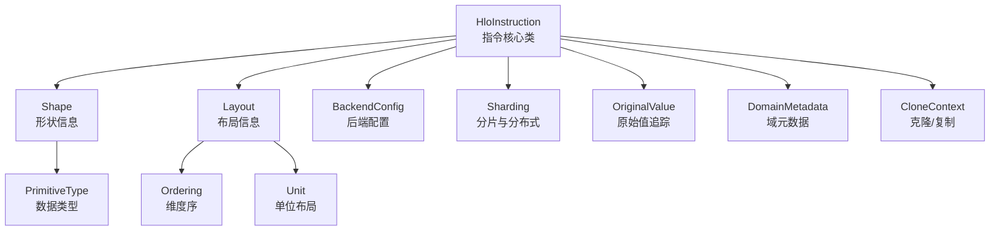
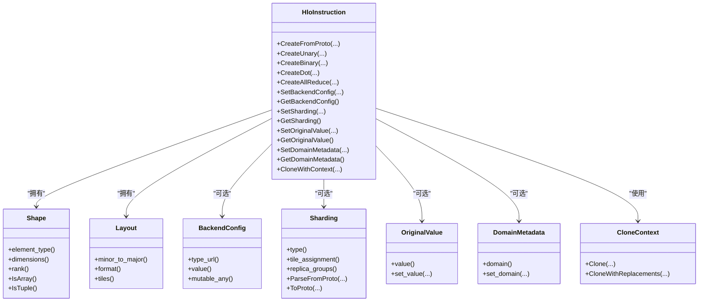
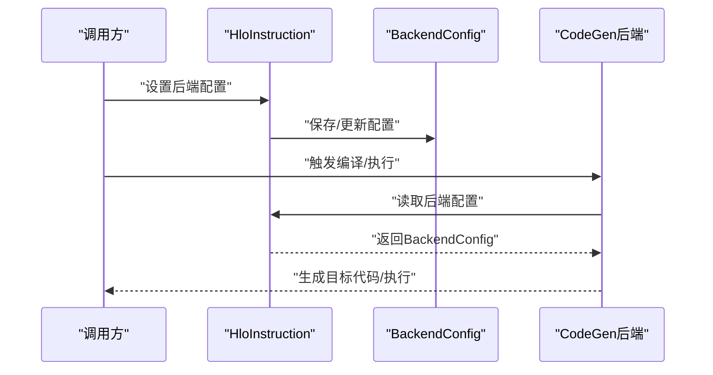
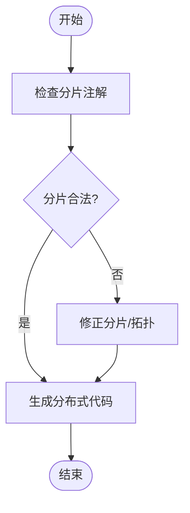
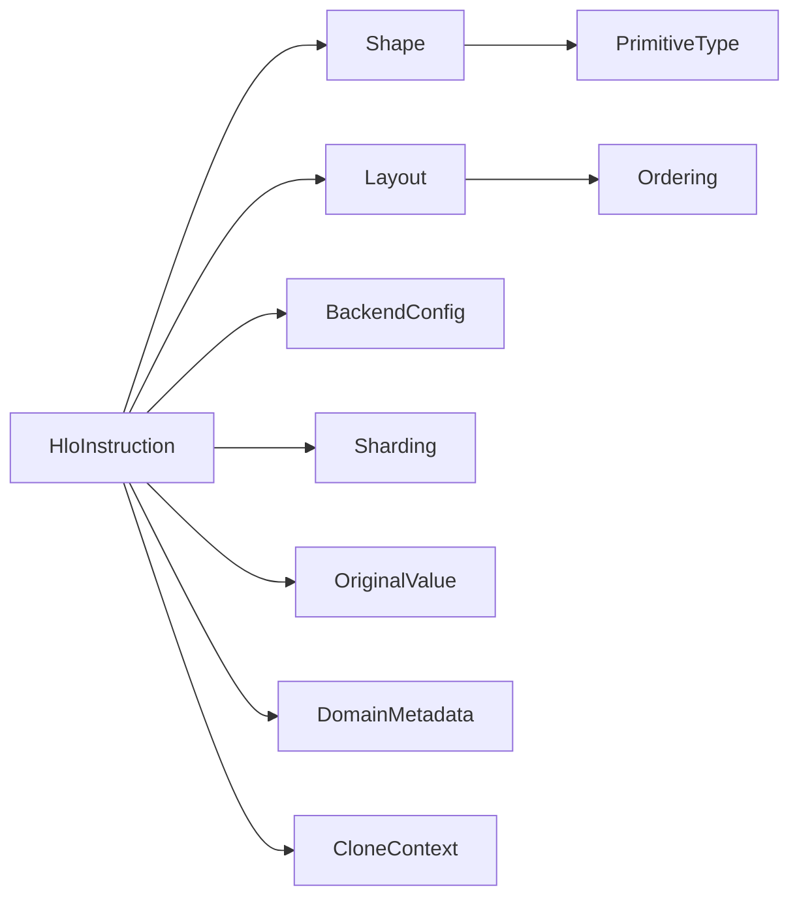

# 指令属性与元数据

<cite>
**本文引用的文件**
- [xla/hlo/ir/hlo_instruction.h](file://xla/hlo/ir/hlo_instruction.h)
- [xla/hlo/ir/backend_config.h](file://xla/hlo/ir/backend_config.h)
- [xla/hlo/ir/hlo_sharding.h](file://xla/hlo/ir/hlo_sharding.h)
- [xla/hlo/ir/hlo_original_value.h](file://xla/hlo/ir/hlo_original_value.h)
- [xla/hlo/ir/hlo_domain_metadata.h](file://xla/hlo/ir/hlo_domain_metadata.h)
- [xla/hlo/ir/hlo_clone_context.h](file://xla/hlo/ir/hlo_clone_context.h)
- [xla/shape.h](file://xla/shape.h)
- [xla/layout.h](file://xla/layout.h)
- [xla/xla_data.proto](file://xla/xla_data.proto)
- [xla/service/hlo.pb.h](file://xla/service/hlo.pb.h)
- [xla/hlo/transforms/verify.h](file://xla/hlo/transforms/verify.h)
</cite>

## 目录
1. [引言](#引言)
2. [项目结构](#项目结构)
3. [核心组件](#核心组件)
4. [架构总览](#架构总览)
5. [详细组件分析](#详细组件分析)
6. [依赖关系分析](#依赖关系分析)
7. [性能考量](#性能考量)
8. [故障排查指南](#故障排查指南)
9. [结论](#结论)
10. [附录](#附录)

## 引言
本技术文档聚焦于XLA高层优化语言（HLO）指令的属性与元数据体系，围绕HloInstruction类展开，系统阐述其核心属性（形状、数据类型、维度与布局）、后端配置（BackendConfig）机制、分片与分布式支持（Sharding）、原始值追踪与调试元数据、属性验证与约束检查，以及克隆/复制/深度拷贝实现。文档同时提供可定位到具体源码路径的示例，便于开发者在实际工程中访问与修改指令属性，并利用元数据进行调试与优化。

## 项目结构
与HLO指令属性与元数据直接相关的关键模块如下：
- HloInstruction定义与工厂方法：位于[xla/hlo/ir/hlo_instruction.h](file://xla/hlo/ir/hlo_instruction.h)
- 后端配置接口：位于[xla/hlo/ir/backend_config.h](file://xla/hlo/ir/backend_config.h)
- 分片与分布式语义：位于[xla/hlo/ir/hlo_sharding.h](file://xla/hlo/ir/hlo_sharding.h)
- 原始值追踪与调试元数据：位于[xla/hlo/ir/hlo_original_value.h](file://xla/hlo/ir/hlo_original_value.h)、[xla/hlo/ir/hlo_domain_metadata.h](file://xla/hlo/ir/hlo_domain_metadata.h)
- 克隆上下文与深拷贝：位于[xla/hlo/ir/hlo_clone_context.h](file://xla/hlo/ir/hlo_clone_context.h)
- 形状与布局模型：位于[xla/shape.h](file://xla/shape.h)、[xla/layout.h](file://xla/layout.h)
- 协议与序列化：位于[xla/xla_data.proto](file://xla/xla_data.proto)、[xla/service/hlo.pb.h](file://xla/service/hlo.pb.h)
- 属性验证与约束：位于[xla/hlo/transforms/verify.h](file://xla/hlo/transforms/verify.h)

图表来源
- [xla/hlo/ir/hlo_instruction.h](file://xla/hlo/ir/hlo_instruction.h#L225-L296)
- [xla/shape.h](file://xla/shape.h#L1-L200)
- [xla/layout.h](file://xla/layout.h#L1-L200)
- [xla/hlo/ir/backend_config.h](file://xla/hlo/ir/backend_config.h#L1-L200)
- [xla/hlo/ir/hlo_sharding.h](file://xla/hlo/ir/hlo_sharding.h#L1-L200)
- [xla/hlo/ir/hlo_original_value.h](file://xla/hlo/ir/hlo_original_value.h#L1-L200)
- [xla/hlo/ir/hlo_domain_metadata.h](file://xla/hlo/ir/hlo_domain_metadata.h#L1-L200)
- [xla/hlo/ir/hlo_clone_context.h](file://xla/hlo/ir/hlo_clone_context.h#L1-L200)

章节来源
- [xla/hlo/ir/hlo_instruction.h](file://xla/hlo/ir/hlo_instruction.h#L225-L296)
- [xla/shape.h](file://xla/shape.h#L1-L200)
- [xla/layout.h](file://xla/layout.h#L1-L200)

## 核心组件
本节从属性系统角度梳理HloInstruction的关键能力与职责边界：
- 形状与数据类型：通过Shape与PrimitiveType表达张量的维度规格与元素类型，决定内存占用与算子语义。
- 维度与布局：Layout描述维度顺序与内存布局，影响访存模式与向量化效率。
- 后端配置（BackendConfig）：承载平台特定参数，指导代码生成策略与内核选择。
- 分片与分布式：Sharding描述张量在设备网格上的分布，支撑多设备并行。
- 原始值与调试元数据：OriginalValue与DomainMetadata用于调试、可视化与溯源。
- 验证与约束：Transforms/verify提供属性一致性与合法性检查。
- 克隆与复制：CloneContext支持指令的克隆与深度拷贝，保留或重写元数据。

章节来源
- [xla/hlo/ir/hlo_instruction.h](file://xla/hlo/ir/hlo_instruction.h#L225-L296)
- [xla/hlo/ir/backend_config.h](file://xla/hlo/ir/backend_config.h#L1-L200)
- [xla/hlo/ir/hlo_sharding.h](file://xla/hlo/ir/hlo_sharding.h#L1-L200)
- [xla/hlo/ir/hlo_original_value.h](file://xla/hlo/ir/hlo_original_value.h#L1-L200)
- [xla/hlo/ir/hlo_domain_metadata.h](file://xla/hlo/ir/hlo_domain_metadata.h#L1-L200)
- [xla/hlo/transforms/verify.h](file://xla/hlo/transforms/verify.h#L1-L200)

## 架构总览
下图展示HloInstruction与其周边属性与元数据模块的交互关系：

图表来源
- [xla/hlo/ir/hlo_instruction.h](file://xla/hlo/ir/hlo_instruction.h#L225-L296)
- [xla/shape.h](file://xla/shape.h#L1-L200)
- [xla/layout.h](file://xla/layout.h#L1-L200)
- [xla/hlo/ir/backend_config.h](file://xla/hlo/ir/backend_config.h#L1-L200)
- [xla/hlo/ir/hlo_sharding.h](file://xla/hlo/ir/hlo_sharding.h#L1-L200)
- [xla/hlo/ir/hlo_original_value.h](file://xla/hlo/ir/hlo_original_value.h#L1-L200)
- [xla/hlo/ir/hlo_domain_metadata.h](file://xla/hlo/ir/hlo_domain_metadata.h#L1-L200)
- [xla/hlo/ir/hlo_clone_context.h](file://xla/hlo/ir/hlo_clone_context.h#L1-L200)

## 详细组件分析

### HloInstruction类与属性系统
- 职责边界：作为HLO IR的原子单元，承载运算符类型、输入输出依赖、形状与布局、后端配置、分片与调试元数据等。
- 工厂方法族：提供多种静态构造函数以创建不同类型的指令（如CreateUnary、CreateBinary、CreateDot、CreateAllReduce等），统一约束形状与精度配置。
- 运算符与融合：内置FusionKind枚举，区分loop/input/output/custom等融合策略，影响代码生成与性能。
- 生命周期管理：析构时自动断开与操作数及用户的连接，避免悬挂指针与环形依赖。

章节来源
- [xla/hlo/ir/hlo_instruction.h](file://xla/hlo/ir/hlo_instruction.h#L225-L296)
- [xla/hlo/ir/hlo_instruction.h](file://xla/hlo/ir/hlo_instruction.h#L301-L306)
- [xla/hlo/ir/hlo_instruction.h](file://xla/hlo/ir/hlo_instruction.h#L330-L409)

### 形状信息（Shape）
- 数据类型（PrimitiveType）：决定元素类型与算子语义，例如浮点、整型、布尔等。
- 维度规格：支持数组与元组形状，rank与各维大小共同决定内存与访存模式。
- 形状工具：配合shape_util与shape_pool进行形状推导、比较与池化复用，降低内存分配成本。

章节来源
- [xla/shape.h](file://xla/shape.h#L1-L200)
- [xla/xla_data.proto](file://xla/xla_data.proto#L1-L200)

### 维度与布局（Layout）
- 维度序（minor_to_major）：描述内存中从最低有效维到最高有效维的顺序，直接影响访存连续性与向量化。
- 布局格式：支持多种布局格式与tile组织，适配不同后端的内存模型。
- 与形状协作：Layout与Shape共同决定张量在内存中的映射与对齐要求。

章节来源
- [xla/layout.h](file://xla/layout.h#L1-L200)
- [xla/shape.h](file://xla/shape.h#L1-L200)

### 后端配置（BackendConfig）
- 作用：承载平台特定参数，指导后端选择与内核参数调优；常见于自定义调用、融合策略与加速器参数。
- 接口：BackendConfig以Any形式存储，支持按类型URL解析与序列化，便于跨后端传递。
- 应用流程：在指令创建后设置BackendConfig，在代码生成阶段由后端读取并应用。

图表来源
- [xla/hlo/ir/hlo_instruction.h](file://xla/hlo/ir/hlo_instruction.h#L225-L296)
- [xla/hlo/ir/backend_config.h](file://xla/hlo/ir/backend_config.h#L1-L200)

章节来源
- [xla/hlo/ir/backend_config.h](file://xla/hlo/ir/backend_config.h#L1-L200)
- [xla/hlo/ir/hlo_instruction.h](file://xla/hlo/ir/hlo_instruction.h#L225-L296)

### 分片与分布式（Sharding）
- 语义：描述张量在设备网格上的分布方式，支持平铺、重复、分区等策略。
- 表达：Sharding对象包含分片类型、设备分配与副本分组等字段，可序列化为协议缓冲区。
- 使用：在分布式训练场景中，Sharding与AllReduce/AllGather等通信指令协同工作，确保数据一致性与负载均衡。

图表来源
- [xla/hlo/ir/hlo_sharding.h](file://xla/hlo/ir/hlo_sharding.h#L1-L200)
- [xla/hlo/ir/hlo_instruction.h](file://xla/hlo/ir/hlo_instruction.h#L494-L577)

章节来源
- [xla/hlo/ir/hlo_sharding.h](file://xla/hlo/ir/hlo_sharding.h#L1-L200)
- [xla/hlo/ir/hlo_instruction.h](file://xla/hlo/ir/hlo_instruction.h#L494-L577)

### 原始值追踪与调试元数据
- OriginalValue：记录指令的“原始值”或输入快照，便于调试与回溯。
- DomainMetadata：附加域信息，帮助在多阶段变换中保持语义一致性与可追溯性。
- 用途：结合可视化工具与日志系统，快速定位问题与优化瓶颈。

章节来源
- [xla/hlo/ir/hlo_original_value.h](file://xla/hlo/ir/hlo_original_value.h#L1-L200)
- [xla/hlo/ir/hlo_domain_metadata.h](file://xla/hlo/ir/hlo_domain_metadata.h#L1-L200)

### 属性验证与约束检查
- Verify Pass：在变换链路中插入验证步骤，确保形状、布局、分片与后端配置满足后端约束。
- 约束类型：包括形状兼容性、布局一致性、分片覆盖完整性、后端配置有效性等。
- 错误处理：验证失败时返回明确状态，辅助定位问题根因。

章节来源
- [xla/hlo/transforms/verify.h](file://xla/hlo/transforms/verify.h#L1-L200)

### 克隆、复制与深度拷贝
- CloneContext：提供指令克隆与替换的能力，支持在变换过程中复制子图并重写节点。
- 深拷贝策略：在克隆时保留或重写元数据，确保新指令与原指令在语义上等价但可独立演化。
- 典型场景：融合、死代码消除后的重构、并行化变换等。

章节来源
- [xla/hlo/ir/hlo_clone_context.h](file://xla/hlo/ir/hlo_clone_context.h#L1-L200)
- [xla/hlo/ir/hlo_instruction.h](file://xla/hlo/ir/hlo_instruction.h#L225-L296)

## 依赖关系分析
- 内聚性：HloInstruction围绕单一职责（指令表示与操作）构建，内部聚合形状、布局、后端配置、分片与元数据。
- 耦合度：与Shape/Layout耦合用于表达张量属性；与BackendConfig耦合用于后端参数；与Sharding耦合用于分布式；与CloneContext耦合用于变换。
- 外部依赖：依赖协议缓冲区进行序列化；依赖Abseil状态与哈希库；与服务层的HLO协议头文件对接。

图表来源
- [xla/hlo/ir/hlo_instruction.h](file://xla/hlo/ir/hlo_instruction.h#L225-L296)
- [xla/shape.h](file://xla/shape.h#L1-L200)
- [xla/layout.h](file://xla/layout.h#L1-L200)
- [xla/hlo/ir/backend_config.h](file://xla/hlo/ir/backend_config.h#L1-L200)
- [xla/hlo/ir/hlo_sharding.h](file://xla/hlo/ir/hlo_sharding.h#L1-L200)
- [xla/hlo/ir/hlo_original_value.h](file://xla/hlo/ir/hlo_original_value.h#L1-L200)
- [xla/hlo/ir/hlo_domain_metadata.h](file://xla/hlo/ir/hlo_domain_metadata.h#L1-L200)
- [xla/hlo/ir/hlo_clone_context.h](file://xla/hlo/ir/hlo_clone_context.h#L1-L200)

## 性能考量
- 形状与布局：合理的Layout可提升缓存命中率与SIMD利用率；不匹配的布局可能导致额外的重排开销。
- 分片策略：合适的分片能平衡带宽与计算负载；不当的分片会引发通信瓶颈或内存碎片。
- 后端配置：精准的BackendConfig可启用最优内核与参数组合，减少运行时分支与降级。
- 验证前置：在变换早期进行验证，尽早发现不合法配置，避免无效编译与运行时错误。

## 故障排查指南
- 形状不匹配：检查CreateUnary/CreateBinary等构造函数的形状参数是否一致，参考工厂方法签名与形状工具。
- 布局异常：确认Layout的minor_to_major与数据类型一致，必要时进行布局规范化。
- 分片不一致：核对Sharding的设备分配与replica_groups，确保覆盖完整且无越界。
- 后端配置错误：检查BackendConfig的type_url与value是否与后端期望一致，避免序列化/反序列化问题。
- 元数据缺失：在调试阶段启用OriginalValue与DomainMetadata，以便回溯与定位。

章节来源
- [xla/hlo/ir/hlo_instruction.h](file://xla/hlo/ir/hlo_instruction.h#L330-L409)
- [xla/hlo/ir/backend_config.h](file://xla/hlo/ir/backend_config.h#L1-L200)
- [xla/hlo/ir/hlo_sharding.h](file://xla/hlo/ir/hlo_sharding.h#L1-L200)
- [xla/hlo/ir/hlo_original_value.h](file://xla/hlo/ir/hlo_original_value.h#L1-L200)
- [xla/hlo/ir/hlo_domain_metadata.h](file://xla/hlo/ir/hlo_domain_metadata.h#L1-L200)

## 结论
HloInstruction通过严谨的属性系统与丰富的元数据机制，为XLA的多后端、多设备执行提供了坚实基础。理解形状、布局、后端配置、分片与调试元数据之间的关系，有助于在复杂变换链路中保持正确性与高性能。建议在开发中遵循验证先行、元数据完备、配置显式的原则，结合克隆与复制能力进行安全的变换与优化。

## 附录
- 示例路径指引（不展示具体代码，仅提供定位）：
  - 创建二元算子并设置形状与精度：[示例路径](file://xla/hlo/ir/hlo_instruction.h#L389-L394)
  - 设置后端配置：[示例路径](file://xla/hlo/ir/hlo_instruction.h#L225-L296)
  - 设置分片：[示例路径](file://xla/hlo/ir/hlo_sharding.h#L1-L200)
  - 访问原始值与域元数据：[示例路径](file://xla/hlo/ir/hlo_original_value.h#L1-L200)、[示例路径](file://xla/hlo/ir/hlo_domain_metadata.h#L1-L200)
  - 执行验证与约束检查：[示例路径](file://xla/hlo/transforms/verify.h#L1-L200)
  - 克隆与深度拷贝：[示例路径](file://xla/hlo/ir/hlo_clone_context.h#L1-L200)