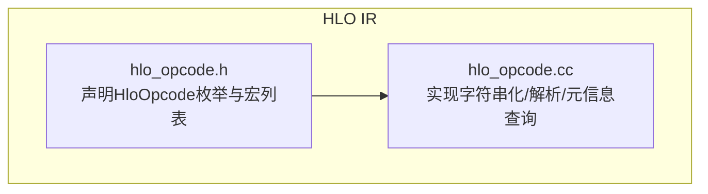
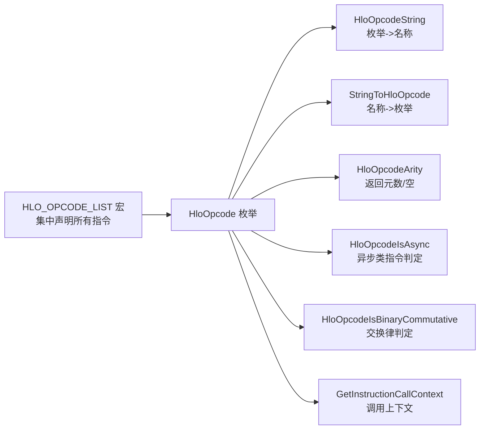

# 指令类型与分类

<cite>
**本文引用的文件**
- [xla/hlo/ir/hlo_opcode.h](file://xla/hlo/ir/hlo_opcode.h)
- [xla/hlo/ir/hlo_opcode.cc](file://xla/hlo/ir/hlo_opcode.cc)
</cite>

## 目录
1. [引言](#引言)
2. [项目结构](#项目结构)
3. [核心组件](#核心组件)
4. [架构总览](#架构总览)
5. [详细组件分析](#详细组件分析)
6. [依赖关系分析](#依赖关系分析)
7. [性能考量](#性能考量)
8. [故障排查指南](#故障排查指南)
9. [结论](#结论)
10. [附录](#附录)

## 引言
本文件系统性梳理 XLA 中 HLO（High-Level Optimizer）指令的类型与分类，围绕以下维度展开：指令分类体系、语义与参数要求、操作码枚举与 HloOpcode 类型映射、属性标志与特殊标记、形状推导与类型约束、以及创建与使用示例的定位指引。内容严格基于仓库中 HLO 操作码的定义与工具函数，确保技术细节可追溯到源码文件。

## 项目结构
本专题聚焦于 HLO 指令的“操作码”与“调用上下文”层面的定义与查询接口，核心位于 HLO IR 子模块：
- 操作码枚举与名称映射：在头文件中以宏列表形式声明所有 HLO 操作码，并在对应实现文件中提供字符串化、名称解析、元信息查询等工具函数。
- 调用上下文：根据指令类型判断其在调用图中的上下文（嵌入式或控制流），用于后续编译与执行规划。

图表来源
- [xla/hlo/ir/hlo_opcode.h](file://xla/hlo/ir/hlo_opcode.h#L48-L182)
- [xla/hlo/ir/hlo_opcode.cc](file://xla/hlo/ir/hlo_opcode.cc#L30-L64)

章节来源
- [xla/hlo/ir/hlo_opcode.h](file://xla/hlo/ir/hlo_opcode.h#L1-L275)
- [xla/hlo/ir/hlo_opcode.cc](file://xla/hlo/ir/hlo_opcode.cc#L1-L111)

## 核心组件
- HloOpcode 枚举：集中定义了所有 HLO 指令的操作码，覆盖算术、逻辑、比较、控制流、数据移动、聚合、通信等类别。
- 元信息工具函数：
  - HloOpcodeString：将枚举转换为人类可读的字符串名称。
  - StringToHloOpcode：将字符串名称解析为枚举。
  - HloOpcodeArity：返回固定元数；对变参指令返回空值。
  - HloOpcodeIsAsync/HloOpcodeIsBinaryCommutative：提供指令属性快速判定。
  - GetInstructionCallContext：根据指令类型返回调用上下文（嵌入式/控制流/两者皆可/未确定）。

章节来源
- [xla/hlo/ir/hlo_opcode.h](file://xla/hlo/ir/hlo_opcode.h#L186-L246)
- [xla/hlo/ir/hlo_opcode.cc](file://xla/hlo/ir/hlo_opcode.cc#L30-L109)

## 架构总览
下图展示了 HLO 操作码的组织方式与查询流程：通过宏列表统一声明，头文件提供枚举与工具函数原型，实现文件提供具体逻辑与映射表。

图表来源
- [xla/hlo/ir/hlo_opcode.h](file://xla/hlo/ir/hlo_opcode.h#L48-L182)
- [xla/hlo/ir/hlo_opcode.cc](file://xla/hlo/ir/hlo_opcode.cc#L30-L109)

## 详细组件分析

### 分类体系与语义概览
HLO 指令按功能分为以下主要类别（依据操作码清单与常见用途归纳）：
- 算术运算：如加法、减法、乘法、除法、取余、幂、指数、对数、平方根、双曲函数、三角函数、复数实部/虚部、符号、取整、舍入等。
- 逻辑运算：按位与、或、异或、非。
- 比较与选择：比较、选择（三元条件）。
- 控制流：While 循环、Conditional 条件分支、Call 调用、Tuple 元组构造、GetTupleElement 元素提取、AfterAll 合流等。
- 数据移动：Reshape 重排、Transpose 转置、Slice 切片、DynamicSlice 动态切片、DynamicUpdateSlice 动态更新、Reverse 反转、Concatenate 连接、Pad 填充、Bitcast/BitcastConvert 视图转换、Broadcast 广播、DynamicReshape 动态重排、Copy/CopyStart/CopyDone 复制流水线、SetDimensionSize 设置维度大小、GetDimensionSize 获取维度大小等。
- 聚合与扫描：Reduce 归约、ReduceWindow 窗口归约、Scan 扫描、SelectAndScatter 选择并扫描、TopK 排名前 K、Sort 排序、AllToAll、RaggedAllToAll、RaggedDot、ScaledDot 等。
- 通信与并行：AllReduce、AllGather、AllGatherStart/AllGatherDone、AllReduceStart/AllReduceDone、ReduceScatter、CollectiveBroadcast、CollectivePermute/CollectivePermuteStart/CollectivePermuteDone、AsyncStart/AsyncUpdate/AsyncDone、Send/Recv/SendDone/RecvDone、Rng/RngBitGenerator/RngGetAndUpdateState 随机数生成、Domain 域约束、OptimizationBarrier 优化屏障、Iota、PartitionId、ReplicaId、Parameter 参数、Constant 常量、Map、Fusion 融合、CustomCall 自定义调用、BatchNorm 训练/推理/梯度、Convolution 卷积、Dot 矩阵乘、Fft 傅里叶变换、Cholesky、TriangularSolve、Clamp、Complex、Imag、Real、Negate、Sign、Ceil、Floor、RoundNearest*、Rsqrt、Cbrt、Exp、Expm1、Log、Log1p、Logistic、Sin、Sinh、Cos、Cosh、Tan、Atan2、Asin、Asinh、Acos、Acosh、Atanh、IsFinite、Power、Remainder、Clz/PopulationCount、BitcastConvert、StochasticConvert、Domain、OptimizationBarrier、Iota、PartitionId、ReplicaId、Parameter、Constant、Map、Fusion、CustomCall、BatchNorm、Convolution、Dot、Fft、Cholesky、TriangularSolve、Clamp、Complex、Imag、Real、Negate、Sign、Ceil、Floor、RoundNearest*、Rsqrt、Cbrt、Exp、Expm1、Log、Log1p、Logistic、Sin、Sinh、Cos、Cosh、Tan、Atan2、Asin、Asinh、Acos、Acosh、Atanh、IsFinite、Power、Remainder、Clz、PopulationCount、BitcastConvert、StochasticConvert、Domain、OptimizationBarrier、Iota、PartitionId、ReplicaId、Parameter、Constant、Map、Fusion、CustomCall、BatchNorm、Convolution、Dot、Fft、Cholesky、TriangularSolve、Clamp、Complex、Imag、Real、Negate、Sign、Ceil、Floor、RoundNearest*、Rsqrt、Cbrt、Exp、Expm1、Log、Log1p、Logistic、Sin、Sinh、Cos、Cosh、Tan、Atan2、Asin、Asinh、Acos、Acosh、Atanh、IsFinite、Power、Remainder、Clz、PopulationCount、BitcastConvert、StochasticConvert、Domain、OptimizationBarrier、Iota、PartitionId、ReplicaId、Parameter、Constant、Map、Fusion、CustomCall、BatchNorm、Convolution、Dot、Fft、Cholesky、TriangularSolve、Clamp、Complex、Imag、Real、Negate、Sign、Ceil、Floor、RoundNearest*、Rsqrt、Cbrt、Exp、Expm1、Log、Log1p、Logistic、Sin、Sinh、Cos、Cosh、Tan、Atan2、Asin、Asinh、Acos、Acosh、Atanh、IsFinite、Power、Remainder、Clz、PopulationCount、BitcastConvert、StochasticConvert、Domain、OptimizationBarrier、Iota、PartitionId、ReplicaId、Parameter、Constant、Map、Fusion、CustomCall、BatchNorm、Convolution、Dot、Fft、Cholesky、TriangularSolve、Clamp、Complex、Imag、Real、Negate、Sign、Ceil、Floor、RoundNearest*、Rsqrt、Cbrt、Exp、Expm1、Log、Log1p、Logistic、Sin、Sinh、Cos、Cosh、Tan、Atan2、Asin、Asinh、Acos、Acosh、Atanh、IsFinite、Power、Remainder、Clz、PopulationCount、BitcastConvert、StochasticConvert、Domain、OptimizationBarrier、Iota、PartitionId、ReplicaId、Parameter、Constant、Map、Fusion、CustomCall、BatchNorm、Convolution、Dot、Fft、Cholesky、TriangularSolve、Clamp、Complex、Imag、Real、Negate、Sign、Ceil、Floor、RoundNearest*、Rsqrt、Cbrt、Exp、Expm1、Log、Log1p、Logistic、Sin、Sinh、Cos、Cosh、Tan、Atan2、Asin、Asinh、Acos、Acosh、Atanh、IsFinite、Power、Remainder、Clz、PopulationCount、BitcastConvert、StochasticConvert、Domain、OptimizationBarrier、Iota、PartitionId、ReplicaId、Parameter、Constant、Map、Fusion、CustomCall、BatchNorm、Convolution、Dot、Fft、Cholesky、TriangularSolve、Clamp、Complex、Imag、Real、Negate、Sign、Ceil、Floor、RoundNearest*、Rsqrt、Cbrt、Exp、Expm1、Log、Log1p、Logistic、Sin、Sinh、Cos、Cosh、Tan、Atan2、Asin、Asinh、Acos、Acosh、Atanh、IsFinite、Power、Remainder、Clz、PopulationCount、BitcastConvert、StochasticConvert、Domain、OptimizationBarrier、Iota、PartitionId、ReplicaId、Parameter、Constant、Map、Fusion、CustomCall、BatchNorm、Convolution、Dot、Fft、Cholesky、TriangularSolve、Clamp、Complex、Imag、Real、Negate、Sign、Ceil、Floor、RoundNearest*、Rsqrt、Cbrt、Exp、Expm1、Log、Log1p......
- 通信与并行：AllReduce、AllGather、AllGatherStart/AllGatherDone、AllReduceStart/AllReduceDone、ReduceScatter、CollectiveBroadcast、CollectivePermute/CollectivePermuteStart/CollectivePermuteDone、AsyncStart/AsyncUpdate/AsyncDone、Send/Recv/SendDone/RecvDone、Rng/RngBitGenerator/RngGetAndUpdateState 随机数生成、Domain 域约束、OptimizationBarrier 优化屏障、Iota、PartitionId、ReplicaId、Parameter 参数、Constant 常量、Map、Fusion 融合、CustomCall 自定义调用、BatchNorm 训练/推理/梯度、Convolution 卷积、Dot 矩阵乘、Fft 傅里叶变换、Cholesky、TriangularSolve、Clamp、Complex、Imag、Real、Negate、Sign、Ceil、Floor、RoundNearest*、Rsqrt、Cbrt、Exp、Expm1、Log、Log1p、Logistic、Sin、Sinh、Cos、Cosh、Tan、Atan2、Asin、Asinh、Acos、Acosh、Atanh、IsFinite、Power、Remainder、Clz、PopulationCount、BitcastConvert、StochasticConvert、Domain、OptimizationBarrier、Iota、PartitionId、ReplicaId、Parameter、Constant、Map、Fusion、CustomCall、BatchNorm、Convolution、Dot、Fft、Cholesky、TriangularSolve、Clamp、Complex、Imag、Real、Negate、Sign、Ceil、Floor、RoundNearest*、Rsqrt、Cbrt、Exp、Expm1、Log、Log1p、Logistic、Sin、Sinh、Cos、Cosh、Tan、Atan2、Asin、Asinh、Acos、Acosh、Atanh、IsFinite、Power、Remainder、Clz、PopulationCount、BitcastConvert、StochasticConvert、Domain、OptimizationBarrier、Iota、PartitionId、ReplicaId、Parameter、Constant、Map、Fusion、CustomCall、BatchNorm、Convolution、Dot、Fft、Cholesky、TriangularSolve、Clamp、Complex、Imag、Real、Negate、Sign、Ceil、Floor、RoundNearest*、Rsqrt、Cbrt、Exp、Expm1、Log、Log1p、Logistic、Sin、Sinh、Cos、Cosh、Tan、Atan2、Asin、Asinh、Acos、Acosh、Atanh、IsFinite、Power、Remainder、Clz、PopulationCount、BitcastConvert、StochasticConvert、Domain、OptimizationBarrier、Iota、PartitionId、ReplicaId、Parameter、Constant、Map、Fusion、CustomCall、BatchNorm、Convolution、Dot、Fft、Cholesky、TriangularSolve、Clamp、Complex、Imag、Real、Negate、Sign、Ceil、Floor、RoundNearest*、Rsqrt、Cbrt、Exp、Expm1、Log、Log1p、Logistic、Sin、Sinh、Cos、Cosh、Tan、Atan2、Asin、Asinh、Acos、Acosh、Atanh、IsFinite、Power、Remainder、Clz、PopulationCount、BitcastConvert、StochasticConvert、Domain、OptimizationBarrier、Iota、PartitionId、ReplicaId、Parameter、Constant、Map、Fusion、CustomCall、BatchNorm、Convolution、Dot、Fft、Cholesky、TriangularSolve、Clamp、Complex、Imag、Real、Negate、Sign、Ceil、Floor、RoundNearest*、Rsqrt、Cbrt、Exp、Expm1、Log、Log1p、Logistic、Sin、Sinh、Cos、Cosh、Tan、Atan2、Asin、Asinh、Acos、Acosh、Atanh、IsFinite、Power、Remainder、Clz、PopulationCount、BitcastConvert、StochasticConvert、Domain、OptimizationBarrier、Iota、PartitionId、ReplicaId、Parameter、Constant、Map、Fusion、CustomCall、BatchNorm、Convolution、Dot、Fft、Cholesky、TriangularSolve、Clamp、Complex、Imag、Real、Negate、Sign、Ceil、Floor、RoundNearest*、Rsqrt、Cbrt、Exp、Expm1、Log、Log1p、Logistic、Sin、Sinh、Cos、Cosh、Tan、Atan2、Asin、Asinh、Acos、Acosh、Atanh、IsFinite、Power、Remainder、Clz、PopulationCount、BitcastConvert、StochasticConvert、Domain、OptimizationBarrier、Iota、PartitionId、ReplicaId、Parameter、Constant、Map、Fusion、CustomCall、BatchNorm、Convolution、Dot、Fft、Cholesky、TriangularSolve、Clamp、Complex、Imag、Real、Negate、Sign、Ceil、Floor、RoundNearest*、Rsqrt、Cbrt、Exp、Expm1、Log、Log1p、Logistic、Sin、Sinh、Cos、Cosh、Tan、Atan2、Asin、Asinh、Acos、Acosh、Atanh、IsFinite、Power、Remainder、Clz、PopulationCount、......
- 其他：Infeed/Outfeed、Domain、OptimizationBarrier、Iota、PartitionId、ReplicaId、Parameter、Constant、Map、Fusion、CustomCall、BatchNorm、Convolution、Dot、Fft、Cholesky、TriangularSolve、Clamp、Complex、Imag、Real、Negate、Sign、Ceil、Floor、RoundNearest*、Rsqrt、Cbrt、Exp、Expm1、Log、Log1p、Logistic、Sin、Sinh、Cos、Cosh、Tan、Atan2、Asin、Asinh、Acos、Acosh、Atanh、IsFinite、Power、Remainder、Clz、PopulationCount、BitcastConvert、StochasticConvert、Domain、OptimizationBarrier、Iota、PartitionId、ReplicaId、Parameter、Constant、Map、Fusion、CustomCall、BatchNorm、Convolution、Dot、Fft、Cholesky、TriangularSolve、Clamp、Complex、Imag、Real、Negate、Sign、Ceil、Floor、RoundNearest*、Rsqrt、Cbrt、Exp、Expm1、Log、Log1p、Logistic、Sin、Sinh、Cos、Cosh、Tan、Atan2、Asin、Asinh、Acos、Acosh、Atanh、IsFinite、Power、Remainder、Clz、PopulationCount、BitcastConvert、StochasticConvert、Domain、OptimizationBarrier、Iota、PartitionId、ReplicaId、Parameter、Constant、Map、Fusion、CustomCall、BatchNorm、Convolution、Dot、Fft、Cholesky、TriangularSolve、Clamp、Complex、Imag、Real、Negate、Sign、Ceil、Floor、RoundNearest*、Rsqrt、Cbrt、Exp、Expm1、Log、Log1p、Logistic、Sin、Sinh、Cos、Cosh、Tan、Atan2、Asin、Asinh、Acos、Acosh、Atanh、IsFinite、Power、Remainder、Clz、PopulationCount、BitcastConvert、StochasticConvert、Domain、OptimizationBarrier、Iota、PartitionId、ReplicaId、Parameter、Constant、Map、Fusion、CustomCall、BatchNorm、Convolution、Dot、Fft、Cholesky、TriangularSolve、Clamp、Complex、Imag、Real、Negate、Sign、Ceil、Floor、RoundNearest*、Rsqrt、Cbrt、Exp、Expm1、Log、Log1p、Logistic、Sin、Sinh、Cos、Cosh、Tan、Atan2、Asin、Asinh、Acos、Acosh、Atanh、IsFinite、Power、Remainder、Clz、PopulationCount、BitcastConvert、StochasticConvert、Domain、OptimizationBarrier、Iota、PartitionId、ReplicaId、Parameter、Constant、Map、Fusion、CustomCall、BatchNorm、Convolution、Dot、Fft、Cholesky、TriangularSolve、Clamp、Complex、Imag、Real、Negate、Sign、Ceil、Floor、RoundNearest*、Rsqrt、Cbrt、Exp、Expm1、Log、Log1p、Logistic、Sin、Sinh、Cos、Cosh、Tan、Atan2、Asin、Asinh、Acos、Acosh、Atanh、IsFinite、Power、Remainder、Clz、PopulationCount、BitcastConvert、StochasticConvert、Domain、OptimizationBarrier、Iota、PartitionId、ReplicaId、Parameter、Constant、Map、Fusion、CustomCall、BatchNorm、Convolution、Dot、Fft、Cholesky、TriangularSolve、Clamp、Complex、Imag、Real、Negate、Sign、Ceil、Floor、RoundNearest*、Rsqrt、Cbrt、Exp、Expm1、Log、Log1p、Logistic、Sin、Sinh、Cos、Cosh、Tan、Atan2、Asin、Asinh、Acos、Acosh、Atanh、IsFinite、Power、Remainder、Clz、PopulationCount、BitcastConvert、StochasticConvert、Domain、OptimizationBarrier、Iota、PartitionId、ReplicaId、Parameter、Constant、Map、Fusion、CustomCall、BatchNorm、Convolution、Dot、Fft、Cholesky、TriangularSolve、Clamp、Complex、Imag、Real、Negate、Sign、Ceil、Floor、RoundNearest*、Rsqrt、Cbrt、Exp、Expm1、Log、Log1p、Logistic、Sin、Sinh、Cos、......