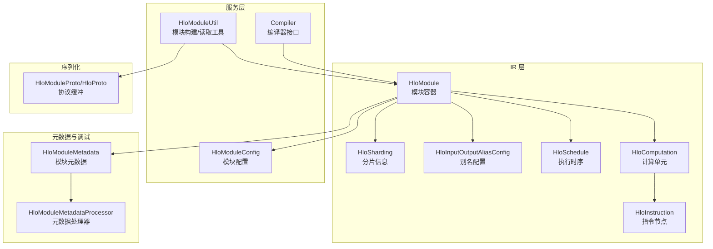
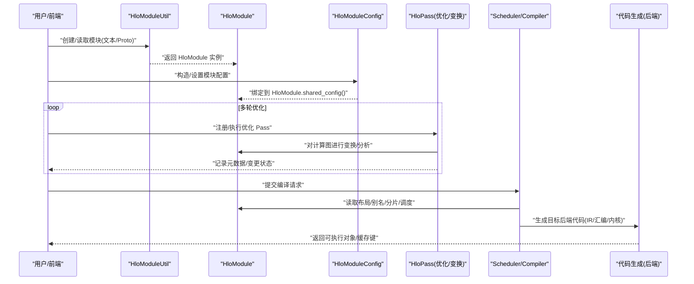
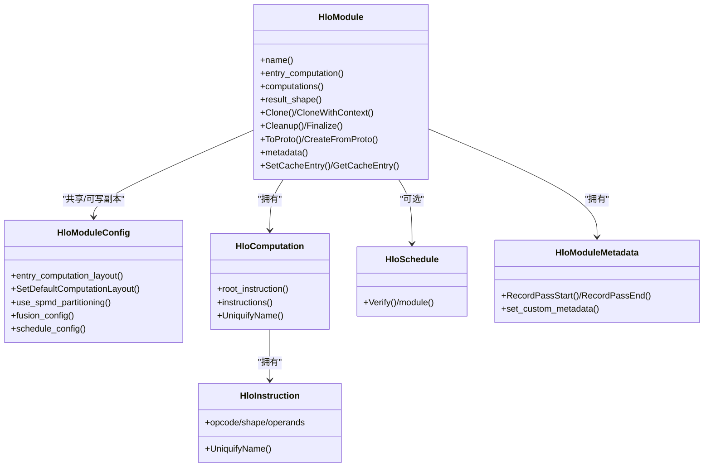
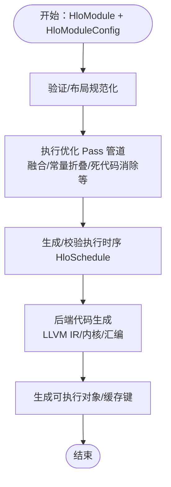
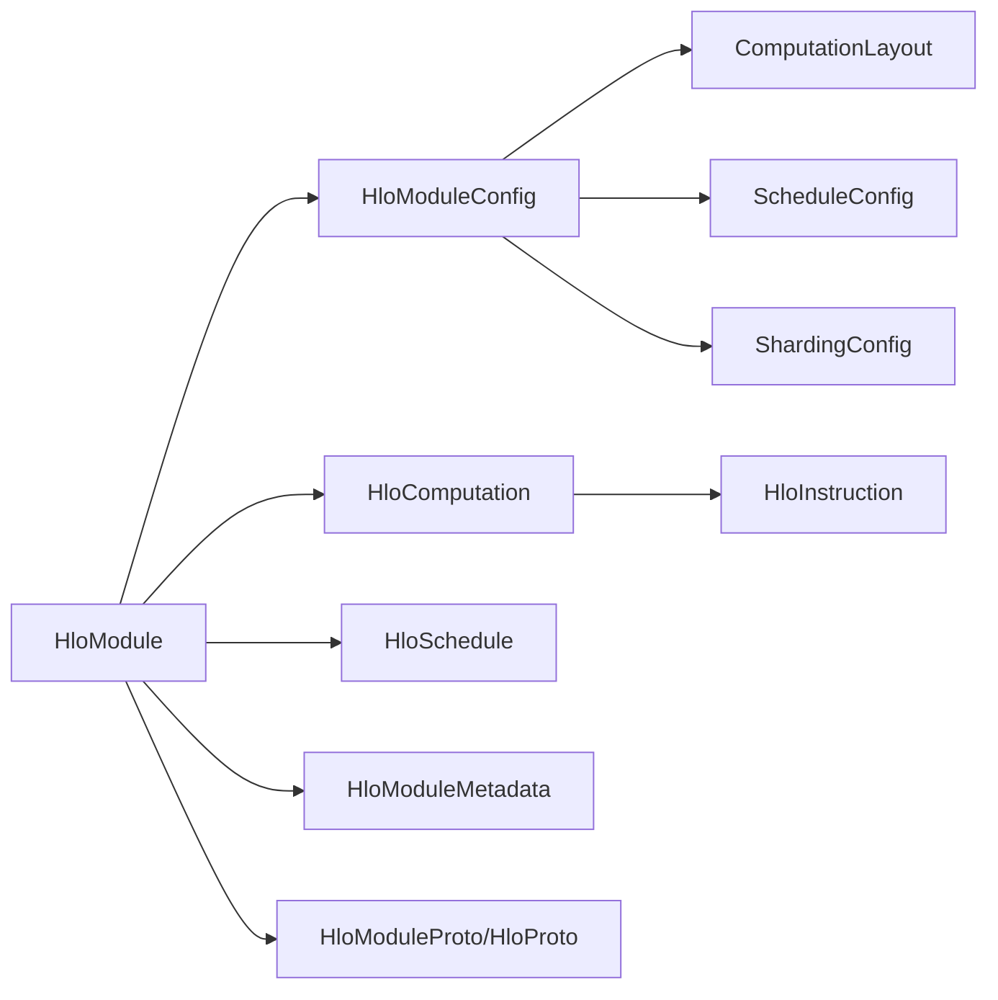

# 模块管理

<cite>
**本文引用的文件**   
- [xla\hlo\ir\hlo_module.h](file://xla\hlo\ir\hlo_module.h)
- [xla\hlo\ir\hlo_module.cc](file://xla\hlo\ir\hlo_module.cc)
- [xla\hlo\ir\hlo_module_metadata.h](file://xla\hlo\ir\hlo_module_metadata.h)
- [xla\service\hlo_module_config.h](file://xla\service\hlo_module_config.h)
- [xla\service\hlo_module_util.h](file://xla\service\hlo_module_util.h)
- [xla\hlo\ir\hlo_computation.h](file://xla\hlo\ir\hlo_computation.h)
- [xla\hlo\ir\hlo_instruction.h](file://xla\hlo\ir\hlo_instruction.h)
- [xla\hlo\ir\hlo_schedule.h](file://xla\hlo\ir\hlo_schedule.h)
- [xla\hlo\ir\hlo_input_output_alias_config.h](file://xla\hlo\ir\hlo_input_output_alias_config.h)
- [xla\hlo\ir\hlo_sharding.h](file://xla\hlo\ir\hlo_sharding.h)
- [xla\service\hlo.pb.h](file://xla\service\hlo.pb.h)
- [xla\xla.pb.h](file://xla\xla.pb.h)
- [xla\service\compiler.h](file://xla\service\compiler.h)
- [xla\hlo\parser\hlo_parser.h](file://xla\hlo\parser\hlo_parser.h)
- [xla\service\hlo_module_dce.h](file://xla\service\hlo_module_dce.h)
- [xla\hlo\pass\hlo_pass_interface.h](file://xla\hlo\pass\hlo_pass_interface.h)
- [xla\service\hlo_module_dce.cc](file://xla\service\hlo_module_dce.cc)
- [xla\service\hlo_module_test.cc](file://xla\service\hlo_module_test.cc)
- [xla\service\hlo_module_config.cc](file://xla\service\hlo_module_config.cc)
- [xla\service\hlo_module_config_test.cc](file://xla\service\hlo_module_config_test.cc)
- [xla\service\hlo_module_util.cc](file://xla\service\hlo_module_util.cc)
- [xla\hlo\ir\hlo_module_test.cc](file://xla\hlo\ir\hlo_module_test.cc)
- [xla\hlo\ir\hlo_module_metadata.cc](file://xla\hlo\ir\hlo_module_metadata.cc)
- [xla\hlo\tools\hlo_module_metadata_processor.cc](file://xla\hlo\tools\hlo_module_metadata_processor.cc)
- [xla\service\compiled_module.h](file://xla\service\compiled_module.h)
- [xla\service\gpu\compile_module_to_llvm_ir.h](file://xla\service\gpu\compile_module_to_llvm_ir.h)
- [xla\service\gpu\llvm_gpu_backend\load_ir_module.h](file://xla\service\gpu\llvm_gpu_backend\load_ir_module.h)
- [xla\tools\hlo_module_loader.h](file://xla\tools\hlo_module_loader.h)
</cite>

## 目录
1. [简介](#简介)
2. [项目结构](#项目结构)
3. [核心组件](#核心组件)
4. [架构总览](#架构总览)
5. [详细组件分析](#详细组件分析)
6. [依赖关系分析](#依赖关系分析)
7. [性能考量](#性能考量)
8. [故障排查指南](#故障排查指南)
9. [结论](#结论)
10. [附录：使用示例与最佳实践](#附录使用示例与最佳实践)

## 简介
本文件面向“HLO模块管理”的技术文档，围绕 HloModule 类的设计与实现，系统阐述其在 XLA 编译流水线中的角色：模块生命周期管理、计算图集合与元数据处理、编译流程与优化管道、代码生成、序列化与反序列化、模块级优化策略与变换规则、调试与性能分析、版本与兼容性处理，并提供可直接定位到源码的参考路径，帮助读者快速上手与深度理解。

## 项目结构
与 HLO 模块管理直接相关的代码主要分布在以下子系统：
- HLO IR 层：HloModule、HloComputation、HloInstruction、HloSchedule、HloSharding、HloInputOutputAliasConfig 等
- 服务层（编译与配置）：HloModuleConfig、Compiler 接口、HloModuleUtil 工具集
- 元数据与调试：HloModuleMetadata、HloModuleMetadataProcessor
- 序列化与导入导出：HloModuleProto 及相关导入/导出工具
- 优化与变换：HloPassInterface 及具体 Pass（如 HloModuleDCE）

图表来源
- [xla\hlo\ir\hlo_module.h](file://xla\hlo\ir\hlo_module.h#L94-L1166)
- [xla\hlo\ir\hlo_computation.h](file://xla\hlo\ir\hlo_computation.h#L65-L966)
- [xla\hlo\ir\hlo_instruction.h](file://xla\hlo\ir\hlo_instruction.h#L80-L120)
- [xla\hlo\ir\hlo_schedule.h](file://xla\hlo\ir\hlo_schedule.h#L38-L80)
- [xla\hlo\ir\hlo_input_output_alias_config.h](file://xla\hlo\ir\hlo_input_output_alias_config.h#L37-L80)
- [xla\hlo\ir\hlo_sharding.h](file://xla\hlo\ir\hlo_sharding.h#L1-L120)
- [xla\service\hlo_module_config.h](file://xla\service\hlo_module_config.h#L57-L646)
- [xla\service\hlo_module_util.h](file://xla\service\hlo_module_util.h#L35-L114)
- [xla\service\compiler.h](file://xla\service\compiler.h#L1-L200)
- [xla\hlo\ir\hlo_module_metadata.h](file://xla\hlo\ir\hlo_module_metadata.h#L96-L232)
- [xla\hlo\tools\hlo_module_metadata_processor.cc](file://xla\hlo\tools\hlo_module_metadata_processor.cc#L1-L200)

章节来源
- [xla\hlo\ir\hlo_module.h](file://xla\hlo\ir\hlo_module.h#L94-L1166)
- [xla\service\hlo_module_config.h](file://xla\service\hlo_module_config.h#L57-L646)
- [xla\service\hlo_module_util.h](file://xla\service\hlo_module_util.h#L35-L114)

## 核心组件
- HloModule：HLO IR 的顶层容器，承载入口计算、嵌入式计算、布局、别名、分片、调度、元数据、缓存等。支持克隆、拓扑排序、清理、序列化/反序列化、SPMD 分区参数与输出分片、跨程序预取等。
- HloModuleConfig：模块级编译配置，包含输入输出布局、并行度、SPMD/MPSD 开关、融合配置、阶段顺序、FDO 配置、设备分配、优化等级、内存拟合等级等。
- HloModuleMetadata：模块级调试与性能分析元数据，记录运行中 Pass 的开始/结束、时间戳、模块组信息、自定义指标、堆栈帧映射等。
- HloModuleUtil：从文本/二进制/文本 Proto、字符串等来源创建 HloModule 的工具集；提供布局更新、解析选项等辅助能力。
- HloComputation/HloInstruction：模块内的计算单元与指令节点，构成有向无环图（DAG），通过 HloModule 维护全局拓扑与名称唯一性。
- HloSchedule：模块级执行时序，描述非融合计算的指令顺序。
- HloInputOutputAliasConfig/HloSharding：输入输出别名与分片配置，支撑内存复用与模型并行。

章节来源
- [xla\hlo\ir\hlo_module.h](file://xla\hlo\ir\hlo_module.h#L94-L1166)
- [xla\service\hlo_module_config.h](file://xla\service\hlo_module_config.h#L57-L646)
- [xla\hlo\ir\hlo_module_metadata.h](file://xla\hlo\ir\hlo_module_metadata.h#L96-L232)
- [xla\service\hlo_module_util.h](file://xla\service\hlo_module_util.h#L35-L114)
- [xla\hlo\ir\hlo_computation.h](file://xla\hlo\ir\hlo_computation.h#L65-L966)
- [xla\hlo\ir\hlo_instruction.h](file://xla\hlo\ir\hlo_instruction.h#L80-L120)
- [xla\hlo\ir\hlo_schedule.h](file://xla\hlo\ir\hlo_schedule.h#L38-L80)
- [xla\hlo\ir\hlo_input_output_alias_config.h](file://xla\hlo\ir\hlo_input_output_alias_config.h#L37-L80)
- [xla\hlo\ir\hlo_sharding.h](file://xla\hlo\ir\hlo_sharding.h#L1-L120)

## 架构总览
下图展示了 HloModule 在编译流水线中的关键交互：从模块创建、配置注入、优化 Pass 执行、到最终代码生成与缓存。

图表来源
- [xla\service\hlo_module_util.h](file://xla\service\hlo_module_util.h#L35-L114)
- [xla\hlo\ir\hlo_module.h](file://xla\hlo\ir\hlo_module.h#L94-L1166)
- [xla\service\hlo_module_config.h](file://xla\service\hlo_module_config.h#L57-L646)
- [xla\service\compiler.h](file://xla\service\compiler.h#L1-L200)

## 详细组件分析

### HloModule 设计与生命周期
- 容器职责：持有入口计算与嵌入式计算，维护拓扑排序、名称唯一性、随机数种子、唯一模块 ID、元数据、缓存、跨程序预取、SPMD 参数/输出分片、别名与捐赠者配置、执行时序等。
- 生命周期：
  - 构造：支持传入独立或共享的 HloModuleConfig；初始化元数据与编译环境。
  - 修改期：添加/替换入口计算、添加/删除嵌入式计算、清理无效计算、克隆模块、深拷贝计算、重命名与唯一化、设置/更新布局与别名。
  - 清理期：Cleanup/CleanupComputations 更新指令 ID 序列并同步调度；Finalize 销毁内部构建期数据结构，禁止后续修改。
  - 序列化：ToProto/CreateFromProto 支持保留/重映射指令 ID；ToProtoWithConfig/FromProtoWithConfig 同步配置。
- 并发与线程安全：模块级缓存使用互斥保护；唯一 ID 访问受互斥保护；随机数引擎按模块持有。

图表来源
- [xla\hlo\ir\hlo_module.h](file://xla\hlo\ir\hlo_module.h#L94-L1166)
- [xla\service\hlo_module_config.h](file://xla\service\hlo_module_config.h#L57-L646)
- [xla\hlo\ir\hlo_computation.h](file://xla\hlo\ir\hlo_computation.h#L65-L966)
- [xla\hlo\ir\hlo_instruction.h](file://xla\hlo\ir\hlo_instruction.h#L80-L120)
- [xla\hlo\ir\hlo_schedule.h](file://xla\hlo\ir\hlo_schedule.h#L38-L80)
- [xla\hlo\ir\hlo_module_metadata.h](file://xla\hlo\ir\hlo_module_metadata.h#L96-L232)

章节来源
- [xla\hlo\ir\hlo_module.h](file://xla\hlo\ir\hlo_module.h#L94-L1166)
- [xla\hlo\ir\hlo_module.cc](file://xla\hlo\ir\hlo_module.cc#L86-L200)

### 模块配置与编译参数（HloModuleConfig）
- 关键维度：
  - 布局：入口计算布局、默认/存在即更新布局；内容感知计算排序。
  - 并行与分区：replica_count、num_partitions、intra_op_parallelism_threads、SPMD/MPMD、自动 SPMD 分区网格形状/ID。
  - 优化与拟合：优化等级、内存拟合等级、执行时间优化努力值、内存拟合努力值。
  - 融合与布局配置：融合配置集合、自定义融合配置、dot 规约配置、布局配置、内存空间分配配置。
  - 阶段顺序：阶段顺序配置用于控制 Pass 插入顺序。
  - 设备与分片：静态/预仿真设备分配、允许分片传播到参数/输出、分片配置。
  - 调试与分析：调试选项、分析配额、FDO 配置、设备内存大小、分区大小、通道敏感性等。
- 缓存键：compilation_cache_key 基于配置字段生成，用于编译结果缓存。

章节来源
- [xla\service\hlo_module_config.h](file://xla\service\hlo_module_config.h#L57-L646)

### 元数据与调试（HloModuleMetadata）
- 功能要点：
  - 记录当前运行的 Pass 名称、流水线名、转储文件名、模块是否变化、模块/模块组 ID 列表。
  - 提供 RecordPassStart/RecordPassEnd 以栈式管理嵌套 Pass。
  - 支持设置自定义指标与键值度量；保留预分区前的元数据。
  - 与堆栈帧索引协同，支持指令元数据中的堆栈帧 ID 规范化。
- 使用场景：Xprof/性能分析、Pass 调试、模块演化追踪。

章节来源
- [xla\hlo\ir\hlo_module_metadata.h](file://xla\hlo\ir\hlo_module_metadata.h#L96-L232)
- [xla\hlo\tools\hlo_module_metadata_processor.cc](file://xla\hlo\tools\hlo_module_metadata_processor.cc#L1-L200)

### 序列化与版本兼容
- 序列化：
  - ToProto/ToProtoWithConfig：导出模块及其配置。
  - CreateFromProto/CreateFromProtoWithConfig：从 Proto 创建模块，支持保留/重映射指令 ID，同步 BufferAssignment。
  - UpdateIdsInSchedule/UpdateBufferAssignmentProto：迁移旧版本或手动构造的 Proto 时修复 ID 不连续问题。
- 版本与兼容：
  - 提供 RemapInstructionIds 与相关更新函数，兼容旧版/手工构造的 HLO。
  - 支持从 HloModuleProto/HloModuleProtoWithConfig 两种格式加载。
- 文件读取：
  - HloModuleUtil 提供从二进制/文本 Proto、HLO 文本文件读取模块的能力。

章节来源
- [xla\hlo\ir\hlo_module.h](file://xla\hlo\ir\hlo_module.h#L523-L568)
- [xla\service\hlo_module_util.h](file://xla\service\hlo_module_util.h#L35-L114)
- [xla\service\hlo.pb.h](file://xla\service\hlo.pb.h#L1-L200)
- [xla\xla.pb.h](file://xla\xla.pb.h#L1-L200)

### 编译流程、优化管道与代码生成
- 编译入口与流水线：
  - Compiler 接口负责接收 HloModule 与 HloModuleConfig，驱动优化 Pass 管道与后端代码生成。
  - HloPassInterface 定义 Pass 抽象，HloModuleDCE 等具体 Pass 实现模块级变换。
- 优化管道：
  - 通过 HloModuleConfig 的阶段顺序与融合配置控制 Pass 的插入与顺序。
  - 支持内容感知排序、别名/捐赠者配置、布局规范化回调、自动 SPMD 分区布局计算。
- 代码生成：
  - GPU 后端提供 compile_module_to_llvm_ir/load_ir_module 等工具链，将模块转换为 LLVM IR 或加载 IR 模块。
  - 生成的可执行对象与缓存键由 HloModuleConfig.compilation_cache_key 决定。

图表来源
- [xla\service\compiler.h](file://xla\service\compiler.h#L1-L200)
- [xla\service\hlo_module_dce.h](file://xla\service\hlo_module_dce.h#L30-L80)
- [xla\hlo\pass\hlo_pass_interface.h](file://xla\hlo\pass\hlo_pass_interface.h#L143-L200)
- [xla\service\gpu\compile_module_to_llvm_ir.h](file://xla\service\gpu\compile_module_to_llvm_ir.h#L1-L120)
- [xla\service\gpu\llvm_gpu_backend\load_ir_module.h](file://xla\service\gpu\llvm_gpu_backend\load_ir_module.h#L1-L120)

章节来源
- [xla\service\hlo_module_dce.h](file://xla\service\hlo_module_dce.h#L30-L80)
- [xla\hlo\pass\hlo_pass_interface.h](file://xla\hlo\pass\hlo_pass_interface.h#L143-L200)
- [xla\service\gpu\compile_module_to_llvm_ir.h](file://xla\service\gpu\compile_module_to_llvm_ir.h#L1-L120)
- [xla\service\gpu\llvm_gpu_backend\load_ir_module.h](file://xla\service\gpu\llvm_gpu_backend\load_ir_module.h#L1-L120)

### 模块级优化策略与变换规则
- 优化策略：
  - 融合配置：支持关闭/按边/按节点收集融合配置，控制融合粒度。
  - 阶段顺序：通过 phase_ordering_config 控制不同 Pass 的插入顺序，提升整体收益。
  - 内存拟合：memory_fitting_level 与 effort 控制内存占用拟合策略。
  - 自动 SPMD 分区：use_auto_spmd_partitioning 结合网格形状/ID 与布局规范化回调，自动生成分片布局。
- 变换规则：
  - 别名与捐赠者：HloInputOutputAliasConfig/HloBufferDonorConfig 描述输入输出别名与缓冲捐赠，减少内存复制。
  - 原始值恢复表：OriginalValueRecoveryTable 记录指令替换前后原始值的映射，便于调试与回溯。
  - 死代码消除：HloModuleDCE Pass 删除不可达/无副作用的计算。

章节来源
- [xla\service\hlo_module_config.h](file://xla\service\hlo_module_config.h#L343-L411)
- [xla\service\hlo_module_dce.h](file://xla\service\hlo_module_dce.h#L30-L80)
- [xla\hlo\ir\hlo_module.h](file://xla\hlo\ir\hlo_module.h#L1035-L1159)

### 调试信息收集与性能分析
- 元数据采集：
  - HloModuleMetadata 提供 RecordPassStart/RecordPassEnd，记录每个 Pass 的名称、流水线名、转储文件名、模块变化标记等。
  - 支持设置自定义指标与键值度量，便于性能对比与回归分析。
- 堆栈帧与指令元数据：
  - 支持堆栈帧 DAG 的设置与规范化，确保跨模块/跨程序一致的堆栈帧 ID。
- 性能指纹与配置：
  - autofdo_fingerprint 与 profile_info_list 记录未优化/优化配置的相对加速，辅助反馈定向优化（FDO）。

章节来源
- [xla\hlo\ir\hlo_module_metadata.h](file://xla\hlo\ir\hlo_module_metadata.h#L111-L188)
- [xla\hlo\ir\hlo_module.h](file://xla\hlo\ir\hlo_module.h#L801-L852)

### 版本管理与兼容性处理
- Proto 迁移：
  - 提供 RemapInstructionIds、UpdateIdsInSchedule、UpdateBufferAssignmentProto 等工具，兼容旧版/手工构造的 HLO。
- 加载策略：
  - CreateFromProto 支持保留/重映射指令 ID；CreateFromProtoWithConfig 同步模块配置。
- 文件读取：
  - HloModuleUtil 提供多种文件格式读取接口，统一模块构建入口。

章节来源
- [xla\hlo\ir\hlo_module.h](file://xla\hlo\ir\hlo_module.h#L500-L568)
- [xla\service\hlo_module_util.h](file://xla\service\hlo_module_util.h#L59-L90)

## 依赖关系分析
- 模块耦合：
  - HloModule 强依赖 HloModuleConfig（共享/可写）、HloComputation/HloInstruction（容器与节点）、HloSchedule（可选）、HloModuleMetadata（调试与性能）。
  - HloModuleConfig 依赖 ComputationLayout、ScheduleConfig、ShardingConfig 等服务层类型。
- 外部依赖：
  - Protobuf 协议（HloModuleProto/HloProto）、调试选项（DebugOptions）、平台环境（tsl::Env）。
- 循环依赖规避：
  - HloModule 与 HloComputation 通过指针持有避免循环包含；HloModule 对 HloComputation 的拓扑排序通过在线图结构维护。

图表来源
- [xla\hlo\ir\hlo_module.h](file://xla\hlo\ir\hlo_module.h#L94-L1166)
- [xla\service\hlo_module_config.h](file://xla\service\hlo_module_config.h#L57-L646)
- [xla\service\hlo.pb.h](file://xla\service\hlo.pb.h#L1-L200)

章节来源
- [xla\hlo\ir\hlo_module.h](file://xla\hlo\ir\hlo_module.h#L94-L1166)
- [xla\service\hlo_module_config.h](file://xla\service\hlo_module_config.h#L57-L646)

## 性能考量
- 计算复杂度：
  - 拓扑排序与内容排序在大规模模块上可能成为瓶颈，建议启用内容感知排序仅在需要稳定顺序时使用。
  - 哈希与缓存键生成基于模块内容与布局，注意避免频繁重复生成导致的开销。
- 内存与并发：
  - 模块缓存与互斥保护降低竞争，但需避免在热路径中频繁写入。
  - 唯一 ID 与名称唯一化在 Finalize 前频繁调用会增加锁竞争，建议批量操作后一次性 Finalize。
- 优化策略：
  - 合理设置优化等级与内存拟合等级，平衡编译时间与运行时性能。
  - 使用 fusion_config 与阶段顺序配置减少冗余 Pass。

## 故障排查指南
- 常见问题与定位：
  - Pass 嵌套/未正确结束：检查 HloModuleMetadata 的 RecordPassStart/RecordPassEnd 是否匹配。
  - 指令 ID 不一致：使用 UpdateIdsInSchedule/RemapInstructionIds 修复。
  - 编译失败/布局不匹配：检查 HloModuleConfig 的 entry_computation_layout 与 use_spmd_partitioning 设置。
  - 缓存命中异常：确认 compilation_cache_key 依赖字段是否一致。
- 调试建议：
  - 启用 HLO 打印与元数据记录，结合 HloModuleUtil 的读取接口快速定位问题模块。
  - 使用 HloModuleDCE 验证是否因死代码导致的布局/别名异常。

章节来源
- [xla\hlo\ir\hlo_module_metadata.h](file://xla\hlo\ir\hlo_module_metadata.h#L111-L188)
- [xla\hlo\ir\hlo_module.h](file://xla\hlo\ir\hlo_module.h#L500-L568)
- [xla\service\hlo_module_dce.h](file://xla\service\hlo_module_dce.h#L30-L80)

## 结论
HloModule 作为 XLA HLO IR 的顶层容器，承担了模块生命周期、计算图集合、配置与元数据、序列化与兼容性、优化与变换、调试与性能分析等多重职责。通过 HloModuleConfig 的细粒度控制与 HloModuleMetadata 的可观测性，配合服务层 Compiler 与后端代码生成工具链，实现了从模块构建到可执行对象产出的完整闭环。合理使用融合配置、阶段顺序、内存拟合与自动 SPMD 分区策略，可在保证编译效率的同时获得更优的运行时性能。

## 附录：使用示例与最佳实践
- 创建与配置模块
  - 从字符串/Proto/文件读取模块：参考 [xla\service\hlo_module_util.h](file://xla\service\hlo_module_util.h#L37-L90)
  - 构造 HloModuleConfig 并绑定到模块：参考 [xla\service\hlo_module_config.h](file://xla\service\hlo_module_config.h#L88-L98)
- 模块管理与优化
  - 添加/替换入口计算、清理无效计算、克隆模块：参考 [xla\hlo\ir\hlo_module.h](file://xla\hlo\ir\hlo_module.h#L108-L139)
  - 执行优化 Pass（如 DCE）：参考 [xla\service\hlo_module_dce.h](file://xla\service\hlo_module_dce.h#L30-L80)
- 序列化与加载
  - 导出/导入模块与配置：参考 [xla\hlo\ir\hlo_module.h](file://xla\hlo\ir\hlo_module.h#L523-L568)
  - 修复旧版/手工构造的 HLO：参考 [xla\hlo\ir\hlo_module.h](file://xla\hlo\ir\hlo_module.h#L500-L522)
- 调试与性能分析
  - 记录 Pass 元数据与指标：参考 [xla\hlo\ir\hlo_module_metadata.h](file://xla\hlo\ir\hlo_module_metadata.h#L111-L188)
  - 设置/获取堆栈帧与规范 ID：参考 [xla\hlo\ir\hlo_module.h](file://xla\hlo\ir\hlo_module.h#L861-L885)
- 代码生成与缓存
  - 生成后端代码（GPU 示例）：参考 [xla\service\gpu\compile_module_to_llvm_ir.h](file://xla\service\gpu\compile_module_to_llvm_ir.h#L1-L120)
  - 获取编译缓存键：参考 [xla\service\hlo_module_config.h](file://xla\service\hlo_module_config.h#L262-L262)

章节来源
- [xla\service\hlo_module_util.h](file://xla\service\hlo_module_util.h#L37-L90)
- [xla\service\hlo_module_config.h](file://xla\service\hlo_module_config.h#L88-L98)
- [xla\hlo\ir\hlo_module.h](file://xla\hlo\ir\hlo_module.h#L108-L139)
- [xla\service\hlo_module_dce.h](file://xla\service\hlo_module_dce.h#L30-L80)
- [xla\hlo\ir\hlo_module.h](file://xla\hlo\ir\hlo_module.h#L523-L568)
- [xla\hlo\ir\hlo_module_metadata.h](file://xla\hlo\ir\hlo_module_metadata.h#L111-L188)
- [xla\service\gpu\compile_module_to_llvm_ir.h](file://xla\service\gpu\compile_module_to_llvm_ir.h#L1-L120)
- [xla\service\hlo_module_config.h](file://xla\service\hlo_module_config.h#L262-L262)