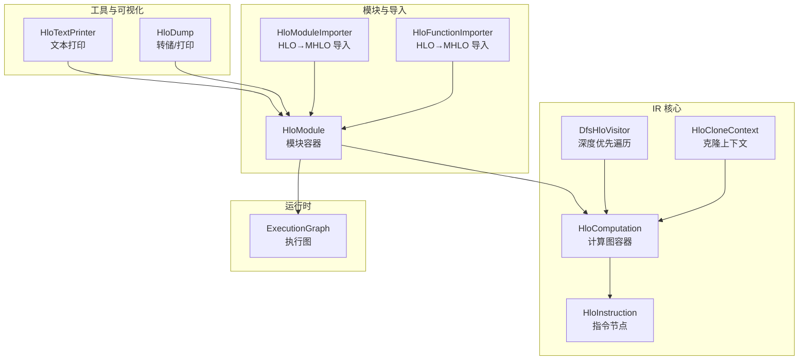
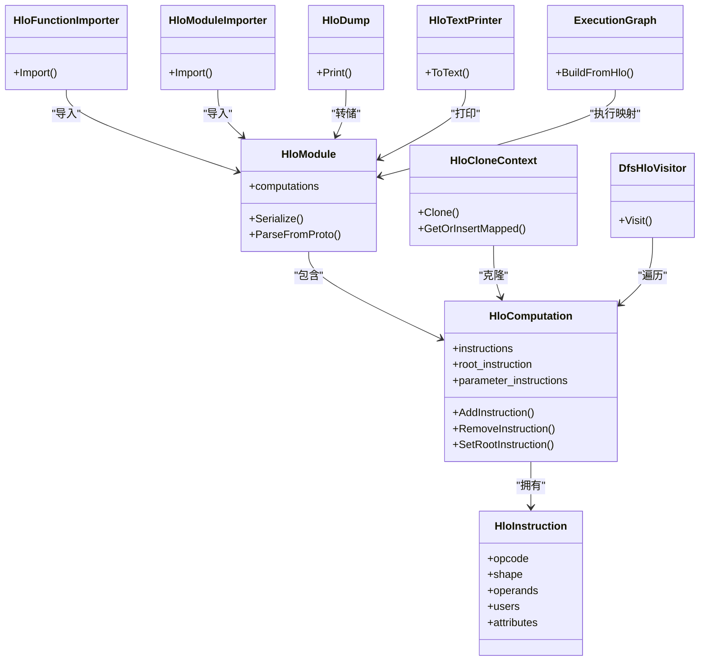
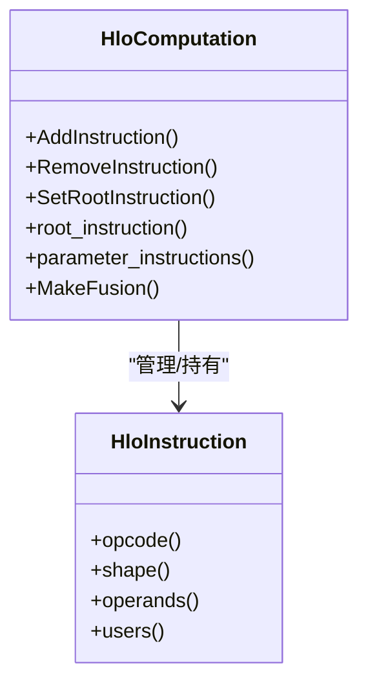
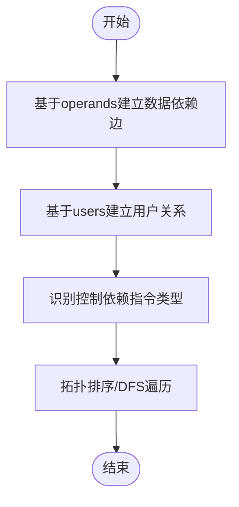
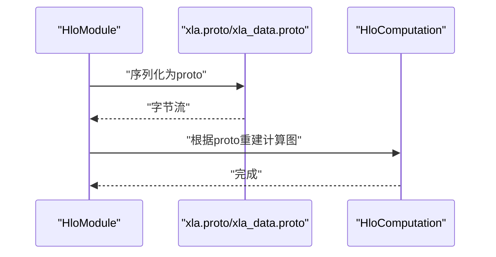
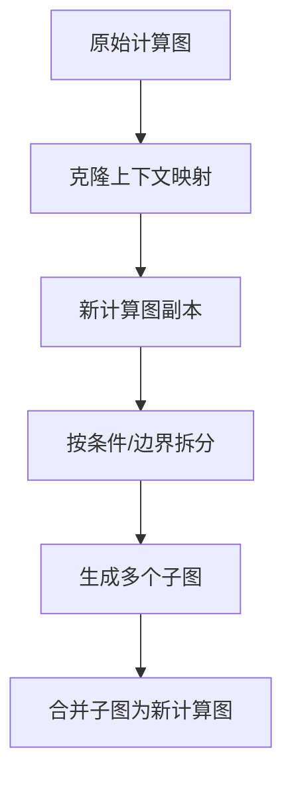
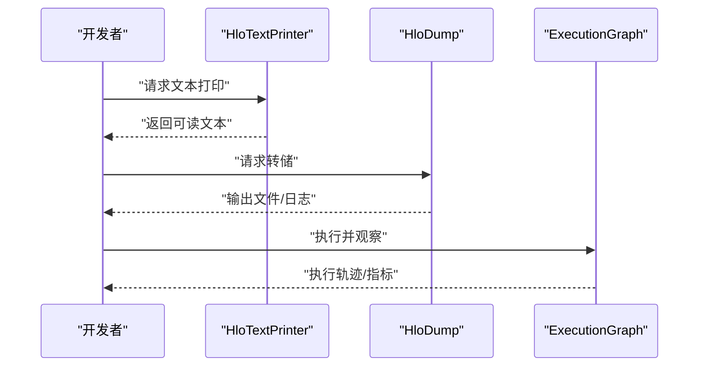
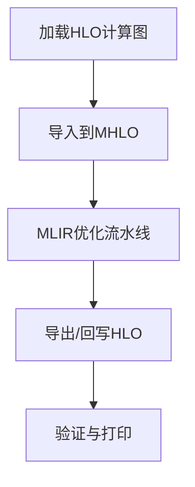
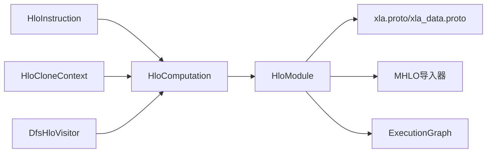

# 计算图结构

<cite>
**本文引用的文件**
- [xla/hlo/ir/hlo_computation.h](file://xla/hlo/ir/hlo_computation.h)
- [xla/hlo/ir/hlo_instruction.h](file://xla/hlo/ir/hlo_instruction.h)
- [xla/hlo/ir/hlo_clone_context.h](file://xla/hlo/ir/hlo_clone_context.h)
- [xla/hlo/ir/dfs_hlo_visitor.h](file://xla/hlo/ir/dfs_hlo_visitor.h)
- [xla/hlo/ir/hlo_module.h](file://xla/hlo/ir/hlo_module.h)
- [xla/hlo/transforms/simplifiers/hlo_computation_deduplicator.h](file://xla/hlo/transforms/simplifiers/hlo_computation_deduplicator.h)
- [xla/hlo/translate/hlo_to_mhlo/hlo_function_importer.h](file://xla/hlo/translate/hlo_to_mhlo/hlo_function_importer.h)
- [xla/hlo/translate/hlo_to_mhlo/hlo_module_importer.h](file://xla/hlo/translate/hlo_to_mhlo/hlo_module_importer.h)
- [xla/hlo/builder/hlo_builder.h](file://xla/hlo/builder/hlo_builder.h)
- [xla/hlo/tools/hlo_dump.cc](file://xla/hlo/tools/hlo_dump.cc)
- [xla/hlo/tools/hlo_text_printer.cc](file://xla/hlo/tools/hlo_text_printer.cc)
- [xla/hlo/utils/hlo_utils.h](file://xla/hlo/utils/hlo_utils.h)
- [xla/runtime/execution_graph.h](file://xla/runtime/execution_graph.h)
- [xla/runtime/execution_graph.cc](file://xla/runtime/execution_graph.cc)
- [xla/xla.proto](file://xla/xla.proto)
- [xla/xla_data.proto](file://xla/xla_data.proto)
- [xla/mlir_hlo/mhlo_ext/mhlo_ext.h](file://xla/mlir_hlo/mhlo_ext/mhlo_ext.h)
- [xla/mlir_hlo/mhlo_ext/mhlo_ext.cc](file://xla/mlir_hlo/mhlo_ext/mhlo_ext.cc)
</cite>

## 目录
1. [引言](#引言)
2. [项目结构](#项目结构)
3. [核心组件](#核心组件)
4. [架构总览](#架构总览)
5. [详细组件分析](#详细组件分析)
6. [依赖分析](#依赖分析)
7. [性能考虑](#性能考虑)
8. [故障排查指南](#故障排查指南)
9. [结论](#结论)
10. [附录](#附录)

## 引言
本技术文档围绕XLA中的HLO（High-Level Optimizer）计算图结构展开，重点阐述HloComputation类的设计与实现，覆盖计算图的构建、节点管理、遍历机制、指令依赖关系与数据流、控制依赖、序列化与反序列化、克隆/分割/合并、调试与可视化、优化与变换等主题，并通过路径引用的方式给出具体实现位置以便进一步查阅。

## 项目结构
XLA的HLO IR位于xla/hlo/ir目录下，包含计算图核心类型（如HloComputation、HloInstruction）、遍历与访问器、克隆上下文、模块容器等；同时在xla/hlo/translate与xla/hlo/tools中提供了从HLO到MLIR的导入器以及文本/可视化工具；运行时执行图由runtime/execution_graph定义，用于将HLO计算图映射到执行阶段。

图表来源
- [xla/hlo/ir/hlo_computation.h](file://xla/hlo/ir/hlo_computation.h#L1-L200)
- [xla/hlo/ir/hlo_instruction.h](file://xla/hlo/ir/hlo_instruction.h#L1-L300)
- [xla/hlo/ir/hlo_clone_context.h](file://xla/hlo/ir/hlo_clone_context.h#L1-L120)
- [xla/hlo/ir/dfs_hlo_visitor.h](file://xla/hlo/ir/dfs_hlo_visitor.h#L1-L120)
- [xla/hlo/ir/hlo_module.h](file://xla/hlo/ir/hlo_module.h#L1-L200)
- [xla/hlo/translate/hlo_to_mhlo/hlo_function_importer.h](file://xla/hlo/translate/hlo_to_mhlo/hlo_function_importer.h#L1-L120)
- [xla/hlo/translate/hlo_to_mhlo/hlo_module_importer.h](file://xla/hlo/translate/hlo_to_mhlo/hlo_module_importer.h#L1-L120)
- [xla/hlo/tools/hlo_dump.cc](file://xla/hlo/tools/hlo_dump.cc#L1-L120)
- [xla/hlo/tools/hlo_text_printer.cc](file://xla/hlo/tools/hlo_text_printer.cc#L1-L120)
- [xla/runtime/execution_graph.h](file://xla/runtime/execution_graph.h#L1-L120)

章节来源
- [xla/hlo/ir/hlo_computation.h](file://xla/hlo/ir/hlo_computation.h#L1-L200)
- [xla/hlo/ir/hlo_module.h](file://xla/hlo/ir/hlo_module.h#L1-L200)

## 核心组件
- HloComputation：代表一个计算图（函数体），维护指令序列、根指令、参数指令、注解等，是HLO IR的中心容器。
- HloInstruction：代表计算图中的单个节点（算子或伪节点），包含形状、操作类型、输入指令、属性等。
- HloModule：封装一组HloComputation（通常是一个程序的多个函数），并提供序列化/反序列化接口。
- HloCloneContext：支持计算图克隆，维护节点映射与重定位。
- DfsHloVisitor：提供深度优先遍历框架，便于进行分析与变换。
- HloFunctionImporter/HloModuleImporter：将HLO IR导入到MHLO（MLIR HLO）。
- HloDump/HloTextPrinter：提供计算图转储与文本打印能力，辅助调试与可视化。
- ExecutionGraph：运行时层面对HLO计算图的执行映射。

章节来源
- [xla/hlo/ir/hlo_computation.h](file://xla/hlo/ir/hlo_computation.h#L80-L200)
- [xla/hlo/ir/hlo_instruction.h](file://xla/hlo/ir/hlo_instruction.h#L70-L120)
- [xla/hlo/ir/hlo_module.h](file://xla/hlo/ir/hlo_module.h#L800-L950)
- [xla/hlo/ir/hlo_clone_context.h](file://xla/hlo/ir/hlo_clone_context.h#L1-L120)
- [xla/hlo/ir/dfs_hlo_visitor.h](file://xla/hlo/ir/dfs_hlo_visitor.h#L1-L120)
- [xla/hlo/translate/hlo_to_mhlo/hlo_function_importer.h](file://xla/hlo/translate/hlo_to_mhlo/hlo_function_importer.h#L1-L120)
- [xla/hlo/translate/hlo_to_mhlo/hlo_module_importer.h](file://xla/hlo/translate/hlo_to_mhlo/hlo_module_importer.h#L1-L120)
- [xla/hlo/tools/hlo_dump.cc](file://xla/hlo/tools/hlo_dump.cc#L1-L120)
- [xla/hlo/tools/hlo_text_printer.cc](file://xla/hlo/tools/hlo_text_printer.cc#L1-L120)
- [xla/runtime/execution_graph.h](file://xla/runtime/execution_graph.h#L1-L120)

## 架构总览
下图展示了HLO计算图在XLA中的关键构件及其交互关系：HloComputation持有HloInstruction列表并作为HloModule的成员；HloCloneContext用于克隆；DFS访问器用于遍历；导入器将HLO转换为MHLO；转储与文本打印用于调试；运行时执行图负责执行映射。

图表来源
- [xla/hlo/ir/hlo_computation.h](file://xla/hlo/ir/hlo_computation.h#L80-L200)
- [xla/hlo/ir/hlo_instruction.h](file://xla/hlo/ir/hlo_instruction.h#L70-L120)
- [xla/hlo/ir/hlo_module.h](file://xla/hlo/ir/hlo_module.h#L800-L950)
- [xla/hlo/ir/hlo_clone_context.h](file://xla/hlo/ir/hlo_clone_context.h#L1-L120)
- [xla/hlo/ir/dfs_hlo_visitor.h](file://xla/hlo/ir/dfs_hlo_visitor.h#L1-L120)
- [xla/hlo/translate/hlo_to_mhlo/hlo_function_importer.h](file://xla/hlo/translate/hlo_to_mhlo/hlo_function_importer.h#L1-L120)
- [xla/hlo/translate/hlo_to_mhlo/hlo_module_importer.h](file://xla/hlo/translate/hlo_to_mhlo/hlo_module_importer.h#L1-L120)
- [xla/hlo/tools/hlo_dump.cc](file://xla/hlo/tools/hlo_dump.cc#L1-L120)
- [xla/hlo/tools/hlo_text_printer.cc](file://xla/hlo/tools/hlo_text_printer.cc#L1-L120)
- [xla/runtime/execution_graph.h](file://xla/runtime/execution_graph.h#L1-L120)

## 详细组件分析

### HloComputation 设计与实现
- 职责与角色
  - 管理计算图内的指令集合、根指令、参数指令。
  - 提供指令插入/删除、根指令设置、参数查询等接口。
- 关键数据结构
  - 指令序列：有序存储HloInstruction指针。
  - 根指令：计算图的输出语义节点。
  - 参数指令：输入占位符，对应函数形参。
- 遍历与访问
  - 通过DfsHloVisitor进行深度优先遍历，支持自定义访问策略。
- 克隆与重定位
  - 使用HloCloneContext进行节点映射与重定位，确保克隆后依赖关系正确。
- 与模块的关系
  - HloModule持有多个HloComputation，形成完整的程序结构。

图表来源
- [xla/hlo/ir/hlo_computation.h](file://xla/hlo/ir/hlo_computation.h#L80-L200)
- [xla/hlo/ir/hlo_instruction.h](file://xla/hlo/ir/hlo_instruction.h#L70-L120)

章节来源
- [xla/hlo/ir/hlo_computation.h](file://xla/hlo/ir/hlo_computation.h#L80-L200)
- [xla/hlo/ir/dfs_hlo_visitor.h](file://xla/hlo/ir/dfs_hlo_visitor.h#L1-L120)
- [xla/hlo/ir/hlo_clone_context.h](file://xla/hlo/ir/hlo_clone_context.h#L1-L120)

### 指令依赖关系、数据流与控制依赖
- 数据依赖
  - HloInstruction的operands构成直接的数据依赖边；users反映被使用关系，用于传播分析。
- 控制依赖
  - 通过特定指令类型表达控制流（例如条件、循环等），HloComputation维护根指令以表达整体控制语义。
- 依赖图构建
  - 基于operands/users建立有向无环图（DAG），DFS/BFS遍历用于拓扑排序与分析。

图表来源
- [xla/hlo/ir/hlo_instruction.h](file://xla/hlo/ir/hlo_instruction.h#L70-L120)
- [xla/hlo/ir/dfs_hlo_visitor.h](file://xla/hlo/ir/dfs_hlo_visitor.h#L1-L120)

章节来源
- [xla/hlo/ir/hlo_instruction.h](file://xla/hlo/ir/hlo_instruction.h#L70-L120)
- [xla/hlo/ir/dfs_hlo_visitor.h](file://xla/hlo/ir/dfs_hlo_visitor.h#L1-L120)

### 序列化与反序列化
- 协议缓冲区格式
  - 使用xla.proto与xla_data.proto定义HloComputation与HloInstruction的序列化字段。
- 内存到proto
  - HloModule提供序列化方法，将内存中的计算图写入proto。
- proto到内存
  - HloModule提供解析方法，从proto重建内存表示。
- 可移植性
  - 通过标准proto格式实现跨平台/跨语言的持久化与传输。

图表来源
- [xla/hlo/ir/hlo_module.h](file://xla/hlo/ir/hlo_module.h#L800-L950)
- [xla/xla.proto](file://xla/xla.proto#L1-L200)
- [xla/xla_data.proto](file://xla/xla_data.proto#L1-L200)

章节来源
- [xla/hlo/ir/hlo_module.h](file://xla/hlo/ir/hlo_module.h#L800-L950)
- [xla/xla.proto](file://xla/xla.proto#L1-L200)
- [xla/xla_data.proto](file://xla/xla_data.proto#L1-L200)

### 克隆、分割与合并
- 克隆
  - 使用HloCloneContext对计算图进行深拷贝，维护节点映射表，确保克隆后的依赖关系一致。
- 分割
  - 通过HloComputation的指令拆分与根指令重定向实现逻辑分割。
- 合并
  - 将多个计算图的指令序列合并，重新设置根指令与参数，保持DAG性质。

图表来源
- [xla/hlo/ir/hlo_clone_context.h](file://xla/hlo/ir/hlo_clone_context.h#L1-L120)
- [xla/hlo/ir/hlo_computation.h](file://xla/hlo/ir/hlo_computation.h#L80-L200)

章节来源
- [xla/hlo/ir/hlo_clone_context.h](file://xla/hlo/ir/hlo_clone_context.h#L1-L120)
- [xla/hlo/ir/hlo_computation.h](file://xla/hlo/ir/hlo_computation.h#L80-L200)

### 调试与可视化
- 文本打印
  - HloTextPrinter将HLO计算图转为可读文本，便于人工检查。
- 转储工具
  - HloDump提供统一的转储入口，支持多种输出格式与过滤选项。
- 运行时执行图
  - ExecutionGraph将HLO映射到执行阶段，辅助定位执行瓶颈与错误。

图表来源
- [xla/hlo/tools/hlo_text_printer.cc](file://xla/hlo/tools/hlo_text_printer.cc#L1-L120)
- [xla/hlo/tools/hlo_dump.cc](file://xla/hlo/tools/hlo_dump.cc#L1-L120)
- [xla/runtime/execution_graph.h](file://xla/runtime/execution_graph.h#L1-L120)

章节来源
- [xla/hlo/tools/hlo_text_printer.cc](file://xla/hlo/tools/hlo_text_printer.cc#L1-L120)
- [xla/hlo/tools/hlo_dump.cc](file://xla/hlo/tools/hlo_dump.cc#L1-L120)
- [xla/runtime/execution_graph.h](file://xla/runtime/execution_graph.h#L1-L120)

### 优化与变换
- 简化与去重
  - HloComputationDeduplicator用于消除重复计算图，减少冗余。
- 导入到MHLO
  - HloFunctionImporter/HloModuleImporter将HLO IR导入到MHLO，利用MLIR生态进行后续优化。
- 构建复杂计算图
  - 通过builder接口（如HloBuilder）逐步添加指令，组合嵌套计算、循环与条件分支。

图表来源
- [xla/hlo/transforms/simplifiers/hlo_computation_deduplicator.h](file://xla/hlo/transforms/simplifiers/hlo_computation_deduplicator.h#L1-L120)
- [xla/hlo/translate/hlo_to_mhlo/hlo_function_importer.h](file://xla/hlo/translate/hlo_to_mhlo/hlo_function_importer.h#L1-L120)
- [xla/hlo/translate/hlo_to_mhlo/hlo_module_importer.h](file://xla/hlo/translate/hlo_to_mhlo/hlo_module_importer.h#L1-L120)
- [xla/mlir_hlo/mhlo_ext/mhlo_ext.h](file://xla/mlir_hlo/mhlo_ext/mhlo_ext.h#L1-L120)
- [xla/mlir_hlo/mhlo_ext/mhlo_ext.cc](file://xla/mlir_hlo/mhlo_ext/mhlo_ext.cc#L1-L120)

章节来源
- [xla/hlo/transforms/simplifiers/hlo_computation_deduplicator.h](file://xla/hlo/transforms/simplifiers/hlo_computation_deduplicator.h#L1-L120)
- [xla/hlo/translate/hlo_to_mhlo/hlo_function_importer.h](file://xla/hlo/translate/hlo_to_mhlo/hlo_function_importer.h#L1-L120)
- [xla/hlo/translate/hlo_to_mhlo/hlo_module_importer.h](file://xla/hlo/translate/hlo_to_mhlo/hlo_module_importer.h#L1-L120)
- [xla/mlir_hlo/mhlo_ext/mhlo_ext.h](file://xla/mlir_hlo/mhlo_ext/mhlo_ext.h#L1-L120)
- [xla/mlir_hlo/mhlo_ext/mhlo_ext.cc](file://xla/mlir_hlo/mhlo_ext/mhlo_ext.cc#L1-L120)

### 构建复杂计算图示例（路径指引）
- 嵌套计算与循环结构
  - 使用HloBuilder逐步添加指令，通过条件与循环指令表达迭代与分支。
  - 参考：[xla/hlo/builder/hlo_builder.h](file://xla/hlo/builder/hlo_builder.h#L1-L200)
- 条件分支
  - 利用选择/分支指令连接不同计算图分支，最终汇聚到单一根指令。
  - 参考：[xla/hlo/ir/hlo_instruction.h](file://xla/hlo/ir/hlo_instruction.h#L70-L120)
- 复杂变换与优化
  - 在导入MHLO后进行融合、常量折叠、死代码消除等变换。
  - 参考：[xla/mlir_hlo/mhlo_ext/mhlo_ext.h](file://xla/mlir_hlo/mhlo_ext/mhlo_ext.h#L1-L120)

章节来源
- [xla/hlo/builder/hlo_builder.h](file://xla/hlo/builder/hlo_builder.h#L1-L200)
- [xla/hlo/ir/hlo_instruction.h](file://xla/hlo/ir/hlo_instruction.h#L70-L120)
- [xla/mlir_hlo/mhlo_ext/mhlo_ext.h](file://xla/mlir_hlo/mhlo_ext/mhlo_ext.h#L1-L120)

## 依赖分析
- 组件耦合
  - HloComputation与HloInstruction强耦合（拥有/管理关系）。
  - HloModule聚合多个HloComputation，承担序列化/反序列化职责。
  - HloCloneContext与DFS访问器为上层变换提供基础能力。
- 外部依赖
  - 协议缓冲区（xla.proto/xla_data.proto）定义持久化格式。
  - MHLO导入器依赖MLIR生态，扩展优化能力。
- 执行映射
  - 运行时执行图将HLO映射到设备执行计划，形成端到端链路。

图表来源
- [xla/hlo/ir/hlo_instruction.h](file://xla/hlo/ir/hlo_instruction.h#L70-L120)
- [xla/hlo/ir/hlo_computation.h](file://xla/hlo/ir/hlo_computation.h#L80-L200)
- [xla/hlo/ir/hlo_module.h](file://xla/hlo/ir/hlo_module.h#L800-L950)
- [xla/hlo/ir/hlo_clone_context.h](file://xla/hlo/ir/hlo_clone_context.h#L1-L120)
- [xla/hlo/ir/dfs_hlo_visitor.h](file://xla/hlo/ir/dfs_hlo_visitor.h#L1-L120)
- [xla/xla.proto](file://xla/xla.proto#L1-L200)
- [xla/xla_data.proto](file://xla/xla_data.proto#L1-L200)
- [xla/mlir_hlo/mhlo_ext/mhlo_ext.h](file://xla/mlir_hlo/mhlo_ext/mhlo_ext.h#L1-L120)
- [xla/runtime/execution_graph.h](file://xla/runtime/execution_graph.h#L1-L120)

章节来源
- [xla/hlo/ir/hlo_instruction.h](file://xla/hlo/ir/hlo_instruction.h#L70-L120)
- [xla/hlo/ir/hlo_computation.h](file://xla/hlo/ir/hlo_computation.h#L80-L200)
- [xla/hlo/ir/hlo_module.h](file://xla/hlo/ir/hlo_module.h#L800-L950)
- [xla/hlo/ir/hlo_clone_context.h](file://xla/hlo/ir/hlo_clone_context.h#L1-L120)
- [xla/hlo/ir/dfs_hlo_visitor.h](file://xla/hlo/ir/dfs_hlo_visitor.h#L1-L120)
- [xla/xla.proto](file://xla/xla.proto#L1-L200)
- [xla/xla_data.proto](file://xla/xla_data.proto#L1-L200)
- [xla/mlir_hlo/mhlo_ext/mhlo_ext.h](file://xla/mlir_hlo/mhlo_ext/mhlo_ext.h#L1-L120)
- [xla/runtime/execution_graph.h](file://xla/runtime/execution_graph.h#L1-L120)

## 性能考虑
- 遍历与分析
  - DFS/BFS遍历应避免重复访问，结合缓存与标记位提升效率。
- 序列化/反序列化
  - 使用高效的proto序列化策略，减少I/O开销；在大规模图上启用压缩或增量更新。
- 克隆与复制
  - 克隆时复用共享子图，避免重复分配；使用映射表快速定位已克隆节点。
- 优化与变换
  - 在导入MHLO后利用MLIR的pass pipeline进行批量优化，减少多次往返。

## 故障排查指南
- 调试打印
  - 使用HloTextPrinter输出计算图文本，核对指令顺序与依赖关系。
  - 使用HloDump输出二进制/文本快照，便于对比前后状态。
- 执行验证
  - 通过ExecutionGraph核对执行阶段的节点映射与调度信息。
- 导入一致性
  - 确认HLO→MHLO导入前后语义一致，必要时在MHLO侧进行中间态检查。

章节来源
- [xla/hlo/tools/hlo_text_printer.cc](file://xla/hlo/tools/hlo_text_printer.cc#L1-L120)
- [xla/hlo/tools/hlo_dump.cc](file://xla/hlo/tools/hlo_dump.cc#L1-L120)
- [xla/runtime/execution_graph.h](file://xla/runtime/execution_graph.h#L1-L120)

## 结论
HloComputation作为HLO计算图的核心容器，通过与HloInstruction、HloModule、HloCloneContext、DFS访问器及MHLO导入器的协同，实现了从构建、遍历、优化到执行映射的完整链路。借助序列化/反序列化与调试工具，开发者可以高效地构建、分析与优化复杂的计算图，满足从研究到生产的多样化需求。

## 附录
- 相关工具与接口路径
  - 构建器：[xla/hlo/builder/hlo_builder.h](file://xla/hlo/builder/hlo_builder.h#L1-L200)
  - 文本打印：[xla/hlo/tools/hlo_text_printer.cc](file://xla/hlo/tools/hlo_text_printer.cc#L1-L120)
  - 转储工具：[xla/hlo/tools/hlo_dump.cc](file://xla/hlo/tools/hlo_dump.cc#L1-L120)
  - 运行时执行图：[xla/runtime/execution_graph.cc](file://xla/runtime/execution_graph.cc#L1-L120)