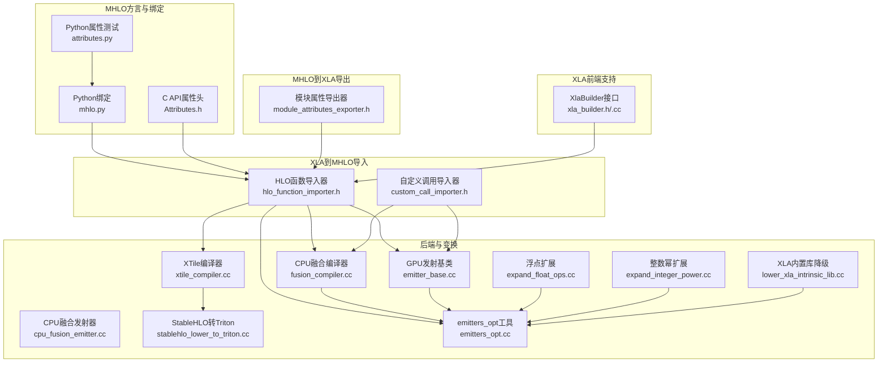
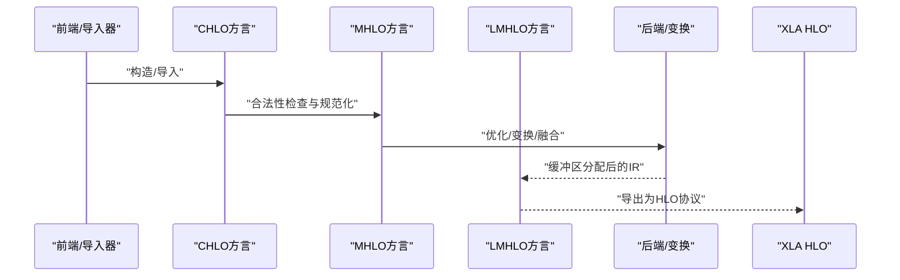
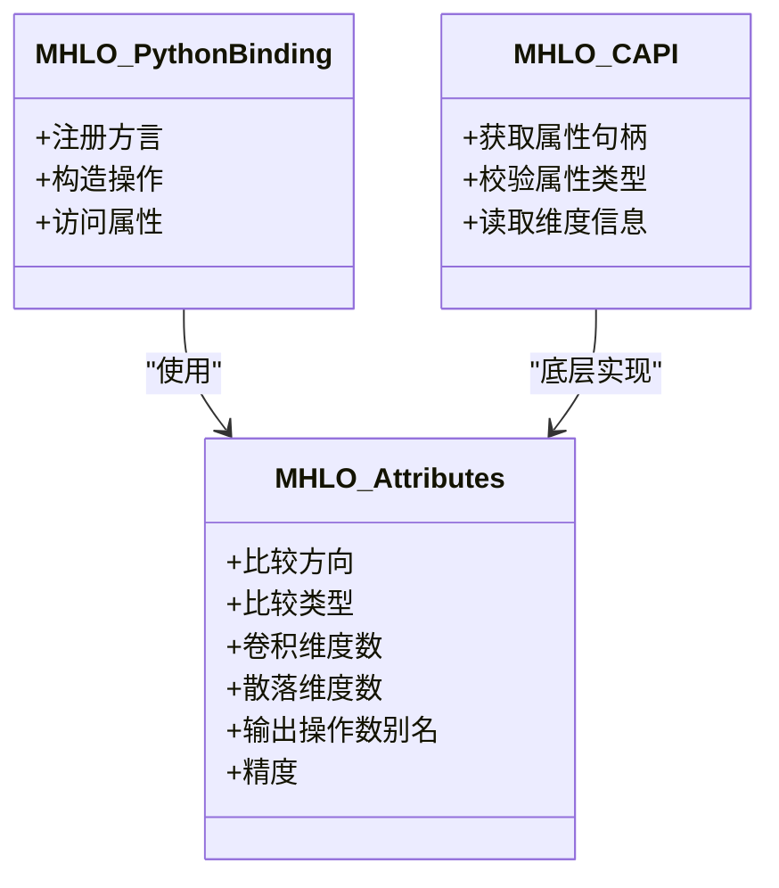
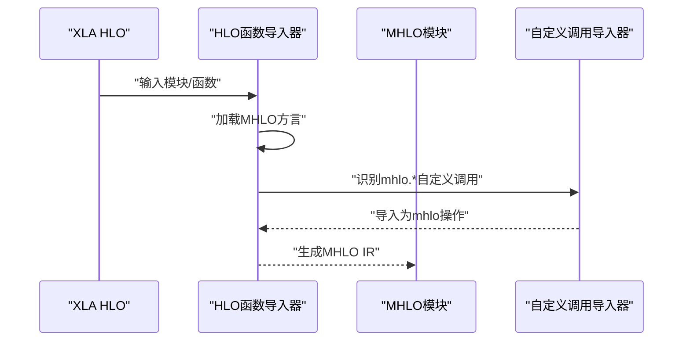
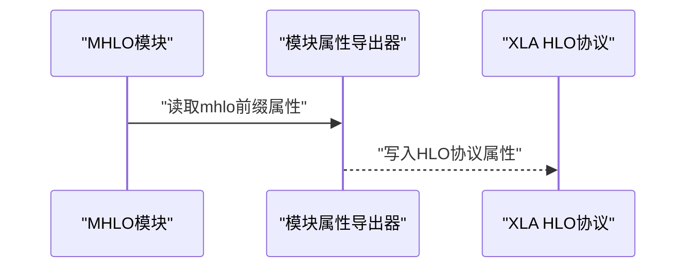
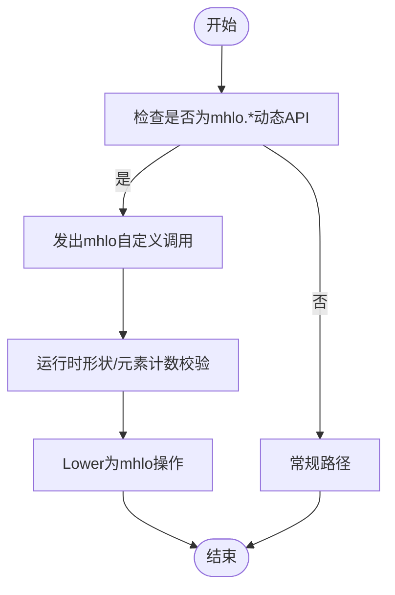
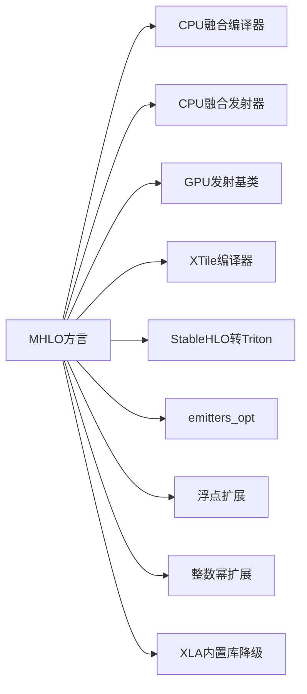
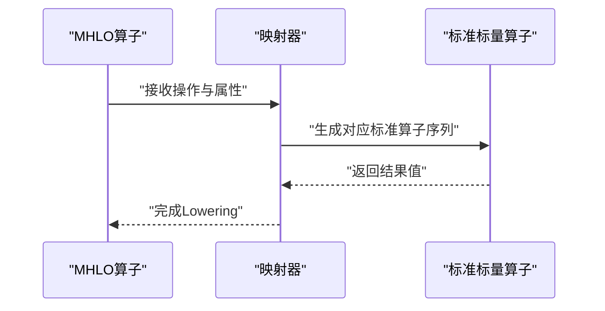
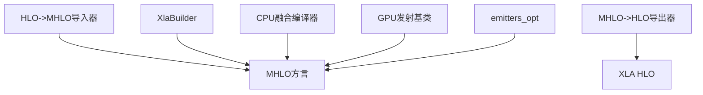

# MHLO方言

<cite>
**本文引用的文件**
- [xla/mlir_hlo/README.md](file://xla/mlir_hlo/README.md)
- [xla/mlir_hlo/bindings/python/mlir/dialects/mhlo.py](file://xla/mlir_hlo/bindings/python/mlir/dialects/mhlo.py)
- [xla/mlir_hlo/tests/python/attributes.py](file://xla/mlir_hlo/tests/python/attributes.py)
- [xla/mlir_hlo/bindings/c/Attributes.h](file://xla/mlir_hlo/bindings/c/Attributes.h)
- [xla/codegen/emitters/elemental_hlo_to_mlir.cc](file://xla/codegen/emitters/elemental_hlo_to_mlir.cc)
- [xla/backends/cpu/codegen/fusion_compiler.cc](file://xla/backends/cpu/codegen/fusion_compiler.cc)
- [xla/backends/cpu/codegen/emitters/cpu_fusion_emitter.cc](file://xla/backends/cpu/codegen/emitters/cpu_fusion_emitter.cc)
- [xla/backends/gpu/codegen/emitters/emitter_base.cc](file://xla/backends/gpu/codegen/emitters/emitter_base.cc)
- [xla/backends/gpu/codegen/triton/xtile_compiler.cc](file://xla/backends/gpu/codegen/triton/xtile_compiler.cc)
- [xla/backends/gpu/codegen/triton/transforms/stablehlo_lower_to_triton.cc](file://xla/backends/gpu/codegen/triton/transforms/stablehlo_lower_to_triton.cc)
- [xla/hlo/translate/hlo_to_mhlo/hlo_function_importer.h](file://xla/hlo/translate/hlo_to_mhlo/hlo_function_importer.h)
- [xla/hlo/translate/hlo_to_mhlo/custom_call_importer.h](file://xla/hlo/translate/hlo_to_mhlo/custom_call_importer.h)
- [xla/hlo/translate/mhlo_to_hlo/module_attributes_exporter.h](file://xla/hlo/translate/mhlo_to_hlo/module_attributes_exporter.h)
- [xla/hlo/builder/xla_builder.h](file://xla/hlo/builder/xla_builder.h)
- [xla/hlo/builder/xla_builder.cc](file://xla/hlo/builder/xla_builder.cc)
- [xla/hlo/analysis/indexing_analysis.cc](file://xla/hlo/analysis/indexing_analysis.cc)
- [xla/hlo/analysis/indexing_analysis_test.cc](file://xla/hlo/analysis/indexing_analysis_test.cc)
- [xla/codegen/tools/emitters_opt.cc](file://xla/codegen/tools/emitters_opt.cc)
- [xla/codegen/emitters/transforms/expand_float_ops.cc](file://xla/codegen/emitters/transforms/expand_float_ops.cc)
- [xla/codegen/emitters/transforms/expand_integer_power.cc](file://xla/codegen/emitters/transforms/expand_integer_power.cc)
- [xla/codegen/emitters/transforms/lower_xla_intrinsic_lib.cc](file://xla/codegen/emitters/transforms/lower_xla_intrinsic_lib.cc)
</cite>

## 目录
1. [引言](#引言)
2. [项目结构](#项目结构)
3. [核心组件](#核心组件)
4. [架构总览](#架构总览)
5. [详细组件分析](#详细组件分析)
6. [依赖分析](#依赖分析)
7. [性能考虑](#性能考虑)
8. [故障排查指南](#故障排查指南)
9. [结论](#结论)
10. [附录](#附录)

## 引言
本技术文档围绕MHLO（MLIR HLO）方言展开，系统阐述其设计原则、语法结构、语义规则、属性与类型体系、与XLA编译流水线的关系、与其他MLIR方言的互操作性，并提供使用示例、最佳实践、验证规则、调试工具与性能优化策略。需要特别指出的是：该仓库已标注为“已弃用”，并建议迁移到StableHLO；本文档旨在帮助理解MHLO在XLA生态中的历史定位与实现细节。

## 项目结构
MHLO相关代码主要分布在以下区域：
- 顶层说明与构建：xla/mlir_hlo/README.md
- Python绑定与测试：xla/mlir_hlo/bindings/python、xla/mlir_hlo/tests/python
- C API属性接口：xla/mlir_hlo/bindings/c/Attributes.h
- 从HLO到MHLO的导入器：xla/hlo/translate/hlo_to_mhlo/*
- 从MHLO到HLO的导出器：xla/hlo/translate/mhlo_to_hlo/*
- XLA侧对MHLO动态形状与自定义调用的支持：xla/hlo/builder/xla_builder.*
- 各后端（CPU/GPU）与变换（transforms）中对MHLO的集成：xla/backends/*/codegen/*、xla/codegen/emitters/*
- 工具链与优化：xla/codegen/tools/emitters_opt.cc

图表来源
- [xla/mlir_hlo/bindings/python/mlir/dialects/mhlo.py](file://xla/mlir_hlo/bindings/python/mlir/dialects/mhlo.py#L15-L20)
- [xla/mlir_hlo/bindings/c/Attributes.h](file://xla/mlir_hlo/bindings/c/Attributes.h#L25-L50)
- [xla/mlir_hlo/tests/python/attributes.py](file://xla/mlir_hlo/tests/python/attributes.py#L14-L170)
- [xla/hlo/translate/hlo_to_mhlo/hlo_function_importer.h](file://xla/hlo/translate/hlo_to_mhlo/hlo_function_importer.h#L130-L145)
- [xla/hlo/translate/hlo_to_mhlo/custom_call_importer.h](file://xla/hlo/translate/hlo_to_mhlo/custom_call_importer.h#L29-L45)
- [xla/hlo/translate/mhlo_to_hlo/module_attributes_exporter.h](file://xla/hlo/translate/mhlo_to_hlo/module_attributes_exporter.h#L20-L35)
- [xla/hlo/builder/xla_builder.h](file://xla/hlo/builder/xla_builder.h#L618-L650)
- [xla/backends/cpu/codegen/fusion_compiler.cc](file://xla/backends/cpu/codegen/fusion_compiler.cc#L600-L610)
- [xla/backends/cpu/codegen/emitters/cpu_fusion_emitter.cc](file://xla/backends/cpu/codegen/emitters/cpu_fusion_emitter.cc#L70-L75)
- [xla/backends/gpu/codegen/emitters/emitter_base.cc](file://xla/backends/gpu/codegen/emitters/emitter_base.cc#L100-L110)
- [xla/backends/gpu/codegen/triton/xtile_compiler.cc](file://xla/backends/gpu/codegen/triton/xtile_compiler.cc#L100-L110)
- [xla/backends/gpu/codegen/triton/transforms/stablehlo_lower_to_triton.cc](file://xla/backends/gpu/codegen/triton/transforms/stablehlo_lower_to_triton.cc#L55-L65)
- [xla/codegen/tools/emitters_opt.cc](file://xla/codegen/tools/emitters_opt.cc#L60-L70)
- [xla/codegen/emitters/transforms/expand_float_ops.cc](file://xla/codegen/emitters/transforms/expand_float_ops.cc#L175-L185)
- [xla/codegen/emitters/transforms/expand_integer_power.cc](file://xla/codegen/emitters/transforms/expand_integer_power.cc#L45-L55)
- [xla/codegen/emitters/transforms/lower_xla_intrinsic_lib.cc](file://xla/codegen/emitters/transforms/lower_xla_intrinsic_lib.cc#L220-L235)

章节来源
- [xla/mlir_hlo/README.md](file://xla/mlir_hlo/README.md#L1-L288)

## 核心组件
- 方言与绑定
  - Python绑定：提供mhlo方言的操作与属性访问入口，便于在Python中构造与验证MHLO IR。
  - C API属性：暴露MHLO属性的C接口，用于跨语言/跨层访问。
  - 属性测试：覆盖常见属性如比较方向、比较类型、卷积维度数、散落维度数、输出操作数别名、精度等。
- 导入/导出
  - HLO到MHLO导入器：加载MHLO方言，将XLA HLO指令导入为MHLO操作。
  - MHLO到HLO导出器：将MHLO模块属性导出为HLO协议格式。
- XLA前端支持
  - XlaBuilder接口：提供动态形状与广播等实验性API，内部以自定义调用形式桥接mhlo.*操作。
- 后端与变换
  - CPU/GPU后端：在融合编译、发射阶段显式依赖MHLO方言。
  - 变换与工具：包含浮点/整数幂扩展、XLA内置库降级等，均与MHLO IR协同工作。

章节来源
- [xla/mlir_hlo/bindings/python/mlir/dialects/mhlo.py](file://xla/mlir_hlo/bindings/python/mlir/dialects/mhlo.py#L15-L20)
- [xla/mlir_hlo/bindings/c/Attributes.h](file://xla/mlir_hlo/bindings/c/Attributes.h#L25-L50)
- [xla/mlir_hlo/tests/python/attributes.py](file://xla/mlir_hlo/tests/python/attributes.py#L14-L170)
- [xla/hlo/translate/hlo_to_mhlo/hlo_function_importer.h](file://xla/hlo/translate/hlo_to_mhlo/hlo_function_importer.h#L130-L145)
- [xla/hlo/translate/mhlo_to_hlo/module_attributes_exporter.h](file://xla/hlo/translate/mhlo_to_hlo/module_attributes_exporter.h#L20-L35)
- [xla/hlo/builder/xla_builder.h](file://xla/hlo/builder/xla_builder.h#L618-L650)
- [xla/backends/cpu/codegen/fusion_compiler.cc](file://xla/backends/cpu/codegen/fusion_compiler.cc#L600-L610)
- [xla/backends/gpu/codegen/emitters/emitter_base.cc](file://xla/backends/gpu/codegen/emitters/emitter_base.cc#L100-L110)

## 架构总览
MHLO在XLA编译流水线中的角色可概括为：
- 入口：来自CHLO或直接由TF图编译器生成，或从XLA HLO导入。
- 中间：作为优化与变换的中间IR，支撑多结果、控制流、动态形状等能力。
- 出口：可进一步Lower到LMHLO、Linalg/IREE，或回退到XLA HLO。

图表来源
- [xla/mlir_hlo/README.md](file://xla/mlir_hlo/README.md#L176-L241)
- [xla/hlo/translate/hlo_to_mhlo/hlo_function_importer.h](file://xla/hlo/translate/hlo_to_mhlo/hlo_function_importer.h#L130-L145)
- [xla/hlo/translate/mhlo_to_hlo/module_attributes_exporter.h](file://xla/hlo/translate/mhlo_to_hlo/module_attributes_exporter.h#L20-L35)

## 详细组件分析

### Python绑定与属性系统
- 绑定入口：通过mhlo.py加载mhlo操作与属性。
- 属性覆盖：attributes.py展示了多种MHLO属性的构造与断言，包括比较方向、比较类型、卷积维度数、散落维度数、输出操作数别名、精度等。
- C API属性：Attributes.h提供底层C接口，便于在非Python场景下访问MHLO属性。

图表来源
- [xla/mlir_hlo/bindings/python/mlir/dialects/mhlo.py](file://xla/mlir_hlo/bindings/python/mlir/dialects/mhlo.py#L15-L20)
- [xla/mlir_hlo/tests/python/attributes.py](file://xla/mlir_hlo/tests/python/attributes.py#L14-L170)
- [xla/mlir_hlo/bindings/c/Attributes.h](file://xla/mlir_hlo/bindings/c/Attributes.h#L25-L50)

章节来源
- [xla/mlir_hlo/bindings/python/mlir/dialects/mhlo.py](file://xla/mlir_hlo/bindings/python/mlir/dialects/mhlo.py#L15-L20)
- [xla/mlir_hlo/tests/python/attributes.py](file://xla/mlir_hlo/tests/python/attributes.py#L14-L170)
- [xla/mlir_hlo/bindings/c/Attributes.h](file://xla/mlir_hlo/bindings/c/Attributes.h#L25-L50)

### 从HLO到MHLO的导入流程
- 加载方言：导入器在上下文中加载MHLO方言，确保后续可识别mhlo操作。
- 自定义调用导入：对以mhlo.前缀的自定义调用进行识别与导入，便于桥接动态形状等特性。
- 模块属性处理：支持mhlo前缀的模块属性导入，例如布局模式、入口计算参数/结果布局等。

图表来源
- [xla/hlo/translate/hlo_to_mhlo/hlo_function_importer.h](file://xla/hlo/translate/hlo_to_mhlo/hlo_function_importer.h#L130-L145)
- [xla/hlo/translate/hlo_to_mhlo/custom_call_importer.h](file://xla/hlo/translate/hlo_to_mhlo/custom_call_importer.h#L29-L45)

章节来源
- [xla/hlo/translate/hlo_to_mhlo/hlo_function_importer.h](file://xla/hlo/translate/hlo_to_mhlo/hlo_function_importer.h#L130-L145)
- [xla/hlo/translate/hlo_to_mhlo/custom_call_importer.h](file://xla/hlo/translate/hlo_to_mhlo/custom_call_importer.h#L29-L45)

### 从MHLO到HLO的导出流程
- 模块属性导出：将mhlo前缀的模块属性导出为HLO协议所需的属性，保证与XLA HLO的兼容性。

图表来源
- [xla/hlo/translate/mhlo_to_hlo/module_attributes_exporter.h](file://xla/hlo/translate/mhlo_to_hlo/module_attributes_exporter.h#L20-L35)

章节来源
- [xla/hlo/translate/mhlo_to_hlo/module_attributes_exporter.h](file://xla/hlo/translate/mhlo_to_hlo/module_attributes_exporter.h#L20-L35)

### XLA前端对MHLO动态形状与自定义调用的支持
- 动态形状API：XlaBuilder提供mhlo.dynamic_*系列实验性API，内部以自定义调用形式桥接mhlo操作。
- 广播扩展：提供mhlo.dynamic_broadcast_in_dim等操作，支持运行时形状推导。

图表来源
- [xla/hlo/builder/xla_builder.h](file://xla/hlo/builder/xla_builder.h#L618-L650)
- [xla/hlo/builder/xla_builder.h](file://xla/hlo/builder/xla_builder.h#L2207-L2260)
- [xla/hlo/builder/xla_builder.cc](file://xla/hlo/builder/xla_builder.cc#L1010-L1050)
- [xla/hlo/builder/xla_builder.cc](file://xla/hlo/builder/xla_builder.cc#L1046-L1110)

章节来源
- [xla/hlo/builder/xla_builder.h](file://xla/hlo/builder/xla_builder.h#L618-L650)
- [xla/hlo/builder/xla_builder.h](file://xla/hlo/builder/xla_builder.h#L2207-L2260)
- [xla/hlo/builder/xla_builder.cc](file://xla/hlo/builder/xla_builder.cc#L1010-L1050)
- [xla/hlo/builder/xla_builder.cc](file://xla/hlo/builder/xla_builder.cc#L1046-L1110)

### 后端与变换中的MHLO集成
- CPU后端：融合编译器与融合发射器显式包含mhlo头文件并在Dialect列表中注册MHLO。
- GPU后端：发射基类在Dialect列表中注册MHLO，XTile编译器与StableHLO转Triton变换也与MHLO协作。
- 变换与工具：emitters_opt、expand_float_ops、expand_integer_power、lower_xla_intrinsic_lib等均与MHLO IR协同工作。

图表来源
- [xla/backends/cpu/codegen/fusion_compiler.cc](file://xla/backends/cpu/codegen/fusion_compiler.cc#L600-L610)
- [xla/backends/cpu/codegen/emitters/cpu_fusion_emitter.cc](file://xla/backends/cpu/codegen/emitters/cpu_fusion_emitter.cc#L70-L75)
- [xla/backends/gpu/codegen/emitters/emitter_base.cc](file://xla/backends/gpu/codegen/emitters/emitter_base.cc#L100-L110)
- [xla/backends/gpu/codegen/triton/xtile_compiler.cc](file://xla/backends/gpu/codegen/triton/xtile_compiler.cc#L100-L110)
- [xla/backends/gpu/codegen/triton/transforms/stablehlo_lower_to_triton.cc](file://xla/backends/gpu/codegen/triton/transforms/stablehlo_lower_to_triton.cc#L55-L65)
- [xla/codegen/tools/emitters_opt.cc](file://xla/codegen/tools/emitters_opt.cc#L60-L70)
- [xla/codegen/emitters/transforms/expand_float_ops.cc](file://xla/codegen/emitters/transforms/expand_float_ops.cc#L175-L185)
- [xla/codegen/emitters/transforms/expand_integer_power.cc](file://xla/codegen/emitters/transforms/expand_integer_power.cc#L45-L55)
- [xla/codegen/emitters/transforms/lower_xla_intrinsic_lib.cc](file://xla/codegen/emitters/transforms/lower_xla_intrinsic_lib.cc#L220-L235)

章节来源
- [xla/backends/cpu/codegen/fusion_compiler.cc](file://xla/backends/cpu/codegen/fusion_compiler.cc#L600-L610)
- [xla/backends/cpu/codegen/emitters/cpu_fusion_emitter.cc](file://xla/backends/cpu/codegen/emitters/cpu_fusion_emitter.cc#L70-L75)
- [xla/backends/gpu/codegen/emitters/emitter_base.cc](file://xla/backends/gpu/codegen/emitters/emitter_base.cc#L100-L110)
- [xla/backends/gpu/codegen/triton/xtile_compiler.cc](file://xla/backends/gpu/codegen/triton/xtile_compiler.cc#L100-L110)
- [xla/backends/gpu/codegen/triton/transforms/stablehlo_lower_to_triton.cc](file://xla/backends/gpu/codegen/triton/transforms/stablehlo_lower_to_triton.cc#L55-L65)
- [xla/codegen/tools/emitters_opt.cc](file://xla/codegen/tools/emitters_opt.cc#L60-L70)
- [xla/codegen/emitters/transforms/expand_float_ops.cc](file://xla/codegen/emitters/transforms/expand_float_ops.cc#L175-L185)
- [xla/codegen/emitters/transforms/expand_integer_power.cc](file://xla/codegen/emitters/transforms/expand_integer_power.cc#L45-L55)
- [xla/codegen/emitters/transforms/lower_xla_intrinsic_lib.cc](file://xla/codegen/emitters/transforms/lower_xla_intrinsic_lib.cc#L220-L235)

### 从MHLO到标准算子的映射（示例）
- 算术与比较：elemental_hlo_to_mlir.cc中提供了将MHLO算子映射到标准标量算子的机制，包括比较、转换等。
- 扩展变换：expand_float_ops与expand_integer_power演示了如何将特定MHLO操作扩展为更基础的标准算子序列。

图表来源
- [xla/codegen/emitters/elemental_hlo_to_mlir.cc](file://xla/codegen/emitters/elemental_hlo_to_mlir.cc#L635-L658)
- [xla/codegen/emitters/elemental_hlo_to_mlir.cc](file://xla/codegen/emitters/elemental_hlo_to_mlir.cc#L820-L960)
- [xla/codegen/emitters/transforms/expand_float_ops.cc](file://xla/codegen/emitters/transforms/expand_float_ops.cc#L175-L185)
- [xla/codegen/emitters/transforms/expand_integer_power.cc](file://xla/codegen/emitters/transforms/expand_integer_power.cc#L45-L55)

章节来源
- [xla/codegen/emitters/elemental_hlo_to_mlir.cc](file://xla/codegen/emitters/elemental_hlo_to_mlir.cc#L635-L658)
- [xla/codegen/emitters/elemental_hlo_to_mlir.cc](file://xla/codegen/emitters/elemental_hlo_to_mlir.cc#L820-L960)
- [xla/codegen/emitters/transforms/expand_float_ops.cc](file://xla/codegen/emitters/transforms/expand_float_ops.cc#L175-L185)
- [xla/codegen/emitters/transforms/expand_integer_power.cc](file://xla/codegen/emitters/transforms/expand_integer_power.cc#L45-L55)

## 依赖分析
- 方言依赖：CPU/GPU后端与变换工具在Dialect列表中显式包含MHLO方言，表明MHLO是这些阶段的核心IR。
- 导入/导出依赖：HLO到MHLO导入器与MHLO到HLO导出器分别承担两端的桥接职责。
- 前端依赖：XlaBuilder通过mhlo.*自定义调用桥接动态形状与广播，间接依赖MHLO。

图表来源
- [xla/hlo/translate/hlo_to_mhlo/hlo_function_importer.h](file://xla/hlo/translate/hlo_to_mhlo/hlo_function_importer.h#L130-L145)
- [xla/hlo/translate/mhlo_to_hlo/module_attributes_exporter.h](file://xla/hlo/translate/mhlo_to_hlo/module_attributes_exporter.h#L20-L35)
- [xla/hlo/builder/xla_builder.h](file://xla/hlo/builder/xla_builder.h#L618-L650)
- [xla/backends/cpu/codegen/fusion_compiler.cc](file://xla/backends/cpu/codegen/fusion_compiler.cc#L600-L610)
- [xla/backends/gpu/codegen/emitters/emitter_base.cc](file://xla/backends/gpu/codegen/emitters/emitter_base.cc#L100-L110)
- [xla/codegen/tools/emitters_opt.cc](file://xla/codegen/tools/emitters_opt.cc#L60-L70)

章节来源
- [xla/hlo/translate/hlo_to_mhlo/hlo_function_importer.h](file://xla/hlo/translate/hlo_to_mhlo/hlo_function_importer.h#L130-L145)
- [xla/hlo/translate/mhlo_to_hlo/module_attributes_exporter.h](file://xla/hlo/translate/mhlo_to_hlo/module_attributes_exporter.h#L20-L35)
- [xla/hlo/builder/xla_builder.h](file://xla/hlo/builder/xla_builder.h#L618-L650)
- [xla/backends/cpu/codegen/fusion_compiler.cc](file://xla/backends/cpu/codegen/fusion_compiler.cc#L600-L610)
- [xla/backends/gpu/codegen/emitters/emitter_base.cc](file://xla/backends/gpu/codegen/emitters/emitter_base.cc#L100-L110)
- [xla/codegen/tools/emitters_opt.cc](file://xla/codegen/tools/emitters_opt.cc#L60-L70)

## 性能考虑
- 融合与调度：CPU/GPU后端在融合编译与发射阶段直接依赖MHLO，有助于在更高层进行融合与调度优化。
- 变换策略：通过扩展变换（如浮点/整数幂扩展）将复杂MHLO操作Lower为更易优化的标准算子序列，提升后端生成效率。
- 内置库降级：将XLA内置库Lower为标准算子，减少后端特殊路径，提高通用性与可移植性。

章节来源
- [xla/backends/cpu/codegen/fusion_compiler.cc](file://xla/backends/cpu/codegen/fusion_compiler.cc#L600-L610)
- [xla/backends/gpu/codegen/emitters/emitter_base.cc](file://xla/backends/gpu/codegen/emitters/emitter_base.cc#L100-L110)
- [xla/codegen/emitters/transforms/expand_float_ops.cc](file://xla/codegen/emitters/transforms/expand_float_ops.cc#L175-L185)
- [xla/codegen/emitters/transforms/expand_integer_power.cc](file://xla/codegen/emitters/transforms/expand_integer_power.cc#L45-L55)
- [xla/codegen/emitters/transforms/lower_xla_intrinsic_lib.cc](file://xla/codegen/emitters/transforms/lower_xla_intrinsic_lib.cc#L220-L235)

## 故障排查指南
- 属性一致性：通过Python属性测试验证常见属性的构造与字符串表示，有助于快速定位属性问题。
- 动态形状校验：XlaBuilder对mhlo.dynamic_*操作进行元素计数与形状一致性校验，若出现不匹配会报错，需检查输入与输出形状。
- 导入/导出路径：确认导入器已加载MHLO方言且自定义调用被正确识别；导出器应正确处理mhlo前缀模块属性。
- 后端集成：若后端无法识别MHLO操作，检查Dialect列表是否包含MHLO方言。

章节来源
- [xla/mlir_hlo/tests/python/attributes.py](file://xla/mlir_hlo/tests/python/attributes.py#L14-L170)
- [xla/hlo/builder/xla_builder.cc](file://xla/hlo/builder/xla_builder.cc#L1010-L1050)
- [xla/hlo/builder/xla_builder.cc](file://xla/hlo/builder/xla_builder.cc#L1046-L1110)
- [xla/hlo/translate/hlo_to_mhlo/hlo_function_importer.h](file://xla/hlo/translate/hlo_to_mhlo/hlo_function_importer.h#L130-L145)
- [xla/hlo/translate/mhlo_to_hlo/module_attributes_exporter.h](file://xla/hlo/translate/mhlo_to_hlo/module_attributes_exporter.h#L20-L35)
- [xla/backends/cpu/codegen/fusion_compiler.cc](file://xla/backends/cpu/codegen/fusion_compiler.cc#L600-L610)
- [xla/backends/gpu/codegen/emitters/emitter_base.cc](file://xla/backends/gpu/codegen/emitters/emitter_base.cc#L100-L110)

## 结论
MHLO方言在XLA编译流水线中扮演着关键的中间IR角色，既承接前端CHLO/HLO，又为后端优化与代码生成提供统一抽象。尽管该仓库已标记为弃用并建议迁移至StableHLO，但其在XLA生态中的历史地位与实现细节仍具有重要参考价值。通过合理利用导入/导出、属性系统、后端集成与变换策略，可在保持兼容的同时获得更好的性能与可维护性。

## 附录
- 使用示例与最佳实践
  - 在Python中通过mhlo绑定构造与验证属性，确保属性字符串表示符合预期。
  - 在导入HLO时启用mhlo前缀自定义调用识别，确保动态形状与广播正确Lower。
  - 在后端阶段显式包含MHLO方言，避免操作不可识别。
- 验证规则
  - 属性一致性：参考属性测试用例，逐项验证常见属性的构造与表示。
  - 动态形状：在XlaBuilder侧进行元素计数与形状校验，防止运行时错误。
- 调试工具
  - 利用emitters_opt等工具链进行MHLO IR的可视化与优化路径追踪。
- 迁移建议
  - 尽可能向StableHLO迁移，以获得更广泛的生态支持与长期维护保障。

章节来源
- [xla/mlir_hlo/README.md](file://xla/mlir_hlo/README.md#L1-L288)
- [xla/mlir_hlo/tests/python/attributes.py](file://xla/mlir_hlo/tests/python/attributes.py#L14-L170)
- [xla/hlo/builder/xla_builder.h](file://xla/hlo/builder/xla_builder.h#L618-L650)
- [xla/codegen/tools/emitters_opt.cc](file://xla/codegen/tools/emitters_opt.cc#L60-L70)