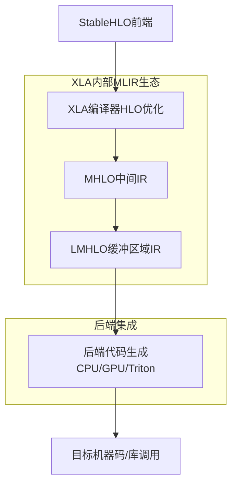
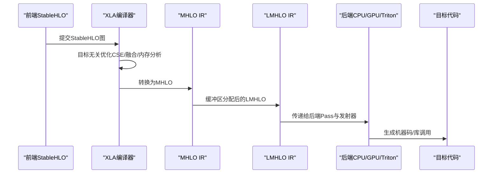
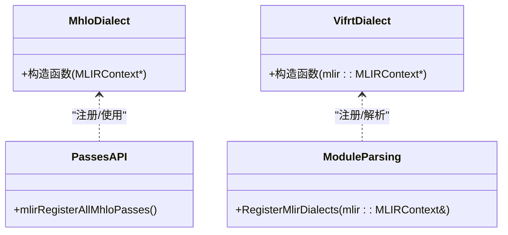
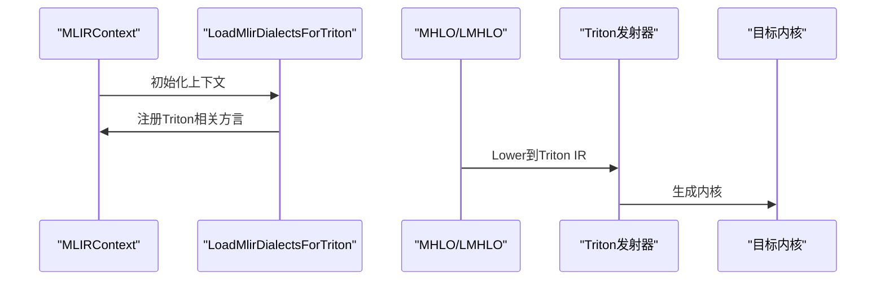
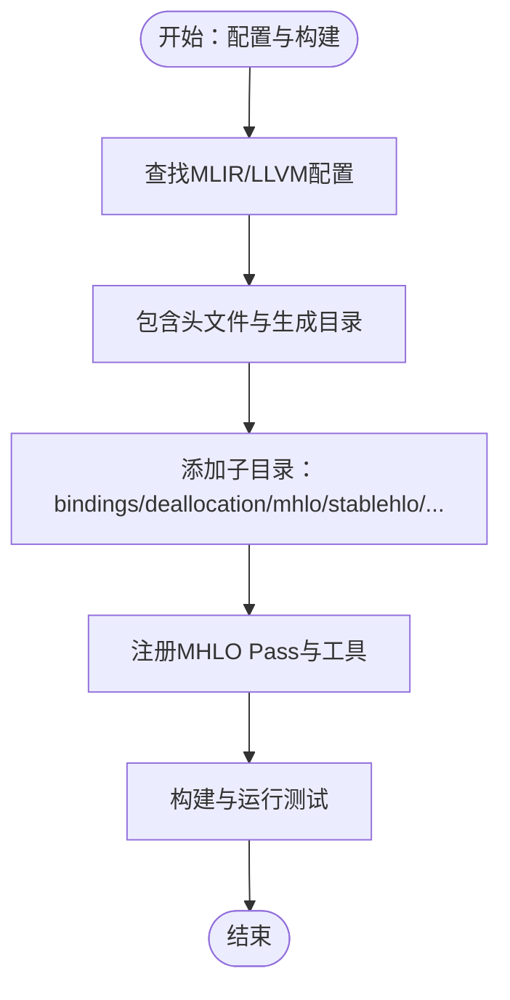
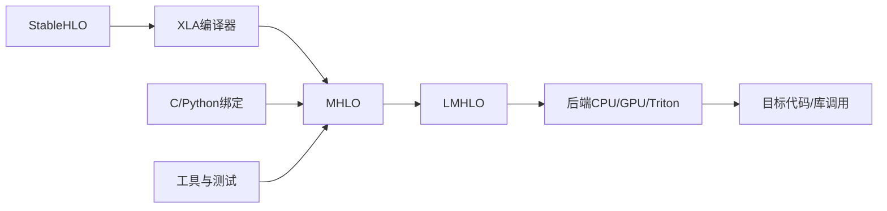

# MLIR框架基础

<cite>
**本文引用的文件**
- [xla\README.md](file://xla\README.md)
- [docs\architecture.md](file://docs\architecture.md)
- [xla\mlir_hlo\README.md](file://xla\mlir_hlo\README.md)
- [xla\mlir_hlo\CMakeLists.txt](file://xla\mlir_hlo\CMakeLists.txt)
- [xla\backends\gpu\codegen\triton\xtile_compiler.h](file://xla\backends\gpu\codegen\triton\xtile_compiler.h)
- [xla\codegen\ir_printing.h](file://xla\codegen\ir_printing.h)
- [xla\mlir_hlo\bindings\c\Passes.h](file://xla\mlir_hlo\bindings\c\Passes.h)
- [xla\mlir_hlo\mhlo\IR\hlo_ops.h](file://xla\mlir_hlo\mhlo\IR\hlo_ops.h)
- [xla\python\ifrt\ir\vifrt_dialect.h](file://xla\python\ifrt\ir\vifrt_dialect.h)
- [xla\python\ifrt\support\module_parsing.h](file://xla\python\ifrt\support\module_parsing.h)
- [xla\service\spmd\shardy\integrations\c\passes.h](file://xla\service\spmd\shardy\integrations\c\passes.h)
- [xla\service\spmd\shardy\utils.h](file://xla\service\spmd\shardy\utils.h)
- [docs\developer_environment.md](file://docs\developer_environment.md)
- [docs\build_from_source.md](file://docs\build_from_source.md)
- [docs\contributing.md](file://docs\contributing.md)
- [CONTRIBUTING.md](file://CONTRIBUTING.md)
- [.github\pull_request_template.md](file://.github\pull_request_template.md)
</cite>

## 目录
1. [引言](#引言)
2. [项目结构](#项目结构)
3. [核心组件](#核心组件)
4. [架构总览](#架构总览)
5. [详细组件分析](#详细组件分析)
6. [依赖关系分析](#依赖关系分析)
7. [性能考虑](#性能考虑)
8. [故障排查指南](#故障排查指南)
9. [结论](#结论)
10. [附录](#附录)

## 引言
本文件面向MLIR框架在XLA中的基础使用与集成，系统梳理XLA如何借助MLIR实现从高层稳定算子（StableHLO）到后端目标代码的编译与优化。重点覆盖：
- 基础架构：以StableHLO为入口，通过MHLO/LMHLO等中间表示进行跨方言优化与代码生成。
- 核心组件：MHLO/LMHLO方言、与后端（CPU/GPU/Triton）的集成点、C/Python绑定及注册机制。
- 设计原则：模块化、可扩展、跨后端统一IR、与StableHLO的双向转换。
- 集成方式：通过PJRT插件、后端代码生成器、Pass管道与工具链协同工作。
- 开发与测试：环境搭建、构建配置、测试方法与调试手段。
- 版本与兼容：StableHLO版本化、MHLO方言演进与迁移策略。
- 社区贡献：贡献流程、PR模板与代码审查标准。

## 项目结构
XLA仓库中与MLIR相关的关键位置与职责如下：
- xla/mlir_hlo：独立的MHLO/StableHLO实现与工具链，提供CMake构建、Python绑定、Pass与工具。
- xla/mlir：XLA内部MLIR基础设施（框架、工具、变换、运行时等），与mlir_hlo逐步收敛。
- xla/backends：CPU/GPU/Triton等后端，直接使用MLIR进行内核发射与优化。
- xla/pjrt：对外的执行与编译接口，作为MLIR/HLO编译管线的入口之一。
- docs：开发者环境、构建、架构与贡献指南等文档。

图表来源
- [docs\architecture.md](file://docs\architecture.md#L35-L72)
- [xla\README.md](file://xla\README.md#L39-L103)

章节来源
- [xla\README.md](file://xla\README.md#L19-L103)
- [docs\architecture.md](file://docs\architecture.md#L1-L72)

## 核心组件
- MHLO方言与操作集：用于表达HLO语义的中间IR，支持动态形状、多结果、控制流等扩展能力，是XLA内部优化与后端适配的核心。
- LMHLO方言：在完成缓冲区分配后，将内存布局与副作用显式化到IR中，便于后续代码生成。
- StableHLO：版本化的前端算子集合，作为XLA与各框架（TF/JAX等）之间的稳定桥梁。
- 后端适配层：CPU/GPU/Triton等后端通过MLIR Pass与发射器将MHLO/LMHLO映射为目标指令序列。
- C/Python绑定与注册：提供C API与Python绑定，统一注册所有MHLO Pass与管道，便于工具链与脚本集成。

章节来源
- [xla\mlir_hlo\README.md](file://xla\mlir_hlo\README.md#L106-L288)
- [xla\mlir_hlo\CMakeLists.txt](file://xla\mlir_hlo\CMakeLists.txt#L40-L174)
- [xla\mlir_hlo\bindings\c\Passes.h](file://xla\mlir_hlo\bindings\c\Passes.h#L23-L23)
- [xla\mlir_hlo\mhlo\IR\hlo_ops.h](file://xla\mlir_hlo\mhlo\IR\hlo_ops.h#L56-L56)
- [xla\python\ifrt\ir\vifrt_dialect.h](file://xla\python\ifrt\ir\vifrt_dialect.h#L35-L35)
- [xla\python\ifrt\support\module_parsing.h](file://xla\python\ifrt\support\module_parsing.h#L33-L33)

## 架构总览
XLA的MLIR编译路径以StableHLO为入口，经由XLA优化阶段转换为HLO IR，再由MHLO/LMHLO进行跨方言优化与目标特定优化，最终由后端生成目标代码。

图表来源
- [docs\architecture.md](file://docs\architecture.md#L35-L72)
- [xla\mlir_hlo\README.md](file://xla\mlir_hlo\README.md#L106-L288)

章节来源
- [docs\architecture.md](file://docs\architecture.md#L35-L72)

## 详细组件分析

### 组件A：MHLO/LMHLO方言与Pass体系
- MHLO方言：提供稳定的HLO语义表达，支持动态形状、多结果、控制流等扩展；作为实验性新算子与优化的试验场。
- LMHLO方言：在缓冲区分配完成后，将内存布局与副作用显式化，便于代码生成。
- Pass注册与工具：通过C API与Python绑定统一注册MHLO Pass与管道，便于在工具链与脚本中使用。

图表来源
- [xla\mlir_hlo\mhlo\IR\hlo_ops.h](file://xla\mlir_hlo\mhlo\IR\hlo_ops.h#L56-L56)
- [xla\python\ifrt\ir\vifrt_dialect.h](file://xla\python\ifrt\ir\vifrt_dialect.h#L35-L35)
- [xla\mlir_hlo\bindings\c\Passes.h](file://xla\mlir_hlo\bindings\c\Passes.h#L23-L23)
- [xla\python\ifrt\support\module_parsing.h](file://xla\python\ifrt\support\module_parsing.h#L33-L33)

章节来源
- [xla\mlir_hlo\README.md](file://xla\mlir_hlo\README.md#L106-L288)
- [xla\mlir_hlo\CMakeLists.txt](file://xla\mlir_hlo\CMakeLists.txt#L135-L174)

### 组件B：后端集成与发射器（CPU/GPU/Triton）
- Triton集成：通过加载必要的MLIR方言，将MHLO/LMHLO映射到Triton IR并进一步生成内核。
- CPU/GPU发射器：在后端侧直接使用MLIR进行算子级优化与内核发射，结合Arith/SCF/Vector/Tensor/LLVM等方言。

图表来源
- [xla\backends\gpu\codegen\triton\xtile_compiler.h](file://xla\backends\gpu\codegen\triton\xtile_compiler.h#L69-L69)

章节来源
- [xla\backends\gpu\codegen\triton\xtile_compiler.h](file://xla\backends\gpu\codegen\triton\xtile_compiler.h#L69-L69)

### 组件C：XLA内部MLIR工具与Pass注册
- 工具与测试：通过CMake子目录组织工具、变换与测试，统一构建与检查目标。
- Pass注册：在C/Python层统一注册MHLO Pass，便于在opt工具或脚本中使用。

图表来源
- [xla\mlir_hlo\CMakeLists.txt](file://xla\mlir_hlo\CMakeLists.txt#L86-L174)
- [xla\mlir_hlo\bindings\c\Passes.h](file://xla\mlir_hlo\bindings\c\Passes.h#L23-L23)

章节来源
- [xla\mlir_hlo\CMakeLists.txt](file://xla\mlir_hlo\CMakeLists.txt#L86-L174)
- [xla\mlir_hlo\bindings\c\Passes.h](file://xla\mlir_hlo\bindings\c\Passes.h#L23-L23)

### 组件D：XLA与StableHLO的转换与兼容
- StableHLO到MHLO：通过翻译工具将StableHLO算子集转换为MHLO，保持语义一致与版本化。
- 反向转换：支持将MHLO转换回HLO或导出为HLO协议格式，便于与现有XLA后端协同。

章节来源
- [xla\README.md](file://xla\README.md#L95-L103)

## 依赖关系分析
- 外部依赖：MLIR/LLVM作为基础设施，StableHLO作为前端算子集。
- 内部依赖：XLA编译器负责StableHLO到HLO的转换与优化；MHLO/LMHLO作为中间层；后端通过Pass与发射器对接目标硬件。
- 接口契约：C/Python绑定提供统一的Pass注册与工具调用接口；方言注册确保上下文一致性。

图表来源
- [docs\architecture.md](file://docs\architecture.md#L35-L72)
- [xla\mlir_hlo\CMakeLists.txt](file://xla\mlir_hlo\CMakeLists.txt#L162-L174)

章节来源
- [docs\architecture.md](file://docs\architecture.md#L35-L72)
- [xla\mlir_hlo\CMakeLists.txt](file://xla\mlir_hlo\CMakeLists.txt#L162-L174)

## 性能考虑
- 优化阶段分层：先做目标无关优化（如公共子表达式消除、融合、内存分析），再做目标特定优化（如GPU流划分、库调用模式匹配）。
- 缓冲区分配与内存调度：在LMHLO阶段显式化内存布局，减少中间缓冲区，降低内存占用。
- 后端代码生成：CPU/GPU后端使用LLVM生成高效机器码；Triton后端通过专用发射器生成内核。
- 调试与日志：可通过开关控制是否打印MLIR融合Pass的日志，辅助定位性能瓶颈。

章节来源
- [docs\architecture.md](file://docs\architecture.md#L46-L66)
- [xla\codegen\ir_printing.h](file://xla\codegen\ir_printing.h#L46-L46)

## 故障排查指南
- 日志与调试：启用MLIR融合Pass日志，定位优化阶段问题；结合后端发射器输出定位内核生成问题。
- 症状定位：若出现内存相关错误，检查LMHLO阶段的缓冲区分配与调度；若出现算子不支持，检查MHLO方言扩展与后端支持范围。
- 工具链：使用CMake/Ninja构建与测试，确保MLIR/LLVM版本与配置正确；必要时清理缓存重新构建。
- 文档参考：查阅开发者环境、构建与贡献指南，按步骤复现问题并收集日志。

章节来源
- [xla\codegen\ir_printing.h](file://xla\codegen\ir_printing.h#L46-L46)
- [docs\developer_environment.md](file://docs\developer_environment.md)
- [docs\build_from_source.md](file://docs\build_from_source.md)

## 结论
XLA通过MLIR实现了从StableHLO到目标代码的模块化、可扩展编译链路。MHLO/LMHLO作为中间层，既保留了HLO的稳定性，又引入了现代IR的灵活性；后端通过统一的Pass与发射器接入，保证了跨硬件的一致性与可移植性。配合完善的工具链、调试手段与文档，开发者可以高效地扩展与优化MLIR在XLA中的应用。

## 附录

### A. 开发环境搭建与构建
- 环境准备：参考开发者环境与源码构建文档，安装必要工具链与依赖。
- 构建步骤：使用CMake/Ninja配置与构建，确保MLIR/LLVM路径与版本正确。
- 测试方法：通过CMake目标运行测试，验证Pass与工具链功能。

章节来源
- [docs\developer_environment.md](file://docs\developer_environment.md)
- [docs\build_from_source.md](file://docs\build_from_source.md)
- [xla\mlir_hlo\CMakeLists.txt](file://xla\mlir_hlo\CMakeLists.txt#L160-L160)

### B. 版本管理与兼容策略
- StableHLO版本化：通过版本化的算子集保证前后端兼容性与迁移路径。
- MHLO方言演进：在XLA内部实验新算子与优化，逐步向StableHLO或上游MLIR迁移。
- 迁移指南：遵循文档中的迁移建议，确保从旧HLO到新IR的平滑过渡。

章节来源
- [docs\architecture.md](file://docs\architecture.md#L38-L41)
- [xla\mlir_hlo\README.md](file://xla\mlir_hlo\README.md#L1-L288)

### C. 社区贡献流程与代码审查
- 贡献流程：参考贡献指南与PR模板，提交变更前阅读文档并准备测试。
- 代码审查：遵循审查标准，确保变更符合模块化与可维护性要求。

章节来源
- [docs\contributing.md](file://docs\contributing.md)
- [CONTRIBUTING.md](file://CONTRIBUTING.md)
- [.github\pull_request_template.md](file://.github\pull_request_template.md)