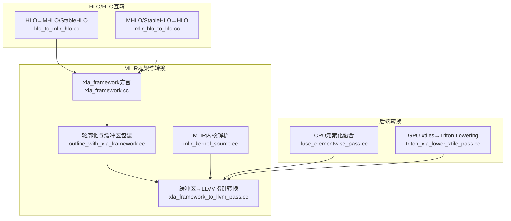
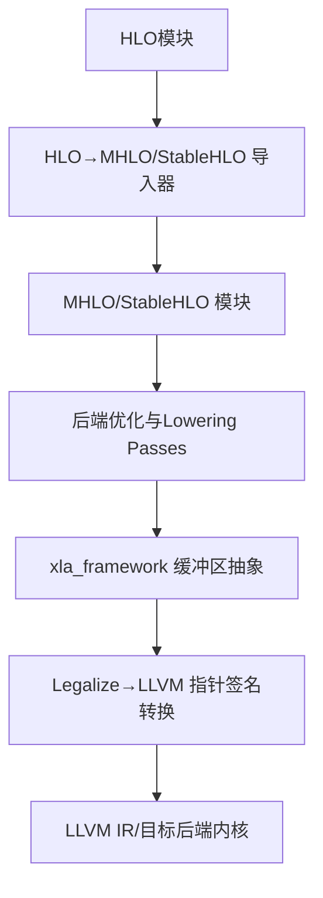
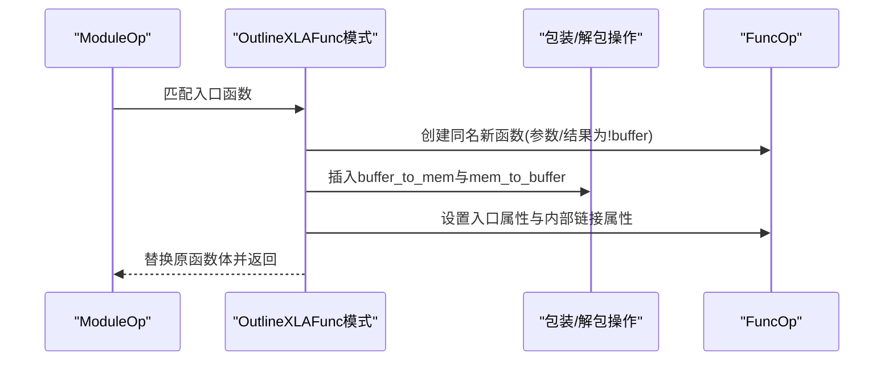
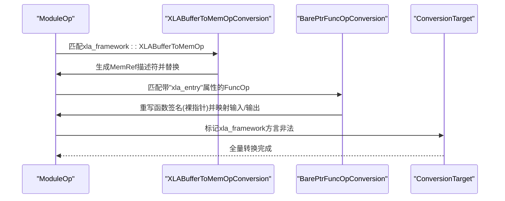
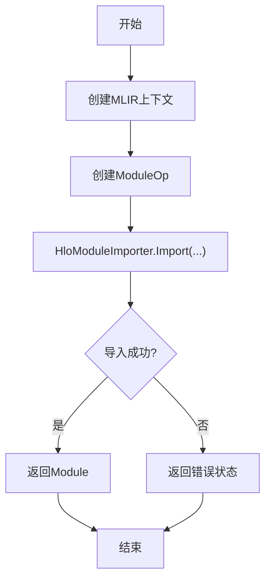
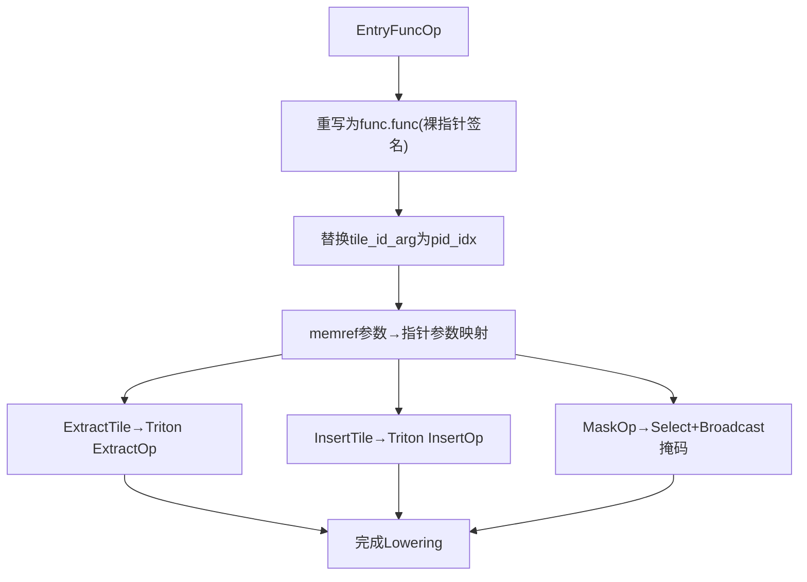
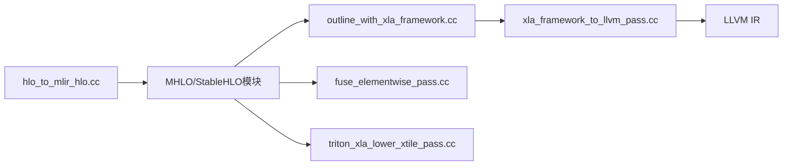

# MLIR转换工具

<cite>
**本文引用的文件**
- [xla/mlir/framework/ir/xla_framework.cc](file://xla/mlir/framework/ir/xla_framework.cc)
- [xla/mlir/framework/transforms/outline_with_xla_framework.cc](file://xla/mlir/framework/transforms/outline_with_xla_framework.cc)
- [xla/mlir/framework/transforms/xla_framework_to_llvm_pass.cc](file://xla/mlir/framework/transforms/xla_framework_to_llvm_pass.cc)
- [xla/codegen/mlir_kernel_source.cc](file://xla/codegen/mlir_kernel_source.cc)
- [xla/hlo/translate/hlo_to_mhlo/hlo_to_mlir_hlo.cc](file://xla/hlo/translate/hlo_to_mhlo/hlo_to_mlir_hlo.cc)
- [xla/hlo/translate/mhlo_to_hlo/mlir_hlo_to_hlo.cc](file://xla/hlo/translate/mhlo_to_hlo/mlir_hlo_to_hlo.cc)
- [xla/backends/cpu/codegen/tiled/transforms/fuse_elementwise_pass.cc](file://xla/backends/cpu/codegen/tiled/transforms/fuse_elementwise_pass.cc)
- [xla/backends/gpu/codegen/triton/transforms/triton_xla_lower_xtile_pass.cc](file://xla/backends/gpu/codegen/triton/transforms/triton_xla_lower_xtile_pass.cc)
- [xla/mlir/tools/mlir_interpreter/dialects/arith.cc](file://xla/mlir/tools/mlir_interpreter/dialects/arith.cc)
</cite>

## 目录
1. [简介](#简介)
2. [项目结构](#项目结构)
3. [核心组件](#核心组件)
4. [架构总览](#架构总览)
5. [详细组件分析](#详细组件分析)
6. [依赖关系分析](#依赖关系分析)
7. [性能考量](#性能考量)
8. [故障排除指南](#故障排除指南)
9. [结论](#结论)
10. [附录](#附录)

## 简介
本技术文档系统性梳理XLA中基于MLIR的转换工具与流水线，覆盖从HLO到MHLO/StableHLO的导入导出、框架级缓冲区抽象（xla_framework）的包装与LLVM转换、CPU/GPU后端特定的优化与Lowering Pass，以及MLIR内核解析与调试工具。文档面向不同层次读者，既提供高层架构视图，也包含代码级组件与数据流分析，并给出开发、调试与性能优化的实操建议。

## 项目结构
围绕MLIR转换的关键目录与文件如下：
- 框架与通用转换
  - xla/mlir/framework：定义xla_framework方言及其转换Pass（函数轮廓化、缓冲区类型到LLVM指针转换）
  - xla/codegen：MLIR内核字符串解析入口
  - xla/mlir/tools：MLIR解释器与工具（如算术方言解释器）
- HLO↔MHLO/StableHLO互转
  - xla/hlo/translate/hlo_to_mhlo：HLO导入为MHLO/StableHLO
  - xla/hlo/translate/mhlo_to_hlo：MHLO/StableHLO导出为HLO
- 后端特定转换
  - CPU：tiled路径下的元素化融合等优化
  - GPU：Triton路径下的xtile Lowering与相关优化

图表来源
- [xla/hlo/translate/hlo_to_mhlo/hlo_to_mlir_hlo.cc](file://xla/hlo/translate/hlo_to_mhlo/hlo_to_mlir_hlo.cc#L34-L80)
- [xla/hlo/translate/mhlo_to_hlo/mlir_hlo_to_hlo.cc](file://xla/hlo/translate/mhlo_to_hlo/mlir_hlo_to_hlo.cc#L1-L120)
- [xla/mlir/framework/ir/xla_framework.cc](file://xla/mlir/framework/ir/xla_framework.cc#L24-L52)
- [xla/mlir/framework/transforms/outline_with_xla_framework.cc](file://xla/mlir/framework/transforms/outline_with_xla_framework.cc#L44-L141)
- [xla/mlir/framework/transforms/xla_framework_to_llvm_pass.cc](file://xla/mlir/framework/transforms/xla_framework_to_llvm_pass.cc#L48-L202)
- [xla/codegen/mlir_kernel_source.cc](file://xla/codegen/mlir_kernel_source.cc#L37-L60)
- [xla/backends/cpu/codegen/tiled/transforms/fuse_elementwise_pass.cc](file://xla/backends/cpu/codegen/tiled/transforms/fuse_elementwise_pass.cc#L40-L78)
- [xla/backends/gpu/codegen/triton/transforms/triton_xla_lower_xtile_pass.cc](file://xla/backends/gpu/codegen/triton/transforms/triton_xla_lower_xtile_pass.cc#L89-L157)

章节来源
- [xla/hlo/translate/hlo_to_mhlo/hlo_to_mlir_hlo.cc](file://xla/hlo/translate/hlo_to_mhlo/hlo_to_mlir_hlo.cc#L34-L80)
- [xla/hlo/translate/mhlo_to_hlo/mlir_hlo_to_hlo.cc](file://xla/hlo/translate/mhlo_to_hlo/mlir_hlo_to_hlo.cc#L1-L120)
- [xla/mlir/framework/ir/xla_framework.cc](file://xla/mlir/framework/ir/xla_framework.cc#L24-L52)
- [xla/mlir/framework/transforms/outline_with_xla_framework.cc](file://xla/mlir/framework/transforms/outline_with_xla_framework.cc#L44-L141)
- [xla/mlir/framework/transforms/xla_framework_to_llvm_pass.cc](file://xla/mlir/framework/transforms/xla_framework_to_llvm_pass.cc#L48-L202)
- [xla/codegen/mlir_kernel_source.cc](file://xla/codegen/mlir_kernel_source.cc#L37-L60)
- [xla/backends/cpu/codegen/tiled/transforms/fuse_elementwise_pass.cc](file://xla/backends/cpu/codegen/tiled/transforms/fuse_elementwise_pass.cc#L40-L78)
- [xla/backends/gpu/codegen/triton/transforms/triton_xla_lower_xtile_pass.cc](file://xla/backends/gpu/codegen/triton/transforms/triton_xla_lower_xtile_pass.cc#L89-L157)

## 核心组件
- xla_framework方言与Pass
  - 定义缓冲区类型与包装/解包操作，支持将memref签名函数轮廓化为!xla_framework.buffer签名，并在调用前后进行类型转换。
  - 提供从xla_framework缓冲区到LLVM指针的转换，以适配后端调用约定。
- HLO↔MHLO/StableHLO互转
  - 将HLO模块导入为MHLO/StableHLO模块，或反向导出为HLO，支撑跨表示的迁移与验证。
- 后端优化与Lowering
  - CPU：元素化融合Pass，减少链式elementwise算子带来的调度与访存开销。
  - GPU：xtile到Triton Lowering Pass，将xla::xtile表达式映射为Triton IR并处理掩码、指针转换等。
- MLIR内核解析
  - 从字符串解析MLIR Module，用于内核源码注入与测试场景。

章节来源
- [xla/mlir/framework/ir/xla_framework.cc](file://xla/mlir/framework/ir/xla_framework.cc#L24-L52)
- [xla/mlir/framework/transforms/outline_with_xla_framework.cc](file://xla/mlir/framework/transforms/outline_with_xla_framework.cc#L44-L141)
- [xla/mlir/framework/transforms/xla_framework_to_llvm_pass.cc](file://xla/mlir/framework/transforms/xla_framework_to_llvm_pass.cc#L48-L202)
- [xla/hlo/translate/hlo_to_mhlo/hlo_to_mlir_hlo.cc](file://xla/hlo/translate/hlo_to_mhlo/hlo_to_mlir_hlo.cc#L34-L80)
- [xla/hlo/translate/mhlo_to_hlo/mlir_hlo_to_hlo.cc](file://xla/hlo/translate/mhlo_to_hlo/mlir_hlo_to_hlo.cc#L1-L120)
- [xla/backends/cpu/codegen/tiled/transforms/fuse_elementwise_pass.cc](file://xla/backends/cpu/codegen/tiled/transforms/fuse_elementwise_pass.cc#L40-L78)
- [xla/backends/gpu/codegen/triton/transforms/triton_xla_lower_xtile_pass.cc](file://xla/backends/gpu/codegen/triton/transforms/triton_xla_lower_xtile_pass.cc#L89-L157)
- [xla/codegen/mlir_kernel_source.cc](file://xla/codegen/mlir_kernel_source.cc#L37-L60)

## 架构总览
下图展示XLA MLIR转换的整体架构：HLO通过导入器进入MHLO/StableHLO；随后根据目标后端选择合适的优化与Lowering Pass；最终通过xla_framework进行缓冲区抽象与LLVM转换，生成可执行内核。

图表来源
- [xla/hlo/translate/hlo_to_mhlo/hlo_to_mlir_hlo.cc](file://xla/hlo/translate/hlo_to_mhlo/hlo_to_mlir_hlo.cc#L34-L80)
- [xla/hlo/translate/mhlo_to_hlo/mlir_hlo_to_hlo.cc](file://xla/hlo/translate/mhlo_to_hlo/mlir_hlo_to_hlo.cc#L1-L120)
- [xla/mlir/framework/transforms/outline_with_xla_framework.cc](file://xla/mlir/framework/transforms/outline_with_xla_framework.cc#L44-L141)
- [xla/mlir/framework/transforms/xla_framework_to_llvm_pass.cc](file://xla/mlir/framework/transforms/xla_framework_to_llvm_pass.cc#L48-L202)

## 详细组件分析

### 组件A：xla_framework方言与轮廓化Pass
- 功能要点
  - 在函数入口处将memref参数/结果替换为!xla_framework.buffer类型，并插入buffer↔memref的包装/解包操作。
  - 通过属性标记入口函数，确保Lowering阶段仅对全局可见的入口函数进行转换。
  - 转换后清理中间状态属性，避免重复轮廓化。
- 关键流程（轮廓化）

图表来源
- [xla/mlir/framework/transforms/outline_with_xla_framework.cc](file://xla/mlir/framework/transforms/outline_with_xla_framework.cc#L44-L141)

- 关键流程（缓冲区→LLVM指针）

图表来源
- [xla/mlir/framework/transforms/xla_framework_to_llvm_pass.cc](file://xla/mlir/framework/transforms/xla_framework_to_llvm_pass.cc#L48-L202)

章节来源
- [xla/mlir/framework/ir/xla_framework.cc](file://xla/mlir/framework/ir/xla_framework.cc#L24-L52)
- [xla/mlir/framework/transforms/outline_with_xla_framework.cc](file://xla/mlir/framework/transforms/outline_with_xla_framework.cc#L44-L141)
- [xla/mlir/framework/transforms/xla_framework_to_llvm_pass.cc](file://xla/mlir/framework/transforms/xla_framework_to_llvm_pass.cc#L48-L202)

### 组件B：HLO↔MHLO/StableHLO互转
- 功能要点
  - 提供多种重载的导入/导出接口，支持HloModuleProto与HloModule对象。
  - 导入时构建MLIR Module，导出时将稳定/非稳定HLO映射回HLO语义。
- 关键流程（导入）

图表来源
- [xla/hlo/translate/hlo_to_mhlo/hlo_to_mlir_hlo.cc](file://xla/hlo/translate/hlo_to_mhlo/hlo_to_mlir_hlo.cc#L34-L80)

章节来源
- [xla/hlo/translate/hlo_to_mhlo/hlo_to_mlir_hlo.cc](file://xla/hlo/translate/hlo_to_mhlo/hlo_to_mlir_hlo.cc#L34-L80)
- [xla/hlo/translate/mhlo_to_hlo/mlir_hlo_to_hlo.cc](file://xla/hlo/translate/mhlo_to_hlo/mlir_hlo_to_hlo.cc#L1-L120)

### 组件C：CPU元素化融合Pass
- 功能要点
  - 基于贪心重写驱动，将单使用者的elementwise算子融合，减少中间结果与访存。
  - 提高最大迭代次数以处理长链式融合。
- 复杂度与性能
  - 融合模式数量与迭代次数影响整体时间复杂度；合理设置迭代上限可平衡效果与耗时。

章节来源
- [xla/backends/cpu/codegen/tiled/transforms/fuse_elementwise_pass.cc](file://xla/backends/cpu/codegen/tiled/transforms/fuse_elementwise_pass.cc#L40-L78)

### 组件D：GPU xtiles→Triton Lowering Pass
- 功能要点
  - 将xla::xtile的EntryFunc、ExtractTile、InsertTile、Mask等操作Lowering为Triton IR。
  - 处理memref到指针的转换、掩码广播、维度映射与tile ID到program ID的替换。
- 关键流程（xtile→Triton）

图表来源
- [xla/backends/gpu/codegen/triton/transforms/triton_xla_lower_xtile_pass.cc](file://xla/backends/gpu/codegen/triton/transforms/triton_xla_lower_xtile_pass.cc#L89-L157)

章节来源
- [xla/backends/gpu/codegen/triton/transforms/triton_xla_lower_xtile_pass.cc](file://xla/backends/gpu/codegen/triton/transforms/triton_xla_lower_xtile_pass.cc#L89-L157)

### 组件E：MLIR内核解析
- 功能要点
  - 从字符串解析MLIR IR，封装诊断处理器，失败时返回详细错误信息。
- 使用场景
  - 内核字符串注入、单元测试加载、离线验证等。

章节来源
- [xla/codegen/mlir_kernel_source.cc](file://xla/codegen/mlir_kernel_source.cc#L37-L60)

### 组件F：MLIR解释器（算术方言）
- 功能要点
  - 提供算术操作（常量、比较、选择、位移、浮点/整数转换等）的解释器实现，支持张量与标量。
  - 通过注册宏将具体算子映射到解释器函数，便于调试与验证。
- 调试价值
  - 可用于快速验证算子语义与边界条件，辅助定位Lowering问题。

章节来源
- [xla/mlir/tools/mlir_interpreter/dialects/arith.cc](file://xla/mlir/tools/mlir_interpreter/dialects/arith.cc#L39-L307)

## 依赖关系分析
- 模块间耦合
  - HLO↔MHLO互转作为前端/后端桥梁，被所有后端Pass间接依赖。
  - xla_framework Pass独立于具体后端，但需要LLVM dialect支持。
  - 后端Pass（CPU/GPU）直接作用于MHLO/StableHLO或xtile IR。
- 外部依赖
  - MLIR Dialect（Func、LLVM、MemRef、Tensor、StableHLO、Triton等）
  - XLA类型与布局工具（形状、布局、精度配置等）

图表来源
- [xla/hlo/translate/hlo_to_mhlo/hlo_to_mlir_hlo.cc](file://xla/hlo/translate/hlo_to_mhlo/hlo_to_mlir_hlo.cc#L34-L80)
- [xla/mlir/framework/transforms/outline_with_xla_framework.cc](file://xla/mlir/framework/transforms/outline_with_xla_framework.cc#L44-L141)
- [xla/mlir/framework/transforms/xla_framework_to_llvm_pass.cc](file://xla/mlir/framework/transforms/xla_framework_to_llvm_pass.cc#L48-L202)
- [xla/backends/cpu/codegen/tiled/transforms/fuse_elementwise_pass.cc](file://xla/backends/cpu/codegen/tiled/transforms/fuse_elementwise_pass.cc#L40-L78)
- [xla/backends/gpu/codegen/triton/transforms/triton_xla_lower_xtile_pass.cc](file://xla/backends/gpu/codegen/triton/transforms/triton_xla_lower_xtile_pass.cc#L89-L157)

## 性能考量
- 贪心重写与迭代上限
  - 长链式elementwise融合需提高迭代上限，避免过早终止导致次优融合。
- Lowering路径选择
  - GPU路径中，xtile→Triton Lowering应尽量保持连续tile访问模式，减少额外的指针转换与掩码广播。
- 类型与布局
  - 导入/导出时保留布局信息，有助于后端生成更高效的访存与计算序列。
- 调试与验证
  - 使用解释器对关键算子进行语义验证，降低Lowering偏差带来的性能回退风险。

## 故障排除指南
- 解析失败
  - 若MLIR内核解析失败，检查字符串格式与诊断输出，定位具体位置与错误原因。
- 转换不生效
  - 确认目标函数是否带有入口属性，轮廓化与LLVM转换Pass是否按顺序执行。
  - 检查ConversionTarget是否正确标记xla_framework方言非法。
- 融合效果不佳
  - 调整融合控制函数与迭代上限，确保单使用者约束满足。
- GPU Lowering异常
  - 核对memref到指针映射、掩码广播维度与tile尺寸一致性，确认只对单维度掩码进行Lowering。

章节来源
- [xla/codegen/mlir_kernel_source.cc](file://xla/codegen/mlir_kernel_source.cc#L37-L60)
- [xla/mlir/framework/transforms/xla_framework_to_llvm_pass.cc](file://xla/mlir/framework/transforms/xla_framework_to_llvm_pass.cc#L233-L249)
- [xla/backends/cpu/codegen/tiled/transforms/fuse_elementwise_pass.cc](file://xla/backends/cpu/codegen/tiled/transforms/fuse_elementwise_pass.cc#L40-L78)
- [xla/backends/gpu/codegen/triton/transforms/triton_xla_lower_xtile_pass.cc](file://xla/backends/gpu/codegen/triton/transforms/triton_xla_lower_xtile_pass.cc#L244-L286)

## 结论
XLA的MLIR转换工具以HLO↔MHLO/StableHLO互转为核心，结合xla_framework的缓冲区抽象与后端特定的Lowering/优化Pass，形成从高层语义到目标后端内核的完整链路。通过合理的Pass组合与参数调优，可在保证正确性的前提下获得显著的性能收益。建议在新增Pass时遵循现有注册与测试模式，配合解释器与调试工具，确保转换质量与可维护性。

## 附录
- 开发指南（新增Pass）
  - 注册与生成：参考现有Pass的生成头文件与注册宏，确保名称唯一且符合命名规范。
  - 模式与目标：明确匹配条件、重写规则与ConversionTarget，必要时扩展TypeConverter。
  - 测试：提供最小可复现的MHLO/StableHLO样例，覆盖边界情况与错误路径。
- 配置与选项
  - 融合迭代上限：根据算子链长度调整，避免过早收敛。
  - Lowering参数：确保memref签名与指针签名一致，掩码维度与广播策略正确。
- 最佳实践
  - 保持Pass粒度单一，职责清晰；优先使用MLIR提供的重写驱动与转换框架。
  - 在导入/导出阶段保留布局与形状信息，减少后端推断成本。
  - 使用解释器进行算子级验证，建立回归测试集。