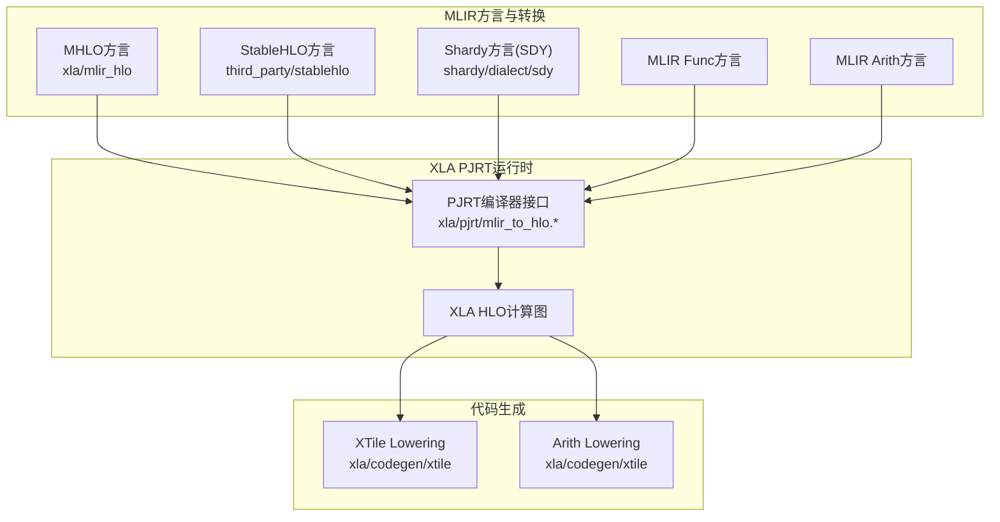
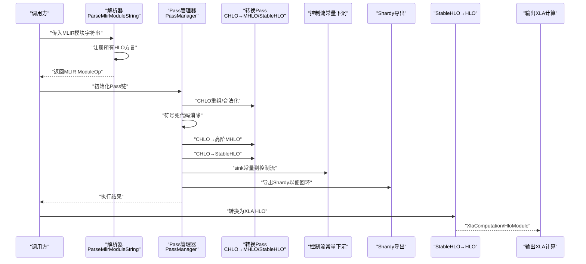
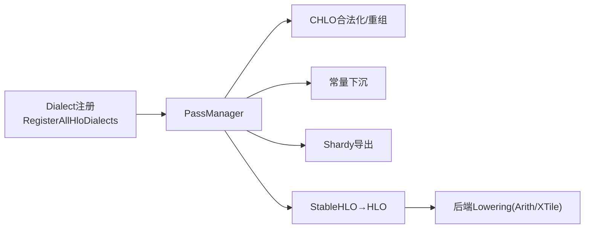

# MLIR集成架构

<cite>
**本文引用的文件**
- [xla\mlir_hlo\README.md](file://xla\mlir_hlo\README.md)
- [xla\mlir_hlo\CMakeLists.txt](file://xla\mlir_hlo\CMakeLists.txt)
- [xla\pjrt\mlir_to_hlo.h](file://xla\pjrt\mlir_to_hlo.h)
- [xla\pjrt\mlir_to_hlo.cc](file://xla\pjrt\mlir_to_hlo.cc)
- [xla\examples\axpy\stablehlo_axpy.mlir](file://xla\examples\axpy\stablehlo_axpy.mlir)
- [xla\examples\axpy\stablehlo_compile_test.cc](file://xla\examples\axpy\stablehlo_compile_test.cc)
- [xla\codegen\xtile\ir\transforms\lower_stablehlo_to_xtile.cc](file://xla\codegen\xtile\ir\transforms\lower_stablehlo_to_xtile.cc)
- [xla\codegen\xtile\ir\transforms\lower_stablehlo_to_arith.cc](file://xla\codegen\xtile\ir\transforms\lower_stablehlo_to_arith.cc)
- [xla\hlo\translate\hlo_to_mhlo\tests\import_emit_stablehlo.hlo](file://xla\hlo\translate\hlo_to_mhlo\tests\import_emit_stablehlo.hlo)
</cite>

## 目录
1. [引言](#引言)
2. [项目结构](#项目结构)
3. [核心组件](#核心组件)
4. [架构总览](#架构总览)
5. [组件详解](#组件详解)
6. [依赖关系分析](#依赖关系分析)
7. [性能考量](#性能考量)
8. [故障排查指南](#故障排查指南)
9. [结论](#结论)
10. [附录](#附录)

## 引言
本文件系统性阐述XLA在MLIR生态中的集成架构，重点覆盖：
- MHLO（MLIR HLO）与StableHLO扩展方言的设计与实现
- MLIR模块的构建、转换与优化流程
- MHLO与StableHLO之间的映射关系与转换机制
- 新HLO操作与属性在MLIR中的扩展方式
- MLIR Pass的开发、注册与测试方法
- MLIR中间表示的验证、调试与性能分析工具
- 最佳实践与常见问题解决方案

## 项目结构
XLA的MLIR集成主要由以下部分组成：
- xla/mlir_hlo：独立的“HLO”MLIR编译器（已标记为弃用，作为StableHLO迁移的过渡）
- xla/pjrt：面向运行时的MLIR到XLA HLO转换与序列化接口
- xla/codegen/xtile：StableHLO向底层算子（如Arith、XTile）的Lowering示例
- xla/examples/axpy：StableHLO示例与端到端编译测试
- xla/hlo/translate：HLO与MHLO/StableHLO互转的翻译层与测试

图表来源
- [xla\mlir_hlo\README.md](file://xla\mlir_hlo\README.md#L106-L119)
- [xla\pjrt\mlir_to_hlo.cc](file://xla\pjrt\mlir_to_hlo.cc#L85-L94)
- [xla\codegen\xtile\ir\transforms\lower_stablehlo_to_xtile.cc](file://xla\codegen\xtile\ir\transforms\lower_stablehlo_to_xtile.cc)
- [xla\codegen\xtile\ir\transforms\lower_stablehlo_to_arith.cc](file://xla\codegen\xtile\transforms\lower_stablehlo_to_arith.cc)

章节来源
- [xla\mlir_hlo\README.md](file://xla\mlir_hlo\README.md#L1-L288)
- [xla\mlir_hlo\CMakeLists.txt](file://xla\mlir_hlo\CMakeLists.txt#L162-L170)

## 核心组件
- MHLO方言与StableHLO方言
  - MHLO用于实验性HLO演进与中间优化；StableHLO提供稳定、可移植的序列化格式。
  - 两者均通过Dialect Registry在PJRT中统一注册。
- Shardy（SDY）方言
  - 与StableHLO协同工作，支持分片与并行传播，必要时进行round-trip导出以保留分片语义。
- PJRT编译器接口
  - 提供从字符串解析MLIR模块、注册方言、执行Pass链、转换为XLA HLO以及序列化的能力。
- 代码生成Lowering
  - 将StableHLO逐步Lower到Arith、XTile等底层方言，支撑后端生成。

章节来源
- [xla\pjrt\mlir_to_hlo.h](file://xla\pjrt\mlir_to_hlo.h#L37-L117)
- [xla\pjrt\mlir_to_hlo.cc](file://xla\pjrt\mlir_to_hlo.cc#L85-L94)

## 架构总览
XLA的MLIR集成采用“多方言+Pass链”的流水线式架构：
- 输入阶段：StableHLO/CHLO/MHLO/SDY等方言组合的MLIR模块
- 转换阶段：一系列Pass完成CHLO→MHLO/StableHLO、复杂数学展开、常量下推、Shardy导出等
- 导出阶段：转换为XLA HLO，再进入XLA后端生成与执行

图表来源
- [xla\pjrt\mlir_to_hlo.cc](file://xla\pjrt\mlir_to_hlo.cc#L96-L178)
- [xla\pjrt\mlir_to_hlo.h](file://xla\pjrt\mlir_to_hlo.h#L40-L56)

## 组件详解

### MHLO与StableHLO方言设计
- MHLO方言
  - 面向实验与中间优化，允许更多动态形状与扩展操作，便于向上游MLIR TCP演进。
  - 入口包括CHLO合法化、TF图编译器直接产出、EDSL构造等。
  - 出口包括LMHLO、Linalg/IREE、直接用于代码生成或回退到XLA HLO。
- StableHLO方言
  - 提供稳定、可移植的序列化格式，支持版本化字节码与兼容性降级。
  - 在PJRT中广泛使用，支持与SDY协同进行分片传播与回环。

章节来源
- [xla\mlir_hlo\README.md](file://xla\mlir_hlo\README.md#L176-L241)
- [xla\pjrt\mlir_to_hlo.h](file://xla\pjrt\mlir_to_hlo.h#L77-L117)

### MLIR模块构建与转换流程
- 模块构建
  - 使用DialectRegistry统一注册Arith、Func、MLProgram、Shape、MHLO、StableHLO、SDY等方言。
  - 支持从字符串解析MLIR模块，并进行版本化StableHLO升级。
- 转换与优化
  - CHLO→MHLO/StableHLO：处理TopK、Erf、RaggedDot等高阶操作的合法化与重组。
  - 复杂数学展开：将log1p等复杂数学函数展开为StableHLO基本操作。
  - 控制流常量下沉：为XLA功能化控制流准备数据布局。
  - Shardy导出：在需要回环传播时，将Shardy语义导出为StableHLO以便后续回环。
- 序列化
  - 默认使用MLIR字节码；若仅含StableHLO/SDY，则使用VHLO/SDY字节码以获得更强稳定性。
  - 支持请求目标版本的版本化StableHLO序列化，保障前后兼容。

章节来源
- [xla\pjrt\mlir_to_hlo.cc](file://xla\pjrt\mlir_to_hlo.cc#L85-L178)
- [xla\pjrt\mlir_to_hlo.h](file://xla\pjrt\mlir_to_hlo.h#L37-L117)

### MHLO与StableHLO映射与转换机制
- 映射关系
  - CHLO→MHLO：将客户端侧隐式广播与高阶操作映射到MHLO高阶语义。
  - CHLO→StableHLO：将无法映射到MHLO的操作映射到StableHLO。
  - StableHLO→HLO：最终转换为XLA HLO以进入传统XLA后端。
- 转换机制
  - 通过专用Pass链实现，包含符号死代码消除、常量下沉、Shardy导出等步骤。
  - 对于启用Shardy的场景，必要时导出纯StableHLO以确保回环传播正确性。

章节来源
- [xla\pjrt\mlir_to_hlo.cc](file://xla\pjrt\mlir_to_hlo.cc#L131-L149)
- [xla\pjrt\mlir_to_hlo.h](file://xla\pjrt\mlir_to_hlo.h#L58-L75)

### 扩展新的HLO操作与属性
- 在MLIR中扩展新操作与属性的方式
  - 定义新的方言与操作，遵循MLIR Dialect与Op定义规范。
  - 通过Interface与Type系统保证类型安全与边界验证。
  - 提供合法化（legalize）规则，将新操作Lower到现有稳定方言（如StableHLO/MHLO）。
- 在XLA中的落地
  - 通过PJRT接口注册新方言，确保解析与Pass链识别新操作。
  - 在StableHLO/MHLO层面提供映射与Lowering，保证后端可执行。

章节来源
- [xla\mlir_hlo\README.md](file://xla\mlir_hlo\README.md#L195-L198)
- [xla\pjrt\mlir_to_hlo.cc](file://xla\pjrt\mlir_to_hlo.cc#L85-L94)

### MLIR Pass的开发、注册与测试
- 开发与注册
  - 在对应子目录（如mhlo、stablehlo_ext、transforms）中新增Pass实现。
  - 通过CMake子目录组织与构建，确保Pass被纳入整体构建流程。
- 测试方法
  - 使用MLIR测试框架与Golden文件对比，验证Pass前后的IR变化。
  - 结合示例文件（如stablehlo_axpy.mlir）进行端到端编译测试。

章节来源
- [xla\mlir_hlo\CMakeLists.txt](file://xla\mlir_hlo\CMakeLists.txt#L162-L170)
- [xla\examples\axpy\stablehlo_compile_test.cc](file://xla\examples\axpy\stablehlo_compile_test.cc)

### 验证、调试与性能分析工具
- 验证
  - 使用Dialect Registry统一注册方言，确保解析与验证一致。
  - 通过版本化StableHLO序列化与升级，避免方言不兼容导致的解析失败。
- 调试
  - 利用MLIR Pass Pipeline日志与VLOG级别输出，定位转换失败点。
  - 在关键阶段打印Module IR，辅助定位Pass链中的问题。
- 性能分析
  - 通过Pass链的逐步执行与统计，评估各阶段的开销。
  - 在Lowering阶段结合后端特性（如Arith/XTile）进行针对性优化。

章节来源
- [xla\pjrt\mlir_to_hlo.cc](file://xla\pjrt\mlir_to_hlo.cc#L100-L159)
- [xla\pjrt\mlir_to_hlo.h](file://xla\pjrt\mlir_to_hlo.h#L81-L117)

### 端到端Lowering示例（StableHLO→Arith/XTile）
- Lowering路径
  - StableHLO逐步Lower到Arith与XTile，形成可执行的后端IR。
- 示例与测试
  - 提供Lowering测试用例与示例文件，验证Lowering正确性与一致性。

章节来源
- [xla\codegen\xtile\ir\transforms\lower_stablehlo_to_xtile.cc](file://xla\codegen\xtile\ir\transforms\lower_stablehlo_to_xtile.cc)
- [xla\codegen\xtile\ir\transforms\lower_stablehlo_to_arith.cc](file://xla\codegen\xtile\ir\transforms\lower_stablehlo_to_arith.cc)
- [xla\examples\axpy\stablehlo_axpy.mlir](file://xla\examples\axpy\stablehlo_axpy.mlir)

## 依赖关系分析
- 方言依赖
  - PJRT统一注册Arith、Func、MLProgram、Shape、MHLO、StableHLO、SDY等方言。
- Pass链依赖
  - CHLO→MHLO/StableHLO依赖于StableHLO扩展Pass与MHLO合法化Pass。
  - Shardy导出依赖Shardy Round-Trip Pipeline与属性设置。
- 后端依赖
  - Lowering阶段依赖Arith与XTile等后端方言，示例位于xtile子目录。

图表来源
- [xla\pjrt\mlir_to_hlo.cc](file://xla\pjrt\mlir_to_hlo.cc#L85-L178)
- [xla\codegen\xtile\ir\transforms\lower_stablehlo_to_xtile.cc](file://xla\codegen\xtile\ir\transforms\lower_stablehlo_to_xtile.cc)
- [xla\codegen\xtile\ir\transforms\lower_stablehlo_to_arith.cc](file://xla\codegen\xtile\ir\transforms\lower_stablehlo_to_arith.cc)

章节来源
- [xla\pjrt\mlir_to_hlo.cc](file://xla\pjrt\mlir_to_hlo.cc#L85-L94)

## 性能考量
- Pass链顺序与粒度
  - 将昂贵的数学展开与常量下沉放在早期，减少后续Lowering负担。
- 版本化序列化
  - 优先使用VHLO/SDY字节码以提升稳定性与兼容性，避免频繁升级带来的解析成本。
- Lowering策略
  - 在Arith/XTile层面进行融合与向量化，结合后端特性进行针对性优化。

## 故障排查指南
- 解析失败
  - 若解析StableHLO模块失败，检查当前StableHLO版本与插件版本是否匹配，必要时使用版本化StableHLO降级。
- Pass链失败
  - 关注诊断处理器返回的状态，结合VLOG级别输出定位具体Pass与错误位置。
- Shardy冲突
  - 当启用Shardy但检测到GSPMD属性或操作时，自动切换到GSPMD路径并禁用Shardy相关选项。

章节来源
- [xla\pjrt\mlir_to_hlo.cc](file://xla\pjrt\mlir_to_hlo.cc#L100-L159)
- [xla\pjrt\mlir_to_hlo.h](file://xla\pjrt\mlir_to_hlo.h#L58-L75)

## 结论
XLA的MLIR集成以StableHLO为核心，辅以MHLO与SDY方言，构建了从前端到后端的完整转换流水线。通过标准化的Pass链、严格的方言注册与版本化序列化，实现了对新HLO操作与属性的可扩展支持，并提供了完善的验证、调试与性能分析能力。建议在扩展新操作时优先考虑StableHLO/MHLO映射与Lowering路径，确保与XLA后端的兼容性与可维护性。

## 附录
- 示例与测试
  - 参考示例文件与测试用例，验证StableHLO Lowering与端到端编译流程。
- 历史与迁移
  - MHLO作为过渡方案，建议优先采用StableHLO以获得更好的生态兼容性。

章节来源
- [xla\examples\axpy\stablehlo_axpy.mlir](file://xla\examples\axpy\stablehlo_axpy.mlir)
- [xla\examples\axpy\stablehlo_compile_test.cc](file://xla\examples\axpy\stablehlo_compile_test.cc)
- [xla\mlir_hlo\README.md](file://xla\mlir_hlo\README.md#L1-L288)