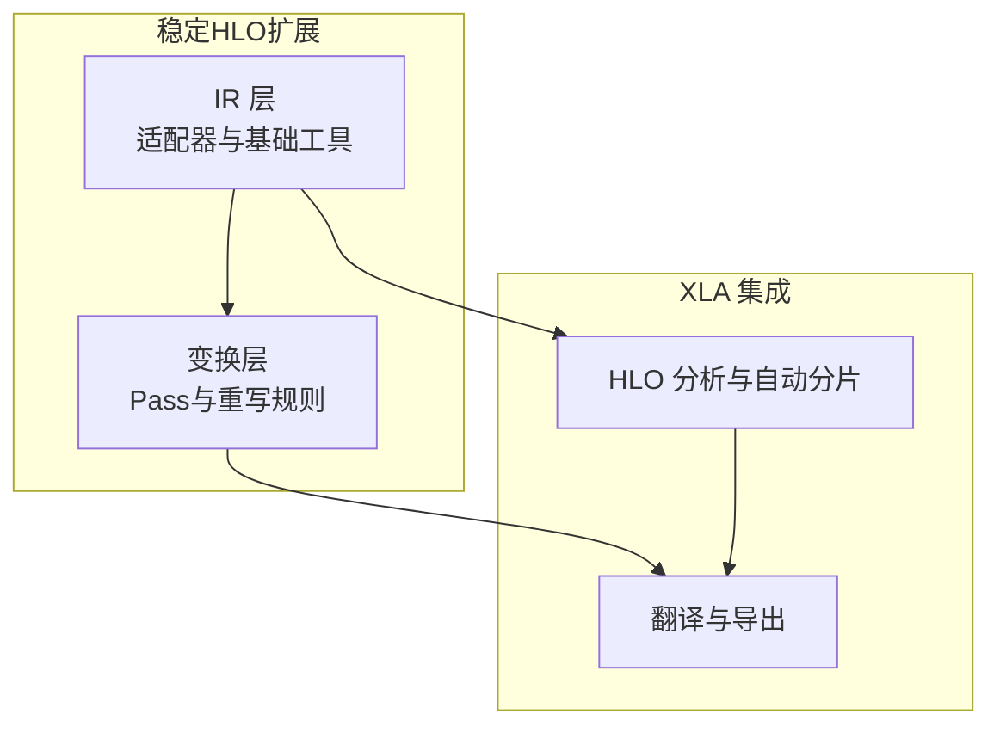
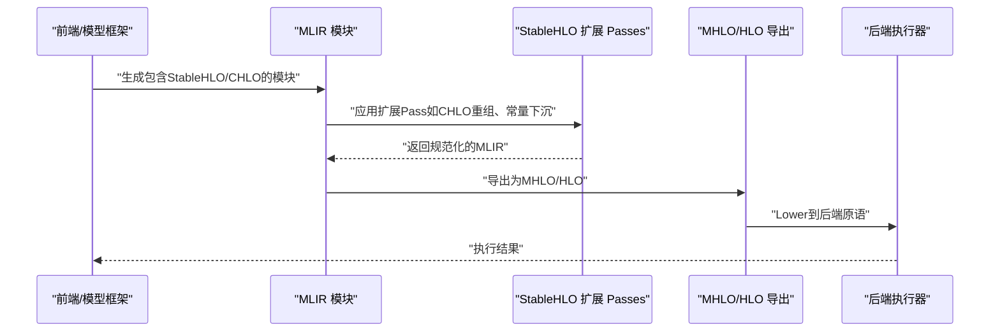
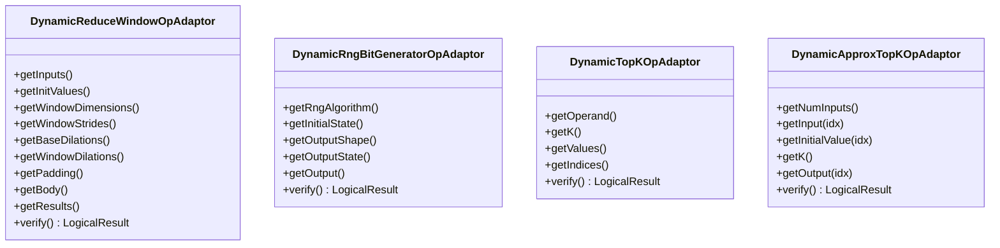
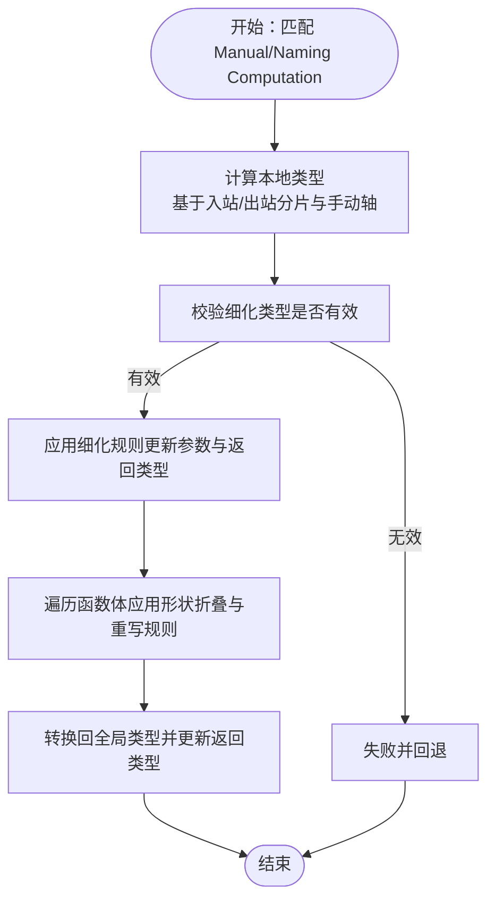
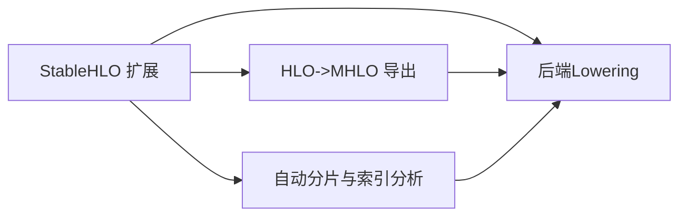

# StableHLO扩展

<cite>
**本文引用的文件**
- [README.md](file://xla/mlir_hlo/stablehlo_ext/README.md)
- [stablehlo_ops.h](file://xla/mlir_hlo/stablehlo_ext/IR/stablehlo_ops.h)
- [stablehlo_ops.cpp](file://xla/mlir_hlo/stablehlo_ext/IR/stablehlo_ops.cpp)
- [base.h](file://xla/mlir_hlo/stablehlo_ext/IR/base.h)
- [passes.h](file://xla/mlir_hlo/stablehlo_ext/transforms/passes.h)
- [sdy_refine_shapes.h](file://xla/mlir_hlo/stablehlo_ext/transforms/sdy_refine_shapes.h)
- [sdy_refine_shapes.cpp](file://xla/mlir_hlo/stablehlo_ext/transforms/sdy_refine_shapes.cpp)
- [stablehlo.cc](file://xla/hlo/translate/stablehlo.cc)
- [mlir_hlo_to_hlo.cc](file://xla/hlo/translate/mhlo_to_hlo/mlir_hlo_to_hlo.cc)
- [stablehlo_indexing_analysis.h](file://xla/hlo/analysis/stablehlo_indexing_analysis.h)
- [stablehlo_indexing_analysis.cc](file://xla/hlo/analysis/stablehlo_indexing_analysis.cc)
- [auto_sharding_stablehlo_pass.h](file://xla/hlo/experimental/auto_sharding/auto_sharding_stablehlo_pass.h)
- [auto_sharding_stablehlo_pass.cc](file://xla/hlo/experimental/auto_sharding/auto_sharding_stablehlo_pass.cc)
- [stablehlo_utils.h](file://xla/hlo/experimental/auto_sharding/stablehlo_utils.h)
- [stablehlo_utils.cc](file://xla/hlo/experimental/auto_sharding/stablehlo_utils.cc)
- [stablehlo_axpy.mlir](file://xla/examples/axpy/stablehlo_axpy.mlir)
- [BUILD（mlir_hlo）](file://xla/mlir_hlo/BUILD)
</cite>

## 目录
1. [引言](#引言)
2. [项目结构](#项目结构)
3. [核心组件](#核心组件)
4. [架构总览](#架构总览)
5. [组件详解](#组件详解)
6. [依赖关系分析](#依赖关系分析)
7. [性能考量](#性能考量)
8. [故障排查指南](#故障排查指南)
9. [结论](#结论)
10. [附录](#附录)

## 引言
本文件为XLA中StableHLO扩展的技术文档，聚焦于StableHLO方言在XLA编译流水线中的扩展实现与应用。StableHLO扩展通过引入一组XLA特定的适配器与变换，增强对动态形状、TopK/近似TopK、随机数生成等场景的支持，并在保持与标准StableHLO语义一致的前提下，提供更贴近XLA后端优化与Lowering需求的能力。本文将从设计目标、核心特性、与标准StableHLO的关系、操作与属性系统、验证机制、调试与性能分析、应用场景与迁移指南等方面进行系统阐述。

## 项目结构
StableHLO扩展主要位于xla/mlir_hlo/stablehlo_ext目录下，包含IR层的适配器定义与实现、变换层的Pass集合以及与XLA其他模块的集成点。同时，XLA的HLO分析与自动分片模块也广泛使用StableHLO扩展能力。

图表来源
- [README.md](file://xla/mlir_hlo/stablehlo_ext/README.md#L1-L10)
- [stablehlo_ops.h](file://xla/mlir_hlo/stablehlo_ext/IR/stablehlo_ops.h#L19-L31)
- [stablehlo_ops.cpp](file://xla/mlir_hlo/stablehlo_ext/IR/stablehlo_ops.cpp#L33-L34)
- [passes.h](file://xla/mlir_hlo/stablehlo_ext/transforms/passes.h#L27-L38)
- [sdy_refine_shapes.cpp](file://xla/mlir_hlo/stablehlo_ext/transforms/sdy_refine_shapes.cpp#L49-L50)

章节来源
- [README.md](file://xla/mlir_hlo/stablehlo_ext/README.md#L1-L10)
- [BUILD（mlir_hlo）](file://xla/mlir_hlo/BUILD#L912-L962)

## 核心组件
- IR适配器：以“伪自定义调用”的形式封装动态版本的ReduceWindow、RngBitGenerator、TopK、ApproxTopK等算子，提供统一的访问器与验证逻辑，便于在编译流程中直接Lower到MHLO或后端。
- 变换与Pass：包含CHLO保留高层算子、常量下沉至控制流、形状细化、符号化形状优化等Pass，提升编译期可读性与运行时性能。
- 形状细化与重写：针对Shardy等方言的Manual/Naming Computation，提供基于分片与局部类型推导的形状细化规则，确保全局类型与局部类型一致。
- 集成点：与HLO翻译、MHLO/HLO导出、自动分片、索引分析等模块协同工作。

章节来源
- [stablehlo_ops.h](file://xla/mlir_hlo/stablehlo_ext/IR/stablehlo_ops.h#L33-L294)
- [stablehlo_ops.cpp](file://xla/mlir_hlo/stablehlo_ext/IR/stablehlo_ops.cpp#L36-L633)
- [passes.h](file://xla/mlir_hlo/stablehlo_ext/transforms/passes.h#L30-L36)
- [sdy_refine_shapes.h](file://xla/mlir_hlo/stablehlo_ext/transforms/sdy_refine_shapes.h#L25-L27)
- [sdy_refine_shapes.cpp](file://xla/mlir_hlo/stablehlo_ext/transforms/sdy_refine_shapes.cpp#L403-L409)

## 架构总览
StableHLO扩展在XLA中的位置如下：前端生成的MLIR模块经由StableHLO扩展的Pass进行规范化与Lowering，随后进入MHLO/HLO导出阶段，最终被后端执行器消费。

图表来源
- [stablehlo.cc](file://xla/hlo/translate/stablehlo.cc#L70-L87)
- [mlir_hlo_to_hlo.cc](file://xla/hlo/translate/mhlo_to_hlo/mlir_hlo_to_hlo.cc#L5227-L5233)

## 组件详解

### IR适配器与验证
IR适配器以“伪自定义调用”承载动态版本的算子，提供统一的访问器与严格的验证逻辑，确保在Lower前满足语义约束。

图表来源
- [stablehlo_ops.h](file://xla/mlir_hlo/stablehlo_ext/IR/stablehlo_ops.h#L60-L294)
- [stablehlo_ops.cpp](file://xla/mlir_hlo/stablehlo_ext/IR/stablehlo_ops.cpp#L36-L633)

章节来源
- [stablehlo_ops.h](file://xla/mlir_hlo/stablehlo_ext/IR/stablehlo_ops.h#L33-L294)
- [stablehlo_ops.cpp](file://xla/mlir_hlo/stablehlo_ext/IR/stablehlo_ops.cpp#L36-L227)

### 形状细化与类型推断
针对Shardy方言的Manual/Naming Computation，扩展提供基于分片与局部类型推导的形状细化规则，确保全局类型与局部类型一致，并支持对函数体内的类型重写。

图表来源
- [sdy_refine_shapes.cpp](file://xla/mlir_hlo/stablehlo_ext/transforms/sdy_refine_shapes.cpp#L231-L338)

章节来源
- [sdy_refine_shapes.h](file://xla/mlir_hlo/stablehlo_ext/transforms/sdy_refine_shapes.h#L25-L27)
- [sdy_refine_shapes.cpp](file://xla/mlir_hlo/stablehlo_ext/transforms/sdy_refine_shapes.cpp#L231-L338)

### 变换与Pass体系
扩展提供一系列Pass，用于：
- 将CHLO高层算子保留为稳定表达，避免过度分解导致的性能损失；
- 将常量下沉至控制流，减少冗余数据传输；
- 进行符号化形状优化与准备导出；
- 对动态算子进行形状细化与类型推断。

章节来源
- [passes.h](file://xla/mlir_hlo/stablehlo_ext/transforms/passes.h#L30-L36)
- [stablehlo.cc](file://xla/hlo/translate/stablehlo.cc#L70-L87)
- [mlir_hlo_to_hlo.cc](file://xla/hlo/translate/mhlo_to_hlo/mlir_hlo_to_hlo.cc#L5227-L5233)

### 与标准StableHLO的关系
- 扩展以“伪自定义调用”承载动态算子，语义上继承标准StableHLO对应算子，但允许在某些维度上使用动态形状或动态参数；
- 在Lower阶段，扩展Pass会将这些伪自定义调用映射为MHLO支持的原语，或进行必要的分解与重组；
- 扩展不改变StableHLO的核心语义，仅在XLA编译期增强表达力与优化空间。

章节来源
- [README.md](file://xla/mlir_hlo/stablehlo_ext/README.md#L1-L10)
- [stablehlo_ops.h](file://xla/mlir_hlo/stablehlo_ext/IR/stablehlo_ops.h#L19-L31)

### 应用场景与优势
- 动态TopK/近似TopK：在动态批大小或动态K值场景下，仍能保持稳定的Lowering路径；
- 动态ReduceWindow：窗口尺寸、步长等参数可为动态张量，降低静态约束带来的限制；
- 动态RngBitGenerator：输出形状可由外部参数决定，提升灵活性；
- 自动分片与索引分析：扩展在XLA的自动分片与索引分析中得到广泛应用，提升大规模并行编译的准确性与效率。

章节来源
- [stablehlo_indexing_analysis.h](file://xla/hlo/analysis/stablehlo_indexing_analysis.h)
- [stablehlo_indexing_analysis.cc](file://xla/hlo/analysis/stablehlo_indexing_analysis.cc)
- [auto_sharding_stablehlo_pass.h](file://xla/hlo/experimental/auto_sharding/auto_sharding_stablehlo_pass.h)
- [auto_sharding_stablehlo_pass.cc](file://xla/hlo/experimental/auto_sharding/auto_sharding_stablehlo_pass.cc)
- [stablehlo_utils.h](file://xla/hlo/experimental/auto_sharding/stablehlo_utils.h)
- [stablehlo_utils.cc](file://xla/hlo/experimental/auto_sharding/stablehlo_utils.cc)

### 使用示例与迁移指南
- 示例：AXPY示例展示了StableHLO的基本用法，包括广播、乘法与加法组合。
- 迁移建议：
  - 将CHLO中的TopK/Erf/Tan等算子通过扩展Pass保留为稳定表达，避免分解；
  - 在需要动态形状的场景下，优先使用扩展提供的动态算子适配器；
  - 在自动分片与索引分析阶段，确保模块已通过扩展Pass进行规范化。

章节来源
- [stablehlo_axpy.mlir](file://xla/examples/axpy/stablehlo_axpy.mlir#L1-L10)
- [stablehlo.cc](file://xla/hlo/translate/stablehlo.cc#L70-L87)

## 依赖关系分析
StableHLO扩展与XLA其他模块存在紧密耦合，主要体现在以下方面：
- 与HLO翻译链路：在从MLIR到HLO的导出过程中，扩展Pass负责准备与优化；
- 与自动分片与索引分析：扩展在这些模块中被广泛使用，以提升分片决策与索引推断的准确性；
- 与后端Lowering：扩展将动态算子Lower为MHLO支持的原语，便于后端执行器处理。

图表来源
- [mlir_hlo_to_hlo.cc](file://xla/hlo/translate/mhlo_to_hlo/mlir_hlo_to_hlo.cc#L5227-L5233)
- [auto_sharding_stablehlo_pass.cc](file://xla/hlo/experimental/auto_sharding/auto_sharding_stablehlo_pass.cc)
- [stablehlo_indexing_analysis.cc](file://xla/hlo/analysis/stablehlo_indexing_analysis.cc)

章节来源
- [BUILD（mlir_hlo）](file://xla/mlir_hlo/BUILD#L912-L962)

## 性能考量
- 动态算子的Lowering成本：动态参数在Lower阶段可能引入额外的运行时检查与分支，需结合具体后端评估影响；
- 形状细化与类型推断：通过扩展的形状细化Pass，可在编译期确定更精确的形状，减少运行时开销；
- 常量下沉与控制流融合：将常量下沉至控制流可减少带宽占用，提高整体吞吐；
- 自动分片策略：结合扩展的索引分析与分片Pass，可获得更优的分布式执行计划。

## 故障排查指南
- 验证失败：若适配器验证失败，通常由输入类型、形状或属性不满足约束引起。请检查输入张量的元素类型、秩与形状是否符合要求；
- Lower阶段错误：若在导出或Lower阶段出现错误，确认扩展Pass是否正确应用，以及动态参数是否满足后端支持范围；
- 调试工具：利用XLA的HLO转储与可视化工具，定位问题发生在哪个Pass或哪个算子上；
- 性能分析：结合XLA的性能剖析工具，识别瓶颈所在，必要时调整Pass顺序或启用更激进的形状细化策略。

章节来源
- [stablehlo_ops.cpp](file://xla/mlir_hlo/stablehlo_ext/IR/stablehlo_ops.cpp#L36-L227)
- [mlir_hlo_to_hlo.cc](file://xla/hlo/translate/mhlo_to_hlo/mlir_hlo_to_hlo.cc#L5227-L5233)

## 结论
StableHLO扩展通过在XLA编译流水线上引入动态算子适配器与一系列优化Pass，在保持与标准StableHLO语义一致的同时，显著增强了对动态形状与复杂算子的支持。它在自动分片、索引分析、形状细化与Lower阶段均发挥关键作用，为XLA在大规模并行与高性能执行场景提供了坚实基础。未来可进一步完善动态算子的标准化与上游合并，持续提升跨框架与后端的兼容性与稳定性。

## 附录
- 相关文件清单与用途概览见“项目结构”与“核心组件”部分。
- 更多示例与教程可参考XLA示例与文档目录。