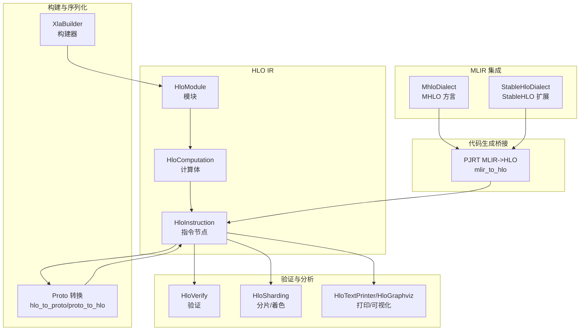
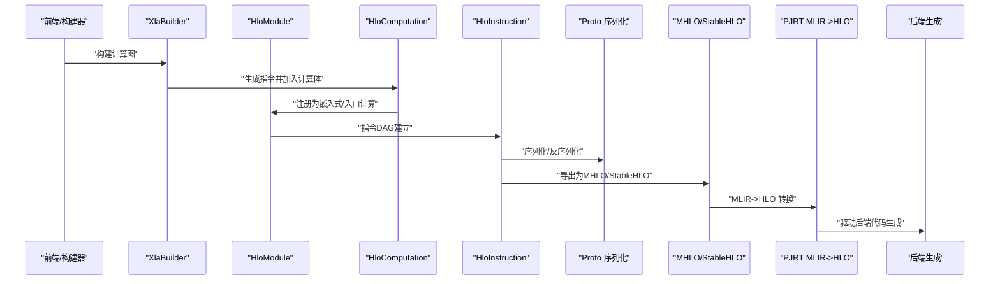
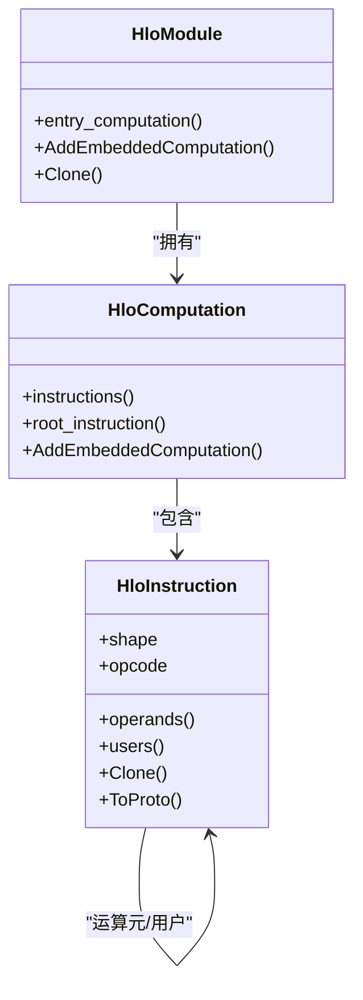
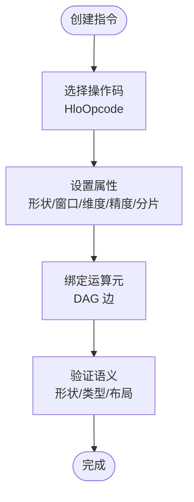
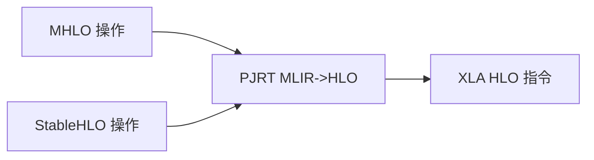
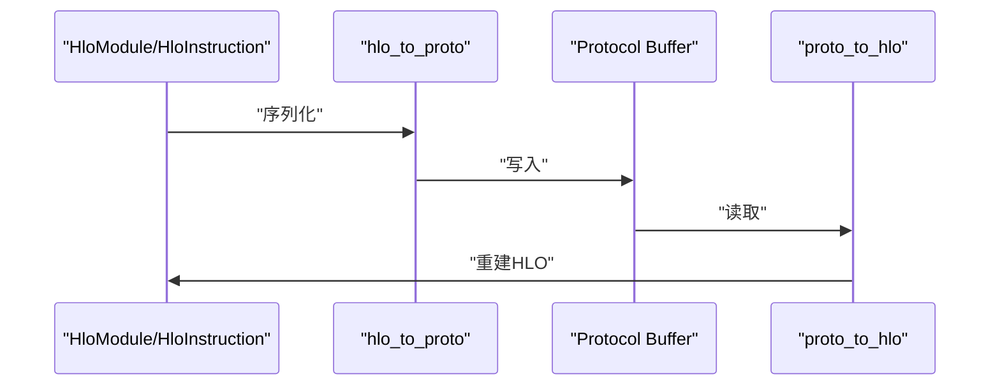
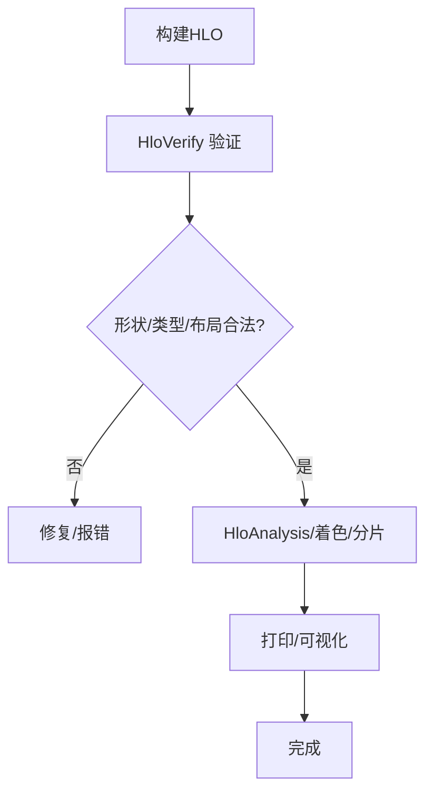
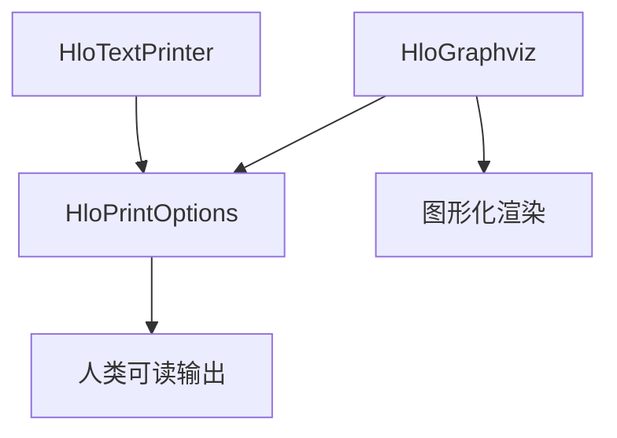
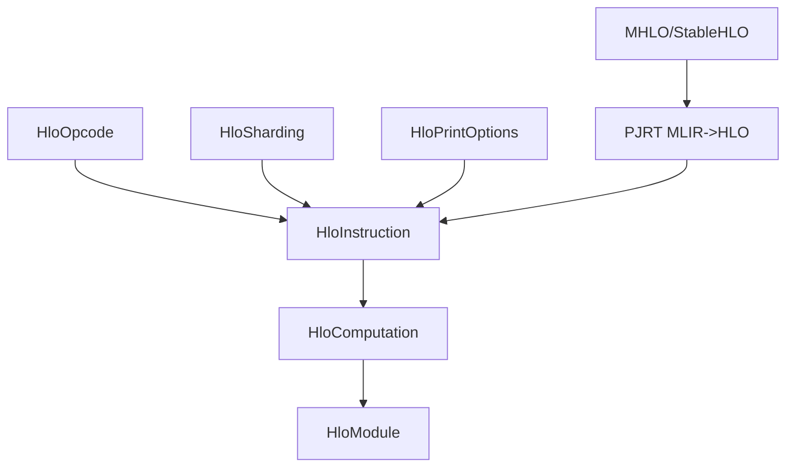

# 中间表示层

<cite>
**本文引用的文件**
- [xla\hlo\ir\hlo_instruction.h](file://xla\hlo\ir\hlo_instruction.h)
- [xla\hlo\ir\hlo_opcode.h](file://xla\hlo\ir\hlo_opcode.h)
- [xla\hlo\ir\hlo_module.h](file://xla\hlo\ir\hlo_module.h)
- [xla\hlo\builder\xla_builder.h](file://xla\hlo\builder\xla_builder.h)
- [xla\mlir_hlo\mhlo\dialect\MhloDialect.h](file://xla\mlir_hlo\mhlo\dialect\MhloDialect.h)
- [xla\mlir_hlo\stablehlo_ext\StableHloDialect.h](file://xla\mlir_hlo\stablehlo_ext\StableHloDialect.h)
- [xla\pjrt\mlir_to_hlo.h](file://xla\pjrt\mlir_to_hlo.h)
- [xla\pjrt\mlir_to_hlo.cc](file://xla\pjrt\mlir_to_hlo.cc)
- [xla\hlo\translate\hlo_to_proto.h](file://xla\hlo\translate\hlo_to_proto.h)
- [xla\hlo\translate\hlo_to_proto.cc](file://xla\hlo\translate\hlo_to_proto.cc)
- [xla\hlo\translate\proto_to_hlo.h](file://xla\hlo\translate\proto_to_hlo.h)
- [xla\hlo\translate\proto_to_hlo.cc](file://xla\hlo\translate\proto_to_hlo.cc)
- [xla\hlo\transforms\hlo_verify.h](file://xla\hlo\transforms\hlo_verify.h)
- [xla\hlo\transforms\hlo_verify.cc](file://xla\hlo\transforms\hlo_verify.cc)
- [xla\hlo\analysis\hlo_analysis.h](file://xla\hlo\analysis\hlo_analysis.h)
- [xla\hlo\analysis\hlo_analysis.cc](file://xla\hlo\analysis\hlo_analysis.cc)
- [xla\hlo\tools\hlo_text_printer.h](file://xla\hlo\tools\hlo_text_printer.h)
- [xla\hlo\tools\hlo_text_printer.cc](file://xla\hlo\tools\hlo_text_printer.cc)
- [xla\hlo\tools\hlo_graphviz.cc](file://xla\hlo\tools\hlo_graphviz.cc)
- [xla\hlo\tools\hlo_graphviz.h](file://xla\hlo\tools\hlo_graphviz.h)
- [xla\codegen\ir_printing.h](file://xla\codegen\ir_printing.h)
- [xla\codegen\ir_printing.cc](file://xla\codegen\ir_printing.cc)
- [xla\hlo\ir\hlo_print_options.h](file://xla\hlo\ir\hlo_print_options.h)
- [xla\hlo\ir\hlo_print_options.cc](file://xla\hlo\ir\hlo_print_options.cc)
- [xla\hlo\ir\hlo_sharding.h](file://xla\hlo\ir\hlo_sharding.h)
- [xla\hlo\ir\hlo_sharding.cc](file://xla\hlo\ir\hlo_sharding.cc)
- [xla\hlo\ir\backend_config.h](file://xla\hlo\ir\backend_config.h)
- [xla\hlo\ir\backend_config.cc](file://xla\hlo\ir\backend_config.cc)
- [xla\hlo\ir\hlo_computation.h](file://xla\hlo\ir\hlo_computation.h)
- [xla\hlo\ir\hlo_computation.cc](file://xla\hlo\ir\hlo_computation.cc)
- [xla\hlo\ir\dfs_hlo_visitor.h](file://xla\hlo\ir\dfs_hlo_visitor.h)
- [xla\hlo\ir\dfs_hlo_visitor.cc](file://xla\hlo\ir\dfs_hlo_visitor.cc)
- [xla\hlo\ir\hlo_domain_metadata.h](file://xla\hlo\ir\hlo_domain_metadata.h)
- [xla\hlo\ir\hlo_domain_metadata.cc](file://xla\hlo\ir\hlo_domain_metadata.cc)
- [xla\hlo\ir\hlo_module_metadata.h](file://xla\hlo\ir\hlo_module_metadata.h)
- [xla\hlo\ir\hlo_module_metadata.cc](file://xla\hlo\ir\hlo_module_metadata.cc)
- [xla\hlo\ir\hlo_original_value.h](file://xla\hlo\ir\hlo_original_value.h)
- [xla\hlo\ir\hlo_original_value.cc](file://xla\hlo\ir\hlo_original_value.cc)
- [xla\hlo\ir\hlo_input_output_alias_config.h](file://xla\hlo\ir\hlo_input_output_alias_config.h)
- [xla\hlo\ir\hlo_input_output_alias_config.cc](file://xla\hlo\ir\hlo_input_output_alias_config.cc)
- [xla\hlo\ir\hlo_clone_context.h](file://xla\hlo\ir\hlo_clone_context.h)
- [xla\hlo\ir\hlo_clone_context.cc](file://xla\hlo\ir\hlo_clone_context.cc)
- [xla\hlo\ir\hlo_schedule.h](file://xla\hlo\ir\hlo_schedule.h)
- [xla\hlo\ir\hlo_schedule.cc](file://xla\hlo\ir\hlo_schedule.cc)
- [xla\hlo\ir\hlo_instruction.cc](file://xla\hlo\ir\hlo_instruction.cc)
- [xla\hlo\ir\hlo_computation.cc](file://xla\hlo\ir\hlo_computation.cc)
- [xla\hlo\ir\hlo_module.cc](file://xla\hlo\ir\hlo_module.cc)
- [xla\hlo\ir\hlo_opcode.cc](file://xla\hlo\ir\hlo_opcode.cc)
- [xla\hlo\ir\hlo_instruction_test.cc](file://xla\hlo\ir\hlo_instruction_test.cc)
- [xla\hlo\ir\hlo_module_test.cc](file://xla\hlo\ir\hlo_module_test.cc)
- [xla\hlo\ir\hlo_computation_test.cc](file://xla\hlo\ir\hlo_computation_test.cc)
- [xla\hlo\ir\hlo_opcode_test.cc](file://xla\hlo\ir\hlo_opcode_test.cc)
- [xla\hlo\ir\hlo_instruction_test.cc](file://xla\hlo\ir\hlo_instruction_test.cc)
- [xla\hlo\ir\hlo_module_test.cc](file://xla\hlo\ir\hlo_module_test.cc)
- [xla\hlo\ir\hlo_computation_test.cc](file://xla\hlo\ir\hlo_computation_test.cc)
- [xla\hlo\ir\hlo_opcode_test.cc](file://xla\hlo\ir\hlo_opcode_test.cc)
</cite>

## 目录
1. [引言](#引言)
2. [项目结构](#项目结构)
3. [核心组件](#核心组件)
4. [架构总览](#架构总览)
5. [详细组件分析](#详细组件分析)
6. [依赖关系分析](#依赖关系分析)
7. [性能考量](#性能考量)
8. [故障排查指南](#故障排查指南)
9. [结论](#结论)
10. [附录](#附录)

## 引言
本文件面向XLA中间表示层（HLO与MLIR）的综合技术文档，目标是帮助读者理解XLA如何通过HLO（高层操作）表达计算图，并通过MLIR（稳定HLO与MHLO）实现跨框架互操作与统一的中间表示。文档覆盖设计理念、数据结构、语义模型、指令集组织、属性系统、验证机制、序列化与调试支持，以及如何为上层优化与下层代码生成提供清晰抽象。

## 项目结构
XLA中间表示层主要由以下部分组成：
- HLO IR：以有向无环图（DAG）形式表达计算，包含指令、计算体、模块等核心对象。
- MLIR集成：通过MHLO（XLA的MLIR方言）与StableHLO扩展，实现与更高层前端（如JAX/TensorFlow）的互操作。
- 构建器与序列化：XlaBuilder用于构建HLO，proto转换工具负责序列化/反序列化。
- 验证与分析：HLO验证、着色/分片信息、打印与可视化工具。
- 代码生成桥接：PJRT侧的MLIR到HLO转换，支撑多后端生成。

**图表来源**
- [xla\hlo\ir\hlo_instruction.h](file://xla\hlo\ir\hlo_instruction.h#L225-L301)
- [xla\hlo\ir\hlo_computation.h](file://xla\hlo\ir\hlo_computation.h)
- [xla\hlo\ir\hlo_module.h](file://xla\hlo\ir\hlo_module.h#L94-L106)
- [xla\hlo\builder\xla_builder.h](file://xla\hlo\builder\xla_builder.h#L166-L200)
- [xla\mlir_hlo\mhlo\dialect\MhloDialect.h](file://xla\mlir_hlo\mhlo\dialect\MhloDialect.h)
- [xla\mlir_hlo\stablehlo_ext\StableHloDialect.h](file://xla\mlir_hlo\stablehlo_ext\StableHloDialect.h)
- [xla\hlo\translate\hlo_to_proto.h](file://xla\hlo\translate\hlo_to_proto.h)
- [xla\hlo\translate\proto_to_hlo.h](file://xla\hlo\translate\proto_to_hlo.h)
- [xla\hlo\transforms\hlo_verify.h](file://xla\hlo\transforms\hlo_verify.h)
- [xla\hlo\ir\hlo_sharding.h](file://xla\hlo\ir\hlo_sharding.h)
- [xla\hlo\tools\hlo_text_printer.h](file://xla\hlo\tools\hlo_text_printer.h)
- [xla\hlo\tools\hlo_graphviz.h](file://xla\hlo\tools\hlo_graphviz.h)
- [xla\pjrt\mlir_to_hlo.h](file://xla\pjrt\mlir_to_hlo.h)

**章节来源**
- [xla\hlo\ir\hlo_instruction.h](file://xla\hlo\ir\hlo_instruction.h#L210-L225)
- [xla\hlo\ir\hlo_module.h](file://xla\hlo\ir\hlo_module.h#L80-L90)
- [xla\hlo\builder\xla_builder.h](file://xla\hlo\builder\xla_builder.h#L166-L170)

## 核心组件
- HloInstruction：HLO IR的原子指令单元，承载操作码、形状、属性、运算元与用户集合，形成DAG。
- HloComputation：类似函数的概念，包含指令列表与根指令；可嵌套在其他计算体内。
- HloModule：顶层编译单元，包含入口计算与若干嵌入式计算，对应“程序”的概念。
- XlaBuilder：面向用户的构建器，提供高阶API，最终产出HLO指令并挂接到HloComputation。
- MHLO/StableHLO：MLIR方言与扩展，提供跨框架互操作与标准化的HLO表示。

**章节来源**
- [xla\hlo\ir\hlo_instruction.h](file://xla\hlo\ir\hlo_instruction.h#L225-L301)
- [xla\hlo\ir\hlo_computation.h](file://xla\hlo\ir\hlo_computation.h)
- [xla\hlo\ir\hlo_module.h](file://xla\hlo\ir\hlo_module.h#L94-L106)
- [xla\hlo\builder\xla_builder.h](file://xla\hlo\builder\xla_builder.h#L166-L200)
- [xla\mlir_hlo\mhlo\dialect\MhloDialect.h](file://xla\mlir_hlo\mhlo\dialect\MhloDialect.h)
- [xla\mlir_hlo\stablehlo_ext\StableHloDialect.h](file://xla\mlir_hlo\stablehlo_ext\StableHloDialect.h)

## 架构总览
XLA中间表示层的总体流程如下：
- 前端通过XlaBuilder或直接构造HLO，生成HloModule/HloComputation/HloInstruction。
- 指令通过属性与形状约束保持数学语义一致性。
- 可选地经由proto序列化/反序列化，或通过MLIR（MHLO/StableHLO）桥接到其他框架。
- 在进入后端代码生成前，执行HLO验证与分析，确保合法性与可调度性。
- 通过PJRT桥接，将MLIR转换回HLO以驱动后端生成。

**图表来源**
- [xla\hlo\builder\xla_builder.h](file://xla\hlo\builder\xla_builder.h#L166-L200)
- [xla\hlo\ir\hlo_module.h](file://xla\hlo\ir\hlo_module.h#L94-L106)
- [xla\hlo\ir\hlo_computation.h](file://xla\hlo\ir\hlo_computation.h)
- [xla\hlo\ir\hlo_instruction.h](file://xla\hlo\ir\hlo_instruction.h#L225-L301)
- [xla\hlo\translate\hlo_to_proto.h](file://xla\hlo\translate\hlo_to_proto.h)
- [xla\hlo\translate\proto_to_hlo.h](file://xla\hlo\translate\proto_to_hlo.h)
- [xla\mlir_hlo\mhlo\dialect\MhloDialect.h](file://xla\mlir_hlo\mhlo\dialect\MhloDialect.h)
- [xla\mlir_hlo\stablehlo_ext\StableHloDialect.h](file://xla\mlir_hlo\stablehlo_ext\StableHloDialect.h)
- [xla\pjrt\mlir_to_hlo.h](file://xla\pjrt\mlir_to_hlo.h)

## 详细组件分析

### HLO指令与计算体
- 指令模型：HloInstruction以DAG形式组织，具备操作码、形状、属性、运算元与用户集合；支持异步开始/更新/完成、集合通信、卷积、归约、扫描、切片/拼接、比较/选择、随机数、FFT、三角分解等丰富算子族。
- 计算体模型：HloComputation维护指令列表与根指令，支持嵌套调用与条件/循环控制流。
- 模块模型：HloModule作为顶层容器，包含入口计算与嵌入式计算，提供克隆、替换、布局管理等能力。

**图表来源**
- [xla\hlo\ir\hlo_instruction.h](file://xla\hlo\ir\hlo_instruction.h#L225-L301)
- [xla\hlo\ir\hlo_computation.h](file://xla\hlo\ir\hlo_computation.h)
- [xla\hlo\ir\hlo_module.h](file://xla\hlo\ir\hlo_module.h#L94-L106)

**章节来源**
- [xla\hlo\ir\hlo_instruction.h](file://xla\hlo\ir\hlo_instruction.h#L225-L301)
- [xla\hlo\ir\hlo_computation.h](file://xla\hlo\ir\hlo_computation.h)
- [xla\hlo\ir\hlo_module.h](file://xla\hlo\ir\hlo_module.h#L94-L106)

### HLO指令集与属性系统
- 指令集组织：HLO_OPCODE_LIST定义了完整的算子族，涵盖一元/二元/三元/变元操作、集合通信、卷积/点积/缩放点积、动态形状、随机数、FFT、三角分解、排序/TopK、映射/归约/扫描/散射等。
- 属性系统：每个指令携带形状、精度配置、窗口参数、维度编号、分片/着色、通道句柄、异步线程等属性，保证数学语义与平台无关性。
- 操作类型与属性：例如卷积包含特征/批组数量、窗口描述、维度编号；归约包含归约计算与维度；随机数包含分布与参数；集合通信包含设备列表/组与通道号。

**图表来源**
- [xla\hlo\ir\hlo_opcode.h](file://xla\hlo\ir\hlo_opcode.h#L48-L182)
- [xla\hlo\ir\hlo_instruction.h](file://xla\hlo\ir\hlo_instruction.h#L314-L409)

**章节来源**
- [xla\hlo\ir\hlo_opcode.h](file://xla\hlo\ir\hlo_opcode.h#L48-L182)
- [xla\hlo\ir\hlo_instruction.h](file://xla\hlo\ir\hlo_instruction.h#L314-L409)

### MLIR集成：MHLO与StableHLO
- MHLO：XLA在MLIR中的方言实现，提供与XLA HLO一一对应的MLIR操作，便于与前端（如JAX/TensorFlow）对接。
- StableHLO：对标准HLO的稳定化封装，强调跨框架互操作与版本稳定性，常用于序列化与传输。
- PJRT桥接：将MLIR转换为HLO，以便复用XLA的优化与后端生成路径。

**图表来源**
- [xla\mlir_hlo\mhlo\dialect\MhloDialect.h](file://xla\mlir_hlo\mhlo\dialect\MhloDialect.h)
- [xla\mlir_hlo\stablehlo_ext\StableHloDialect.h](file://xla\mlir_hlo\stablehlo_ext\StableHloDialect.h)
- [xla\pjrt\mlir_to_hlo.h](file://xla\pjrt\mlir_to_hlo.h)

**章节来源**
- [xla\mlir_hlo\mhlo\dialect\MhloDialect.h](file://xla\mlir_hlo\mhlo\dialect\MhloDialect.h)
- [xla\mlir_hlo\stablehlo_ext\StableHloDialect.h](file://xla\mlir_hlo\stablehlo_ext\StableHloDialect.h)
- [xla\pjrt\mlir_to_hlo.h](file://xla\pjrt\mlir_to_hlo.h)

### 序列化与反序列化
- HLO到Proto：将HLO模块/计算/指令序列化为协议缓冲区，便于持久化与跨进程传递。
- Proto到HLO：从协议缓冲区重建HLO，恢复指令DAG与属性。
- 用途：调试转储、持久化、跨语言/跨框架传输。

**图表来源**
- [xla\hlo\translate\hlo_to_proto.h](file://xla\hlo\translate\hlo_to_proto.h)
- [xla\hlo\translate\hlo_to_proto.cc](file://xla\hlo\translate\hlo_to_proto.cc)
- [xla\hlo\translate\proto_to_hlo.h](file://xla\hlo\translate\proto_to_hlo.h)
- [xla\hlo\translate\proto_to_hlo.cc](file://xla\hlo\translate\proto_to_hlo.cc)

**章节来源**
- [xla\hlo\translate\hlo_to_proto.h](file://xla\hlo\translate\hlo_to_proto.h)
- [xla\hlo\translate\hlo_to_proto.cc](file://xla\hlo\translate\hlo_to_proto.cc)
- [xla\hlo\translate\proto_to_hlo.h](file://xla\hlo\translate\proto_to_hlo.h)
- [xla\hlo\translate\proto_to_hlo.cc](file://xla\hlo\translate\proto_to_hlo.cc)

### 验证机制
- HloVerify：在关键阶段对HLO进行合法性检查，确保形状一致、类型匹配、布局有效、集合通信参数正确等。
- 分析与注解：HloSharding/HloDomainMetadata等为后续调度与生成提供必要信息。
- 调试与可视化：HloTextPrinter/HloGraphviz支持文本与图形化输出，辅助定位问题。

**图表来源**
- [xla\hlo\transforms\hlo_verify.h](file://xla\hlo\transforms\hlo_verify.h)
- [xla\hlo\transforms\hlo_verify.cc](file://xla\hlo\transforms\hlo_verify.cc)
- [xla\hlo\ir\hlo_sharding.h](file://xla\hlo\ir\hlo_sharding.h)
- [xla\hlo\tools\hlo_text_printer.h](file://xla\hlo\tools\hlo_text_printer.h)
- [xla\hlo\tools\hlo_graphviz.h](file://xla\hlo\tools\hlo_graphviz.h)

**章节来源**
- [xla\hlo\transforms\hlo_verify.h](file://xla\hlo\transforms\hlo_verify.h)
- [xla\hlo\transforms\hlo_verify.cc](file://xla\hlo\transforms\hlo_verify.cc)
- [xla\hlo\ir\hlo_sharding.h](file://xla\hlo\ir\hlo_sharding.h)
- [xla\hlo\tools\hlo_text_printer.h](file://xla\hlo\tools\hlo_text_printer.h)
- [xla\hlo\tools\hlo_graphviz.h](file://xla\hlo\tools\hlo_graphviz.h)

### 调试与可视化
- 文本打印：HloTextPrinter支持多种打印选项，便于人类阅读与对比。
- 图形化：HloGraphviz输出可渲染的图结构，辅助理解DAG拓扑与依赖关系。
- 打印选项：HloPrintOptions允许控制显示细节（如是否显示属性、布局、分片等）。

**图表来源**
- [xla\hlo\tools\hlo_text_printer.h](file://xla\hlo\tools\hlo_text_printer.h)
- [xla\hlo\tools\hlo_text_printer.cc](file://xla\hlo\tools\hlo_text_printer.cc)
- [xla\hlo\tools\hlo_graphviz.h](file://xla\hlo\tools\hlo_graphviz.h)
- [xla\hlo\tools\hlo_graphviz.cc](file://xla\hlo\tools\hlo_graphviz.cc)
- [xla\hlo\ir\hlo_print_options.h](file://xla\hlo\ir\hlo_print_options.h)
- [xla\hlo\ir\hlo_print_options.cc](file://xla\hlo\ir\hlo_print_options.cc)

**章节来源**
- [xla\hlo\tools\hlo_text_printer.h](file://xla\hlo\tools\hlo_text_printer.h)
- [xla\hlo\tools\hlo_text_printer.cc](file://xla\hlo\tools\hlo_text_printer.cc)
- [xla\hlo\tools\hlo_graphviz.h](file://xla\hlo\tools\hlo_graphviz.h)
- [xla\hlo\tools\hlo_graphviz.cc](file://xla\hlo\tools\hlo_graphviz.cc)
- [xla\hlo\ir\hlo_print_options.h](file://xla\hlo\ir\hlo_print_options.h)
- [xla\hlo\ir\hlo_print_options.cc](file://xla\hlo\ir\hlo_print_options.cc)

### 上层优化与下层生成的抽象
- 抽象层次：HLO在前端与后端之间提供稳定的抽象，屏蔽底层硬件差异；MLIR进一步增强跨框架互操作性。
- 优化路径：在HLO层面进行验证、分析与变换；在MLIR层面可利用更丰富的Pass体系与模式重写。
- 生成桥接：通过PJRT将MLIR转换为HLO，复用XLA的调度、分片、布局与后端生成流水线。

**章节来源**
- [xla\hlo\transforms\hlo_verify.h](file://xla\hlo\transforms\hlo_verify.h)
- [xla\hlo\analysis\hlo_analysis.h](file://xla\hlo\analysis\hlo_analysis.h)
- [xla\hlo\analysis\hlo_analysis.cc](file://xla\hlo\analysis\hlo_analysis.cc)
- [xla\pjrt\mlir_to_hlo.h](file://xla\pjrt\mlir_to_hlo.h)
- [xla\pjrt\mlir_to_hlo.cc](file://xla\pjrt\mlir_to_hlo.cc)
- [xla\codegen\ir_printing.h](file://xla\codegen\ir_printing.h)
- [xla\codegen\ir_printing.cc](file://xla\codegen\ir_printing.cc)

## 依赖关系分析
- 组件耦合：HloInstruction依赖HloOpcode/HloSharding/HloPrintOptions等；HloComputation依赖HloInstruction；HloModule依赖HloComputation。
- 外部依赖：MLIR（MHLO/StableHLO）、Proto缓冲区、后端生成工具链。
- 可能的循环依赖：通过头文件拆分与前置声明避免；模块间通过接口访问，降低耦合。

**图表来源**
- [xla\hlo\ir\hlo_opcode.h](file://xla\hlo\ir\hlo_opcode.h#L186-L190)
- [xla\hlo\ir\hlo_instruction.h](file://xla\hlo\ir\hlo_instruction.h#L225-L301)
- [xla\hlo\ir\hlo_sharding.h](file://xla\hlo\ir\hlo_sharding.h)
- [xla\hlo\ir\hlo_print_options.h](file://xla\hlo\ir\hlo_print_options.h)
- [xla\hlo\ir\hlo_computation.h](file://xla\hlo\ir\hlo_computation.h)
- [xla\hlo\ir\hlo_module.h](file://xla\hlo\ir\hlo_module.h#L94-L106)
- [xla\mlir_hlo\mhlo\dialect\MhloDialect.h](file://xla\mlir_hlo\mhlo\dialect\MhloDialect.h)
- [xla\mlir_hlo\stablehlo_ext\StableHloDialect.h](file://xla\mlir_hlo\stablehlo_ext\StableHloDialect.h)
- [xla\pjrt\mlir_to_hlo.h](file://xla\pjrt\mlir_to_hlo.h)

**章节来源**
- [xla\hlo\ir\hlo_opcode.h](file://xla\hlo\ir\hlo_opcode.h#L186-L190)
- [xla\hlo\ir\hlo_instruction.h](file://xla\hlo\ir\hlo_instruction.h#L225-L301)
- [xla\hlo\ir\hlo_sharding.h](file://xla\hlo\ir\hlo_sharding.h)
- [xla\hlo\ir\hlo_print_options.h](file://xla\hlo\ir\hlo_print_options.h)
- [xla\hlo\ir\hlo_computation.h](file://xla\hlo\ir\hlo_computation.h)
- [xla\hlo\ir\hlo_module.h](file://xla\hlo\ir\hlo_module.h#L94-L106)
- [xla\mlir_hlo\mhlo\dialect\MhloDialect.h](file://xla\mlir_hlo\mhlo\dialect\MhloDialect.h)
- [xla\mlir_hlo\stablehlo_ext\StableHloDialect.h](file://xla\mlir_hlo\stablehlo_ext\StableHloDialect.h)
- [xla\pjrt\mlir_to_hlo.h](file://xla\pjrt\mlir_to_hlo.h)

## 性能考量
- DAG拓扑与依赖：HLO的DAG特性有利于并行调度与融合优化；注意避免过深的依赖链导致流水线阻塞。
- 形状与布局：合理的布局与分片策略可显著提升内存带宽利用率与计算吞吐；HloSharding与HloSchedule提供支撑。
- 随机数与集合通信：随机数状态管理与集合通信的同步开销需纳入整体性能评估。
- 序列化与传输：Proto序列化/反序列化的开销与稳定性需平衡；MLIR/StableHLO在跨框架传输中具有优势。

[本节为通用指导，不直接分析具体文件]

## 故障排查指南
- 验证失败：优先检查HloVerify输出，确认形状/类型/布局与集合通信参数是否满足约束。
- 打印与可视化：使用HloTextPrinter/HloGraphviz输出中间状态，定位异常指令与错误传播路径。
- 属性核对：检查HloPrintOptions配置，确保显示足够的上下文信息（如分片、布局、精度）。
- 调试选项：结合DFS遍历与打印选项，逐步缩小问题范围。

**章节来源**
- [xla\hlo\transforms\hlo_verify.h](file://xla\hlo\transforms\hlo_verify.h)
- [xla\hlo\transforms\hlo_verify.cc](file://xla\hlo\transforms\hlo_verify.cc)
- [xla\hlo\tools\hlo_text_printer.h](file://xla\hlo\tools\hlo_text_printer.h)
- [xla\hlo\tools\hlo_graphviz.h](file://xla\hlo\tools\hlo_graphviz.h)
- [xla\hlo\ir\hlo_print_options.h](file://xla\hlo\ir\hlo_print_options.h)

## 结论
XLA中间表示层通过HLO提供强数学语义与平台无关的计算图抽象，并通过MLIR（MHLO/StableHLO）实现跨框架互操作。其严谨的指令模型、属性系统、验证与分析工具，以及与后端生成的桥接，共同构成了从上层优化到下层代码生成的清晰路径。合理使用序列化与调试工具，可在复杂场景中高效定位与解决问题。

[本节为总结性内容，不直接分析具体文件]

## 附录
- 关键测试文件：用于验证HLO指令、模块与计算体的行为与不变量。
- 运行建议：在大型计算图上进行分步验证，优先启用严格验证与可视化输出。

**章节来源**
- [xla\hlo\ir\hlo_instruction_test.cc](file://xla\hlo\ir\hlo_instruction_test.cc)
- [xla\hlo\ir\hlo_module_test.cc](file://xla\hlo\ir\hlo_module_test.cc)
- [xla\hlo\ir\hlo_computation_test.cc](file://xla\hlo\ir\hlo_computation_test.cc)
- [xla\hlo\ir\hlo_opcode_test.cc](file://xla\hlo\ir\hlo_opcode_test.cc)