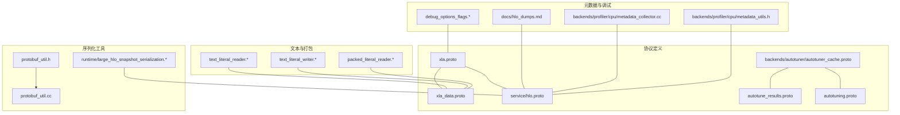
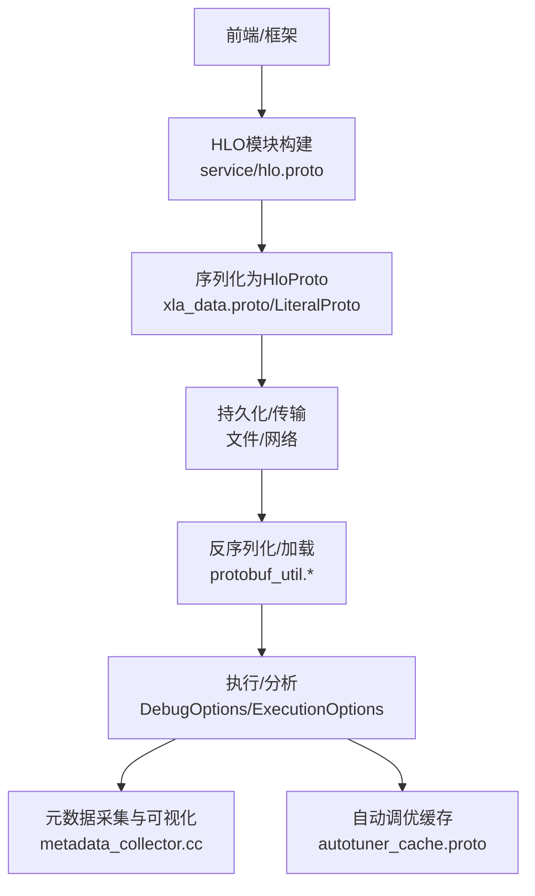
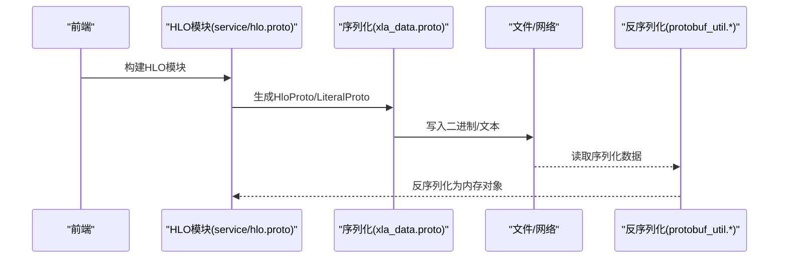
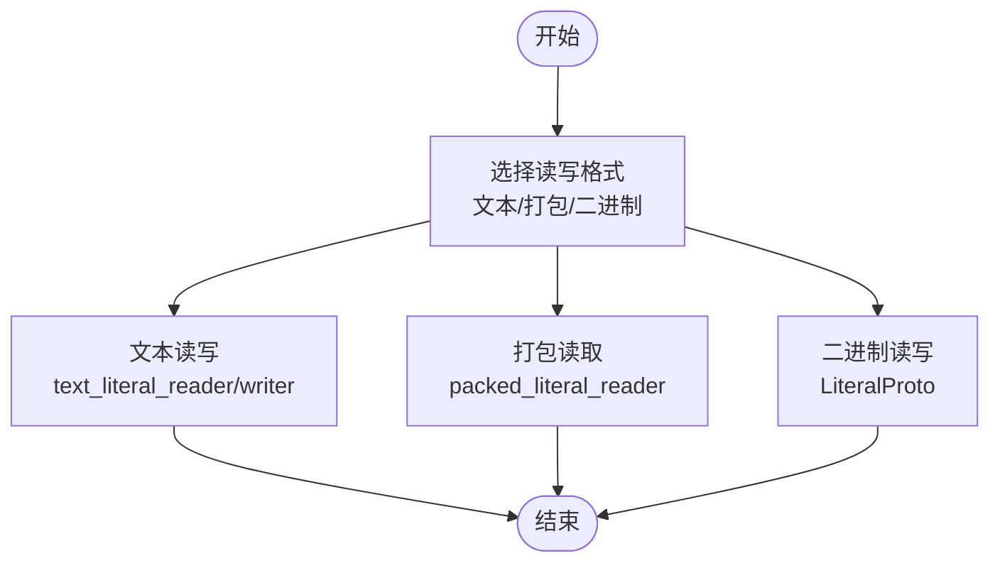
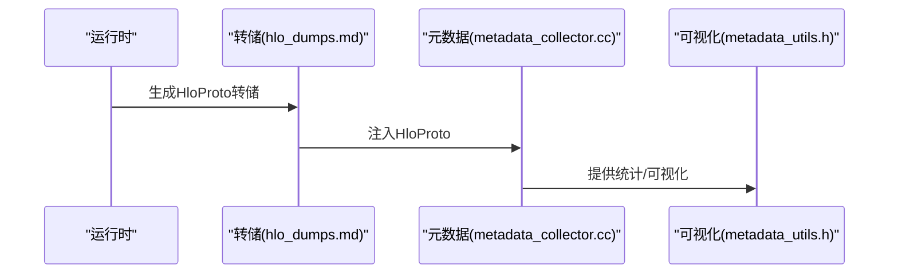
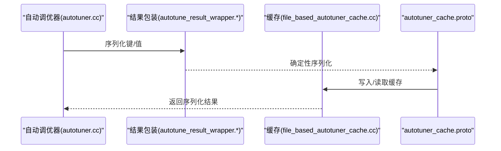
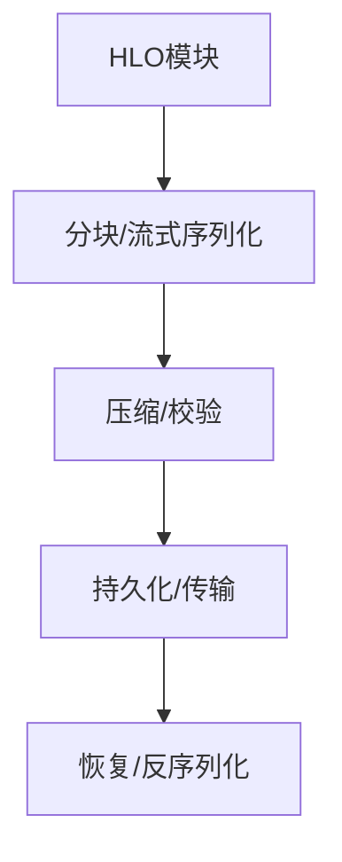
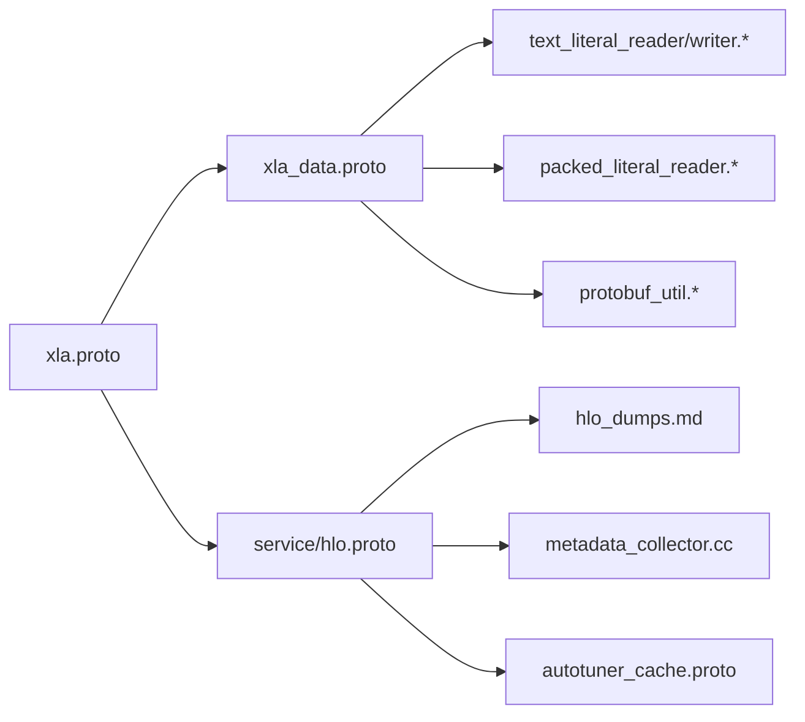

# 序列化与格式

<cite>
**本文引用的文件**
- [xla.proto](file://xla/xla.proto)
- [xla_data.proto](file://xla/xla_data.proto)
- [protobuf_util.h](file://xla/protobuf_util.h)
- [protobuf_util.cc](file://xla/protobuf_util.cc)
- [hlo.proto](file://xla/service/hlo.proto)
- [hlo_dumps.md](file://docs/hlo_dumps.md)
- [debug_options_flags.h](file://xla/debug_options_flags.h)
- [debug_options_flags.cc](file://xla/debug_options_flags.cc)
- [autotuner_cache.proto](file://xla/backends/autotuner/autotuner_cache.proto)
- [autotuner.cc](file://xla/backends/autotuner/autotuner.cc)
- [file_based_autotuner_cache.cc](file://xla/backends/autotuner/file_based_autotuner_cache.cc)
- [hlo_benchmark_runner.cc](file://xla/backends/cpu/benchmarks/hlo_benchmark_runner.cc)
- [metadata_collector.cc](file://xla/backends/profiler/cpu/metadata_collector.cc)
- [metadata_utils.h](file://xla/backends/profiler/cpu/metadata_utils.h)
- [core/host_offloading/host_offloading_executable.proto](file://xla/core/host_offloading/host_offloading_executable.proto)
- [pjrt_c_api_shardings_extension.h](file://xla/pjrt/c/pjrt_c_api_shardings_extension.h)
- [pjrt_layout_serdes.proto](file://xla/python/pjrt_ifrt/pjrt_layout_serdes.proto)
- [executable_metadata.proto](file://xla/python/pjrt_ifrt/executable_metadata.proto)
- [xla_host_callback.proto](file://xla/python/pjrt_ifrt/xla_host_callback.proto)
- [xla_sharding.proto](file://xla/python/pjrt_ifrt/xla_sharding.proto)
- [stream_executor_executable.proto](file://xla/pjrt/stream_executor_executable.proto)
- [autotune_results.proto](file://xla/autotune_results.proto)
- [autotuning.proto](file://xla/autotuning.proto)
- [autotune_result_wrapper.cc](file://xla/autotune_result_wrapper.cc)
- [autotune_result_wrapper.h](file://xla/autotune_result_wrapper.h)
- [text_literal_reader.h](file://xla/text_literal_reader.h)
- [text_literal_writer.h](file://xla/text_literal_writer.h)
- [text_literal_reader.cc](file://xla/text_literal_reader.cc)
- [text_literal_writer.cc](file://xla/text_literal_writer.cc)
- [packed_literal_reader.h](file://xla/packed_literal_reader.h)
- [packed_literal_reader.cc](file://xla/packed_literal_reader.cc)
- [sort_json.h](file://xla/sort_json.h)
- [sort_json.cc](file://xla/sort_json.cc)
- [shape_util.proto](file://xla/shape_util.proto)
- [shape_util.h](file://xla/shape_util.h)
- [shape_util.cc](file://xla/shape_util.cc)
- [shape_util_test.cc](file://xla/shape_util_test.cc)
- [shape_pool.h](file://xla/shape_pool.h)
- [shape_pool.cc](file://xla/shape_pool.cc)
- [shape_pool_test.cc](file://xla/shape_pool_test.cc)
- [literal_util.h](file://xla/literal_util.h)
- [literal_util.cc](file://xla/literal_util.cc)
- [literal_util_test.cc](file://xla/literal_util_test.cc)
- [literal_pool.h](file://xla/literal_pool.h)
- [literal_pool.cc](file://xla/literal_pool.cc)
- [literal_pool_test.cc](file://xla/literal_pool_test.cc)
- [runtime/large_hlo_snapshot_serialization/large_hlo_snapshot_serialization.h](file://xla/runtime/large_hlo_snapshot_serialization/large_hlo_snapshot_serialization.h)
- [runtime/large_hlo_snapshot_serialization/large_hlo_snapshot_serialization.cc](file://xla/runtime/large_hlo_snapshot_serialization/large_hlo_snapshot_serialization.cc)
</cite>

## 目录
1. [引言](#引言)
2. [项目结构](#项目结构)
3. [核心组件](#核心组件)
4. [架构总览](#架构总览)
5. [详细组件分析](#详细组件分析)
6. [依赖关系分析](#依赖关系分析)
7. [性能考量](#性能考量)
8. [故障排查指南](#故障排查指南)
9. [结论](#结论)
10. [附录](#附录)

## 引言
本文件面向XLA中间表示（HLO）的序列化与格式系统，系统性阐述以下内容：
- HLO计算图的序列化格式与二进制编码规范
- 可移植API设计与跨平台传输能力
- HLO模块的元数据存储、版本管理与兼容性策略
- 序列化过程中的完整性校验、压缩与性能优化
- 反序列化的错误处理、回退机制与调试支持
- 不同格式之间的转换规则与限制条件
- 序列化与反序列化的最佳实践与性能建议

## 项目结构
围绕序列化与格式的关键目录与文件如下：
- 协议缓冲区定义：xla.proto、xla_data.proto、service/hlo.proto、各后端与工具的proto
- 序列化工具：protobuf_util.*、large_hlo_snapshot_serialization.*
- 文本/打包读写：text_literal_reader/writer.*、packed_literal_reader/writer.*
- 元数据与调试：hlo_dumps.md、debug_options_flags.*、metadata_collector.*、metadata_utils.h
- 自动调优缓存：autotuner_cache.proto、autotuner.cc、file_based_autotuner_cache.cc、autotune_result_wrapper.*

**图表来源**
- [xla.proto](file://xla/xla.proto#L1-L1868)
- [xla_data.proto](file://xla/xla_data.proto#L1-L1476)
- [hlo.proto](file://xla/service/hlo.proto#L1-L200)
- [autotuner_cache.proto](file://xla/backends/autotuner/autotuner_cache.proto#L1-L200)
- [autotune_results.proto](file://xla/autotune_results.proto#L1-L200)
- [autotuning.proto](file://xla/autotuning.proto#L1-L200)
- [protobuf_util.h](file://xla/protobuf_util.h#L1-L76)
- [protobuf_util.cc](file://xla/protobuf_util.cc#L1-L55)
- [large_hlo_snapshot_serialization.h](file://xla/runtime/large_hlo_snapshot_serialization/large_hlo_snapshot_serialization.h#L1-L200)
- [large_hlo_snapshot_serialization.cc](file://xla/runtime/large_hlo_snapshot_serialization/large_hlo_snapshot_serialization.cc#L1-L200)
- [text_literal_reader.h](file://xla/text_literal_reader.h#L1-L200)
- [text_literal_writer.h](file://xla/text_literal_writer.h#L1-L200)
- [packed_literal_reader.h](file://xla/packed_literal_reader.h#L1-L200)
- [hlo_dumps.md](file://docs/hlo_dumps.md#L1-L50)
- [debug_options_flags.h](file://xla/debug_options_flags.h#L1-L200)
- [debug_options_flags.cc](file://xla/debug_options_flags.cc#L1-L300)
- [metadata_collector.cc](file://xla/backends/profiler/cpu/metadata_collector.cc#L1-L120)
- [metadata_utils.h](file://xla/backends/profiler/cpu/metadata_utils.h#L1-L120)

**章节来源**
- [xla.proto](file://xla/xla.proto#L1-L1868)
- [xla_data.proto](file://xla/xla_data.proto#L1-L1476)
- [hlo.proto](file://xla/service/hlo.proto#L1-L200)
- [hlo_dumps.md](file://docs/hlo_dumps.md#L1-L50)

## 核心组件
- 协议缓冲区定义
  - xla.proto：包含调试选项、执行选项、设备句柄等，支撑跨平台编译与运行配置
  - xla_data.proto：定义基础类型、形状、布局、字面量、收集通信参数等核心数据结构
  - service/hlo.proto：定义HLO模块、指令、配置等服务层结构
- 序列化工具
  - protobuf_util.*：提供基于序列化的消息比较与哈希，确保一致性与稳定性
  - large_hlo_snapshot_serialization.*：针对大型快照的序列化封装
- 文本与打包读写
  - text_literal_reader/writer.*：文本形式的字面量读写
  - packed_literal_reader.*：紧凑二进制字面量读取
- 元数据与调试
  - hlo_dumps.md：描述HloProto等转储格式
  - debug_options_flags.*：调试标志与兼容性控制
  - metadata_collector.*、metadata_utils.h：将HloProto注入到分析/可视化流程

**章节来源**
- [xla.proto](file://xla/xla.proto#L1560-L1600)
- [xla_data.proto](file://xla/xla_data.proto#L666-L705)
- [protobuf_util.h](file://xla/protobuf_util.h#L27-L76)
- [protobuf_util.cc](file://xla/protobuf_util.cc#L29-L55)
- [hlo_dumps.md](file://docs/hlo_dumps.md#L1-L20)
- [debug_options_flags.h](file://xla/debug_options_flags.h#L60-L90)
- [debug_options_flags.cc](file://xla/debug_options_flags.cc#L1400-L1460)
- [metadata_collector.cc](file://xla/backends/profiler/cpu/metadata_collector.cc#L60-L90)
- [metadata_utils.h](file://xla/backends/profiler/cpu/metadata_utils.h#L20-L40)

## 架构总览
下图展示XLA序列化与格式系统在编译与运行阶段的交互关系。

**图表来源**
- [hlo.proto](file://xla/service/hlo.proto#L1-L200)
- [xla_data.proto](file://xla/xla_data.proto#L666-L705)
- [protobuf_util.h](file://xla/protobuf_util.h#L27-L76)
- [protobuf_util.cc](file://xla/protobuf_util.cc#L29-L55)
- [metadata_collector.cc](file://xla/backends/profiler/cpu/metadata_collector.cc#L60-L90)
- [autotuner_cache.proto](file://xla/backends/autotuner/autotuner_cache.proto#L1-L200)

## 详细组件分析

### 组件A：HLO模块与指令序列化（HloProto）
- 结构要点
  - HLO模块通过service/hlo.proto定义，包含指令列表、入口点、配置等
  - 字面量通过xla_data.proto中的LiteralProto进行序列化，覆盖多种原生类型与稀疏编码
- 编码规范
  - 使用Protocol Buffers标准二进制编码；字段顺序与默认值遵循proto3语义
  - 字面量按类型分字段存储，小端序编码，稀疏索引与值分离
- 跨平台传输
  - 通过xla.proto中的ExecutionOptions携带DebugOptions，确保跨平台行为一致
  - 支持压缩转储（如xla_dump_compress_protos），降低带宽占用

**图表来源**
- [hlo.proto](file://xla/service/hlo.proto#L1-L200)
- [xla_data.proto](file://xla/xla_data.proto#L666-L705)
- [protobuf_util.h](file://xla/protobuf_util.h#L27-L76)
- [protobuf_util.cc](file://xla/protobuf_util.cc#L29-L55)

**章节来源**
- [hlo.proto](file://xla/service/hlo.proto#L1-L200)
- [xla_data.proto](file://xla/xla_data.proto#L666-L705)
- [xla.proto](file://xla/xla.proto#L1560-L1600)

### 组件B：字面量序列化与文本/打包读写
- 字面量序列化
  - LiteralProto覆盖布尔、整数、浮点、复数、稀疏索引等字段
  - 小端序存储，FP16/BF16/U16/S16等字段明确编码方式
- 文本读写
  - text_literal_reader/writer.*提供人类可读文本格式，便于调试与审计
- 打包读取
  - packed_literal_reader.*用于高性能场景下的紧凑二进制读取

**图表来源**
- [xla_data.proto](file://xla/xla_data.proto#L666-L705)
- [text_literal_reader.h](file://xla/text_literal_reader.h#L1-L200)
- [text_literal_writer.h](file://xla/text_literal_writer.h#L1-L200)
- [packed_literal_reader.h](file://xla/packed_literal_reader.h#L1-L200)

**章节来源**
- [xla_data.proto](file://xla/xla_data.proto#L666-L705)
- [text_literal_reader.cc](file://xla/text_literal_reader.cc#L1-L200)
- [text_literal_writer.cc](file://xla/text_literal_writer.cc#L1-L200)
- [packed_literal_reader.cc](file://xla/packed_literal_reader.cc#L1-L200)

### 组件C：元数据与调试（HloProto转储与可视化）
- 转储格式
  - hlo_dumps.md指出HloProto为结构化转储格式，支持文本/二进制/HTML等多种输出
- 元数据采集
  - metadata_collector.cc将HloProto注入到分析平面，metadata_utils.h提供统计与可视化接口
- 调试选项
  - debug_options_flags.*提供大量调试开关，影响序列化/转储行为与验证策略

**图表来源**
- [hlo_dumps.md](file://docs/hlo_dumps.md#L1-L20)
- [metadata_collector.cc](file://xla/backends/profiler/cpu/metadata_collector.cc#L60-L90)
- [metadata_utils.h](file://xla/backends/profiler/cpu/metadata_utils.h#L20-L40)
- [debug_options_flags.h](file://xla/debug_options_flags.h#L60-L90)

**章节来源**
- [hlo_dumps.md](file://docs/hlo_dumps.md#L1-L20)
- [metadata_collector.cc](file://xla/backends/profiler/cpu/metadata_collector.cc#L60-L90)
- [metadata_utils.h](file://xla/backends/profiler/cpu/metadata_utils.h#L20-L40)
- [debug_options_flags.cc](file://xla/debug_options_flags.cc#L1400-L1460)

### 组件D：自动调优结果的序列化与缓存
- 结构
  - autotuner_cache.proto定义缓存键/值序列化结构
  - autotuner.cc在自动调优过程中序列化结果并写入缓存
  - file_based_autotuner_cache.cc提供文件级序列化/反序列化实现
  - autotune_result_wrapper.*对键/值进行确定性序列化
- 版本与兼容性
  - 通过proto字段编号与保留字段维持向后兼容
  - 支持不同后端与平台的序列化差异

**图表来源**
- [autotuner.cc](file://xla/backends/autotuner/autotuner.cc#L80-L100)
- [autotuner.cc](file://xla/backends/autotuner/autotuner.cc#L240-L280)
- [autotuner_cache.proto](file://xla/backends/autotuner/autotuner_cache.proto#L1-L200)
- [file_based_autotuner_cache.cc](file://xla/backends/autotuner/file_based_autotuner_cache.cc#L220-L250)
- [autotune_result_wrapper.cc](file://xla/autotune_result_wrapper.cc#L50-L70)

**章节来源**
- [autotuner.cc](file://xla/backends/autotuner/autotuner.cc#L80-L100)
- [autotuner.cc](file://xla/backends/autotuner/autotuner.cc#L240-L280)
- [autotuner_cache.proto](file://xla/backends/autotuner/autotuner_cache.proto#L1-L200)
- [file_based_autotuner_cache.cc](file://xla/backends/autotuner/file_based_autotuner_cache.cc#L220-L250)
- [autotune_result_wrapper.cc](file://xla/autotune_result_wrapper.cc#L50-L70)

### 组件E：大型快照序列化（大体积HLO）
- 需求背景
  - 大型HLO模块在转储/传输时可能超出单文件或内存限制
- 实现思路
  - large_hlo_snapshot_serialization.*提供分块/流式序列化能力，结合压缩与校验
  - 与HloProto配合，支持超大规模图的稳定落盘与传输

**图表来源**
- [large_hlo_snapshot_serialization.h](file://xla/runtime/large_hlo_snapshot_serialization/large_hlo_snapshot_serialization.h#L1-L200)
- [large_hlo_snapshot_serialization.cc](file://xla/runtime/large_hlo_snapshot_serialization/large_hlo_snapshot_serialization.cc#L1-L200)

**章节来源**
- [large_hlo_snapshot_serialization.h](file://xla/runtime/large_hlo_snapshot_serialization/large_hlo_snapshot_serialization.h#L1-L200)
- [large_hlo_snapshot_serialization.cc](file://xla/runtime/large_hlo_snapshot_serialization/large_hlo_snapshot_serialization.cc#L1-L200)

## 依赖关系分析
- 协议依赖
  - xla.proto导入xla_data.proto与service/hlo.proto，形成“配置-数据-模块”的层级
  - 各后端与工具（如PJRT、自动调优）通过proto导入使用核心数据结构
- 工具依赖
  - protobuf_util.*被广泛用于一致性校验与哈希
  - 文本/打包读写与字面量序列化紧密耦合
- 运行期依赖
  - DebugOptions/ExecutionOptions贯穿序列化/转储/执行链路
  - 元数据采集与可视化依赖HloProto注入

**图表来源**
- [xla.proto](file://xla/xla.proto#L1-L50)
- [xla_data.proto](file://xla/xla_data.proto#L1-L50)
- [hlo.proto](file://xla/service/hlo.proto#L1-L50)
- [protobuf_util.h](file://xla/protobuf_util.h#L27-L76)
- [text_literal_reader.h](file://xla/text_literal_reader.h#L1-L200)
- [text_literal_writer.h](file://xla/text_literal_writer.h#L1-L200)
- [packed_literal_reader.h](file://xla/packed_literal_reader.h#L1-L200)
- [hlo_dumps.md](file://docs/hlo_dumps.md#L1-L20)
- [metadata_collector.cc](file://xla/backends/profiler/cpu/metadata_collector.cc#L60-L90)
- [autotuner_cache.proto](file://xla/backends/autotuner/autotuner_cache.proto#L1-L200)

**章节来源**
- [xla.proto](file://xla/xla.proto#L1-L50)
- [xla_data.proto](file://xla/xla_data.proto#L1-L50)
- [hlo.proto](file://xla/service/hlo.proto#L1-L50)
- [protobuf_util.h](file://xla/protobuf_util.h#L27-L76)

## 性能考量
- 序列化开销
  - 使用确定性序列化（protobuf_util.*）避免字段顺序差异导致的不必要比较
  - 对大型HLO采用分块/流式序列化与压缩，降低I/O与内存峰值
- 压缩策略
  - 支持转储压缩（如xla_dump_compress_protos），显著减少磁盘占用
- 读写路径
  - 文本格式适合调试与审计；打包/二进制格式适合高吞吐传输
- 并发与缓存
  - 自动调优缓存序列化结果，避免重复计算；文件级缓存提供快速命中

[本节为通用性能讨论，无需特定文件引用]

## 故障排查指南
- 反序列化错误
  - 检查序列化格式一致性（protobuf_util.*提供比较与哈希工具）
  - 核对字段编号与保留字段，避免破坏向后兼容
- 转储问题
  - 确认hlo_dumps.md中格式选择与目标环境匹配
  - 使用debug_options_flags.*调整验证级别与日志级别
- 自动调优缓存
  - 若缓存损坏，清理后重新生成；确认autotuner_cache.proto字段编号正确
  - 使用autotune_result_wrapper.*确保键/值序列化确定性

**章节来源**
- [protobuf_util.h](file://xla/protobuf_util.h#L27-L76)
- [protobuf_util.cc](file://xla/protobuf_util.cc#L29-L55)
- [hlo_dumps.md](file://docs/hlo_dumps.md#L1-L20)
- [debug_options_flags.h](file://xla/debug_options_flags.h#L60-L90)
- [autotuner_cache.proto](file://xla/backends/autotuner/autotuner_cache.proto#L1-L200)
- [autotune_result_wrapper.cc](file://xla/autotune_result_wrapper.cc#L50-L70)

## 结论
XLA的序列化与格式系统以Protocol Buffers为核心，结合确定性序列化、压缩与分块策略，在保证跨平台一致性的同时兼顾性能与可维护性。通过完善的元数据采集与调试工具链，系统实现了从编译到执行的全链路可观测与可控。

[本节为总结性内容，无需特定文件引用]

## 附录
- 最佳实践
  - 优先使用二进制序列化进行生产传输，文本格式仅用于调试
  - 对大型HLO启用分块/流式序列化与压缩
  - 使用protobuf_util.*进行一致性校验，避免因字段顺序差异引发的问题
  - 在跨平台部署中，严格管理xla.proto中的调试与执行选项，确保行为一致
- 转换规则与限制
  - 字面量序列化严格遵循xla_data.proto的字段与编码约定
  - HloProto与文本/打包格式之间存在严格的解析与生成规则
  - 自动调优缓存的键/值序列化需保持确定性，避免运行时差异

[本节为通用指导，无需特定文件引用]