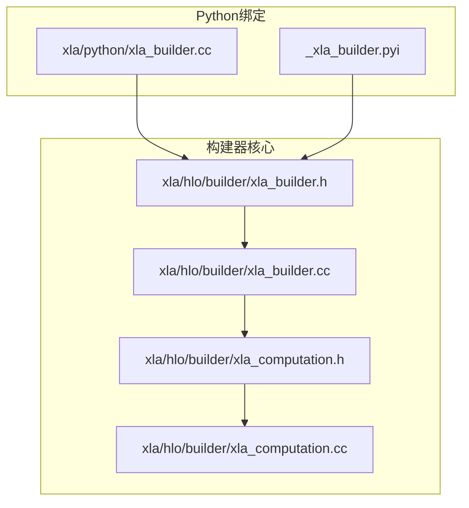
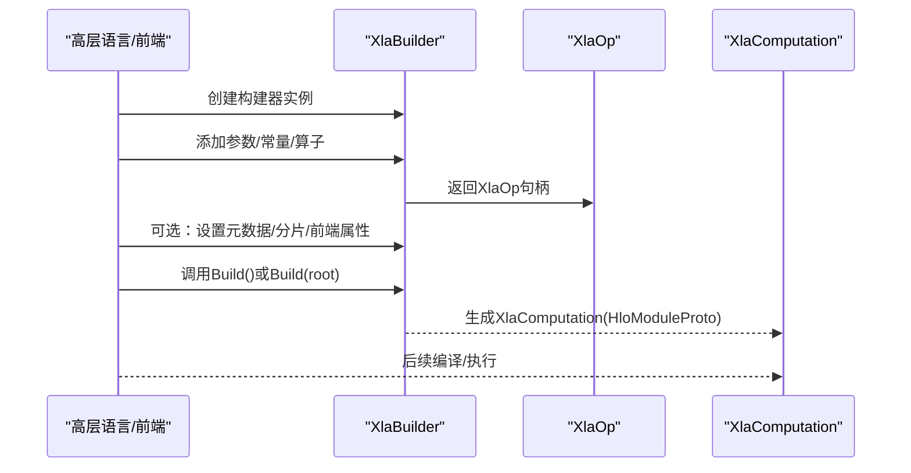
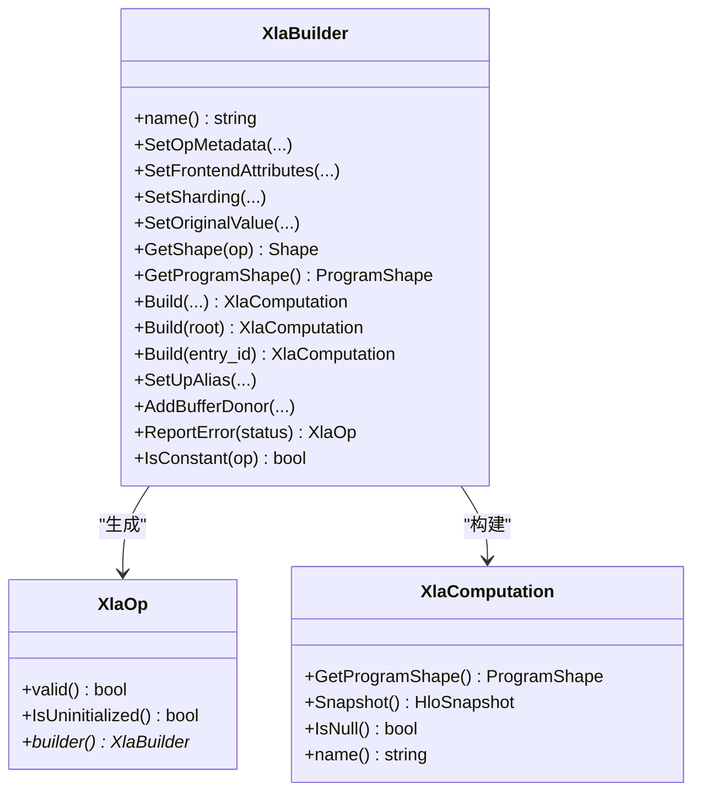
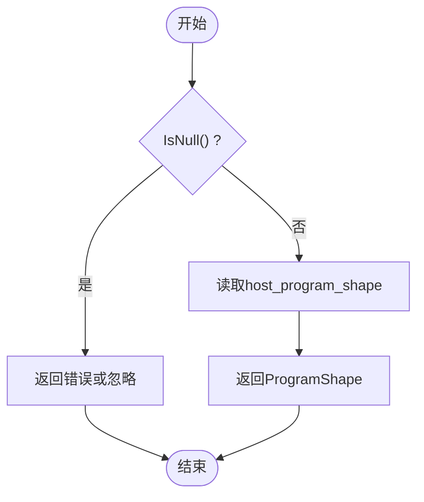
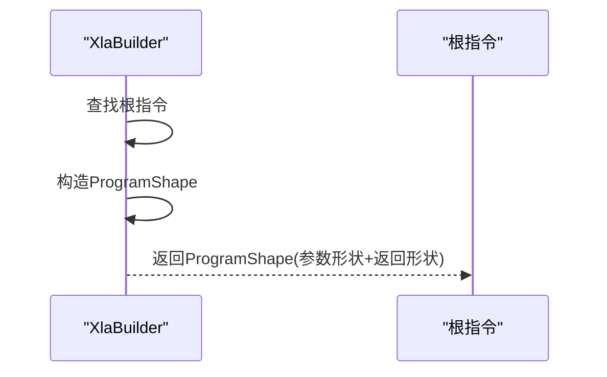
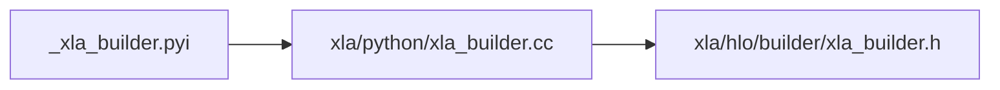
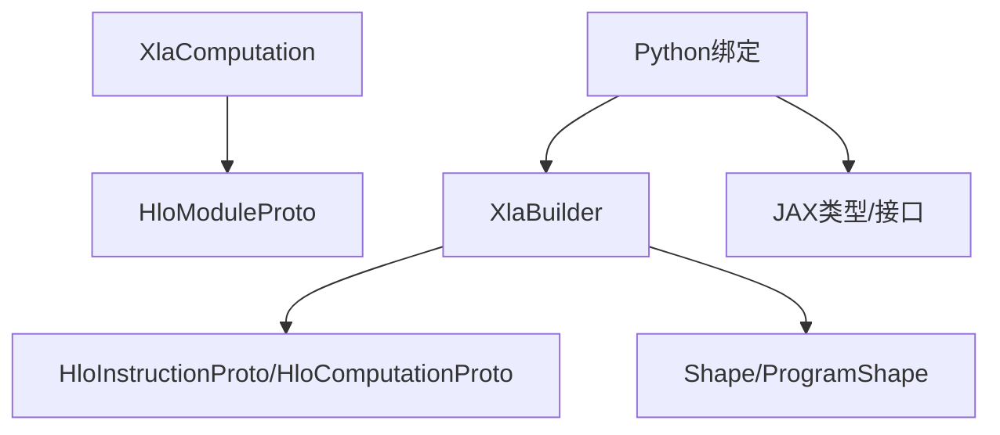

# 构建器API

<cite>
**本文引用的文件**
- [xla_builder.h](file://xla/hlo/builder/xla_builder.h)
- [xla_builder.cc](file://xla/hlo/builder/xla_builder.cc)
- [xla_computation.h](file://xla/hlo/builder/xla_computation.h)
- [xla_computation.cc](file://xla/hlo/builder/xla_computation.cc)
- [xla_builder.cc（Python绑定）](file://xla/python/xla_builder.cc)
- [_xla_builder.pyi](file://xla/python/_xla_builder.pyi)
</cite>

## 目录
1. [简介](#简介)
2. [项目结构](#项目结构)
3. [核心组件](#核心组件)
4. [架构总览](#架构总览)
5. [组件详解](#组件详解)
6. [依赖关系分析](#依赖关系分析)
7. [性能考量](#性能考量)
8. [故障排查指南](#故障排查指南)
9. [结论](#结论)
10. [附录：完整用例与最佳实践](#附录完整用例与最佳实践)

## 简介
本文件面向希望在高层语言（如TensorFlow等前端）中通过XLA构建器API生成HLO计算图的工程师与研究者。文档围绕以下目标展开：
- 深入解析XlaBuilder类的设计与使用方法，说明如何从高层语言逐步构建HLO指令序列并最终形成可编译的计算图。
- 详述XlaComputation类的功能边界，包括程序形状推断、模块协议缓冲区表示、快照能力等。
- 记录构建器常用方法的参数语义、返回值与典型使用场景，并给出调用序列图与数据流图。
- 解释值推断系统（ProgramShape/Shape推断）的工作原理与应用场景。
- 提供错误处理策略、性能优化建议与调试技巧。
- 给出与XLA其他组件（如编译器、执行器、Python绑定）的集成方式说明。

## 项目结构
与构建器API直接相关的源码主要位于以下位置：
- C++核心：xla/hlo/builder 下的 XlaBuilder 与 XlaComputation 实现与接口声明
- Python绑定：xla/python 下的 _xla_builder.pyi 与 xla_builder.cc 将C++能力暴露给Python/JAX生态

**图表来源**
- [xla_builder.h](file://xla/hlo/builder/xla_builder.h#L287-L800)
- [xla_builder.cc](file://xla/hlo/builder/xla_builder.cc#L609-L800)
- [xla_computation.h](file://xla/hlo/builder/xla_computation.h#L31-L74)
- [xla_computation.cc](file://xla/hlo/builder/xla_computation.cc#L28-L43)
- [_xla_builder.pyi](file://xla/python/_xla_builder.pyi#L31-L49)
- [xla_builder.cc（Python绑定）](file://xla/python/xla_builder.cc#L105-L160)

**章节来源**
- [xla_builder.h](file://xla/hlo/builder/xla_builder.h#L287-L800)
- [xla_builder.cc](file://xla/hlo/builder/xla_builder.cc#L609-L800)
- [xla_computation.h](file://xla/hlo/builder/xla_computation.h#L31-L74)
- [xla_computation.cc](file://xla/hlo/builder/xla_computation.cc#L28-L43)
- [_xla_builder.pyi](file://xla/python/_xla_builder.pyi#L31-L49)
- [xla_builder.cc（Python绑定）](file://xla/python/xla_builder.cc#L105-L160)

## 核心组件
- XlaBuilder：用于累积构建HLO指令序列的构建器，提供参数、常量、算子、控制流、分布式通信等操作的封装；支持元数据、分片策略、前端属性等附加信息设置；提供构建为XlaComputation的能力。
- XlaOp：对已入队指令的轻量句柄，携带指令句柄与所属构建器指针，用于后续作为其他指令的操作数。
- XlaComputation：对构建完成的计算图的封装，内部持有HloModuleProto，提供程序形状查询、序列化快照等能力。
- 值推断系统：通过GetProgramShape/GetShape等接口在构建阶段或构建后进行形状与程序形状推断，辅助验证与优化。

**章节来源**
- [xla_builder.h](file://xla/hlo/builder/xla_builder.h#L166-L283)
- [xla_builder.h](file://xla/hlo/builder/xla_builder.h#L284-L800)
- [xla_computation.h](file://xla/hlo/builder/xla_computation.h#L31-L74)

## 架构总览
下图展示了从高层语言到HLO计算图的关键路径：高层语言通过构建器API构造XlaBuilder，累积XlaOp指令，最终Build得到XlaComputation，供编译器进一步优化与执行。

**图表来源**
- [xla_builder.h](file://xla/hlo/builder/xla_builder.h#L418-L448)
- [xla_builder.cc](file://xla/hlo/builder/xla_builder.cc#L789-L798)
- [xla_computation.h](file://xla/hlo/builder/xla_computation.h#L31-L74)

## 组件详解

### XlaBuilder 类设计与使用
- 名称与生命周期
  - 构造函数接收计算名称，析构安全释放资源。
  - 支持线程兼容（注释明确），但不保证线程安全，需外部同步。
- 元数据与属性管理
  - 设置/交换/清除OpMetadata、FrontendAttributes、OriginalValue、Sharding等，影响后续所有指令或仅下一个指令。
- 形状与程序形状推断
  - GetShape/GetShapePtr：查询单个XlaOp的形状。
  - GetProgramShape：推断当前或指定根节点的ProgramShape（参数形状与返回形状）。
- 错误处理
  - ReportError/ReportErrorOrReturn：统一错误上报与延迟错误策略；可配置“遇错即停”模式。
  - first_error/GetCurrentStatus：获取首条错误与当前状态。
- 子计算与别名
  - CreateSubBuilder/BuildSubComputation：嵌入子计算，避免复制。
  - SetUpAlias/AddBufferDonor：建立输入输出别名与捐赠缓冲区，利于内存优化。
- 构建与导出
  - Build/Build(XlaOp)/Build(XlaComputationId)：将累积的指令序列构建为XlaComputation。
  - BuildAndNoteError：在父子构建器场景中，将子构建器错误透传至父构建器。
  - BuildConstantSubGraph：提取常量子图。
- 常用算子族（节选）
  - 参数与常量：Parameter/ConstantLiteral
  - 变换：Broadcast/BroadcastInDim/DynamicReshape/Reshape/Slice/DynamicSlice/DynamicUpdateSlice/ConcatInDim/Tuple/GetTupleElement
  - 算术与逻辑：+ - * / % 位运算与移位
  - 点积与卷积：Dot/DotGeneral/Conv系列（含一般维度、膨胀、动态版本）
  - 聚合与归约：Reduce/AllReduce/AllGather/CollectivePermute等（异步Start/Done形式由友元接口暴露）
  - 控制流与域：While/Fusion/Domain/PartitionId
  - 随机与状态：RngGetAndUpdateState
  - 发送/接收：Send/Recv（含Done）

**图表来源**
- [xla_builder.h](file://xla/hlo/builder/xla_builder.h#L287-L800)
- [xla_computation.h](file://xla/hlo/builder/xla_computation.h#L31-L74)

**章节来源**
- [xla_builder.h](file://xla/hlo/builder/xla_builder.h#L287-L800)
- [xla_builder.cc](file://xla/hlo/builder/xla_builder.cc#L609-L800)

### XlaComputation 类功能
- 程序形状查询：GetProgramShape基于内部HloModuleProto的host_program_shape。
- 快照能力：Snapshot生成可序列化的HloSnapshot，便于调试与持久化。
- 空对象检测：IsNull用于判空，避免无效计算图的误用。

**图表来源**
- [xla_computation.cc](file://xla/hlo/builder/xla_computation.cc#L28-L43)

**章节来源**
- [xla_computation.h](file://xla/hlo/builder/xla_computation.h#L31-L74)
- [xla_computation.cc](file://xla/hlo/builder/xla_computation.cc#L28-L43)

### 值推断系统（ProgramShape/Shape）
- ProgramShape推断
  - 通过GetProgramShape(root)在构建阶段或构建后推断参数形状与返回形状，确保参数编号连续且名称正确。
- 单个操作形状
  - GetShape/GetShapePtr根据句柄映射返回形状，支持常量检测IsConstant以辅助优化。
- 应用场景
  - 在高层语言中，先通过GetProgramShape校验计算签名，再进行编译与执行，有助于提前发现形状不匹配问题。

**图表来源**
- [xla_builder.cc](file://xla/hlo/builder/xla_builder.cc#L642-L685)

**章节来源**
- [xla_builder.cc](file://xla/hlo/builder/xla_builder.cc#L494-L518)
- [xla_builder.cc](file://xla/hlo/builder/xla_builder.cc#L642-L685)

### Python绑定与高层语言集成
- Python类型与方法映射
  - FrontendAttributes：字典式键值存储，支持__setitem__。
  - XlaBuilder：构造时自动去重名称；提供Build/build、GetShape/get_shape、get_program_shape、is_constant、set_op_metadata、set_sharding、clear_sharding、setup_alias等。
- 绑定实现
  - 使用nanobind将C++对象暴露为Python对象，统一异常转换为抛出。

**图表来源**
- [_xla_builder.pyi](file://xla/python/_xla_builder.pyi#L25-L49)
- [xla_builder.cc（Python绑定）](file://xla/python/xla_builder.cc#L105-L160)
- [xla_builder.h](file://xla/hlo/builder/xla_builder.h#L287-L800)

**章节来源**
- [_xla_builder.pyi](file://xla/python/_xla_builder.pyi#L25-L49)
- [xla_builder.cc（Python绑定）](file://xla/python/xla_builder.cc#L105-L160)

## 依赖关系分析
- 内部依赖
  - XlaBuilder依赖Shape、HloInstructionProto、HloComputationProto、ProgramShape等IR与形状基础设施。
  - XlaComputation持有HloModuleProto，作为可序列化模块的载体。
- 外部依赖
  - Python绑定依赖nanobind与JAX类型（如OpSharding_Type、ProgramShape、Shape、XlaComputation）。
- 友元接口
  - internal::XlaBuilderFriend提供对异步聚合、融合、域变换、发送/接收等高级原语的构建支持，供XlaBuilder内部或特定场景使用。

**图表来源**
- [xla_builder.h](file://xla/hlo/builder/xla_builder.h#L45-L61)
- [xla_computation.h](file://xla/hlo/builder/xla_computation.h#L24-L27)
- [xla_builder.cc（Python绑定）](file://xla/python/xla_builder.cc#L23-L34)

**章节来源**
- [xla_builder.h](file://xla/hlo/builder/xla_builder.h#L45-L61)
- [xla_computation.h](file://xla/hlo/builder/xla_computation.h#L24-L27)
- [xla_builder.cc（Python绑定）](file://xla/python/xla_builder.cc#L23-L34)

## 性能考量
- 形状推断与常量折叠
  - 利用IsConstant与GetProgramShape尽早发现可折叠常量，减少运行时开销。
- 别名与缓冲区捐赠
  - setUp_alias与AddBufferDonor可降低内存拷贝与分配次数，提升吞吐。
- 动态形状与静态形状
  - 对于需要稳定性的场景，优先使用静态维度；动态形状会增加编译与运行时复杂度。
- 异步聚合
  - 使用AllReduce/AllGather等异步Start/Done组合，配合执行线程与通道句柄，提升多设备协同效率。
- 分片策略
  - 通过SetSharding/SetInstructionSharding为关键算子设置合理分片，避免不必要的跨设备传输。

[本节为通用指导，无需列出具体文件来源]

## 故障排查指南
- 错误收集与延迟策略
  - 默认采用延迟错误策略，首次Build/GetShape等触发错误；也可启用“遇错即停”，快速定位问题。
- 常见问题定位
  - 使用OpToString/GetCurrentStatus查看指令序列与当前状态。
  - 通过GetOperandShapes检查操作数形状一致性。
  - 使用BuildConstantSubGraph抽取常量子图，隔离问题范围。
- Python侧调试
  - 在Python中捕获异常并结合XlaBuilder的错误状态进行诊断。

**章节来源**
- [xla_builder.cc](file://xla/hlo/builder/xla_builder.cc#L614-L640)
- [xla_builder.cc](file://xla/hlo/builder/xla_builder.cc#L509-L518)
- [xla_builder.cc](file://xla/hlo/builder/xla_builder.cc#L571-L607)

## 结论
XlaBuilder提供了从高层语言到HLO计算图的完整构建通道，具备完善的形状推断、元数据与分片管理、子计算嵌入、别名与捐赠缓冲区等能力。XlaComputation则承载了构建结果，支持程序形状查询与快照。通过Python绑定，该API可无缝接入JAX/TensorFlow等生态。遵循本文的错误处理与性能优化建议，可在保证正确性的同时获得更高的执行效率。

[本节为总结性内容，无需列出具体文件来源]

## 附录：完整用例与最佳实践
- 基本流程
  - 创建XlaBuilder → 定义参数/常量 → 构建算子图 → 设置元数据/分片 → Build → 编译与执行
- 推荐实践
  - 在构建前先调用GetProgramShape校验签名
  - 对热点路径使用setUp_alias与AddBufferDonor
  - 对动态形状谨慎使用，必要时提供维度上界
  - 使用异步聚合原语提升多设备协同性能
  - 在Python侧通过FrontendAttributes标注来源信息，便于调试
- 参考实现路径
  - 构建器公共接口定义：[xla_builder.h](file://xla/hlo/builder/xla_builder.h#L287-L800)
  - 构建器实现细节与错误处理：[xla_builder.cc](file://xla/hlo/builder/xla_builder.cc#L609-L800)
  - 计算图封装与快照：[xla_computation.h](file://xla/hlo/builder/xla_computation.h#L31-L74) [xla_computation.cc](file://xla/hlo/builder/xla_computation.cc#L28-L43)
  - Python绑定与类型映射：[_xla_builder.pyi](file://xla/python/_xla_builder.pyi#L25-L49) [xla_builder.cc（Python绑定）](file://xla/python/xla_builder.cc#L105-L160)

[本节为参考索引，无需列出具体文件来源]