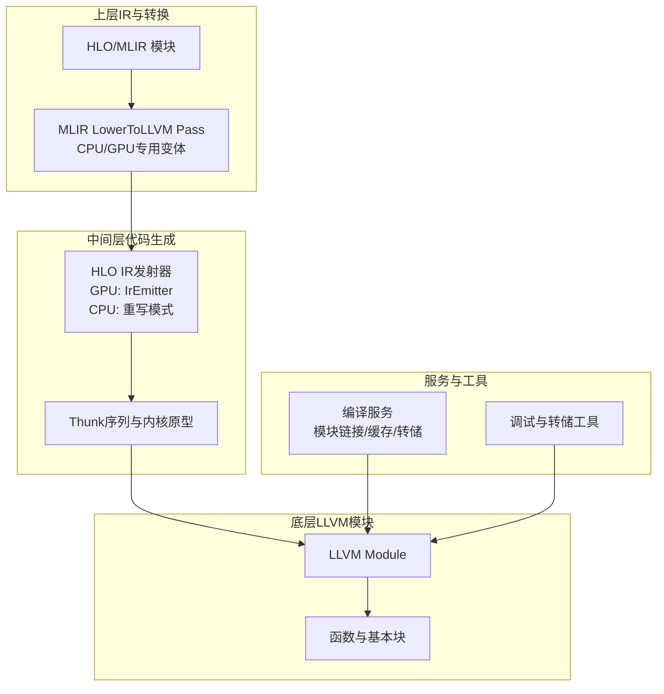
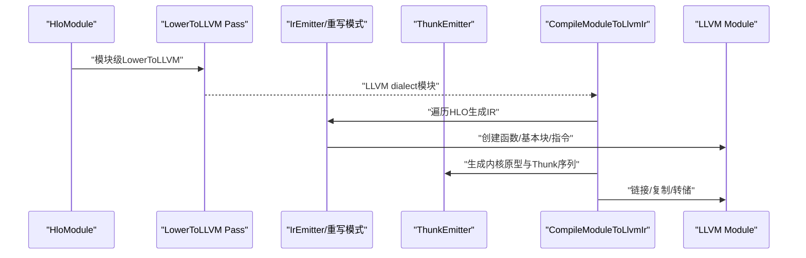
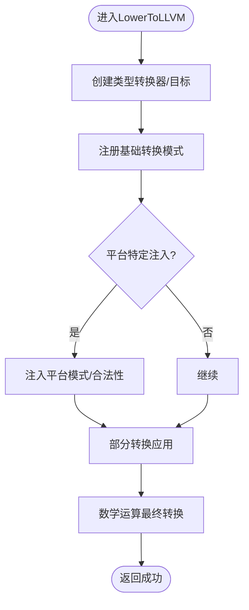
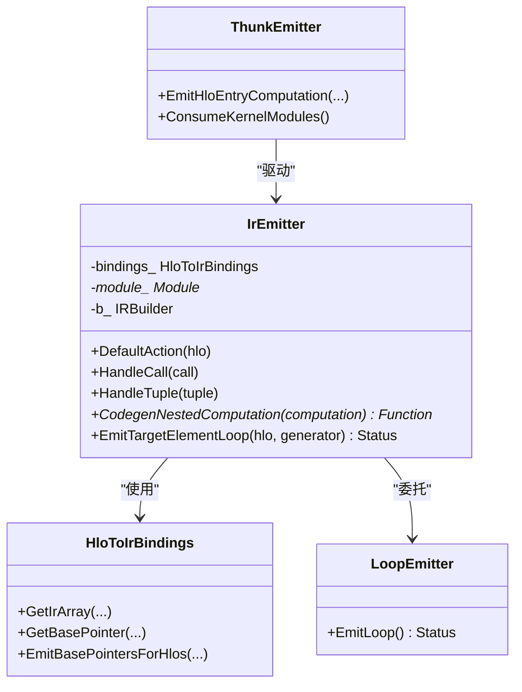
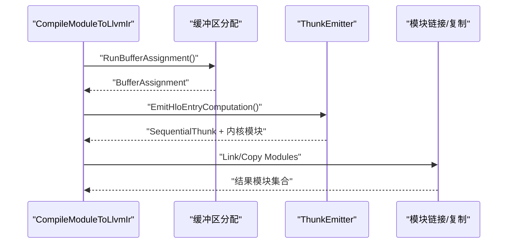
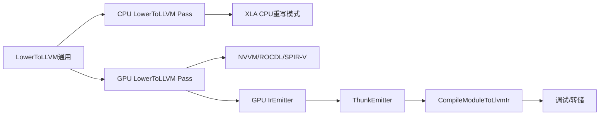

# LLVM代码生成

<cite>
**本文引用的文件**   
- [xla/codegen/llvm_kernel_source.cc](file://xla/codegen/llvm_kernel_source.cc)
- [xla/codegen/llvm_kernel_source.h](file://xla/codegen/llvm_kernel_source.h)
- [xla/codegen/emitters/transforms/lower_to_llvm_common.h](file://xla/codegen/emitters/transforms/lower_to_llvm_common.h)
- [xla/codegen/emitters/transforms/lower_to_llvm_common.cc](file://xla/codegen/emitters/transforms/lower_to_llvm_common.cc)
- [xla/codegen/emitters/transforms/lower_to_llvm_cpu.cc](file://xla/codegen/emitters/transforms/lower_to_llvm_cpu.cc)
- [xla/backends/cpu/codegen/emitters/transforms/lower_to_llvm.cc](file://xla/backends/cpu/codegen/emitters/transforms/lower_to_llvm.cc)
- [xla/backends/gpu/codegen/llvm/llvm_emitter.cc](file://xla/backends/gpu/codegen/llvm/llvm_emitter.cc)
- [xla/backends/gpu/codegen/llvm/llvm_emitter.h](file://xla/backends/gpu/codegen/llvm/llvm_emitter.h)
- [xla/service/gpu/compile_module_to_llvm_ir.cc](file://xla/service/gpu/compile_module_to_llvm_ir.cc)
- [xla/backends/gpu/codegen/llvm/parallel_loop_emitter.cc](file://xla/backends/gpu/codegen/llvm/parallel_loop_emitter.cc)
- [xla/backends/gpu/codegen/llvm/sort_util.cc](file://xla/backends/gpu/codegen/llvm/sort_util.cc)
- [xla/backends/cpu/testlib/llvm_ir_kernel_emitter.cc](file://xla/backends/cpu/testlib/llvm_ir_kernel_emitter.cc)
- [xla/backends/cpu/testlib/llvm_ir_kernel_emitter.h](file://xla/backends/cpu/testlib/llvm_ir_kernel_emitter.h)
- [xla/backends/cpu/autotuner/llvm_kernel_autotuner.cc](file://xla/backends/cpu/autotuner/llvm_kernel_autotuner.cc)
- [xla/backends/cpu/autotuner/llvm_kernel_backend.cc](file://xla/backends/cpu/autotuner/llvm_kernel_backend.cc)
- [xla/mlir/framework/transforms/xla_framework_to_llvm_pass.cc](file://xla/mlir/framework/transforms/xla_framework_to_llvm_pass.cc)
- [xla/mlir_hlo/transforms/generic_host_to_llvm.cc](file://xla/mlir_hlo/transforms/generic_host_to_llvm.cc)
- [xla/service/gpu/llvm_gpu_backend/amdgpu_backend.cc](file://xla/service/gpu/llvm_gpu_backend/amdgpu_backend.cc)
- [xla/service/gpu/llvm_gpu_backend/nvptx_backend.h](file://xla/service/gpu/llvm_gpu_backend/nvptx_backend.h)
- [xla/service/gpu/llvm_gpu_backend/spirv_backend.h](file://xla/service/gpu/llvm_gpu_backend/spirv_backend.h)
- [xla/codegen/intrinsic/cpp/dump_llvm_ir.cc](file://xla/codegen/intrinsic/cpp/dump_llvm_ir.cc)
</cite>

## 目录
1. [引言](#引言)
2. [项目结构](#项目结构)
3. [核心组件](#核心组件)
4. [架构总览](#架构总览)
5. [详细组件分析](#详细组件分析)
6. [依赖关系分析](#依赖关系分析)
7. [性能考量](#性能考量)
8. [故障排查指南](#故障排查指南)
9. [结论](#结论)
10. [附录](#附录)

## 引言
本文件系统性阐述XLA中基于LLVM的代码生成体系，覆盖从HLO计算图到LLVM IR的转换路径、LLVM模块构建与函数定义、基本块管理、优化管道（含内联、循环与向量化）、目标特定代码生成（CPU/GPU后端）、调试信息与性能分析、错误处理机制，以及如何与LLVM工具链集成并支持新后端。

## 项目结构
XLA的LLVM代码生成由多层协作组成：上层通过MLIR Pass将HLO/MLIR方言转换为LLVM dialect；底层在GPU/CPUs上以HLO Visitor模式生成具体IR；服务层负责模块装配、链接与缓存；工具层提供调试与转储能力。

图表来源
- [xla/codegen/emitters/transforms/lower_to_llvm_common.cc](file://xla/codegen/emitters/transforms/lower_to_llvm_common.cc#L45-L93)
- [xla/backends/gpu/codegen/llvm/llvm_emitter.cc](file://xla/backends/gpu/codegen/llvm/llvm_emitter.cc#L117-L312)
- [xla/service/gpu/compile_module_to_llvm_ir.cc](file://xla/service/gpu/compile_module_to_llvm_ir.cc#L213-L284)

章节来源
- [xla/codegen/emitters/transforms/lower_to_llvm_common.h](file://xla/codegen/emitters/transforms/lower_to_llvm_common.h#L28-L36)
- [xla/codegen/emitters/transforms/lower_to_llvm_common.cc](file://xla/codegen/emitters/transforms/lower_to_llvm_common.cc#L45-L93)
- [xla/backends/gpu/codegen/llvm/llvm_emitter.cc](file://xla/backends/gpu/codegen/llvm/llvm_emitter.cc#L117-L312)
- [xla/service/gpu/compile_module_to_llvm_ir.cc](file://xla/service/gpu/compile_module_to_llvm_ir.cc#L213-L284)

## 核心组件
- LLVM内核源封装：统一持有线程安全的LLVM模块与上下文，便于后续执行与转储。
- LowerToLLVM通用转换：提供类型转换器、目标与模式集的统一装配流程。
- GPU IR发射器：基于HLO Visitor模式，逐算子生成LLVM IR，管理基本块与内存布局。
- 服务层编译管线：完成缓冲区分配、Thunk序列生成、模块链接与缓存加载。
- 工具与调试：提供LLVM IR转字符串、转储与诊断。

章节来源
- [xla/codegen/llvm_kernel_source.h](file://xla/codegen/llvm_kernel_source.h#L34-L51)
- [xla/codegen/llvm_kernel_source.cc](file://xla/codegen/llvm_kernel_source.cc#L25-L28)
- [xla/codegen/emitters/transforms/lower_to_llvm_common.cc](file://xla/codegen/emitters/transforms/lower_to_llvm_common.cc#L45-L93)
- [xla/backends/gpu/codegen/llvm/llvm_emitter.cc](file://xla/backends/gpu/codegen/llvm/llvm_emitter.cc#L117-L312)
- [xla/service/gpu/compile_module_to_llvm_ir.cc](file://xla/service/gpu/compile_module_to_llvm_ir.cc#L213-L284)

## 架构总览
XLA的LLVM代码生成采用“高层MLIR转换 + 底层HLO IR发射”的双层架构。MLIR Pass将高级方言降至LLVM dialect，随后由后端特定的IR发射器将HLO节点映射为具体的LLVM IR指令，并组织成函数与基本块。服务层负责模块生命周期管理、链接与缓存。

图表来源
- [xla/codegen/emitters/transforms/lower_to_llvm_common.cc](file://xla/codegen/emitters/transforms/lower_to_llvm_common.cc#L45-L93)
- [xla/backends/gpu/codegen/llvm/llvm_emitter.cc](file://xla/backends/gpu/codegen/llvm/llvm_emitter.cc#L447-L565)
- [xla/service/gpu/compile_module_to_llvm_ir.cc](file://xla/service/gpu/compile_module_to_llvm_ir.cc#L213-L284)

## 详细组件分析

### 组件A：LowerToLLVM通用转换流水线
- 类型转换与目标设置：构造LLVM类型转换器与转换目标，注册Arith/Func/Vector/CF/Complex等模式。
- 平台化模式注入：CPU/GPU Pass各自注入平台特定的转换模式与合法性约束。
- 数学运算收尾：对残留数学运算进行最终转换，确保全部方言被LowerToLLVM覆盖。

图表来源
- [xla/codegen/emitters/transforms/lower_to_llvm_common.cc](file://xla/codegen/emitters/transforms/lower_to_llvm_common.cc#L45-L93)
- [xla/codegen/emitters/transforms/lower_to_llvm_cpu.cc](file://xla/codegen/emitters/transforms/lower_to_llvm_cpu.cc#L32-L46)
- [xla/codegen/emitters/transforms/lower_to_llvm_gpu.cc](file://xla/codegen/emitters/transforms/lower_to_llvm_gpu.cc#L89-L136)

章节来源
- [xla/codegen/emitters/transforms/lower_to_llvm_common.h](file://xla/codegen/emitters/transforms/lower_to_llvm_common.h#L28-L36)
- [xla/codegen/emitters/transforms/lower_to_llvm_common.cc](file://xla/codegen/emitters/transforms/lower_to_llvm_common.cc#L45-L93)
- [xla/codegen/emitters/transforms/lower_to_llvm_cpu.cc](file://xla/codegen/emitters/transforms/lower_to_llvm_cpu.cc#L32-L46)
- [xla/codegen/emitters/transforms/lower_to_llvm_gpu.cc](file://xla/codegen/emitters/transforms/lower_to_llvm_gpu.cc#L89-L136)

### 组件B：GPU IR发射器（HLO Visitor）
- 访问者职责：实现HLO Visitor接口，按节点类型生成对应LLVM IR，维护绑定表与基本块插入点。
- 函数与基本块：为嵌套计算生成非内核函数，建立入口BB与返回指令，管理参数与输出拷贝。
- 常量与全局：将常量转为全局变量，处理地址空间与初始化策略。
- 循环与内存：通过LoopEmitter生成多维元素循环，结合IrArray管理内存布局。

图表来源
- [xla/backends/gpu/codegen/llvm/llvm_emitter.cc](file://xla/backends/gpu/codegen/llvm/llvm_emitter.cc#L117-L312)
- [xla/backends/gpu/codegen/llvm/llvm_emitter.cc](file://xla/backends/gpu/codegen/llvm/llvm_emitter.cc#L447-L565)
- [xla/backends/gpu/codegen/llvm/llvm_emitter.cc](file://xla/backends/gpu/codegen/llvm/llvm_emitter.cc#L567-L582)

章节来源
- [xla/backends/gpu/codegen/llvm/llvm_emitter.cc](file://xla/backends/gpu/codegen/llvm/llvm_emitter.cc#L117-L312)
- [xla/backends/gpu/codegen/llvm/llvm_emitter.cc](file://xla/backends/gpu/codegen/llvm/llvm_emitter.cc#L447-L565)
- [xla/backends/gpu/codegen/llvm/llvm_emitter.cc](file://xla/backends/gpu/codegen/llvm/llvm_emitter.cc#L567-L582)

### 组件C：服务层编译与模块管理
- 缓冲区分配与顺序：根据调度与别名信息进行缓冲区着色与分配，统计与转储。
- Thunk发射：生成入口计算的顺序Thunk序列，收集内核模块与常量模块。
- 模块链接与复制：将多个内核模块链接为单模块或复制到目标上下文，支持位码转储与解析。
- 缓存加载：并发编译场景下加载内核缓存，避免命名冲突。

图表来源
- [xla/service/gpu/compile_module_to_llvm_ir.cc](file://xla/service/gpu/compile_module_to_llvm_ir.cc#L213-L284)
- [xla/service/gpu/compile_module_to_llvm_ir.cc](file://xla/service/gpu/compile_module_to_llvm_ir.cc#L286-L317)

章节来源
- [xla/service/gpu/compile_module_to_llvm_ir.cc](file://xla/service/gpu/compile_module_to_llvm_ir.cc#L175-L211)
- [xla/service/gpu/compile_module_to_llvm_ir.cc](file://xla/service/gpu/compile_module_to_llvm_ir.cc#L213-L284)
- [xla/service/gpu/compile_module_to_llvm_ir.cc](file://xla/service/gpu/compile_module_to_llvm_ir.cc#L286-L317)

### 组件D：CPU侧LowerToLLVM Pass与重写模式
- CPU专用Pass：注册XLA CPU重写模式，使用贪心重写驱动完成LowerToLLVM。
- 向量化偏好：允许通过选项指定向量宽度偏好，影响生成的向量化策略。

章节来源
- [xla/backends/cpu/codegen/emitters/transforms/lower_to_llvm.cc](file://xla/backends/cpu/codegen/emitters/transforms/lower_to_llvm.cc#L36-L54)
- [xla/codegen/emitters/transforms/lower_to_llvm_cpu.cc](file://xla/codegen/emitters/transforms/lower_to_llvm_cpu.cc#L32-L46)

### 组件E：GPU后端特定转换（NVVM/ROCDL/SPIR-V）
- 设备感知：根据设备描述选择NVVM/ROCDL/SPIR-V路径，注入相应运行时与芯片集。
- 数学运算处理：针对不同后端对math.log1p的降级策略，保证近似一致性。
- AMD特殊处理：确保局部变量地址空间符合后端要求。

章节来源
- [xla/codegen/emitters/transforms/lower_to_llvm_gpu.cc](file://xla/codegen/emitters/transforms/lower_to_llvm_gpu.cc#L78-L141)

### 组件F：内核与常量管理
- 线程安全模块封装：统一持有ThreadSafeModule与上下文，支持转储为字符串。
- 全局常量：将HLO常量转为LLVM全局变量，处理地址空间与最小分配对齐。
- 排序与动态形状辅助：提供位分排序、pad/slice动态静态互转等专用IR生成。

章节来源
- [xla/codegen/llvm_kernel_source.h](file://xla/codegen/llvm_kernel_source.h#L34-L51)
- [xla/codegen/llvm_kernel_source.cc](file://xla/codegen/llvm_kernel_source.cc#L25-L28)
- [xla/backends/gpu/codegen/llvm/llvm_emitter.cc](file://xla/backends/gpu/codegen/llvm/llvm_emitter.cc#L415-L443)
- [xla/backends/gpu/codegen/llvm/llvm_emitter.h](file://xla/backends/gpu/codegen/llvm/llvm_emitter.h#L39-L141)

## 依赖关系分析
- 上层MLIR依赖LowerToLLVM通用框架，分别由CPU/GPU Pass注入平台化模式。
- GPU IR发射器依赖HLO Visitor与LoopEmitter，生成函数与基本块。
- 服务层依赖ThunkEmitter与模块链接工具，完成模块生命周期管理。
- 调试工具依赖LLVM IR转储与诊断设施。

图表来源
- [xla/codegen/emitters/transforms/lower_to_llvm_common.cc](file://xla/codegen/emitters/transforms/lower_to_llvm_common.cc#L45-L93)
- [xla/codegen/emitters/transforms/lower_to_llvm_cpu.cc](file://xla/codegen/emitters/transforms/lower_to_llvm_cpu.cc#L32-L46)
- [xla/codegen/emitters/transforms/lower_to_llvm_gpu.cc](file://xla/codegen/emitters/transforms/lower_to_llvm_gpu.cc#L89-L136)
- [xla/backends/gpu/codegen/llvm/llvm_emitter.cc](file://xla/backends/gpu/codegen/llvm/llvm_emitter.cc#L117-L312)
- [xla/service/gpu/compile_module_to_llvm_ir.cc](file://xla/service/gpu/compile_module_to_llvm_ir.cc#L213-L284)

章节来源
- [xla/codegen/emitters/transforms/lower_to_llvm_common.h](file://xla/codegen/emitters/transforms/lower_to_llvm_common.h#L28-L36)
- [xla/codegen/emitters/transforms/lower_to_llvm_common.cc](file://xla/codegen/emitters/transforms/lower_to_llvm_common.cc#L45-L93)
- [xla/backends/gpu/codegen/llvm/llvm_emitter.cc](file://xla/backends/gpu/codegen/llvm/llvm_emitter.cc#L117-L312)
- [xla/service/gpu/compile_module_to_llvm_ir.cc](file://xla/service/gpu/compile_module_to_llvm_ir.cc#L213-L284)

## 性能考量
- 向量化与循环展开：LowerToLLVM阶段注入Vector/SCF/Arith模式，配合CPU Pass的向量宽度偏好提升并行度。
- 地址空间与内存对齐：GPU后端对AMD/Intel/SPIR路径进行地址空间与对齐处理，减少访存开销。
- 模块链接与缓存：服务层支持内核模块链接与缓存加载，降低重复编译成本。
- 运行时指标：记录HLO到LLVM耗时，便于定位瓶颈。

章节来源
- [xla/codegen/emitters/transforms/lower_to_llvm_common.cc](file://xla/codegen/emitters/transforms/lower_to_llvm_common.cc#L69-L72)
- [xla/backends/gpu/codegen/llvm/llvm_emitter.cc](file://xla/backends/gpu/codegen/llvm/llvm_emitter.cc#L340-L354)
- [xla/service/gpu/compile_module_to_llvm_ir.cc](file://xla/service/gpu/compile_module_to_llvm_ir.cc#L274-L275)

## 故障排查指南
- MLIR诊断：MLIR上下文注册诊断处理器，将诊断输出至VLOG，便于定位转换失败原因。
- LowerToLLVM失败：检查平台模式注入是否成功，确认非法方言已被替换。
- GPU地址空间问题：AMD/Intel/SPIR路径需确保指针地址空间正确转换。
- 模块链接错误：检查链接标志与模块属性，确保无符号冲突。
- 调试IR转储：通过工具将LLVM IR导出为字符串，结合注解与指标定位问题。

章节来源
- [xla/service/gpu/compile_module_to_llvm_ir.cc](file://xla/service/gpu/compile_module_to_llvm_ir.cc#L95-L99)
- [xla/codegen/emitters/transforms/lower_to_llvm_common.cc](file://xla/codegen/emitters/transforms/lower_to_llvm_common.cc#L74-L81)
- [xla/backends/gpu/codegen/llvm/llvm_emitter.cc](file://xla/backends/gpu/codegen/llvm/llvm_emitter.cc#L340-L354)
- [xla/codegen/llvm_kernel_source.cc](file://xla/codegen/llvm_kernel_source.cc#L25-L28)

## 结论
XLA的LLVM代码生成以MLIR LowerToLLVM为核心，结合后端特定的IR发射器与服务层模块管理，形成可扩展、可优化且具备调试支持的完整流水线。通过平台化模式注入与模块生命周期控制，XLA实现了从HLO到目标后端的高效转换，并为新后端提供了清晰的接入点。

## 附录
- 支持的新后端接入要点
  - 注册LowerToLLVM平台模式与合法性约束。
  - 在服务层提供目标三元组与数据布局配置。
  - 实现后端特定的地址空间/ABI适配与常量/全局处理。
- 与LLVM工具链集成
  - 使用LLVM上下文与模块进行IR构建与验证。
  - 通过位码写入/解析与模块链接实现跨上下文复用。
  - 利用调试与转储工具进行IR审计与性能分析。

章节来源
- [xla/codegen/emitters/transforms/lower_to_llvm_gpu.cc](file://xla/codegen/emitters/transforms/lower_to_llvm_gpu.cc#L89-L136)
- [xla/service/gpu/compile_module_to_llvm_ir.cc](file://xla/service/gpu/compile_module_to_llvm_ir.cc#L286-L317)
- [xla/codegen/intrinsic/cpp/dump_llvm_ir.cc](file://xla/codegen/intrinsic/cpp/dump_llvm_ir.cc#L1-L200)