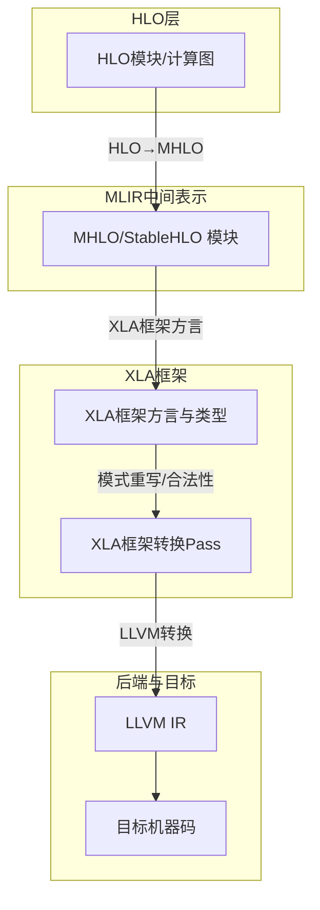
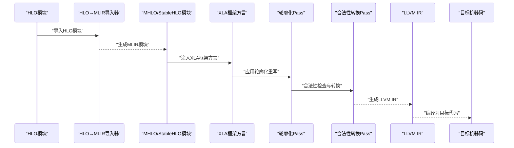
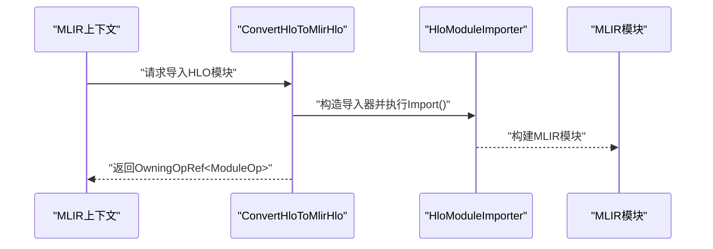
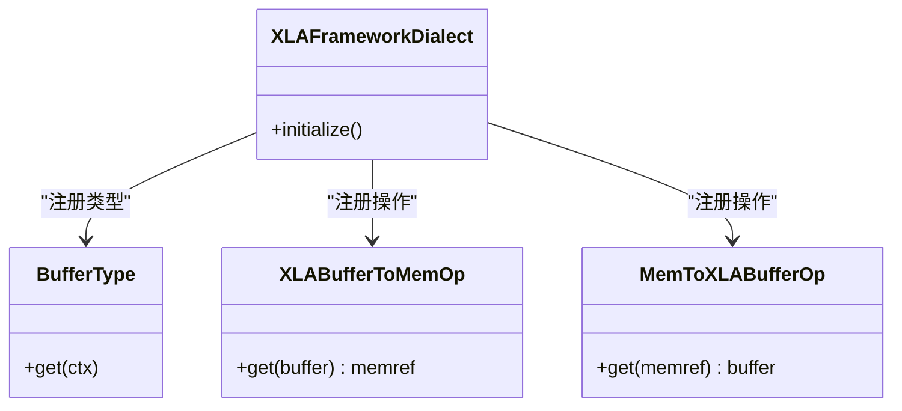
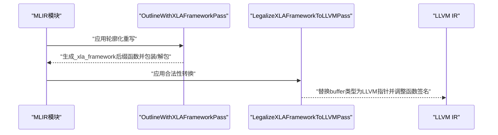
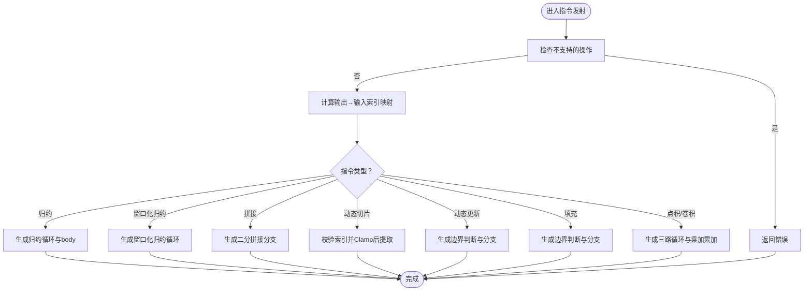
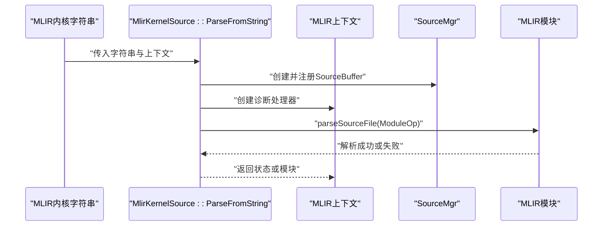
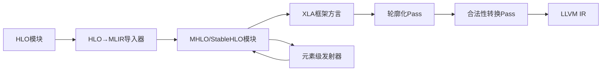

# MLIR代码生成

<cite>
**本文引用的文件**
- [xla_framework.cc](file://xla/mlir/framework/ir/xla_framework.cc)
- [elemental_hlo_to_mlir.cc](file://xla/codegen/emitters/elemental_hlo_to_mlir.cc)
- [hlo_to_mlir_hlo.cc](file://xla/hlo/translate/hlo_to_mhlo/hlo_to_mlir_hlo.cc)
- [mlir_hlo_to_hlo.cc](file://xla/hlo/translate/mhlo_to_hlo/mlir_hlo_to_hlo.cc)
- [outline_with_xla_framework.cc](file://xla/mlir/framework/transforms/outline_with_xla_framework.cc)
- [xla_framework_to_llvm_pass.cc](file://xla/mlir/framework/transforms/xla_framework_to_llvm_pass.cc)
- [mlir_kernel_source.cc](file://xla/codegen/mlir_kernel_source.cc)
- [arith.cc](file://xla/mlir/tools/mlir_interpreter/dialects/arith.cc)
- [affine.cc](file://xla/mlir/tools/mlir_interpreter/dialects/affine.cc)
</cite>

## 目录
1. [引言](#引言)
2. [项目结构](#项目结构)
3. [核心组件](#核心组件)
4. [架构总览](#架构总览)
5. [详细组件分析](#详细组件分析)
6. [依赖关系分析](#依赖关系分析)
7. [性能考量](#性能考量)
8. [故障排查指南](#故障排查指南)
9. [结论](#结论)
10. [附录](#附录)

## 引言
本文件系统性阐述XLA中的MLIR代码生成功能，覆盖从HLO到MLIR（MHLO/StableHLO）的转换、XLA框架方言与操作、模式匹配与重写、Pass管道与调度策略、到目标代码的转换流程，并讨论MLIR的可组合性与模块化设计、调试与验证机制，以及与现有HLO系统的兼容性与迁移路径。

## 项目结构
围绕MLIR代码生成的关键目录与文件如下：
- 框架与方言：xla/mlir/framework/ir 与 xla/mlir/framework/transforms 提供XLA框架方言与转换Pass。
- HLO↔MLIR互转：xla/hlo/translate/hlo_to_mhlo 与 xla/hlo/translate/mhlo_to_hlo 提供HLO到MHLO/StableHLO及反向导出。
- 代码生成器：xla/codegen/emitters 提供基于HLO指令的MLIR发射器实现。
- 工具与解释器：xla/mlir/tools/mlir_interpreter/dialects 提供算术与仿射等方言的解释器实现，辅助验证与调试。
- 内核源解析：xla/codegen/mlir_kernel_source.cc 提供MLIR内核字符串解析能力。

图表来源
- [hlo_to_mlir_hlo.cc](file://xla/hlo/translate/hlo_to_mhlo/hlo_to_mlir_hlo.cc#L34-L55)
- [xla_framework.cc](file://xla/mlir/framework/ir/xla_framework.cc#L33-L45)
- [outline_with_xla_framework.cc](file://xla/mlir/framework/transforms/outline_with_xla_framework.cc#L59-L141)
- [xla_framework_to_llvm_pass.cc](file://xla/mlir/framework/transforms/xla_framework_to_llvm_pass.cc#L207-L250)

章节来源
- [hlo_to_mlir_hlo.cc](file://xla/hlo/translate/hlo_to_mhlo/hlo_to_mlir_hlo.cc#L34-L55)
- [mlir_kernel_source.cc](file://xla/codegen/mlir_kernel_source.cc#L37-L57)

## 核心组件
- HLO到MLIR（MHLO/StableHLO）转换器：负责将HLO模块导入为MLIR模块，支持选择是否导出所有计算与参数扁平化。
- XLA框架方言与类型：在MLIR中定义XLA专用的buffer类型与操作，用于封装内存布局与调用约定。
- 模式重写与合法性Pass：提供函数轮廓化（outline）与XLA框架到LLVM的合法性转换Pass。
- 元素级HLO到MLIR发射器：根据HLO指令语义生成对应的MLIR算子序列，处理索引映射、循环嵌套、广播与归约等。
- MLIR内核源解析：从字符串解析MLIR模块，便于加载与进一步Pass处理。
- 解释器方言实现：为算术与仿射等方言提供解释执行能力，辅助验证与调试。

章节来源
- [hlo_to_mlir_hlo.cc](file://xla/hlo/translate/hlo_to_mhlo/hlo_to_mlir_hlo.cc#L34-L55)
- [xla_framework.cc](file://xla/mlir/framework/ir/xla_framework.cc#L33-L45)
- [outline_with_xla_framework.cc](file://xla/mlir/framework/transforms/outline_with_xla_framework.cc#L59-L141)
- [xla_framework_to_llvm_pass.cc](file://xla/mlir/framework/transforms/xla_framework_to_llvm_pass.cc#L207-L250)
- [elemental_hlo_to_mlir.cc](file://xla/codegen/emitters/elemental_hlo_to_mlir.cc#L169-L211)
- [mlir_kernel_source.cc](file://xla/codegen/mlir_kernel_source.cc#L37-L57)
- [arith.cc](file://xla/mlir/tools/mlir_interpreter/dialects/arith.cc#L62-L90)
- [affine.cc](file://xla/mlir/tools/mlir_interpreter/dialects/affine.cc#L30-L45)

## 架构总览
下图展示从HLO到目标代码的整体流水线，包括导入、XLA框架方言注入、模式重写、合法性转换与最终LLVM生成。

图表来源
- [hlo_to_mlir_hlo.cc](file://xla/hlo/translate/hlo_to_mhlo/hlo_to_mlir_hlo.cc#L34-L55)
- [xla_framework.cc](file://xla/mlir/framework/ir/xla_framework.cc#L33-L45)
- [outline_with_xla_framework.cc](file://xla/mlir/framework/transforms/outline_with_xla_framework.cc#L156-L173)
- [xla_framework_to_llvm_pass.cc](file://xla/mlir/framework/transforms/xla_framework_to_llvm_pass.cc#L218-L249)

## 详细组件分析

### 组件A：HLO到MLIR（MHLO/StableHLO）转换
- 职责：将HLO模块导入为MLIR模块，支持多种导入选项（如是否导入所有计算、参数结果扁平化、是否输出StableHLO）。
- 关键点：
  - 使用作用域诊断处理器统一捕获错误。
  - 导入器负责遍历HLO计算并构建对应MLIR操作。
  - 支持从HloModuleProto或HloModule对象导入。
- 复杂度：导入复杂度与HLO图规模成正比；属性与形状信息在导入时被保留以保证后续Pass正确性。

图表来源
- [hlo_to_mlir_hlo.cc](file://xla/hlo/translate/hlo_to_mhlo/hlo_to_mlir_hlo.cc#L34-L55)

章节来源
- [hlo_to_mlir_hlo.cc](file://xla/hlo/translate/hlo_to_mhlo/hlo_to_mlir_hlo.cc#L34-L55)

### 组件B：XLA框架方言与类型
- 职责：定义XLA框架专用的方言、类型与操作，例如buffer类型与转换操作，用于在MLIR中表达XLA内存抽象。
- 初始化：通过initialize方法注册操作与类型，确保在MLIR上下文中可用。
- 用途：配合轮廓化Pass将原函数签名替换为buffer类型，再由合法性Pass转换为LLVM裸指针调用约定。

图表来源
- [xla_framework.cc](file://xla/mlir/framework/ir/xla_framework.cc#L33-L45)

章节来源
- [xla_framework.cc](file://xla/mlir/framework/ir/xla_framework.cc#L33-L45)

### 组件C：轮廓化与合法性转换Pass
- 轮廓化（OutlineWithXLAFrameworkPass）：
  - 将仅使用memref作为输入/输出的函数轮廓化为XLA框架buffer类型函数，并插入包装/解包逻辑。
  - 仅对特定函数名与类型进行匹配，避免重复轮廓化。
- 合法化（LegalizeXLAFrameworkToLLVM）：
  - 将XLA框架buffer类型转换为LLVM指针类型，调整函数签名以适配调用约定。
  - 通过IR映射与GEP/Load/Store操作处理多值结果与输入映射。

图表来源
- [outline_with_xla_framework.cc](file://xla/mlir/framework/transforms/outline_with_xla_framework.cc#L59-L141)
- [xla_framework_to_llvm_pass.cc](file://xla/mlir/framework/transforms/xla_framework_to_llvm_pass.cc#L207-L250)

章节来源
- [outline_with_xla_framework.cc](file://xla/mlir/framework/transforms/outline_with_xla_framework.cc#L59-L141)
- [xla_framework_to_llvm_pass.cc](file://xla/mlir/framework/transforms/xla_framework_to_llvm_pass.cc#L207-L250)

### 组件D：元素级HLO到MLIR发射器
- 职责：将HLO指令映射为MLIR算子序列，处理索引映射、循环嵌套、归约、窗口化归约、拼接、动态切片/更新、填充、点积/卷积等。
- 索引与约束：
  - 使用IndexingMap推导输出到输入的索引映射，结合约束检查生成边界条件判断。
  - 对于pad/concat/gather/dynamic slice/update等，依据维度与边界生成分支逻辑。
- 循环与归约：
  - 通过嵌套循环与迭代累加器实现归约与窗口化归约。
  - 点积/卷积采用三路循环（批/行/列）并按精度配置进行浮点扩展/截断。
- 类型与广播：
  - 根据HLO元素类型映射到MLIR类型，处理无符号整数与布尔类型扩展。
  - 对tuple类型进行位掩码兼容性处理与索引映射。

图表来源
- [elemental_hlo_to_mlir.cc](file://xla/codegen/emitters/elemental_hlo_to_mlir.cc#L169-L211)
- [elemental_hlo_to_mlir.cc](file://xla/codegen/emitters/elemental_hlo_to_mlir.cc#L213-L254)
- [elemental_hlo_to_mlir.cc](file://xla/codegen/emitters/elemental_hlo_to_mlir.cc#L256-L302)
- [elemental_hlo_to_mlir.cc](file://xla/codegen/emitters/elemental_hlo_to_mlir.cc#L320-L340)
- [elemental_hlo_to_mlir.cc](file://xla/codegen/emitters/elemental_hlo_to_mlir.cc#L342-L392)
- [elemental_hlo_to_mlir.cc](file://xla/codegen/emitters/elemental_hlo_to_mlir.cc#L457-L484)
- [elemental_hlo_to_mlir.cc](file://xla/codegen/emitters/elemental_hlo_to_mlir.cc#L526-L594)

章节来源
- [elemental_hlo_to_mlir.cc](file://xla/codegen/emitters/elemental_hlo_to_mlir.cc#L169-L211)
- [elemental_hlo_to_mlir.cc](file://xla/codegen/emitters/elemental_hlo_to_mlir.cc#L213-L254)
- [elemental_hlo_to_mlir.cc](file://xla/codegen/emitters/elemental_hlo_to_mlir.cc#L256-L302)
- [elemental_hlo_to_mlir.cc](file://xla/codegen/emitters/elemental_hlo_to_mlir.cc#L320-L340)
- [elemental_hlo_to_mlir.cc](file://xla/codegen/emitters/elemental_hlo_to_mlir.cc#L342-L392)
- [elemental_hlo_to_mlir.cc](file://xla/codegen/emitters/elemental_hlo_to_mlir.cc#L457-L484)
- [elemental_hlo_to_mlir.cc](file://xla/codegen/emitters/elemental_hlo_to_mlir.cc#L526-L594)

### 组件E：MLIR内核源解析
- 职责：从字符串解析MLIR模块，提供错误处理与诊断流，便于加载外部生成的MLIR内核。
- 流程：创建SourceMgr与诊断处理器，添加内存缓冲区，解析为MLIR模块，失败时返回内部错误。

图表来源
- [mlir_kernel_source.cc](file://xla/codegen/mlir_kernel_source.cc#L37-L57)

章节来源
- [mlir_kernel_source.cc](file://xla/codegen/mlir_kernel_source.cc#L37-L57)

### 组件F：解释器方言（算术与仿射）
- 算术方言解释器：实现常量、比较、选择、类型转换、位操作等，支持标量与张量/向量。
- 仿射方言解释器：实现仿射应用、最小/最大等，用于评估仿射表达式与约束。
- 用途：在开发与调试阶段快速验证MLIR片段行为，辅助定位模式重写问题。

章节来源
- [arith.cc](file://xla/mlir/tools/mlir_interpreter/dialects/arith.cc#L62-L90)
- [arith.cc](file://xla/mlir/tools/mlir_interpreter/dialects/arith.cc#L157-L229)
- [arith.cc](file://xla/mlir/tools/mlir_interpreter/dialects/arith.cc#L231-L251)
- [arith.cc](file://xla/mlir/tools/mlir_interpreter/dialects/arith.cc#L261-L267)
- [affine.cc](file://xla/mlir/tools/mlir_interpreter/dialects/affine.cc#L30-L45)

## 依赖关系分析
- HLO到MLIR：HLO模块经导入器转换为MHLO/StableHLO模块，随后注入XLA框架方言。
- XLA框架Pass：轮廓化Pass与合法性Pass共同完成从XLA框架类型到LLVM指针类型的转换。
- 发射器与索引：元素级发射器依赖HLO索引分析与映射，确保生成的MLIR在形状与边界上正确。
- 解释器：解释器方言为开发与调试提供即时反馈，减少对后端编译链的依赖。

图表来源
- [hlo_to_mlir_hlo.cc](file://xla/hlo/translate/hlo_to_mhlo/hlo_to_mlir_hlo.cc#L34-L55)
- [xla_framework.cc](file://xla/mlir/framework/ir/xla_framework.cc#L33-L45)
- [outline_with_xla_framework.cc](file://xla/mlir/framework/transforms/outline_with_xla_framework.cc#L156-L173)
- [xla_framework_to_llvm_pass.cc](file://xla/mlir/framework/transforms/xla_framework_to_llvm_pass.cc#L218-L249)
- [elemental_hlo_to_mlir.cc](file://xla/codegen/emitters/elemental_hlo_to_mlir.cc#L665-L676)

章节来源
- [hlo_to_mlir_hlo.cc](file://xla/hlo/translate/hlo_to_mhlo/hlo_to_mlir_hlo.cc#L34-L55)
- [xla_framework.cc](file://xla/mlir/framework/ir/xla_framework.cc#L33-L45)
- [outline_with_xla_framework.cc](file://xla/mlir/framework/transforms/outline_with_xla_framework.cc#L156-L173)
- [xla_framework_to_llvm_pass.cc](file://xla/mlir/framework/transforms/xla_framework_to_llvm_pass.cc#L218-L249)
- [elemental_hlo_to_mlir.cc](file://xla/codegen/emitters/elemental_hlo_to_mlir.cc#L665-L676)

## 性能考量
- 索引与约束生成：通过IndexingMap与约束检查减少边界判断开销，避免冗余分支。
- 归约与窗口化归约：采用嵌套循环与迭代累加器，尽量保持局部性与向量化友好。
- 点积/卷积：根据精度配置进行必要的浮点扩展/截断，平衡精度与吞吐。
- Pass管道：轮廓化与合法性转换应尽早完成，减少后续Pass的类型复杂度与重写难度。
- 解释器验证：在开发阶段使用解释器快速验证，降低编译-运行-调试周期。

## 故障排查指南
- 导入失败：
  - 检查HLO模块是否包含不支持的操作或非法形状。
  - 查看导入器的诊断处理器输出，定位具体错误位置。
- 轮廓化失败：
  - 确认函数仅使用memref类型且满足轮廓化条件。
  - 检查是否已标记“outlined”属性导致重复轮廓化。
- 合法化失败：
  - 确认buffer类型是否完全替换为LLVM指针类型。
  - 检查函数签名与调用约定是否一致。
- 解释器异常：
  - 验证解释器方言是否注册，操作是否支持。
  - 检查输入类型与形状是否匹配。

章节来源
- [hlo_to_mlir_hlo.cc](file://xla/hlo/translate/hlo_to_mhlo/hlo_to_mlir_hlo.cc#L51-L54)
- [outline_with_xla_framework.cc](file://xla/mlir/framework/transforms/outline_with_xla_framework.cc#L75-L90)
- [xla_framework_to_llvm_pass.cc](file://xla/mlir/framework/transforms/xla_framework_to_llvm_pass.cc#L233-L244)
- [arith.cc](file://xla/mlir/tools/mlir_interpreter/dialects/arith.cc#L62-L90)

## 结论
XLA的MLIR代码生成体系以HLO到MHLO/StableHLO的导入为核心，结合XLA框架方言与一系列模式重写Pass，实现了从高层计算图到LLVM IR再到目标代码的完整链路。元素级发射器提供了强大的指令级控制与优化空间，解释器则为开发与调试提供了高效手段。整体设计强调模块化与可组合性，便于扩展新的方言与Pass。

## 附录
- 兼容性与迁移路径：
  - 优先使用MHLO/StableHLO作为中间表示，逐步替代旧有HLO Pass。
  - 在迁移过程中，利用HLO↔MLIR双向转换工具进行对照验证。
- 最佳实践：
  - 明确划分Pass职责，避免跨Pass的状态耦合。
  - 在发射器中优先使用索引映射与约束检查，确保边界安全。
  - 利用解释器进行增量验证，减少后端编译成本。