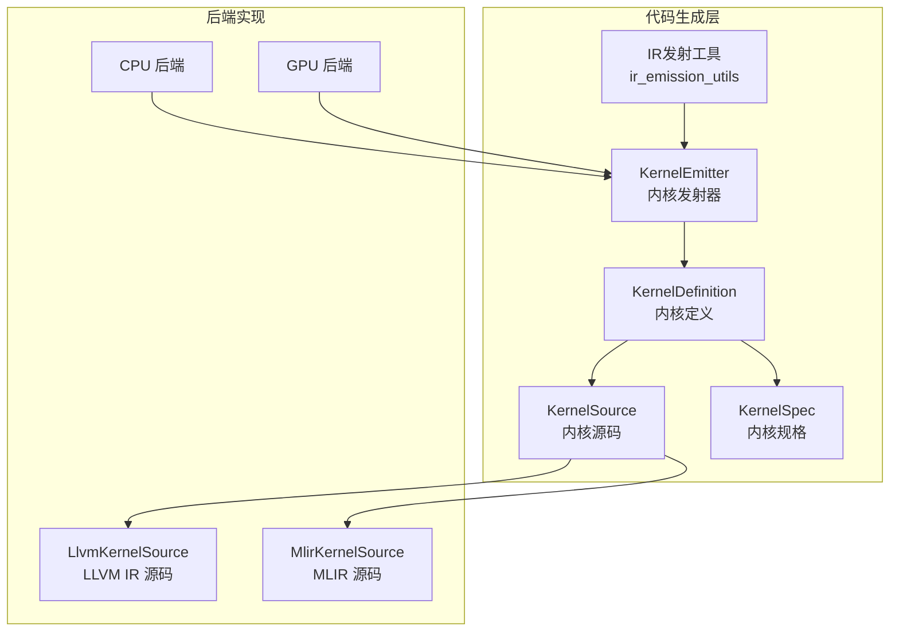
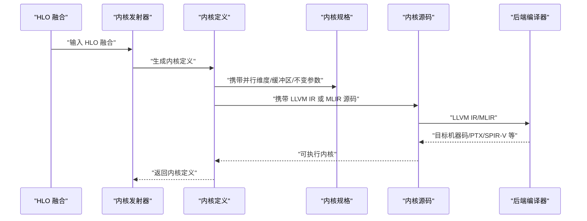
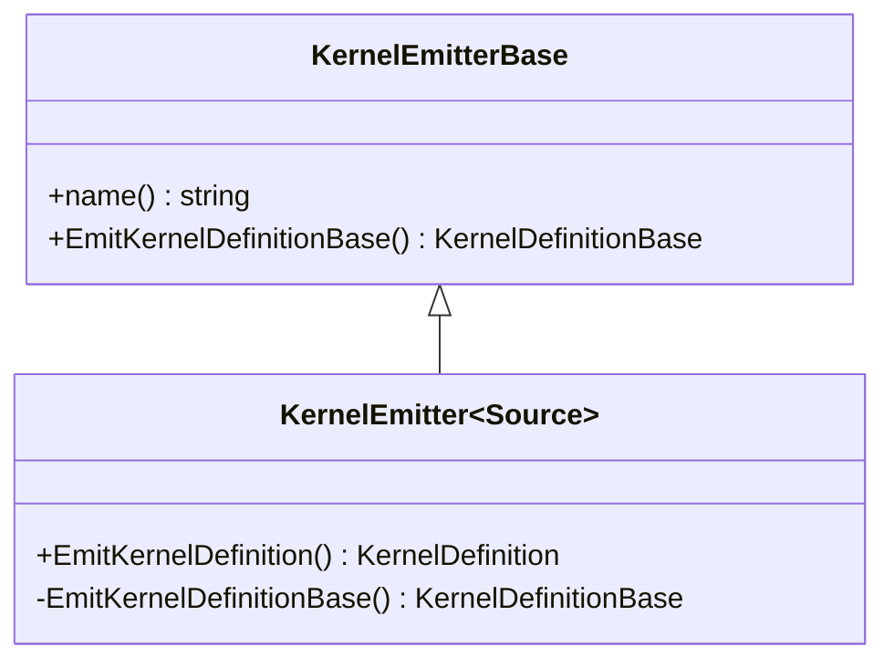
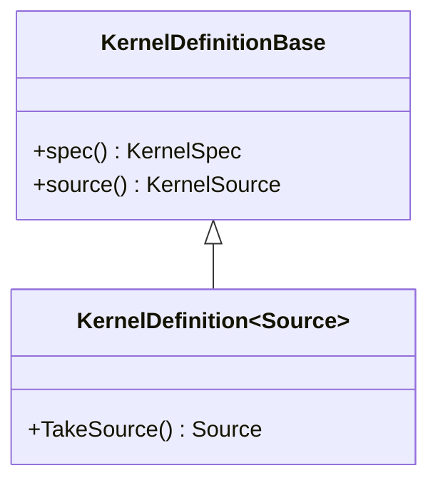
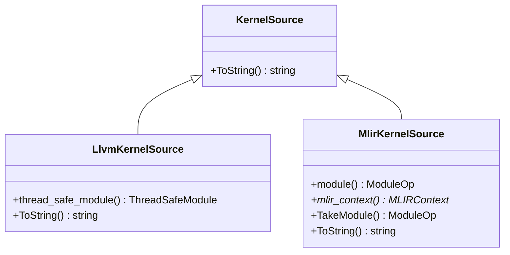
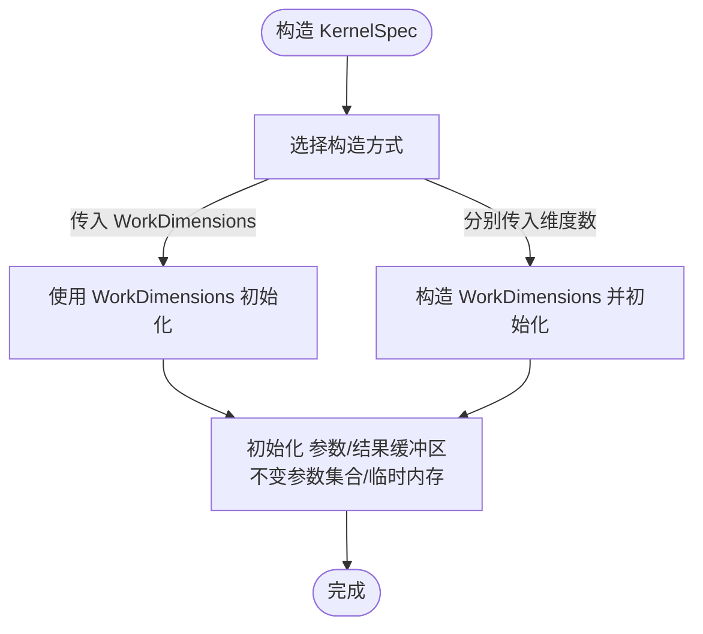
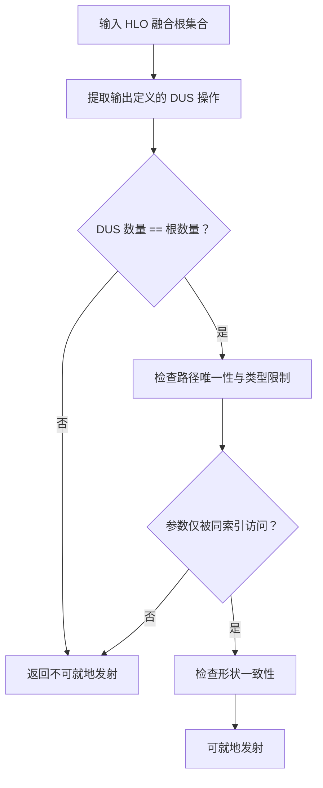
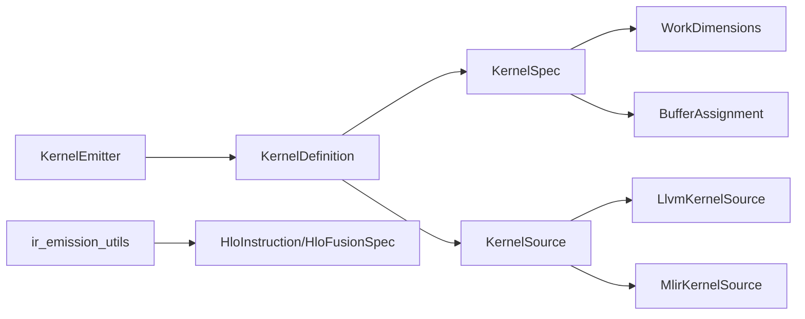

# 代码生成层

<cite>
**本文引用的文件**
- [xla/codegen/kernel_emitter.h](file://xla/codegen/kernel_emitter.h)
- [xla/codegen/kernel_definition.h](file://xla/codegen/kernel_definition.h)
- [xla/codegen/kernel_source.h](file://xla/codegen/kernel_source.h)
- [xla/codegen/llvm_kernel_source.h](file://xla/codegen/llvm_kernel_source.h)
- [xla/codegen/mlir_kernel_source.h](file://xla/codegen/mlir_kernel_source.h)
- [xla/codegen/kernel_spec.h](file://xla/codegen/kernel_spec.h)
- [xla/codegen/kernel_spec.cc](file://xla/codegen/kernel_spec.cc)
- [xla/codegen/ir_emission_utils.h](file://xla/codegen/ir_emission_utils.h)
- [xla/codegen/ir_emission_utils.cc](file://xla/codegen/ir_emission_utils.cc)
- [xla/codegen/intrinsic/README.md](file://xla/codegen/intrinsic/README.md)
- [xla/backends/cpu/...](file://xla/backends/cpu/)
- [xla/backends/gpu/...](file://xla/backends/gpu/)
- [xla/runtime/work_dimensions.h](file://xla/runtime/work_dimensions.h)
- [xla/runtime/work_cluster.h](file://xla/runtime/work_cluster.h)
- [xla/runtime/work_group.h](file://xla/runtime/work_group.h)
- [xla/runtime/work_item.h](file://xla/runtime/work_item.h)
- [xla/service/buffer_assignment.h](file://xla/service/buffer_assignment.h)
- [xla/service/shaped_slice.h](file://xla/service/shaped_slice.h)
- [xla/hlo/ir/hlo_instruction.h](file://xla/hlo/ir/hlo_instruction.h)
- [xla/hlo/utils/hlo_traversal.h](file://xla/hlo/utils/hlo_traversal.h)
- [xla/shape_util.h](file://xla/shape_util.h)
- [xla/codegen/hlo_fusion_spec.h](file://xla/codegen/hlo_fusion_spec.h)
</cite>

## 目录
1. [引言](#引言)
2. [项目结构](#项目结构)
3. [核心组件](#核心组件)
4. [架构总览](#架构总览)
5. [详细组件分析](#详细组件分析)
6. [依赖关系分析](#依赖关系分析)
7. [性能考量](#性能考量)
8. [故障排查指南](#故障排查指南)
9. [结论](#结论)
10. [附录](#附录)

## 引言
本文件系统性梳理XLA代码生成层的设计与实现，聚焦于从HLO融合到目标代码的生成路径，覆盖LLVM IR与MLIR两种后端源码形态、内核发射器（Kernel Emitters）的职责与工作流、内核规格（KernelSpec）的定义与执行维度、以及针对CPU/GPU等后端的差异化处理。同时总结代码生成层的优化策略（如循环展开、向量化、寄存器分配）、调试与性能分析手段、错误处理机制，以及与LLVM工具链的集成方式，并给出扩展新硬件架构的实践建议。

## 项目结构
XLA代码生成层位于xla/codegen目录，围绕“内核发射器”“内核定义”“内核源码”“内核规格”四个抽象构建，形成统一的编译期接口与运行时可执行单元。其关键文件如下：
- 内核发射器：定义从HLO融合到内核定义的抽象接口
- 内核定义：封装内核规格与具体内核源码
- 内核源码：抽象LLVM IR与MLIR两类后端源码
- 内核规格：描述并行维度、缓冲区布局、不变参数等执行信息
- IR发射辅助：提供HLO融合特化发射的判断与工具函数

图表来源
- [xla/codegen/kernel_emitter.h](file://xla/codegen/kernel_emitter.h#L34-L70)
- [xla/codegen/kernel_definition.h](file://xla/codegen/kernel_definition.h#L34-L78)
- [xla/codegen/kernel_source.h](file://xla/codegen/kernel_source.h#L23-L37)
- [xla/codegen/llvm_kernel_source.h](file://xla/codegen/llvm_kernel_source.h#L34-L51)
- [xla/codegen/mlir_kernel_source.h](file://xla/codegen/mlir_kernel_source.h#L41-L76)
- [xla/codegen/kernel_spec.h](file://xla/codegen/kernel_spec.h#L41-L114)
- [xla/codegen/ir_emission_utils.h](file://xla/codegen/ir_emission_utils.h#L35-L72)

章节来源
- [xla/codegen/kernel_emitter.h](file://xla/codegen/kernel_emitter.h#L34-L70)
- [xla/codegen/kernel_definition.h](file://xla/codegen/kernel_definition.h#L34-L78)
- [xla/codegen/kernel_source.h](file://xla/codegen/kernel_source.h#L23-L37)
- [xla/codegen/llvm_kernel_source.h](file://xla/codegen/llvm_kernel_source.h#L34-L51)
- [xla/codegen/mlir_kernel_source.h](file://xla/codegen/mlir_kernel_source.h#L41-L76)
- [xla/codegen/kernel_spec.h](file://xla/codegen/kernel_spec.h#L41-L114)
- [xla/codegen/ir_emission_utils.h](file://xla/codegen/ir_emission_utils.h#L35-L72)

## 核心组件
- 内核发射器（KernelEmitter）
  - 抽象接口：接收HLO融合输入，输出内核定义（包含内核规格与内核源码）
  - 类型安全：通过模板约束确保源码类型必须继承自KernelSource
- 内核定义（KernelDefinition）
  - 组合内核规格与具体内核源码，提供移动语义以避免不必要的拷贝
- 内核源码（KernelSource）
  - 抽象基类，派生出LLVM IR与MLIR两类后端源码
- 内核规格（KernelSpec）
  - 描述内核名称、并行维度（集群/组/项）、参数缓冲区、结果缓冲区、不变参数集合、临时内存需求等
- IR发射工具（ir_emission_utils）
  - 提供融合特性识别、动态更新切片（DUS）融合判断、中间节点判定等工具函数

章节来源
- [xla/codegen/kernel_emitter.h](file://xla/codegen/kernel_emitter.h#L34-L70)
- [xla/codegen/kernel_definition.h](file://xla/codegen/kernel_definition.h#L34-L78)
- [xla/codegen/kernel_source.h](file://xla/codegen/kernel_source.h#L23-L37)
- [xla/codegen/llvm_kernel_source.h](file://xla/codegen/llvm_kernel_source.h#L34-L51)
- [xla/codegen/mlir_kernel_source.h](file://xla/codegen/mlir_kernel_source.h#L41-L76)
- [xla/codegen/kernel_spec.h](file://xla/codegen/kernel_spec.h#L41-L114)
- [xla/codegen/kernel_spec.cc](file://xla/codegen/kernel_spec.cc#L32-L51)
- [xla/codegen/ir_emission_utils.h](file://xla/codegen/ir_emission_utils.h#L35-L72)
- [xla/codegen/ir_emission_utils.cc](file://xla/codegen/ir_emission_utils.cc#L42-L136)

## 架构总览
XLA代码生成层采用“发射器-定义-规格-源码”的分层设计，统一了CPU与GPU等后端的接口契约。发射器负责将HLO融合映射为内核定义；内核定义承载执行所需的并行维度与缓冲区布局；内核源码承载LLVM IR或MLIR实现；最终由后端编译器完成到目标ISA的转换。

图表来源
- [xla/codegen/kernel_emitter.h](file://xla/codegen/kernel_emitter.h#L56-L70)
- [xla/codegen/kernel_definition.h](file://xla/codegen/kernel_definition.h#L59-L78)
- [xla/codegen/kernel_spec.h](file://xla/codegen/kernel_spec.h#L41-L114)
- [xla/codegen/llvm_kernel_source.h](file://xla/codegen/llvm_kernel_source.h#L34-L51)
- [xla/codegen/mlir_kernel_source.h](file://xla/codegen/mlir_kernel_source.h#L41-L76)

## 详细组件分析

### 内核发射器（KernelEmitter）
- 设计要点
  - 抽象基类KernelEmitterBase提供统一的发射接口
  - 模板类KernelEmitter约束Source类型为KernelSource的派生
  - EmitKernelDefinition返回强类型的KernelDefinition，内部自动适配为KernelDefinitionBase
- 工作流程
  - 输入：HLO融合（由后端发射器实现）
  - 输出：内核定义（包含内核规格与内核源码）

图表来源
- [xla/codegen/kernel_emitter.h](file://xla/codegen/kernel_emitter.h#L34-L70)

章节来源
- [xla/codegen/kernel_emitter.h](file://xla/codegen/kernel_emitter.h#L34-L70)

### 内核定义（KernelDefinition）
- 设计要点
  - 组合KernelSpec与具体Source类型，提供TakeSource移动所有权的能力
  - 支持模板实参推导，便于构造
- 作用
  - 将内核规格与内核源码绑定，作为运行时可执行单元

图表来源
- [xla/codegen/kernel_definition.h](file://xla/codegen/kernel_definition.h#L34-L78)

章节来源
- [xla/codegen/kernel_definition.h](file://xla/codegen/kernel_definition.h#L34-L78)

### 内核源码（KernelSource 及其实现）
- KernelSource
  - 抽象基类，提供ToString用于人类可读表示
- LlvmKernelSource
  - 承载线程安全的LLVM模块，支持移动语义传递给后端编译器
- MlirKernelSource
  - 承载MLIR模块与上下文，支持解析字符串形式的MLIR IR

图表来源
- [xla/codegen/kernel_source.h](file://xla/codegen/kernel_source.h#L23-L37)
- [xla/codegen/llvm_kernel_source.h](file://xla/codegen/llvm_kernel_source.h#L34-L51)
- [xla/codegen/mlir_kernel_source.h](file://xla/codegen/mlir_kernel_source.h#L41-L76)

章节来源
- [xla/codegen/kernel_source.h](file://xla/codegen/kernel_source.h#L23-L37)
- [xla/codegen/llvm_kernel_source.h](file://xla/codegen/llvm_kernel_source.h#L34-L51)
- [xla/codegen/mlir_kernel_source.h](file://xla/codegen/mlir_kernel_source.h#L41-L76)

### 内核规格（KernelSpec）
- 设计要点
  - 名称、并行维度（集群/组/项）、参数/结果缓冲区、不变参数集合、临时内存需求
  - 支持两种构造方式：直接传入并行维度或分别传入各维度数量
- 作用
  - 描述内核在后端运行时的执行拓扑与资源需求

图表来源
- [xla/codegen/kernel_spec.h](file://xla/codegen/kernel_spec.h#L45-L53)
- [xla/codegen/kernel_spec.cc](file://xla/codegen/kernel_spec.cc#L32-L51)

章节来源
- [xla/codegen/kernel_spec.h](file://xla/codegen/kernel_spec.h#L41-L114)
- [xla/codegen/kernel_spec.cc](file://xla/codegen/kernel_spec.cc#L32-L51)

### IR发射工具（ir_emission_utils）
- 功能概览
  - 判定中间节点（元素级/位移/重塑/转置等）
  - 查找满足条件的“英雄节点”
  - 判断是否为动态更新切片（DUS）融合
  - 判断DUS融合是否可就地发射
- 应用场景
  - 为特定融合模式选择最优发射策略（如就地写回以减少内存占用）

图表来源
- [xla/codegen/ir_emission_utils.cc](file://xla/codegen/ir_emission_utils.cc#L149-L289)

章节来源
- [xla/codegen/ir_emission_utils.h](file://xla/codegen/ir_emission_utils.h#L35-L72)
- [xla/codegen/ir_emission_utils.cc](file://xla/codegen/ir_emission_utils.cc#L42-L136)
- [xla/codegen/ir_emission_utils.cc](file://xla/codegen/ir_emission_utils.cc#L149-L289)

### 内核发射器工作原理（HLO到机器指令）
- CPU后端
  - 并行维度映射到线程池任务提交
  - 通常结合循环展开、向量化与寄存器分配优化
- GPU后端
  - 并行维度映射到网格/块/线程
  - 通过共享内存、寄存器与指令级并行（ILP）提升吞吐
- 共同点
  - 发射器根据融合特性选择合适策略（如DUS就地）
  - 通过KernelSpec明确执行拓扑，确保数据局部性与带宽利用

章节来源
- [xla/codegen/kernel_spec.h](file://xla/codegen/kernel_spec.h#L59-L80)
- [xla/backends/cpu/...](file://xla/backends/cpu/)
- [xla/backends/gpu/...](file://xla/backends/gpu/)

### 与LLVM工具链的集成
- LLVM IR路径
  - LlvmKernelSource持有线程安全模块，便于后端编译器进行JIT/链接/优化
  - 支持多内核聚合或单内核分离的模块组织策略
- MLIR路径
  - MlirKernelSource承载MLIR模块，由对应后端编译器完成LowerToLLVM
- intrinsic库
  - 提供数学函数的LLVM IR定义发射，兼顾GPU/CPU管线与精度要求

章节来源
- [xla/codegen/llvm_kernel_source.h](file://xla/codegen/llvm_kernel_source.h#L34-L51)
- [xla/codegen/mlir_kernel_source.h](file://xla/codegen/mlir_kernel_source.h#L41-L76)
- [xla/codegen/intrinsic/README.md](file://xla/codegen/intrinsic/README.md#L1-L22)

## 依赖关系分析
- 组件耦合
  - KernelEmitter依赖KernelDefinition与KernelSource
  - KernelDefinition组合KernelSpec与Source
  - KernelSpec依赖运行时并行维度与缓冲区切片
- 外部依赖
  - LLVM IR：Orc/ThreadSafeModule、LLVMContext/Module
  - MLIR：MLIRContext、ModuleOp
  - HLO：HloInstruction、HloFusionSpec、遍历工具
  - 运行时：WorkDimensions/Cluster/Group/Item

图表来源
- [xla/codegen/kernel_emitter.h](file://xla/codegen/kernel_emitter.h#L56-L70)
- [xla/codegen/kernel_definition.h](file://xla/codegen/kernel_definition.h#L59-L78)
- [xla/codegen/kernel_spec.h](file://xla/codegen/kernel_spec.h#L41-L114)
- [xla/codegen/llvm_kernel_source.h](file://xla/codegen/llvm_kernel_source.h#L34-L51)
- [xla/codegen/mlir_kernel_source.h](file://xla/codegen/mlir_kernel_source.h#L41-L76)
- [xla/codegen/ir_emission_utils.h](file://xla/codegen/ir_emission_utils.h#L35-L72)
- [xla/runtime/work_dimensions.h](file://xla/runtime/work_dimensions.h)
- [xla/service/buffer_assignment.h](file://xla/service/buffer_assignment.h)

章节来源
- [xla/codegen/kernel_emitter.h](file://xla/codegen/kernel_emitter.h#L56-L70)
- [xla/codegen/kernel_definition.h](file://xla/codegen/kernel_definition.h#L59-L78)
- [xla/codegen/kernel_spec.h](file://xla/codegen/kernel_spec.h#L41-L114)
- [xla/codegen/llvm_kernel_source.h](file://xla/codegen/llvm_kernel_source.h#L34-L51)
- [xla/codegen/mlir_kernel_source.h](file://xla/codegen/mlir_kernel_source.h#L41-L76)
- [xla/codegen/ir_emission_utils.h](file://xla/codegen/ir_emission_utils.h#L35-L72)

## 性能考量
- 循环展开
  - 针对小规模维度进行展开，降低循环开销，提高指令级并行度
- 向量化
  - 利用SIMD/向量指令处理连续数据，提升内存带宽利用率
- 寄存器分配
  - 通过LLVM/MLIR优化Pass控制寄存器压力，避免溢出到内存
- 数据局部性
  - 基于KernelSpec的并行维度规划，优化共享内存/缓存命中
- 特化发射
  - 使用ir_emission_utils识别DUS等融合特性，采用就地写回减少临时内存

章节来源
- [xla/codegen/ir_emission_utils.cc](file://xla/codegen/ir_emission_utils.cc#L149-L289)
- [xla/codegen/kernel_spec.h](file://xla/codegen/kernel_spec.h#L59-L80)

## 故障排查指南
- 错误传播
  - 发射器与内核定义均返回状态或状态包装类型，便于上层统一处理
- 调试支持
  - 内核源码提供ToString便于打印IR内容（LLVM IR/MLIR）
  - MLIR源码支持从字符串解析，便于快速验证与回归测试
- 性能分析
  - 结合后端编译器的统计信息与运行时指标，定位热点路径
- 常见问题
  - 不变参数集合与缓冲区布局不一致导致的越界或重复计算
  - 并行维度设置不当引发的负载不均衡

章节来源
- [xla/codegen/kernel_source.h](file://xla/codegen/kernel_source.h#L31-L32)
- [xla/codegen/mlir_kernel_source.h](file://xla/codegen/mlir_kernel_source.h#L57-L71)
- [xla/codegen/kernel_spec.h](file://xla/codegen/kernel_spec.h#L97-L101)

## 结论
XLA代码生成层通过清晰的抽象与分层设计，实现了从HLO融合到目标代码的稳定桥接。LLVM IR与MLIR双轨并行，既保证了灵活性也兼顾了可维护性。内核规格统一了并行维度与资源需求，IR发射工具则提供了面向融合特性的优化开关。结合CPU/GPU后端的具体实现，该层能够高效地生成高质量的目标代码，并为扩展新硬件架构提供清晰的接入点。

## 附录
- 扩展新硬件架构建议
  - 定义新的KernelSource派生类以承载目标后端IR（如SPIR-V、RISC-V汇编等）
  - 实现对应的KernelEmitter，将HLO融合映射到新后端的内核规格与源码
  - 在后端编译器中增加LowerToLLVM/LowerToMLIR的Pass链，确保IR到目标ISA的正确转换
  - 借助ir_emission_utils的模式识别能力，优先支持常见融合特性（如DUS就地）

章节来源
- [xla/codegen/kernel_source.h](file://xla/codegen/kernel_source.h#L23-L37)
- [xla/codegen/kernel_emitter.h](file://xla/codegen/kernel_emitter.h#L56-L70)
- [xla/codegen/ir_emission_utils.h](file://xla/codegen/ir_emission_utils.h#L35-L72)