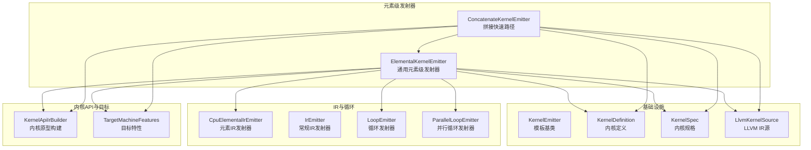
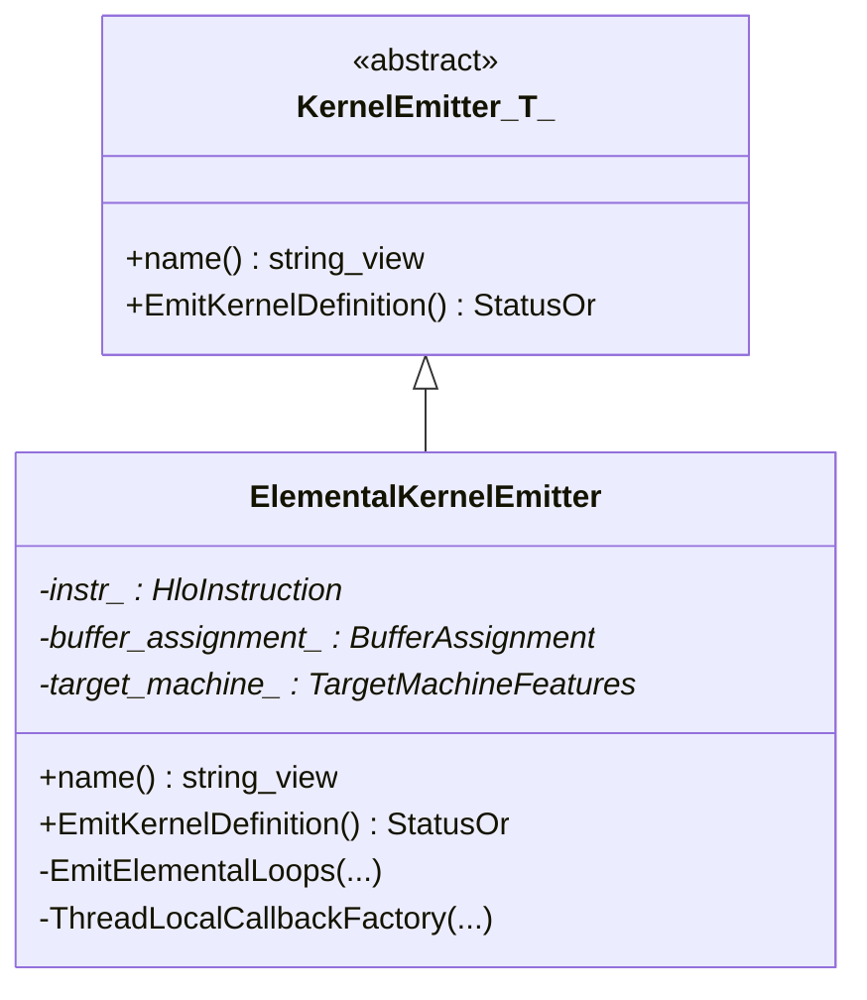
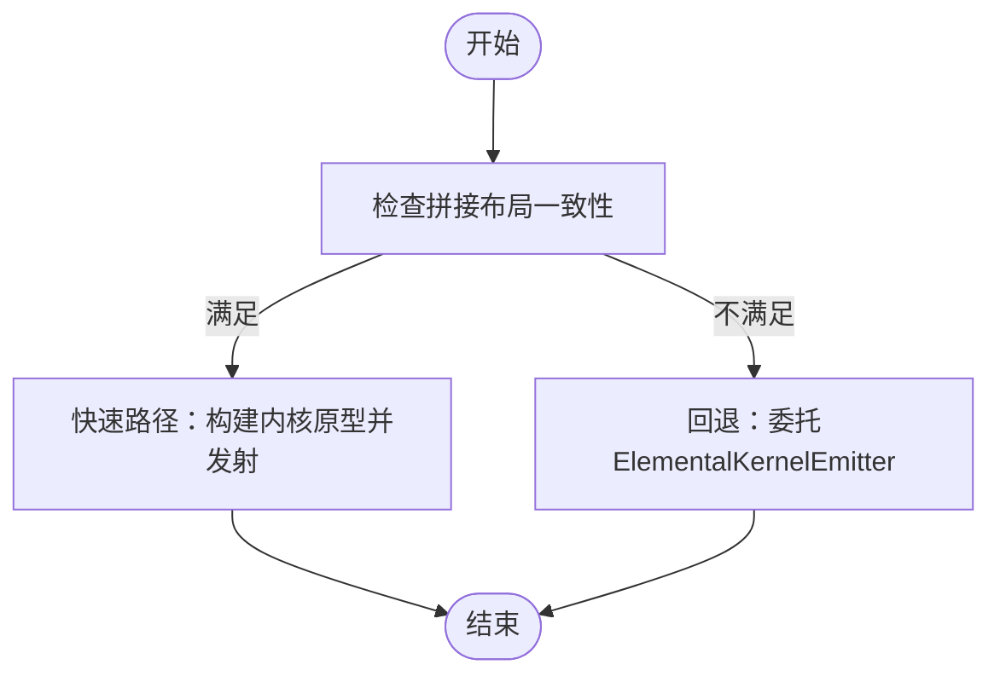
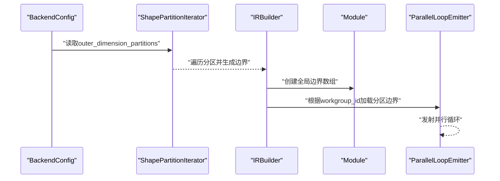
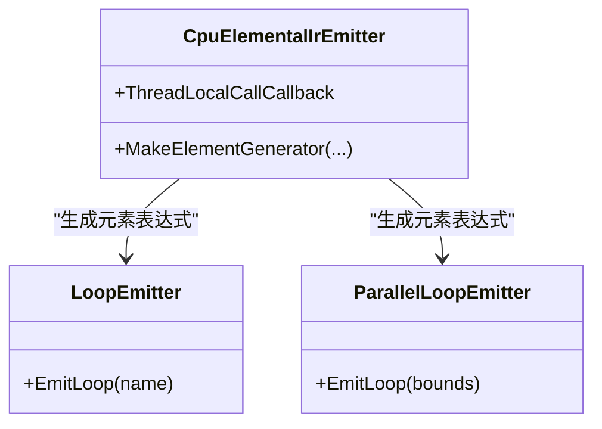
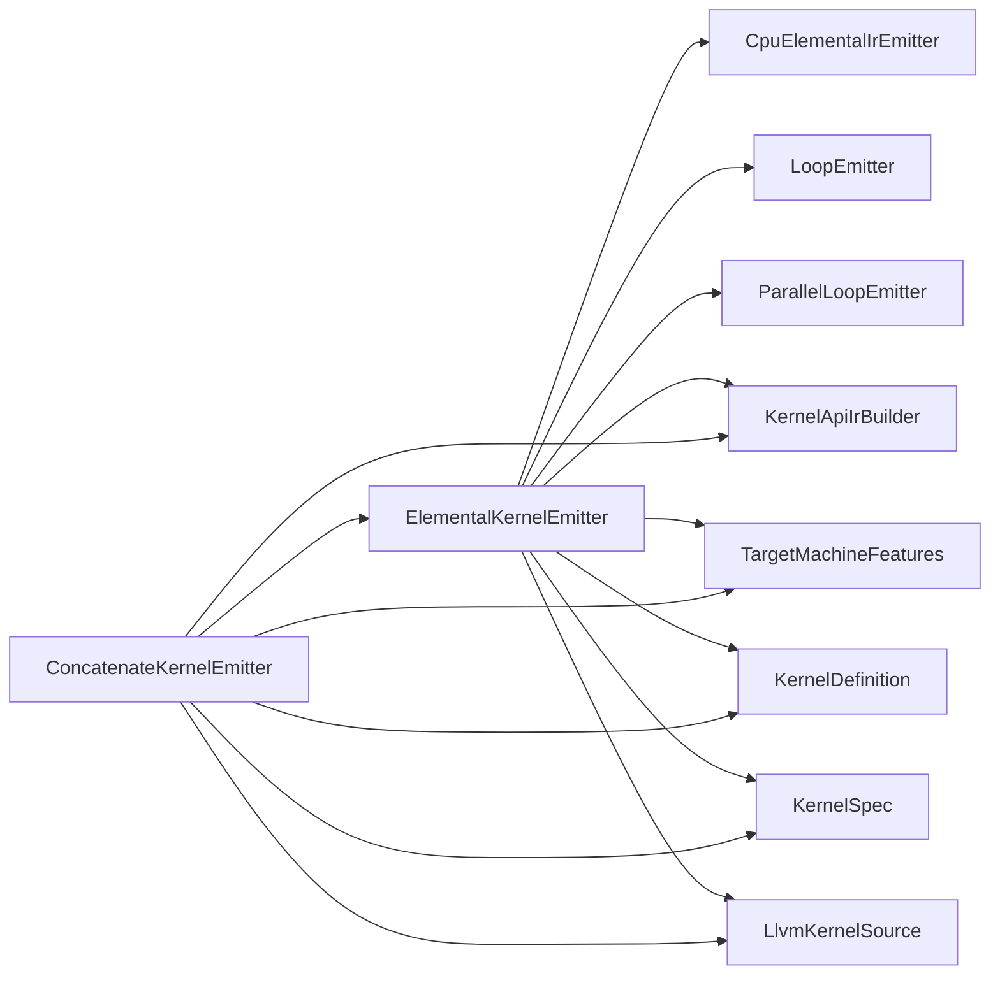

# 元素级发射器

<cite>
**本文引用的文件**
- [elemental_kernel_emitter.cc](file://xla/backends/cpu/codegen/elemental/elemental_kernel_emitter.cc)
- [elemental_kernel_emitter.h](file://xla/backends/cpu/codegen/elemental/elemental_kernel_emitter.h)
- [concatenate_kernel_emitter.cc](file://xla/backends/cpu/codegen/elemental/concatenate_kernel_emitter.cc)
- [concatenate_kernel_emitter.h](file://xla/backends/cpu/codegen/elemental/concatenate_kernel_emitter.h)
- [elemental_kernel_emitter_test.cc](file://xla/backends/cpu/codegen/elemental/elemental_kernel_emitter_test.cc)
- [kernel_emitter.h](file://xla/codegen/kernel_emitter.h)
- [kernel_definition.h](file://xla/codegen/kernel_definition.h)
- [kernel_spec.h](file://xla/codegen/kernel_spec.h)
- [llvm_kernel_source.h](file://xla/codegen/llvm_kernel_source.h)
- [ir_emitter.h](file://xla/service/cpu/ir_emitter.h)
- [elemental_ir_emitter.h](file://xla/service/cpu/elemental_ir_emitter.h)
- [loop_emitter.h](file://xla/service/llvm_ir/loop_emitter.h)
- [parallel_loop_emitter.h](file://xla/service/cpu/parallel_loop_emitter.h)
- [kernel_api_ir_builder.h](file://xla/backends/cpu/codegen/kernel_api_ir_builder.h)
- [target_machine_features.h](file://xla/backends/cpu/codegen/target_machine_features.h)
- [backend_config.pb.h](file://xla/service/cpu/backend_config.pb.h)
- [shape_partition.h](file://xla/shape_partition.h)
- [work_group.h](file://xla/runtime/work_group.h)
- [hlo_opcode.h](file://xla/hlo/ir/hlo_opcode.h)
- [many_small_ops_benchmark_test.cc](file://xla/backends/cpu/benchmarks/many_small_ops_benchmark_test.cc)
</cite>

## 目录
1. [简介](#简介)
2. [项目结构](#项目结构)
3. [核心组件](#核心组件)
4. [架构总览](#架构总览)
5. [详细组件分析](#详细组件分析)
6. [依赖关系分析](#依赖关系分析)
7. [性能考量](#性能考量)
8. [故障排查指南](#故障排查指南)
9. [结论](#结论)
10. [附录](#附录)

## 简介
本文件系统性阐述XLA CPU后端中的“元素级发射器”设计与实现，重点覆盖以下方面：
- 设计理念：以HLO指令为输入，通过元素级循环与元素生成器将高阶计算映射到底层LLVM IR内核，支持并行分区、快速路径与回退策略。
- 实现架构：ElementalKernelEmitter负责通用元素级内核发射；ConcatenateKernelEmitter提供特定算子（拼接）的快速路径；二者共享统一的内核规范与LLVM IR构建基础设施。
- 操作映射：通过CpuElementalIrEmitter将HLO元素级操作转换为元素生成器，再由LoopEmitter或ParallelLoopEmitter生成循环体。
- 模板化与类型推导：基于KernelEmitter模板基类与LLVM IR Builder进行类型推导与编译期优化。
- 扩展流程：新增元素级操作需在元素IR发射器中注册对应操作到元素生成器的映射，并在必要时提供专用发射器。
- 测试与基准：包含单元测试与小规模算子序列的基准测试，用于验证正确性与性能。

## 项目结构
元素级发射器位于CPU代码生成子系统中，核心文件组织如下：
- 元素级通用发射器：elemental_kernel_emitter.{h,cc}
- 特定算子快速路径：concatenate_kernel_emitter.{h,cc}
- 基础设施与接口：kernel_emitter.h、kernel_definition.h、kernel_spec.h、llvm_kernel_source.h
- IR发射与循环：ir_emitter.h、elemental_ir_emitter.h、loop_emitter.h、parallel_loop_emitter.h
- 内核API与目标特性：kernel_api_ir_builder.h、target_machine_features.h
- 后端配置与形状分区：backend_config.pb.h、shape_partition.h
- 工作组与运行时：work_group.h
- HLO操作码：hlo_opcode.h
- 测试与基准：elemental_kernel_emitter_test.cc、many_small_ops_benchmark_test.cc



图表来源
- [elemental_kernel_emitter.cc](file://xla/backends/cpu/codegen/elemental/elemental_kernel_emitter.cc#L164-L245)
- [concatenate_kernel_emitter.cc](file://xla/backends/cpu/codegen/elemental/concatenate_kernel_emitter.cc#L69-L132)
- [kernel_emitter.h](file://xla/codegen/kernel_emitter.h)
- [kernel_definition.h](file://xla/codegen/kernel_definition.h)
- [kernel_spec.h](file://xla/codegen/kernel_spec.h)
- [llvm_kernel_source.h](file://xla/codegen/llvm_kernel_source.h)
- [elemental_ir_emitter.h](file://xla/service/cpu/elemental_ir_emitter.h)
- [loop_emitter.h](file://xla/service/llvm_ir/loop_emitter.h)
- [parallel_loop_emitter.h](file://xla/service/cpu/parallel_loop_emitter.h)
- [kernel_api_ir_builder.h](file://xla/backends/cpu/codegen/kernel_api_ir_builder.h)
- [target_machine_features.h](file://xla/backends/cpu/codegen/target_machine_features.h)

章节来源
- [elemental_kernel_emitter.cc](file://xla/backends/cpu/codegen/elemental/elemental_kernel_emitter.cc#L1-L339)
- [concatenate_kernel_emitter.cc](file://xla/backends/cpu/codegen/elemental/concatenate_kernel_emitter.cc#L1-L135)

## 核心组件
- ElementalKernelEmitter：通用元素级发射器，负责：
  - 构建LLVM模块与内核原型（KernelApiIrBuilder）
  - 创建元素生成器（CpuElementalIrEmitter::MakeElementGenerator）
  - 选择循环发射策略（LoopEmitter或ParallelLoopEmitter）
  - 支持并行外维分区（ShapePartitionIterator + ParallelLoopEmitter）
  - 提供线程局部回调（IrEmitter嵌套计算与常量全局）
- ConcatenateKernelEmitter：拼接算子专用快速路径，当满足布局一致等条件时走快速路径，否则回退至ElementalKernelEmitter。
- KernelEmitter<T>：模板基类，统一内核发射接口与生命周期管理。
- KernelDefinition/KernelSpec/LlvmKernelSource：封装内核函数名、工作组数、缓冲区绑定与LLVM IR源。

章节来源
- [elemental_kernel_emitter.h](file://xla/backends/cpu/codegen/elemental/elemental_kernel_emitter.h#L35-L64)
- [concatenate_kernel_emitter.h](file://xla/backends/cpu/codegen/elemental/concatenate_kernel_emitter.h#L29-L43)
- [kernel_emitter.h](file://xla/codegen/kernel_emitter.h)

## 架构总览
元素级发射器的整体数据流与控制流如下：

```mermaid
sequenceDiagram
participant HLO as "HloInstruction"
participant Emitter as "ElementalKernelEmitter"
participant KAPI as "KernelApiIrBuilder"
participant EIE as "CpuElementalIrEmitter"
participant Loop as "LoopEmitter/ParallelLoopEmitter"
participant IRB as "IRBuilder"
participant Mod as "LLVM Module"
HLO->>Emitter : "构造并传入指令与缓冲区分配"
Emitter->>KAPI : "创建内核原型(函数签名/参数/结果)"
KAPI-->>Emitter : "返回KernelPrototype"
Emitter->>EIE : "创建元素IR发射器(线程局部回调)"
Emitter->>EIE : "MakeElementGenerator(操作数->元素生成器)"
Emitter->>Loop : "根据是否并行/多结果选择循环策略"
Loop->>IRB : "插入循环与边界"
IRB->>Mod : "生成LLVM IR"
Emitter-->>Emitter : "收集缓冲区与工作组信息"
Emitter-->>HLO : "返回KernelDefinition + LlvmKernelSource"
```

图表来源
- [elemental_kernel_emitter.cc](file://xla/backends/cpu/codegen/elemental/elemental_kernel_emitter.cc#L171-L245)
- [kernel_api_ir_builder.h](file://xla/backends/cpu/codegen/kernel_api_ir_builder.h)
- [elemental_ir_emitter.h](file://xla/service/cpu/elemental_ir_emitter.h)
- [loop_emitter.h](file://xla/service/llvm_ir/loop_emitter.h)
- [parallel_loop_emitter.h](file://xla/service/cpu/parallel_loop_emitter.h)

## 详细组件分析

### 组件A：ElementalKernelEmitter（通用元素级发射器）
职责与流程：
- 初始化LLVM上下文与模块，构建内核原型（含参数/结果/不变参数）。
- 设置fast math标志，准备线程局部回调（嵌套计算与常量全局）。
- 将HLO操作数映射为元素生成器，生成单元素计算表达式。
- 根据指令类型与并行配置选择循环策略：
  - 多结果且支持的指令（融合/归约/窗口归约）：使用LoopEmitter。
  - 并行外维分区：使用ParallelLoopEmitter与分区边界。
  - 否则：使用LoopEmitter遍历全张量。
- 返回KernelDefinition与LlvmKernelSource。



图表来源
- [kernel_emitter.h](file://xla/codegen/kernel_emitter.h)
- [elemental_kernel_emitter.h](file://xla/backends/cpu/codegen/elemental/elemental_kernel_emitter.h#L35-L64)

章节来源
- [elemental_kernel_emitter.cc](file://xla/backends/cpu/codegen/elemental/elemental_kernel_emitter.cc#L171-L245)
- [elemental_kernel_emitter.cc](file://xla/backends/cpu/codegen/elemental/elemental_kernel_emitter.cc#L247-L294)
- [elemental_kernel_emitter.cc](file://xla/backends/cpu/codegen/elemental/elemental_kernel_emitter.cc#L296-L336)

### 组件B：ConcatenateKernelEmitter（拼接快速路径）
职责与流程：
- 验证拼接操作是否满足快速路径条件（如布局一致性）。
- 若满足，直接构建内核原型并调用快速拼接发射逻辑，支持并行工作组数统计。
- 若不满足，回退到ElementalKernelEmitter通用路径。



图表来源
- [concatenate_kernel_emitter.cc](file://xla/backends/cpu/codegen/elemental/concatenate_kernel_emitter.cc#L51-L76)
- [concatenate_kernel_emitter.cc](file://xla/backends/cpu/codegen/elemental/concatenate_kernel_emitter.cc#L69-L132)

章节来源
- [concatenate_kernel_emitter.cc](file://xla/backends/cpu/codegen/elemental/concatenate_kernel_emitter.cc#L51-L132)
- [concatenate_kernel_emitter.h](file://xla/backends/cpu/codegen/elemental/concatenate_kernel_emitter.h#L29-L43)

### 组件C：并行分区与边界生成
- 从后端配置读取外维分区，使用ShapePartitionIterator生成分区边界。
- 在LLVM模块中创建全局数组存储所有分区的下界/上界。
- 使用KernelPrototype中的workgroup_id索引，动态加载对应分区边界，驱动并行循环。



图表来源
- [elemental_kernel_emitter.cc](file://xla/backends/cpu/codegen/elemental/elemental_kernel_emitter.cc#L77-L91)
- [elemental_kernel_emitter.cc](file://xla/backends/cpu/codegen/elemental/elemental_kernel_emitter.cc#L93-L160)
- [shape_partition.h](file://xla/shape_partition.h)

章节来源
- [elemental_kernel_emitter.cc](file://xla/backends/cpu/codegen/elemental/elemental_kernel_emitter.cc#L77-L160)

### 组件D：元素生成器与循环发射
- 元素生成器由CpuElementalIrEmitter::MakeElementGenerator根据HLO指令与操作数映射生成。
- LoopEmitter负责单分区全张量循环；ParallelLoopEmitter在并行模式下按分区边界发射循环。
- 支持多结果场景（融合/归约/窗口归约），其他指令对多结果有限制。



图表来源
- [elemental_ir_emitter.h](file://xla/service/cpu/elemental_ir_emitter.h)
- [loop_emitter.h](file://xla/service/llvm_ir/loop_emitter.h)
- [parallel_loop_emitter.h](file://xla/service/cpu/parallel_loop_emitter.h)

章节来源
- [elemental_kernel_emitter.cc](file://xla/backends/cpu/codegen/elemental/elemental_kernel_emitter.cc#L206-L224)
- [elemental_kernel_emitter.cc](file://xla/backends/cpu/codegen/elemental/elemental_kernel_emitter.cc#L247-L294)

### 组件E：模板化设计、类型推导与编译时优化
- 模板化：KernelEmitter<T>作为模板基类，具体发射器返回T（此处为LlvmKernelSource）。
- 类型推导：LLVM IRBuilder与KernelApiIrBuilder自动推导类型与函数签名。
- 编译时优化：fast math标志、目标机器特性（TargetMachineFeatures）、内核原型常量参数（invariant_arguments）参与优化。

章节来源
- [kernel_emitter.h](file://xla/codegen/kernel_emitter.h)
- [elemental_kernel_emitter.cc](file://xla/backends/cpu/codegen/elemental/elemental_kernel_emitter.cc#L182-L200)
- [kernel_api_ir_builder.h](file://xla/backends/cpu/codegen/kernel_api_ir_builder.h)
- [target_machine_features.h](file://xla/backends/cpu/codegen/target_machine_features.h)

### 组件F：操作符重载机制与SIMD优化策略
- 操作符重载：通过CpuElementalIrEmitter将HLO元素级操作映射到元素生成器，元素生成器内部可结合LLVM内建算子与SIMD库实现向量化。
- SIMD优化：结合目标机器特性（TargetMachineFeatures）与循环展开/向量化策略，由底层IR发射器与循环发射器共同完成。

章节来源
- [elemental_ir_emitter.h](file://xla/service/cpu/elemental_ir_emitter.h)
- [target_machine_features.h](file://xla/backends/cpu/codegen/target_machine_features.h)

### 组件G：新增元素级操作类型流程
- 在元素IR发射器中注册新HLO操作到元素生成器的映射。
- 如需专用快速路径，新增专用发射器（参考ConcatenateKernelEmitter模式）。
- 编写单元测试与基准测试，确保正确性与性能。

章节来源
- [elemental_kernel_emitter_test.cc](file://xla/backends/cpu/codegen/elemental/elemental_kernel_emitter_test.cc)
- [concatenate_kernel_emitter.cc](file://xla/backends/cpu/codegen/elemental/concatenate_kernel_emitter.cc#L69-L132)

## 依赖关系分析
- 组件耦合：
  - ElementalKernelEmitter强依赖CpuElementalIrEmitter与LoopEmitter/ParallelLoopEmitter。
  - ConcatenateKernelEmitter依赖ElementalKernelEmitter作为回退路径。
- 外部依赖：
  - LLVM IR Builder与Module
  - HLO指令与后端配置
  - 形状分区与工作组运行时



图表来源
- [elemental_kernel_emitter.cc](file://xla/backends/cpu/codegen/elemental/elemental_kernel_emitter.cc#L164-L245)
- [concatenate_kernel_emitter.cc](file://xla/backends/cpu/codegen/elemental/concatenate_kernel_emitter.cc#L69-L132)

章节来源
- [elemental_kernel_emitter.cc](file://xla/backends/cpu/codegen/elemental/elemental_kernel_emitter.cc#L164-L245)
- [concatenate_kernel_emitter.cc](file://xla/backends/cpu/codegen/elemental/concatenate_kernel_emitter.cc#L69-L132)

## 性能考量
- 循环与并行：
  - 并行外维分区可显著降低单线程负载，提升吞吐。
  - 快速路径（如拼接）减少通用循环开销。
- 向量化与SIMD：
  - 结合目标特性与循环策略，利用SIMD指令提升带宽利用率。
- fast math与常量折叠：
  - fast math标志与invariant_arguments有助于编译器优化。
- 基准测试：
  - many_small_ops_benchmark_test.cc覆盖大量小规模元素级算子的序列执行，评估ThunkExecutor开销与整体性能。

章节来源
- [elemental_kernel_emitter.cc](file://xla/backends/cpu/codegen/elemental/elemental_kernel_emitter.cc#L198-L200)
- [concatenate_kernel_emitter.cc](file://xla/backends/cpu/codegen/elemental/concatenate_kernel_emitter.cc#L87-L88)
- [many_small_ops_benchmark_test.cc](file://xla/backends/cpu/benchmarks/many_small_ops_benchmark_test.cc#L24-L31)
- [many_small_ops_benchmark_test.cc](file://xla/backends/cpu/benchmarks/many_small_ops_benchmark_test.cc#L313-L313)

## 故障排查指南
- 常见问题与定位：
  - HloModule为空：检查指令所属模块是否正确设置。
  - 并行配置无效：确认BackendConfig中的outer_dimension_partitions是否有效。
  - 多结果不支持：确认指令类型是否为融合/归约/窗口归约。
  - 拼接布局不一致：检查输出与各操作数布局是否一致。
- 调试建议：
  - 启用VLOG级别日志观察发射过程。
  - 使用单元测试覆盖典型形状与布局组合。
  - 对比快速路径与回退路径的性能差异。

章节来源
- [elemental_kernel_emitter.cc](file://xla/backends/cpu/codegen/elemental/elemental_kernel_emitter.cc#L177-L180)
- [elemental_kernel_emitter.cc](file://xla/backends/cpu/codegen/elemental/elemental_kernel_emitter.cc#L251-L265)
- [concatenate_kernel_emitter.cc](file://xla/backends/cpu/codegen/elemental/concatenate_kernel_emitter.cc#L51-L60)

## 结论
元素级发射器通过“元素生成器 + 循环发射”的两段式设计，将HLO元素级操作高效映射到LLVM IR内核。ElementalKernelEmitter提供通用路径，ConcatenateKernelEmitter提供特定算子的快速路径。借助并行分区、fast math与目标特性，系统在正确性的前提下实现了良好的性能与可扩展性。新增元素级操作可通过元素IR发射器注册映射，并在必要时提供专用发射器与配套测试。

## 附录
- 关键接口与类型
  - KernelEmitter<T>：模板基类，统一发射接口
  - KernelDefinition/KernelSpec：内核定义与规格
  - LlvmKernelSource：LLVM IR源封装
  - CpuElementalIrEmitter：元素级IR发射器
  - LoopEmitter/ParallelLoopEmitter：循环发射器
  - KernelApiIrBuilder/TargetMachineFeatures：内核API与目标特性
- 相关头文件路径
  - [kernel_emitter.h](file://xla/codegen/kernel_emitter.h)
  - [kernel_definition.h](file://xla/codegen/kernel_definition.h)
  - [kernel_spec.h](file://xla/codegen/kernel_spec.h)
  - [llvm_kernel_source.h](file://xla/codegen/llvm_kernel_source.h)
  - [elemental_ir_emitter.h](file://xla/service/cpu/elemental_ir_emitter.h)
  - [loop_emitter.h](file://xla/service/llvm_ir/loop_emitter.h)
  - [parallel_loop_emitter.h](file://xla/service/cpu/parallel_loop_emitter.h)
  - [kernel_api_ir_builder.h](file://xla/backends/cpu/codegen/kernel_api_ir_builder.h)
  - [target_machine_features.h](file://xla/backends/cpu/codegen/target_machine_features.h)
  - [backend_config.pb.h](file://xla/service/cpu/backend_config.pb.h)
  - [shape_partition.h](file://xla/shape_partition.h)
  - [work_group.h](file://xla/runtime/work_group.h)
  - [hlo_opcode.h](file://xla/hlo/ir/hlo_opcode.h)