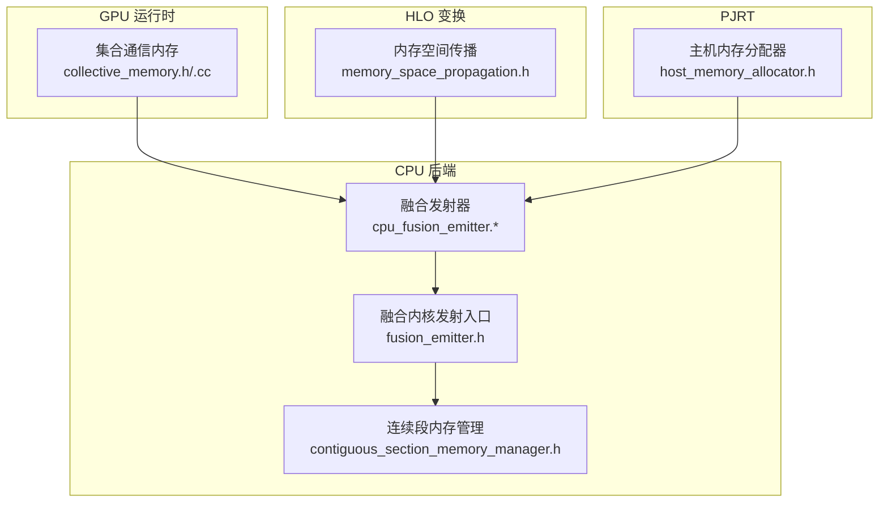
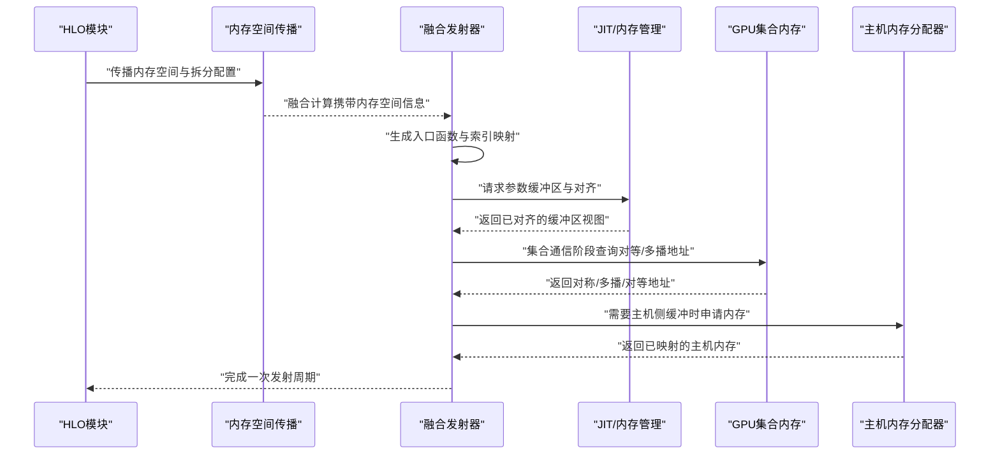
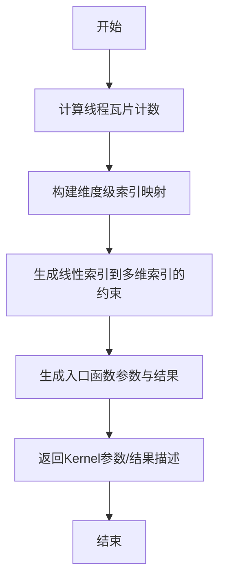
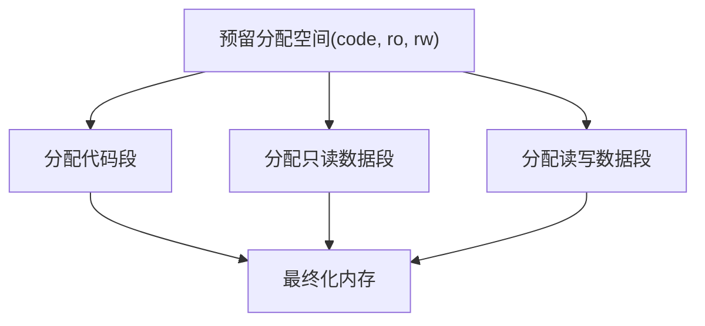
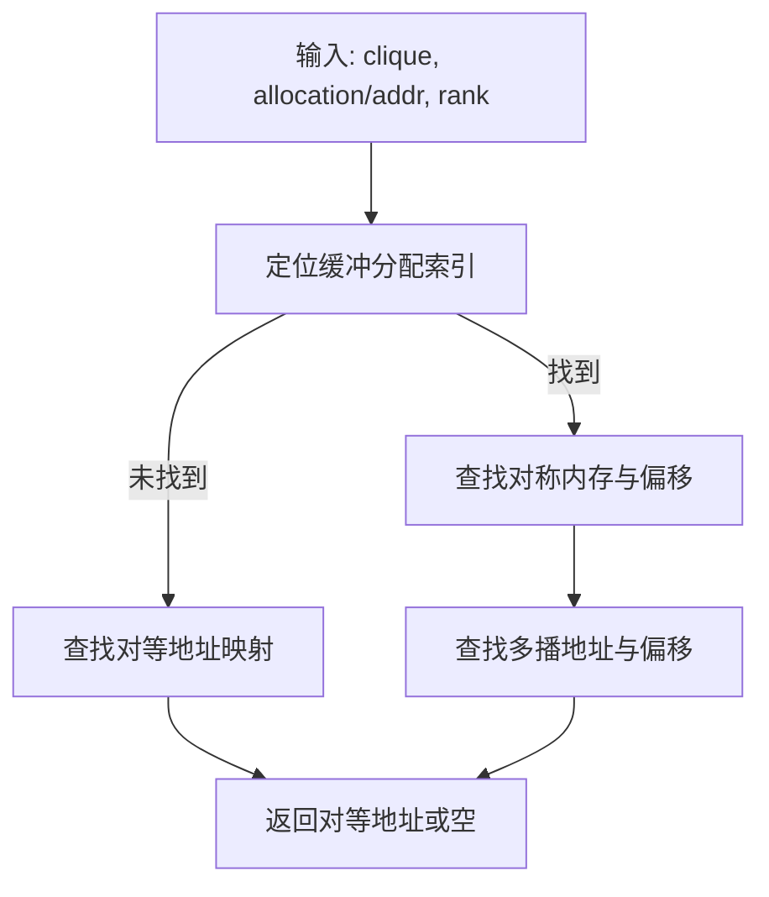
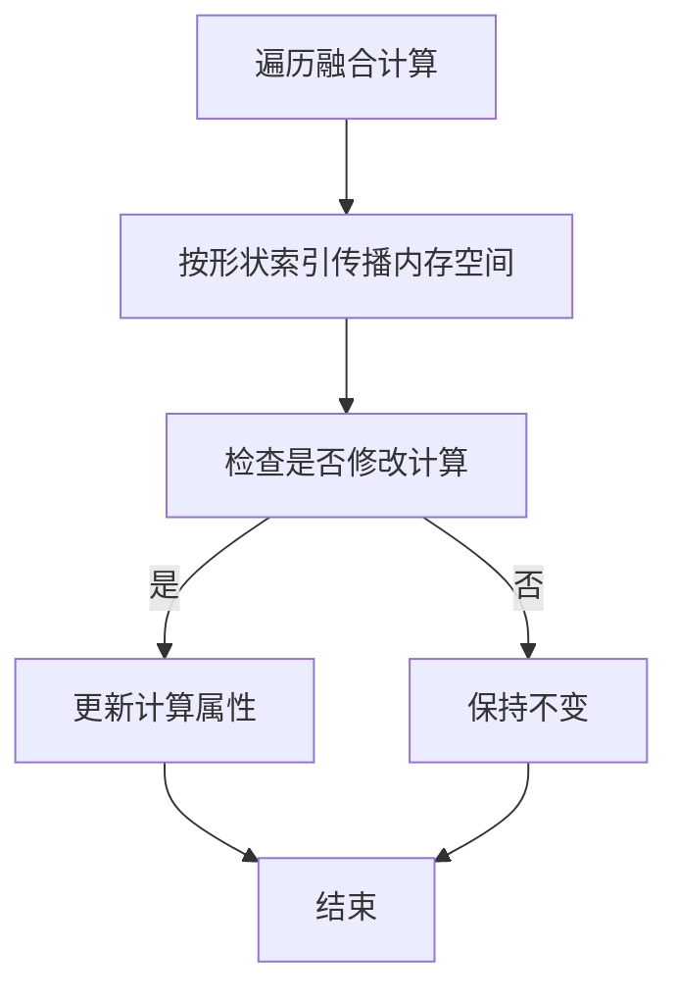
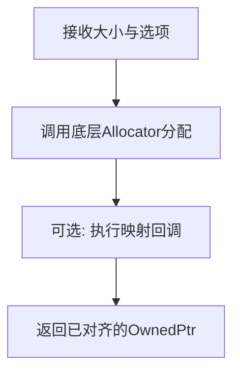
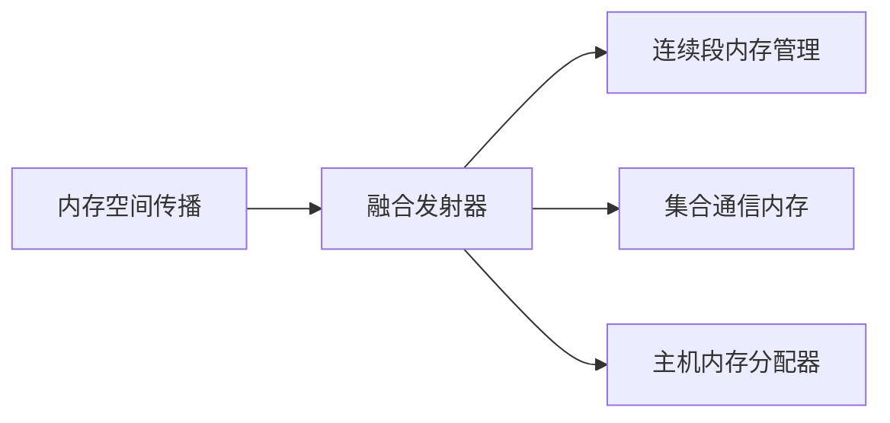

# 内存发射器

<cite>
**本文引用的文件**
- [xla/backends/cpu/codegen/emitters/cpu_fusion_emitter.h](file://xla/backends/cpu/codegen/emitters/cpu_fusion_emitter.h)
- [xla/backends/cpu/codegen/emitters/cpu_fusion_emitter.cc](file://xla/backends/cpu/codegen/emitters/cpu_fusion_emitter.cc)
- [xla/backends/cpu/codegen/fusion_emitter.h](file://xla/backends/cpu/codegen/fusion_emitter.h)
- [xla/backends/cpu/codegen/contiguous_section_memory_manager.h](file://xla/backends/cpu/codegen/contiguous_section_memory_manager.h)
- [xla/backends/gpu/runtime/collective_memory.h](file://xla/backends/gpu/runtime/collective_memory.h)
- [xla/backends/gpu/runtime/collective_memory.cc](file://xla/backends/gpu/runtime/collective_memory.cc)
- [xla/hlo/transforms/memory_space_propagation.h](file://xla/hlo/transforms/memory_space_propagation.h)
- [xla/pjrt/host_memory_allocator.h](file://xla/pjrt/host_memory_allocator.h)
</cite>

## 目录
1. [简介](#简介)
2. [项目结构](#项目结构)
3. [核心组件](#核心组件)
4. [架构总览](#架构总览)
5. [组件详解](#组件详解)
6. [依赖关系分析](#依赖关系分析)
7. [性能考量](#性能考量)
8. [故障排除指南](#故障排除指南)
9. [结论](#结论)
10. [附录](#附录)

## 简介
本文件系统性梳理XLA内存发射器的设计与实现，聚焦以下目标：
- 解释内存发射器的核心功能：内存访问模式优化、数据传输策略、内存布局优化、缓存友好访问、带宽利用率提升。
- 详述三类内存操作发射器：连接（Collective）、更新（Update）、循环（Loop）的实现原理与协同方式。
- 说明内存同步机制、异步传输与流水线优化策略。
- 提供性能分析工具、调试技术与常见问题排查方法。

## 项目结构
围绕内存发射器的关键代码主要分布在以下模块：
- CPU后端发射器：融合发射器、索引映射、连续段内存管理等。
- GPU后端运行时：集合通信内存、多播内存、对等地址映射等。
- HLO变换层：内存空间传播、布局到融合计算的内存空间继承。
- PJRT主机内存分配器：统一的主机侧内存分配接口与映射/取消映射回调。

**图示来源**
- [xla/backends/cpu/codegen/emitters/cpu_fusion_emitter.h](file://xla/backends/cpu/codegen/emitters/cpu_fusion_emitter.h#L40-L71)
- [xla/backends/cpu/codegen/contiguous_section_memory_manager.h](file://xla/backends/cpu/codegen/contiguous_section_memory_manager.h#L47-L87)
- [xla/backends/cpu/codegen/fusion_emitter.h](file://xla/backends/cpu/codegen/fusion_emitter.h#L27-L36)
- [xla/backends/gpu/runtime/collective_memory.h](file://xla/backends/gpu/runtime/collective_memory.h#L40-L106)
- [xla/hlo/transforms/memory_space_propagation.h](file://xla/hlo/transforms/memory_space_propagation.h#L33-L62)
- [xla/pjrt/host_memory_allocator.h](file://xla/pjrt/host_memory_allocator.h#L32-L83)

**章节来源**
- [xla/backends/cpu/codegen/emitters/cpu_fusion_emitter.h](file://xla/backends/cpu/codegen/emitters/cpu_fusion_emitter.h#L15-L74)
- [xla/backends/cpu/codegen/fusion_emitter.h](file://xla/backends/cpu/codegen/fusion_emitter.h#L16-L39)
- [xla/backends/cpu/codegen/contiguous_section_memory_manager.h](file://xla/backends/cpu/codegen/contiguous_section_memory_manager.h#L16-L92)
- [xla/backends/gpu/runtime/collective_memory.h](file://xla/backends/gpu/runtime/collective_memory.h#L16-L134)
- [xla/hlo/transforms/memory_space_propagation.h](file://xla/hlo/transforms/memory_space_propagation.h#L16-L67)
- [xla/pjrt/host_memory_allocator.h](file://xla/pjrt/host_memory_allocator.h#L16-L88)

## 核心组件
- 融合发射器（CPU）
  - 提供默认索引映射生成、入口函数API发射、调用目标提供、命名模块创建、融合名称获取等能力，支撑融合内核的参数化与布局规划。
  - 关键接口路径参考：[EmitEntryFunctionApi](file://xla/backends/cpu/codegen/emitters/cpu_fusion_emitter.cc#L173-L200)，[GetDefaultIndexingMap](file://xla/backends/cpu/codegen/emitters/cpu_fusion_emitter.cc#L134-L171)。
- 连续段内存管理（CPU JIT）
  - 在Windows等平台上确保代码段、只读数据段、读写数据段按顺序连续映射，避免重定位约束导致的崩溃。
  - 关键接口路径参考：[allocateCodeSection/allocateDataSection](file://xla/backends/cpu/codegen/contiguous_section_memory_manager.h#L64-L66)。
- 集合通信内存（GPU）
  - 统一管理对称内存、多播内存与对等内存地址映射，支持在集合通信阶段按拓扑选择合适的内存类型并进行地址查找。
  - 关键接口路径参考：[FindSymmetricMemory/FindMultimemAddress/FindPeerAddress](file://xla/backends/gpu/runtime/collective_memory.h#L66-L155)。
- 内存空间传播（HLO变换）
  - 将布局中定义的内存空间信息与拆分配置传播到融合计算内部，保证发射器生成的内核与布局一致。
  - 关键接口路径参考：[RunOnComputation/Propagate](file://xla/hlo/transforms/memory_space_propagation.h#L43-L61)。
- 主机内存分配器（PJRT）
  - 提供统一的主机内存分配接口，支持对齐、NUMA节点提示以及映射/取消映射回调，便于与设备侧内存协同使用。
  - 关键接口路径参考：[HostMemoryAllocator::Allocate](file://xla/pjrt/host_memory_allocator.h#L63-L67)。

**章节来源**
- [xla/backends/cpu/codegen/emitters/cpu_fusion_emitter.cc](file://xla/backends/cpu/codegen/emitters/cpu_fusion_emitter.cc#L134-L200)
- [xla/backends/cpu/codegen/contiguous_section_memory_manager.h](file://xla/backends/cpu/codegen/contiguous_section_memory_manager.h#L47-L87)
- [xla/backends/gpu/runtime/collective_memory.h](file://xla/backends/gpu/runtime/collective_memory.h#L40-L155)
- [xla/hlo/transforms/memory_space_propagation.h](file://xla/hlo/transforms/memory_space_propagation.h#L33-L62)
- [xla/pjrt/host_memory_allocator.h](file://xla/pjrt/host_memory_allocator.h#L32-L83)

## 架构总览
内存发射器贯穿“HLO布局→融合发射→JIT生成→运行时内存管理”的链路，形成如下闭环：

**图示来源**
- [xla/hlo/transforms/memory_space_propagation.h](file://xla/hlo/transforms/memory_space_propagation.h#L33-L62)
- [xla/backends/cpu/codegen/emitters/cpu_fusion_emitter.cc](file://xla/backends/cpu/codegen/emitters/cpu_fusion_emitter.cc#L173-L200)
- [xla/backends/gpu/runtime/collective_memory.h](file://xla/backends/gpu/runtime/collective_memory.h#L66-L155)
- [xla/pjrt/host_memory_allocator.h](file://xla/pjrt/host_memory_allocator.h#L63-L67)

## 组件详解

### 融合发射器（CPU）
- 功能要点
  - 默认索引映射：基于线程块尺寸与形状，生成从线线索引到元素线性索引的映射，确保线程局部性与缓存友好。
  - 入口函数API：根据缓冲区分配信息生成内核参数与结果参数，便于后续JIT调用。
  - 调用目标提供：为融合计算生成可调用的目标，支持分段计算与后处理（epilogue）。
  - 命名与模块：为融合生成命名模块，支持唯一C风格入口点以利于调试与链接。
- 复杂度与优化
  - 时间复杂度与维度数线性相关；通过分块与平铺减少跨缓存行访问。
  - 对齐与连续性：配合连续段内存管理，降低重定位与越界风险。
- 关键流程示意

**图示来源**
- [xla/backends/cpu/codegen/emitters/cpu_fusion_emitter.cc](file://xla/backends/cpu/codegen/emitters/cpu_fusion_emitter.cc#L134-L171)
- [xla/backends/cpu/codegen/emitters/cpu_fusion_emitter.cc](file://xla/backends/cpu/codegen/emitters/cpu_fusion_emitter.cc#L173-L200)

**章节来源**
- [xla/backends/cpu/codegen/emitters/cpu_fusion_emitter.h](file://xla/backends/cpu/codegen/emitters/cpu_fusion_emitter.h#L40-L71)
- [xla/backends/cpu/codegen/emitters/cpu_fusion_emitter.cc](file://xla/backends/cpu/codegen/emitters/cpu_fusion_emitter.cc#L134-L200)

### 连续段内存管理（CPU JIT）
- 功能要点
  - 在Windows平台强制代码段、只读数据段、读写数据段顺序连续映射，规避ADDR32NB重定位范围限制。
  - 通过预留分配空间与分块子分配，简化内存布局与回收。
- 关键流程示意

**图示来源**
- [xla/backends/cpu/codegen/contiguous_section_memory_manager.h](file://xla/backends/cpu/codegen/contiguous_section_memory_manager.h#L53-L68)

**章节来源**
- [xla/backends/cpu/codegen/contiguous_section_memory_manager.h](file://xla/backends/cpu/codegen/contiguous_section_memory_manager.h#L30-L87)

### 集合通信内存（GPU）
- 功能要点
  - 对称内存：面向所有参与者的共享内存视图，用于广播或聚合。
  - 多播内存：同一组成员共享的内存，支持一次性写入多个接收者。
  - 对等内存：跨设备/跨进程的对等地址映射，用于点对点传输。
- 查找流程示意

**图示来源**
- [xla/backends/gpu/runtime/collective_memory.h](file://xla/backends/gpu/runtime/collective_memory.h#L66-L155)

**章节来源**
- [xla/backends/gpu/runtime/collective_memory.h](file://xla/backends/gpu/runtime/collective_memory.h#L40-L155)
- [xla/backends/gpu/runtime/collective_memory.cc](file://xla/backends/gpu/runtime/collective_memory.cc#L69-L155)

### 内存空间传播（HLO变换）
- 功能要点
  - 将布局中定义的内存空间与拆分配置传播到融合计算的参数与根节点，确保发射器生成的内核与布局一致。
  - 支持在融合计算内部递归传播，避免重复或遗漏。
- 关键流程示意

**图示来源**
- [xla/hlo/transforms/memory_space_propagation.h](file://xla/hlo/transforms/memory_space_propagation.h#L43-L61)

**章节来源**
- [xla/hlo/transforms/memory_space_propagation.h](file://xla/hlo/transforms/memory_space_propagation.h#L33-L62)

### 主机内存分配器（PJRT）
- 功能要点
  - 统一的主机内存分配接口，支持最小对齐、NUMA亲和提示、映射/取消映射回调。
  - 与设备侧内存协同，便于在主机侧预热或复用缓冲区。
- 关键流程示意

**图示来源**
- [xla/pjrt/host_memory_allocator.h](file://xla/pjrt/host_memory_allocator.h#L63-L67)

**章节来源**
- [xla/pjrt/host_memory_allocator.h](file://xla/pjrt/host_memory_allocator.h#L32-L83)

## 依赖关系分析
- 耦合与内聚
  - 融合发射器与内存空间传播紧密耦合：前者依赖后者提供的内存空间信息进行参数化与布局规划。
  - 连续段内存管理与融合发射器在JIT阶段协作，确保生成代码的内存布局满足平台约束。
  - GPU集合通信内存为融合发射器在集合通信阶段提供地址映射，降低跨设备传输的复杂度。
  - 主机内存分配器为跨设备/跨进程的数据搬运提供统一抽象。
- 外部依赖
  - MLIR/LLVM：用于中间表示转换与JIT生成。
  - StreamExecutor/GPU：用于设备内存与集合通信原语。
- 潜在环路
  - 当前设计以单向流为主：HLO→传播→发射→JIT→运行时，未见明显循环依赖。

**图示来源**
- [xla/hlo/transforms/memory_space_propagation.h](file://xla/hlo/transforms/memory_space_propagation.h#L33-L62)
- [xla/backends/cpu/codegen/emitters/cpu_fusion_emitter.h](file://xla/backends/cpu/codegen/emitters/cpu_fusion_emitter.h#L40-L71)
- [xla/backends/cpu/codegen/contiguous_section_memory_manager.h](file://xla/backends/cpu/codegen/contiguous_section_memory_manager.h#L47-L87)
- [xla/backends/gpu/runtime/collective_memory.h](file://xla/backends/gpu/runtime/collective_memory.h#L40-L106)
- [xla/pjrt/host_memory_allocator.h](file://xla/pjrt/host_memory_allocator.h#L32-L83)

**章节来源**
- [xla/backends/cpu/codegen/emitters/cpu_fusion_emitter.h](file://xla/backends/cpu/codegen/emitters/cpu_fusion_emitter.h#L40-L71)
- [xla/backends/cpu/codegen/contiguous_section_memory_manager.h](file://xla/backends/cpu/codegen/contiguous_section_memory_manager.h#L47-L87)
- [xla/backends/gpu/runtime/collective_memory.h](file://xla/backends/gpu/runtime/collective_memory.h#L40-L106)
- [xla/hlo/transforms/memory_space_propagation.h](file://xla/hlo/transforms/memory_space_propagation.h#L33-L62)
- [xla/pjrt/host_memory_allocator.h](file://xla/pjrt/host_memory_allocator.h#L32-L83)

## 性能考量
- 内存访问模式优化
  - 索引映射与线程瓦片：通过线程到元素的索引映射，减少跨缓存行访问，提升局部性。
  - 连续段内存管理：避免Windows平台ADDR32NB重定位范围限制，减少运行时错误与潜在的页表抖动。
- 数据传输策略
  - 集合通信内存：优先使用对称/多播内存降低重复拷贝；对等地址映射用于点对点直传。
  - 主机侧缓冲：通过映射回调确保CPU可见性，减少不必要的同步。
- 缓存友好与带宽利用
  - 平铺与分块：结合线程瓦片与元素索引映射，减少跨行访问，提高缓存命中率。
  - 对齐与连续：统一的对齐策略与连续内存布局，有助于DMA与向量化指令的高效执行。
- 异步与流水线
  - 发射器与运行时分离：HLO→传播→发射→JIT→运行时，各阶段可并行推进。
  - 集合通信阶段的并发：在AcquireCollectiveMemory中，要求所有参与秩同时调用，形成流水线化的准备与执行阶段。

[本节为通用性能建议，不直接分析具体文件]

## 故障排除指南
- Windows平台ADDR32NB重定位失败
  - 现象：在Windows上加载JIT生成代码时报重定位错误。
  - 排查：确认使用连续段内存管理，确保代码段、只读数据段、读写数据段顺序正确且连续。
  - 参考：[allocateCodeSection/allocateDataSection](file://xla/backends/cpu/codegen/contiguous_section_memory_manager.h#L64-L66)。
- 集合通信死锁或地址映射失败
  - 现象：AcquireCollectiveMemory调用阻塞或返回空地址。
  - 排查：确保所有参与秩在同一阶段调用该函数；检查缓冲分配索引与对等地址映射是否存在。
  - 参考：[FindPeerAddress/FindMultimemAddress](file://xla/backends/gpu/runtime/collective_memory.h#L120-L155)。
- 内存空间不一致导致发射失败
  - 现象：融合内核参数与布局不匹配。
  - 排查：确认内存空间传播已将布局中的内存空间传播至融合计算；检查形状索引与拆分配置。
  - 参考：[RunOnComputation/Propagate](file://xla/hlo/transforms/memory_space_propagation.h#L43-L61)。
- 主机内存不可见或对齐不足
  - 现象：设备侧无法访问主机缓冲或性能下降。
  - 排查：确认分配对齐与NUMA亲和设置；检查映射回调是否成功执行。
  - 参考：[HostMemoryAllocator::Allocate](file://xla/pjrt/host_memory_allocator.h#L63-L67)。

**章节来源**
- [xla/backends/cpu/codegen/contiguous_section_memory_manager.h](file://xla/backends/cpu/codegen/contiguous_section_memory_manager.h#L30-L87)
- [xla/backends/gpu/runtime/collective_memory.h](file://xla/backends/gpu/runtime/collective_memory.h#L114-L155)
- [xla/hlo/transforms/memory_space_propagation.h](file://xla/hlo/transforms/memory_space_propagation.h#L43-L61)
- [xla/pjrt/host_memory_allocator.h](file://xla/pjrt/host_memory_allocator.h#L63-L67)

## 结论
XLA内存发射器通过“布局传播→融合发射→JIT生成→运行时内存管理”的完整链路，实现了从高层布局到底层内存访问的高效映射。CPU侧的索引映射与连续段内存管理保障了跨平台稳定性与局部性；GPU侧的集合通信内存提供了对称/多播/对等的灵活传输模型；HLO变换层确保了布局一致性；PJRT主机内存分配器则提供了统一的主机侧内存抽象。整体设计兼顾性能与可维护性，适合在多设备、多后端场景下扩展与优化。

[本节为总结性内容，不直接分析具体文件]

## 附录
- 相关接口路径速查
  - [GetDefaultIndexingMap](file://xla/backends/cpu/codegen/emitters/cpu_fusion_emitter.cc#L134-L171)
  - [EmitEntryFunctionApi](file://xla/backends/cpu/codegen/emitters/cpu_fusion_emitter.cc#L173-L200)
  - [AcquireCollectiveMemory](file://xla/backends/gpu/runtime/collective_memory.cc#L114-L116)
  - [FindSymmetricMemory/FindMultimemAddress/FindPeerAddress](file://xla/backends/gpu/runtime/collective_memory.h#L66-L155)
  - [RunOnComputation/Propagate](file://xla/hlo/transforms/memory_space_propagation.h#L43-L61)
  - [HostMemoryAllocator::Allocate](file://xla/pjrt/host_memory_allocator.h#L63-L67)

[本节为补充信息，不直接分析具体文件]