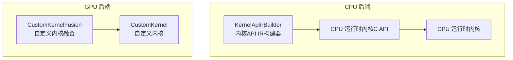
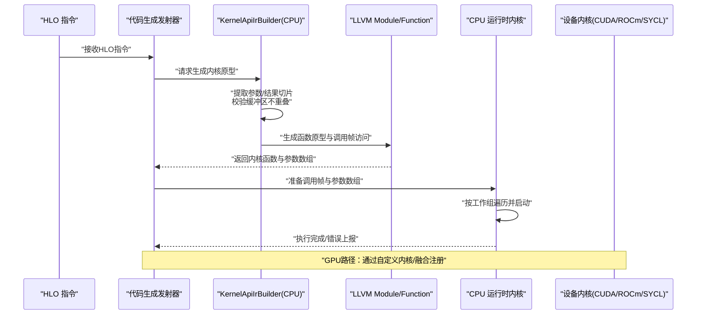
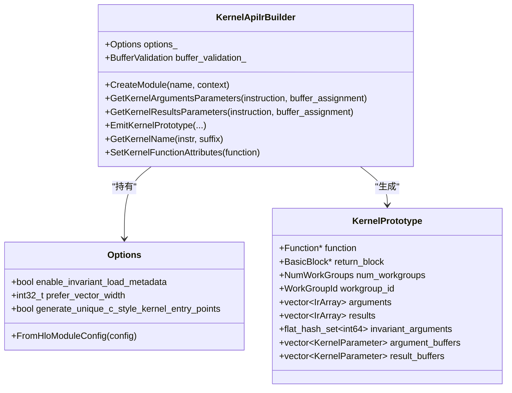
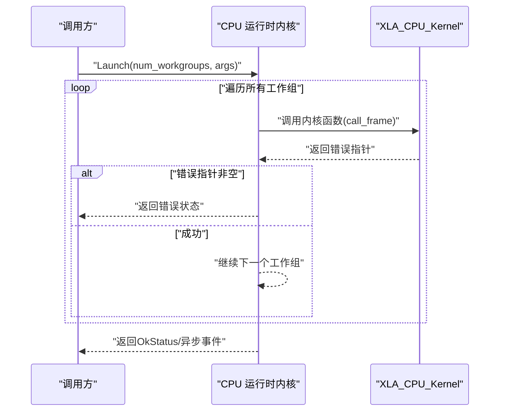
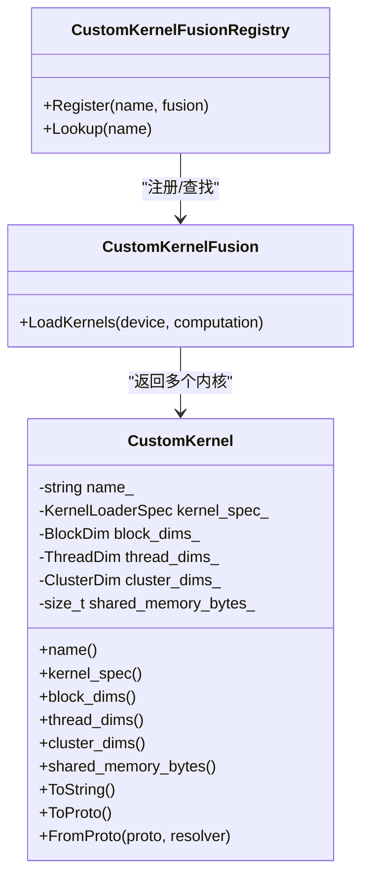
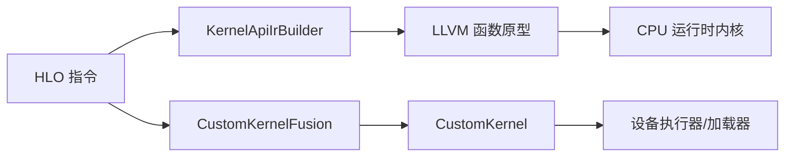

# 内核API构建器

<cite>
**本文引用的文件**
- [kernel_api_ir_builder.h](file://xla/backends/cpu/codegen/kernel_api_ir_builder.h)
- [kernel_api_ir_builder.cc](file://xla/backends/cpu/codegen/kernel_api_ir_builder.cc)
- [kernel_c_api.h](file://xla/backends/cpu/runtime/kernel_c_api.h)
- [kernel.h](file://xla/backends/cpu/runtime/kernel.h)
- [custom_kernel.h](file://xla/backends/gpu/codegen/kernels/custom_kernel.h)
- [custom_kernel_fusion.h](file://xla/backends/gpu/codegen/kernels/custom_kernel_fusion.h)
</cite>

## 目录
1. [简介](#简介)
2. [项目结构](#项目结构)
3. [核心组件](#核心组件)
4. [架构总览](#架构总览)
5. [详细组件分析](#详细组件分析)
6. [依赖关系分析](#依赖关系分析)
7. [性能考量](#性能考量)
8. [故障排查指南](#故障排查指南)
9. [结论](#结论)
10. [附录：使用示例与最佳实践](#附录使用示例与最佳实践)

## 简介
本文件系统性阐述XLA内核API构建器的设计与实现，重点覆盖以下方面：
- 如何从HLO操作生成内核调用API原型
- 参数绑定机制、数据类型与内存布局适配
- 支持的API类型（CPU主机内核、CUDA、ROCm、SYCL等）及平台特定实现要点
- 配置选项、性能优化策略与错误处理机制
- 实际使用示例与最佳实践

该文档面向对XLA编译后端与代码生成有一定了解的读者，同时提供足够的背景信息以帮助初学者理解。

## 项目结构
围绕“内核API构建器”的相关源码主要分布在：
- CPU后端：内核API IR构建器、CPU运行时内核接口与调用框架
- GPU后端：自定义内核与融合注册机制（用于CUDA/ROCm/SYCL等）

图示来源
- [kernel_api_ir_builder.h](file://xla/backends/cpu/codegen/kernel_api_ir_builder.h#L53-L182)
- [kernel_api_ir_builder.cc](file://xla/backends/cpu/codegen/kernel_api_ir_builder.cc#L329-L449)
- [kernel_c_api.h](file://xla/backends/cpu/runtime/kernel_c_api.h#L54-L88)
- [kernel.h](file://xla/backends/cpu/runtime/kernel.h#L39-L116)
- [custom_kernel.h](file://xla/backends/gpu/codegen/kernels/custom_kernel.h#L48-L86)
- [custom_kernel_fusion.h](file://xla/backends/gpu/codegen/kernels/custom_kernel_fusion.h#L102-L110)

章节来源
- [kernel_api_ir_builder.h](file://xla/backends/cpu/codegen/kernel_api_ir_builder.h#L1-L198)
- [kernel_api_ir_builder.cc](file://xla/backends/cpu/codegen/kernel_api_ir_builder.cc#L1-L572)
- [kernel_c_api.h](file://xla/backends/cpu/runtime/kernel_c_api.h#L1-L95)
- [kernel.h](file://xla/backends/cpu/runtime/kernel.h#L1-L138)
- [custom_kernel.h](file://xla/backends/gpu/codegen/kernels/custom_kernel.h#L1-L91)
- [custom_kernel_fusion.h](file://xla/backends/gpu/codegen/kernels/custom_kernel_fusion.h#L1-L158)

## 核心组件
- 内核API IR构建器（CPU）
  - 负责从HLO指令或显式参数集合生成符合XLA CPU内核约定的LLVM函数原型，并注入工作组维度、参数数组、只读属性等元数据。
  - 关键能力：参数提取、缓冲区切片一致性校验、别名/无别名元数据、只读缓冲区标记、模块内存区域命名。
- CPU运行时内核接口（C API）
  - 定义了主机内核的调用约定（结构化参数、调用帧、错误返回），确保代码生成与运行时一致。
- CPU运行时内核
  - 提供在单线程、线程池、多工作组下的内核启动与执行封装，负责将工作分发到并行任务。
- 自定义内核（GPU）
  - 封装预编译设备内核的加载规范、网格/块维度、共享内存需求等，便于在XLA GPU后端统一调度。
- 自定义内核融合（GPU）
  - 将特定HLO融合模式映射为一组自定义内核，支持在运行时基于设备特性选择最优实现。

章节来源
- [kernel_api_ir_builder.h](file://xla/backends/cpu/codegen/kernel_api_ir_builder.h#L53-L182)
- [kernel_api_ir_builder.cc](file://xla/backends/cpu/codegen/kernel_api_ir_builder.cc#L329-L449)
- [kernel_c_api.h](file://xla/backends/cpu/runtime/kernel_c_api.h#L54-L88)
- [kernel.h](file://xla/backends/cpu/runtime/kernel.h#L39-L116)
- [custom_kernel.h](file://xla/backends/gpu/codegen/kernels/custom_kernel.h#L48-L86)
- [custom_kernel_fusion.h](file://xla/backends/gpu/codegen/kernels/custom_kernel_fusion.h#L102-L110)

## 架构总览
下图展示了从HLO到内核调用的整体流程，涵盖CPU与GPU两条路径：

图示来源
- [kernel_api_ir_builder.cc](file://xla/backends/cpu/codegen/kernel_api_ir_builder.cc#L329-L449)
- [kernel_c_api.h](file://xla/backends/cpu/runtime/kernel_c_api.h#L74-L88)
- [kernel.h](file://xla/backends/cpu/runtime/kernel.h#L74-L95)
- [custom_kernel.h](file://xla/backends/gpu/codegen/kernels/custom_kernel.h#L48-L86)
- [custom_kernel_fusion.h](file://xla/backends/gpu/codegen/kernels/custom_kernel_fusion.h#L102-L110)

## 详细组件分析

### 组件A：CPU内核API IR构建器（KernelApiIrBuilder）
- 设计目标
  - 将HLO指令映射为符合XLA CPU内核约定的LLVM函数原型，自动推断参数/结果数组、工作小组维度与只读属性。
- 关键数据结构
  - Options：包含是否启用不可变加载元数据、偏好向量宽度、是否生成唯一C风格内核入口点等。
  - KernelPrototype：保存内核函数、返回块、工作组维度、工作小组ID、参数与结果数组、只读缓冲区索引集、缓冲区切片信息。
  - KernelParameter：形状+缓冲区分配切片，用于别名与无别名分析。
- 参数绑定机制
  - 从HLO操作数与结果中提取叶形状，结合BufferAssignment获取唯一切片，形成KernelParameter列表。
  - 通过调用帧结构访问参数数组，注入对齐、可解引用大小、不可变加载等元数据。
- 数据类型与内存布局适配
  - 使用IrArray包装指针与形状，确保运行时按叶数组扁平化访问。
  - 对只读缓冲区设置不可变加载元数据；对结果缓冲区设置别名作用域与无别名元数据，提升优化机会。
- 错误处理与验证
  - 在BufferValidation启用时，检查参数/结果切片不重叠、结果不与参数部分重叠等约束，失败时返回内部错误。
- 性能优化策略
  - 设置prefer-vector-width函数属性，允许使用更宽寄存器。
  - 始终保留帧指针，便于性能分析工具追踪。
  - 注入对齐与可解引用元数据，辅助LLVM进行访存优化。

图示来源
- [kernel_api_ir_builder.h](file://xla/backends/cpu/codegen/kernel_api_ir_builder.h#L53-L182)

章节来源
- [kernel_api_ir_builder.h](file://xla/backends/cpu/codegen/kernel_api_ir_builder.h#L53-L182)
- [kernel_api_ir_builder.cc](file://xla/backends/cpu/codegen/kernel_api_ir_builder.cc#L276-L305)
- [kernel_api_ir_builder.cc](file://xla/backends/cpu/codegen/kernel_api_ir_builder.cc#L329-L449)
- [kernel_api_ir_builder.cc](file://xla/backends/cpu/codegen/kernel_api_ir_builder.cc#L552-L569)

### 组件B：CPU运行时内核接口与执行（C API + 运行时）
- C API约定
  - 调用帧包含工作组数量、工作小组ID、参数个数与参数数组指针。
  - 内核函数返回空指针表示成功，非空指针表示错误对象。
- 执行模型
  - 支持单次调用（CallOnce）与多工作组遍历（Launch）两种路径。
  - 可选在线程池上并行执行，返回异步事件以跟踪完成状态。
- 典型流程
  - 构造调用帧，填充参数数组，调用内核函数，检查错误并返回状态。

图示来源
- [kernel_c_api.h](file://xla/backends/cpu/runtime/kernel_c_api.h#L74-L88)
- [kernel.h](file://xla/backends/cpu/runtime/kernel.h#L74-L95)
- [kernel.h](file://xla/backends/cpu/runtime/kernel.h#L118-L133)

章节来源
- [kernel_c_api.h](file://xla/backends/cpu/runtime/kernel_c_api.h#L54-L88)
- [kernel.h](file://xla/backends/cpu/runtime/kernel.h#L74-L95)
- [kernel.h](file://xla/backends/cpu/runtime/kernel.h#L118-L133)

### 组件C：GPU自定义内核与融合（CUDA/ROCm/SYCL）
- 自定义内核（CustomKernel）
  - 描述内核名称、加载规范、块/线程/集群维度、共享内存大小等，屏蔽具体设备实现细节。
- 自定义内核融合（CustomKernelFusion）
  - 将特定HLO融合模式映射为一组自定义内核，运行时根据设备特性选择最优实现。
  - 与命令缓冲集成，可被统一捕获与调度。

图示来源
- [custom_kernel.h](file://xla/backends/gpu/codegen/kernels/custom_kernel.h#L48-L86)
- [custom_kernel_fusion.h](file://xla/backends/gpu/codegen/kernels/custom_kernel_fusion.h#L102-L110)
- [custom_kernel_fusion.h](file://xla/backends/gpu/codegen/kernels/custom_kernel_fusion.h#L119-L137)

章节来源
- [custom_kernel.h](file://xla/backends/gpu/codegen/kernels/custom_kernel.h#L48-L86)
- [custom_kernel_fusion.h](file://xla/backends/gpu/codegen/kernels/custom_kernel_fusion.h#L102-L110)
- [custom_kernel_fusion.h](file://xla/backends/gpu/codegen/kernels/custom_kernel_fusion.h#L119-L137)

## 依赖关系分析
- CPU路径
  - KernelApiIrBuilder依赖HLO指令、BufferAssignment、IrArray与LLVM IR工具，输出符合CPU运行时C API的函数原型。
  - 运行时内核负责将工作分发到线程池并执行，最终返回状态或异步事件。
- GPU路径
  - CustomKernelFusionRegistry维护融合实现映射，LoadKernels根据设备描述选择合适的自定义内核集合。
  - 自定义内核封装设备特定的加载与维度信息，便于统一调度。

图示来源
- [kernel_api_ir_builder.cc](file://xla/backends/cpu/codegen/kernel_api_ir_builder.cc#L329-L449)
- [kernel.h](file://xla/backends/cpu/runtime/kernel.h#L74-L95)
- [custom_kernel_fusion.h](file://xla/backends/gpu/codegen/kernels/custom_kernel_fusion.h#L102-L110)
- [custom_kernel.h](file://xla/backends/gpu/codegen/kernels/custom_kernel.h#L48-L86)

章节来源
- [kernel_api_ir_builder.cc](file://xla/backends/cpu/codegen/kernel_api_ir_builder.cc#L329-L449)
- [kernel.h](file://xla/backends/cpu/runtime/kernel.h#L74-L95)
- [custom_kernel_fusion.h](file://xla/backends/gpu/codegen/kernels/custom_kernel_fusion.h#L102-L110)
- [custom_kernel.h](file://xla/backends/gpu/codegen/kernels/custom_kernel.h#L48-L86)

## 性能考量
- 向量化与寄存器宽度
  - 通过函数属性设置偏好向量宽度，使LLVM在满足ABI的前提下使用更宽寄存器，提升访存与算术吞吐。
- 访存与别名优化
  - 对只读缓冲区设置不可变加载元数据；对结果缓冲区设置别名作用域与无别名元数据，减少不必要的内存屏障与缓存污染。
- 对齐与可解引用大小
  - 注入对齐与可解引用大小元数据，帮助LLVM进行更激进的循环展开与向量化。
- 工作分发与并行
  - CPU运行时内核在多工作组场景下动态映射到线程池任务，避免过度拆分导致的调度开销。
- GPU融合与库集成
  - 自定义内核融合可利用cuBLAS/Triton等成熟库或专家手写内核，减少代码生成复杂度并提升峰值性能。

章节来源
- [kernel_api_ir_builder.cc](file://xla/backends/cpu/codegen/kernel_api_ir_builder.cc#L552-L569)
- [kernel_api_ir_builder.cc](file://xla/backends/cpu/codegen/kernel_api_ir_builder.cc#L520-L538)
- [kernel.h](file://xla/backends/cpu/runtime/kernel.h#L74-L95)

## 故障排查指南
- 缓冲区重叠与别名问题
  - 当参数或结果切片存在重叠且不符合“仅允许结果与参数完全相同”的情形时，会触发内部错误。请检查BufferAssignment与HLO形状/布局。
- 内核函数属性与ABI
  - 若运行时无法解析符号或调用失败，请确认内核函数采用C调用约定、保留帧指针、具备正确的函数属性。
- 错误返回与诊断
  - CPU内核返回非空错误指针即视为失败；建议在代码生成侧打印调用帧与参数摘要以便定位。

章节来源
- [kernel_api_ir_builder.cc](file://xla/backends/cpu/codegen/kernel_api_ir_builder.cc#L166-L244)
- [kernel_c_api.h](file://xla/backends/cpu/runtime/kernel_c_api.h#L83-L88)
- [kernel.h](file://xla/backends/cpu/runtime/kernel.h#L118-L133)

## 结论
XLA内核API构建器通过清晰的IR构建与运行时约定，实现了从HLO到设备内核的高效映射。CPU路径强调LLVM元数据驱动的优化与严格的缓冲区约束，GPU路径则通过自定义内核与融合注册实现与底层库/硬件的深度协同。合理配置偏好向量宽度、对齐与别名元数据，是获得稳定高性能的关键。

## 附录：使用示例与最佳实践
- 从HLO生成内核原型
  - 步骤：获取HLO操作数与结果的叶形状 → 通过BufferAssignment获取唯一切片 → 调用内核原型生成接口 → 注入模块内存区域元数据 → 生成LLVM函数。
  - 注意：启用BufferValidation可提前发现缓冲区布局问题。
- 参数绑定与内存布局
  - 使用IrArray包装指针与形状，确保按叶数组扁平化访问；对只读缓冲区设置不可变加载元数据；对结果缓冲区设置无别名与别名作用域。
- 性能优化
  - 设置prefer-vector-width属性；保持帧指针；注入对齐与可解引用元数据；在CPU路径下尽量避免跨缓冲区的隐式别名。
- 平台特定实现
  - CUDA/ROCm/SYCL：优先使用自定义内核与融合注册，结合设备特性选择最优块/网格维度与共享内存大小；若需通用接口，可参考CustomKernel的加载规范与维度描述。
- 错误处理
  - 在内核函数中始终返回空指针表示成功，非空指针表示错误；在调用侧检查并转换为状态对象。

章节来源
- [kernel_api_ir_builder.cc](file://xla/backends/cpu/codegen/kernel_api_ir_builder.cc#L329-L449)
- [kernel_api_ir_builder.cc](file://xla/backends/cpu/codegen/kernel_api_ir_builder.cc#L552-L569)
- [custom_kernel.h](file://xla/backends/gpu/codegen/kernels/custom_kernel.h#L48-L86)
- [custom_kernel_fusion.h](file://xla/backends/gpu/codegen/kernels/custom_kernel_fusion.h#L102-L110)