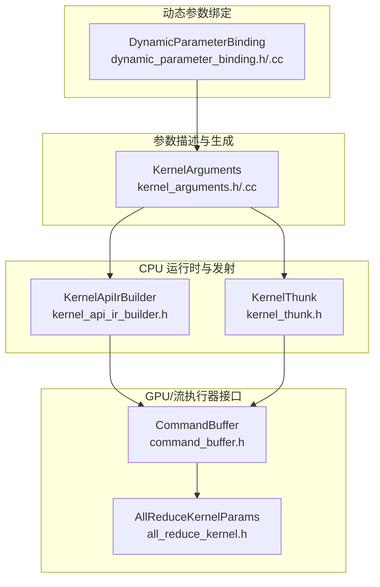
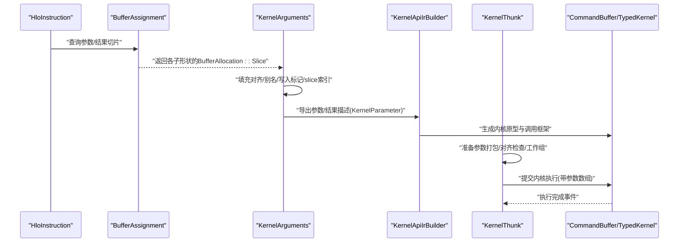
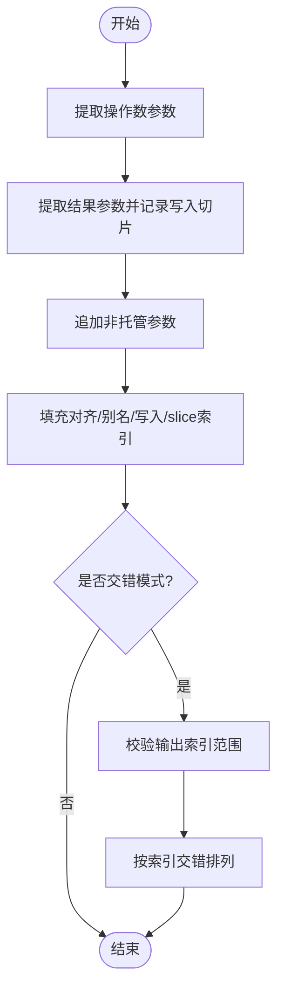
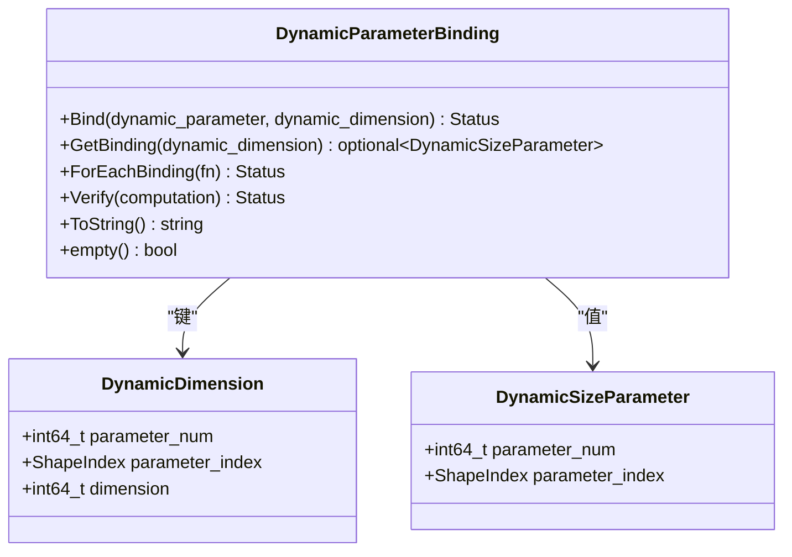
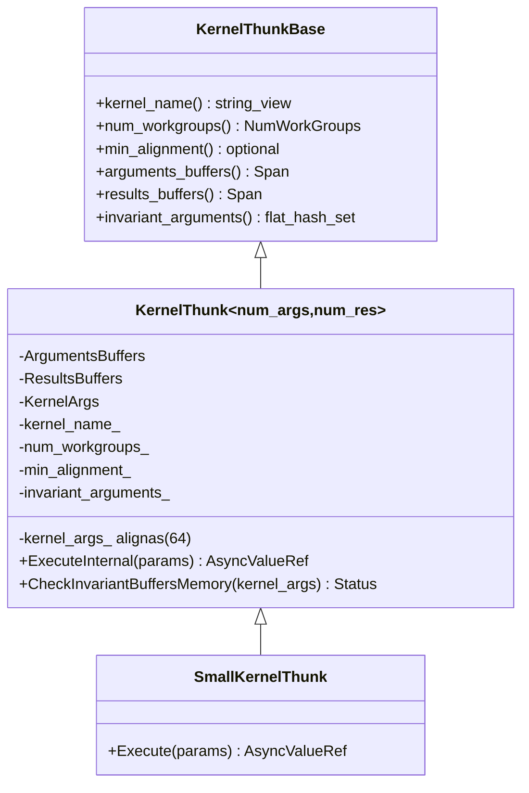
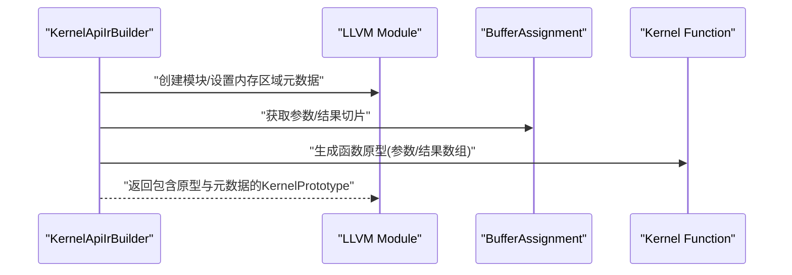
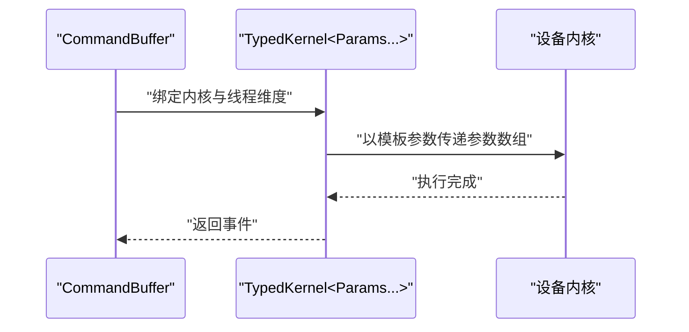
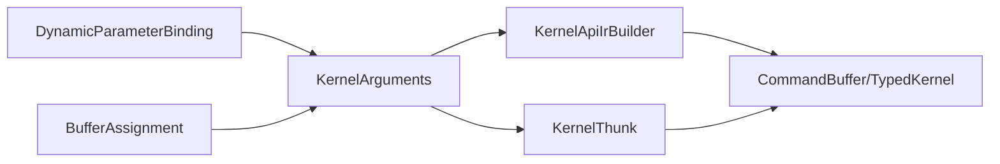

# 内核参数管理

<cite>
**本文引用的文件**
- [xla/codegen/emitters/kernel_arguments.h](file://xla/codegen/emitters/kernel_arguments.h)
- [xla/codegen/emitters/kernel_arguments.cc](file://xla/codegen/emitters/kernel_arguments.cc)
- [xla/hlo/ir/dynamic_parameter_binding.h](file://xla/hlo/ir/dynamic_parameter_binding.h)
- [xla/hlo/ir/dynamic_parameter_binding.cc](file://xla/hlo/ir/dynamic_parameter_binding.cc)
- [xla/backends/cpu/runtime/kernel_thunk.h](file://xla/backends/cpu/runtime/kernel_thunk.h)
- [xla/backends/cpu/codegen/kernel_api_ir_builder.h](file://xla/backends/cpu/codegen/kernel_api_ir_builder.h)
- [xla/stream_executor/command_buffer.h](file://xla/stream_executor/command_buffer.h)
- [xla/stream_executor/gpu/all_reduce_kernel.h](file://xla/stream_executor/gpu/all_reduce_kernel.h)
</cite>

## 目录
1. [引言](#引言)
2. [项目结构](#项目结构)
3. [核心组件](#核心组件)
4. [架构总览](#架构总览)
5. [详细组件分析](#详细组件分析)
6. [依赖关系分析](#依赖关系分析)
7. [性能考量](#性能考量)
8. [故障排查指南](#故障排查指南)
9. [结论](#结论)
10. [附录](#附录)

## 引言
本文件系统性阐述 XLA 内核参数管理系统的设计与实现，覆盖参数收集、验证与优化的全流程。重点说明三类参数的处理差异：常量、变量（输入/输出缓冲区）、动态参数；梳理参数绑定策略、内存对齐要求与传递效率优化；解释参数序列化/反序列化与跨平台兼容性；给出验证规则、错误诊断与调试支持建议，并总结最佳实践与性能优化要点。

## 项目结构
围绕内核参数管理的关键代码分布在以下模块：
- 参数描述与生成：kernel_arguments.{h,cc}
- 动态形状参数绑定：dynamic_parameter_binding.{h,cc}
- CPU 后端运行时与发射：kernel_thunk.h、kernel_api_ir_builder.h
- GPU/流执行器接口：command_buffer.h、all_reduce_kernel.h

**图表来源**
- [xla/codegen/emitters/kernel_arguments.h](file://xla/codegen/emitters/kernel_arguments.h#L86-L179)
- [xla/codegen/emitters/kernel_arguments.cc](file://xla/codegen/emitters/kernel_arguments.cc#L148-L259)
- [xla/hlo/ir/dynamic_parameter_binding.h](file://xla/hlo/ir/dynamic_parameter_binding.h#L43-L116)
- [xla/backends/cpu/runtime/kernel_thunk.h](file://xla/backends/cpu/runtime/kernel_thunk.h#L53-L206)
- [xla/backends/cpu/codegen/kernel_api_ir_builder.h](file://xla/backends/cpu/codegen/kernel_api_ir_builder.h#L53-L195)
- [xla/stream_executor/command_buffer.h](file://xla/stream_executor/command_buffer.h#L175-L411)
- [xla/stream_executor/gpu/all_reduce_kernel.h](file://xla/stream_executor/gpu/all_reduce_kernel.h#L67-L67)

**章节来源**
- [xla/codegen/emitters/kernel_arguments.h](file://xla/codegen/emitters/kernel_arguments.h#L31-L179)
- [xla/codegen/emitters/kernel_arguments.cc](file://xla/codegen/emitters/kernel_arguments.cc#L39-L259)
- [xla/hlo/ir/dynamic_parameter_binding.h](file://xla/hlo/ir/dynamic_parameter_binding.h#L33-L116)
- [xla/hlo/ir/dynamic_parameter_binding.cc](file://xla/hlo/ir/dynamic_parameter_binding.cc#L34-L105)
- [xla/backends/cpu/runtime/kernel_thunk.h](file://xla/backends/cpu/runtime/kernel_thunk.h#L53-L206)
- [xla/backends/cpu/codegen/kernel_api_ir_builder.h](file://xla/backends/cpu/codegen/kernel_api_ir_builder.h#L53-L195)
- [xla/stream_executor/command_buffer.h](file://xla/stream_executor/command_buffer.h#L175-L411)
- [xla/stream_executor/gpu/all_reduce_kernel.h](file://xla/stream_executor/gpu/all_reduce_kernel.h#L67-L67)

## 核心组件
- KernelArgument：内核参数的描述单元，区分“托管”和“非托管”，携带形状、切片、写入标记、对齐、别名等属性。
- KernelArguments：从 HLO 指令与 BufferAssignment 中提取参数列表，填充对齐、别名、写入标记、slice 索引等元信息，支持输入/输出交错排列。
- DynamicParameterBinding：维护动态维度与其运行时尺寸参数之间的绑定关系，提供校验与遍历能力。
- KernelThunk：CPU 后端内核调度与执行的薄封装，负责参数打包、对齐检查、工作组配置与调用路径优化。
- KernelApiIrBuilder：在 LLVM IR 层构建内核原型，抽取参数/结果缓冲区切片，生成内核函数签名与调用框架。
- CommandBuffer/GPU 接口：在 GPU 上通过 TypedKernel 以模板参数形式传递内核参数，支持线程维度与内核调用。

**章节来源**
- [xla/codegen/emitters/kernel_arguments.h](file://xla/codegen/emitters/kernel_arguments.h#L33-L84)
- [xla/codegen/emitters/kernel_arguments.h](file://xla/codegen/emitters/kernel_arguments.h#L86-L179)
- [xla/codegen/emitters/kernel_arguments.cc](file://xla/codegen/emitters/kernel_arguments.cc#L148-L259)
- [xla/hlo/ir/dynamic_parameter_binding.h](file://xla/hlo/ir/dynamic_parameter_binding.h#L43-L116)
- [xla/backends/cpu/runtime/kernel_thunk.h](file://xla/backends/cpu/runtime/kernel_thunk.h#L53-L206)
- [xla/backends/cpu/codegen/kernel_api_ir_builder.h](file://xla/backends/cpu/codegen/kernel_api_ir_builder.h#L53-L195)
- [xla/stream_executor/command_buffer.h](file://xla/stream_executor/command_buffer.h#L175-L411)

## 架构总览
下图展示从 HLO 到内核调用的关键数据流与职责划分：

**图表来源**
- [xla/codegen/emitters/kernel_arguments.cc](file://xla/codegen/emitters/kernel_arguments.cc#L148-L259)
- [xla/backends/cpu/codegen/kernel_api_ir_builder.h](file://xla/backends/cpu/codegen/kernel_api_ir_builder.h#L124-L154)
- [xla/backends/cpu/runtime/kernel_thunk.h](file://xla/backends/cpu/runtime/kernel_thunk.h#L104-L167)
- [xla/stream_executor/command_buffer.h](file://xla/stream_executor/command_buffer.h#L175-L411)

## 详细组件分析

### 组件一：KernelArguments（参数收集与属性填充）
- 职责
  - 从 HLO 指令的操作数与结果中提取参数描述。
  - 基于 BufferAssignment 与 BufferAlignment 计算每个参数的对齐、是否写入、是否别名、slice 索引等属性。
  - 支持输入/输出交错排列，便于某些后端要求的参数布局。
- 关键流程
  - 输入参数：遍历操作数，获取唯一切片并构造 KernelArgument。
  - 输出参数：递归遍历结果形状的数组子形状，生成写入标记的切片集合。
  - 非托管参数：直接按形状构造，用于标量或外部传入的非分配缓冲区。
  - 属性填充：根据切片首次出现位置复用对齐、写入、别名与 slice 索引；依据分配类型选择对齐值。
  - 交错模式：校验索引边界，确保输入/输出完全覆盖且不重叠。
- 复杂度
  - 时间复杂度近似 O(N+M)，N 为参数数量，M 为别名/重叠检测涉及的比较次数。
  - 空间复杂度 O(N) 存放参数与中间映射。

**图表来源**
- [xla/codegen/emitters/kernel_arguments.cc](file://xla/codegen/emitters/kernel_arguments.cc#L148-L259)

**章节来源**
- [xla/codegen/emitters/kernel_arguments.h](file://xla/codegen/emitters/kernel_arguments.h#L33-L84)
- [xla/codegen/emitters/kernel_arguments.h](file://xla/codegen/emitters/kernel_arguments.h#L86-L179)
- [xla/codegen/emitters/kernel_arguments.cc](file://xla/codegen/emitters/kernel_arguments.cc#L39-L120)
- [xla/codegen/emitters/kernel_arguments.cc](file://xla/codegen/emitters/kernel_arguments.cc#L148-L259)

### 组件二：DynamicParameterBinding（动态参数绑定）
- 职责
  - 建立“动态维度”到“动态尺寸参数”的映射，表示某参数的某个维度在运行时由另一个标量参数决定。
  - 提供绑定查询、遍历、字符串化与验证能力。
- 数据模型
  - DynamicDimension：目标参数编号、子形状索引、维度号。
  - DynamicSizeParameter：动态尺寸参数的编号与索引。
- 验证规则
  - 参数编号与索引需在计算图有效范围内。
  - 目标维度号必须小于对应子形状的维度数。
- 使用场景
  - 在内核参数生成阶段，结合动态绑定信息决定参数顺序与附加尺寸参数的插入位置。

**图表来源**
- [xla/hlo/ir/dynamic_parameter_binding.h](file://xla/hlo/ir/dynamic_parameter_binding.h#L43-L116)

**章节来源**
- [xla/hlo/ir/dynamic_parameter_binding.h](file://xla/hlo/ir/dynamic_parameter_binding.h#L43-L116)
- [xla/hlo/ir/dynamic_parameter_binding.cc](file://xla/hlo/ir/dynamic_parameter_binding.cc#L34-L105)

### 组件三：KernelThunk（CPU 后端内核调度）
- 职责
  - 将参数缓冲区与结果缓冲区打包为内核调用所需的参数数组。
  - 执行前对不变缓冲区进行内存一致性与对齐检查。
  - 管理工作组配置与最小对齐需求，支持静态/动态参数个数的特化。
- 性能优化
  - 对编译期已知参数规模使用 std::array 以利循环展开。
  - 使用 alignas(64) 的内核参数数组以提升热路径上的对齐移动性能。
  - 支持 call_once 快路径，针对仅一个工作组的小型内核减少启动开销。
- 序列化接口
  - 提供统一的基类接口，便于序列化与反序列化内核 thunk。

**图表来源**
- [xla/backends/cpu/runtime/kernel_thunk.h](file://xla/backends/cpu/runtime/kernel_thunk.h#L53-L206)

**章节来源**
- [xla/backends/cpu/runtime/kernel_thunk.h](file://xla/backends/cpu/runtime/kernel_thunk.h#L53-L206)

### 组件四：KernelApiIrBuilder（LLVM IR 层参数导出）
- 职责
  - 从 HLO 指令或显式 KernelParameter 列表导出内核原型，扁平化参数与结果，生成 LLVM 函数签名。
  - 抽取参数/结果的 BufferAllocation::Slice 以推断别名与不变性，注入内存区域元数据。
- 关键点
  - 支持可选的缓冲区一致性检查策略（如仅检查离散性）。
  - 生成内核函数与返回块，以及工作组/工作组 ID 的 LLVM 值，便于后续内核体发射。

**图表来源**
- [xla/backends/cpu/codegen/kernel_api_ir_builder.h](file://xla/backends/cpu/codegen/kernel_api_ir_builder.h#L124-L154)

**章节来源**
- [xla/backends/cpu/codegen/kernel_api_ir_builder.h](file://xla/backends/cpu/codegen/kernel_api_ir_builder.h#L53-L195)

### 组件五：GPU/流执行器参数传递（CommandBuffer/TypedKernel）
- 职责
  - 在 GPU 后端通过 TypedKernel 以模板参数形式传递内核参数，结合线程维度与内核调用。
- 特点
  - 通过模板参数推导参数类型，避免运行时类型转换开销。
  - 支持不同线程维度配置，适配不同内核的并行需求。

**图表来源**
- [xla/stream_executor/command_buffer.h](file://xla/stream_executor/command_buffer.h#L175-L411)

**章节来源**
- [xla/stream_executor/command_buffer.h](file://xla/stream_executor/command_buffer.h#L175-L411)

## 依赖关系分析
- KernelArguments 依赖 BufferAssignment 与 Shape/ShapeUtil 进行切片与形状处理；依赖 BufferAlignment 决定对齐策略。
- KernelApiIrBuilder 依赖 LLVM IR 工具链与 BufferAssignment 推断别名与不变性。
- KernelThunk 依赖 BufferAssignment 与 KernelSpec（在动态版本中）进行参数打包与执行。
- DynamicParameterBinding 与 HLO 模块/计算图交互，提供动态绑定验证。

**图表来源**
- [xla/codegen/emitters/kernel_arguments.cc](file://xla/codegen/emitters/kernel_arguments.cc#L148-L259)
- [xla/backends/cpu/codegen/kernel_api_ir_builder.h](file://xla/backends/cpu/codegen/kernel_api_ir_builder.h#L124-L154)
- [xla/backends/cpu/runtime/kernel_thunk.h](file://xla/backends/cpu/runtime/kernel_thunk.h#L104-L167)
- [xla/stream_executor/command_buffer.h](file://xla/stream_executor/command_buffer.h#L175-L411)

**章节来源**
- [xla/codegen/emitters/kernel_arguments.cc](file://xla/codegen/emitters/kernel_arguments.cc#L148-L259)
- [xla/backends/cpu/codegen/kernel_api_ir_builder.h](file://xla/backends/cpu/codegen/kernel_api_ir_builder.h#L124-L154)
- [xla/backends/cpu/runtime/kernel_thunk.h](file://xla/backends/cpu/runtime/kernel_thunk.h#L104-L167)
- [xla/stream_executor/command_buffer.h](file://xla/stream_executor/command_buffer.h#L175-L411)

## 性能考量
- 参数打包与对齐
  - 使用 alignas(64) 的内核参数数组，降低热路径上的对齐访问成本。
  - 通过 BufferAlignment 为入口参数、XLA 分配缓冲区与常量缓冲区分别设定最小对齐，减少运行时对齐检查。
- 编译期优化
  - 对静态参数规模使用 std::array 并配合条件类型，使编译器在热路径上自动展开循环。
  - 小型内核的 call_once 快路径减少启动与同步开销。
- 别名与写入标记
  - 基于 BufferAllocation::Slice 的别名检测与写入标记，有助于去重与合并参数，减少传递数量。
- GPU 参数传递
  - TypedKernel 以模板参数传递参数，避免运行时类型转换与间接寻址。

**章节来源**
- [xla/backends/cpu/runtime/kernel_thunk.h](file://xla/backends/cpu/runtime/kernel_thunk.h#L110-L167)
- [xla/codegen/emitters/kernel_arguments.cc](file://xla/codegen/emitters/kernel_arguments.cc#L39-L120)

## 故障排查指南
- 参数交错索引越界
  - 现象：创建交错参数时报错“输出索引越界/未使用完输入/输出”。
  - 排查：确认 interleaved_output_indices 是否在 [0, total_positions) 范围内，且不重复、不遗漏。
- 动态绑定无效
  - 现象：DynamicParameterBinding::Verify 报错。
  - 排查：确认动态尺寸参数与目标维度参数编号、索引有效，维度号不超过子形状维度数。
- 对齐与别名问题
  - 现象：运行时访问异常或性能下降。
  - 排查：检查 BufferAlignment 设置是否匹配后端要求；确认别名与写入标记是否正确，避免误共享。
- 不变缓冲区一致性
  - 现象：内核执行前检查失败。
  - 排查：核对 invariant_arguments 集合与实际内存状态，确保只读缓冲区未被意外修改。

**章节来源**
- [xla/codegen/emitters/kernel_arguments.cc](file://xla/codegen/emitters/kernel_arguments.cc#L211-L253)
- [xla/hlo/ir/dynamic_parameter_binding.cc](file://xla/hlo/ir/dynamic_parameter_binding.cc#L77-L105)
- [xla/backends/cpu/runtime/kernel_thunk.h](file://xla/backends/cpu/runtime/kernel_thunk.h#L141-L141)

## 结论
XLA 内核参数管理系统通过 KernelArguments、KernelApiIrBuilder、KernelThunk 与 DynamicParameterBinding 协同，实现了从 HLO 到设备内核的高效参数传递。系统在参数收集、对齐与别名推断、交错布局、动态绑定验证等方面具备完善的机制，并通过编译期优化与运行时对齐策略保障性能与稳定性。遵循本文的最佳实践与排障建议，可在多后端环境下获得一致且高效的参数管理体验。

## 附录
- 参数序列化/反序列化与跨平台兼容性
  - 可基于 KernelThunkBase 的统一接口进行序列化，保存 kernel_name、num_workgroups、min_alignment、arguments_buffers/results_buffers 与 invariant_arguments 等关键字段，反序列化时重建执行上下文。
  - 跨平台兼容性建议：在序列化中保留 BufferAlignment 与 BufferAllocation::Slice 的语义，避免强依赖后端特定的地址布局；在反序列化时重新解析 BufferAssignment 以恢复切片关系。
- 最佳实践
  - 优先使用 KernelArguments::Create 的标准接口，必要时再启用交错模式。
  - 明确区分托管与非托管参数，非托管参数仅用于标量或外部缓冲区。
  - 在 GPU 后端使用 TypedKernel 以模板参数传递参数，减少运行时开销。
  - 对大型内核启用对齐与别名优化，避免不必要的拷贝与同步。