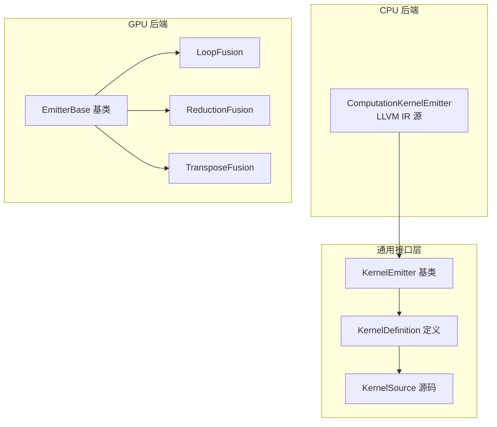
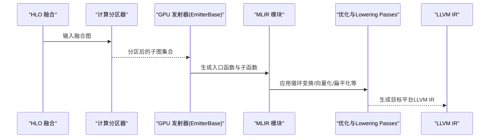
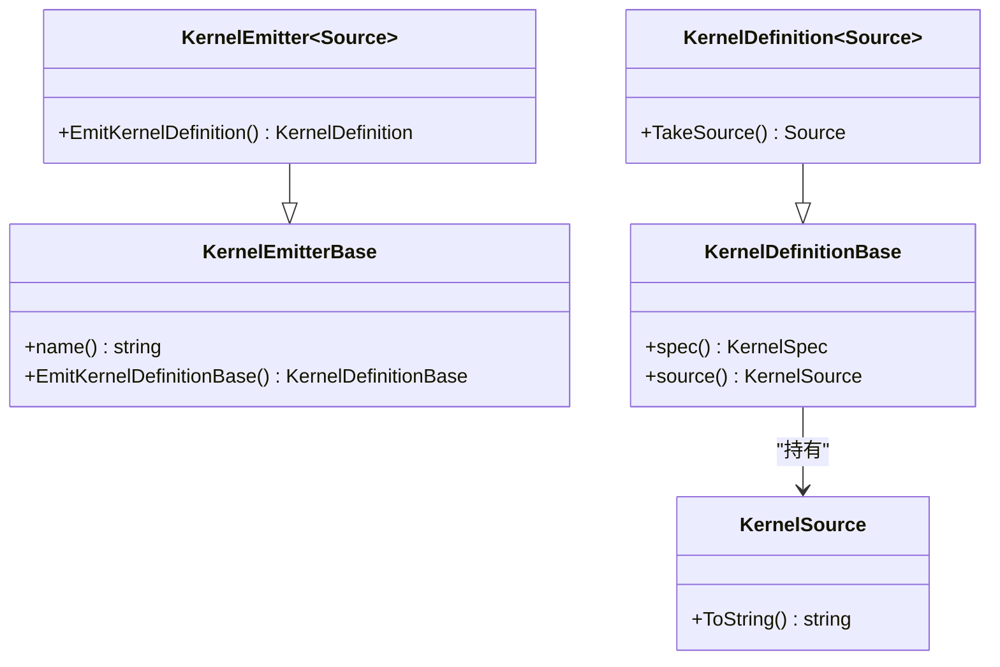
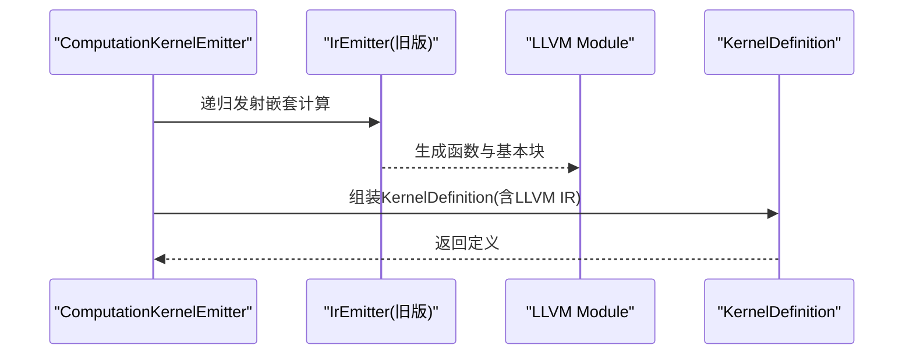
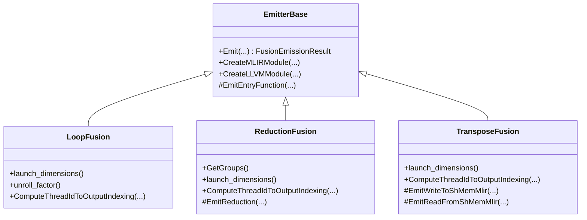
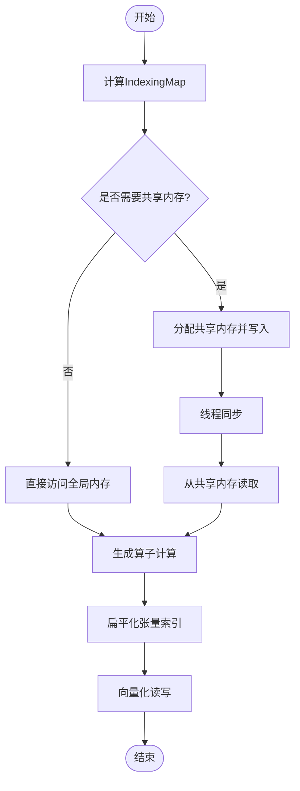
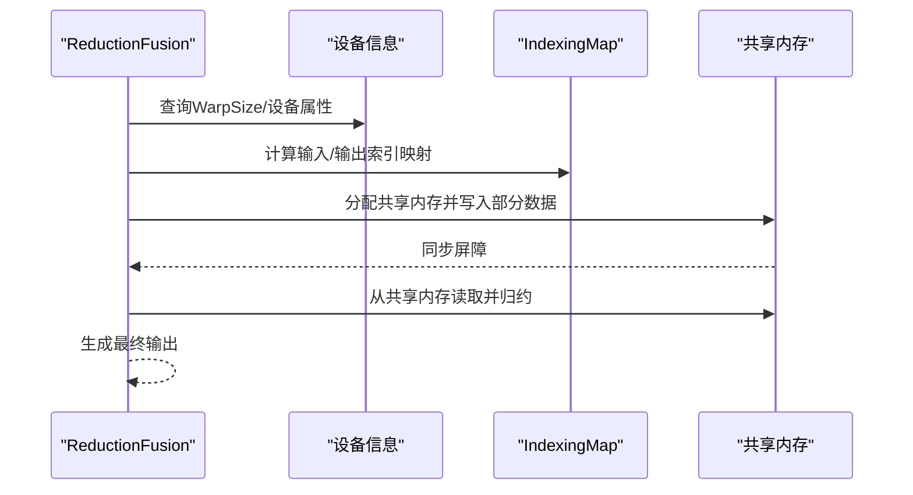
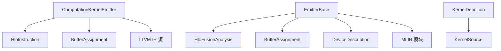

# 内核发射器

<cite>
**本文引用的文件**
- [kernel_emitter.h](file://xla/codegen/kernel_emitter.h)
- [kernel_definition.h](file://xla/codegen/kernel_definition.h)
- [kernel_source.h](file://xla/codegen/kernel_source.h)
- [computation_kernel_emitter.h](file://xla/backends/cpu/codegen/computation_kernel_emitter.h)
- [emitter_base.h](file://xla/backends/gpu/codegen/emitters/emitter_base.h)
- [loop.h](file://xla/backends/gpu/codegen/emitters/loop.h)
- [reduction.h](file://xla/backends/gpu/codegen/emitters/reduction.h)
- [transpose.h](file://xla/backends/gpu/codegen/emitters/transpose.h)
- [emitters.md](file://docs/emitters.md)
</cite>

## 目录
1. [简介](#简介)
2. [项目结构](#项目结构)
3. [核心组件](#核心组件)
4. [架构总览](#架构总览)
5. [详细组件分析](#详细组件分析)
6. [依赖关系分析](#依赖关系分析)
7. [性能考量](#性能考量)
8. [故障排查指南](#故障排查指南)
9. [结论](#结论)
10. [附录](#附录)

## 简介
本文件系统化梳理XLA内核发射器体系，聚焦于发射器接口设计、抽象层次、不同操作类型的发射器实现模式、参数绑定与内存布局优化、寄存器/共享内存分配策略、可扩展性设计（新增操作类型与硬件后端）、测试与调试支持，以及与编译器其他组件（如HLO融合分析、计算分区、MLIR流水线）的集成方式。文档以代码为依据，辅以图示帮助理解。

## 项目结构
XLA内核发射器由通用接口层与后端特定实现组成：
- 通用接口与定义：位于xla/codegen，提供KernelEmitter基类、KernelDefinition与KernelSource抽象，统一发射器的输入输出契约。
- CPU后端：在xla/backends/cpu/codegen中，ComputationKernelEmitter等面向CPU的发射器使用LLVM IR源码生成。
- GPU后端：在xla/backends/gpu/codegen/emitters中，基于MLIR的Hero-based发射器族，包含LoopFusion、ReductionFusion、TransposeFusion等，覆盖算术、内存与控制流的关键场景。

**图表来源**
- [kernel_emitter.h](file://xla/codegen/kernel_emitter.h#L33-L70)
- [kernel_definition.h](file://xla/codegen/kernel_definition.h#L34-L78)
- [kernel_source.h](file://xla/codegen/kernel_source.h#L26-L37)
- [computation_kernel_emitter.h](file://xla/backends/cpu/codegen/computation_kernel_emitter.h#L47-L68)
- [emitter_base.h](file://xla/backends/gpu/codegen/emitters/emitter_base.h#L53-L119)
- [loop.h](file://xla/backends/gpu/codegen/emitters/loop.h#L38-L68)
- [reduction.h](file://xla/backends/gpu/codegen/emitters/reduction.h#L54-L154)
- [transpose.h](file://xla/backends/gpu/codegen/emitters/transpose.h#L50-L167)

**章节来源**
- [kernel_emitter.h](file://xla/codegen/kernel_emitter.h#L33-L70)
- [kernel_definition.h](file://xla/codegen/kernel_definition.h#L34-L78)
- [kernel_source.h](file://xla/codegen/kernel_source.h#L26-L37)
- [computation_kernel_emitter.h](file://xla/backends/cpu/codegen/computation_kernel_emitter.h#L47-L68)
- [emitter_base.h](file://xla/backends/gpu/codegen/emitters/emitter_base.h#L53-L119)
- [loop.h](file://xla/backends/gpu/codegen/emitters/loop.h#L38-L68)
- [reduction.h](file://xla/backends/gpu/codegen/emitters/reduction.h#L54-L154)
- [transpose.h](file://xla/backends/gpu/codegen/emitters/transpose.h#L50-L167)

## 核心组件
- KernelEmitterBase/KernelEmitter：定义发射器的统一接口，负责从给定输入（通常是HLO融合）生成KernelDefinition。
- KernelDefinitionBase/KernelDefinition：封装执行规格（KernelSpec）与具体内核源码（KernelSource），并提供TakeSource转移所有权的能力。
- KernelSource：抽象内核源码表示，后端可实现LLVM IR、PTX等。
- CPU ComputationKernelEmitter：针对调用指令与嵌套计算的内核发射，借助旧版IrEmitter生成合成buffer_table，并考虑未来向栈分配迁移。
- GPU EmitterBase：所有GPU发射器的基类，负责创建MLIR模块、生成入口函数、线程/块索引、分段写入（epilogue）与降级到LLVM的流水线集成。

**章节来源**
- [kernel_emitter.h](file://xla/codegen/kernel_emitter.h#L33-L70)
- [kernel_definition.h](file://xla/codegen/kernel_definition.h#L34-L78)
- [kernel_source.h](file://xla/codegen/kernel_source.h#L26-L37)
- [computation_kernel_emitter.h](file://xla/backends/cpu/codegen/computation_kernel_emitter.h#L36-L68)
- [emitter_base.h](file://xla/backends/gpu/codegen/emitters/emitter_base.h#L53-L119)

## 架构总览
XLA内核发射器采用“Hero-based”策略：根据融合中的“英雄”操作选择最优发射器类型（如循环、转置、归约）。发射流程通常包括：
- 计算分区（Computation Partitioner）：将HLO融合拆分为可安全内联的子图。
- MLIR发射（Emitters）：将子图映射到xla_gpu/tensor/arith/scf等方言，生成入口函数与epilogue。
- 编译流水线（Optimization & Lowering）：将MLIR转换为LLVM IR并进一步下降低层目标。

**图表来源**
- [emitter_base.h](file://xla/backends/gpu/codegen/emitters/emitter_base.h#L55-L118)
- [emitters.md](file://docs/emitters.md#L29-L37)

**章节来源**
- [emitters.md](file://docs/emitters.md#L14-L37)
- [emitter_base.h](file://xla/backends/gpu/codegen/emitters/emitter_base.h#L55-L118)

## 详细组件分析

### 接口与抽象层
- KernelEmitter模板类通过EmitKernelDefinition返回强类型KernelDefinition，内部统一转换为KernelDefinitionBase以屏蔽源码类型差异。
- KernelDefinition持有KernelSpec（执行规格）与Source（源码对象），支持TakeSource转移所有权，便于后续编译与装载。

**图表来源**
- [kernel_emitter.h](file://xla/codegen/kernel_emitter.h#L33-L70)
- [kernel_definition.h](file://xla/codegen/kernel_definition.h#L34-L78)
- [kernel_source.h](file://xla/codegen/kernel_source.h#L26-L37)

**章节来源**
- [kernel_emitter.h](file://xla/codegen/kernel_emitter.h#L33-L70)
- [kernel_definition.h](file://xla/codegen/kernel_definition.h#L34-L78)
- [kernel_source.h](file://xla/codegen/kernel_source.h#L26-L37)

### CPU：ComputationKernelEmitter
- 面向call指令与嵌套计算的内核发射，利用旧版IrEmitter生成内核定义，构建合成buffer_table（含中间指令）。
- 适用于避免thunk运行时开销的场景（如紧密while循环与标量运算）。

**图表来源**
- [computation_kernel_emitter.h](file://xla/backends/cpu/codegen/computation_kernel_emitter.h#L36-L68)

**章节来源**
- [computation_kernel_emitter.h](file://xla/backends/cpu/codegen/computation_kernel_emitter.h#L36-L68)

### GPU：EmitterBase 与发射器族
- EmitterBase提供统一入口，负责：
  - 创建MLIR模块与LLVM模块（用于测试或直接生成LLVM IR）。
  - 生成入口函数，按线程/块维度生成索引。
  - 支持epilogue（输出写回）与设备特性适配（网格维度拆分等）。
- LoopFusion：默认发射器，将元素级计算映射到线程/块索引，保证合并写入；支持向量化与循环展开。
- ReductionFusion：面向归约的共享内存/寄存器策略，支持行归约、多行归约、列归约与小列归约等变体。
- TransposeFusion：面向需要共享内存的转置，采用双阶段循环（写共享内存→同步→读共享内存写输出）。

**图表来源**
- [emitter_base.h](file://xla/backends/gpu/codegen/emitters/emitter_base.h#L53-L119)
- [loop.h](file://xla/backends/gpu/codegen/emitters/loop.h#L38-L68)
- [reduction.h](file://xla/backends/gpu/codegen/emitters/reduction.h#L54-L154)
- [transpose.h](file://xla/backends/gpu/codegen/emitters/transpose.h#L50-L167)

**章节来源**
- [emitter_base.h](file://xla/backends/gpu/codegen/emitters/emitter_base.h#L53-L119)
- [loop.h](file://xla/backends/gpu/codegen/emitters/loop.h#L38-L68)
- [reduction.h](file://xla/backends/gpu/codegen/emitters/reduction.h#L54-L154)
- [transpose.h](file://xla/backends/gpu/codegen/emitters/transpose.h#L50-L167)

### 参数绑定与内存布局优化
- 参数绑定：发射器通过BufferAssignment与HloInstruction建立输入/输出缓冲区映射，确保每个Slice对应唯一索引。
- 内存布局优化：
  - 索引映射（IndexingMap）：纯索引变换（如transpose、slice、reshape）通过映射复用输入元素，减少重复计算。
  - 共享内存（Shared Memory）：转置发射器在需要时分配共享内存，先写共享内存再读出，提升吞吐。
  - 扁平化与向量化：将N维张量投影到1D，结合连续且对齐的访问模式进行vector.transfer_read/write，提高带宽利用率。
  - 循环变换：循环展开、peel、pipeline等Pass提升并行度与访存效率。

**图表来源**
- [emitters.md](file://docs/emitters.md#L88-L111)
- [emitters.md](file://docs/emitters.md#L298-L369)

**章节来源**
- [emitters.md](file://docs/emitters.md#L88-L111)
- [emitters.md](file://docs/emitters.md#L298-L369)

### 寄存器/共享内存分配策略
- 线程/块维度：根据设备能力与融合分析结果确定LaunchDimensions，必要时拆分网格维度。
- Warp/向量宽度：根据元素类型位宽与共享内存bank宽度决定vector_size，最大化连续访问。
- 归约策略：行归约/多行归约采用warp级聚合与共享内存读写映射；小列归约利用warp大小整除特性优化。
- 转置策略：双阶段循环，写共享内存→同步→读共享内存写输出，避免跨bank冲突。

**图表来源**
- [reduction.h](file://xla/backends/gpu/codegen/emitters/reduction.h#L125-L153)
- [transpose.h](file://xla/backends/gpu/codegen/emitters/transpose.h#L124-L167)

**章节来源**
- [reduction.h](file://xla/backends/gpu/codegen/emitters/reduction.h#L125-L153)
- [transpose.h](file://xla/backends/gpu/codegen/emitters/transpose.h#L124-L167)

### 可扩展性设计
- 新增操作类型：在GPU侧，遵循EmitterBase接口，实现CreateMLIRModule/EmitEntryFunction与必要的IndexingMap计算，即可接入Hero-based发射器族。
- 新硬件后端：在CPU侧，可参考ComputationKernelEmitter，实现LLVM IR生成；在GPU侧，可实现自定义MLIR方言与Lowering Passes。
- 分区与索引：通过ComputationPartitioner与IndexingMap工具，确保复杂HLO序列的安全内联与正确索引映射。

**图表来源**
- [emitter_base.h](file://xla/backends/gpu/codegen/emitters/emitter_base.h#L69-L118)
- [emitters.md](file://docs/emitters.md#L14-L28)

**章节来源**
- [emitter_base.h](file://xla/backends/gpu/codegen/emitters/emitter_base.h#L69-L118)
- [emitters.md](file://docs/emitters.md#L14-L28)

### 测试框架、性能基准与调试支持
- 测试：GPU发射器提供CreateMLIRModule/CreateLLVMModule接口供测试使用，便于隔离验证。
- 调试：可通过run_hlo_module配合--xla_dump_emitter_re与--xla_dump_to导出各Pass后的MLIR，定位问题。
- 性能：文档展示了从xla_gpu.loop到向量化、循环展开再到LLVM IR的完整流水线，便于针对性优化。

**章节来源**
- [emitter_base.h](file://xla/backends/gpu/codegen/emitters/emitter_base.h#L61-L72)
- [emitters.md](file://docs/emitters.md#L490-L498)

## 依赖关系分析
- CPU后端依赖：ComputationKernelEmitter依赖HloInstruction与BufferAssignment，生成LLVM IR并通过KernelDefinition封装。
- GPU后端依赖：EmitterBase依赖HloFusionAnalysis、BufferAssignment、DeviceDescription等，协调MLIR生成与Pass流水线。
- 通用依赖：KernelDefinition持有KernelSpec与Source，KernelSource为后端特定实现。

**图表来源**
- [computation_kernel_emitter.h](file://xla/backends/cpu/codegen/computation_kernel_emitter.h#L47-L68)
- [emitter_base.h](file://xla/backends/gpu/codegen/emitters/emitter_base.h#L53-L74)
- [kernel_definition.h](file://xla/codegen/kernel_definition.h#L34-L78)

**章节来源**
- [computation_kernel_emitter.h](file://xla/backends/cpu/codegen/computation_kernel_emitter.h#L47-L68)
- [emitter_base.h](file://xla/backends/gpu/codegen/emitters/emitter_base.h#L53-L74)
- [kernel_definition.h](file://xla/codegen/kernel_definition.h#L34-L78)

## 性能考量
- 索引映射与分区：避免重复计算，减少代码膨胀。
- 共享内存与同步：转置与归约场景中，合理划分tile与warp，减少bank冲突与寄存器压力。
- 向量化与循环变换：连续且对齐的访问路径可显著提升吞吐。
- 设备特性适配：根据设备的WarpSize、共享内存bank宽度动态调整vector_size与tile尺寸。

[本节为通用指导，无需列出章节来源]

## 故障排查指南
- 使用--xla_dump_emitter_re与--xla_dump_to导出MLIR中间产物，逐Pass定位问题。
- 对照Hero选择与IndexingMap计算，确认输入/输出索引映射是否正确。
- 在GPU侧，检查共享内存分配与同步点位置，确保无数据竞争与bank冲突。

**章节来源**
- [emitters.md](file://docs/emitters.md#L490-L498)

## 结论
XLA内核发射器通过统一的KernelEmitter接口与KernelDefinition封装，实现了跨后端的一致性；GPU侧采用Hero-based发射器族与MLIR流水线，覆盖算术、内存与控制流关键场景；CPU侧则通过ComputationKernelEmitter适配复杂嵌套计算。通过分区、索引映射、共享内存与向量化等技术，发射器在性能与可维护性之间取得平衡。新增操作类型与硬件后端可通过遵循现有接口与流水线快速集成。

[本节为总结性内容，无需列出章节来源]

## 附录
- 相关文档：XLA:GPU Emitters文档提供了完整的Hero类型、分区与流水线说明，建议作为深入学习的起点。

**章节来源**
- [emitters.md](file://docs/emitters.md#L1-L540)