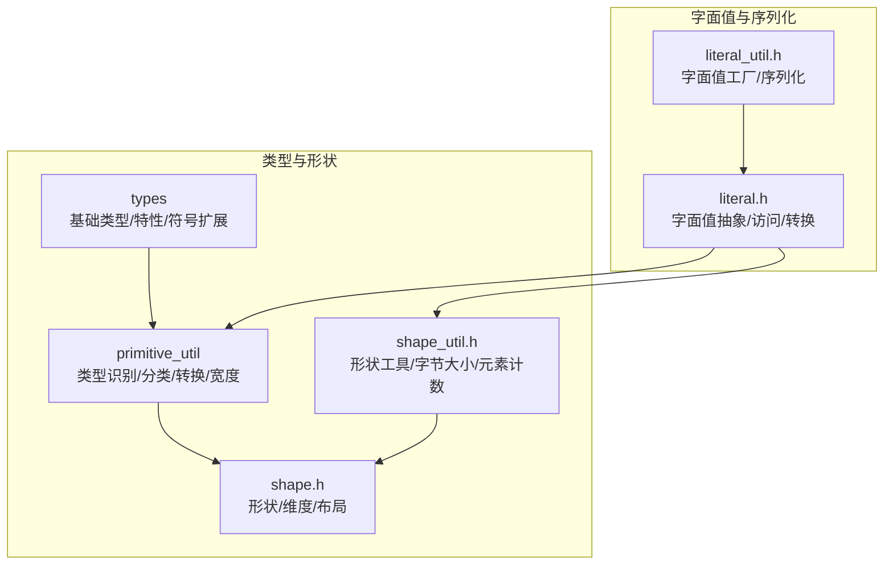
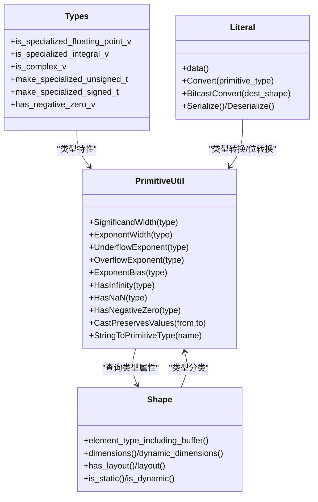
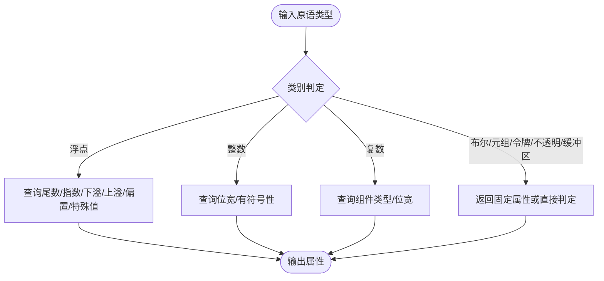
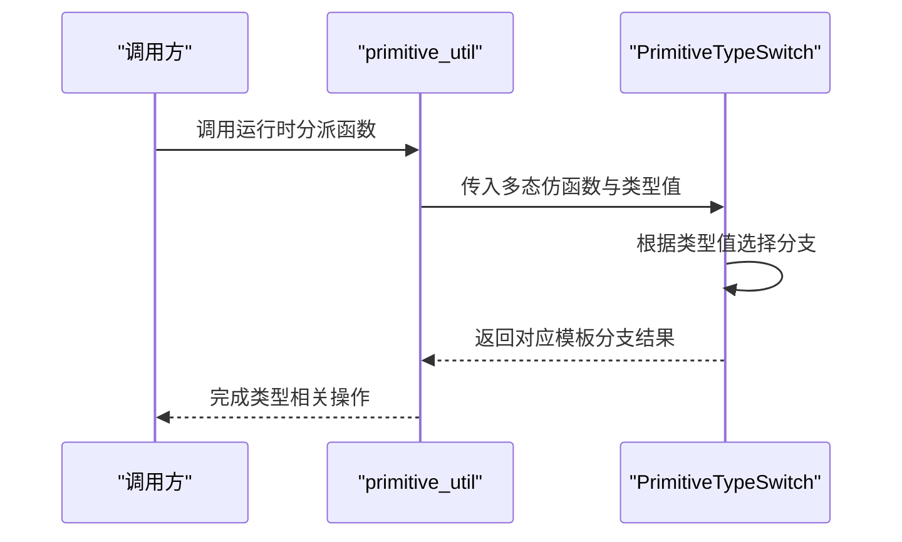
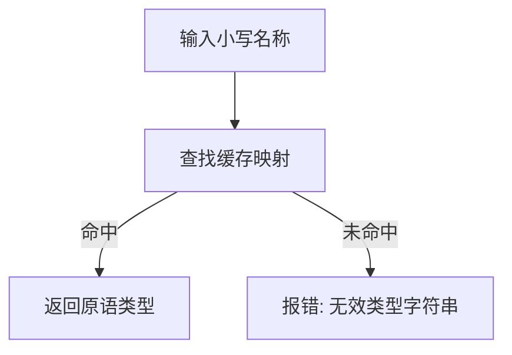
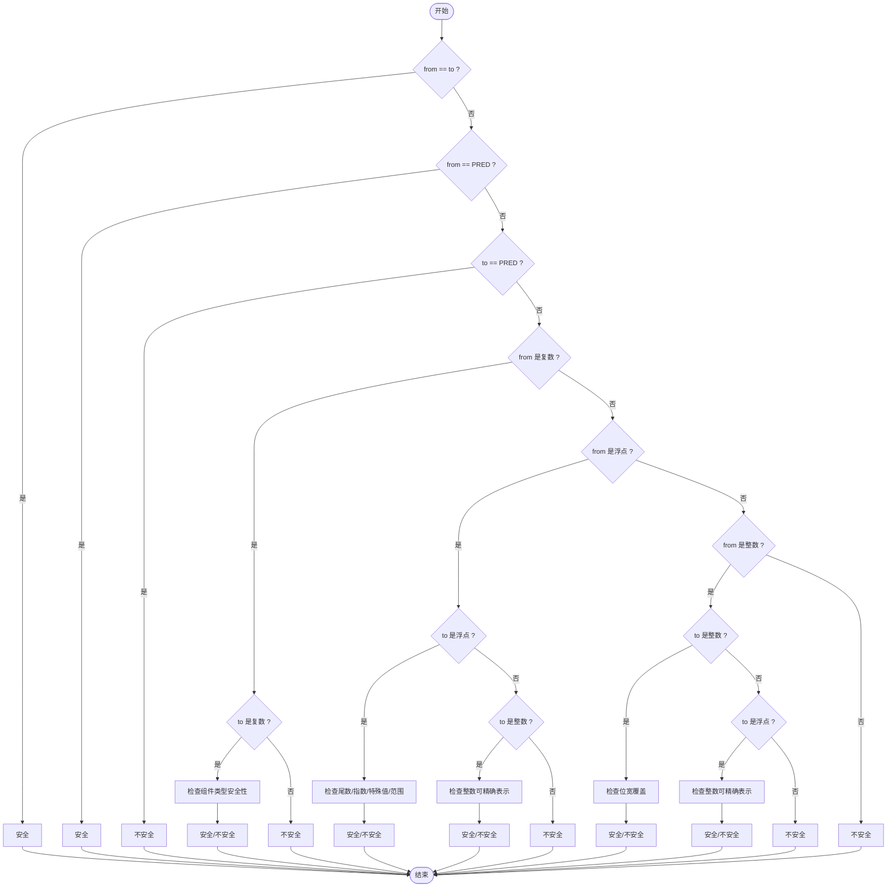
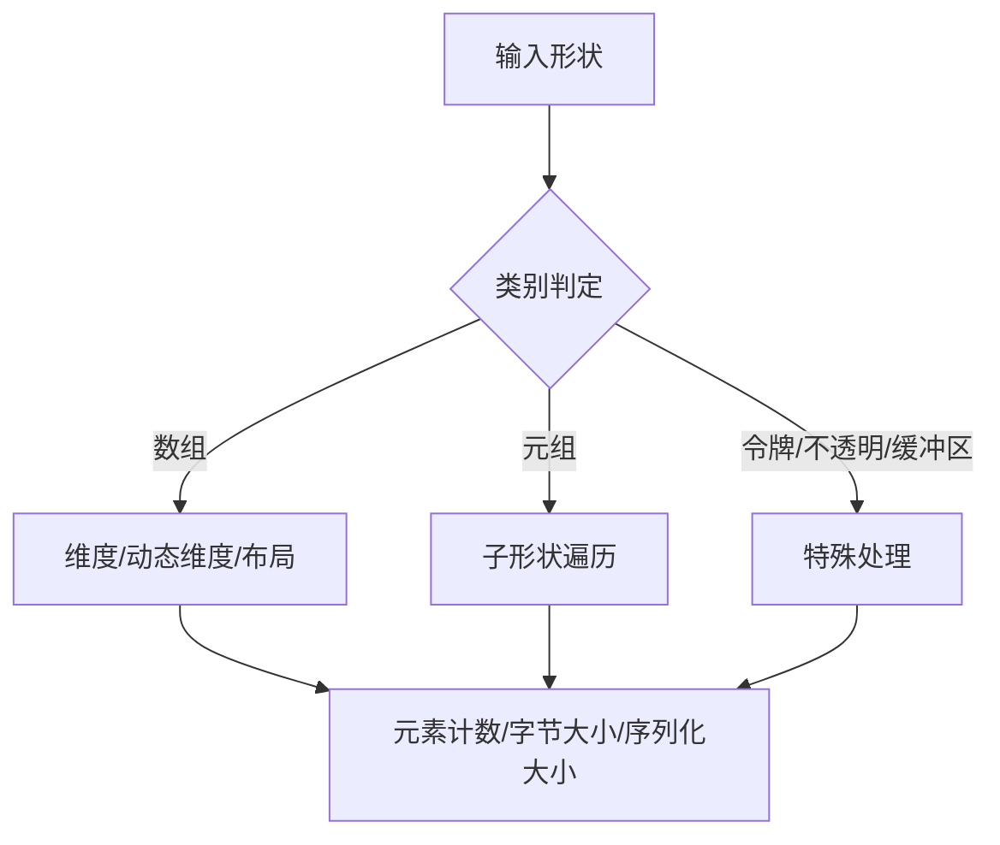
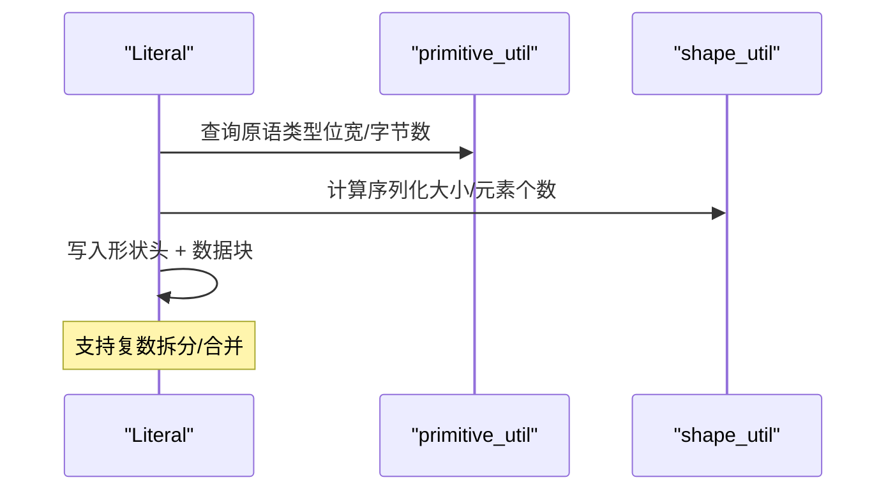
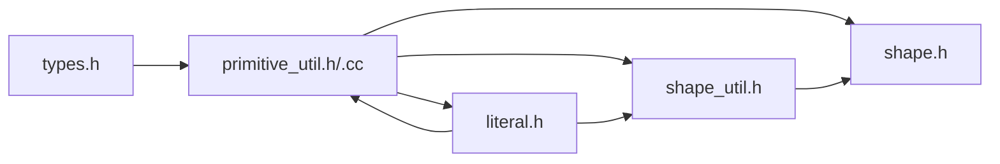

# 类型工具集

<cite>
**本文引用的文件**
- [primitive_util.h](file://xla/primitive_util.h)
- [primitive_util.cc](file://xla/primitive_util.cc)
- [types.h](file://xla/types.h)
- [shape.h](file://xla/shape.h)
- [shape_util.h](file://xla/shape_util.h)
- [literal.h](file://xla/literal.h)
- [literal_util.h](file://xla/literal_util.h)
- [primitive_util_test.cc](file://xla/primitive_util_test.cc)
</cite>

## 目录
1. [引言](#引言)
2. [项目结构](#项目结构)
3. [核心组件](#核心组件)
4. [架构总览](#架构总览)
5. [详细组件分析](#详细组件分析)
6. [依赖关系分析](#依赖关系分析)
7. [性能考量](#性能考量)
8. [故障排查指南](#故障排查指南)
9. [结论](#结论)
10. [附录](#附录)

## 引言
本文件系统性梳理 XLA 类型工具集，聚焦于数据类型识别、转换与验证，覆盖浮点、整数、复数及多种自定义/稀疏格式类型；阐述类型推导算法、精度转换策略与溢出检测机制；说明类型安全检查、运行时类型验证与编译时类型优化；并提供使用示例、常见问题与性能优化建议。目标是帮助读者在不深入源码的前提下，高效理解与正确使用 XLA 的类型体系。

## 项目结构
XLA 类型工具主要分布在以下模块：
- primitive_util：原语类型识别、分类、位宽计算、字符串到类型的映射、类型转换安全性判定等
- types：基础类型别名、特性检测、符号/无符号扩展等
- shape/shape_util：形状描述、动态维度、元素计数、字节大小、布局一致性等
- literal/literal_util：常量字面值构造、序列化/反序列化、按原语类型访问、转换与位转换等

图示来源
- [primitive_util.h](file://xla/primitive_util.h#L41-L954)
- [types.h](file://xla/types.h#L29-L174)
- [shape.h](file://xla/shape.h#L45-L878)
- [shape_util.h](file://xla/shape_util.h#L50-L200)
- [literal.h](file://xla/literal.h#L66-L800)
- [literal_util.h](file://xla/literal_util.h#L55-L200)

章节来源
- [primitive_util.h](file://xla/primitive_util.h#L41-L954)
- [types.h](file://xla/types.h#L29-L174)
- [shape.h](file://xla/shape.h#L45-L878)
- [shape_util.h](file://xla/shape_util.h#L50-L200)
- [literal.h](file://xla/literal.h#L66-L800)
- [literal_util.h](file://xla/literal_util.h#L55-L200)

## 核心组件
- 原语类型识别与分类
  - 浮点/整数/复数/布尔/元组/令牌/不透明/缓冲区等类别判定
  - 位宽、指数宽度、尾数宽度、下溢/上溢指数、指数偏置、是否含无穷/NaN/负零等属性查询
- 类型到原生类型的双向映射
  - 编译期模板映射与运行期开关分派相结合
- 字符串到原语类型的解析与缓存
- 类型转换安全性判定
  - 精度保留、特殊值保留、范围覆盖、符号扩展/截断等规则
- 形状与布局
  - 维度/动态维度/布局/元素计数/内存占用估算
- 字面值与序列化
  - 按原语类型访问、转换、位转换、序列化/反序列化

章节来源
- [primitive_util.h](file://xla/primitive_util.h#L41-L954)
- [primitive_util.cc](file://xla/primitive_util.cc#L34-L306)
- [types.h](file://xla/types.h#L29-L174)
- [shape.h](file://xla/shape.h#L45-L878)
- [shape_util.h](file://xla/shape_util.h#L50-L200)
- [literal.h](file://xla/literal.h#L66-L800)
- [literal_util.h](file://xla/literal_util.h#L55-L200)

## 架构总览
XLA 类型工具以“原语类型 + 形状 + 字面值”三层抽象协同工作：
- primitive_util 提供类型识别、分类与转换规则
- shape/shape_util 描述数组/元组/缓冲区的结构与布局
- literal/literal_util 在运行时承载具体数值，并提供类型转换与序列化能力

图示来源
- [primitive_util.h](file://xla/primitive_util.h#L41-L954)
- [types.h](file://xla/types.h#L29-L174)
- [shape.h](file://xla/shape.h#L45-L878)
- [literal.h](file://xla/literal.h#L66-L800)

## 详细组件分析

### 原语类型识别与分类
- 分类接口
  - 浮点/整数/复数/布尔/数组/元组/令牌/不透明/缓冲区等
  - 8位整数、MX 类型、F8 系列等细分判断
- 属性查询
  - 尾数位宽、指数位宽、下溢/上溢指数、指数偏置、是否含无穷/NaN/负零
- 运行时分派
  - 针对不同类别提供模板化的分派函数，便于在运行时根据类型值进行分支
- 编译期映射
  - 模板特化实现原语类型与原生类型的双向映射

图示来源
- [primitive_util.h](file://xla/primitive_util.h#L41-L954)
- [primitive_util.cc](file://xla/primitive_util.cc#L34-L306)

章节来源
- [primitive_util.h](file://xla/primitive_util.h#L41-L954)
- [primitive_util.cc](file://xla/primitive_util.cc#L34-L306)

### 类型到原生类型的映射
- 编译期映射
  - 通过模板特化将原语类型映射到对应原生类型别名
- 运行期分派
  - 使用模板常量包装器与 switch 分派，实现运行时多态分支
- 特殊类型支持
  - 复数类型、自定义整型、多种半精度/稀疏浮点类型

图示来源
- [primitive_util.h](file://xla/primitive_util.h#L471-L645)

章节来源
- [primitive_util.h](file://xla/primitive_util.h#L248-L645)

### 字符串到原语类型的解析与缓存
- 解析流程
  - 小写化名称 → 查表 → 返回原语类型枚举
- 缓存策略
  - 预构建全量映射并缓存，避免重复计算
- 兼容性
  - 对不透明类型提供别名映射

图示来源
- [primitive_util.cc](file://xla/primitive_util.cc#L227-L306)

章节来源
- [primitive_util.cc](file://xla/primitive_util.cc#L227-L306)

### 类型转换安全性判定
- 规则概览
  - 同类型直接安全
  - 布尔到任意类型安全
  - 任意类型到布尔不安全（信息丢失）
  - 复数到复数：递归比较组件类型
  - 浮点到浮点：尾数/指数宽度、特殊值、下溢/上溢范围需满足条件
  - 整数到浮点：整数位宽与浮点尾数匹配、指数范围足够
  - 有符号到无符号：不允许（负值丢失）
  - 整数到整数：目标非符号位宽需覆盖源位宽
- 实现要点
  - 利用位宽、指数/尾数宽度、下溢/上溢指数、特殊值支持等属性进行综合判断

图示来源
- [primitive_util.cc](file://xla/primitive_util.cc#L147-L225)

章节来源
- [primitive_util.cc](file://xla/primitive_util.cc#L147-L225)

### 形状与布局
- 形状分类
  - 数组/元组/令牌/不透明/缓冲区五类互斥
- 维度与动态维度
  - 支持静态/动态/无界动态/有界动态
- 布局
  - minor-to-major 等布局信息，影响内存访问顺序与哈希
- 工具函数
  - 元素计数、字节大小、序列化大小估算等

图示来源
- [shape.h](file://xla/shape.h#L45-L878)
- [shape_util.h](file://xla/shape_util.h#L50-L200)

章节来源
- [shape.h](file://xla/shape.h#L45-L878)
- [shape_util.h](file://xla/shape_util.h#L50-L200)

### 字面值与序列化
- 访问与转换
  - 按原生类型访问数据视图
  - 按原语类型转换/位转换
- 序列化/反序列化
  - 自定义二进制格式，支持形状与数据分离
  - 支持复杂类型（如复数）拆分/合并写入/读取
- 性能与兼容性
  - 避免大对象的 protobuf 限制
  - 保持与布局敏感/不敏感两种比较方式

图示来源
- [literal.h](file://xla/literal.h#L66-L800)
- [literal_util.h](file://xla/literal_util.h#L55-L200)

章节来源
- [literal.h](file://xla/literal.h#L66-L800)
- [literal_util.h](file://xla/literal_util.h#L55-L200)

## 依赖关系分析
- primitive_util 依赖 types 提供类型特性与别名
- shape/shape_util 依赖 primitive_util 进行类型分类与属性查询
- literal/literal_util 依赖 primitive_util 进行类型转换与位转换
- 所有模块共享 xla_data.pb 与 util 工具

图示来源
- [types.h](file://xla/types.h#L29-L174)
- [primitive_util.h](file://xla/primitive_util.h#L41-L954)
- [primitive_util.cc](file://xla/primitive_util.cc#L34-L306)
- [shape.h](file://xla/shape.h#L45-L878)
- [shape_util.h](file://xla/shape_util.h#L50-L200)
- [literal.h](file://xla/literal.h#L66-L800)

章节来源
- [types.h](file://xla/types.h#L29-L174)
- [primitive_util.h](file://xla/primitive_util.h#L41-L954)
- [primitive_util.cc](file://xla/primitive_util.cc#L34-L306)
- [shape.h](file://xla/shape.h#L45-L878)
- [shape_util.h](file://xla/shape_util.h#L50-L200)
- [literal.h](file://xla/literal.h#L66-L800)

## 性能考量
- 编译期映射与 constexpr 计算
  - 原语类型位宽/字节宽等通过 constexpr 计算，减少运行时开销
- 运行时分派的分支预测
  - 使用条件分支与内联提示，提升热点路径性能
- 缓存与惰性初始化
  - 字符串到类型的映射采用静态缓存，避免重复构建
- 序列化优化
  - 自定义二进制格式避免 protobuf 大对象限制，按位宽打包/解包
- 布局敏感/不敏感的哈希
  - 提供可选布局敏感哈希，平衡一致性与性能

[本节为通用指导，无需特定文件引用]

## 故障排查指南
- 类型转换失败
  - 检查源/目标类型的安全性规则是否满足
  - 关注尾数/指数宽度、特殊值支持与范围覆盖
- 形状不一致
  - 确认数组/元组/缓冲区类别与状态一致
  - 校验动态维度与布局设置
- 序列化/反序列化错误
  - 确保形状头与数据长度匹配
  - 注意复数类型拆分/合并顺序
- 单元测试参考
  - 参考类型字符串解析与转换安全性的测试用例

章节来源
- [primitive_util_test.cc](file://xla/primitive_util_test.cc#L32-L151)

## 结论
XLA 类型工具集通过“原语类型 + 形状 + 字面值”的清晰分层，提供了完备的数据类型识别、转换与验证能力。其设计兼顾编译期优化与运行时灵活性，配合严格的类型安全规则与完善的工具链，能够支撑从高层建模到底层执行的全栈需求。遵循本文档的使用建议与最佳实践，可在保证正确性的同时获得良好性能。

## 附录

### 支持的数据类型与处理逻辑
- 布尔/整数/浮点/复数/元组/令牌/不透明/缓冲区
- 自定义整型与多种半精度/稀疏浮点类型
- 处理逻辑
  - 识别与分类、属性查询、运行时分派、编译期映射、字符串解析、转换安全性判定、序列化/反序列化

章节来源
- [primitive_util.h](file://xla/primitive_util.h#L41-L954)
- [types.h](file://xla/types.h#L29-L174)
- [literal.h](file://xla/literal.h#L66-L800)

### 类型推导与精度转换
- 推导依据
  - 原语类型属性与运行时分派
- 精度转换
  - 严格校验尾数/指数宽度与范围覆盖
  - 特殊值（无穷/NaN/负零）保留策略

章节来源
- [primitive_util.cc](file://xla/primitive_util.cc#L147-L225)

### 溢出检测机制
- 下溢/上溢指数与范围检查
- 与尾数宽度结合，确保最小/最大可表示值的覆盖

章节来源
- [primitive_util.cc](file://xla/primitive_util.cc#L58-L82)

### 类型安全检查与运行时验证
- 类型分类与状态一致性检查
- 形状与布局的一致性与有效性验证
- 字面值访问与转换的边界检查

章节来源
- [shape.h](file://xla/shape.h#L45-L878)
- [literal.h](file://xla/literal.h#L66-L800)

### 编译时类型优化
- constexpr 计算位宽/字节宽
- 模板特化映射原语类型与原生类型
- 静态缓存字符串到类型的映射

章节来源
- [primitive_util.h](file://xla/primitive_util.h#L682-L782)
- [primitive_util.cc](file://xla/primitive_util.cc#L227-L306)

### 使用示例与最佳实践
- 类型字符串解析
  - 使用字符串到原语类型的解析函数
- 类型转换
  - 先用转换安全性判定，再执行转换
- 形状与布局
  - 明确静态/动态维度与布局，避免隐式转换导致的性能损失
- 字面值序列化
  - 大对象优先使用自定义二进制格式，注意复数拆分/合并

章节来源
- [primitive_util.cc](file://xla/primitive_util.cc#L288-L306)
- [literal.h](file://xla/literal.h#L66-L800)