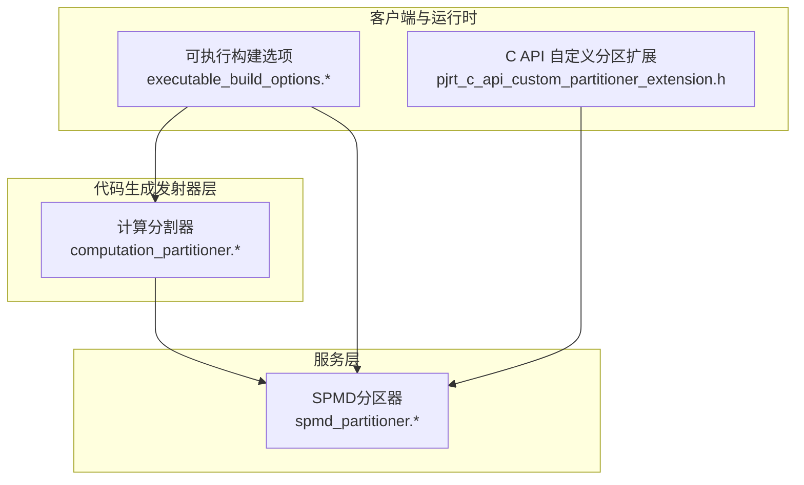
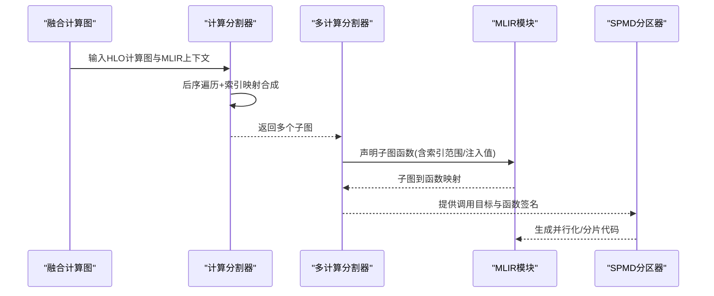
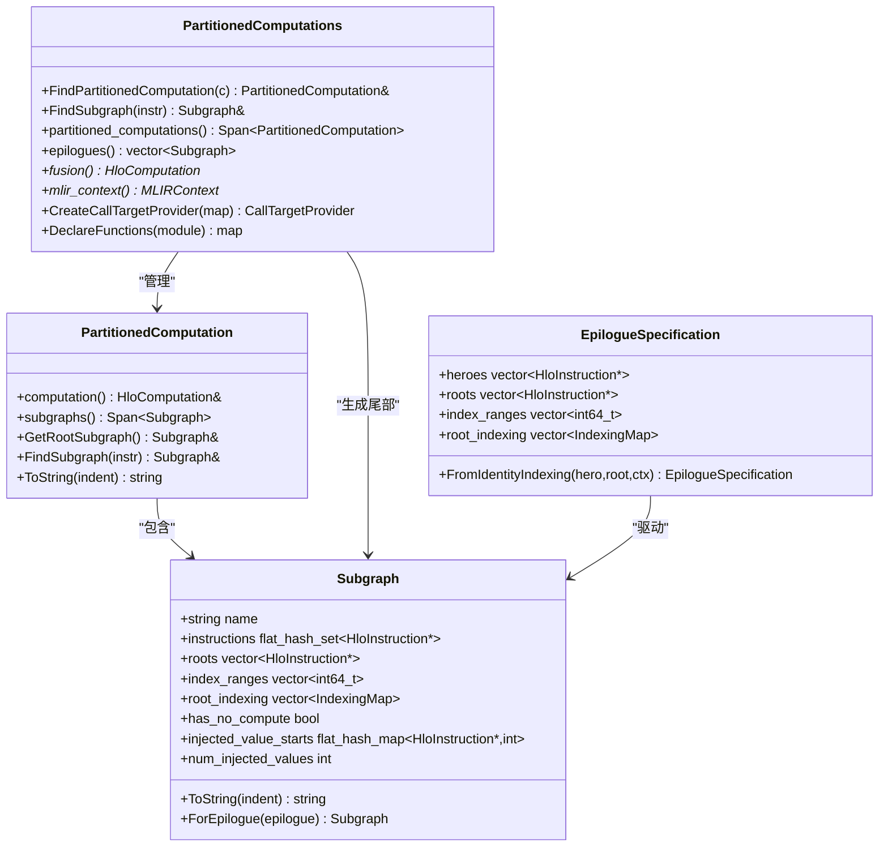
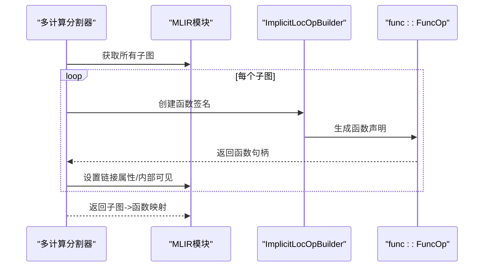
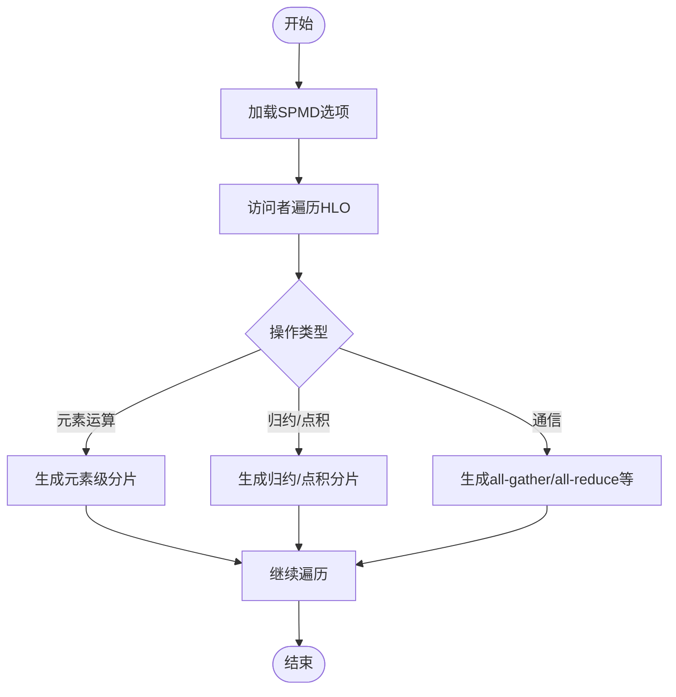
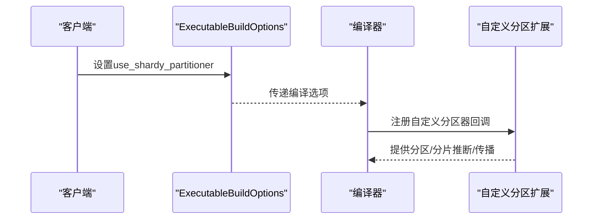
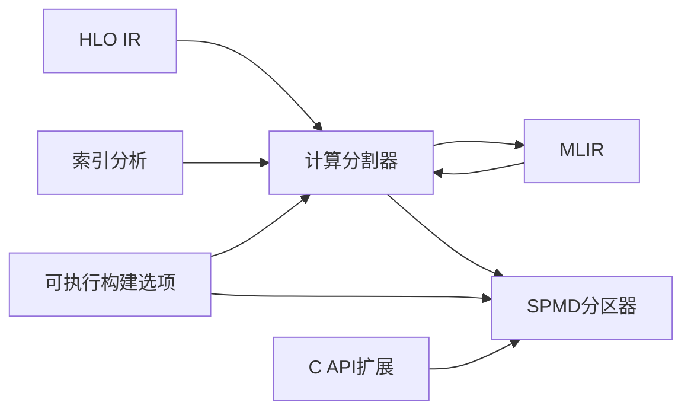

# 计算分割器

<cite>
**本文档引用的文件**
- [computation_partitioner.h](file://xla/codegen/emitters/computation_partitioner.h)
- [computation_partitioner.cc](file://xla/codegen/emitters/computation_partitioner.cc)
- [computation_partitioner_test.cc](file://xla/codegen/emitters/computation_partitioner_test.cc)
- [spmd_partitioner.h](file://xla/service/spmd/spmd_partitioner.h)
- [spmd_partitioner.cc](file://xla/service/spmd/spmd_partitioner.cc)
- [pjrt_c_api_custom_partitioner_extension.h](file://xla/pjrt/c/pjrt_c_api_custom_partitioner_extension.h)
- [executable_build_options.h](file://xla/client/executable_build_options.h)
- [executable_build_options.cc](file://xla/client/executable_build_options.cc)
</cite>

## 目录
1. [简介](#简介)
2. [项目结构](#项目结构)
3. [核心组件](#核心组件)
4. [架构总览](#架构总览)
5. [详细组件分析](#详细组件分析)
6. [依赖关系分析](#依赖关系分析)
7. [性能考量](#性能考量)
8. [故障排查指南](#故障排查指南)
9. [结论](#结论)
10. [附录](#附录)

## 简介
本文件系统性阐述XLA计算分割器（Computation Partitioner）的设计目标、工作原理与实现细节，重点覆盖以下方面：
- 如何将复杂的HLO计算图分解为可独立生成内核的子图（subgraph），确保每个子图内的用户对节点的索引一致，避免重复指令或不必要的转置/重排。
- 分割策略、依赖关系分析与并行化机会识别：通过索引映射（IndexingMap）与“根”指令选择，形成无冗余的函数式子图，并在融合计算中生成尾部（epilogue）以减少跨函数调用开销。
- 实现细节：数据结构、算法流程、边界条件处理、最大子图规模限制等。
- 性能权衡与资源限制：子图大小上限、无计算子图标记、索引范围与参数注入等。
- 验证机制、错误恢复与调试支持：单元测试覆盖、函数签名生成、MLIR函数声明与属性标注。
- 配置选项、自定义策略与集成测试方法：可插拔的根指令判定钩子、SPMD分区器选项、Shardy分区器开关、自定义分区扩展接口。

## 项目结构
计算分割器位于代码生成发射器层（codegen/emitters），负责将融合计算图拆分为可编译的子图；同时，服务层的SPMD分区器提供更高层的并行化与分片策略；客户端选项支持启用Shardy分区器；C API扩展提供自定义分区器注册能力。

**图表来源**
- [computation_partitioner.h](file://xla/codegen/emitters/computation_partitioner.h#L1-L218)
- [spmd_partitioner.h](file://xla/service/spmd/spmd_partitioner.h#L1-L200)
- [executable_build_options.h](file://xla/client/executable_build_options.h#L270-L340)
- [pjrt_c_api_custom_partitioner_extension.h](file://xla/pjrt/c/pjrt_c_api_custom_partitioner_extension.h#L1-L145)

**章节来源**
- [computation_partitioner.h](file://xla/codegen/emitters/computation_partitioner.h#L1-L218)
- [spmd_partitioner.h](file://xla/service/spmd/spmd_partitioner.h#L1-L200)
- [executable_build_options.h](file://xla/client/executable_build_options.h#L270-L340)
- [pjrt_c_api_custom_partitioner_extension.h](file://xla/pjrt/c/pjrt_c_api_custom_partitioner_extension.h#L1-L145)

## 核心组件
- 计算分割器（PartitionedComputation）
  - 输入：HLO计算图、MLIR上下文、可选的“根指令”判定谓词。
  - 输出：若干子图（Subgraph），每个子图包含指令集合、根指令、索引范围、根索引映射、是否无计算、注入值信息等。
  - 关键点：基于后序遍历与索引映射合成，按用户索引一致性与根指令判定划分子图；支持“大子图”自动切分；支持无计算标记以便内联优化。
- 多计算分割器（PartitionedComputations）
  - 输入：融合计算图、MLIR上下文、可选的尾部（epilogue）规格。
  - 输出：包含所有被调用计算的分割结果，以及epilogue子图列表。
  - 关键点：递归收集所有被调用计算；为英雄指令（hero）生成尾部子图；提供函数声明生成与调用目标提供器。
- 尾部规格（EpilogueSpecification）
  - 描述尾部子图的根、英雄值、索引范围与索引映射，支持从恒等索引映射构造。
- 函数签名生成（CreateSubgraphMlirFunction）
  - 为子图生成MLIR函数声明，区分融合计算与被调用计算的参数与返回类型；为融合计算添加索引范围注解与注入值参数；标记无计算函数便于内联。

**章节来源**
- [computation_partitioner.h](file://xla/codegen/emitters/computation_partitioner.h#L38-L218)
- [computation_partitioner.cc](file://xla/codegen/emitters/computation_partitioner.cc#L107-L120)
- [computation_partitioner.cc](file://xla/codegen/emitters/computation_partitioner.cc#L207-L390)
- [computation_partitioner.cc](file://xla/codegen/emitters/computation_partitioner.cc#L392-L474)
- [computation_partitioner.cc](file://xla/codegen/emitters/computation_partitioner.cc#L476-L536)

## 架构总览
计算分割器在代码生成阶段将融合计算图拆分为多个子图，每个子图对应一个MLIR函数。SPMD分区器在更高层进行并行化与分片，两者协同工作：前者保证“索引一致性”，后者保证“设备维度分片”。客户端选项可启用Shardy分区器以改进某些场景下的分片质量。

**图表来源**
- [computation_partitioner.cc](file://xla/codegen/emitters/computation_partitioner.cc#L392-L474)
- [computation_partitioner.cc](file://xla/codegen/emitters/computation_partitioner.cc#L434-L457)
- [spmd_partitioner.h](file://xla/service/spmd/spmd_partitioner.h#L274-L345)

**章节来源**
- [computation_partitioner.cc](file://xla/codegen/emitters/computation_partitioner.cc#L392-L474)
- [spmd_partitioner.h](file://xla/service/spmd/spmd_partitioner.h#L274-L345)

## 详细组件分析

### 组件A：计算分割器（PartitionedComputation）
- 设计目标
  - 在不复制指令的前提下，将具有不同索引要求的用户分离到不同子图，从而允许为每个子图生成独立函数，避免转置/重排带来的额外开销。
  - 支持“根指令”钩子，强制在特定指令处分割，确保关键路径或边界节点独立成子图。
- 数据结构
  - Subgraph：包含名称、指令集合、根指令、索引范围、根索引映射、是否无计算、注入值起始位置与总数。
  - HloSubgraphData：为每个指令维护其索引映射集合、用户子图ID集合、自身子图ID、是否为根、用户数量等。
- 算法流程
  - 后序遍历HLO指令，计算每个指令的输入索引映射集合；根据用户索引映射数量、根指令判定与子图规模阈值决定是否新建子图。
  - 对于融合计算，为每个子图确定根索引映射（若根形状不同则通过位移映射统一）；为被调用计算直接使用恒等映射。
  - 生成子图名称、索引范围与根索引映射；建立指令到子图的映射。
- 并发与内联
  - 无计算标记（has_no_compute）用于提示内联优化；注入值（injected_value_starts/num_injected_values）允许将外部计算结果作为函数参数传入子图，减少跨函数调用成本。

**图表来源**
- [computation_partitioner.h](file://xla/codegen/emitters/computation_partitioner.h#L81-L143)
- [computation_partitioner.h](file://xla/codegen/emitters/computation_partitioner.h#L151-L199)
- [computation_partitioner.h](file://xla/codegen/emitters/computation_partitioner.h#L38-L53)

**章节来源**
- [computation_partitioner.h](file://xla/codegen/emitters/computation_partitioner.h#L81-L143)
- [computation_partitioner.h](file://xla/codegen/emitters/computation_partitioner.h#L151-L199)
- [computation_partitioner.h](file://xla/codegen/emitters/computation_partitioner.h#L38-L53)

### 组件B：函数签名生成与调用目标提供
- 函数签名规则
  - 融合计算：参数为张量参数+索引参数（带xla.range注解）+注入值参数；返回元素类型。
  - 被调用计算：参数为元素类型；返回元素类型。
- 调用目标提供器
  - 根据指令定位其所属子图，查找已声明的函数，返回对应的func对象，用于后续调用插入。

**图表来源**
- [computation_partitioner.cc](file://xla/codegen/emitters/computation_partitioner.cc#L434-L457)
- [computation_partitioner.cc](file://xla/codegen/emitters/computation_partitioner.cc#L476-L536)

**章节来源**
- [computation_partitioner.cc](file://xla/codegen/emitters/computation_partitioner.cc#L434-L457)
- [computation_partitioner.cc](file://xla/codegen/emitters/computation_partitioner.cc#L476-L536)

### 组件C：SPMD分区器（并行化与分片）
- 设计目标
  - 在设备网格上进行分片与通信，生成高效的并行内核序列；提供选项控制内存/通信权衡、窗口化einsum策略、收集通信算子等。
- 关键点
  - 选项结构（SpmdPartitionerOptions）涵盖卷积全量交换、窗口化einsum阈值、缓存all-gather、首选gather/scatter分区方法等。
  - 访问者模式（SpmdPartitioningVisitor）针对各类HLO操作生成分片后的等价操作与必要的通信。
  - PartitionedHlo封装分片状态与重着色（reshard）逻辑，支持广播、all-to-all、collective-permute等多种重分布策略。
- 与计算分割器的关系
  - 计算分割器保证“索引一致性”，SPMD分区器保证“设备维度分片”；二者结合可获得既无重复指令又具备良好并行性的最终代码。

**图表来源**
- [spmd_partitioner.h](file://xla/service/spmd/spmd_partitioner.h#L65-L137)
- [spmd_partitioner.h](file://xla/service/spmd/spmd_partitioner.h#L677-L799)

**章节来源**
- [spmd_partitioner.h](file://xla/service/spmd/spmd_partitioner.h#L65-L137)
- [spmd_partitioner.h](file://xla/service/spmd/spmd_partitioner.h#L677-L799)

### 组件D：Shardy分区器开关与自定义分区扩展
- Shardy分区器开关
  - 客户端选项提供use_shardy_partitioner布尔标志，影响编译流程中的某些步骤（如在某些路径下禁用/启用）。
- 自定义分区扩展（C API）
  - 提供注册自定义分区器的回调结构，支持分区、从操作数推断分片、传播用户分片等；可用于第三方后端或特殊算子的分片策略。

**图表来源**
- [executable_build_options.h](file://xla/client/executable_build_options.h#L273-L276)
- [executable_build_options.cc](file://xla/client/executable_build_options.cc#L201-L201)
- [executable_build_options.cc](file://xla/client/executable_build_options.cc#L327-L328)
- [pjrt_c_api_custom_partitioner_extension.h](file://xla/pjrt/c/pjrt_c_api_custom_partitioner_extension.h#L94-L107)

**章节来源**
- [executable_build_options.h](file://xla/client/executable_build_options.h#L273-L276)
- [executable_build_options.cc](file://xla/client/executable_build_options.cc#L201-L201)
- [executable_build_options.cc](file://xla/client/executable_build_options.cc#L327-L328)
- [pjrt_c_api_custom_partitioner_extension.h](file://xla/pjrt/c/pjrt_c_api_custom_partitioner_extension.h#L94-L107)

## 依赖关系分析
- 计算分割器依赖
  - HLO IR与索引分析：用于计算输入到输出的索引映射、位移映射等。
  - MLIR：用于生成函数声明、参数属性（如xla.range）、链接属性等。
  - 工具库：类型转换、形状工具、字符串工具等。
- SPMD分区器依赖
  - HLO IR与分片工具：用于推导分片、重着色、all-gather/all-to-all等通信。
  - 选项与日志：控制内存/通信权衡、报告中间状态。
- 客户端与运行时
  - 可执行构建选项：控制是否启用Shardy分区器。
  - C API扩展：注册自定义分区器，扩展分片能力。

**图表来源**
- [computation_partitioner.cc](file://xla/codegen/emitters/computation_partitioner.cc#L47-L56)
- [spmd_partitioner.cc](file://xla/service/spmd/spmd_partitioner.cc#L16-L84)
- [executable_build_options.cc](file://xla/client/executable_build_options.cc#L201-L201)
- [pjrt_c_api_custom_partitioner_extension.h](file://xla/pjrt/c/pjrt_c_api_custom_partitioner_extension.h#L94-L107)

**章节来源**
- [computation_partitioner.cc](file://xla/codegen/emitters/computation_partitioner.cc#L47-L56)
- [spmd_partitioner.cc](file://xla/service/spmd/spmd_partitioner.cc#L16-L84)
- [executable_build_options.cc](file://xla/client/executable_build_options.cc#L201-L201)
- [pjrt_c_api_custom_partitioner_extension.h](file://xla/pjrt/c/pjrt_c_api_custom_partitioner_extension.h#L94-L107)

## 性能考量
- 子图规模限制
  - 通过常量kMaxHloOpsPerSubgraph限制单个子图的最大HLO操作数，避免过大的函数难以优化与内联。
- 无计算子图优化
  - 标记仅包含位移、常量、reshape等“无计算”指令的子图为has_no_compute，便于后续内联与消除。
- 注入值参数
  - 将外部计算结果作为函数参数传入子图，减少跨函数调用与临时缓冲区分配。
- SPMD选项权衡
  - cache_all_gather、choose_faster_windowed_einsum_over_mem等选项在内存占用与速度之间做折中；可根据硬件特性调整。
- 索引映射简化
  - 在合成索引映射时进行简化与符号清理，降低后续代码生成复杂度。

[本节为通用指导，无需列出具体文件来源]

## 故障排查指南
- 单元测试覆盖
  - 包含钻石形切片链路、拼接、元组根、尾部生成、转置/反转根、部分可合并子图、函数签名正确性、动态更新切片、散点融合等场景，确保分割行为稳定且可预测。
- 函数签名验证
  - 通过打印并擦除MLIR函数，检查参数类型、索引范围注解、注入值参数、返回类型是否符合预期。
- 内存与通信日志
  - SPMD分区器提供内存使用报告与日志器，可在变换前后输出高占用指令列表，辅助定位热点。

**章节来源**
- [computation_partitioner_test.cc](file://xla/codegen/emitters/computation_partitioner_test.cc#L60-L109)
- [computation_partitioner_test.cc](file://xla/codegen/emitters/computation_partitioner_test.cc#L111-L161)
- [computation_partitioner_test.cc](file://xla/codegen/emitters/computation_partitioner_test.cc#L189-L232)
- [computation_partitioner_test.cc](file://xla/codegen/emitters/computation_partitioner_test.cc#L311-L355)
- [spmd_partitioner.cc](file://xla/service/spmd/spmd_partitioner.cc#L93-L197)

## 结论
计算分割器通过“索引一致性”原则将复杂融合计算拆分为多个可独立编译的子图，显著降低了重复指令与转置/重排的必要性；配合SPMD分区器的设备维度分片与通信策略，可在保持正确性的同时获得良好的并行性能。客户端选项与C API扩展进一步增强了可配置性与可扩展性，满足多样化的部署需求。

[本节为总结性内容，无需列出具体文件来源]

## 附录
- 配置选项与自定义策略
  - 计算分割器：可通过is_subgraph_root谓词定制根指令选择，强制在特定节点处分割。
  - SPMD分区器：通过SpmdPartitionerOptions调节内存/通信权衡、窗口化einsum策略、收集通信算子等。
  - Shardy分区器：通过use_shardy_partitioner选项启用/禁用。
  - 自定义分区扩展：通过C API注册回调，实现自定义算子的分片与分片推断。
- 集成测试方法
  - 使用ParseAndReturnVerifiedModule构造HLO模块，实例化PartitionedComputation/PartitionedComputations，调用ToString/PrintAndErase校验子图与函数签名，结合单元测试断言分割结果。

**章节来源**
- [computation_partitioner.h](file://xla/codegen/emitters/computation_partitioner.h#L77-L81)
- [spmd_partitioner.h](file://xla/service/spmd/spmd_partitioner.h#L65-L137)
- [executable_build_options.h](file://xla/client/executable_build_options.h#L273-L276)
- [pjrt_c_api_custom_partitioner_extension.h](file://xla/pjrt/c/pjrt_c_api_custom_partitioner_extension.h#L94-L107)
- [computation_partitioner_test.cc](file://xla/codegen/emitters/computation_partitioner_test.cc#L51-L58)