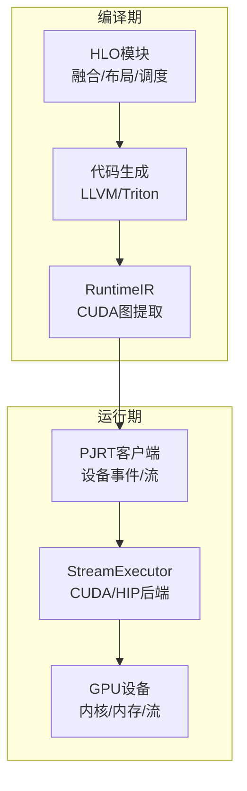
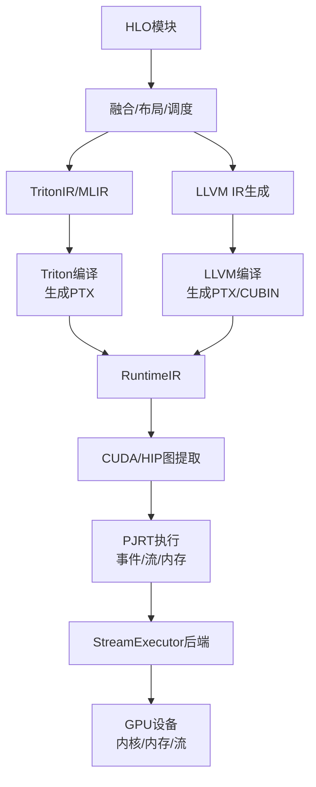
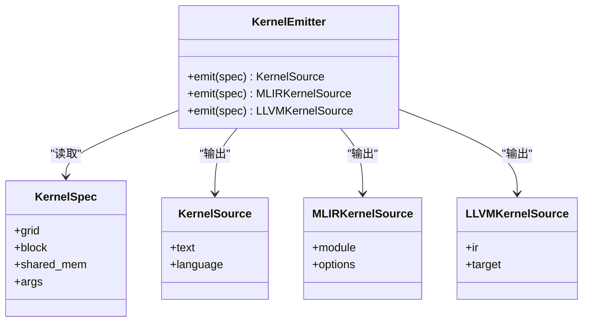
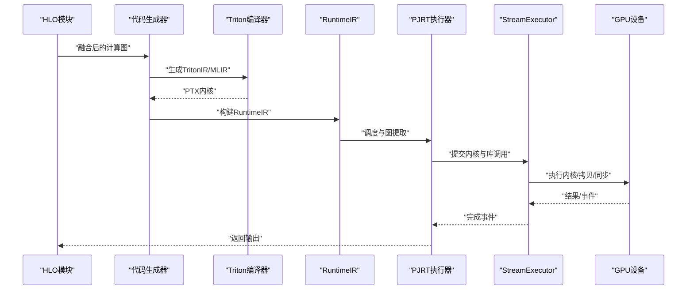
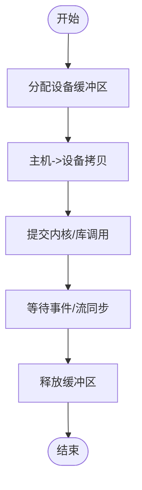
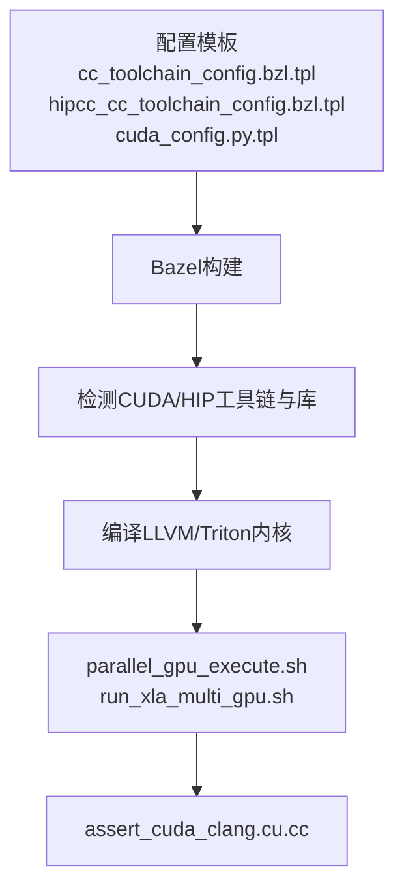
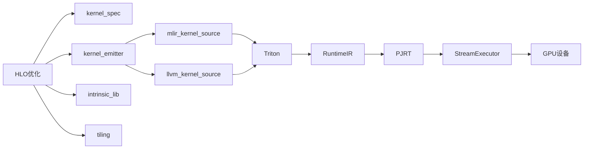

# GPU代码生成

<cite>
**本文引用的文件**
- [gpu_architecture.md](file://docs/gpu_architecture.md)
- [gpu_pipeline.png](file://docs/images/gpu_pipeline.png)
- [gpu_compiler.png](file://docs/images/gpu_compiler.png)
- [parallel_gpu_execute.sh](file://build_tools/ci/parallel_gpu_execute.sh)
- [run_xla_multi_gpu.sh](file://build_tools/rocm/run_xla_multi_gpu.sh)
- [assert_cuda_clang.cu.cc](file://build_tools/configure/assert_cuda_clang.cu.cc)
- [cuda_config.py.tpl](file://third_party/gpus/cuda/cuda_config.py.tpl)
- [hipcc_cc_toolchain_config.bzl.tpl](file://third_party/gpus/crosstool/hipcc_cc_toolchain_config.bzl.tpl)
- [cc_toolchain_config.bzl.tpl](file://third_party/gpus/crosstool/cc_toolchain_config.bzl.tpl)
- [farmhash_gpu.BUILD](file://third_party/farmhash/farmhash_gpu.BUILD)
- [farmhash_support_cuda.patch](file://third_party/farmhash/farmhash_support_cuda.patch)
- [hipblaslt.h](file://xla/backends/gpu/autotuner/hipblaslt.h)
- [hipblaslt.cc](file://xla/backends/gpu/autotuner/hipblaslt.cc)
- [hipblaslt_test.cc](file://xla/backends/gpu/autotuner/hipblaslt_test.cc)
- [hipblaslt_mx_execution_test.cc](file://xla/backends/gpu/autotuner/hipblaslt_mx_execution_test.cc)
- [hip_blas_lt.h](file://xla/stream_executor/rocm/hip_blas_lt.h)
- [hip_blas_lt.cc](file://xla/stream_executor/rocm/hip_blas_lt.cc)
- [hip_blas_utils.h](file://xla/stream_executor/rocm/hip_blas_utils.h)
- [hip_blas_utils.cc](file://xla/stream_executor/rocm/hip_blas_utils.cc)
- [hipsolver_wrapper.h](file://xla/stream_executor/rocm/hipsolver_wrapper.h)
- [hipsparse_wrapper.h](file://xla/stream_executor/rocm/hipsparse_wrapper.h)
- [hipblaslt_wrapper.h](file://xla/stream_executor/rocm/hipblaslt_wrapper.h)
- [triton_cuda.cc](file://xla/pjrt/triton_cuda.cc)
- [triton_rocm.cc](file://xla/pjrt/triton_rocm.cc)
- [triton.h](file://xla/pjrt/triton.h)
- [triton_stub.cc](file://xla/pjrt/triton_stub.cc)
- [kernel_spec.h](file://xla/codegen/kernel_spec.h)
- [kernel_spec.cc](file://xla/codegen/kernel_spec.cc)
- [kernel_emitter.h](file://xla/codegen/kernel_emitter.h)
- [kernel_source.h](file://xla/codegen/kernel_source.h)
- [mlir_kernel_source.h](file://xla/codegen/mlir_kernel_source.h)
- [mlir_kernel_source.cc](file://xla/codegen/mlir_kernel_source.cc)
- [llvm_kernel_source.h](file://xla/codegen/llvm_kernel_source.h)
- [llvm_kernel_source.cc](file://xla/codegen/llvm_kernel_source.cc)
- [intrinsic_lib.h](file://xla/codegen/intrinsic_lib.h)
- [intrinsic_lib.cc](file://xla/codegen/intrinsic_lib.cc)
- [ir_emission_utils.h](file://xla/codegen/ir_emission_utils.h)
- [ir_emission_utils.cc](file://xla/codegen/ir_emission_utils.cc)
- [tiling.h](file://xla/codegen/tiling/tiling.h)
- [tiling.cc](file://xla/codegen/tiling/tiling.cc)
- [common_pjrt_client.h](file://xla/pjrt/common_pjrt_client.h)
- [common_pjrt_client.cc](file://xla/pjrt/common_pjrt_client.cc)
- [stream_executor_pjrt_client.h](file://xla/pjrt/stream_executor_pjrt_client.h)
- [stream_executor_pjrt_client.cc](file://xla/pjrt/stream_executor_pjrt_client.cc)
- [stream_executor_executable.h](file://xla/pjrt/stream_executor_executable.h)
- [stream_executor_executable.cc](file://xla/pjrt/stream_executor_executable.cc)
- [stream_executor_executable.proto](file://xla/pjrt/stream_executor_executable.proto)
- [device_event.h](file://xla/pjrt/device_event.h)
- [buffer_sequencing_event.h](file://xla/pjrt/buffer_sequencing_event.h)
- [tracked_device_buffer.h](file://xla/pjrt/tracked_device_buffer.h)
- [tracked_device_buffer.cc](file://xla/pjrt/tracked_device_buffer.cc)
- [raw_buffer.h](file://xla/pjrt/raw_buffer.h)
- [raw_buffer.cc](file://xla/pjrt/raw_buffer.cc)
- [host_to_device_transfer_manager.h](file://xla/pjrt/host_to_device_transfer_manager.h)
- [host_to_device_transfer_manager.cc](file://xla/pjrt/host_to_device_transfer_manager.cc)
- [async_work_runner.h](file://xla/pjrt/async_work_runner.h)
- [thread_pool_async_work_runner.h](file://xla/pjrt/thread_pool_async_work_runner.h)
- [event_pool.h](file://xla/pjrt/event_pool.h)
- [event_pool.cc](file://xla/pjrt/event_pool.cc)
- [metrics.h](file://xla/pjrt/metrics.h)
- [metrics.cc](file://xla/pjrt/metrics.cc)
- [profiling.h](file://xla/pjrt/profiling.h)
- [profiling.cc](file://xla/pjrt/profiling.cc)
- [layout_mode.h](file://xla/pjrt/layout_mode.h)
- [layout_mode.cc](file://xla/pjrt/layout_mode.cc)
- [infer_dispatch_info.h](file://xla/pjrt/infer_dispatch_info.h)
- [infer_dispatch_info.cc](file://xla/pjrt/infer_dispatch_info.cc)
- [compiled_memory_stats.h](file://xla/pjrt/compiled_memory_stats.h)
- [compiled_memory_stats.cc](file://xla/pjrt/compiled_memory_stats.cc)
- [pjrt_client.h](file://xla/pjrt/pjrt_client.h)
- [pjrt_client.cc](file://xla/pjrt/pjrt_client.cc)
- [pjrt_api.h](file://xla/pjrt/pjrt_api.h)
- [pjrt_api.cc](file://xla/pjrt/pjrt_api.cc)
- [errors.h](file://xla/pjrt/errors.h)
- [errors.cc](file://xla/pjrt/errors.cc)
- [exceptions.h](file://xla/pjrt/exceptions.h)
- [utils.h](file://xla/pjrt/utils.h)
- [utils.cc](file://xla/pjrt/utils.cc)
- [python_api.h](file://xla/python_api/types_.py)
- [python_api.cc](file://xla/python_api/xla_literal.py)
</cite>

## 目录
1. [简介](#简介)
2. [项目结构](#项目结构)
3. [核心组件](#核心组件)
4. [架构总览](#架构总览)
5. [详细组件分析](#详细组件分析)
6. [依赖关系分析](#依赖关系分析)
7. [性能考量](#性能考量)
8. [故障排查指南](#故障排查指南)
9. [结论](#结论)
10. [附录](#附录)

## 简介
本文件面向XLA GPU后端的代码生成与运行时系统，聚焦以下主题：
- GPU代码生成的特殊挑战：CUDA/HIP编程模型、线程块配置、内存层次结构
- GPU内核生成策略：线程映射、共享内存使用、寄存器优化
- GPU运行时系统：设备内存管理、流管理、异步执行
- 目标配置系统：不同GPU架构（SM版本）与编译选项的处理
- GPU特定优化：内存合并访问、Warp级别并行性、占用率优化
- 调试工具与性能分析方法

## 项目结构
XLA在GPU方向的关键路径由“编译期优化与代码生成”和“运行时调度与执行”两部分组成。编译期通过HLO优化（融合、布局分配、缓冲区分配与调度）产出适合GPU执行的指令；运行期通过PJRT与StreamExecutor桥接CUDA/HIP后端，并结合Triton等代码生成层实现高性能内核。

**图表来源**
- [gpu_architecture.md](file://docs/gpu_architecture.md#L20-L254)

**章节来源**
- [gpu_architecture.md](file://docs/gpu_architecture.md#L1-L254)

## 核心组件
- 代码生成与内核发射
  - 内核规范与源码抽象：kernel_spec、kernel_source、mlir_kernel_source、llvm_kernel_source
  - 内核发射器：kernel_emitter
  - 内建函数库：intrinsic_lib
  - 平铺与分块：tiling
- 运行时与设备交互
  - 设备缓冲区与事件：tracked_device_buffer、raw_buffer、device_event、buffer_sequencing_event
  - 传输管理：host_to_device_transfer_manager
  - 异步工作与事件池：async_work_runner、event_pool
  - 指标与度量：metrics
- 配置与工具链
  - CUDA/HIP工具链模板：cc_toolchain_config.bzl.tpl、hipcc_cc_toolchain_config.bzl.tpl
  - CUDA配置模板：cuda_config.py.tpl
  - 构建脚本：parallel_gpu_execute.sh、run_xla_multi_gpu.sh
  - 自检示例：assert_cuda_clang.cu.cc
- Triton集成
  - Triton后端适配：triton_cuda.cc、triton_rocm.cc、triton.h、triton_stub.cc
  - ROCm BLAS/LT封装：hip_blas_lt.*、hipblaslt.*、hipsolver_wrapper.h、hipsparse_wrapper.h、hipblaslt_wrapper.h

**章节来源**
- [kernel_spec.h](file://xla/codegen/kernel_spec.h)
- [kernel_spec.cc](file://xla/codegen/kernel_spec.cc)
- [kernel_emitter.h](file://xla/codegen/kernel_emitter.h)
- [kernel_source.h](file://xla/codegen/kernel_source.h)
- [mlir_kernel_source.h](file://xla/codegen/mlir_kernel_source.h)
- [mlir_kernel_source.cc](file://xla/codegen/mlir_kernel_source.cc)
- [llvm_kernel_source.h](file://xla/codegen/llvm_kernel_source.h)
- [llvm_kernel_source.cc](file://xla/codegen/llvm_kernel_source.cc)
- [intrinsic_lib.h](file://xla/codegen/intrinsic_lib.h)
- [intrinsic_lib.cc](file://xla/codegen/intrinsic_lib.cc)
- [ir_emission_utils.h](file://xla/codegen/ir_emission_utils.h)
- [ir_emission_utils.cc](file://xla/codegen/ir_emission_utils.cc)
- [tiling.h](file://xla/codegen/tiling/tiling.h)
- [tiling.cc](file://xla/codegen/tiling/tiling.cc)
- [tracked_device_buffer.h](file://xla/pjrt/tracked_device_buffer.h)
- [tracked_device_buffer.cc](file://xla/pjrt/tracked_device_buffer.cc)
- [raw_buffer.h](file://xla/pjrt/raw_buffer.h)
- [raw_buffer.cc](file://xla/pjrt/raw_buffer.cc)
- [device_event.h](file://xla/pjrt/device_event.h)
- [buffer_sequencing_event.h](file://xla/pjrt/buffer_sequencing_event.h)
- [host_to_device_transfer_manager.h](file://xla/pjrt/host_to_device_transfer_manager.h)
- [host_to_device_transfer_manager.cc](file://xla/pjrt/host_to_device_transfer_manager.cc)
- [async_work_runner.h](file://xla/pjrt/async_work_runner.h)
- [event_pool.h](file://xla/pjrt/event_pool.h)
- [event_pool.cc](file://xla/pjrt/event_pool.cc)
- [metrics.h](file://xla/pjrt/metrics.h)
- [metrics.cc](file://xla/pjrt/metrics.cc)
- [cc_toolchain_config.bzl.tpl](file://third_party/gpus/crosstool/cc_toolchain_config.bzl.tpl)
- [hipcc_cc_toolchain_config.bzl.tpl](file://third_party/gpus/crosstool/hipcc_cc_toolchain_config.bzl.tpl)
- [cuda_config.py.tpl](file://third_party/gpus/cuda/cuda_config.py.tpl)
- [parallel_gpu_execute.sh](file://build_tools/ci/parallel_gpu_execute.sh)
- [run_xla_multi_gpu.sh](file://build_tools/rocm/run_xla_multi_gpu.sh)
- [assert_cuda_clang.cu.cc](file://build_tools/configure/assert_cuda_clang.cu.cc)
- [triton_cuda.cc](file://xla/pjrt/triton_cuda.cc)
- [triton_rocm.cc](file://xla/pjrt/triton_rocm.cc)
- [triton.h](file://xla/pjrt/triton.h)
- [triton_stub.cc](file://xla/pjrt/triton_stub.cc)
- [hip_blas_lt.h](file://xla/stream_executor/rocm/hip_blas_lt.h)
- [hip_blas_lt.cc](file://xla/stream_executor/rocm/hip_blas_lt.cc)
- [hipblaslt.h](file://xla/backends/gpu/autotuner/hipblaslt.h)
- [hipblaslt.cc](file://xla/backends/gpu/autotuner/hipblaslt.cc)

## 架构总览
下图展示XLA GPU从HLO到PTX/Triton内核的端到端流程，以及与PJRT/StreamExecutor的衔接。

**图表来源**
- [gpu_architecture.md](file://docs/gpu_architecture.md#L20-L254)
- [gpu_pipeline.png](file://docs/images/gpu_pipeline.png)

**章节来源**
- [gpu_architecture.md](file://docs/gpu_architecture.md#L20-L254)

## 详细组件分析

### 代码生成与内核发射
- 内核规范与源码抽象
  - kernel_spec定义内核参数、网格/块维度、共享内存大小等
  - kernel_source/mlir_kernel_source/llvm_kernel_source分别承载不同代码生成路径的源码表示
- 内核发射器
  - kernel_emitter负责将规范转换为可执行的内核调用
- 内建函数库
  - intrinsic_lib提供常用数学/数据搬运内建操作
- 平铺与分块
  - tiling模块用于确定tile尺寸与循环展开策略，直接影响访存与寄存器占用

**图表来源**
- [kernel_spec.h](file://xla/codegen/kernel_spec.h)
- [kernel_spec.cc](file://xla/codegen/kernel_spec.cc)
- [kernel_source.h](file://xla/codegen/kernel_source.h)
- [mlir_kernel_source.h](file://xla/codegen/mlir_kernel_source.h)
- [mlir_kernel_source.cc](file://xla/codegen/mlir_kernel_source.cc)
- [llvm_kernel_source.h](file://xla/codegen/llvm_kernel_source.h)
- [llvm_kernel_source.cc](file://xla/codegen/llvm_kernel_source.cc)
- [kernel_emitter.h](file://xla/codegen/kernel_emitter.h)

**章节来源**
- [kernel_spec.h](file://xla/codegen/kernel_spec.h)
- [kernel_spec.cc](file://xla/codegen/kernel_spec.cc)
- [kernel_emitter.h](file://xla/codegen/kernel_emitter.h)
- [kernel_source.h](file://xla/codegen/kernel_source.h)
- [mlir_kernel_source.h](file://xla/codegen/mlir_kernel_source.h)
- [mlir_kernel_source.cc](file://xla/codegen/mlir_kernel_source.cc)
- [llvm_kernel_source.h](file://xla/codegen/llvm_kernel_source.h)
- [llvm_kernel_source.cc](file://xla/codegen/llvm_kernel_source.cc)
- [intrinsic_lib.h](file://xla/codegen/intrinsic_lib.h)
- [intrinsic_lib.cc](file://xla/codegen/intrinsic_lib.cc)
- [ir_emission_utils.h](file://xla/codegen/ir_emission_utils.h)
- [ir_emission_utils.cc](file://xla/codegen/ir_emission_utils.cc)
- [tiling.h](file://xla/codegen/tiling/tiling.h)
- [tiling.cc](file://xla/codegen/tiling/tiling.cc)

### Triton集成与内核生成
- Triton后端适配
  - triton_cuda.cc/triton_rocm.cc提供针对CUDA/HIP的Triton集成入口
  - triton.h/triton_stub.cc定义公共接口与桩实现
- ROCm BLAS/LT封装
  - hip_blas_lt.*、hipblaslt.*、hipsolver_wrapper.h、hipsparse_wrapper.h、hipblaslt_wrapper.h提供ROCm生态的高性能库封装

**图表来源**
- [gpu_architecture.md](file://docs/gpu_architecture.md#L233-L244)
- [triton_cuda.cc](file://xla/pjrt/triton_cuda.cc)
- [triton_rocm.cc](file://xla/pjrt/triton_rocm.cc)
- [triton.h](file://xla/pjrt/triton.h)
- [triton_stub.cc](file://xla/pjrt/triton_stub.cc)
- [hip_blas_lt.h](file://xla/stream_executor/rocm/hip_blas_lt.h)
- [hip_blas_lt.cc](file://xla/stream_executor/rocm/hip_blas_lt.cc)
- [hipblaslt.h](file://xla/backends/gpu/autotuner/hipblaslt.h)
- [hipblaslt.cc](file://xla/backends/gpu/autotuner/hipblaslt.cc)

**章节来源**
- [gpu_architecture.md](file://docs/gpu_architecture.md#L233-L244)
- [triton_cuda.cc](file://xla/pjrt/triton_cuda.cc)
- [triton_rocm.cc](file://xla/pjrt/triton_rocm.cc)
- [triton.h](file://xla/pjrt/triton.h)
- [triton_stub.cc](file://xla/pjrt/triton_stub.cc)
- [hip_blas_lt.h](file://xla/stream_executor/rocm/hip_blas_lt.h)
- [hip_blas_lt.cc](file://xla/stream_executor/rocm/hip_blas_lt.cc)
- [hipblaslt.h](file://xla/backends/gpu/autotuner/hipblaslt.h)
- [hipblaslt.cc](file://xla/backends/gpu/autotuner/hipblaslt.cc)

### 运行时系统与设备内存管理
- 设备缓冲区与事件
  - tracked_device_buffer与raw_buffer封装GPU内存生命周期与视图
  - device_event/buffer_sequencing_event管理执行与内存依赖
- 传输管理
  - host_to_device_transfer_manager负责主机到设备的数据搬运
- 异步执行
  - async_work_runner与event_pool支持并发与事件驱动的异步调度
- 指标与度量
  - metrics提供运行时统计与观测

**图表来源**
- [tracked_device_buffer.h](file://xla/pjrt/tracked_device_buffer.h)
- [tracked_device_buffer.cc](file://xla/pjrt/tracked_device_buffer.cc)
- [raw_buffer.h](file://xla/pjrt/raw_buffer.h)
- [raw_buffer.cc](file://xla/pjrt/raw_buffer.cc)
- [device_event.h](file://xla/pjrt/device_event.h)
- [buffer_sequencing_event.h](file://xla/pjrt/buffer_sequencing_event.h)
- [host_to_device_transfer_manager.h](file://xla/pjrt/host_to_device_transfer_manager.h)
- [host_to_device_transfer_manager.cc](file://xla/pjrt/host_to_device_transfer_manager.cc)
- [async_work_runner.h](file://xla/pjrt/async_work_runner.h)
- [event_pool.h](file://xla/pjrt/event_pool.h)
- [event_pool.cc](file://xla/pjrt/event_pool.cc)
- [metrics.h](file://xla/pjrt/metrics.h)
- [metrics.cc](file://xla/pjrt/metrics.cc)

**章节来源**
- [tracked_device_buffer.h](file://xla/pjrt/tracked_device_buffer.h)
- [tracked_device_buffer.cc](file://xla/pjrt/tracked_device_buffer.cc)
- [raw_buffer.h](file://xla/pjrt/raw_buffer.h)
- [raw_buffer.cc](file://xla/pjrt/raw_buffer.cc)
- [device_event.h](file://xla/pjrt/device_event.h)
- [buffer_sequencing_event.h](file://xla/pjrt/buffer_sequencing_event.h)
- [host_to_device_transfer_manager.h](file://xla/pjrt/host_to_device_transfer_manager.h)
- [host_to_device_transfer_manager.cc](file://xla/pjrt/host_to_device_transfer_manager.cc)
- [async_work_runner.h](file://xla/pjrt/async_work_runner.h)
- [event_pool.h](file://xla/pjrt/event_pool.h)
- [event_pool.cc](file://xla/pjrt/event_pool.cc)
- [metrics.h](file://xla/pjrt/metrics.h)
- [metrics.cc](file://xla/pjrt/metrics.cc)

### 目标配置系统与多架构支持
- 工具链配置
  - cc_toolchain_config.bzl.tpl与hipcc_cc_toolchain_config.bzl.tpl分别定义CUDA/HIP工具链
  - cuda_config.py.tpl提供CUDA环境探测与配置
- 构建与测试
  - parallel_gpu_execute.sh与run_xla_multi_gpu.sh支持CI与多GPU测试
  - assert_cuda_clang.cu.cc用于自检CUDA/Clang可用性

**图表来源**
- [cc_toolchain_config.bzl.tpl](file://third_party/gpus/crosstool/cc_toolchain_config.bzl.tpl)
- [hipcc_cc_toolchain_config.bzl.tpl](file://third_party/gpus/crosstool/hipcc_cc_toolchain_config.bzl.tpl)
- [cuda_config.py.tpl](file://third_party/gpus/cuda/cuda_config.py.tpl)
- [parallel_gpu_execute.sh](file://build_tools/ci/parallel_gpu_execute.sh)
- [run_xla_multi_gpu.sh](file://build_tools/rocm/run_xla_multi_gpu.sh)
- [assert_cuda_clang.cu.cc](file://build_tools/configure/assert_cuda_clang.cu.cc)

**章节来源**
- [cc_toolchain_config.bzl.tpl](file://third_party/gpus/crosstool/cc_toolchain_config.bzl.tpl)
- [hipcc_cc_toolchain_config.bzl.tpl](file://third_party/gpus/crosstool/hipcc_cc_toolchain_config.bzl.tpl)
- [cuda_config.py.tpl](file://third_party/gpus/cuda/cuda_config.py.tpl)
- [parallel_gpu_execute.sh](file://build_tools/ci/parallel_gpu_execute.sh)
- [run_xla_multi_gpu.sh](file://build_tools/rocm/run_xla_multi_gpu.sh)
- [assert_cuda_clang.cu.cc](file://build_tools/configure/assert_cuda_clang.cu.cc)

### GPU特定优化技术
- 内存合并访问
  - 通过布局分配与平铺策略确保连续索引访问，减少分支与散列
- Warp级别并行性
  - 将线程映射到Warp粒度，利用Warp内的同步与寄存器复用
- 占用率优化
  - 合理设置块大小与寄存器预算，避免寄存器溢出与SM占用不足
- 共享内存使用
  - 利用共享内存缓存热点数据，减少全局内存带宽压力

**章节来源**
- [gpu_architecture.md](file://docs/gpu_architecture.md#L130-L171)
- [tiling.h](file://xla/codegen/tiling/tiling.h)
- [tiling.cc](file://xla/codegen/tiling/tiling.cc)

## 依赖关系分析
- 编译期依赖
  - HLO优化依赖kernel_spec、kernel_emitter、intrinsic_lib、tiling
  - 代码生成依赖mlir_kernel_source/llvm_kernel_source与Triton
- 运行期依赖
  - PJRT依赖StreamExecutor后端与设备事件/内存管理
  - ROCm路径依赖hip_blas_lt、hipsolver、hipsparse与hipblaslt封装

**图表来源**
- [kernel_spec.h](file://xla/codegen/kernel_spec.h)
- [kernel_emitter.h](file://xla/codegen/kernel_emitter.h)
- [intrinsic_lib.h](file://xla/codegen/intrinsic_lib.h)
- [tiling.h](file://xla/codegen/tiling/tiling.h)
- [mlir_kernel_source.h](file://xla/codegen/mlir_kernel_source.h)
- [llvm_kernel_source.h](file://xla/codegen/llvm_kernel_source.h)
- [gpu_architecture.md](file://docs/gpu_architecture.md#L217-L244)

**章节来源**
- [kernel_spec.h](file://xla/codegen/kernel_spec.h)
- [kernel_emitter.h](file://xla/codegen/kernel_emitter.h)
- [intrinsic_lib.h](file://xla/codegen/intrinsic_lib.h)
- [tiling.h](file://xla/codegen/tiling/tiling.h)
- [mlir_kernel_source.h](file://xla/codegen/mlir_kernel_source.h)
- [llvm_kernel_source.h](file://xla/codegen/llvm_kernel_source.h)
- [gpu_architecture.md](file://docs/gpu_architecture.md#L217-L244)

## 性能考量
- 选择合适的代码生成策略
  - 对于复杂融合与矩阵运算优先Triton；对简单算子可直接LLVM生成
- 平铺与寄存器预算
  - 通过tiling调整块大小与阶段数，平衡寄存器占用与吞吐
- 内存访问模式
  - 布局分配与融合消除中间写回，提升带宽利用率
- 异步与流水
  - 使用事件池与异步工作器提高并发，避免CPU阻塞

[本节为通用指导，无需列出具体文件来源]

## 故障排查指南
- 构建与工具链
  - 检查CUDA/HIP工具链是否正确配置，参考工具链模板与配置模板
  - 使用parallel_gpu_execute.sh与run_xla_multi_gpu.sh验证多GPU环境
  - 使用assert_cuda_clang.cu.cc进行自检
- 运行时问题
  - 关注device_event与buffer_sequencing_event，确认事件顺序与同步点
  - 检查host_to_device_transfer_manager的拷贝路径与错误码
  - 使用metrics收集运行时指标，定位瓶颈
- Triton/ROCm问题
  - 核对triton_cuda.cc/triton_rocm.cc的接口一致性
  - 检查hip_blas_lt、hipsolver、hipsparse与hipblaslt封装是否匹配当前ROCm版本

**章节来源**
- [cc_toolchain_config.bzl.tpl](file://third_party/gpus/crosstool/cc_toolchain_config.bzl.tpl)
- [hipcc_cc_toolchain_config.bzl.tpl](file://third_party/gpus/crosstool/hipcc_cc_toolchain_config.bzl.tpl)
- [cuda_config.py.tpl](file://third_party/gpus/cuda/cuda_config.py.tpl)
- [parallel_gpu_execute.sh](file://build_tools/ci/parallel_gpu_execute.sh)
- [run_xla_multi_gpu.sh](file://build_tools/rocm/run_xla_multi_gpu.sh)
- [assert_cuda_clang.cu.cc](file://build_tools/configure/assert_cuda_clang.cu.cc)
- [device_event.h](file://xla/pjrt/device_event.h)
- [buffer_sequencing_event.h](file://xla/pjrt/buffer_sequencing_event.h)
- [host_to_device_transfer_manager.h](file://xla/pjrt/host_to_device_transfer_manager.h)
- [host_to_device_transfer_manager.cc](file://xla/pjrt/host_to_device_transfer_manager.cc)
- [metrics.h](file://xla/pjrt/metrics.h)
- [metrics.cc](file://xla/pjrt/metrics.cc)
- [triton_cuda.cc](file://xla/pjrt/triton_cuda.cc)
- [triton_rocm.cc](file://xla/pjrt/triton_rocm.cc)
- [hip_blas_lt.h](file://xla/stream_executor/rocm/hip_blas_lt.h)
- [hip_blas_lt.cc](file://xla/stream_executor/rocm/hip_blas_lt.cc)
- [hipsolver_wrapper.h](file://xla/stream_executor/rocm/hipsolver_wrapper.h)
- [hipsparse_wrapper.h](file://xla/stream_executor/rocm/hipsparse_wrapper.h)
- [hipblaslt_wrapper.h](file://xla/stream_executor/rocm/hipblaslt_wrapper.h)

## 结论
XLA GPU后端通过“编译期优化+运行期调度”的双轨机制，在保持高可移植性的同时实现了卓越性能。其关键在于：
- 以HLO为中心的融合与布局优化
- 多代码生成路径（LLVM/Triton）与库选择策略
- 完整的PJRT/StreamExecutor运行时体系
- 面向CUDA/HIP的工具链与多架构支持

[本节为总结性内容，无需列出具体文件来源]

## 附录
- 相关文档与图片
  - GPU架构概览与流水线：[gpu_architecture.md](file://docs/gpu_architecture.md)，[gpu_pipeline.png](file://docs/images/gpu_pipeline.png)，[gpu_compiler.png](file://docs/images/gpu_compiler.png)
- 第三方与工具
  - farmhash GPU支持：[farmhash_gpu.BUILD](file://third_party/farmhash/farmhash_gpu.BUILD)，[farmhash_support_cuda.patch](file://third_party/farmhash/farmhash_support_cuda.patch)

**章节来源**
- [gpu_architecture.md](file://docs/gpu_architecture.md)
- [gpu_pipeline.png](file://docs/images/gpu_pipeline.png)
- [gpu_compiler.png](file://docs/images/gpu_compiler.png)
- [farmhash_gpu.BUILD](file://third_party/farmhash/farmhash_gpu.BUILD)
- [farmhash_support_cuda.patch](file://third_party/farmhash/farmhash_support_cuda.patch)