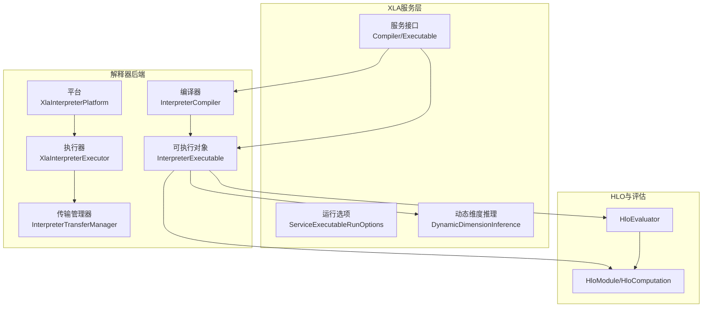
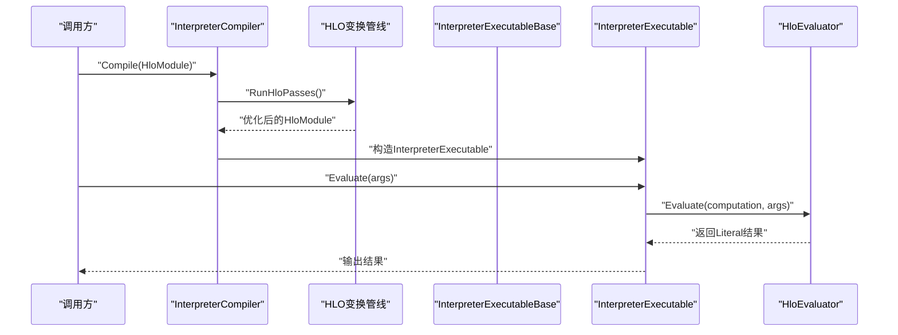
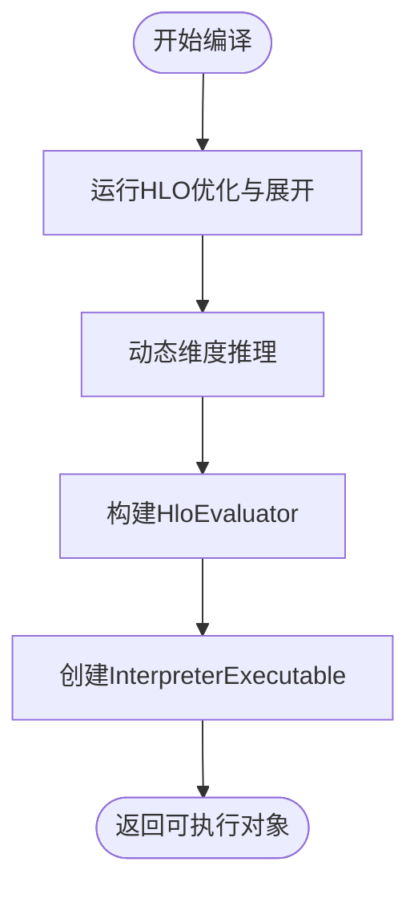
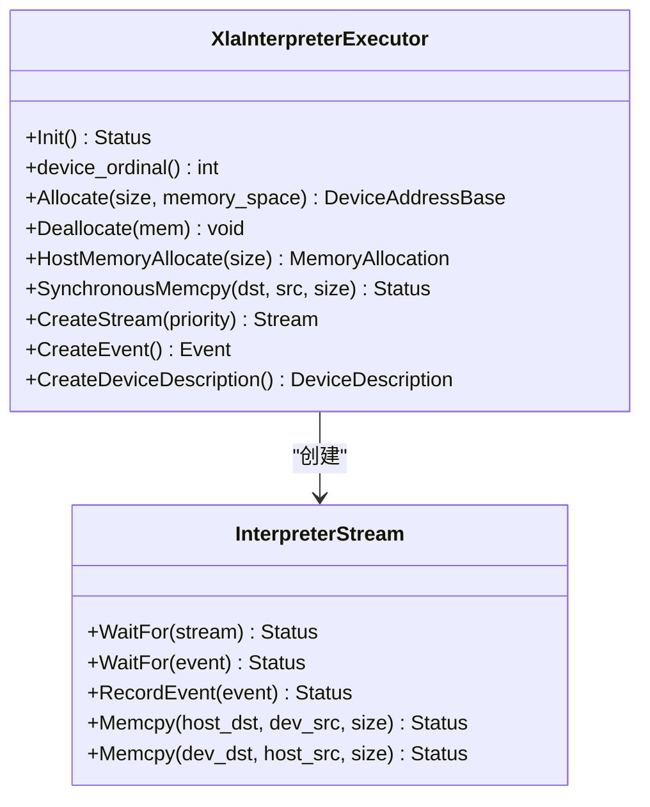
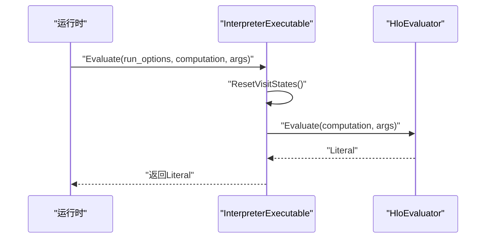
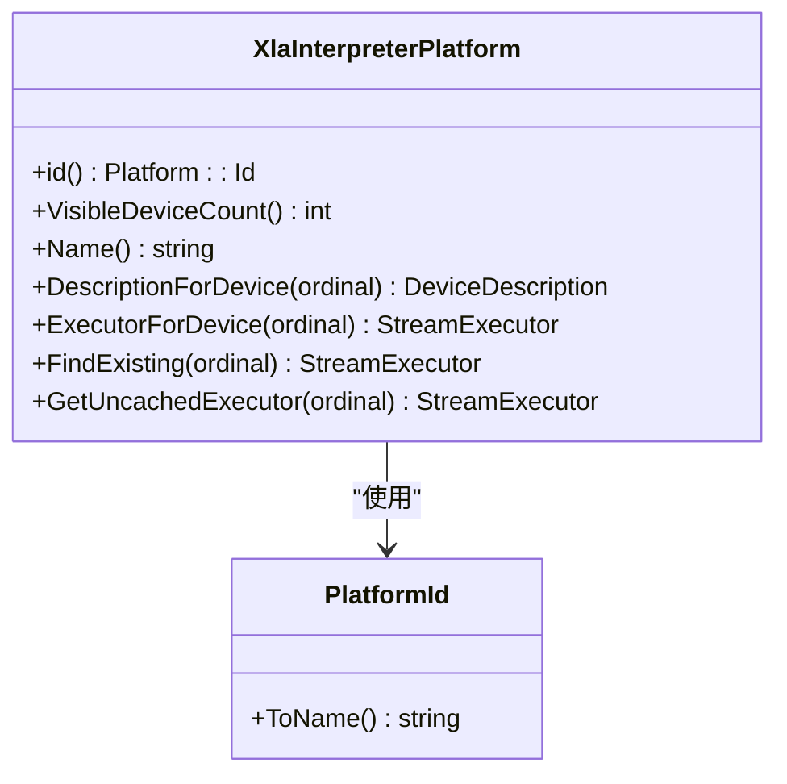
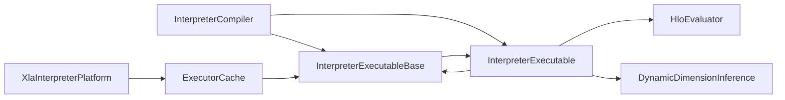

# 解释器代码生成

<cite>
**本文引用的文件**
- [xla/backends/interpreter/compiler.cc](file://xla/backends/interpreter/compiler.cc)
- [xla/backends/interpreter/compiler.h](file://xla/backends/interpreter/compiler.h)
- [xla/backends/interpreter/executor.cc](file://xla/backends/interpreter/executor.cc)
- [xla/backends/interpreter/executor.h](file://xla/backends/interpreter/executor.h)
- [xla/backends/interpreter/executable.cc](file://xla/backends/interpreter/executable.cc)
- [xla/backends/interpreter/executable.h](file://xla/backends/interpreter/executable.h)
- [xla/backends/interpreter/platform.cc](file://xla/backends/interpreter/platform.cc)
- [xla/backends/interpreter/platform.h](file://xla/backends/interpreter/platform.h)
- [xla/backends/interpreter/platform_id.cc](file://xla/backends/interpreter/platform_id.cc)
- [xla/backends/interpreter/platform_id.h](file://xla/backends/interpreter/platform_id.h)
- [xla/backends/interpreter/interpreter_transfer_manager.cc](file://xla/backends/interpreter/interpreter_transfer_manager.cc)
- [xla/backends/interpreter/interpreter_transfer_manager.h](file://xla/backends/interpreter/interpreter_transfer_manager.h)
- [xla/backends/interpreter/executable_base.cc](file://xla/backends/interpreter/executable_base.cc)
- [xla/backends/interpreter/executable_base.h](file://xla/backends/interpreter/executable_base.h)
- [xla/hlo/evaluator/hlo_evaluator.h](file://xla/hlo/evaluator/hlo_evaluator.h)
- [xla/service/dynamic_dimension_inference.h](file://xla/service/dynamic_dimension_inference.h)
- [xla/service/compiler.h](file://xla/service/compiler.h)
- [xla/service/executable.h](file://xla/service/executable.h)
- [xla/service/hlo_cost_analysis.h](file://xla/service/hlo_cost_analysis.h)
- [xla/stream_executor/platform.h](file://xla/stream_executor/platform.h)
- [xla/stream_executor/stream_executor.h](file://xla/stream_executor/stream_executor.h)
- [xla/stream_executor/platform_manager.h](file://xla/stream_executor/platform_manager.h)
- [xla/stream_executor/executor_cache.h](file://xla/stream_executor/executor_cache.h)
- [xla/stream_executor/host/host_stream.h](file://xla/stream_executor/host/host_stream.h)
- [xla/stream_executor/device_address.h](file://xla/stream_executor/device_address.h)
- [xla/stream_executor/device_description.h](file://xla/stream_executor/device_description.h)
- [xla/literal.h](file://xla/literal.h)
- [xla/shape.h](file://xla/shape.h)
- [xla/shape_util.h](file://xla/shape_util.h)
- [xla/service/service_executable_run_options.h](file://xla/service/service_executable_run_options.h)
- [xla/hlo/ir/hlo_module.h](file://xla/hlo/ir/hlo_module.h)
- [xla/hlo/ir/hlo_computation.h](file://xla/hlo/ir/hlo_computation.h)
- [xla/hlo/ir/hlo_instruction.h](file://xla/hlo/ir/hlo_instruction.h)
- [xla/hlo/pass/hlo_pass_pipeline.h](file://xla/hlo/pass/hlo_pass_pipeline.h)
- [xla/service/computation_placer.h](file://xla/service/computation_placer.h)
- [xla/service/batchnorm_expander.h](file://xla/service/batchnorm_expander.h)
- [xla/hlo/transforms/expanders/cholesky_expander.h](file://xla/hlo/transforms/expanders/cholesky_expander.h)
- [xla/hlo/transforms/expanders/dynamic_index_splitter.h](file://xla/hlo/transforms/expanders/dynamic_index_splitter.h)
- [xla/hlo/transforms/expanders/eigh_expander.h](file://xla/hlo/transforms/expanders/eigh_expander.h)
- [xla/hlo/transforms/expanders/qr_expander.h](file://xla/hlo/transforms/expanders/qr_expander.h)
- [xla/service/layout_assignment.h](file://xla/service/layout_assignment.h)
- [xla/service/topk_rewriter.h](file://xla/service/topk_rewriter.h)
- [xla/service/triangular_solve_expander.h](file://xla/service/triangular_solve_expander.h)
- [xla/service/hlo_execution_profile.h](file://xla/service/hlo_execution_profile.h)
- [xla/types.h](file://xla/types.h)
- [xla/xla_data.proto](file://xla/xla_data.proto)
- [xla/pjrt/interpreter/interpreter_client.h](file://xla/pjrt/interpreter/interpreter_client.h)
- [xla/mlir/tools/mlir_interpreter/framework/interpreter.h](file://xla/mlir/tools/mlir_interpreter/framework/interpreter.h)
- [xla/mlir/tools/mlir_interpreter/dialects/mhlo.cc](file://xla/mlir/tools/mlir_interpreter/dialects/mhlo.cc)
- [xla/mlir/tools/mlir_interpreter/dialects/arith.cc](file://xla/mlir/tools/mlir_interpreter/dialects/arith.cc)
- [xla/mlir/tools/mlir_interpreter/dialects/scf.cc](file://xla/mlir/tools/mlir_interpreter/dialects/scf.cc)
- [xla/mlir/tools/mlir_interpreter/dialects/func.cc](file://xla/mlir/tools/mlir_interpreter/dialects/func.cc)
- [xla/mlir/tools/mlir_interpreter/dialects/memref.cc](file://xla/mlir/tools/mlir_interpreter/dialects/memref.cc)
- [xla/mlir/tools/mlir_interpreter/dialects/linalg.cc](file://xla/mlir/tools/mlir_interpreter/dialects/linalg.cc)
- [xla/mlir/tools/mlir_interpreter/dialects/math.cc](file://xla/mlir/tools/mlir_interpreter/dialects/math.cc)
- [xla/mlir/tools/mlir_interpreter/dialects/complex.cc](file://xla/mlir/tools/mlir_interpreter/dialects/complex.cc)
- [xla/mlir/tools/mlir_interpreter/dialects/builtin.cc](file://xla/mlir/tools/mlir_interpreter/dialects/builtin.cc)
- [xla/mlir/tools/mlir_interpreter/dialects/bufferization.cc](file://xla/mlir/tools/mlir_interpreter/dialects/bufferization.cc)
- [xla/mlir/tools/mlir_interpreter/dialects/affine.cc](file://xla/mlir/tools/mlir_interpreter/dialects/affine.cc)
- [xla/mlir/tools/mlir_interpreter/dialects/mhlo_binary_cwise.cc](file://xla/mlir/tools/mlir_interpreter/dialects/mhlo_binary_cwise.cc)
- [xla/mlir/tools/mlir_interpreter/dialects/mhlo_unary_cwise.cc](file://xla/mlir/tools/mlir_interpreter/dialects/mhlo_unary_cwise.cc)
- [xla/mlir/tools/mlir_interpreter/dialects/comparators.h](file://xla/mlir/tools/mlir_interpreter/dialects/comparators.h)
- [xla/mlir/tools/mlir_interpreter/dialects/cwise_math.h](file://xla/mlir/tools/mlir_interpreter/dialects/cwise_math.h)
- [xla/mlir/tools/mlir_interpreter/dialects/symbol_finder.h](file://xla/mlir/tools/mlir_interpreter/dialects/symbol_finder.h)
- [xla/mlir/tools/mlir_interpreter/dialects/util.h](file://xla/mlir/tools/mlir_interpreter/dialects/util.h)
- [xla/mlir/tools/mlir_interpreter/framework/interpreter_value.h](file://xla/mlir/tools/mlir_interpreter/framework/interpreter_value.h)
- [xla/mlir/tools/mlir_interpreter/framework/interpreter_value_util.h](file://xla/mlir/tools/mlir_interpreter/framework/interpreter_value_util.h)
- [xla/mlir/tools/mlir_interpreter/framework/registration.h](file://xla/mlir/tools/mlir_interpreter/framework/registration.h)
- [xla/mlir/tools/mlir_interpreter/framework/tensor_or_memref.h](file://xla/mlir/tools/mlir_interpreter/framework/tensor_or_memref.h)
- [xla/python/ifrt/ir/program_interpreter.h](file://xla/python/ifrt/ir/program_interpreter.h)
</cite>

## 目录
1. [引言](#引言)
2. [项目结构](#项目结构)
3. [核心组件](#核心组件)
4. [架构总览](#架构总览)
5. [详细组件分析](#详细组件分析)
6. [依赖关系分析](#依赖关系分析)
7. [性能考量](#性能考量)
8. [故障排查指南](#故障排查指南)
9. [结论](#结论)
10. [附录：扩展与自定义操作指南](#附录扩展与自定义操作指南)

## 引言
本文件面向XLA解释器后端代码生成，系统性阐述解释器模式在XLA中的工作原理与实现细节。解释器后端不生成机器码，而是直接在HLO（高层次优化）层面进行求值与执行，从而实现快速原型验证、调试支持与教学演示等目标。本文将从编译器设计、执行器实现、数据流与控制流、错误处理与性能特征等方面进行全面解析，并提供扩展与自定义操作的实践指南。

## 项目结构
解释器后端位于XLA仓库的“backends/interpreter”目录下，主要由以下模块构成：
- 平台与执行器：负责设备描述、内存分配、流与事件抽象，以及与StreamExecutor接口的适配。
- 编译器：对HLO图进行必要的展开与布局优化，生成可执行对象。
- 可执行对象：封装HloEvaluator，提供运行时求值能力。
- 传输管理器：负责主机与设备之间的数据搬运。
- MLIR解释器工具链：提供基于MLIR的方言级解释器，便于在更高层语言上进行解释执行与验证。

图表来源
- [xla/backends/interpreter/platform.cc](file://xla/backends/interpreter/platform.cc#L36-L77)
- [xla/backends/interpreter/executor.h](file://xla/backends/interpreter/executor.h#L78-L160)
- [xla/backends/interpreter/compiler.cc](file://xla/backends/interpreter/compiler.cc#L119-L146)
- [xla/backends/interpreter/executable.cc](file://xla/backends/interpreter/executable.cc#L39-L59)
- [xla/service/compiler.h](file://xla/service/compiler.h)
- [xla/service/executable.h](file://xla/service/executable.h)
- [xla/hlo/evaluator/hlo_evaluator.h](file://xla/hlo/evaluator/hlo_evaluator.h)
- [xla/service/dynamic_dimension_inference.h](file://xla/service/dynamic_dimension_inference.h)

章节来源
- [xla/backends/interpreter/platform.h](file://xla/backends/interpreter/platform.h#L33-L71)
- [xla/backends/interpreter/executor.h](file://xla/backends/interpreter/executor.h#L48-L160)
- [xla/backends/interpreter/compiler.h](file://xla/backends/interpreter/compiler.h#L41-L70)
- [xla/backends/interpreter/executable.h](file://xla/backends/interpreter/executable.h#L49-L73)

## 核心组件
- 平台与执行器
  - 平台负责注册与发现解释器平台，提供设备描述与执行器获取。
  - 执行器实现StreamExecutor接口，提供主机侧的内存分配、拷贝、流与事件等能力。
- 编译器
  - 对HLO模块执行一系列展开与布局优化，生成可执行对象；不进行低级代码生成。
- 可执行对象
  - 封装HloEvaluator，提供线程安全的Evaluate接口，支持动态维度推理。
- 传输管理器
  - 负责主机与解释器设备之间的数据搬运，确保与XLA运行时一致的数据语义。
- MLIR解释器
  - 提供基于MLIR的方言级解释器，便于在更高层语言上进行解释执行与验证。

章节来源
- [xla/backends/interpreter/platform.cc](file://xla/backends/interpreter/platform.cc#L36-L77)
- [xla/backends/interpreter/executor.cc](file://xla/backends/interpreter/executor.cc#L40-L72)
- [xla/backends/interpreter/compiler.cc](file://xla/backends/interpreter/compiler.cc#L119-L146)
- [xla/backends/interpreter/executable.cc](file://xla/backends/interpreter/executable.cc#L39-L59)
- [xla/backends/interpreter/interpreter_transfer_manager.cc](file://xla/backends/interpreter/interpreter_transfer_manager.cc)

## 架构总览
解释器后端遵循XLA服务层的Compiler/Executable接口，但不生成机器码，而是在HLO层面进行解释执行。编译阶段完成必要的HLO变换与布局优化，运行阶段通过HloEvaluator对计算图进行求值。

图表来源
- [xla/backends/interpreter/compiler.cc](file://xla/backends/interpreter/compiler.cc#L119-L146)
- [xla/backends/interpreter/executable.cc](file://xla/backends/interpreter/executable.cc#L52-L59)
- [xla/hlo/evaluator/hlo_evaluator.h](file://xla/hlo/evaluator/hlo_evaluator.h)

## 详细组件分析

### 组件A：解释器编译器（InterpreterCompiler）
- 职责
  - 运行HLO优化与展开：Top-k分解、动态索引拆分、Cholesky/Qr/Eigh/TriangularSolve展开、BatchNorm展开、布局分配等。
  - 生成可执行对象：将HloModule与HloEvaluator组合为InterpreterExecutable。
  - 平台注册：向Compiler工厂与ComputationPlacer注册解释器编译器。
- 关键流程
  - RunHloPasses：对HloModule应用一系列HLO变换，确保后续解释执行的可行性。
  - RunBackend：构建HloEvaluator并生成InterpreterExecutable。
  - Compile：编译入口，串联“运行HLO变换+生成可执行对象”。

图表来源
- [xla/backends/interpreter/compiler.cc](file://xla/backends/interpreter/compiler.cc#L90-L109)
- [xla/backends/interpreter/compiler.cc](file://xla/backends/interpreter/compiler.cc#L119-L146)

章节来源
- [xla/backends/interpreter/compiler.h](file://xla/backends/interpreter/compiler.h#L41-L70)
- [xla/backends/interpreter/compiler.cc](file://xla/backends/interpreter/compiler.cc#L90-L146)

### 组件B：解释器执行器（XlaInterpreterExecutor）
- 职责
  - 实现StreamExecutor接口：提供Allocate/Deallocate、同步/异步内存拷贝、流与事件、内存分配器等。
  - 设备描述：返回解释器设备的属性（位宽、名称、内存大小、时钟频率等）。
  - 主机侧执行：所有操作均在主机内存与CPU上执行，适合调试与教学。
- 关键点
  - 内存分配：使用new/delete管理char数组，模拟设备内存。
  - 拷贝操作：基于memcpy实现主机与“设备”地址之间的数据搬运。
  - 流与事件：提供HostStream实现，部分高级特性（如事件记录）未实现。

图表来源
- [xla/backends/interpreter/executor.h](file://xla/backends/interpreter/executor.h#L78-L160)
- [xla/backends/interpreter/executor.cc](file://xla/backends/interpreter/executor.cc#L35-L72)

章节来源
- [xla/backends/interpreter/executor.h](file://xla/backends/interpreter/executor.h#L48-L160)
- [xla/backends/interpreter/executor.cc](file://xla/backends/interpreter/executor.cc#L40-L72)

### 组件C：解释器可执行对象（InterpreterExecutable）
- 职责
  - 封装HloEvaluator，提供Evaluate接口，用于在给定参数下对HloComputation进行求值。
  - 支持动态维度推理：在构造时注入DynamicDimensionInference，使求值过程考虑动态形状。
  - 线程安全：使用互斥锁保护HloEvaluator的访问。
- 关键点
  - Evaluate：重置访问状态后调用HloEvaluator.Evaluate，返回Literal结果。
  - 形状字节数计算：根据形状类型计算内存占用，支持Opaque类型。

图表来源
- [xla/backends/interpreter/executable.cc](file://xla/backends/interpreter/executable.cc#L52-L59)
- [xla/hlo/evaluator/hlo_evaluator.h](file://xla/hlo/evaluator/hlo_evaluator.h)

章节来源
- [xla/backends/interpreter/executable.h](file://xla/backends/interpreter/executable.h#L49-L73)
- [xla/backends/interpreter/executable.cc](file://xla/backends/interpreter/executable.cc#L39-L66)

### 组件D：平台与平台ID（XlaInterpreterPlatform / kXlaInterpreterPlatformId）
- 职责
  - 平台：提供平台标识、可见设备数、设备描述、执行器获取与缓存。
  - 平台ID：定义解释器平台的唯一标识符，并在平台注册时使用。
- 关键点
  - 注册：通过模块初始化函数将平台注册到PlatformManager。
  - 执行器缓存：使用ExecutorCache避免重复创建执行器实例。

图表来源
- [xla/backends/interpreter/platform.h](file://xla/backends/interpreter/platform.h#L33-L71)
- [xla/backends/interpreter/platform_id.h](file://xla/backends/interpreter/platform_id.h#L24-L24)

章节来源
- [xla/backends/interpreter/platform.cc](file://xla/backends/interpreter/platform.cc#L36-L77)
- [xla/backends/interpreter/platform_id.cc](file://xla/backends/interpreter/platform_id.cc#L22-L22)

### 组件E：传输管理器（InterpreterTransferManager）
- 职责
  - 负责主机与解释器设备之间的数据搬运，确保与XLA运行时一致的数据语义。
  - 在解释器模式下，通常将数据从主机内存复制到解释器设备内存，或反之。
- 关键点
  - 与执行器配合：利用执行器提供的内存分配与拷贝能力。
  - 与Literal/LiteralUtil协作：保证数据布局与形状的一致性。

章节来源
- [xla/backends/interpreter/interpreter_transfer_manager.h](file://xla/backends/interpreter/interpreter_transfer_manager.h)
- [xla/backends/interpreter/interpreter_transfer_manager.cc](file://xla/backends/interpreter/interpreter_transfer_manager.cc)

### 组件F：MLIR解释器工具链
- 职责
  - 提供基于MLIR的方言级解释器，支持Arith、SCF、Func、MemRef、Linalg、Math、Complex、Builtin、Bufferization、Affine、MHLO等方言的解释执行。
  - 支持二元与一元算子的通用实现，便于在更高层语言上进行验证与教学。
- 关键点
  - 框架与注册：提供解释器框架、值表示与工具、符号查找与通用辅助。
  - MHLO方言：针对稳定HLO（StableHLO）的解释执行，便于与XLA HLO生态衔接。

章节来源
- [xla/mlir/tools/mlir_interpreter/framework/interpreter.h](file://xla/mlir/tools/mlir_interpreter/framework/interpreter.h)
- [xla/mlir/tools/mlir_interpreter/dialects/mhlo.cc](file://xla/mlir/tools/mlir_interpreter/dialects/mhlo.cc)
- [xla/mlir/tools/mlir_interpreter/dialects/arith.cc](file://xla/mlir/tools/mlir_interpreter/dialects/arith.cc)
- [xla/mlir/tools/mlir_interpreter/dialects/scf.cc](file://xla/mlir/tools/mlir_interpreter/dialects/scf.cc)
- [xla/mlir/tools/mlir_interpreter/dialects/func.cc](file://xla/mlir/tools/mlir_interpreter/dialects/func.cc)
- [xla/mlir/tools/mlir_interpreter/dialects/memref.cc](file://xla/mlir/tools/mlir_interpreter/dialects/memref.cc)
- [xla/mlir/tools/mlir_interpreter/dialects/linalg.cc](file://xla/mlir/tools/mlir_interpreter/dialects/linalg.cc)
- [xla/mlir/tools/mlir_interpreter/dialects/math.cc](file://xla/mlir/tools/mlir_interpreter/dialects/math.cc)
- [xla/mlir/tools/mlir_interpreter/dialects/complex.cc](file://xla/mlir/tools/mlir_interpreter/dialects/complex.cc)
- [xla/mlir/tools/mlir_interpreter/dialects/builtin.cc](file://xla/mlir/tools/mlir_interpreter/dialects/builtin.cc)
- [xla/mlir/tools/mlir_interpreter/dialects/bufferization.cc](file://xla/mlir/tools/mlir_interpreter/dialects/bufferization.cc)
- [xla/mlir/tools/mlir_interpreter/dialects/affine.cc](file://xla/mlir/tools/mlir_interpreter/dialects/affine.cc)
- [xla/mlir/tools/mlir_interpreter/dialects/mhlo_binary_cwise.cc](file://xla/mlir/tools/mlir_interpreter/dialects/mhlo_binary_cwise.cc)
- [xla/mlir/tools/mlir_interpreter/dialects/mhlo_unary_cwise.cc](file://xla/mlir/tools/mlir_interpreter/dialects/mhlo_unary_cwise.cc)
- [xla/mlir/tools/mlir_interpreter/dialects/comparators.h](file://xla/mlir/tools/mlir_interpreter/dialects/comparators.h)
- [xla/mlir/tools/mlir_interpreter/dialects/cwise_math.h](file://xla/mlir/tools/mlir_interpreter/dialects/cwise_math.h)
- [xla/mlir/tools/mlir_interpreter/dialects/symbol_finder.h](file://xla/mlir/tools/mlir_interpreter/dialects/symbol_finder.h)
- [xla/mlir/tools/mlir_interpreter/dialects/util.h](file://xla/mlir/tools/mlir_interpreter/dialects/util.h)
- [xla/mlir/tools/mlir_interpreter/framework/interpreter_value.h](file://xla/mlir/tools/mlir_interpreter/framework/interpreter_value.h)
- [xla/mlir/tools/mlir_interpreter/framework/interpreter_value_util.h](file://xla/mlir/tools/mlir_interpreter/framework/interpreter_value_util.h)
- [xla/mlir/tools/mlir_interpreter/framework/registration.h](file://xla/mlir/tools/mlir_interpreter/framework/registration.h)
- [xla/mlir/tools/mlir_interpreter/framework/tensor_or_memref.h](file://xla/mlir/tools/mlir_interpreter/framework/tensor_or_memref.h)

## 依赖关系分析
- 组件耦合
  - InterpreterCompiler依赖HLO变换管线与HloEvaluator，生成InterpreterExecutable。
  - InterpreterExecutable依赖HloEvaluator与DynamicDimensionInference，提供Evaluate接口。
  - XlaInterpreterPlatform与XlaInterpreterExecutor共同构成解释器平台栈，后者实现StreamExecutor接口。
  - InterpreterTransferManager依赖执行器与Literal，负责数据搬运。
- 外部依赖
  - 与XLA服务层的Compiler/Executable接口保持一致，确保编译与运行时行为统一。
  - 与StreamExecutor平台体系集成，通过PlatformManager注册与发现。

图表来源
- [xla/backends/interpreter/compiler.cc](file://xla/backends/interpreter/compiler.cc#L119-L146)
- [xla/backends/interpreter/executable.cc](file://xla/backends/interpreter/executable.cc#L39-L59)
- [xla/backends/interpreter/platform.cc](file://xla/backends/interpreter/platform.cc#L53-L77)
- [xla/stream_executor/executor_cache.h](file://xla/stream_executor/executor_cache.h)

章节来源
- [xla/backends/interpreter/compiler.cc](file://xla/backends/interpreter/compiler.cc#L119-L146)
- [xla/backends/interpreter/executable.cc](file://xla/backends/interpreter/executable.cc#L39-L59)
- [xla/backends/interpreter/platform.cc](file://xla/backends/interpreter/platform.cc#L53-L77)

## 性能考量
- 解释器优势
  - 快速原型与教学：无需生成机器码，编译与运行开销小，便于理解XLA计算图。
  - 调试友好：可直接在HLO层面观察中间结果，便于定位问题。
- 性能劣势
  - 无底层优化：不进行指令级优化与并行调度，吞吐量与延迟不及编译器后端。
  - 主机侧执行：所有操作在CPU与主机内存上执行，无法发挥专用硬件加速。
- 适用场景
  - 原型验证、算法教学、小规模测试与调试。
  - 需要与HLO生态深度交互的场景（如自定义HLO变换与验证）。

## 故障排查指南
- 常见问题
  - 自定义调用未注册：解释器在求值时通过全局注册表查找自定义调用目标，若未注册会报错。可通过注册表机制补充目标函数。
  - 动态维度不支持：某些动态维度操作在解释器中可能受限，需检查DynamicDimensionInference配置。
  - 内存不足：解释器使用主机内存模拟设备内存，注意内存上限与拷贝开销。
- 排查步骤
  - 启用调试日志：在编译与运行阶段查看VLOG输出，定位HLO变换与求值路径。
  - 检查平台与执行器初始化：确认平台已注册且执行器初始化成功。
  - 核对HLO变换顺序：确保Top-k分解、动态索引拆分等变换按正确顺序执行。

章节来源
- [xla/backends/interpreter/compiler.cc](file://xla/backends/interpreter/compiler.cc#L62-L86)
- [xla/backends/interpreter/platform.cc](file://xla/backends/interpreter/platform.cc#L64-L77)

## 结论
解释器后端通过在HLO层面直接求值，实现了无需生成机器码即可执行XLA计算图的能力。它在调试、教学与原型验证方面具有显著优势，但在性能上无法与编译器后端相比。结合MLIR解释器工具链，开发者可以在更高层语言上进行验证与教学，进一步提升开发效率与可理解性。

## 附录：扩展与自定义操作指南
- 自定义HLO操作
  - 在HLO层添加新操作后，需在解释器中为其提供求值实现，或确保变换管线将其展开为解释器支持的操作序列。
  - 若涉及自定义调用，需在全局注册表中注册目标函数，以便解释器在求值时调用。
- 扩展解释器功能
  - 可在InterpreterExecutable中增加新的求值钩子或统计信息收集，以支持更丰富的调试与分析需求。
  - 可扩展InterpreterTransferManager以支持更多数据布局与形状的搬运策略。
- 与编译器后端的对比与选择
  - 选择解释器：需要快速验证、教学演示、小规模调试或与HLO生态深度交互。
  - 选择编译器后端：追求高性能、大规模部署、生产环境下的吞吐与延迟要求较高。
- 实践建议
  - 先用解释器验证逻辑正确性，再迁移到编译器后端进行性能优化。
  - 使用MLIR解释器工具链进行高层语言的验证与教学，降低学习成本。