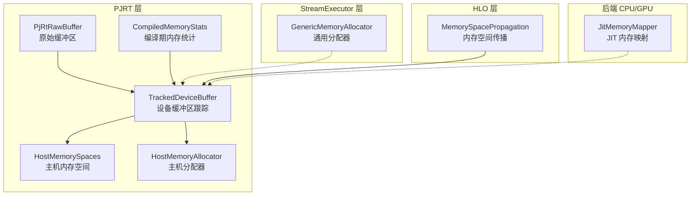
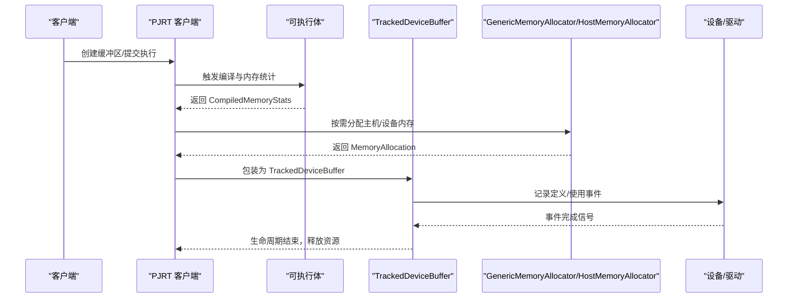
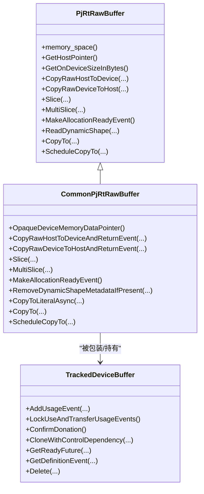
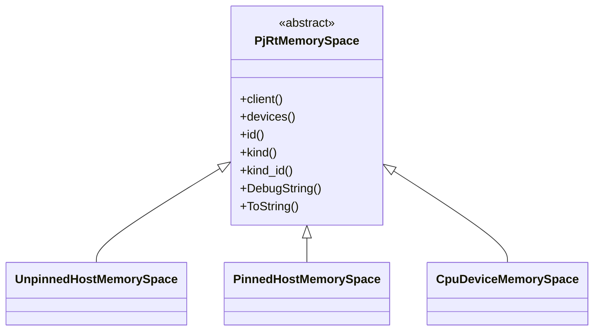
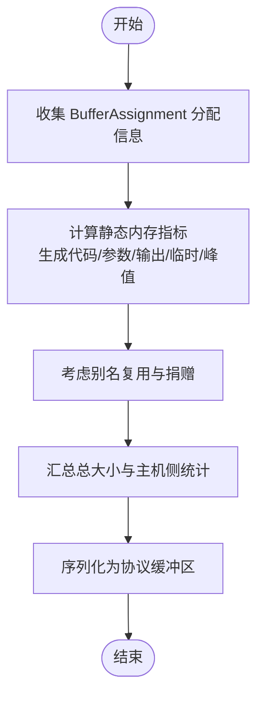
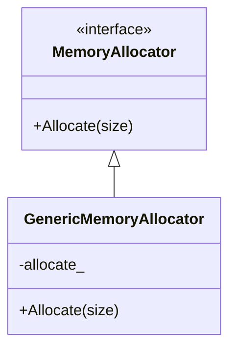
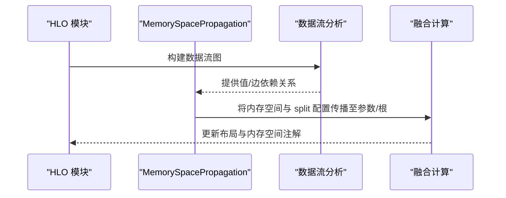
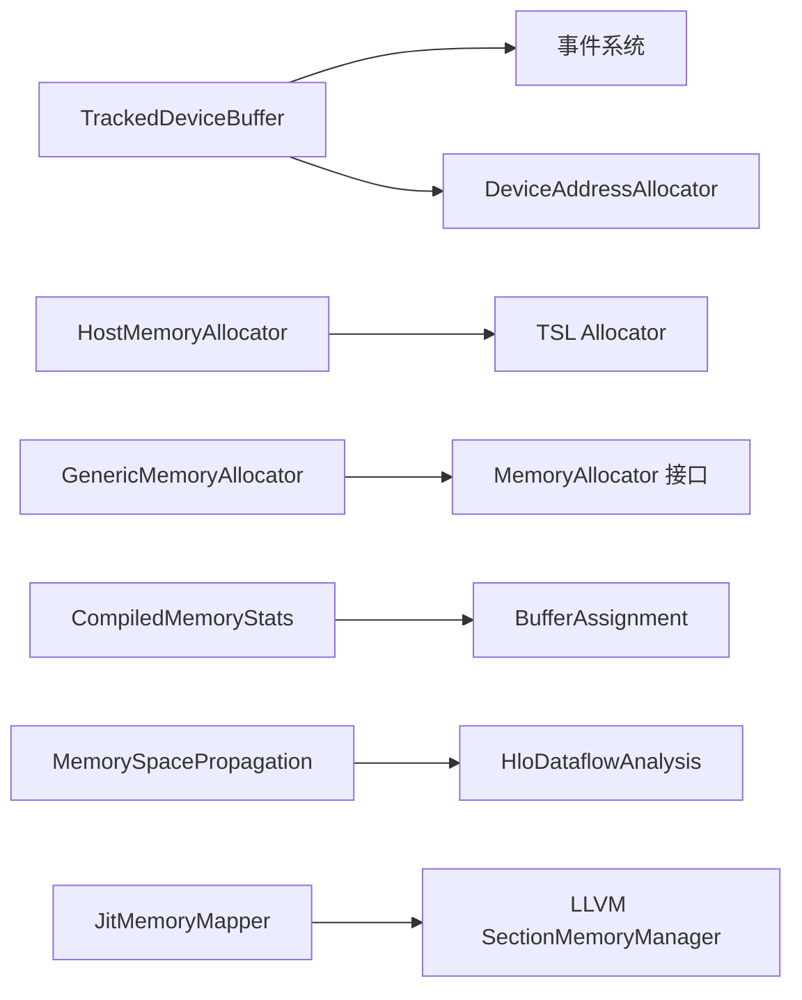

# 内存管理

<cite>
**本文引用的文件**
- [xla/pjrt/raw_buffer.h](file://xla/pjrt/raw_buffer.h)
- [xla/pjrt/tracked_device_buffer.h](file://xla/pjrt/tracked_device_buffer.h)
- [xla/pjrt/host_memory_allocator.h](file://xla/pjrt/host_memory_allocator.h)
- [xla/pjrt/compiled_memory_stats.h](file://xla/pjrt/compiled_memory_stats.h)
- [xla/pjrt/host_memory_spaces.h](file://xla/pjrt/host_memory_spaces.h)
- [xla/backends/cpu/codegen/jit_memory_mapper.h](file://xla/backends/cpu/codegen/jit_memory_mapper.h)
- [xla/stream_executor/generic_memory_allocator.h](file://xla/stream_executor/generic_memory_allocator.h)
- [xla/hlo/transforms/memory_space_propagation.h](file://xla/hlo/transforms/memory_space_propagation.h)
</cite>

## 目录
1. [引言](#引言)
2. [项目结构](#项目结构)
3. [核心组件](#核心组件)
4. [架构总览](#架构总览)
5. [组件详解](#组件详解)
6. [依赖关系分析](#依赖关系分析)
7. [性能考量](#性能考量)
8. [故障排查指南](#故障排查指南)
9. [结论](#结论)
10. [附录](#附录)

## 引言
本文件系统性梳理 XLA 在 PJRT/PJRT-StreamExecutor 层面的内存管理设计与实现，重点覆盖以下方面：
- 缓冲区分配策略：静态分配（编译期）与动态分配（运行期）的权衡与协同
- 缓冲区调度与存储空间管理：主机/设备内存空间划分、可见性与一致性
- 堆模拟器与内存使用预测：如何通过编译期统计与运行期事件进行内存占用预测
- 内存池、垃圾回收与泄漏检测：基于引用计数、事件序列化与生命周期管理
- 与编译优化的结合：内存空间传播、别名与临时内存复用以降低峰值占用

## 项目结构
XLA 的内存管理横跨多个子系统：
- PJRT 层：缓冲区抽象、跟踪与生命周期管理、主机/设备内存空间
- StreamExecutor 层：底层分配器接口与通用实现
- HLO 层：内存空间传播等编译期优化
- 后端 CPU/GPU：特定平台的内存映射与分配器适配

**图示来源**
- [xla/pjrt/raw_buffer.h](file://xla/pjrt/raw_buffer.h#L40-L198)
- [xla/pjrt/tracked_device_buffer.h](file://xla/pjrt/tracked_device_buffer.h#L102-L230)
- [xla/pjrt/host_memory_spaces.h](file://xla/pjrt/host_memory_spaces.h#L30-L132)
- [xla/pjrt/host_memory_allocator.h](file://xla/pjrt/host_memory_allocator.h#L32-L88)
- [xla/pjrt/compiled_memory_stats.h](file://xla/pjrt/compiled_memory_stats.h#L28-L66)
- [xla/stream_executor/generic_memory_allocator.h](file://xla/stream_executor/generic_memory_allocator.h#L30-L53)
- [xla/hlo/transforms/memory_space_propagation.h](file://xla/hlo/transforms/memory_space_propagation.h#L33-L67)
- [xla/backends/cpu/codegen/jit_memory_mapper.h](file://xla/backends/cpu/codegen/jit_memory_mapper.h#L26-L58)

**章节来源**
- [xla/pjrt/raw_buffer.h](file://xla/pjrt/raw_buffer.h#L1-L198)
- [xla/pjrt/tracked_device_buffer.h](file://xla/pjrt/tracked_device_buffer.h#L1-L230)
- [xla/pjrt/host_memory_spaces.h](file://xla/pjrt/host_memory_spaces.h#L1-L132)
- [xla/pjrt/host_memory_allocator.h](file://xla/pjrt/host_memory_allocator.h#L1-L88)
- [xla/pjrt/compiled_memory_stats.h](file://xla/pjrt/compiled_memory_stats.h#L1-L66)
- [xla/stream_executor/generic_memory_allocator.h](file://xla/stream_executor/generic_memory_allocator.h#L1-L53)
- [xla/hlo/transforms/memory_space_propagation.h](file://xla/hlo/transforms/memory_space_propagation.h#L1-L67)
- [xla/backends/cpu/codegen/jit_memory_mapper.h](file://xla/backends/cpu/codegen/jit_memory_mapper.h#L1-L58)

## 核心组件
- 原始缓冲区与设备缓冲区跟踪
  - PjRtRawBuffer：面向底层驱动的“不安全”直接访问接口，支持切片、批量切片、主机/设备拷贝、动态形状读取等
  - TrackedDeviceBuffer：对设备缓冲区的生命周期与流事件进行跟踪，确保定义/使用事件满足时序约束，支持捐赠、克隆与控制依赖
- 主机内存空间与分配器
  - HostMemorySpaces：定义 unpinned_host/pinned_host/device 等内存空间，用于区分 DMA 可见性与可直接访问性
  - HostMemoryAllocator：主机侧内存分配接口及基础实现，支持 NUMA 提示与映射/取消映射回调
- 编译期内存统计
  - CompiledMemoryStats：汇总生成代码、参数、输出、临时、峰值等静态内存指标，并支持从分配结果回填统计
- 分配器与内存映射
  - GenericMemoryAllocator：以可调用对象封装 MemoryAllocator 接口，便于注入自定义分配策略
  - JIT 内存映射：CPU 后端注册自定义内存映射器，支持按区域命名的内存分配与映射
- 内存空间传播
  - MemorySpacePropagation：将布局中指定的内存空间传播到融合计算，保证数据布局与内存空间一致

**章节来源**
- [xla/pjrt/raw_buffer.h](file://xla/pjrt/raw_buffer.h#L40-L198)
- [xla/pjrt/tracked_device_buffer.h](file://xla/pjrt/tracked_device_buffer.h#L102-L230)
- [xla/pjrt/host_memory_spaces.h](file://xla/pjrt/host_memory_spaces.h#L30-L132)
- [xla/pjrt/host_memory_allocator.h](file://xla/pjrt/host_memory_allocator.h#L32-L88)
- [xla/pjrt/compiled_memory_stats.h](file://xla/pjrt/compiled_memory_stats.h#L28-L66)
- [xla/stream_executor/generic_memory_allocator.h](file://xla/stream_executor/generic_memory_allocator.h#L30-L53)
- [xla/backends/cpu/codegen/jit_memory_mapper.h](file://xla/backends/cpu/codegen/jit_memory_mapper.h#L26-L58)
- [xla/hlo/transforms/memory_space_propagation.h](file://xla/hlo/transforms/memory_space_propagation.h#L33-L67)

## 架构总览
XLA 内存管理采用“编译期规划 + 运行期跟踪”的双轨策略：
- 编译期：通过 HLO 阶段（如内存空间传播）确定数据布局与内存空间；通过 BufferAssignment 生成静态分配方案；通过 CompiledMemoryStats 输出峰值与总量预估
- 运行期：通过 TrackedDeviceBuffer/TrackedHostBuffer 跟踪缓冲区定义/使用事件，确保多流并发下的正确时序；通过 HostMemoryAllocator/JitMemoryMapper/GenericMemoryAllocator 提供底层分配能力

**图示来源**
- [xla/pjrt/tracked_device_buffer.h](file://xla/pjrt/tracked_device_buffer.h#L102-L230)
- [xla/pjrt/compiled_memory_stats.h](file://xla/pjrt/compiled_memory_stats.h#L28-L66)
- [xla/stream_executor/generic_memory_allocator.h](file://xla/stream_executor/generic_memory_allocator.h#L30-L53)
- [xla/pjrt/host_memory_allocator.h](file://xla/pjrt/host_memory_allocator.h#L32-L88)

## 组件详解

### 原始缓冲区与设备缓冲区跟踪
- PjRtRawBuffer
  - 支持切片与批量切片，返回新的 RawBuffer 引用
  - 提供主机/设备拷贝接口，返回 Future 或设备事件，便于与驱动异步模型对接
  - 支持动态形状读取与直接线性化到 Literal 的异步路径
- TrackedDeviceBuffer
  - 维护定义事件与使用事件集合，确保在多流并发下不会过早释放
  - 支持“捐赠”语义：在执行前标记可捐赠，成功后避免重复释放
  - 提供克隆并附加控制依赖的能力，用于构造复杂的时序关系

**图示来源**
- [xla/pjrt/raw_buffer.h](file://xla/pjrt/raw_buffer.h#L40-L198)
- [xla/pjrt/tracked_device_buffer.h](file://xla/pjrt/tracked_device_buffer.h#L102-L230)

**章节来源**
- [xla/pjrt/raw_buffer.h](file://xla/pjrt/raw_buffer.h#L40-L198)
- [xla/pjrt/tracked_device_buffer.h](file://xla/pjrt/tracked_device_buffer.h#L102-L230)

### 主机内存空间与分配器
- 主机内存空间
  - UnpinnedHostMemorySpace：普通主机内存，不可直连设备地址空间
  - PinnedHostMemorySpace：可映射到设备虚拟地址空间，支持 DMA
  - CpuDeviceMemorySpace：CPU 设备视角的“默认”内存空间
- 主机分配器
  - HostMemoryAllocator 抽象了对齐、NUMA 提示与映射/取消映射回调
  - BasicHostMemoryAllocator 基于 TSL Allocator 实现，提供 OwnedPtr 语义

**图示来源**
- [xla/pjrt/host_memory_spaces.h](file://xla/pjrt/host_memory_spaces.h#L30-L132)

**章节来源**
- [xla/pjrt/host_memory_spaces.h](file://xla/pjrt/host_memory_spaces.h#L30-L132)
- [xla/pjrt/host_memory_allocator.h](file://xla/pjrt/host_memory_allocator.h#L32-L88)

### 编译期内存统计与预测
- CompiledMemoryStats
  - 汇总生成代码、参数、输出、临时、峰值等静态内存指标
  - 支持从 BufferAssignment 回填统计，便于在编译阶段评估内存占用
  - 提供序列化/反序列化与调试字符串，便于工具链集成

**图示来源**
- [xla/pjrt/compiled_memory_stats.h](file://xla/pjrt/compiled_memory_stats.h#L28-L66)

**章节来源**
- [xla/pjrt/compiled_memory_stats.h](file://xla/pjrt/compiled_memory_stats.h#L28-L66)

### 分配器与内存映射
- GenericMemoryAllocator
  - 将任意可调用对象包装为 MemoryAllocator，便于注入自定义分配策略或测试桩
- JIT 内存映射（CPU）
  - 注册按区域命名的内存映射器，支持在 JIT 生成代码时选择合适的内存区域

**图示来源**
- [xla/stream_executor/generic_memory_allocator.h](file://xla/stream_executor/generic_memory_allocator.h#L30-L53)

**章节来源**
- [xla/stream_executor/generic_memory_allocator.h](file://xla/stream_executor/generic_memory_allocator.h#L30-L53)
- [xla/backends/cpu/codegen/jit_memory_mapper.h](file://xla/backends/cpu/codegen/jit_memory_mapper.h#L26-L58)

### 内存空间传播与布局优化
- MemorySpacePropagation
  - 将布局中指定的内存空间传播到融合计算，确保数据布局与内存空间一致
  - 通过数据流分析在融合参数与根之间传播 split 配置，减少跨空间传输

**图示来源**
- [xla/hlo/transforms/memory_space_propagation.h](file://xla/hlo/transforms/memory_space_propagation.h#L33-L67)

**章节来源**
- [xla/hlo/transforms/memory_space_propagation.h](file://xla/hlo/transforms/memory_space_propagation.h#L33-L67)

## 依赖关系分析
- 组件耦合
  - TrackedDeviceBuffer 依赖事件系统与设备地址分配器，确保生命周期与事件时序正确
  - HostMemoryAllocator 与 GenericMemoryAllocator 为上层提供统一分配接口，便于替换与测试
  - CompiledMemoryStats 与 BufferAssignment 解耦，仅在编译阶段使用
- 外部依赖
  - StreamExecutor 提供底层分配器接口与通用实现
  - LLVM JIT 提供 SectionMemoryManager 的内存映射扩展点

**图示来源**
- [xla/pjrt/tracked_device_buffer.h](file://xla/pjrt/tracked_device_buffer.h#L102-L230)
- [xla/pjrt/host_memory_allocator.h](file://xla/pjrt/host_memory_allocator.h#L32-L88)
- [xla/stream_executor/generic_memory_allocator.h](file://xla/stream_executor/generic_memory_allocator.h#L30-L53)
- [xla/pjrt/compiled_memory_stats.h](file://xla/pjrt/compiled_memory_stats.h#L28-L66)
- [xla/hlo/transforms/memory_space_propagation.h](file://xla/hlo/transforms/memory_space_propagation.h#L33-L67)
- [xla/backends/cpu/codegen/jit_memory_mapper.h](file://xla/backends/cpu/codegen/jit_memory_mapper.h#L26-L58)

**章节来源**
- [xla/pjrt/tracked_device_buffer.h](file://xla/pjrt/tracked_device_buffer.h#L102-L230)
- [xla/pjrt/host_memory_allocator.h](file://xla/pjrt/host_memory_allocator.h#L32-L88)
- [xla/stream_executor/generic_memory_allocator.h](file://xla/stream_executor/generic_memory_allocator.h#L30-L53)
- [xla/pjrt/compiled_memory_stats.h](file://xla/pjrt/compiled_memory_stats.h#L28-L66)
- [xla/hlo/transforms/memory_space_propagation.h](file://xla/hlo/transforms/memory_space_propagation.h#L33-L67)
- [xla/backends/cpu/codegen/jit_memory_mapper.h](file://xla/backends/cpu/codegen/jit_memory_mapper.h#L26-L58)

## 性能考量
- 静态分配 vs 动态分配的权衡
  - 静态分配：通过编译期统计与 BufferAssignment 确定峰值与总量，有利于提前规划设备内存与避免 OOM
  - 动态分配：在运行期根据实际负载与事件时序进行按需分配，提升资源利用率但增加调度复杂度
- 数据布局优化
  - 使用 MemorySpacePropagation 将内存空间与布局绑定，减少跨空间传输
  - 利用别名与捐赠机制复用参数/输出内存，降低临时内存峰值
- 并发与事件时序
  - 通过 TrackedDeviceBuffer 的定义/使用事件集合，确保多流并发下的正确释放时机
- NUMA 与映射
  - HostMemoryAllocator 支持 NUMA 提示，配合 PinnedHostMemorySpace 提升 DMA 效率

[本节为通用指导，无需列出具体文件来源]

## 故障排查指南
- OOM 与内存不足
  - 使用 CompiledMemoryStats 对比峰值与总量，确认是否超出设备内存
  - 检查是否存在未使用的临时缓冲区未及时释放
- 事件时序问题
  - 确认 TrackedDeviceBuffer 的定义/使用事件是否正确记录与等待
  - 若出现竞态，检查是否有在事件完成前释放缓冲区的行为
- 主机/设备拷贝异常
  - 核对 PjRtRawBuffer 的切片偏移与对齐要求
  - 确保 HostMemorySpaces 的选择与 DMA 可见性匹配
- 分配失败
  - 检查 HostMemoryAllocator 的映射/取消映射回调是否正确
  - 对于 JIT 代码，确认 JitMemoryMapper 的区域命名与内存映射器注册

**章节来源**
- [xla/pjrt/compiled_memory_stats.h](file://xla/pjrt/compiled_memory_stats.h#L28-L66)
- [xla/pjrt/tracked_device_buffer.h](file://xla/pjrt/tracked_device_buffer.h#L102-L230)
- [xla/pjrt/raw_buffer.h](file://xla/pjrt/raw_buffer.h#L40-L198)
- [xla/pjrt/host_memory_spaces.h](file://xla/pjrt/host_memory_spaces.h#L30-L132)
- [xla/pjrt/host_memory_allocator.h](file://xla/pjrt/host_memory_allocator.h#L32-L88)
- [xla/backends/cpu/codegen/jit_memory_mapper.h](file://xla/backends/cpu/codegen/jit_memory_mapper.h#L26-L58)

## 结论
XLA 的内存管理通过“编译期规划 + 运行期跟踪”的双轨机制，在保证正确性的前提下最大化内存效率：
- 编译期利用 HLO 优化与 BufferAssignment 生成静态分配方案，并通过 CompiledMemoryStats 提供内存预测
- 运行期通过事件与时序跟踪确保生命周期安全，结合主机/设备内存空间与分配器实现高效的数据布局与传输
- 通过别名、捐赠与内存空间传播等技术，显著降低峰值内存占用，提升整体吞吐

[本节为总结性内容，无需列出具体文件来源]

## 附录
- 关键流程参考
  - 编译期内存统计回填：[xla/pjrt/compiled_memory_stats.h](file://xla/pjrt/compiled_memory_stats.h#L59-L61)
  - 设备缓冲区跟踪与事件：[xla/pjrt/tracked_device_buffer.h](file://xla/pjrt/tracked_device_buffer.h#L137-L200)
  - 主机内存分配与映射：[xla/pjrt/host_memory_allocator.h](file://xla/pjrt/host_memory_allocator.h#L32-L88)
  - 内存空间传播：[xla/hlo/transforms/memory_space_propagation.h](file://xla/hlo/transforms/memory_space_propagation.h#L33-L67)

[本节为补充说明，无需列出具体文件来源]