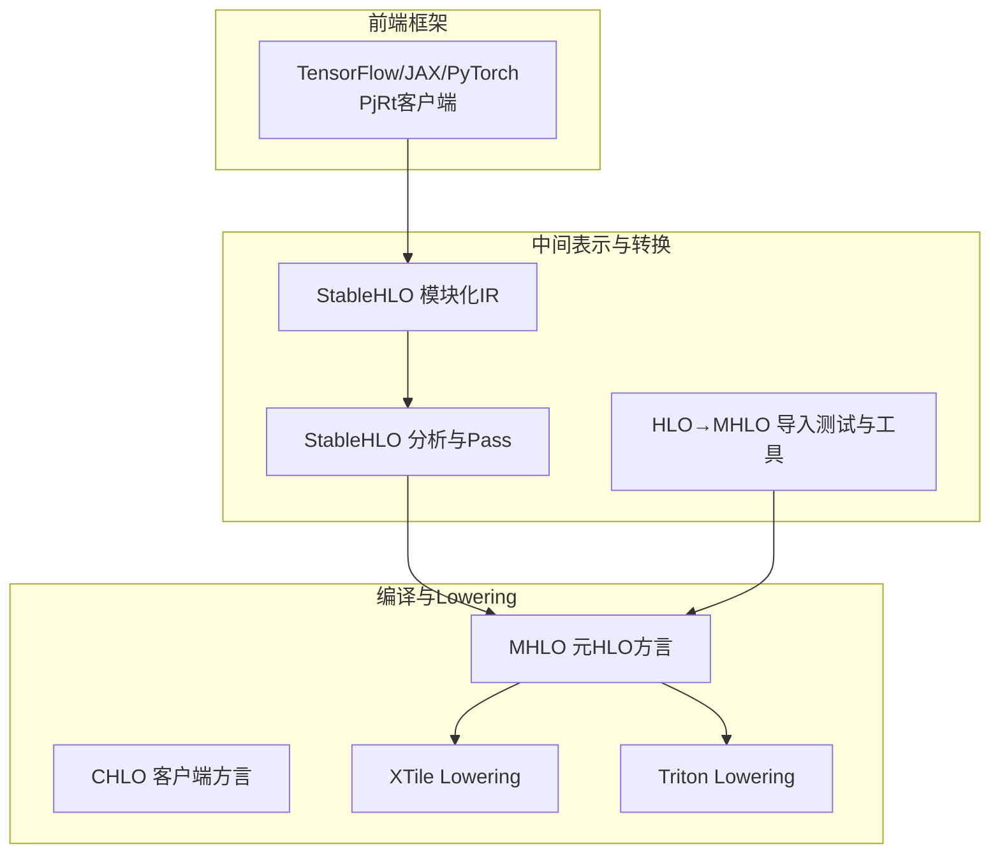
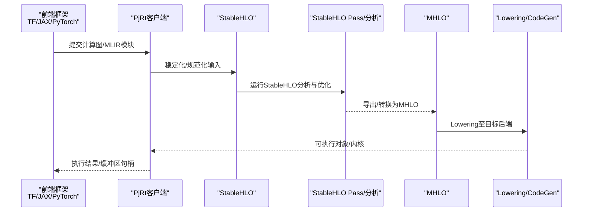
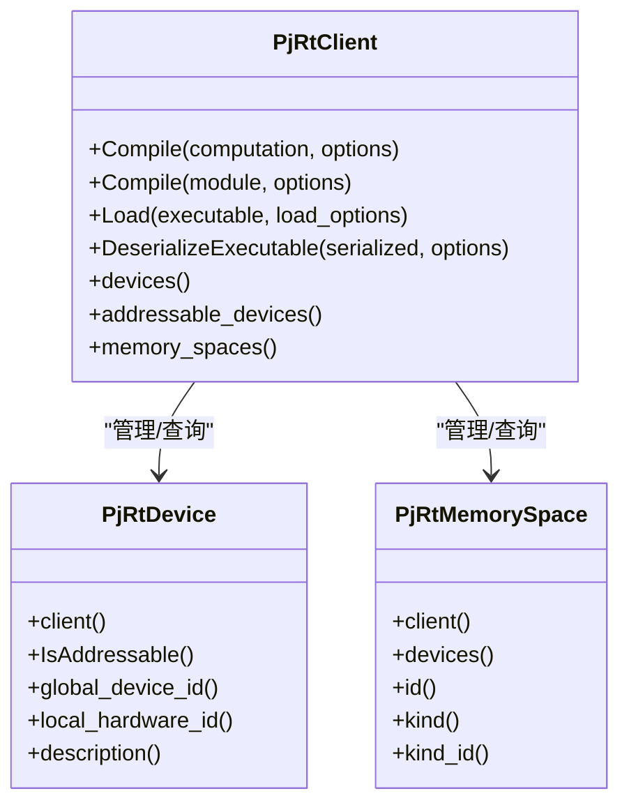
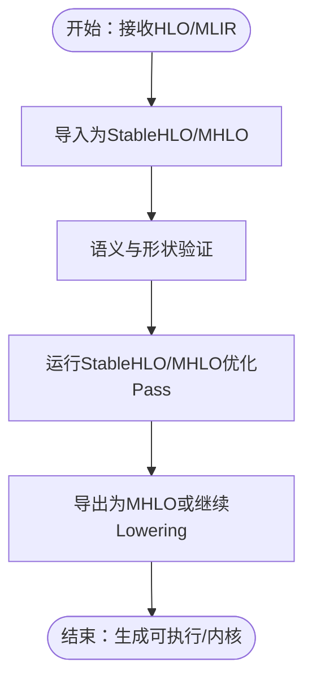
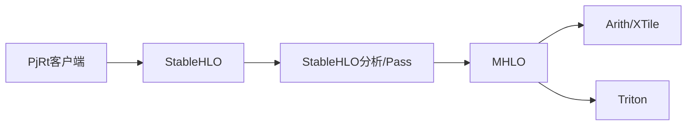

# 前端接口层

<cite>
**本文引用的文件**
- [xla\mlir_hlo\README.md](file://xla\mlir_hlo\README.md)
- [xla\mlir_hlo\stablehlo_ext\README.md](file://xla\mlir_hlo\stablehlo_ext\README.md)
- [xla\hlo\translate\hlo_to_mhlo\tests\import_bounded_dynamism_stablehlo.mlir](file://xla\hlo\translate\hlo_to_mhlo\tests\import_bounded_dynamism_stablehlo.mlir)
- [xla\examples\axpy\stablehlo_axpy.mlir](file://xla\examples\axpy\stablehlo_axpy.mlir)
- [xla\codegen\xtile\ir\transforms\lower_stablehlo_to_xtile.cc](file://xla\codegen\xtile\ir\transforms\lower_stablehlo_to_xtile.cc)
- [xla\codegen\xtile\ir\transforms\lower_stablehlo_to_arith.cc](file://xla\codegen\xtile\ir\transforms\lower_stablehlo_to_arith.cc)
- [xla\backends\gpu\codegen\triton\transforms\stablehlo_lower_to_triton.cc](file://xla\backends\gpu\codegen\triton\transforms\stablehlo_lower_to_triton.cc)
- [xla\hlo\experimental\auto_sharding\auto_sharding_stablehlo_pass.cc](file://xla\hlo\experimental\auto_sharding\auto_sharding_stablehlo_pass.cc)
- [xla\hlo\experimental\auto_sharding\stablehlo_utils.cc](file://xla\hlo\experimental\auto_sharding\stablehlo_utils.cc)
- [xla\hlo\analysis\stablehlo_indexing_analysis.cc](file://xla\hlo\analysis\stablehlo_indexing_analysis.cc)
- [xla\pjrt\pjrt_client.h](file://xla\pjrt\pjrt_client.h)
- [xla\pjrt\pjrt_api.h](file://xla\pjrt\pjrt_api.h)
- [xla\pjrt\tf_pjrt_client.cc](file://xla\pjrt\tf_pjrt_client.cc)
- [xla\hlo\translate\hlo_to_mhlo\tests\import_emit_stablehlo.hlo](file://xla\hlo\translate\hlo_to_mhlo\tests\import_emit_stablehlo.hlo)
- [third_party\stablehlo\BUILD.bazel](file://third_party\stablehlo\BUILD.bazel)
</cite>

## 目录
1. [引言](#引言)
2. [项目结构](#项目结构)
3. [核心组件](#核心组件)
4. [架构总览](#架构总览)
5. [详细组件分析](#详细组件分析)
6. [依赖关系分析](#依赖关系分析)
7. [性能考量](#性能考量)
8. [故障排查指南](#故障排查指南)
9. [结论](#结论)
10. [附录](#附录)

## 引言
本文件面向XLA前端接口层，系统阐述XLA如何通过StableHLO作为统一中间表示，支撑多前端框架（如PyTorch、TensorFlow、JAX）的计算图输入，并给出从HLO到MHLO的转换流程与语义保持策略。文档还总结了前端接口的设计原则、StableHLO方言特性与版本管理策略，以及如何降低新框架接入成本。

## 项目结构
前端接口层围绕“前端框架 → StableHLO → MHLO/CHLO → 编译器优化与Lowering”的流水线组织，关键位置如下：
- 前端适配：通过PjRt客户端抽象对接不同框架（例如TF PjRt客户端）
- 中间表示：StableHLO作为统一IR，提供稳定、可演进的方言能力
- 转换与优化：HLO到MHLO导入、StableHLO分析与Pass、自动分片等
- 后端Lowering：将StableHLO/CHLO/MHLO映射到具体硬件代码生成路径

图表来源
- [xla\pjrt\pjrt_client.h](file://xla\pjrt\pjrt_client.h#L509-L680)
- [xla\mlir_hlo\README.md](file://xla\mlir_hlo\README.md#L106-L119)
- [xla\hlo\translate\hlo_to_mhlo\tests\import_emit_stablehlo.hlo](file://xla\hlo\translate\hlo_to_mhlo\tests\import_emit_stablehlo.hlo)
- [xla\examples\axpy\stablehlo_axpy.mlir](file://xla\examples\axpy\stablehlo_axpy.mlir)

章节来源
- [xla\mlir_hlo\README.md](file://xla\mlir_hlo\README.md#L106-L119)
- [xla\pjrt\pjrt_client.h](file://xla\pjrt\pjrt_client.h#L509-L680)

## 核心组件
- PjRt客户端抽象：统一设备、内存空间、编译/加载、序列化/反序列化等接口，屏蔽不同后端差异
- StableHLO模块：提供稳定、可扩展的中间表示，包含XLA特定扩展Pass与Lowering
- HLO→MHLO导入：将历史HLO导入为StableHLO/MHLO，保证语义一致性
- 分析与Pass：StableHLO索引分析、自动分片Pass等，支撑跨设备与形状动态性
- Lowering链路：StableHLO到Arith、XTile、Triton等目标后端

章节来源
- [xla\pjrt\pjrt_client.h](file://xla\pjrt\pjrt_client.h#L509-L680)
- [xla\mlir_hlo\stablehlo_ext\README.md](file://xla\mlir_hlo\stablehlo_ext\README.md#L1-L10)
- [xla\hlo\translate\hlo_to_mhlo\tests\import_bounded_dynamism_stablehlo.mlir](file://xla\hlo\translate\hlo_to_mhlo\tests\import_bounded_dynamism_stablehlo.mlir)

## 架构总览
下图展示从前端到后端的关键调用与数据流：

图表来源
- [xla\pjrt\pjrt_client.h](file://xla\pjrt\pjrt_client.h#L634-L656)
- [xla\mlir_hlo\stablehlo_ext\README.md](file://xla\mlir_hlo\stablehlo_ext\README.md#L1-L10)
- [xla\codegen\xtile\ir\transforms\lower_stablehlo_to_xtile.cc](file://xla\codegen\xtile\ir\transforms\lower_stablehlo_to_xtile.cc)
- [xla\backends\gpu\codegen\triton\transforms\stablehlo_lower_to_triton.cc](file://xla\backends\gpu\codegen\triton\transforms\stablehlo_lower_to_triton.cc)

## 详细组件分析

### 组件A：前端接口与PjRt客户端
- 设计原则
  - 平台无关：通过PjRt抽象屏蔽设备/平台差异
  - 统一编译入口：支持XlaComputation与MLIR Module两种输入
  - 生命周期管理：确保客户端存活期间运行时对象有效
- 关键能力
  - 设备/内存空间查询与选择
  - 编译、加载、序列化/反序列化
  - 跨主机/跨设备传输与异步事件
- 与前端框架的关系
  - TF通过专用PjRt客户端桥接
  - 其他框架遵循PjRt Plugin机制注册与初始化

图表来源
- [xla\pjrt\pjrt_client.h](file://xla\pjrt\pjrt_client.h#L509-L680)
- [xla\pjrt\pjrt_client.h](file://xla\pjrt\pjrt_client.h#L114-L265)
- [xla\pjrt\pjrt_client.h](file://xla\pjrt\pjrt_client.h#L84-L112)

章节来源
- [xla\pjrt\pjrt_client.h](file://xla\pjrt\pjrt_client.h#L509-L680)
- [xla\pjrt\pjrt_api.h](file://xla\pjrt\pjrt_api.h#L27-L51)
- [xla\pjrt\tf_pjrt_client.cc](file://xla\pjrt\tf_pjrt_client.cc)

### 组件B：StableHLO作为统一中间表示
- 方言定位
  - CHLO：更贴近前端的客户端方言，支持隐式广播等
  - MHLO：元HLO方言，支持动态形状与更多实验性算子
  - StableHLO：稳定、可演进的中间表示，作为跨框架统一载体
- 特性与版本管理
  - 以StableHLO为核心，配合XLA扩展Pass，确保与后端兼容
  - 通过第三方仓库与构建脚本集成StableHLO生态
- 与前端框架的映射
  - 不同前端将计算图映射到StableHLO，再进入MHLO优化链

章节来源
- [xla\mlir_hlo\README.md](file://xla\mlir_hlo\README.md#L106-L119)
- [xla\mlir_hlo\stablehlo_ext\README.md](file://xla\mlir_hlo\stablehlo_ext\README.md#L1-L10)
- [third_party\stablehlo\BUILD.bazel](file://third_party\stablehlo\BUILD.bazel)

### 组件C：HLO到MHLO的转换与语义保持
- 目标
  - 将历史HLO导入为StableHLO/MHLO，保留运算语义与形状约束
- 流程要点
  - 导入测试覆盖边界动态性等场景
  - 通过导入工具与测试样例验证转换正确性
- 复杂度与可靠性
  - 转换复杂度主要受图规模与形状动态性影响
  - 通过测试矩阵保障在典型模型上的稳定性

图表来源
- [xla\hlo\translate\hlo_to_mhlo\tests\import_emit_stablehlo.hlo](file://xla\hlo\translate\hlo_to_mhlo\tests\import_emit_stablehlo.hlo)
- [xla\hlo\translate\hlo_to_mhlo\tests\import_bounded_dynamism_stablehlo.mlir](file://xla\hlo\translate\hlo_to_mhlo\tests\import_bounded_dynamism_stablehlo.mlir)

章节来源
- [xla\hlo\translate\hlo_to_mhlo\tests\import_emit_stablehlo.hlo](file://xla\hlo\translate\hlo_to_mhlo\tests\import_emit_stablehlo.hlo)
- [xla\hlo\translate\hlo_to_mhlo\tests\import_bounded_dynamism_stablehlo.mlir](file://xla\hlo\translate\hlo_to_mhlo\tests\import_bounded_dynamism_stablehlo.mlir)

### 组件D：StableHLO分析与自动分片
- 分析能力
  - StableHLO索引分析用于推导访问模式与并行维度
- 自动分片
  - 基于StableHLO的自动分片Pass，支持跨设备/切片布局优化
- 实践价值
  - 在大规模模型训练中提升设备利用率与通信效率

章节来源
- [xla\hlo\analysis\stablehlo_indexing_analysis.cc](file://xla\hlo\analysis\stablehlo_indexing_analysis.cc)
- [xla\hlo\experimental\auto_sharding\auto_sharding_stablehlo_pass.cc](file://xla\hlo\experimental\auto_sharding\auto_sharding_stablehlo_pass.cc)
- [xla\hlo\experimental\auto_sharding\stablehlo_utils.cc](file://xla\hlo\experimental\auto_sharding\stablehlo_utils.cc)

### 组件E：Lowering链路（XTile/Triton）
- StableHLO到Arith/XTile
  - 将StableHLO映射到Arith与XTile，面向通用加速器
- StableHLO到Triton
  - 针对GPU后端的Lowering路径，结合Triton代码生成

章节来源
- [xla\codegen\xtile\ir\transforms\lower_stablehlo_to_xtile.cc](file://xla\codegen\xtile\ir\transforms\lower_stablehlo_to_xtile.cc)
- [xla\codegen\xtile\ir\transforms\lower_stablehlo_to_arith.cc](file://xla\codegen\xtile\ir\transforms\lower_stablehlo_to_arith.cc)
- [xla\backends\gpu\codegen\triton\transforms\stablehlo_lower_to_triton.cc](file://xla\backends\gpu\codegen\triton\transforms\stablehlo_lower_to_triton.cc)

## 依赖关系分析
- 前端到StableHLO：通过PjRt客户端提交MLIR模块，进入StableHLO/CHLO/MHLO流水线
- 分析与Pass：StableHLO索引分析与自动分片Pass依赖StableHLO IR
- Lowering：StableHLO分别Lowering到Arith/XTile与Triton

图表来源
- [xla\pjrt\pjrt_client.h](file://xla\pjrt\pjrt_client.h#L634-L656)
- [xla\mlir_hlo\stablehlo_ext\README.md](file://xla\mlir_hlo\stablehlo_ext\README.md#L1-L10)
- [xla\codegen\xtile\ir\transforms\lower_stablehlo_to_xtile.cc](file://xla\codegen\xtile\ir\transforms\lower_stablehlo_to_xtile.cc)
- [xla\backends\gpu\codegen\triton\transforms\stablehlo_lower_to_triton.cc](file://xla\backends\gpu\codegen\triton\transforms\stablehlo_lower_to_triton.cc)

章节来源
- [xla\pjrt\pjrt_client.h](file://xla\pjrt\pjrt_client.h#L634-L656)
- [xla\mlir_hlo\stablehlo_ext\README.md](file://xla\mlir_hlo\stablehlo_ext\README.md#L1-L10)

## 性能考量
- 形状动态性与边界动态性：导入测试覆盖相关场景，有助于在动态形状下保持优化效果
- 自动分片与索引分析：减少跨设备通信与冗余计算，提升吞吐
- Lowering路径选择：根据后端特性选择最优Lowering链路（Arith/XTile或Triton）

章节来源
- [xla\hlo\translate\hlo_to_mhlo\tests\import_bounded_dynamism_stablehlo.mlir](file://xla\hlo\translate\hlo_to_mhlo\tests\import_bounded_dynamism_stablehlo.mlir)
- [xla\hlo\analysis\stablehlo_indexing_analysis.cc](file://xla\hlo\analysis\stablehlo_indexing_analysis.cc)
- [xla\hlo\experimental\auto_sharding\auto_sharding_stablehlo_pass.cc](file://xla\hlo\experimental\auto_sharding\auto_sharding_stablehlo_pass.cc)

## 故障排查指南
- 编译/加载失败
  - 检查PjRt客户端是否正确初始化与平台匹配
  - 确认传入的MLIR模块或XlaComputation符合StableHLO/MHLO期望
- 序列化/反序列化异常
  - 确保序列化产物来自相同平台与版本
- 跨主机/跨设备传输阻塞
  - 关注资源声明时机与进度保证策略，避免死锁
- StableHLO/MHLO转换问题
  - 对照导入测试样例，确认形状与动态性约束

章节来源
- [xla\pjrt\pjrt_client.h](file://xla\pjrt\pjrt_client.h#L658-L683)
- [xla\hlo\translate\hlo_to_mhlo\tests\import_emit_stablehlo.hlo](file://xla\hlo\translate\hlo_to_mhlo\tests\import_emit_stablehlo.hlo)

## 结论
XLA前端接口层通过PjRt客户端抽象与StableHLO统一中间表示，实现了对多前端框架的兼容与高效编译。HLO到MHLO的导入与语义保持、StableHLO分析与自动分片、以及多后端Lowering链路共同构成了稳定的端到端流水线。该设计既保证了向前兼容与版本演进，也为新框架的快速接入提供了清晰路径。

## 附录
- 示例与测试
  - StableHLO示例与编译测试
  - HLO导入StableHLO/MHLO测试样例
- 第三方集成
  - StableHLO构建与依赖配置

章节来源
- [xla\examples\axpy\stablehlo_axpy.mlir](file://xla\examples\axpy\stablehlo_axpy.mlir)
- [xla\hlo\translate\hlo_to_mhlo\tests\import_bounded_dynamism_stablehlo.mlir](file://xla\hlo\translate\hlo_to_mhlo\tests\import_bounded_dynamism_stablehlo.mlir)
- [third_party\stablehlo\BUILD.bazel](file://third_party\stablehlo\BUILD.bazel)