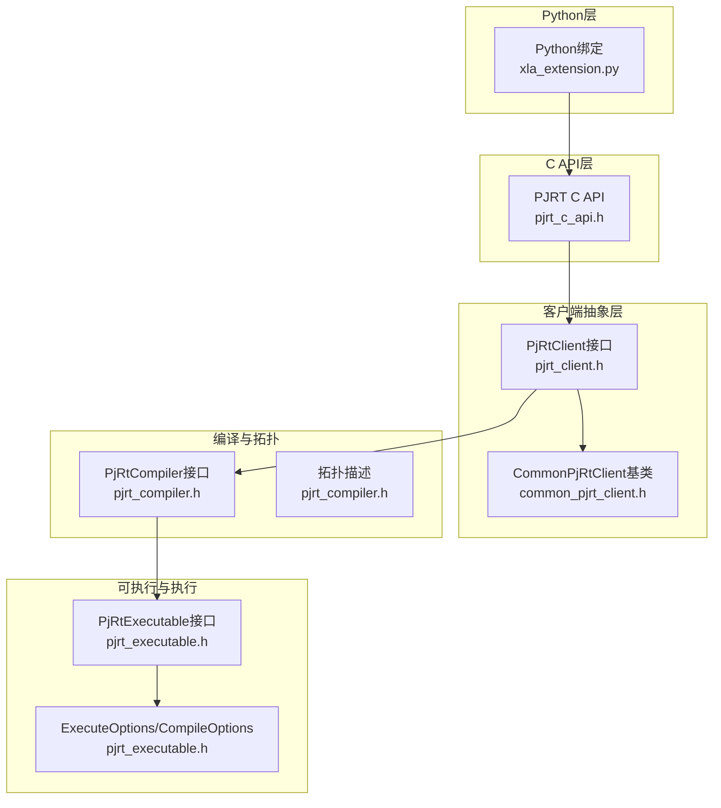
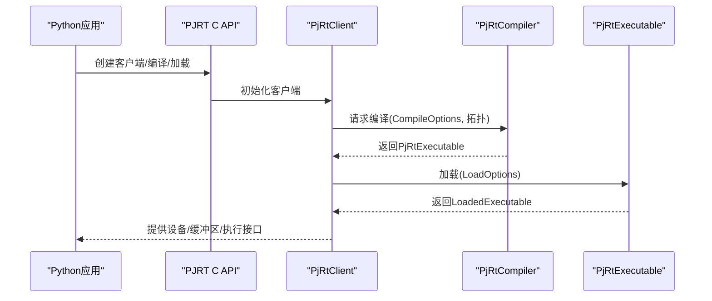
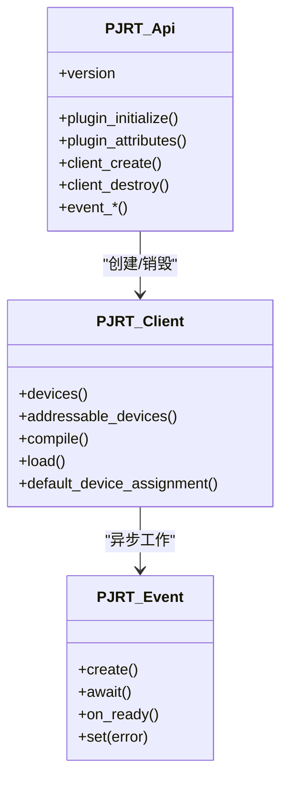
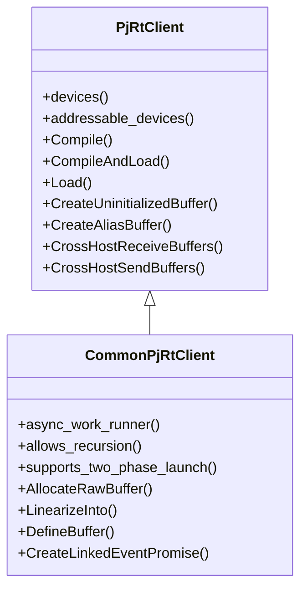
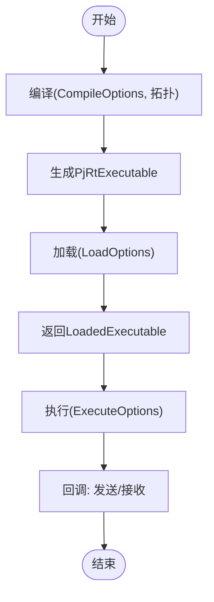
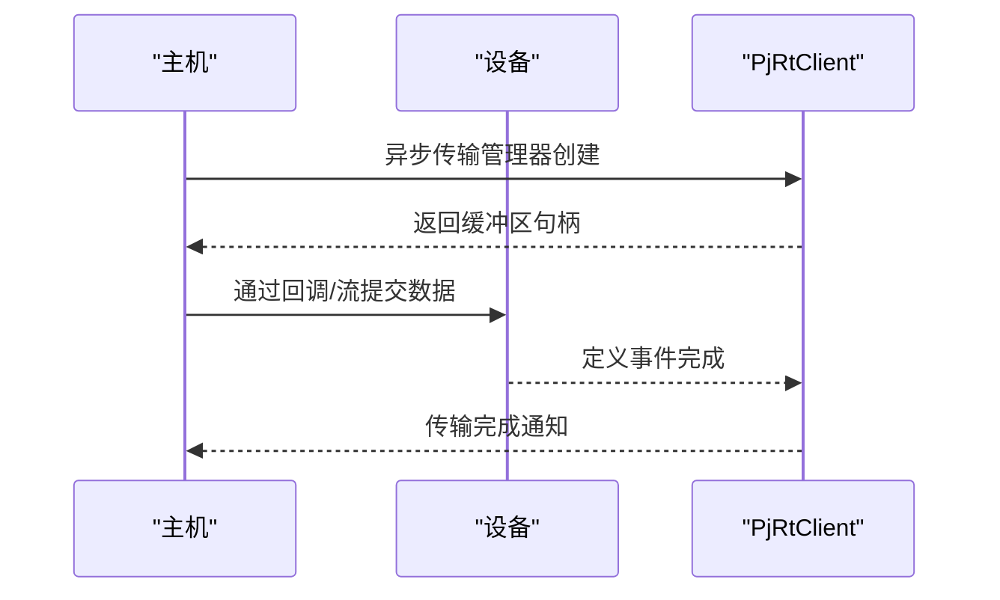
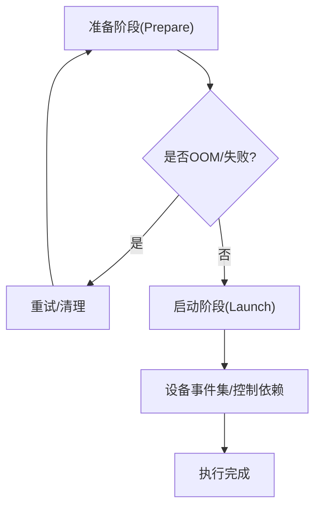
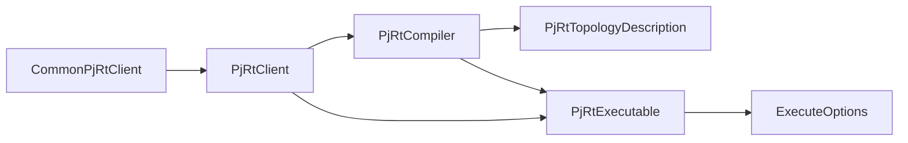

# PJRT运行时集成

<cite>
**本文档引用的文件**
- [xla\pjrt\c\pjrt_c_api.h](file://xla\pjrt\c\pjrt_c_api.h)
- [xla\pjrt\pjrt_api.h](file://xla\pjrt\pjrt_api.h)
- [xla\pjrt\pjrt_client.h](file://xla\pjrt\pjrt_client.h)
- [xla\pjrt\common_pjrt_client.h](file://xla\pjrt\common_pjrt_client.h)
- [xla\pjrt\pjrt_executable.h](file://xla\pjrt\pjrt_executable.h)
- [xla\pjrt\pjrt_compiler.h](file://xla\pjrt\pjrt_compiler.h)
- [xla\pjrt\pjrt_common.h](file://xla\pjrt\pjrt_common.h)
- [xla\python\xla_extension.py](file://xla\python\xla_extension.py)
</cite>

## 目录
1. [简介](#简介)
2. [项目结构](#项目结构)
3. [核心组件](#核心组件)
4. [架构总览](#架构总览)
5. [详细组件分析](#详细组件分析)
6. [依赖关系分析](#依赖关系分析)
7. [性能考虑](#性能考虑)
8. [故障排除指南](#故障排除指南)
9. [结论](#结论)
10. [附录](#附录)

## 简介
本文件面向XLA PJRT（Python Extension for XLA Runtime）运行时集成，系统化阐述其设计理念、架构原理与实现要点，重点覆盖：
- Python与C++之间的桥接机制与ABI版本兼容策略
- PJRT客户端接口：设备管理、可执行程序加载与执行控制
- 可执行程序生命周期：从编译到执行的完整流程
- 数据传输机制：主机到设备、设备间与跨主机数据移动
- 多设备并行执行与同步机制
- 错误处理与状态管理
- Python API使用示例与最佳实践
- 与传统XLA后端的差异与优势
- 性能优化技巧与调试方法

## 项目结构
围绕PJRT的核心代码主要分布在以下模块：
- C API层：定义跨语言调用的稳定接口与扩展点，确保Python与C++之间的桥接一致且可向前/向后兼容
- 客户端抽象层：定义PjRtClient及其派生类的统一接口，屏蔽不同后端（CPU/GPU/TPU等）差异
- 编译器与拓扑：提供编译器注册、拓扑描述与分阶段编译能力
- 可执行程序与执行选项：封装编译产物、执行上下文与回调机制
- 公共类型与桥接：统一平台ID、值类型与通用工具

图表来源
- [xla\pjrt\c\pjrt_c_api.h](file://xla\pjrt\c\pjrt_c_api.h#L1-L800)
- [xla\pjrt\pjrt_client.h](file://xla\pjrt\pjrt_client.h#L509-L800)
- [xla\pjrt\common_pjrt_client.h](file://xla\pjrt\common_pjrt_client.h#L55-L200)
- [xla\pjrt\pjrt_compiler.h](file://xla\pjrt\pjrt_compiler.h#L186-L381)
- [xla\pjrt\pjrt_executable.h](file://xla\pjrt\pjrt_executable.h#L85-L320)
- [xla\python\xla_extension.py](file://xla\python\xla_extension.py#L15-L18)

章节来源
- [xla\pjrt\c\pjrt_c_api.h](file://xla\pjrt\c\pjrt_c_api.h#L1-L800)
- [xla\pjrt\pjrt_client.h](file://xla\pjrt\pjrt_client.h#L509-L800)
- [xla\pjrt\common_pjrt_client.h](file://xla\pjrt\common_pjrt_client.h#L55-L200)
- [xla\pjrt\pjrt_compiler.h](file://xla\pjrt\pjrt_compiler.h#L186-L381)
- [xla\pjrt\pjrt_executable.h](file://xla\pjrt\pjrt_executable.h#L85-L320)
- [xla\python\xla_extension.py](file://xla\python\xla_extension.py#L15-L18)

## 核心组件
- PJRT C API：定义稳定的ABI版本号、错误码、事件模型、插件初始化与属性、键值存储回调、客户端创建与销毁、设备与内存枚举、编译与加载等接口。通过结构体字段大小校验保证前后兼容性。
- PjRtClient：抽象客户端接口，提供设备查询、默认设备分配、编译/加载、缓冲区创建与别名、跨主机收发等能力；CommonPjRtClient为其基于原始缓冲区的通用实现基类，提供线程池调度、OOM重试、事件跟踪、设备事件集等基础设施。
- PjRtCompiler/PjRtTopologyDescription：编译器注册与工厂模式，支持多变体编译器；拓扑描述提供平台信息、设备数量统计、默认布局、子切片等。
- PjRtExecutable/ExecuteOptions：可执行程序接口与执行选项，包含发送/接收回调、严格形状检查、执行流ID、调用位置元数据等。
- 公共类型与桥接：统一平台ID、命名值类型、ID容器等，便于Python与C++之间的类型映射。

章节来源
- [xla\pjrt\c\pjrt_c_api.h](file://xla\pjrt\c\pjrt_c_api.h#L90-L125)
- [xla\pjrt\pjrt_client.h](file://xla\pjrt\pjrt_client.h#L509-L800)
- [xla\pjrt\common_pjrt_client.h](file://xla\pjrt\common_pjrt_client.h#L55-L200)
- [xla\pjrt\pjrt_compiler.h](file://xla\pjrt\pjrt_compiler.h#L100-L183)
- [xla\pjrt\pjrt_executable.h](file://xla\pjrt\pjrt_executable.h#L85-L320)
- [xla\pjrt\pjrt_common.h](file://xla\pjrt\pjrt_common.h#L30-L60)

## 架构总览
PJRT采用“C API桥接 + 抽象客户端 + 拓扑编译 + 可执行装载”的分层设计：
- Python通过C API访问底层C++实现，C API提供结构体尺寸校验与扩展链，确保版本兼容
- 客户端负责设备与内存管理、缓冲区生命周期、跨设备/跨主机数据传输
- 编译器根据拓扑生成可执行程序，支持多阶段编译与变体选择
- 执行阶段通过ExecuteOptions与回调机制完成高性能异步执行与数据通道

图表来源
- [xla\pjrt\c\pjrt_c_api.h](file://xla\pjrt\c\pjrt_c_api.h#L507-L744)
- [xla\pjrt\pjrt_compiler.h](file://xla\pjrt\pjrt_compiler.h#L400-L463)
- [xla\pjrt\pjrt_executable.h](file://xla\pjrt\pjrt_executable.h#L321-L414)

## 详细组件分析

### Python与C++桥接机制
- C API版本与兼容性：通过major/minor版本号与结构体尺寸校验，确保新旧实现的向前/向后兼容
- 插件初始化与属性：提供插件初始化回调、属性查询（如版本信息）
- 键值存储回调：用于分布式场景下的进程间共享信息
- 事件模型：统一的事件创建、等待、就绪回调与错误状态传递
- 客户端生命周期：创建、销毁、平台信息、设备枚举、默认设备分配、DMA映射等

图表来源
- [xla\pjrt\c\pjrt_c_api.h](file://xla\pjrt\c\pjrt_c_api.h#L118-L124)
- [xla\pjrt\c\pjrt_c_api.h](file://xla\pjrt\c\pjrt_c_api.h#L249-L271)
- [xla\pjrt\c\pjrt_c_api.h](file://xla\pjrt\c\pjrt_c_api.h#L380-L508)
- [xla\pjrt\c\pjrt_c_api.h](file://xla\pjrt\c\pjrt_c_api.h#L272-L380)

章节来源
- [xla\pjrt\c\pjrt_c_api.h](file://xla\pjrt\c\pjrt_c_api.h#L90-L125)
- [xla\pjrt\c\pjrt_c_api.h](file://xla\pjrt\c\pjrt_c_api.h#L248-L271)
- [xla\pjrt\c\pjrt_c_api.h](file://xla\pjrt\c\pjrt_c_api.h#L380-L508)

### PJRT客户端接口与设备管理
- 设备与内存空间：提供设备枚举、地址可寻址设备、内存空间查询、默认布局、分配器统计等
- 编译与加载：支持XlaComputation与MLIR模块两种输入，返回可执行程序或已加载可执行程序
- 缓冲区管理：创建未初始化缓冲区、别名缓冲区、错误缓冲区、视图缓冲区、零拷贝缓冲区支持检测
- 跨主机传输：提供第二代跨主机收发API与回调式收发API，支持取消通知与描述符匹配
- 异步传输与事件：支持异步主机到设备传输管理器、设备事件集、用户Promise/Future链接

图表来源
- [xla\pjrt\pjrt_client.h](file://xla\pjrt\pjrt_client.h#L509-L800)
- [xla\pjrt\common_pjrt_client.h](file://xla\pjrt\common_pjrt_client.h#L55-L200)

章节来源
- [xla\pjrt\pjrt_client.h](file://xla\pjrt\pjrt_client.h#L509-L800)
- [xla\pjrt\common_pjrt_client.h](file://xla\pjrt\common_pjrt_client.h#L55-L200)

### 可执行程序生命周期与执行控制
- 编译选项：参数布局、打包参数、便携可执行、多切片配置、环境选项覆盖、精度配置等
- 加载选项：计算子拓扑原点、多切片配置
- 执行选项：启动ID、严格形状检查、发送/接收回调、主序布局回调、执行模式、执行流ID、调用位置元数据、存活任务化身ID
- 执行上下文：FFI执行上下文用于自定义调用
- 可执行接口：名称、副本/分区数、输出形状/元素类型/维度、参数/输出布局、内存种类、成本分析、序列化、指纹、ABI版本等

图表来源
- [xla\pjrt\pjrt_executable.h](file://xla\pjrt\pjrt_executable.h#L85-L320)
- [xla\pjrt\pjrt_executable.h](file://xla\pjrt\pjrt_executable.h#L321-L414)

章节来源
- [xla\pjrt\pjrt_executable.h](file://xla\pjrt\pjrt_executable.h#L85-L320)
- [xla\pjrt\pjrt_executable.h](file://xla\pjrt\pjrt_executable.h#L321-L414)

### 数据传输机制
- 主机到设备：支持异步主机到设备传输管理器、零拷贝检测、布局转换、直接复制与回退路径
- 设备到设备：通过别名缓冲区与定义事件进行无额外内存分配的转移
- 跨主机传输：提供两代API（Receive/Send）与回调式API，支持取消通知与描述符匹配，避免死锁的进度保证
- 事件与流：CopyToDeviceStream按粒度分块传输，支持完成状态与当前字节数查询

图表来源
- [xla\pjrt\pjrt_client.h](file://xla\pjrt\pjrt_client.h#L767-L800)
- [xla\pjrt\pjrt_client.h](file://xla\pjrt\pjrt_client.h#L372-L421)

章节来源
- [xla\pjrt\pjrt_client.h](file://xla\pjrt\pjrt_client.h#L372-L421)
- [xla\pjrt\pjrt_client.h](file://xla\pjrt\pjrt_client.h#L767-L800)

### 多设备并行执行与同步
- 设备分配：默认设备分配、多切片配置、逻辑设备ID映射
- 两阶段启动：Prepare/Launch分离，Prepare可失败并重试，Launch保证成功
- OOM重试：在执行准备阶段支持OOM重试策略
- 设备事件集：用于控制依赖与额外依赖，保障跨设备执行顺序
- 执行流ID：同一流ID内保持程序顺序，不同流ID可并发执行

图表来源
- [xla\pjrt\common_pjrt_client.h](file://xla\pjrt\common_pjrt_client.h#L532-L576)
- [xla\pjrt\common_pjrt_client.h](file://xla\pjrt\common_pjrt_client.h#L568-L573)

章节来源
- [xla\pjrt\common_pjrt_client.h](file://xla\pjrt\common_pjrt_client.h#L532-L576)
- [xla\pjrt\common_pjrt_client.h](file://xla\pjrt\common_pjrt_client.h#L568-L573)

### 错误处理与状态管理
- C API错误模型：统一错误码与消息，支持负载遍历与回调错误构造
- 事件错误：事件就绪后可查询错误状态，支持回调式通知
- 插件初始化与属性：插件初始化失败可通过错误返回，属性查询提供版本信息
- 进度保证与公平性：跨设备传输在主机上不抢占稀缺硬件资源，保证进度但不保证公平

章节来源
- [xla\pjrt\c\pjrt_c_api.h](file://xla\pjrt\c\pjrt_c_api.h#L126-L216)
- [xla\pjrt\c\pjrt_c_api.h](file://xla\pjrt\c\pjrt_c_api.h#L272-L380)
- [xla\pjrt\c\pjrt_c_api.h](file://xla\pjrt\c\pjrt_c_api.h#L480-L508)
- [xla\pjrt\pjrt_client.h](file://xla\pjrt\pjrt_client.h#L455-L509)

### Python API使用示例与最佳实践
- Python绑定入口：通过xla_extension.py导入jax.jaxlib._jax中的符号，作为XLA客户端在Python侧的入口
- 最佳实践建议：
  - 使用结构体尺寸校验字段与扩展链，确保与C API版本兼容
  - 在分布式场景下正确设置键值存储回调，避免键冲突
  - 利用异步传输管理器与事件模型，减少阻塞与提升吞吐
  - 对于跨主机传输，优先使用第二代API以获得更好的一致性与可靠性
  - 合理设置执行流ID与严格形状检查，平衡性能与安全性

章节来源
- [xla\python\xla_extension.py](file://xla\python\xla_extension.py#L15-L18)

### 与传统XLA后端的区别与优势
- 统一抽象：PjRtClient抽象屏蔽了不同后端差异，便于多平台统一编程
- 并行与异步：事件驱动与异步传输模型，更适合大规模并行与高吞吐场景
- 跨主机通信：内置跨主机收发API与回调机制，简化分布式训练/推理
- 可执行程序可移植性：支持便携可执行与多切片配置，便于跨拓扑部署
- 分阶段编译：支持多阶段编译管线，便于插件化与定制化

## 依赖关系分析
- 客户端对编译器的依赖：通过编译器注册表与工厂模式解耦具体实现
- 编译器对拓扑的依赖：拓扑描述提供平台信息与设备统计，影响编译策略
- 可执行程序对执行选项的依赖：执行选项决定回调、布局、流ID等执行行为
- 事件与线程池：CommonPjRtClient通过异步工作运行器调度后台任务，提升并发性能

图表来源
- [xla\pjrt\pjrt_compiler.h](file://xla\pjrt\pjrt_compiler.h#L400-L463)
- [xla\pjrt\pjrt_executable.h](file://xla\pjrt\pjrt_executable.h#L224-L320)
- [xla\pjrt\pjrt_client.h](file://xla\pjrt\pjrt_client.h#L509-L800)
- [xla\pjrt\common_pjrt_client.h](file://xla\pjrt\common_pjrt_client.h#L55-L200)

章节来源
- [xla\pjrt\pjrt_compiler.h](file://xla\pjrt\pjrt_compiler.h#L400-L463)
- [xla\pjrt\pjrt_executable.h](file://xla\pjrt\pjrt_executable.h#L224-L320)
- [xla\pjrt\pjrt_client.h](file://xla\pjrt\pjrt_client.h#L509-L800)
- [xla\pjrt\common_pjrt_client.h](file://xla\pjrt\common_pjrt_client.h#L55-L200)

## 性能考虑
- 零拷贝与布局转换：优先使用零拷贝缓冲区与布局转换，减少数据搬运
- 异步传输与事件：利用异步传输管理器与事件模型，避免阻塞，提升并发
- 两阶段启动与OOM重试：在Prepare阶段失败时及时重试，减少Launch阶段的失败概率
- 执行流ID与并发：合理划分执行流ID，使不同流ID的任务并发执行，同时保持同一流内的顺序
- 跨主机传输：使用第二代API与描述符匹配，避免死锁并提高吞吐

## 故障排除指南
- C API错误码与消息：通过错误码与消息定位问题，必要时遍历错误负载
- 事件等待与回调：使用事件等待与回调确保异步操作完成后再进行后续处理
- 插件初始化失败：检查插件初始化回调与属性查询，确认版本兼容性
- 跨主机传输异常：核对描述符匹配与取消通知，避免重复或遗漏导致的死锁

章节来源
- [xla\pjrt\c\pjrt_c_api.h](file://xla\pjrt\c\pjrt_c_api.h#L126-L216)
- [xla\pjrt\c\pjrt_c_api.h](file://xla\pjrt\c\pjrt_c_api.h#L272-L380)
- [xla\pjrt\c\pjrt_c_api.h](file://xla\pjrt\c\pjrt_c_api.h#L480-L508)

## 结论
PJRT通过清晰的分层设计与稳定的C API桥接，实现了Python与C++之间的高效协作，并提供了统一的设备管理、编译加载、执行控制与数据传输能力。其事件驱动与异步模型、跨主机传输与可移植可执行程序，使其在多设备并行与分布式场景中具备显著优势。结合合理的执行流划分与OOM重试策略，可在保证性能的同时提升系统的鲁棒性与可维护性。

## 附录
- 版本与兼容性：关注C API的major/minor版本号与结构体尺寸校验，确保插件与调用方版本匹配
- 拓扑与编译：根据拓扑描述选择合适的编译策略与布局，默认布局由拓扑提供
- 执行选项：根据应用场景调整严格形状检查、执行模式与回调布局，平衡性能与安全