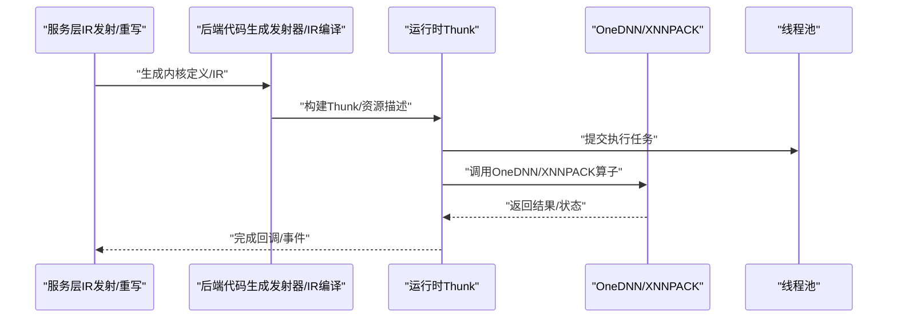
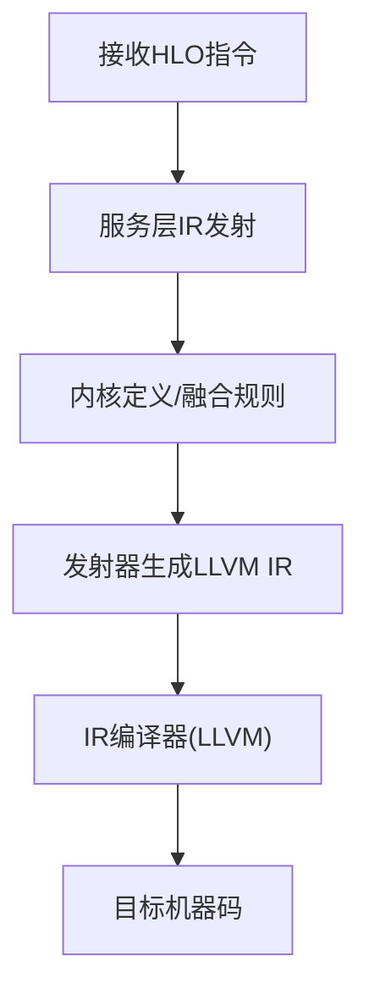
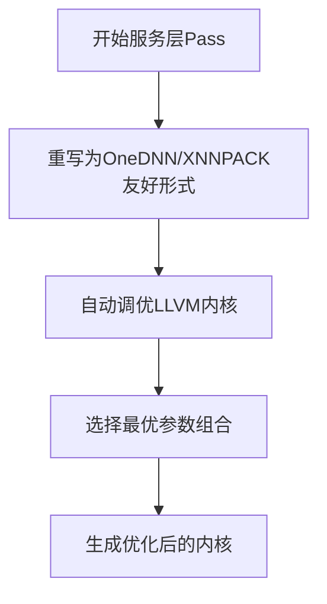
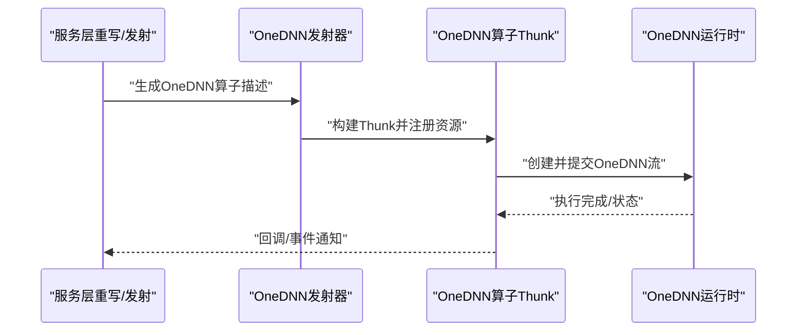
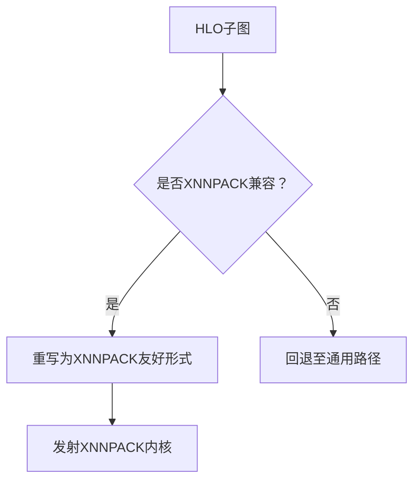
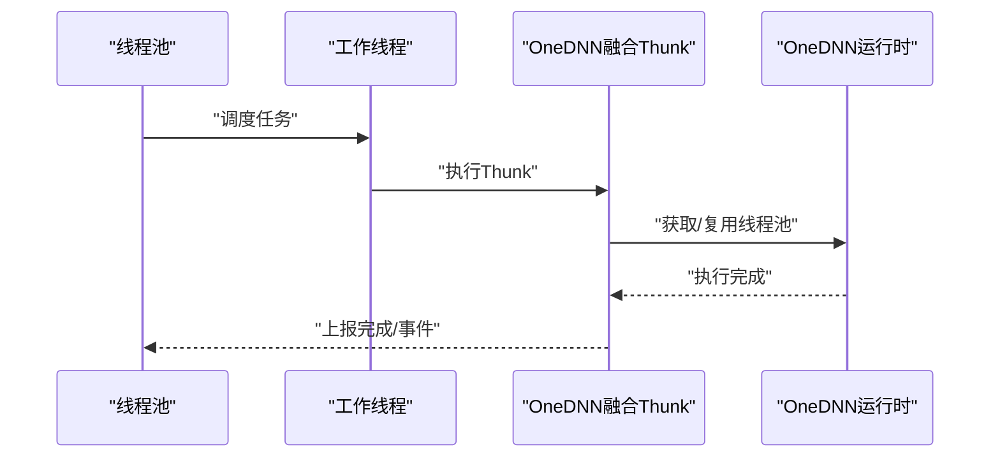
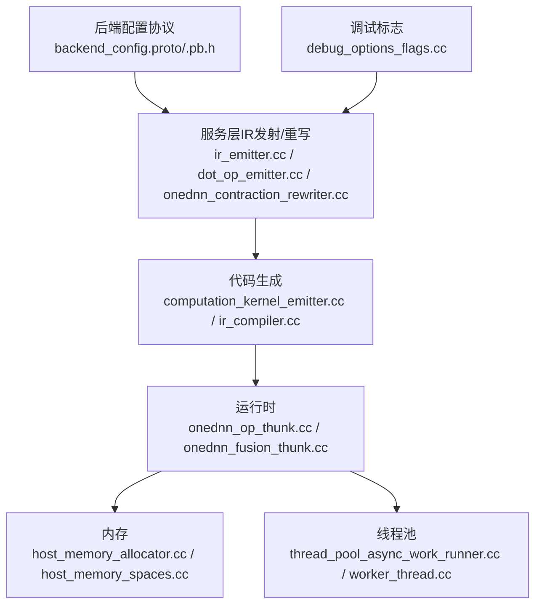

# CPU后端

<cite>
**本文引用的文件**
- [README.md](file://README.md)
- [debug_options_flags.cc](file://xla/debug_options_flags.cc)
- [cpu_compiler.cc](file://xla/service/cpu/cpu_compiler.cc)
- [ir_emitter.cc](file://xla/service/cpu/ir_emitter.cc)
- [ir_emitter2.cc](file://xla/service/cpu/ir_emitter2.cc)
- [dot_op_emitter.cc](file://xla/service/cpu/dot_op_emitter.cc)
- [onednn_contraction_rewriter.cc](file://xla/service/cpu/onednn_contraction_rewriter.cc)
- [onednn_matmul.cc](file://xla/service/cpu/onednn_matmul.cc)
- [onednn_convolution.cc](file://xla/service/cpu/onednn_convolution.cc)
- [onednn_layer_norm.cc](file://xla/service/cpu/onednn_layer_norm.cc)
- [onednn_softmax.cc](file://xla/service/cpu/onednn_softmax.cc)
- [onednn_emitter.cc](file://xla/backends/cpu/onednn_emitter.cc)
- [onednn_support.cc](file://xla/backends/cpu/onednn_support.cc)
- [onednn_op_thunk.cc](file://xla/backends/cpu/runtime/onednn/onednn_op_thunk.cc)
- [onednn_fusion_thunk.cc](file://xla/backends/cpu/runtime/onednn/onednn_fusion_thunk.cc)
- [backend_config.proto](file://xla/service/cpu/backend_config.proto)
- [backend_config.pb.h](file://xla/service/cpu/backend_config.pb.h)
- [computation_kernel_emitter.cc](file://xla/backends/cpu/codegen/computation_kernel_emitter.cc)
- [elemental_kernel_emitter.cc](file://xla/backends/cpu/codegen/elemental/elemental_kernel_emitter.cc)
- [concatenate_kernel_emitter.cc](file://xla/backends/cpu/codegen/elemental/concatenate_kernel_emitter.cc)
- [cpu_scatter_emitter.cc](file://xla/backends/cpu/codegen/emitters/cpu_scatter_emitter.cc)
- [fusion_emitter.cc](file://xla/backends/cpu/codegen/fusion_emitter.cc)
- [ir_compiler.cc](file://xla/backends/cpu/codegen/ir_compiler.cc)
- [llvm_kernel_autotuner.cc](file://xla/backends/cpu/autotuner/llvm_kernel_autotuner.cc)
- [llvm_kernel_backend.cc](file://xla/backends/cpu/autotuner/llvm_kernel_backend.cc)
- [cpu_profiler.cc](file://xla/backends/cpu/autotuner/cpu_profiler.cc)
- [thread_pool_async_work_runner.cc](file://xla/pjrt/thread_pool_async_work_runner.cc)
- [worker_thread.cc](file://xla/pjrt/worker_thread.cc)
- [host_memory_allocator.cc](file://xla/pjrt/host_memory_allocator.cc)
- [host_memory_spaces.cc](file://xla/pjrt/host_memory_spaces.cc)
- [transpose.cc](file://xla/pjrt/transpose.cc)
- [transpose_kernels.h](file://xla/pjrt/transpose_kernels.h)
- [aot_benchmark_helper.cc](file://xla/backends/cpu/benchmarks/aot_benchmark_helper.cc)
- [aliasing_benchmark_test.cc](file://xla/backends/cpu/benchmarks/aliasing_benchmark_test.cc)
- [concatenate_benchmark_test.cc](file://xla/backends/cpu/benchmarks/concatenate_benchmark_test.cc)
- [convolution_benchmark_test.cc](file://xla/backends/cpu/benchmarks/convolution_benchmark_test.cc)
- [onednn_matmul_benchmark_test.cc](file://xla/backends/cpu/benchmarks/onednn_matmul_benchmark_test.cc)
</cite>

## 目录
1. [简介](#简介)
2. [项目结构](#项目结构)
3. [核心组件](#核心组件)
4. [架构总览](#架构总览)
5. [详细组件分析](#详细组件分析)
6. [依赖关系分析](#依赖关系分析)
7. [性能考量](#性能考量)
8. [故障排查指南](#故障排查指南)
9. [结论](#结论)
10. [附录](#附录)

## 简介
本文件面向XLA CPU后端的技术文档，系统阐述其架构设计与实现要点，覆盖以下主题：
- LLVM代码生成流程与目标机器选项配置
- 优化策略与自动调优
- OneDNN发射器与深度学习算子实现
- Ynn（XNNPACK）发射器与SIMD/向量化利用
- 内存管理与缓存友好的数据访问
- 线程池集成与并行执行模型
- 性能调优指南（编译期与运行期）
- 典型使用场景与参考路径

## 项目结构
XLA在CPU后端采用“服务层（IR发射与重写）+ 后端代码生成（LLVM/MLIR）+ 运行时Thunk”三层架构，并通过PJRT桥接上层框架与底层执行。

```mermaid
graph TB
subgraph "服务层CPU
IR1["IR发射器<br/>ir_emitter.cc / ir_emitter2.cc"]
IR2["点积/张量发射器<br/>dot_op_emitter.cc"]
RW["重写器OneDNN等<br/>onednn_contraction_rewriter.cc"]
end
subgraph "后端代码生成"
CG["计算内核发射器<br/>computation_kernel_emitter.cc"]
EL["元素级发射器<br/>elemental_kernel_emitter.cc / concatenate_kernel_emitter.cc"]
EM["发射器集合<br/>cpu_scatter_emitter.cc / fusion_emitter.cc"]
IC["IR编译器<br/>ir_compiler.cc"]
AT["自动调优<br/>llvm_kernel_autotuner.cc / llvm_kernel_backend.cc"]
end
subgraph "运行时"
TH1["OneDNN算子Thunk<br/>onednn_op_thunk.cc"]
TH2["OneDNN融合Thunk<br/>onednn_fusion_thunk.cc"]
TH3["内存与空间<br/>host_memory_allocator.cc / host_memory_spaces.cc"]
TH4["线程池/工作线程<br/>thread_pool_async_work_runner.cc / worker_thread.cc"]
end
IR1 --> CG
IR2 --> CG
RW --> IR1
CG --> IC
EL --> IC
EM --> IC
IC --> TH1
IC --> TH2
TH3 --> TH1
TH4 --> TH1
```

图表来源
- [ir_emitter.cc](file://xla/service/cpu/ir_emitter.cc#L1-L200)
- [ir_emitter2.cc](file://xla/service/cpu/ir_emitter2.cc#L1-L200)
- [dot_op_emitter.cc](file://xla/service/cpu/dot_op_emitter.cc#L1-L200)
- [onednn_contraction_rewriter.cc](file://xla/service/cpu/onednn_contraction_rewriter.cc#L1-L200)
- [computation_kernel_emitter.cc](file://xla/backends/cpu/codegen/computation_kernel_emitter.cc#L1-L200)
- [elemental_kernel_emitter.cc](file://xla/backends/cpu/codegen/elemental/elemental_kernel_emitter.cc#L1-L200)
- [concatenate_kernel_emitter.cc](file://xla/backends/cpu/codegen/elemental/concatenate_kernel_emitter.cc#L1-L200)
- [cpu_scatter_emitter.cc](file://xla/backends/cpu/codegen/emitters/cpu_scatter_emitter.cc#L1-L200)
- [fusion_emitter.cc](file://xla/backends/cpu/codegen/fusion_emitter.cc#L1-L200)
- [ir_compiler.cc](file://xla/backends/cpu/codegen/ir_compiler.cc#L1-L200)
- [onednn_op_thunk.cc](file://xla/backends/cpu/runtime/onednn/onednn_op_thunk.cc#L1-L200)
- [onednn_fusion_thunk.cc](file://xla/backends/cpu/runtime/onednn/onednn_fusion_thunk.cc#L1-L200)
- [host_memory_allocator.cc](file://xla/pjrt/host_memory_allocator.cc#L1-L200)
- [thread_pool_async_work_runner.cc](file://xla/pjrt/thread_pool_async_work_runner.cc#L1-L200)

章节来源
- [README.md](file://README.md#L1-L50)

## 核心组件
- 服务层IR发射与重写：负责将高层HLO转换为CPU可执行的中间表示，并对算子进行重写以适配OneDNN/XNNPACK等加速库。
- 后端代码生成：将IR映射到具体内核发射器，生成LLVM IR或MLIR，再由后端编译器完成最终二进制。
- 运行时Thunk：封装OneDNN/XNNPACK调用与内存管理，调度线程池执行。
- 自动调优：基于LLVM内核的自动调优器，探索最佳配置参数。

章节来源
- [ir_emitter.cc](file://xla/service/cpu/ir_emitter.cc#L1-L200)
- [ir_emitter2.cc](file://xla/service/cpu/ir_emitter2.cc#L1-L200)
- [computation_kernel_emitter.cc](file://xla/backends/cpu/codegen/computation_kernel_emitter.cc#L1-L200)
- [ir_compiler.cc](file://xla/backends/cpu/codegen/ir_compiler.cc#L1-L200)
- [onednn_op_thunk.cc](file://xla/backends/cpu/runtime/onednn/onednn_op_thunk.cc#L1-L200)
- [llvm_kernel_autotuner.cc](file://xla/backends/cpu/autotuner/llvm_kernel_autotuner.cc#L1-L200)

## 架构总览
下图展示从服务层到运行时的关键交互路径，以及OneDNN/XNNPACK的集成位置。



图表来源
- [ir_emitter.cc](file://xla/service/cpu/ir_emitter.cc#L1-L200)
- [ir_compiler.cc](file://xla/backends/cpu/codegen/ir_compiler.cc#L1-L200)
- [onednn_op_thunk.cc](file://xla/backends/cpu/runtime/onednn/onednn_op_thunk.cc#L1-L200)
- [thread_pool_async_work_runner.cc](file://xla/pjrt/thread_pool_async_work_runner.cc#L1-L200)

## 详细组件分析

### LLVM代码生成与目标机器选项
- IR发射与内核定义：服务层将HLO转换为中间表示，随后由计算内核发射器与元素级发射器生成具体内核定义；融合发射器负责多操作融合。
- IR编译器：将生成的IR编译为目标机器码，支持后端配置参数（如OneDNN/XNNPACK开关）。
- 目标机器选项：通过后端配置协议与调试标志控制目标特性（例如SIMD宽度、向量化策略等），并在编译期传递给LLVM。



图表来源
- [ir_emitter.cc](file://xla/service/cpu/ir_emitter.cc#L1-L200)
- [computation_kernel_emitter.cc](file://xla/backends/cpu/codegen/computation_kernel_emitter.cc#L1-L200)
- [fusion_emitter.cc](file://xla/backends/cpu/codegen/fusion_emitter.cc#L1-L200)
- [ir_compiler.cc](file://xla/backends/cpu/codegen/ir_compiler.cc#L1-L200)

章节来源
- [ir_emitter.cc](file://xla/service/cpu/ir_emitter.cc#L1-L200)
- [computation_kernel_emitter.cc](file://xla/backends/cpu/codegen/computation_kernel_emitter.cc#L1-L200)
- [fusion_emitter.cc](file://xla/backends/cpu/codegen/fusion_emitter.cc#L1-L200)
- [ir_compiler.cc](file://xla/backends/cpu/codegen/ir_compiler.cc#L1-L200)
- [backend_config.proto](file://xla/service/cpu/backend_config.proto#L1-L200)
- [backend_config.pb.h](file://xla/service/cpu/backend_config.pb.h#L1-L200)

### 优化策略与自动调优
- 调试标志：提供启用/禁用特定优化的开关，如多线程Eigen调用、OneDNN自定义Thunk、XNNPACK可用性等。
- 自动调优：LLVM内核自动调优器扫描内核参数组合，结合CPU性能计数器评估，选择最优配置。
- 编译期Pass：服务层重写器将某些算子重写为OneDNN/XNNPACK友好形式，提升吞吐。



图表来源
- [onednn_contraction_rewriter.cc](file://xla/service/cpu/onednn_contraction_rewriter.cc#L1-L200)
- [llvm_kernel_autotuner.cc](file://xla/backends/cpu/autotuner/llvm_kernel_autotuner.cc#L1-L200)
- [llvm_kernel_backend.cc](file://xla/backends/cpu/autotuner/llvm_kernel_backend.cc#L1-L200)
- [cpu_profiler.cc](file://xla/backends/cpu/autotuner/cpu_profiler.cc#L1-L200)

章节来源
- [debug_options_flags.cc](file://xla/debug_options_flags.cc#L1130-L1300)
- [onednn_contraction_rewriter.cc](file://xla/service/cpu/onednn_contraction_rewriter.cc#L1-L200)
- [llvm_kernel_autotuner.cc](file://xla/backends/cpu/autotuner/llvm_kernel_autotuner.cc#L1-L200)
- [llvm_kernel_backend.cc](file://xla/backends/cpu/autotuner/llvm_kernel_backend.cc#L1-L200)
- [cpu_profiler.cc](file://xla/backends/cpu/autotuner/cpu_profiler.cc#L1-L200)

### OneDNN发射器与深度学习算子实现
- 发射器与支持：OneDNN发射器负责将HLO映射到OneDNN算子（如矩阵乘、卷积、LayerNorm、Softmax），并与运行时Thunk协作。
- 运行时Thunk：根据目标字符串分派到对应算子，构造OneDNN流并复用线程池资源。
- 支持模块：提供OneDNN融合与内存工具，确保内存布局与数据类型匹配。



图表来源
- [onednn_emitter.cc](file://xla/backends/cpu/onednn_emitter.cc#L1-L200)
- [onednn_op_thunk.cc](file://xla/backends/cpu/runtime/onednn/onednn_op_thunk.cc#L1-L200)
- [onednn_fusion_thunk.cc](file://xla/backends/cpu/runtime/onednn/onednn_fusion_thunk.cc#L1-L200)
- [onednn_matmul.cc](file://xla/service/cpu/onednn_matmul.cc#L1-L200)
- [onednn_convolution.cc](file://xla/service/cpu/onednn_convolution.cc#L1-L200)
- [onednn_layer_norm.cc](file://xla/service/cpu/onednn_layer_norm.cc#L1-L200)
- [onednn_softmax.cc](file://xla/service/cpu/onednn_softmax.cc#L1-L200)

章节来源
- [onednn_emitter.cc](file://xla/backends/cpu/onednn_emitter.cc#L1-L200)
- [onednn_support.cc](file://xla/backends/cpu/onednn_support.cc#L1-L200)
- [onednn_op_thunk.cc](file://xla/backends/cpu/runtime/onednn/onednn_op_thunk.cc#L1-L200)
- [onednn_fusion_thunk.cc](file://xla/backends/cpu/runtime/onednn/onednn_fusion_thunk.cc#L1-L200)
- [onednn_matmul.cc](file://xla/service/cpu/onednn_matmul.cc#L1-L200)
- [onednn_convolution.cc](file://xla/service/cpu/onednn_convolution.cc#L1-L200)
- [onednn_layer_norm.cc](file://xla/service/cpu/onednn_layer_norm.cc#L1-L200)
- [onednn_softmax.cc](file://xla/service/cpu/onednn_softmax.cc#L1-L200)

### Ynn（XNNPACK）发射器与SIMD/向量化
- 启用与控制：调试标志提供开启XNNPACK的开关，并影响融合与成本模型。
- 集成位置：CPU编译器在Pass阶段识别XNNPACK兼容子图，进行融合与内核生成。
- 向量化策略：通过后端配置与LLVM目标特性，选择合适的SIMD宽度与内核参数。



图表来源
- [debug_options_flags.cc](file://xla/debug_options_flags.cc#L1230-L1290)
- [cpu_compiler.cc](file://xla/service/cpu/cpu_compiler.cc#L980-L1020)

章节来源
- [debug_options_flags.cc](file://xla/debug_options_flags.cc#L1230-L1290)
- [cpu_compiler.cc](file://xla/service/cpu/cpu_compiler.cc#L980-L1020)

### 内存管理与缓存友好访问
- 主机内存分配：提供主机内存分配器与内存空间抽象，统一管理生命周期与对齐要求。
- 数据布局与转置：提供转置工具与内核头文件，保证数据访问顺序与缓存局部性。
- 与运行时协同：运行时Thunk与内存分配器配合，确保输入/输出缓冲区满足OneDNN/XNNPACK需求。


图表来源
- [host_memory_allocator.cc](file://xla/pjrt/host_memory_allocator.cc#L1-L200)
- [host_memory_spaces.cc](file://xla/pjrt/host_memory_spaces.cc#L1-L200)
- [transpose.cc](file://xla/pjrt/transpose.cc#L1-L200)
- [transpose_kernels.h](file://xla/pjrt/transpose_kernels.h#L1-L200)

章节来源
- [host_memory_allocator.cc](file://xla/pjrt/host_memory_allocator.cc#L1-L200)
- [host_memory_spaces.cc](file://xla/pjrt/host_memory_spaces.cc#L1-L200)
- [transpose.cc](file://xla/pjrt/transpose.cc#L1-L200)
- [transpose_kernels.h](file://xla/pjrt/transpose_kernels.h#L1-L200)

### 线程池集成与并行执行模型
- 工作线程与异步执行：线程池异步工作运行器与工作线程负责并发调度与事件管理。
- OneDNN线程池：OneDNN运行时Thunk内部维护线程池实例，按需获取并复用，减少创建开销。
- 并行策略：在算子粒度与批处理维度上并行，结合内存屏障与事件同步保证正确性。



图表来源
- [thread_pool_async_work_runner.cc](file://xla/pjrt/thread_pool_async_work_runner.cc#L1-L200)
- [worker_thread.cc](file://xla/pjrt/worker_thread.cc#L1-L200)
- [onednn_fusion_thunk.cc](file://xla/backends/cpu/runtime/onednn/onednn_fusion_thunk.cc#L1-L200)

章节来源
- [thread_pool_async_work_runner.cc](file://xla/pjrt/thread_pool_async_work_runner.cc#L1-L200)
- [worker_thread.cc](file://xla/pjrt/worker_thread.cc#L1-L200)
- [onednn_fusion_thunk.cc](file://xla/backends/cpu/runtime/onednn/onednn_fusion_thunk.cc#L1-L200)

## 依赖关系分析
- 服务层依赖后端配置协议与调试标志，以决定是否启用OneDNN/XNNPACK路径。
- 代码生成层依赖发射器与IR编译器，后者再依赖LLVM工具链。
- 运行时Thunk依赖OneDNN/XNNPACK与线程池，同时与内存分配器协作。



图表来源
- [backend_config.proto](file://xla/service/cpu/backend_config.proto#L1-L200)
- [backend_config.pb.h](file://xla/service/cpu/backend_config.pb.h#L1-L200)
- [debug_options_flags.cc](file://xla/debug_options_flags.cc#L1130-L1300)
- [ir_emitter.cc](file://xla/service/cpu/ir_emitter.cc#L1-L200)
- [dot_op_emitter.cc](file://xla/service/cpu/dot_op_emitter.cc#L1-L200)
- [onednn_contraction_rewriter.cc](file://xla/service/cpu/onednn_contraction_rewriter.cc#L1-L200)
- [computation_kernel_emitter.cc](file://xla/backends/cpu/codegen/computation_kernel_emitter.cc#L1-L200)
- [ir_compiler.cc](file://xla/backends/cpu/codegen/ir_compiler.cc#L1-L200)
- [onednn_op_thunk.cc](file://xla/backends/cpu/runtime/onednn/onednn_op_thunk.cc#L1-L200)
- [onednn_fusion_thunk.cc](file://xla/backends/cpu/runtime/onednn/onednn_fusion_thunk.cc#L1-L200)
- [host_memory_allocator.cc](file://xla/pjrt/host_memory_allocator.cc#L1-L200)
- [thread_pool_async_work_runner.cc](file://xla/pjrt/thread_pool_async_work_runner.cc#L1-L200)

章节来源
- [backend_config.proto](file://xla/service/cpu/backend_config.proto#L1-L200)
- [backend_config.pb.h](file://xla/service/cpu/backend_config.pb.h#L1-L200)
- [debug_options_flags.cc](file://xla/debug_options_flags.cc#L1130-L1300)
- [ir_emitter.cc](file://xla/service/cpu/ir_emitter.cc#L1-L200)
- [dot_op_emitter.cc](file://xla/service/cpu/dot_op_emitter.cc#L1-L200)
- [onednn_contraction_rewriter.cc](file://xla/service/cpu/onednn_contraction_rewriter.cc#L1-L200)
- [computation_kernel_emitter.cc](file://xla/backends/cpu/codegen/computation_kernel_emitter.cc#L1-L200)
- [ir_compiler.cc](file://xla/backends/cpu/codegen/ir_compiler.cc#L1-L200)
- [onednn_op_thunk.cc](file://xla/backends/cpu/runtime/onednn/onednn_op_thunk.cc#L1-L200)
- [onednn_fusion_thunk.cc](file://xla/backends/cpu/runtime/onednn/onednn_fusion_thunk.cc#L1-L200)
- [host_memory_allocator.cc](file://xla/pjrt/host_memory_allocator.cc#L1-L200)
- [thread_pool_async_work_runner.cc](file://xla/pjrt/thread_pool_async_work_runner.cc#L1-L200)

## 性能考量
- 编译期优化
  - 启用OneDNN/XNNPACK路径以获得专用内核与向量化加速。
  - 使用自动调优器探索内核参数组合，降低运行时开销。
  - 通过后端配置与调试标志控制SIMD宽度与并行度。
- 运行期优化
  - 复用线程池与OneDNN流，避免频繁创建销毁。
  - 利用缓存友好的数据布局与转置工具，减少跨步访问。
  - 在融合Pass中尽量保留数据布局不变，减少额外拷贝。

章节来源
- [debug_options_flags.cc](file://xla/debug_options_flags.cc#L1130-L1300)
- [onednn_op_thunk.cc](file://xla/backends/cpu/runtime/onednn/onednn_op_thunk.cc#L1-L200)
- [onednn_fusion_thunk.cc](file://xla/backends/cpu/runtime/onednn/onednn_fusion_thunk.cc#L1-L200)
- [cpu_profiler.cc](file://xla/backends/cpu/autotuner/cpu_profiler.cc#L1-L200)

## 故障排查指南
- 无法命中OneDNN/XNNPACK
  - 检查调试标志是否启用相应路径。
  - 确认算子是否被重写为OneDNN/XNNPACK友好形式。
- 性能异常
  - 使用自动调优器重新评估内核参数。
  - 关注线程池饱和与内存带宽瓶颈。
- 内存问题
  - 核对内存分配器与对齐设置。
  - 检查转置与布局是否符合OneDNN/XNNPACK要求。

章节来源
- [debug_options_flags.cc](file://xla/debug_options_flags.cc#L1130-L1300)
- [onednn_contraction_rewriter.cc](file://xla/service/cpu/onednn_contraction_rewriter.cc#L1-L200)
- [host_memory_allocator.cc](file://xla/pjrt/host_memory_allocator.cc#L1-L200)
- [cpu_profiler.cc](file://xla/backends/cpu/autotuner/cpu_profiler.cc#L1-L200)

## 结论
XLA CPU后端通过服务层IR发射与重写、后端代码生成与自动调优、以及OneDNN/XNNPACK运行时Thunk的协同，实现了高性能的深度学习推理与训练。合理的编译期与运行期配置、内存布局与线程池策略，是发挥其潜力的关键。

## 附录
- 基准测试参考
  - AOT基准辅助与多个算子基准测试文件可用于评估不同配置下的性能表现。
- 使用场景建议
  - 推理场景优先启用OneDNN/XNNPACK并开启自动调优。
  - 训练场景关注融合Pass与内存带宽，避免不必要的数据搬运。

章节来源
- [aot_benchmark_helper.cc](file://xla/backends/cpu/benchmarks/aot_benchmark_helper.cc#L1-L200)
- [aliasing_benchmark_test.cc](file://xla/backends/cpu/benchmarks/aliasing_benchmark_test.cc#L1-L200)
- [concatenate_benchmark_test.cc](file://xla/backends/cpu/benchmarks/concatenate_benchmark_test.cc#L1-L200)
- [convolution_benchmark_test.cc](file://xla/backends/cpu/benchmarks/convolution_benchmark_test.cc#L1-L200)
- [onednn_matmul_benchmark_test.cc](file://xla/backends/cpu/benchmarks/onednn_matmul_benchmark_test.cc#L1-L200)