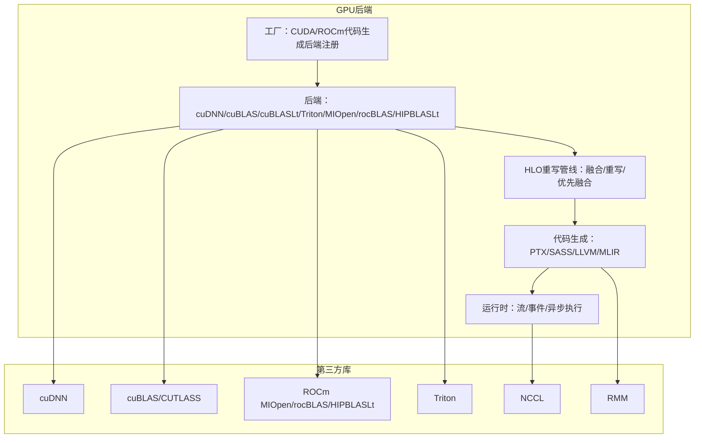
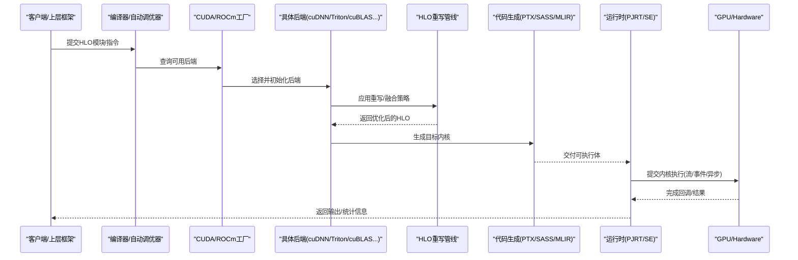
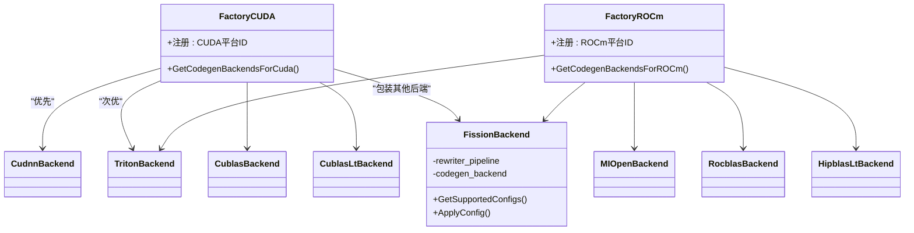
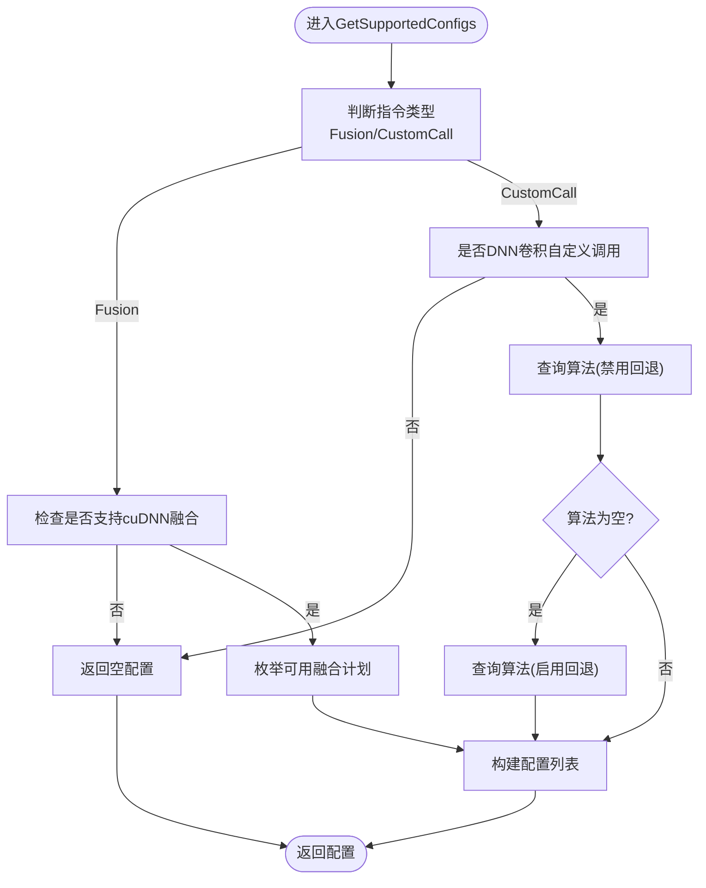
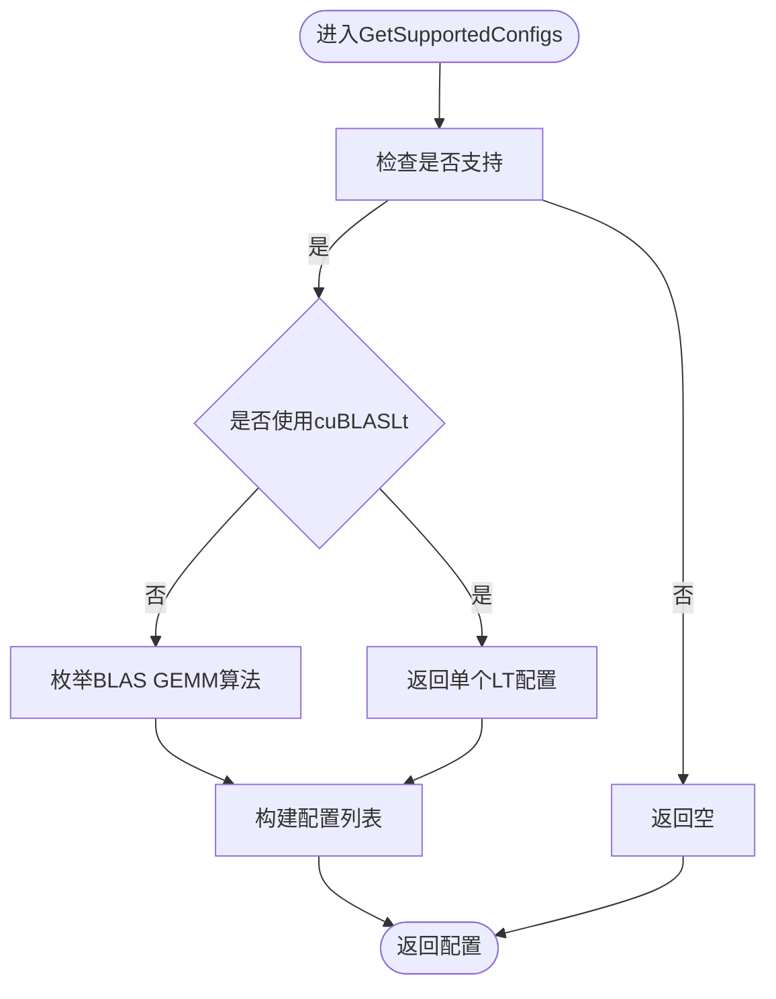
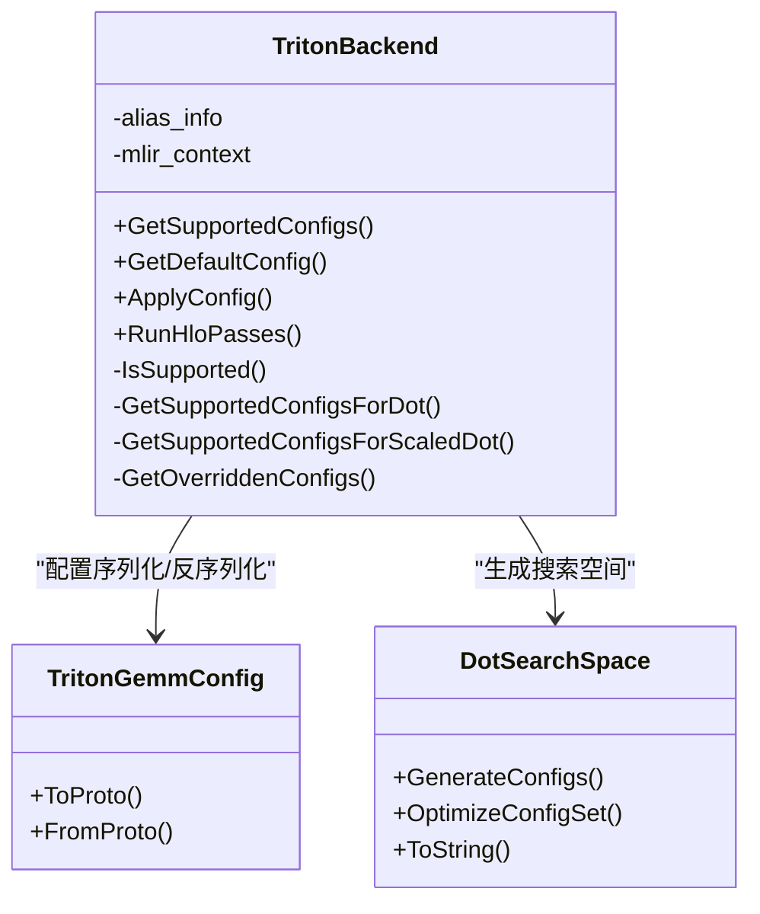
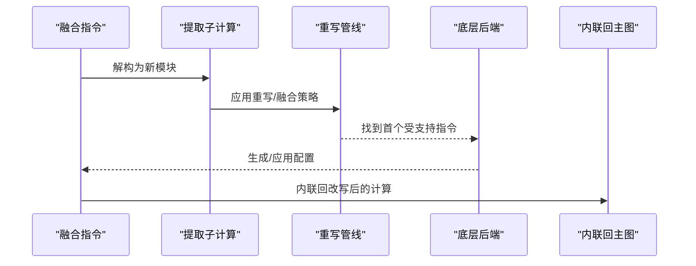
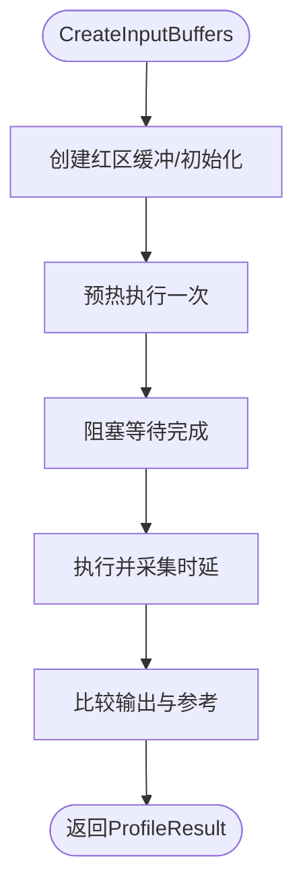

# GPU后端

<cite>
**本文引用的文件**   
- [xla\backends\gpu\autotuner\factory_cuda.cc](file://xla/backends/gpu/autotuner/factory_cuda.cc)
- [xla\backends\gpu\autotuner\factory_rocm.cc](file://xla/backends/gpu/autotuner/factory_rocm.cc)
- [xla\backends\gpu\autotuner\gpu_profiler.cc](file://xla/backends/gpu/autotuner/gpu_profiler.cc)
- [xla\backends\gpu\autotuner\cublas.cc](file://xla/backends/gpu/autotuner/cublas.cc)
- [xla\backends\gpu\autotuner\cudnn.cc](file://xla/backends/gpu/autotuner/cudnn.cc)
- [xla\backends\gpu\autotuner\triton.h](file://xla/backends/gpu/autotuner/triton.h)
- [xla\backends\gpu\autotuner\triton.cc](file://xla/backends/gpu/autotuner/triton.cc)
- [xla\backends\gpu\autotuner\fission_backend.h](file://xla/backends/gpu/autotuner/fission_backend.h)
- [xla\backends\gpu\autotuner\fission_backend.cc](file://xla/backends/gpu/autotuner/fission_backend.cc)
- [xla\backends\gpu\BUILD](file://xla/backends/gpu/BUILD)
- [docs\gpu_architecture.md](file://docs/gpu_architecture.md)
- [docs\hlo_passes.md](file://docs/hlo_passes.md)
- [docs\emitters.md](file://docs/emitters.md)
- [docs\async_ops.md](file://docs/async_ops.md)
- [docs\persisted_autotuning.md](file://docs/persisted_autotuning.md)
- [docs\flags_guidance.md](file://docs/flags_guidance.md)
- [docs\error_codes.md](file://docs/error_codes.md)
- [docs\oom_debugging.md](file://docs/oom_debugging.md)
- [docs\tools_multihost_hlo_runner.md](file://docs/tools_multihost_hlo_runner.md)
- [docs\developer_guide.md](file://docs/developer_guide.md)
- [docs\developing_new_backend.md](file://docs/developing_new_backend.md)
- [third_party\nccl\BUILD.bazel](file://third_party/nccl/BUILD.bazel)
- [third_party\gloo\BUILD.bazel](file://third_party/gloo/BUILD.bazel)
- [third_party\rmm\BUILD.bazel](file://third_party/rmm/BUILD.bazel)
- [third_party\cutlass\BUILD.bazel](file://third_party/cutlass/BUILD.bazel)
- [third_party\cudnn_frontend\BUILD.bazel](file://third_party/cudnn_frontend/BUILD.bazel)
- [third_party\rocm_device_libs\BUILD.bazel](file://third_party/rocm_device_libs/BUILD.bazel)
- [third_party\spirv_llvm_translator\BUILD.bazel](file://third_party/spirv_llvm_translator/BUILD.bazel)
- [third_party\triton\BUILD.bazel](file://third_party/triton/BUILD.bazel)
- [third_party\raft\BUILD.bazel](file://third_party/raft\BUILD.bazel)
- [third_party\nvshmem\BUILD.bazel](file://third_party/nvshmem/BUILD.bazel)
- [third_party\hip\BUILD.bazel](file://third_party/hip/BUILD.bazel)
- [third_party\rocblas\BUILD.bazel](file://third_party/rocblas/BUILD.bazel)
- [third_party\miopen\BUILD.bazel](file://third_party/miopen/BUILD.bazel)
- [third_party\cublas\BUILD.bazel](file://third_party/cublas/BUILD.bazel)
- [third_party\cuda\BUILD.bazel](file://third_party/cuda/BUILD.bazel)
- [third_party\llvm_openmp\BUILD.bazel](file://third_party/llvm_openmp/BUILD.bazel)
- [third_party\nvtx\BUILD.bazel](file://third_party/nvtx/BUILD.bazel)
- [third_party\nccl\rocm_xla.bazelrc](file://third_party/nccl/rocm_xla.bazelrc)
- [third_party\nccl\nvidia_xla.bazelrc](file://third_party/nccl/nvidia_xla.bazelrc)
- [build_tools\configure\configure.py](file://build_tools/configure/configure.py)
- [build_tools\configure\assert_cuda_clang.cu.cc](file://build_tools/configure/assert_cuda_clang.cu.cc)
- [build_tools\rocm\run_xla.sh](file://build_tools/rocm/run_xla.sh)
- [build_tools\rocm\parallel_gpu_execute.sh](file://build_tools/rocm/parallel_gpu_execute.sh)
- [xla\pjrt\gpu\triton_cuda.cc](file://xla/pjrt/gpu/triton_cuda.cc)
- [xla\pjrt\gpu\triton_rocm.cc](file://xla/pjrt/gpu/triton_rocm.cc)
- [xla\pjrt\gpu\triton_stub.cc](file://xla/pjrt/gpu/triton_stub.cc)
- [xla\stream_executor\cuda\cuda_platform_id.h](file://xla/stream_executor/cuda/cuda_platform_id.h)
- [xla\stream_executor\rocm\rocm_platform_id.h](file://xla/stream_executor/rocm/rocm_platform_id.h)
- [xla\stream_executor\platform\platform_object_registry.h](file://xla/stream_executor/platform/platform_object_registry.h)
- [xla\stream_executor\device_description.h](file://xla/stream_executor/device_description.h)
- [xla\stream_executor\stream.h](file://xla/stream_executor/stream.h)
- [xla\stream_executor\stream_executor.h](file://xla/stream_executor/stream_executor.h)
- [xla\stream_executor\device_address_allocator.h](file://xla/stream_executor/device_address_allocator.h)
- [xla\stream_executor\gpu\gpu_blas_lt.h](file://xla/stream_executor/gpu/gpu_blas_lt.h)
- [xla\stream_executor\dnn.h](file://xla/stream_executor/dnn.h)
- [xla\stream_executor\blas.h](file://xla/stream_executor/blas.h)
- [xla\service\gpu\backend_configs.pb.h](file://xla/service/gpu/backend_configs.pb.h)
- [xla\service\gpu\cublas_cudnn.h](file://xla/service/gpu/cublas_cudnn.h)
- [xla\service\gpu\matmul_utils.h](file://xla/service/gpu/matmul_utils.h)
- [xla\service\gpu\ir_emission_utils.h](file://xla/service/gpu/ir_emission_utils.h)
- [xla\service\gpu\gpu_executable_run_options.h](file://xla/service/gpu/gpu_executable_run_options.h)
- [xla\service\gpu\autotuning\redzone_buffers.h](file://xla/service/gpu/autotuning/redzone_buffers.h)
- [xla\backends\autotuner\autotuner.cc](file://xla/backends/autotuner/autotuner.cc)
- [xla\backends\autotuner\file_based_autotuner_cache.cc](file://xla/backends/autotuner/file_based_autotuner_cache.cc)
- [xla\backends\autotuner\file_based_autotuner_cache_test.cc](file://xla/backends/autotuner/file_based_autotuner_cache_test.cc)
- [xla\backends\cpu\constant_allocation.cc](file://xla/backends/cpu/constant_allocation.cc)
- [xla\hlo\transforms\hlo_pass_pipeline.h](file://xla/hlo/pass/hlo_pass_pipeline.h)
- [xla\hlo\ir\hlo_instruction.h](file://xla/hlo/ir/hlo_instruction.h)
- [xla\hlo\ir\hlo_module.h](file://xla/hlo/ir/hlo_module.h)
- [xla\hlo\ir\hlo_opcode.h](file://xla/hlo/ir/hlo_opcode.h)
- [xla\hlo\analysis\alias_info.h](file://xla/hlo/analysis/alias_info.h)
- [xla\service\compiler.h](file://xla/service/compiler.h)
- [xla\service\executable.h](file://xla/service/executable.h)
- [xla\service\maybe_owning_device_address.h](file://xla/service/maybe_owning_device_address.h)
- [xla\service\service_executable_run_options.h](file://xla/service/service_executable_run_options.h)
- [xla\service\shaped_buffer.h](file://xla/shaped_buffer.h)
- [xla\shape.h](file://xla/shape.h)
- [xla\stream_executor\device_address.h](file://xla/stream_executor/device_address.h)
- [xla\stream_executor\gpu\redzone_allocator.h](file://xla/stream_executor/gpu/redzone_allocator.h)
- [xla\stream_executor\stream_executor_memory_allocator.h](file://xla/stream_executor/stream_executor_memory_allocator.h)
- [xla\tsl\platform\errors.h](file://xla/tsl/platform/errors.h)
- [xla\tsl\platform\statusor.h](file://xla/tsl/platform/statusor.h)
- [xla\tsl\platform\env.h](file://xla/tsl/platform/env.h)
- [xla\tsl\protobuf\dnn.pb.h](file://xla/tsl/protobuf/dnn.pb.h)
- [xla\util.h](file://xla/util.h)
- [xla\xla.pb.h](file://xla/xla.pb.h)
- [xla\xla_data.pb.h](file://xla/xla_data.pb.h)
- [xla\backends\gpu\codegen\cudnn.h](file://xla/backends/gpu/codegen/cudnn.h)
- [xla\backends\gpu\codegen\custom.h](file://xla/backends/gpu/codegen/custom.h)
- [xla\backends\gpu\codegen\copy.h](file://xla/backends/gpu/codegen/copy.h)
- [xla\backends\gpu\transforms\cudnn_fusion_compiler.h](file://xla/backends/gpu/transforms/cudnn_fusion_compiler.h)
- [xla\backends\gpu\transforms\dot_algorithm_rewriter.h](file://xla/backends/gpu/transforms/dot_algorithm_rewriter.h)
- [xla\backends\gpu\transforms\gemm_rewriter.h](file://xla/backends/gpu/transforms/gemm_rewriter.h)
- [xla\backends\gpu\transforms\scaled_dot_rewriter.h](file://xla/backends/gpu/transforms/scaled_dot_rewriter.h)
- [xla\backends\gpu\transforms\custom_kernel_fusion_rewriter.h](file://xla/backends/gpu/transforms/custom_kernel_fusion_rewriter.h)
- [xla\backends\gpu\transforms\convert_triton_gemm_config.h](file://xla/backends/gpu/transforms/convert_triton_gemm_config.h)
- [xla\backends\gpu\transforms\fusion_wrapper.h](file://xla/backends/gpu/transforms/fusion_wrapper.h)
- [xla\backends\gpu\transforms\priority_fusion.h](file://xla/backends/gpu/transforms/priority_fusion.h)
- [xla\backends\gpu\transforms\hoist_fused_bitcasts.h](file://xla/backends/gpu/transforms/hoist_fused_bitcasts.h)
- [xla\backends\gpu\transforms\split_k_gemm_rewriter.h](file://xla/backends/gpu/transforms/split_k_gemm_rewriter.h)
- [xla\backends\gpu\transforms\gpu_float_support.h](file://xla/backends/gpu/transforms/gpu_float_support.h)
- [xla\backends\gpu\autotuner\gpu_codegen_backend.h](file://xla/backends/gpu/autotuner/gpu_codegen_backend.h)
- [xla\backends\gpu\autotuner\gpu_profiler.h](file://xla/backends/gpu/autotuner/gpu_profiler.h)
- [xla\backends\gpu\autotuner\cublaslt.h](file://xla/backends/gpu/autotuner/cublaslt.h)
- [xla\backends\gpu\autotuner\hipblaslt.h](file://xla/backends/gpu/autotuner/hipblaslt.h)
- [xla\backends\gpu\autotuner\miopen.h](file://xla/backends/gpu/autotuner/miopen.h)
- [xla\backends\gpu\autotuner\rocblas.h](file://xla/backends/gpu/autotuner/rocblas.h)
- [xla\backends\gpu\autotuner\triton\dot_search_space.h](file://xla/backends/gpu/autotuner/triton/dot_search_space.h)
- [xla\backends\gpu\autotuner\triton\triton_configs.h](file://xla/backends/gpu/autotuner/triton/triton_configs.h)
- [xla\backends\gpu\autotuner\legacy_cache.h](file://xla/backends/gpu/autotuner/legacy_cache.h)
- [xla\backends\gpu\autotuner\native_emitter.h](file://xla/backends/gpu/autotuner/native_emitter.h)
- [xla\backends\gpu\autotuner\custom_kernel.h](file://xla/backends/gpu/autotuner/custom_kernel.h)
- [xla\backends\gpu\autotuner\cublaslt.h](file://xla/backends/gpu/autotuner/cublaslt.h)
- [xla\backends\gpu\autotuner\hipblaslt.h](file://xla/backends/gpu/autotuner/hipblaslt.h)
- [xla\backends\gpu\autotuner\miopen.h](file://xla/backends/gpu/autotuner/miopen.h)
- [xla\backends\gpu\autotuner\rocblas.h](file://xla/backends/gpu/autotuner/rocblas.h)
- [xla\backends\gpu\autotuner\triton\dot_search_space.h](file://xla/backends/gpu/autotuner/triton/dot_search_space.h)
- [xla\backends\gpu\autotuner\triton\triton_configs.h](file://xla/backends/gpu/autotuner/triton/triton_configs.h)
- [xla\backends\gpu\autotuner\legacy_cache.h](file://xla/backends/gpu/autotuner/legacy_cache.h)
- [xla\backends\gpu\autotuner\native_emitter.h](file://xla/backends/gpu/autotuner/native_emitter.h)
- [xla\backends\gpu\autotuner\custom_kernel.h](file://xla/backends/gpu/autotuner/custom_kernel.h)
</cite>

## 目录
1. [简介](#简介)
2. [项目结构](#项目结构)
3. [核心组件](#核心组件)
4. [架构总览](#架构总览)
5. [详细组件分析](#详细组件分析)
6. [依赖关系分析](#依赖关系分析)
7. [性能考量](#性能考量)
8. [故障排除指南](#故障排除指南)
9. [结论](#结论)
10. [附录](#附录)

## 简介
本技术文档面向XLA GPU后端，系统阐述其双栈（CUDA/ROCm）架构、内核编译与生成流程、内存管理、运行时系统、变换优化、集合通信、目标配置与硬件兼容性，并提供性能调优建议与故障排除方法。文档以仓库中实际源码为依据，结合官方文档与构建脚本，帮助开发者与使用者理解并高效使用XLA GPU后端。

## 项目结构
XLA GPU后端主要位于xla/backends/gpu目录下，围绕“自动调优后端工厂”组织多种代码生成后端（cuDNN、cuBLAS/cuBLASLt、ROCm MIOpen/rocBLAS/HIPBLASLt、Triton），并通过HLO重写管线在编译期进行融合与重写，最终由PJRT/GPU运行时执行。第三方库通过BUILD.bazel集成，构建系统区分CUDA与ROCm平台。

图示来源
- [xla\backends\gpu\autotuner\factory_cuda.cc](file://xla/backends/gpu/autotuner/factory_cuda.cc#L84-L141)
- [xla\backends\gpu\autotuner\factory_rocm.cc](file://xla/backends/gpu/autotuner/factory_rocm.cc#L76-L123)
- [xla\backends\gpu\autotuner\gpu_profiler.cc](file://xla/backends/gpu/autotuner/gpu_profiler.cc#L91-L115)
- [xla\backends\gpu\autotuner\cudnn.cc](file://xla/backends/gpu/autotuner/cudnn.cc#L345-L355)
- [xla\backends\gpu\autotuner\cublas.cc](file://xla/backends/gpu/autotuner/cublas.cc#L45-L70)
- [xla\backends\gpu\autotuner\triton.cc](file://xla/backends/gpu/autotuner/triton.cc#L101-L132)

章节来源
- [xla\backends\gpu\BUILD](file://xla/backends/gpu/BUILD#L1-L39)
- [docs\gpu_architecture.md](file://docs/gpu_architecture.md)
- [docs\hlo_passes.md](file://docs/hlo_passes.md)
- [docs\emitters.md](file://docs/emitters.md)

## 核心组件
- 双栈工厂与后端选择
  - CUDA工厂：注册cuDNN、Triton、cuBLAS、cuBLASLt、Fission后端组合。
  - ROCm工厂：注册Triton、MIOpen、rocBLAS、HIPBLASLt、Fission后端组合。
- 自动调优与配置
  - GPU Profiler负责创建输入缓冲、执行预热、测量时延、检查输出一致性与红区保护。
  - 各后端根据指令类型与设备能力生成或应用配置（如GEMM算法、卷积算法、Triton Tile配置）。
- 编译与运行时
  - HLO重写管线在编译期进行融合与重写；代码生成后端产出PTX/SASS或MLIR；运行时通过流/事件/异步执行调度。
- 集合通信
  - 基于NCCL（CUDA）与同类库（ROCm路径通过第三方集成），在多设备/多主机场景下提供AllReduce/AllGather等原语。

章节来源
- [xla\backends\gpu\autotuner\factory_cuda.cc](file://xla/backends/gpu/autotuner/factory_cuda.cc#L84-L141)
- [xla\backends\gpu\autotuner\factory_rocm.cc](file://xla/backends/gpu/autotuner/factory_rocm.cc#L76-L123)
- [xla\backends\gpu\autotuner\gpu_profiler.cc](file://xla/backends/gpu/autotuner/gpu_profiler.cc#L91-L231)
- [xla\backends\gpu\autotuner\cudnn.cc](file://xla/backends/gpu/autotuner/cudnn.cc#L345-L420)
- [xla\backends\gpu\autotuner\cublas.cc](file://xla/backends/gpu/autotuner/cublas.cc#L45-L179)
- [xla\backends\gpu\autotuner\triton.h](file://xla/backends/gpu/autotuner/triton.h#L39-L82)
- [xla\backends\gpu\autotuner\triton.cc](file://xla/backends/gpu/autotuner/triton.cc#L101-L332)

## 架构总览
XLA GPU后端采用“编译期重写 + 运行时执行”的分层架构。编译期通过HLO重写管线将算子融合为适合后端的模式，再由不同后端生成对应内核；运行时通过流/事件/异步执行模型调度内核执行，并进行内存管理与集合通信。

图示来源
- [xla\backends\gpu\autotuner\factory_cuda.cc](file://xla/backends/gpu/autotuner/factory_cuda.cc#L84-L141)
- [xla\backends\gpu\autotuner\factory_rocm.cc](file://xla/backends/gpu/autotuner/factory_rocm.cc#L76-L123)
- [xla\backends\gpu\autotuner\gpu_profiler.cc](file://xla/backends/gpu/autotuner/gpu_profiler.cc#L132-L189)
- [xla\backends\gpu\autotuner\cudnn.cc](file://xla/backends/gpu/autotuner/cudnn.cc#L382-L416)
- [xla\backends\gpu\autotuner\cublas.cc](file://xla/backends/gpu/autotuner/cublas.cc#L133-L167)
- [xla\backends\gpu\autotuner\triton.cc](file://xla/backends/gpu/autotuner/triton.cc#L283-L313)

## 详细组件分析

### 组件A：CUDA/ROCm工厂与后端注册
- 功能概述
  - 工厂根据平台ID（CUDA/ROCm）返回一组代码生成后端实例，按优先级与能力组合，确保覆盖主流GEMM/卷积/自定义核路径。
  - 注册静态对象，使平台侧能按需选择后端。
- 关键点
  - 后端顺序影响测试稳定性（例如cuDNN在CUDA侧优先）。
  - 支持Fission后端对融合指令进行“解构-重写-再融合”，以适配底层后端能力。
- 复杂度与性能
  - 后端数量与组合增加编译期搜索空间，但通过重写管线与默认配置可降低开销。

图示来源
- [xla\backends\gpu\autotuner\factory_cuda.cc](file://xla/backends/gpu/autotuner/factory_cuda.cc#L84-L141)
- [xla\backends\gpu\autotuner\factory_rocm.cc](file://xla/backends/gpu/autotuner/factory_rocm.cc#L76-L123)
- [xla\backends\gpu\autotuner\fission_backend.h](file://xla/backends/gpu/autotuner/fission_backend.h#L60-L101)

章节来源
- [xla\backends\gpu\autotuner\factory_cuda.cc](file://xla/backends/gpu/autotuner/factory_cuda.cc#L84-L141)
- [xla\backends\gpu\autotuner\factory_rocm.cc](file://xla/backends/gpu/autotuner/factory_rocm.cc#L76-L123)
- [xla\stream_executor\cuda\cuda_platform_id.h](file://xla/stream_executor/cuda/cuda_platform_id.h)
- [xla\stream_executor\rocm\rocm_platform_id.h](file://xla/stream_executor/rocm/rocm_platform_id.h)
- [xla\stream_executor\platform\platform_object_registry.h](file://xla/stream_executor/platform/platform_object_registry.h)

### 组件B：cuDNN后端（卷积/融合）
- 功能概述
  - 支持融合卷积与非融合卷积，基于设备能力与精度配置选择合适算法；对自定义调用的DNN卷积提取工作区大小并更新输出元组。
- 关键点
  - 融合支持条件严格（精度、cuDNN版本、计算架构等级）。
  - 优先尝试无回退算法，失败后再启用回退，兼顾速度与稳定性。
- 流程图

图示来源
- [xla\backends\gpu\autotuner\cudnn.cc](file://xla/backends/gpu/autotuner/cudnn.cc#L382-L416)
- [xla\backends\gpu\autotuner\cudnn.cc](file://xla/backends/gpu/autotuner/cudnn.cc#L267-L315)
- [xla\backends\gpu\autotuner\cudnn.cc](file://xla/backends/gpu/autotuner/cudnn.cc#L172-L247)

章节来源
- [xla\backends\gpu\autotuner\cudnn.cc](file://xla/backends/gpu/autotuner/cudnn.cc#L345-L420)

### 组件C：cuBLAS/cuBLASLt后端（GEMM）
- 功能概述
  - 对传统GEMM与FP8场景下的cuBLAS/cuBLASLt进行算法枚举与默认配置选择；支持在FP8路径下回退到cuBLASLt。
- 关键点
  - 通过设备描述与运行时版本确定支持的算法集；为FP8场景提供回退策略。
  - 默认配置使用“默认算法”或显式指定算法值。
- 流程图

图示来源
- [xla\backends\gpu\autotuner\cublas.cc](file://xla/backends/gpu/autotuner/cublas.cc#L45-L131)
- [xla\backends\gpu\autotuner\cublas.cc](file://xla/backends/gpu/autotuner/cublas.cc#L133-L167)

章节来源
- [xla\backends\gpu\autotuner\cublas.cc](file://xla/backends/gpu/autotuner/cublas.cc#L45-L179)

### 组件D：Triton后端（GEMM/融合）
- 功能概述
  - 基于设备能力生成Tile搜索空间，默认配置集；支持覆盖文件与调试标志；处理Split-K与战区特化等高级特性。
- 关键点
  - 按SM架构选择默认配置集；支持Exhaustive平铺搜索与Hint优化。
  - 对kScaledDot在ROCm路径下跳过，让其他后端处理。
- 类图

图示来源
- [xla\backends\gpu\autotuner\triton.h](file://xla/backends/gpu/autotuner/triton.h#L39-L82)
- [xla\backends\gpu\autotuner\triton.cc](file://xla/backends/gpu/autotuner/triton.cc#L101-L332)
- [xla\backends\gpu\autotuner\triton\dot_search_space.h](file://xla/backends/gpu/autotuner/triton/dot_search_space.h)
- [xla\backends\gpu\autotuner\triton\triton_configs.h](file://xla/backends/gpu/autotuner/triton/triton_configs.h)

章节来源
- [xla\backends\gpu\autotuner\triton.h](file://xla/backends/gpu/autotuner/triton.h#L39-L82)
- [xla\backends\gpu\autotuner\triton.cc](file://xla/backends/gpu/autotuner/triton.cc#L101-L332)

### 组件E：Fission后端（融合解构与再融合）
- 功能概述
  - 将融合指令解构为子计算，应用重写管线转换为底层后端可直接支持的形式，再通过优先融合将子算子重新融合。
- 关键点
  - 仅对融合指令生效；查找首个受支持的底层指令以生成/应用配置。
  - 内联回改写后的计算，清理未使用计算图。

图示来源
- [xla\backends\gpu\autotuner\fission_backend.cc](file://xla/backends/gpu/autotuner/fission_backend.cc#L151-L180)
- [xla\backends\gpu\autotuner\fission_backend.h](file://xla/backends/gpu/autotuner/fission_backend.h#L60-L101)

章节来源
- [xla\backends\gpu\autotuner\fission_backend.h](file://xla/backends/gpu/autotuner/fission_backend.h#L60-L101)
- [xla\backends\gpu\autotuner\fission_backend.cc](file://xla/backends/gpu/autotuner/fission_backend.cc#L84-L185)

### 组件F：GPU Profiler（自动调优运行时）
- 功能概述
  - 创建输入缓冲（含红区保护）、预热、执行、测量时延、检查输出一致性与红区修改。
- 关键点
  - 使用设备地址分配器与专用流；要求独占GPU锁避免并发干扰；支持确定性与TF32策略。
- 流程图

图示来源
- [xla\backends\gpu\autotuner\gpu_profiler.cc](file://xla/backends/gpu/autotuner/gpu_profiler.cc#L117-L205)

章节来源
- [xla\backends\gpu\autotuner\gpu_profiler.cc](file://xla/backends/gpu/autotuner/gpu_profiler.cc#L91-L231)

## 依赖关系分析
- 平台与设备描述
  - 通过平台ID与设备描述获取计算架构、运行时版本、驱动版本等，决定后端能力与默认配置。
- 第三方库集成
  - CUDA/ROCm生态通过BUILD.bazel集成，包括cuDNN、cuBLAS/CUTLASS、MIOpen、rocBLAS、HIPBLASLt、Triton、NCCL、RMM等。
- 运行时与流
  - 通过StreamExecutor抽象访问GPU资源；使用流/事件/异步执行模型；红区保护与内存分配器保障正确性。

图示来源
- [xla\stream_executor\cuda\cuda_platform_id.h](file://xla/stream_executor/cuda/cuda_platform_id.h)
- [xla\stream_executor\rocm\rocm_platform_id.h](file://xla/stream_executor/rocm/rocm_platform_id.h)
- [xla\stream_executor\device_description.h](file://xla/stream_executor/device_description.h)
- [xla\stream_executor\stream.h](file://xla/stream_executor/stream.h)
- [xla\stream_executor\stream_executor.h](file://xla/stream_executor/stream_executor.h)

章节来源
- [xla\backends\gpu\autotuner\factory_cuda.cc](file://xla/backends/gpu/autotuner/factory_cuda.cc#L84-L141)
- [xla\backends\gpu\autotuner\factory_rocm.cc](file://xla/backends/gpu/autotuner/factory_rocm.cc#L76-L123)
- [third_party\nccl\BUILD.bazel](file://third_party/nccl/BUILD.bazel)
- [third_party\rmm\BUILD.bazel](file://third_party/rmm/BUILD.bazel)
- [third_party\triton\BUILD.bazel](file://third_party/triton/BUILD.bazel)
- [third_party\cudnn_frontend\BUILD.bazel](file://third_party/cudnn_frontend/BUILD.bazel)
- [third_party\cutlass\BUILD.bazel](file://third_party/cutlass/BUILD.bazel)
- [third_party\rocblas\BUILD.bazel](file://third_party/rocblas/BUILD.bazel)
- [third_party\miopen\BUILD.bazel](file://third_party/miopen/BUILD.bazel)
- [third_party\cuda\BUILD.bazel](file://third_party/cuda/BUILD.bazel)

## 性能考量
- 自动调优缓存与持久化
  - 文件型自动调优缓存按设备能力键存储结果，加速后续编译；测试覆盖缓存键生成逻辑。
- HLO重写与融合
  - 优先融合与融合包装提升吞吐；代价分析选项影响融合策略。
- 算法选择
  - cuDNN优先尝试无回退算法；cuBLAS枚举算法集；Triton按架构选择默认配置集并支持穷举搜索与Hint优化。
- 内存与红区保护
  - 红区缓冲用于检测越界与竞态；Scratch空间统计有助于内存规划。
- 异步执行与流管理
  - 独占GPU锁避免并发干扰；流阻塞等待保证测量准确性。

章节来源
- [xla\backends\autotuner\file_based_autotuner_cache.cc](file://xla/backends/autotuner/file_based_autotuner_cache.cc#L69-L72)
- [xla\backends\autotuner\file_based_autotuner_cache_test.cc](file://xla/backends/autotuner/file_based_autotuner_cache_test.cc#L52-L53)
- [xla\backends\gpu\autotuner\gpu_profiler.cc](file://xla/backends/gpu/autotuner/gpu_profiler.cc#L70-L87)
- [xla\backends\gpu\autotuner\cudnn.cc](file://xla/backends/gpu/autotuner/cudnn.cc#L292-L305)
- [xla\backends\gpu\autotuner\cublas.cc](file://xla/backends/gpu/autotuner/cublas.cc#L115-L130)
- [xla\backends\gpu\autotuner\triton.cc](file://xla/backends/gpu/autotuner/triton.cc#L163-L168)

## 故障排除指南
- 错误码与诊断
  - 参考错误码文档定位问题类别；OOM调试工具链辅助排查显存不足。
- 自动调优异常
  - 检查GPU Profiler日志与红区检查结果；确认是否启用回退算法；验证设备能力与cuDNN版本。
- 构建与环境
  - CUDA/ROCm构建脚本与配置工具确保编译器与工具链匹配；CUDA路径校验宏确保编译器正确性。
- 调试选项
  - 使用调试标志覆盖Triton配置、禁用某些优化或强制穷举搜索，缩小问题范围。

章节来源
- [docs\error_codes.md](file://docs/error_codes.md)
- [docs\oom_debugging.md](file://docs/oom_debugging.md)
- [build_tools\configure\assert_cuda_clang.cu.cc](file://build_tools/configure/assert_cuda_clang.cu.cc#L15-L17)
- [build_tools\rocm\run_xla.sh](file://build_tools/rocm/run_xla.sh)
- [build_tools\rocm\parallel_gpu_execute.sh](file://build_tools/rocm/parallel_gpu_execute.sh)

## 结论
XLA GPU后端通过双栈工厂与多样化的代码生成后端，结合严格的HLO重写与自动调优流程，在CUDA与ROCm平台上实现了高性能的GEMM、卷积与融合内核生成与执行。配合完善的运行时系统、内存管理与集合通信基础设施，能够满足大规模训练与推理需求。建议在生产环境中充分利用自动调优缓存、合理的HLO重写策略与调试标志，以获得最佳性能与稳定性。

## 附录
- 配置示例与最佳实践
  - 使用调试标志覆盖Triton配置文件与单个配置字符串；启用或禁用Split-K与战区特化；设置穷举平铺搜索以探索更优配置。
- 硬件兼容性指南
  - 不同计算架构（Ampere/Hopper/Blackwell/ROCm）选择不同的默认配置集；确保cuDNN版本满足融合要求；在FP8场景下启用cuBLASLt回退。
- 开发者指南
  - 新增后端需遵循后端接口契约，注册平台ID，提供配置枚举与应用逻辑；通过HLO重写管线适配底层能力；完善自动调优与测试。

章节来源
- [docs\flags_guidance.md](file://docs/flags_guidance.md)
- [docs\developer_guide.md](file://docs/developer_guide.md)
- [docs\developing_new_backend.md](file://docs/developing_new_backend.md)
- [xla\backends\gpu\autotuner\triton.cc](file://xla/backends/gpu/autotuner/triton.cc#L202-L232)
- [xla\backends\gpu\autotuner\triton.cc](file://xla/backends/gpu/autotuner/triton.cc#L146-L150)
- [xla\backends\gpu\autotuner\cudnn.cc](file://xla/backends/gpu/autotuner/cudnn.cc#L150-L166)
- [xla\backends\gpu\autotuner\cublas.cc](file://xla/backends/gpu/autotuner/cublas.cc#L173-L175)