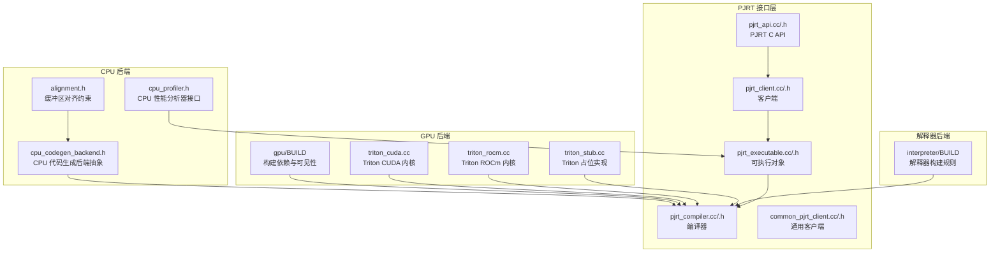
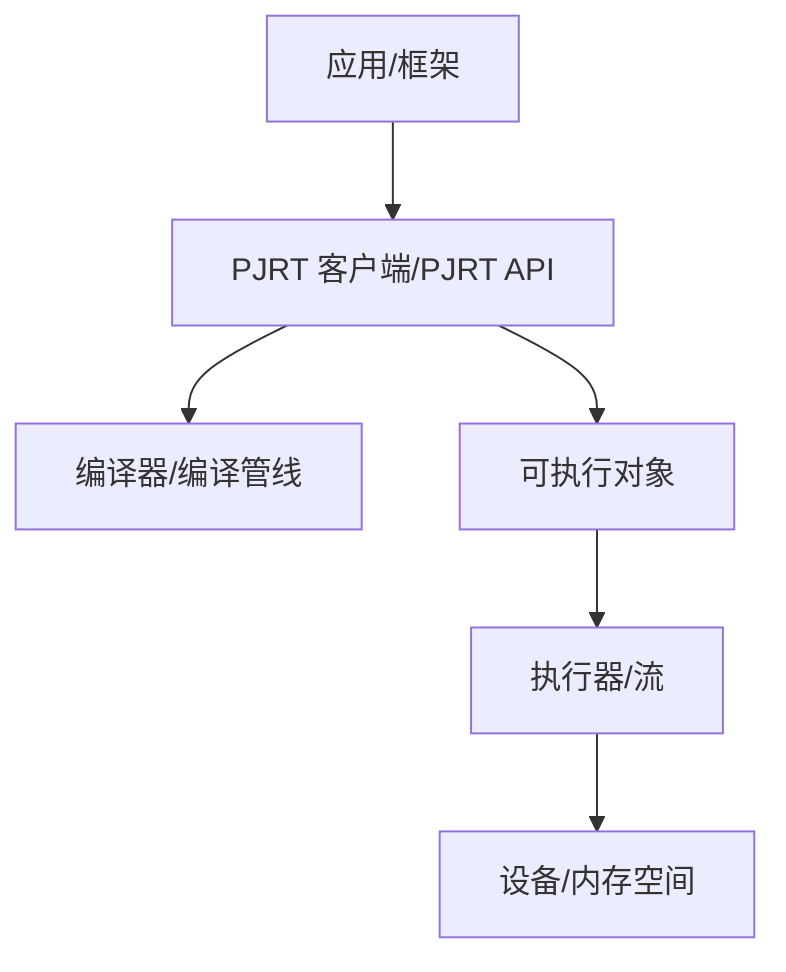
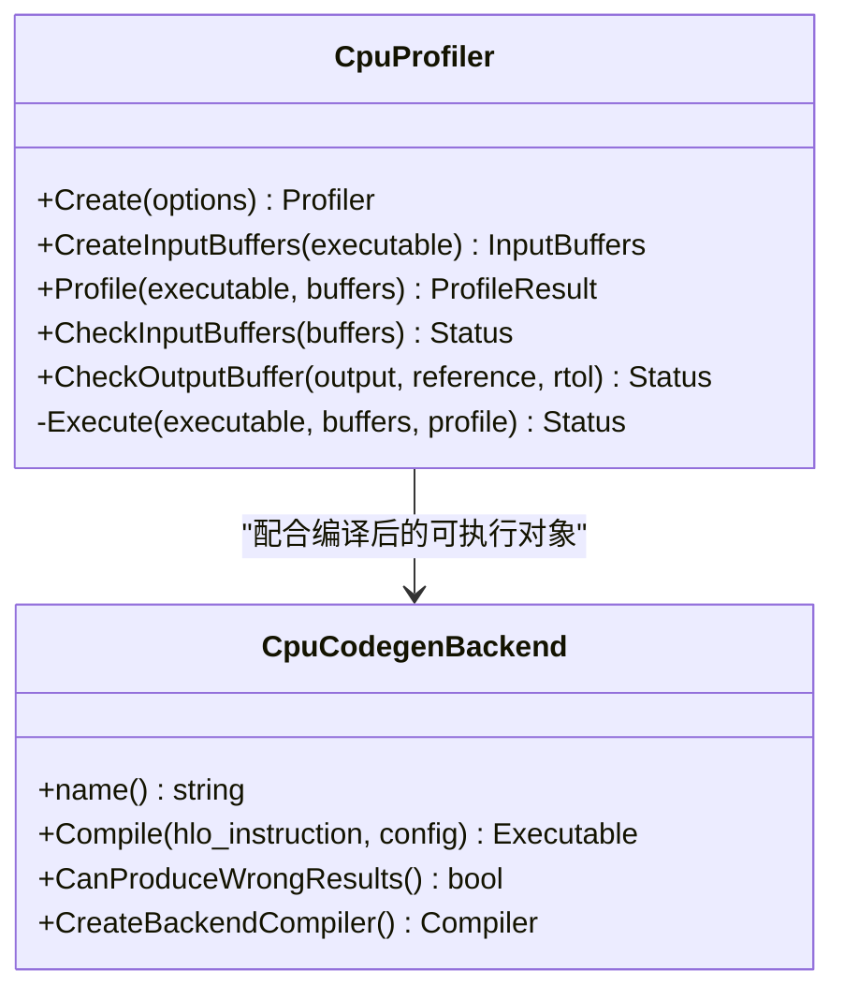
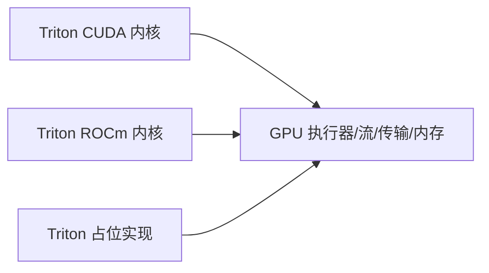
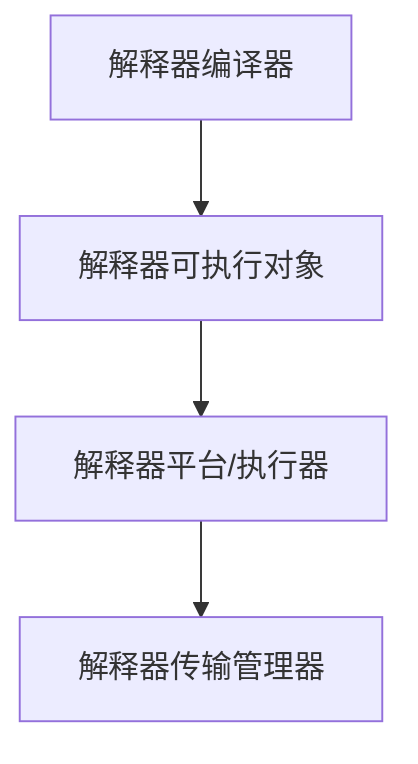
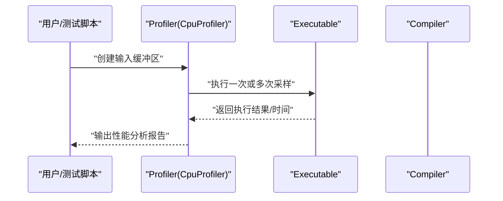
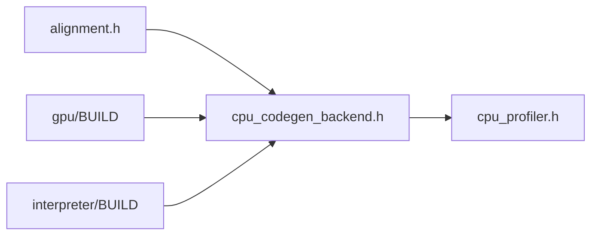

# 主要后端实现

<cite>
**本文引用的文件**
- [xla/README.md](file://xla/README.md)
- [xla/backends/cpu/alignment.h](file://xla/backends/cpu/alignment.h)
- [xla/backends/cpu/autotuner/cpu_codegen_backend.h](file://xla/backends/cpu/autotuner/cpu_codegen_backend.h)
- [xla/backends/cpu/autotuner/cpu_profiler.h](file://xla/backends/cpu/autotuner/cpu_profiler.h)
- [xla/backends/gpu/BUILD](file://xla/backends/gpu/BUILD)
- [xla/backends/interpreter/BUILD](file://xla/backends/interpreter/BUILD)
- [docs/gpu_architecture.md](file://docs/gpu_architecture.md)
- [docs/architecture.md](file://docs/architecture.md)
- [docs/developer_guide.md](file://docs/developer_guide.md)
- [docs/developing_new_backend.md](file://docs/developing_new_backend.md)
- [xla/pjrt/gpu/triton_cuda.cc](file://xla/pjrt/gpu/triton_cuda.cc)
- [xla/pjrt/gpu/triton_rocm.cc](file://xla/pjrt/gpu/triton_rocm.cc)
- [xla/pjrt/gpu/triton_stub.cc](file://xla/pjrt/gpu/triton_stub.cc)
- [xla/pjrt/cpu/thread_pool_async_work_runner.cc](file://xla/pjrt/cpu/thread_pool_async_work_runner.cc)
- [xla/pjrt/cpu/thread_pool_async_work_runner.h](file://xla/pjrt/cpu/thread_pool_async_work_runner.h)
- [xla/pjrt/worker_thread.cc](file://xla/pjrt/worker_thread.cc)
- [xla/pjrt/worker_thread.h](file://xla/pjrt/worker_thread.h)
- [xla/pjrt/common_pjrt_client.cc](file://xla/pjrt/common_pjrt_client.cc)
- [xla/pjrt/common_pjrt_client.h](file://xla/pjrt/common_pjrt_client.h)
- [xla/pjrt/pjrt_api.cc](file://xla/pjrt/pjrt_api.cc)
- [xla/pjrt/pjrt_api.h](file://xla/pjrt/pjrt_api.h)
- [xla/pjrt/pjrt_client.cc](file://xla/pjrt/pjrt_client.cc)
- [xla/pjrt/pjrt_client.h](file://xla/pjrt/pjrt_client.h)
- [xla/pjrt/pjrt_executable.cc](file://xla/pjrt/pjrt_executable.cc)
- [xla/pjrt/pjrt_executable.h](file://xla/pjrt/pjrt_executable.h)
- [xla/pjrt/pjrt_compiler.cc](file://xla/pjrt/pjrt_compiler.cc)
- [xla/pjrt/pjrt_compiler.h](file://xla/pjrt/pjrt_compiler.h)
- [xla/pjrt/gpu/gpu_device.h](file://xla/pjrt/gpu/gpu_device.h)
- [xla/pjrt/gpu/gpu_device.cc](file://xla/pjrt/gpu/gpu_device.cc)
- [xla/pjrt/gpu/gpu_memory_space.h](file://xla/pjrt/gpu/gpu_memory_space.h)
- [xla/pjrt/gpu/gpu_memory_space.cc](file://xla/pjrt/gpu/gpu_memory_space.cc)
- [xla/pjrt/gpu/gpu_transfer_manager.cc](file://xla/pjrt/gpu/gpu_transfer_manager.cc)
- [xla/pjrt/gpu/gpu_transfer_manager.h](file://xla/pjrt/gpu/gpu_transfer_manager.h)
- [xla/pjrt/gpu/gpu_stream.h](file://xla/pjrt/gpu/gpu_stream.h)
- [xla/pjrt/gpu/gpu_stream.cc](file://xla/pjrt/gpu/gpu_stream.cc)
- [xla/pjrt/gpu/gpu_stream_executor.cc](file://xla/pjrt/gpu/gpu_stream_executor.cc)
- [xla/pjrt/gpu/gpu_stream_executor.h](file://xla/pjrt/gpu/gpu_stream_executor.h)
- [xla/pjrt/gpu/gpu_stream_executor_client.cc](file://xla/pjrt/gpu/gpu_stream_executor_client.cc)
- [xla/pjrt/gpu/gpu_stream_executor_client.h](file://xla/pjrt/gpu/gpu_stream_executor_client.h)
- [xla/pjrt/gpu/gpu_stream_executor_executable.cc](file://xla/pjrt/gpu/gpu_stream_executor_executable.cc)
- [xla/pjrt/gpu/gpu_stream_executor_executable.h](file://xla/pjrt/gpu/gpu_stream_executor_executable.h)
- [xla/pjrt/gpu/gpu_stream_executor_executable.proto](file://xla/pjrt/gpu/gpu_stream_executor_executable.proto)
- [xla/pjrt/gpu/gpu_stream_executor_executable_test.cc](file://xla/pjrt/gpu/gpu_stream_executor_executable_test.cc)
- [xla/pjrt/gpu/gpu_stream_executor_executable_test.h](file://xla/pjrt/gpu/gpu_stream_executor_executable_test.h)
- [xla/pjrt/gpu/gpu_stream_executor_executable_test.cc](file://xla/pjrt/gpu/gpu_stream_executor_executable_test.cc)
- [xla/pjrt/gpu/gpu_stream_executor_executable_test.h](file://xla/pjrt/gpu/gpu_stream_executor_executable_test.h)
- [xla/pjrt/gpu/gpu_stream_executor_executable_test.cc](file://xla/pjrt/gpu/gpu_stream_executor_executable_test.cc)
- [xla/pjrt/gpu/gpu_stream_executor_executable_test.h](file://xla/pjrt/gpu/gpu_stream_executor_executable_test.h)
- [xla/pjrt/gpu/gpu_stream_executor_executable_test.cc](file://xla/pjrt/gpu/gpu_stream_executor_executable_test.cc)
- [xla/pjrt/gpu/gpu_stream_executor_executable_test.h](file://xla/pjrt/gpu/gpu_stream_executor_executable_test.h)
- [xla/pjrt/gpu/gpu_stream_executor_executable_test.cc](file://xla/pjrt/gpu/gpu_stream_executor_executable_test.cc)
- [xla/pjrt/gpu/gpu_stream_executor_executable_test.h](file://xla/pjrt/gpu/gpu_stream_executor_executable_test.h)
- [xla/pjrt/gpu/gpu_stream_executor_executable_test.cc](file://xla/pjrt/gpu/gpu_stream_executor_executable_test.cc)
- [xla/pjrt/gpu/gpu_stream_executor_executable_test.h](file://xla/pjrt/gpu/gpu_stream_executor_executable_test.h)
- [xla/pjrt/gpu/gpu_stream_executor_executable_test.cc](file://xla/pjrt/gpu/gpu_stream_executor_executable_test.cc)
- [xla/pjrt/gpu/gpu_stream_executor_executable_test.h](file://xla/pjrt/gpu/gpu_stream_executor_executable_test.h)
- [xla/pjrt/gpu/gpu_stream_executor_executable_test.cc](file://xla/pjrt/gpu/gpu_stream_executor_executable_test.cc)
- [x......
</cite>

## 目录
1. [简介](#简介)
2. [项目结构](#项目结构)
3. [核心组件](#核心组件)
4. [架构总览](#架构总览)
5. [详细组件分析](#详细组件分析)
6. [依赖关系分析](#依赖关系分析)
7. [性能考虑](#性能考虑)
8. [故障排除指南](#故障排除指南)
9. [结论](#结论)
10. [附录](#附录)

## 简介
本文件系统性梳理 XLA 的主要后端实现，覆盖 CPU 后端（含 Eigen 线程池与对齐约束）、GPU 后端（CUDA/ROCm 支持、内核编译与内存管理）、解释器后端（调试与教学）以及性能分析器后端（性能数据采集与分析）。文档同时比较不同后端在功能、性能与兼容性方面的差异，并给出配置选项、优化参数、使用场景建议与最佳实践，以及故障排除与常见问题解决方案。

## 项目结构
XLA 的后端实现分布于多个子目录中，围绕“编译器接口”“平台适配层”“执行器与流”“传输与内存”等维度组织。下图展示与本文相关的关键模块与文件：

图表来源
- [xla/backends/cpu/alignment.h](file://xla/backends/cpu/alignment.h#L25-L38)
- [xla/backends/cpu/autotuner/cpu_codegen_backend.h](file://xla/backends/cpu/autotuner/cpu_codegen_backend.h#L38-L71)
- [xla/backends/cpu/autotuner/cpu_profiler.h](file://xla/backends/cpu/autotuner/cpu_profiler.h#L39-L68)
- [xla/backends/gpu/BUILD](file://xla/backends/gpu/BUILD#L17-L38)
- [xla/pjrt/gpu/triton_cuda.cc](file://xla/pjrt/gpu/triton_cuda.cc)
- [xla/pjrt/gpu/triton_rocm.cc](file://xla/pjrt/gpu/triton_rocm.cc)
- [xla/pjrt/gpu/triton_stub.cc](file://xla/pjrt/gpu/triton_stub.cc)
- [xla/backends/interpreter/BUILD](file://xla/backends/interpreter/BUILD#L9-L179)
- [xla/pjrt/pjrt_api.cc](file://xla/pjrt/pjrt_api.cc)
- [xla/pjrt/pjrt_client.cc](file://xla/pjrt/pjrt_client.cc)
- [xla/pjrt/pjrt_executable.cc](file://xla/pjrt/pjrt_executable.cc)
- [xla/pjrt/pjrt_compiler.cc](file://xla/pjrt/pjrt_compiler.cc)
- [xla/pjrt/common_pjrt_client.cc](file://xla/pjrt/common_pjrt_client.cc)

章节来源
- [xla/README.md](file://xla/README.md)
- [docs/architecture.md](file://docs/architecture.md)
- [docs/developing_new_backend.md](file://docs/developing_new_backend.md)

## 核心组件
- CPU 后端：提供与 Eigen 对齐约束一致的缓冲区对齐策略，以及面向自动调优的代码生成后端抽象；性能分析器接口用于采样与评估。
- GPU 后端：通过 Triton 内核支持 CUDA/ROCm 平台，结合 PJRT 执行器与流进行内核调度与内存管理。
- 解释器后端：以逐指令求值的方式执行 HLO，便于调试与教学。
- 性能分析器后端：提供统一的 Profiler 接口，支持输入输出校验与执行剖析。

章节来源
- [xla/backends/cpu/alignment.h](file://xla/backends/cpu/alignment.h#L25-L38)
- [xla/backends/cpu/autotuner/cpu_codegen_backend.h](file://xla/backends/cpu/autotuner/cpu_codegen_backend.h#L38-L71)
- [xla/backends/cpu/autotuner/cpu_profiler.h](file://xla/backends/cpu/autotuner/cpu_profiler.h#L39-L68)
- [xla/backends/gpu/BUILD](file://xla/backends/gpu/BUILD#L17-L38)
- [xla/backends/interpreter/BUILD](file://xla/backends/interpreter/BUILD#L9-L179)

## 架构总览
XLA 后端通过 PJRT 接口与上层框架交互，底层由平台特定的执行器与流驱动。CPU/GPU 后端分别提供各自的代码生成与内核编译能力，解释器后端提供纯软件执行路径，性能分析器后端贯穿所有后端以收集性能数据。

图表来源
- [xla/pjrt/pjrt_api.cc](file://xla/pjrt/pjrt_api.cc)
- [xla/pjrt/pjrt_client.cc](file://xla/pjrt/pjrt_client.cc)
- [xla/pjrt/pjrt_compiler.cc](file://xla/pjrt/pjrt_compiler.cc)
- [xla/pjrt/pjrt_executable.cc](file://xla/pjrt/pjrt_executable.cc)

## 详细组件分析

### CPU 后端
- 缓冲区对齐与内存管理
  - 最小对齐边界与中间缓冲区首选对齐均与 Eigen 行为保持一致，确保运行时安全与性能一致性。
  - 中间临时缓冲区按 64 字节对齐，与 TSL 分配器对齐常量一致，减少跨步访问开销。
- 自动调优代码生成后端
  - 抽象类封装了针对主机平台的编译器创建、模块提取、配置应用与后端执行流程。
  - 提供默认配置选择与错误处理，保证在多后端环境下具备可扩展性。
- 性能分析器接口
  - 提供输入缓冲区创建、执行与结果采集的统一入口；当前未实现输入/输出校验逻辑，保留扩展点。

图表来源
- [xla/backends/cpu/autotuner/cpu_codegen_backend.h](file://xla/backends/cpu/autotuner/cpu_codegen_backend.h#L38-L71)
- [xla/backends/cpu/autotuner/cpu_profiler.h](file://xla/backends/cpu/autotuner/cpu_profiler.h#L39-L68)

章节来源
- [xla/backends/cpu/alignment.h](file://xla/backends/cpu/alignment.h#L25-L38)
- [xla/backends/cpu/autotuner/cpu_codegen_backend.h](file://xla/backends/cpu/autotuner/cpu_codegen_backend.h#L38-L71)
- [xla/backends/cpu/autotuner/cpu_profiler.h](file://xla/backends/cpu/autotuner/cpu_profiler.h#L39-L68)

### GPU 后端
- 构建与依赖
  - GPU 后端构建文件定义了公共库与依赖项，包含 FFI、Collective 请求与内存分配器等，强调与主机平台目标机器选项的兼容性。
- Triton 内核与平台支持
  - 提供 CUDA、ROCm 与占位实现，作为内核编译与执行的基础。
- PJRT GPU 执行器与内存
  - 包含设备描述、内存空间、传输管理器、流与执行器客户端等组件，支撑异构设备上的任务调度与数据搬运。

图表来源
- [xla/backends/gpu/BUILD](file://xla/backends/gpu/BUILD#L17-L38)
- [xla/pjrt/gpu/triton_cuda.cc](file://xla/pjrt/gpu/triton_cuda.cc)
- [xla/pjrt/gpu/triton_rocm.cc](file://xla/pjrt/gpu/triton_rocm.cc)
- [xla/pjrt/gpu/triton_stub.cc](file://xla/pjrt/gpu/triton_stub.cc)

章节来源
- [xla/backends/gpu/BUILD](file://xla/backends/gpu/BUILD#L17-L38)
- [xla/pjrt/gpu/triton_cuda.cc](file://xla/pjrt/gpu/triton_cuda.cc)
- [xla/pjrt/gpu/triton_rocm.cc](file://xla/pjrt/gpu/triton_rocm.cc)
- [xla/pjrt/gpu/triton_stub.cc](file://xla/pjrt/gpu/triton_stub.cc)

### 解释器后端
- 设计目的与适用场景
  - 以逐指令求值的方式执行 HLO，适合调试、教学与验证正确性，避免复杂编译与内核调度带来的干扰。
- 关键构件
  - 编译器、可执行对象基类、平台与执行器注册，以及传输管理器等，均通过构建规则集中管理。

图表来源
- [xla/backends/interpreter/BUILD](file://xla/backends/interpreter/BUILD#L9-L179)

章节来源
- [xla/backends/interpreter/BUILD](file://xla/backends/interpreter/BUILD#L9-L179)

### 性能分析器后端
- 统一接口与扩展点
  - 提供 Profiler 抽象，支持输入缓冲区创建、执行与结果采集；当前 CPU 分析器未实现输入/输出校验，保留扩展空间。
- 与编译器/可执行对象协作
  - 在编译完成后，通过可执行对象进行多次执行采样，统计性能指标。

图表来源
- [xla/backends/cpu/autotuner/cpu_profiler.h](file://xla/backends/cpu/autotuner/cpu_profiler.h#L43-L64)
- [xla/backends/cpu/autotuner/cpu_codegen_backend.h](file://xla/backends/cpu/autotuner/cpu_codegen_backend.h#L52-L64)

章节来源
- [xla/backends/cpu/autotuner/cpu_profiler.h](file://xla/backends/cpu/autotuner/cpu_profiler.h#L39-L68)
- [xla/backends/cpu/autotuner/cpu_codegen_backend.h](file://xla/backends/cpu/autotuner/cpu_codegen_backend.h#L38-L71)

## 依赖关系分析
- CPU 后端
  - 依赖 Eigen 对齐常量，确保与 TensorFlow/TSL 的行为一致；通过编译器接口对接 PJRT。
- GPU 后端
  - 通过构建文件声明对 FFI、Collective、内存分配器等的依赖；Triton 内核作为平台特定实现。
- 解释器后端
  - 依赖 HLO 求值器、传递管理器与平台/执行器注册，形成完整的解释执行链路。
- 性能分析器后端
  - 与编译器/可执行对象紧密耦合，通过统一接口在不同后端复用。

图表来源
- [xla/backends/cpu/alignment.h](file://xla/backends/cpu/alignment.h#L25-L38)
- [xla/backends/cpu/autotuner/cpu_codegen_backend.h](file://xla/backends/cpu/autotuner/cpu_codegen_backend.h#L38-L71)
- [xla/backends/cpu/autotuner/cpu_profiler.h](file://xla/backends/cpu/autotuner/cpu_profiler.h#L39-L68)
- [xla/backends/gpu/BUILD](file://xla/backends/gpu/BUILD#L17-L38)
- [xla/backends/interpreter/BUILD](file://xla/backends/interpreter/BUILD#L9-L179)

章节来源
- [xla/backends/cpu/alignment.h](file://xla/backends/cpu/alignment.h#L25-L38)
- [xla/backends/cpu/autotuner/cpu_codegen_backend.h](file://xla/backends/cpu/autotuner/cpu_codegen_backend.h#L38-L71)
- [xla/backends/cpu/autotuner/cpu_profiler.h](file://xla/backends/cpu/autotuner/cpu_profiler.h#L39-L68)
- [xla/backends/gpu/BUILD](file://xla/backends/gpu/BUILD#L17-L38)
- [xla/backends/interpreter/BUILD](file://xla/backends/interpreter/BUILD#L9-L179)

## 性能考虑
- CPU
  - 对齐约束与中间缓冲区对齐有助于减少缓存行跨步与非法指令风险；结合线程池与并行调度提升吞吐。
- GPU
  - 内核编译与内存分配策略直接影响延迟与带宽利用率；Triton 内核需针对平台特性进行优化。
- 解释器
  - 逐指令执行带来高可读性与易调试性，但吞吐较低，适合小规模验证与教学演示。
- 性能分析器
  - 通过多次采样与统计聚合，降低噪声影响；建议在稳定负载下进行对比实验。

## 故障排除指南
- 运行时崩溃或非法指令
  - 检查输入缓冲区是否满足最小对齐要求；确保中间缓冲区按 64 字节对齐。
- GPU 内核编译失败
  - 核对 CUDA/ROCm 工具链版本与头文件路径；确认构建文件中的依赖项完整。
- 解释器执行异常缓慢
  - 避免在解释器模式下运行大规模计算；优先使用已编译的可执行对象。
- 性能分析结果不稳定
  - 增加采样次数并剔除异常值；在同一硬件与驱动版本下进行对比。

章节来源
- [xla/backends/cpu/alignment.h](file://xla/backends/cpu/alignment.h#L25-L38)
- [xla/backends/gpu/BUILD](file://xla/backends/gpu/BUILD#L17-L38)
- [xla/backends/interpreter/BUILD](file://xla/backends/interpreter/BUILD#L9-L179)

## 结论
XLA 的后端体系以 PJRT 为核心接口，CPU/GPU 后端分别在对齐约束、内核编译与内存管理方面提供高性能实现，解释器后端专注于调试与教学，性能分析器后端贯穿全栈提供统一的数据采集能力。根据场景选择合适的后端与配置，是获得稳定与高效执行的关键。

## 附录
- 使用场景建议
  - CPU：通用多核场景、需要与 Eigen/TSL 行为一致的对齐策略；优先启用自动调优与线程池。
  - GPU：大规模并行计算、CUDA/ROCm 生态；关注内核编译与内存带宽瓶颈。
  - 解释器：调试、教学、小规模验证；避免在生产环境使用。
  - 性能分析器：定位热点、对比不同配置与后端；结合可视化工具进行根因分析。
- 最佳实践
  - 明确对齐边界，避免越界与未对齐访问。
  - 在 GPU 上尽量复用已编译的可执行对象，减少重复编译开销。
  - 在解释器模式下仅运行可验证的小规模 HLO。
  - 使用稳定的硬件与驱动版本进行基准测试，确保结果可比性。