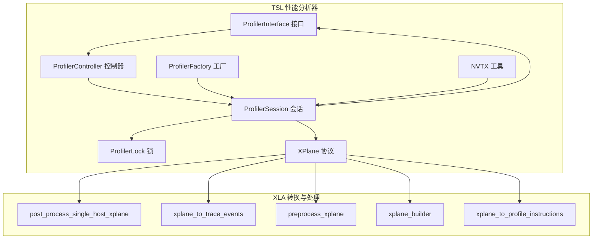
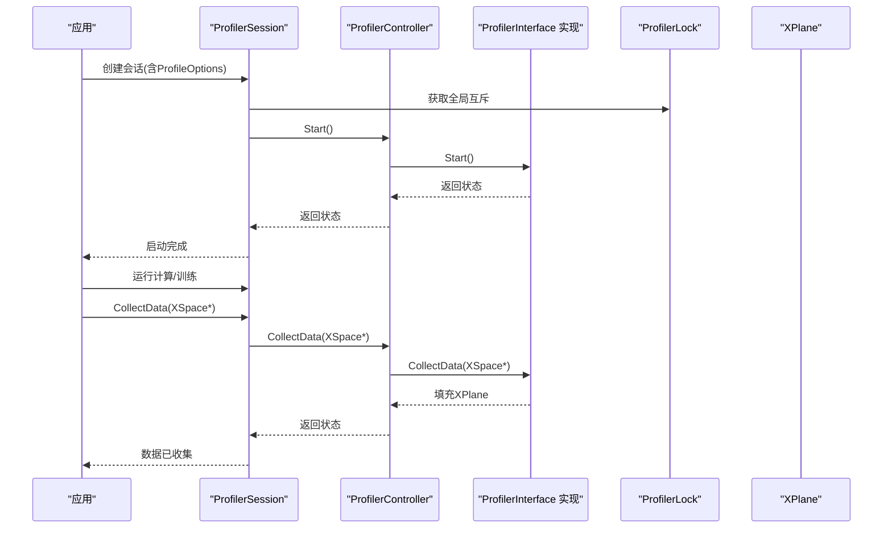
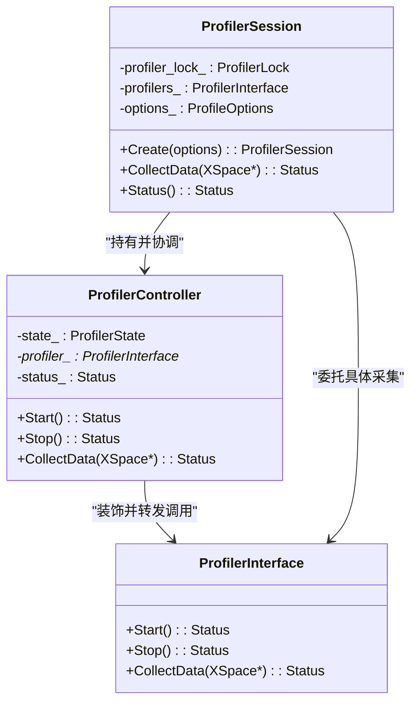
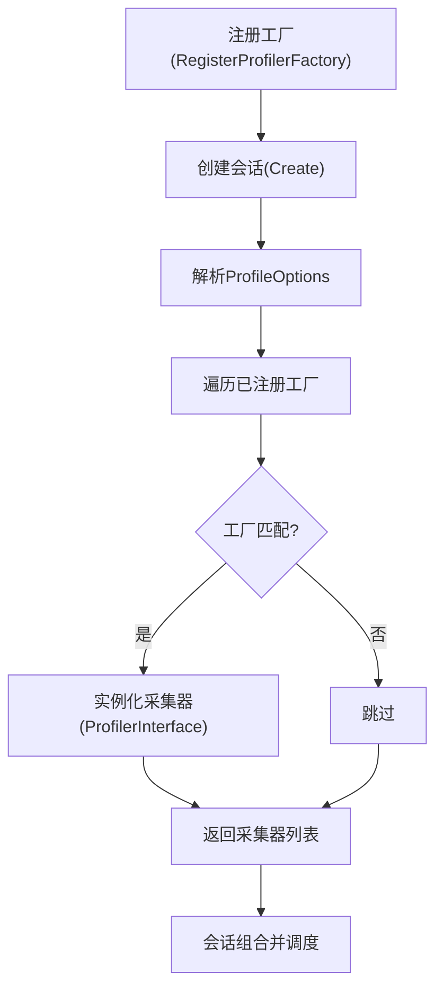
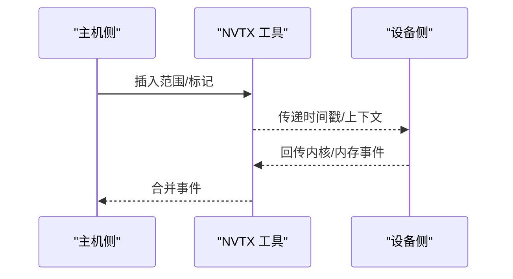
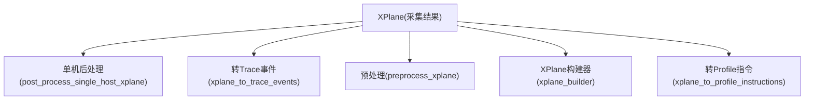
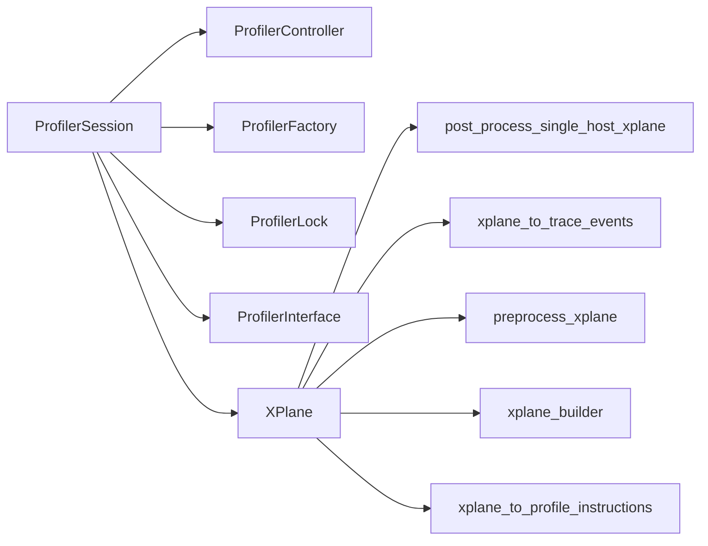

# 性能分析器后端

<cite>
**本文引用的文件**
- [profiler_controller.h](file://third_party/tsl/tsl/profiler/lib/profiler_controller.h)
- [profiler_controller.cc](file://third_party/tsl/tsl/profiler/lib/profiler_controller.cc)
- [profiler_interface.h](file://third_party/tsl/tsl/profiler/lib/profiler_interface.h)
- [profiler_session.h](file://third_party/tsl/tsl/profiler/lib/profiler_session.h)
- [profiler_session.cc](file://third_party/tsl/tsl/profiler/lib/profiler_session.cc)
- [profiler_factory.h](file://third_party/tsl/tsl/profiler/lib/profiler_factory.h)
- [profiler_factory.cc](file://third_party/tsl/tsl/profiler/lib/profiler_factory.cc)
- [profiler_lock.h](file://third_party/tsl/tsl/profiler/lib/profiler_lock.h)
- [profiler_lock.cc](file://third_party/tsl/tsl/profiler/lib/profiler_lock.cc)
- [nvtx_utils.h](file://third_party/tsl/tsl/profiler/lib/nvtx_utils.h)
- [nvtx_utils.cc](file://third_party/tsl/tsl/profiler/lib/nvtx_utils.cc)
- [nvtx_utils_stub.cc](file://third_party/tsl/tsl/profiler/lib/nvtx_utils_stub.cc)
- [xplane.proto](file://third_party/tsl/tsl/profiler/protobuf/xplane.proto)
- [xplane_to_profile_instructions.cc](file://xla/python/xplane_to_profile_instructions.cc)
- [xplane_to_profile_instructions.h](file://xla/python/xplane_to_profile_instructions.h)
- [post_process_single_host_xplane.h](file://xla/tsl/profiler/convert/post_process_single_host_xplane.h)
- [post_process_single_host_xplane.cc](file://xla/tsl/profiler/convert/post_process_single_host_xplane.cc)
- [xplane_to_trace_events.h](file://xla/tsl/profiler/convert/xplane_to_trace_events.h)
- [xplane_to_trace_events.cc](file://xla/tsl/profiler/convert/xplane_to_trace_events.cc)
- [preprocess_xplane.h](file://xla/tsl/profiler/utils/preprocess_xplane.h)
- [preprocess_xplane.cc](file://xla/tsl/profiler/utils/preprocess_xplane.cc)
- [xplane_builder.h](file://xla/tsl/profiler/utils/xplane_builder.h)
- [xplane_builder.cc](file://xla/tsl/profiler/utils/xplane_builder.cc)
- [service.cc](file://xla/service/service.cc)
</cite>

## 目录
1. [简介](#简介)
2. [项目结构](#项目结构)
3. [核心组件](#核心组件)
4. [架构总览](#架构总览)
5. [详细组件分析](#详细组件分析)
6. [依赖关系分析](#依赖关系分析)
7. [性能考量](#性能考量)
8. [故障排查指南](#故障排查指南)
9. [结论](#结论)
10. [附录](#附录)

## 简介
本文件面向XLA性能分析器后端，系统性梳理其整体架构与实现要点，覆盖数据采集、处理与可视化链路；重点阐述CPU侧主机跟踪（Host Tracer）与设备跟踪（Device Tracer）的协作模式；解释GPU侧SM利用率、内存带宽与内核级指标的采集与呈现路径；说明插件化采集器（ProfilerInterface）与工厂注册机制；介绍会话生命周期管理与互斥控制；并给出配置项、使用场景与调优建议。

## 项目结构
XLA性能分析器后端由两部分组成：
- TSL层（third_party/tsl/tsl/profiler）：提供通用的采集接口、会话管理、锁与NVTX封装等基础设施。
- XLA层（xla/tsl/profiler 及 xla/python）：提供XPlane到Trace事件的转换、单机后处理、预处理与构建工具，以及Python侧的XPlane指令转换。

图示来源
- [profiler_interface.h](file://third_party/tsl/tsl/profiler/lib/profiler_interface.h#L32-L44)
- [profiler_controller.h](file://third_party/tsl/tsl/profiler/lib/profiler_controller.h#L37-L59)
- [profiler_session.h](file://third_party/tsl/tsl/profiler/lib/profiler_session.h#L43-L89)
- [profiler_factory.h](file://third_party/tsl/tsl/profiler/lib/profiler_factory.h#L28-L39)
- [profiler_lock.h](file://third_party/tsl/tsl/profiler/lib/profiler_lock.h)
- [nvtx_utils.h](file://third_party/tsl/tsl/profiler/lib/nvtx_utils.h)
- [xplane.proto](file://third_party/tsl/tsl/profiler/protobuf/xplane.proto)
- [post_process_single_host_xplane.h](file://xla/tsl/profiler/convert/post_process_single_host_xplane.h)
- [xplane_to_trace_events.h](file://xla/tsl/profiler/convert/xplane_to_trace_events.h)
- [preprocess_xplane.h](file://xla/tsl/profiler/utils/preprocess_xplane.h)
- [xplane_builder.h](file://xla/tsl/profiler/utils/xplane_builder.h)
- [xplane_to_profile_instructions.h](file://xla/python/xplane_to_profile_instructions.h)

章节来源
- [profiler_interface.h](file://third_party/tsl/tsl/profiler/lib/profiler_interface.h#L24-L44)
- [profiler_session.h](file://third_party/tsl/tsl/profiler/lib/profiler_session.h#L38-L92)
- [profiler_factory.h](file://third_party/tsl/tsl/profiler/lib/profiler_factory.h#L28-L39)
- [xplane.proto](file://third_party/tsl/tsl/profiler/protobuf/xplane.proto)

## 核心组件
- ProfilerInterface：采集器统一接口，定义Start/Stop/CollectData三阶段生命周期。
- ProfilerController：对底层采集器进行装饰，强制正确的调用顺序（Init→Start→Stop→CollectData），并在任一步失败时中止后续调用。
- ProfilerSession：会话管理器，负责创建、启动、停止与数据收集；在多实例场景下通过ProfilerLock确保同一时刻仅一个会话活跃；默认选项包含主机跟踪级别、设备跟踪级别、是否启用HLO Proto与数据集算子等。
- ProfilerFactory：采集器工厂注册与创建接口，支持按ProfileOptions动态选择并实例化多个采集器。
- ProfilerLock：全局互斥，避免并发会话冲突。
- NVTX工具：封装NVTX标记，便于在主机侧插入可被设备跟踪器捕获的时间戳与范围。
- XPlane协议：跨主机/设备的统一时间线与事件容器，作为采集与转换的中间表示。

章节来源
- [profiler_interface.h](file://third_party/tsl/tsl/profiler/lib/profiler_interface.h#L32-L44)
- [profiler_controller.h](file://third_party/tsl/tsl/profiler/lib/profiler_controller.h#L37-L59)
- [profiler_session.h](file://third_party/tsl/tsl/profiler/lib/profiler_session.h#L43-L89)
- [profiler_factory.h](file://third_party/tsl/tsl/profiler/lib/profiler_factory.h#L28-L39)
- [profiler_lock.h](file://third_party/tsl/tsl/profiler/lib/profiler_lock.h)
- [nvtx_utils.h](file://third_party/tsl/tsl/profiler/lib/nvtx_utils.h)
- [xplane.proto](file://third_party/tsl/tsl/profiler/protobuf/xplane.proto)

## 架构总览
下图展示从会话创建到数据收集与转换的关键流程：

图示来源
- [profiler_session.h](file://third_party/tsl/tsl/profiler/lib/profiler_session.h#L46-L68)
- [profiler_controller.h](file://third_party/tsl/tsl/profiler/lib/profiler_controller.h#L42-L46)
- [profiler_interface.h](file://third_party/tsl/tsl/profiler/lib/profiler_interface.h#L36-L43)
- [profiler_lock.h](file://third_party/tsl/tsl/profiler/lib/profiler_lock.h)

## 详细组件分析

### 组件A：会话与控制器（ProfilerSession/ProfilerController）
- 生命周期与状态机
  - ProfilerController维护内部状态机（Init/Start/Stop/CollectData），严格要求调用顺序；一旦某步失败，后续调用将被中止并返回相同错误。
- 会话管理
  - ProfilerSession在构造时即开始采集，并在析构或调用CollectData时停止；通过ProfilerLock保证互斥；提供DefaultOptions以设定主机/设备跟踪级别、是否包含HLO与数据集算子等。
- 线程安全
  - 会话自身线程安全；采集器实现需满足Go/Thread兼容即可。

图示来源
- [profiler_interface.h](file://third_party/tsl/tsl/profiler/lib/profiler_interface.h#L32-L44)
- [profiler_controller.h](file://third_party/tsl/tsl/profiler/lib/profiler_controller.h#L37-L59)
- [profiler_session.h](file://third_party/tsl/tsl/profiler/lib/profiler_session.h#L43-L89)

章节来源
- [profiler_controller.h](file://third_party/tsl/tsl/profiler/lib/profiler_controller.h#L37-L59)
- [profiler_session.h](file://third_party/tsl/tsl/profiler/lib/profiler_session.h#L43-L89)

### 组件B：采集器工厂与插件化采集
- 工厂注册
  - 通过RegisterProfilerFactory注册采集器工厂；CreateProfilers根据ProfileOptions遍历已注册工厂，返回非空的采集器实例集合。
- 插件化设计
  - 不同平台/设备（CPU/GPU/TPU）可分别注册对应的采集器实现；会话按需组合多个采集器协同工作。

图示来源
- [profiler_factory.h](file://third_party/tsl/tsl/profiler/lib/profiler_factory.h#L28-L39)
- [profiler_factory.cc](file://third_party/tsl/tsl/profiler/lib/profiler_factory.cc)

章节来源
- [profiler_factory.h](file://third_party/tsl/tsl/profiler/lib/profiler_factory.h#L28-L39)

### 组件C：主机与设备跟踪（Host/Device Tracer）
- 主机跟踪（Host Tracer）
  - 通过NVTX工具在主机侧插入范围与标记，便于与设备侧事件对齐；可配置跟踪级别以平衡开销与信息量。
- 设备跟踪（Device Tracer）
  - 捕获设备侧内核执行、内存访问与流水线事件；与主机侧NVTX范围共同构成完整时序。
- 互操作
  - NVTX工具提供跨主机/设备的统一时间轴锚点，确保事件对齐与可视化一致性。

图示来源
- [nvtx_utils.h](file://third_party/tsl/tsl/profiler/lib/nvtx_utils.h)
- [nvtx_utils.cc](file://third_party/tsl/tsl/profiler/lib/nvtx_utils.cc)
- [nvtx_utils_stub.cc](file://third_party/tsl/tsl/profiler/lib/nvtx_utils_stub.cc)

章节来源
- [nvtx_utils.h](file://third_party/tsl/tsl/profiler/lib/nvtx_utils.h)
- [nvtx_utils.cc](file://third_party/tsl/tsl/profiler/lib/nvtx_utils.cc)

### 组件D：数据模型与转换（XPlane）
- XPlane协议
  - 作为跨主机/设备的统一事件容器，承载时间线、切片（Plane）、轨迹（Line）与事件（Event）等结构。
- 转换与后处理
  - XLA层提供多种转换工具：将XPlane转为Trace事件、单机后处理、预处理与XPlane构建器，便于可视化与进一步分析。

图示来源
- [xplane.proto](file://third_party/tsl/tsl/profiler/protobuf/xplane.proto)
- [post_process_single_host_xplane.h](file://xla/tsl/profiler/convert/post_process_single_host_xplane.h)
- [xplane_to_trace_events.h](file://xla/tsl/profiler/convert/xplane_to_trace_events.h)
- [preprocess_xplane.h](file://xla/tsl/profiler/utils/preprocess_xplane.h)
- [xplane_builder.h](file://xla/tsl/profiler/utils/xplane_builder.h)
- [xplane_to_profile_instructions.h](file://xla/python/xplane_to_profile_instructions.h)

章节来源
- [xplane.proto](file://third_party/tsl/tsl/profiler/protobuf/xplane.proto)
- [post_process_single_host_xplane.h](file://xla/tsl/profiler/convert/post_process_single_host_xplane.h)
- [xplane_to_trace_events.h](file://xla/tsl/profiler/convert/xplane_to_trace_events.h)
- [preprocess_xplane.h](file://xla/tsl/profiler/utils/preprocess_xplane.h)
- [xplane_builder.h](file://xla/tsl/profiler/utils/xplane_builder.h)
- [xplane_to_profile_instructions.h](file://xla/python/xplane_to_profile_instructions.h)

### 组件E：与XLA服务的集成
- 在XLA服务运行过程中，可通过注入注解与事件，记录计算参数快照、结果快照等，辅助定位性能瓶颈与数据流问题。
- 该能力与性能分析器的事件采集形成互补，便于端到端的可观测性。

章节来源
- [service.cc](file://xla/service/service.cc#L82-L105)

## 依赖关系分析
- 组件耦合
  - ProfilerSession依赖ProfilerController与ProfilerInterface；通过ProfilerLock实现互斥；通过XPlane与转换模块对接上层可视化。
- 外部依赖
  - 依赖TSL的Profiler接口与协议；与CUDA/ROCm/NVidia生态（如NVTX）协作以实现设备侧跟踪。
- 潜在循环依赖
  - 当前结构清晰，无明显循环依赖迹象；工厂注册与会话创建通过抽象接口解耦。

图示来源
- [profiler_session.h](file://third_party/tsl/tsl/profiler/lib/profiler_session.h#L43-L89)
- [profiler_controller.h](file://third_party/tsl/tsl/profiler/lib/profiler_controller.h#L37-L59)
- [profiler_factory.h](file://third_party/tsl/tsl/profiler/lib/profiler_factory.h#L28-L39)
- [profiler_lock.h](file://third_party/tsl/tsl/profiler/lib/profiler_lock.h)
- [xplane.proto](file://third_party/tsl/tsl/profiler/protobuf/xplane.proto)

## 性能考量
- 采样与跟踪级别
  - 主机/设备跟踪级别越高，事件越丰富但开销越大；应结合目标场景权衡。
- 并发与互斥
  - 通过ProfilerLock确保同一时刻仅有一个会话活跃，避免竞争带来的额外开销与不确定性。
- 事件对齐
  - 使用NVTX在主机侧插入范围，有助于减少设备侧事件对齐误差，提升可视化准确性。
- 数据体积
  - 合理关闭不必要的事件（如HLO Proto与数据集算子）可降低XPlane体积，提高后续转换效率。

## 故障排查指南
- 会话无法启动
  - 检查ProfilerController的状态机是否被破坏（调用顺序不正确）；确认底层采集器Start返回状态。
- 数据为空或不完整
  - 确认CollectData调用时机与顺序；检查XPlane是否被正确填充；必要时启用更高等级的主机/设备跟踪。
- 并发冲突
  - 若出现“已有会话活跃”，请确认ProfilerLock是否被正确持有与释放；避免同时创建多个会话。
- 设备跟踪缺失
  - 检查NVTX工具是否可用；确认设备驱动与跟踪器版本兼容。

章节来源
- [profiler_controller.h](file://third_party/tsl/tsl/profiler/lib/profiler_controller.h#L37-L59)
- [profiler_session.h](file://third_party/tsl/tsl/profiler/lib/profiler_session.h#L43-L89)
- [profiler_lock.h](file://third_party/tsl/tsl/profiler/lib/profiler_lock.h)

## 结论
XLA性能分析器后端采用分层设计：TSL层提供统一的采集接口、会话管理与互斥控制；XLA层提供丰富的XPlane转换与后处理工具。通过插件化的采集器工厂与严格的生命周期控制，系统实现了CPU/GPU等多源事件的统一采集与对齐；配合NVTX与XPlane协议，能够高效生成可用于可视化的完整时间线。合理配置跟踪级别与事件范围，可在性能与可观测性之间取得良好平衡。

## 附录

### 配置指南（基于现有接口与默认值）
- 采样频率与跟踪级别
  - 通过ProfileOptions设置主机/设备跟踪级别与Python跟踪级别；默认主机跟踪级别较高，设备跟踪级别适中。
- 过滤条件
  - 可通过ProfileOptions控制是否包含HLO Proto与数据集算子，以减少无关事件。
- 输出格式
  - 采集结果以XPlane为中间格式；随后可转换为Trace事件或其他可视化格式。

章节来源
- [profiler_session.h](file://third_party/tsl/tsl/profiler/lib/profiler_session.h#L49-L59)
- [xplane.proto](file://third_party/tsl/tsl/profiler/protobuf/xplane.proto)

### 实际使用案例与调优建议
- 案例一：定位内核热点
  - 启用设备跟踪与主机跟踪；在关键算子前后插入NVTX范围；收集XPlane并转换为Trace事件；在可视化工具中定位长内核与高占用区域。
- 案例二：分析内存带宽瓶颈
  - 关注设备侧内存访问事件与带宽指标；结合主机侧数据搬运事件，识别潜在的访存热点。
- 案例三：多设备/多主机对齐
  - 使用NVTX范围作为锚点，确保跨设备/主机事件对齐；利用单机后处理工具合并XPlane。

### 与其他分析工具的集成与数据导出
- 集成方式
  - 将XPlane作为统一输入，对接TensorBoard/Chrome Trace等可视化工具；也可通过转换工具导出为其他格式。
- 导出格式
  - XPlane → Trace事件（便于浏览器/Chrome Trace查看）；XPlane → 自定义格式（依据业务需求扩展）。

章节来源
- [xplane_to_trace_events.h](file://xla/tsl/profiler/convert/xplane_to_trace_events.h)
- [xplane_to_profile_instructions.h](file://xla/python/xplane_to_profile_instructions.h)