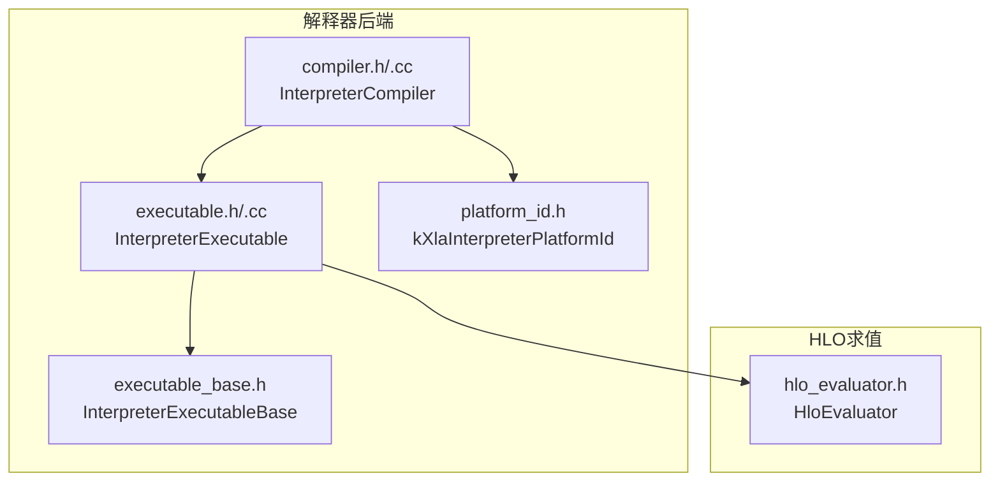
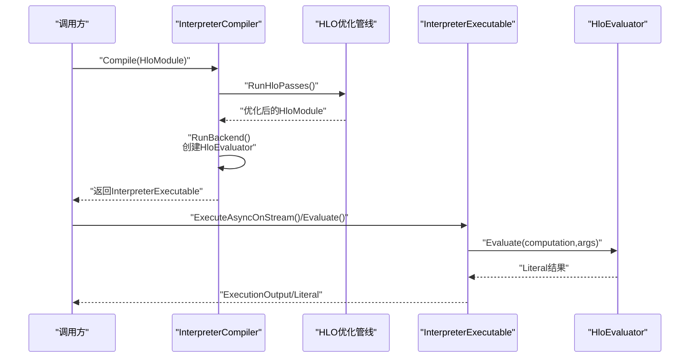
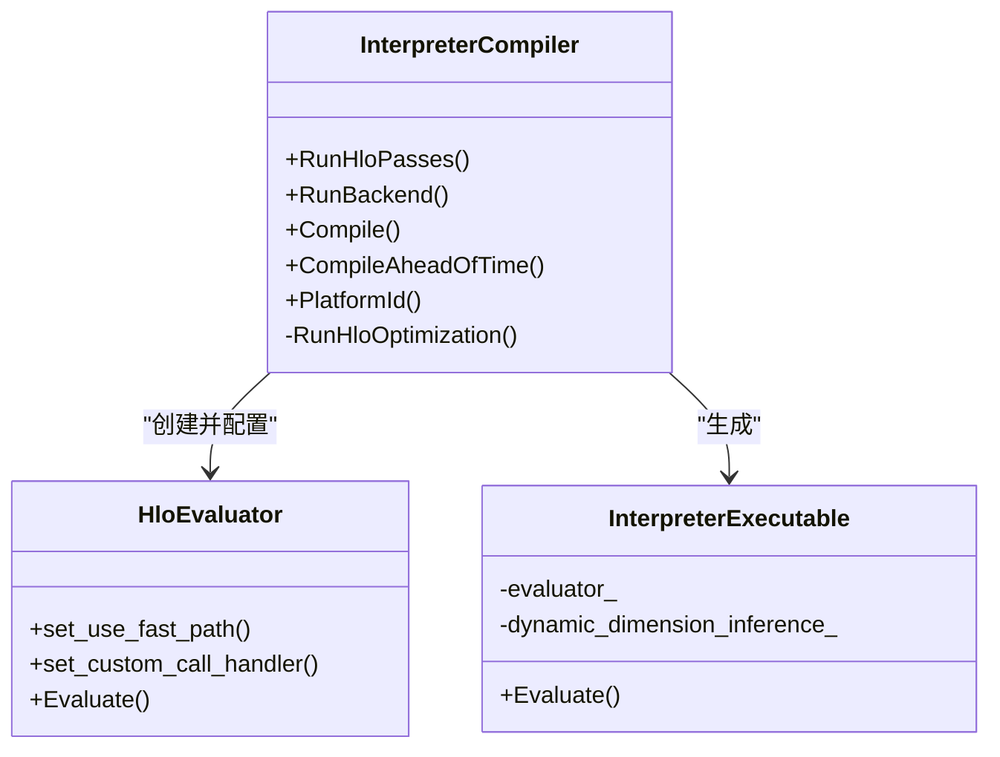
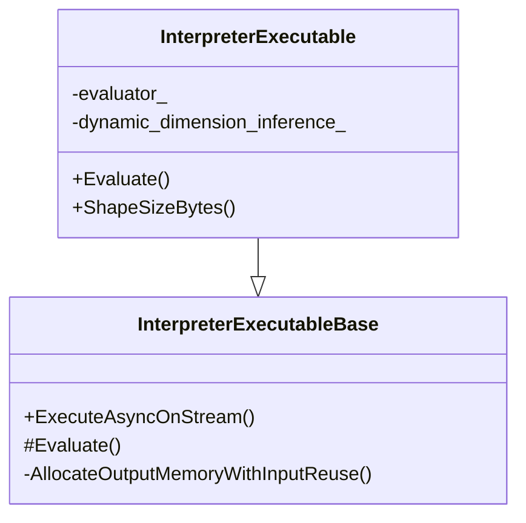
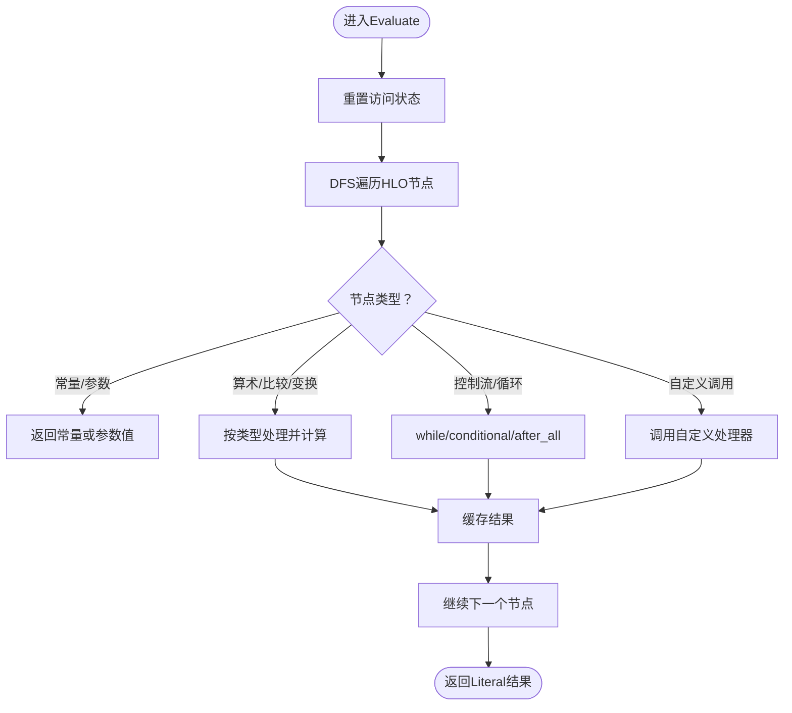
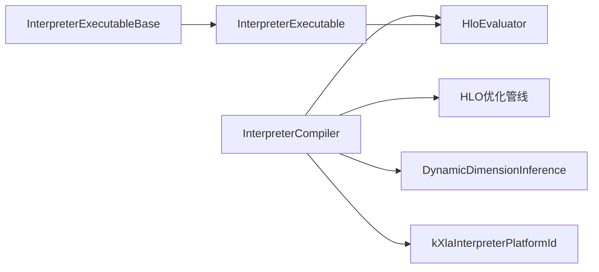

# 解释器后端

<cite>
**本文引用的文件**
- [xla/backends/interpreter/README.md](file://xla/backends/interpreter/README.md)
- [xla/backends/interpreter/compiler.h](file://xla/backends/interpreter/compiler.h)
- [xla/backends/interpreter/compiler.cc](file://xla/backends/interpreter/compiler.cc)
- [xla/backends/interpreter/executable.h](file://xla/backends/interpreter/executable.h)
- [xla/backends/interpreter/executable.cc](file://xla/backends/interpreter/executable.cc)
- [xla/backends/interpreter/executable_base.h](file://xla/backends/interpreter/executable_base.h)
- [xla/backends/interpreter/platform_id.h](file://xla/backends/interpreter/platform_id.h)
- [xla/hlo/evaluator/hlo_evaluator.h](file://xla/hlo/evaluator/hlo_evaluator.h)
</cite>

## 目录
1. [引言](#引言)
2. [项目结构](#项目结构)
3. [核心组件](#核心组件)
4. [架构总览](#架构总览)
5. [组件详解](#组件详解)
6. [依赖关系分析](#依赖关系分析)
7. [性能与限制](#性能与限制)
8. [使用指南](#使用指南)
9. [故障排查](#故障排查)
10. [结论](#结论)

## 引言
本文件面向XLA解释器后端（Interpreter Backend），系统性阐述其设计理念、核心价值与技术实现。解释器后端以HLO为执行单位，直接在HLO图上进行求值，不进一步下推至更低层IR（如LLVM IR）。该特性使其在以下场景具有独特价值：
- 调试支持：可在HLO层面直观观察每条指令的执行结果，便于定位问题与理解行为。
- 教学演示：以HLO为载体，便于讲解XLA计算图的执行逻辑与数据流。
- 算法验证：对新算子或变换进行快速验证，无需构建复杂后端链路。

## 项目结构
解释器后端位于xla/backends/interpreter目录，核心由“编译器”“可执行体”“平台标识”三部分组成，并通过HLO求值器完成实际执行。

图表来源
- [xla/backends/interpreter/compiler.h](file://xla/backends/interpreter/compiler.h#L41-L70)
- [xla/backends/interpreter/compiler.cc](file://xla/backends/interpreter/compiler.cc#L119-L146)
- [xla/backends/interpreter/executable_base.h](file://xla/backends/interpreter/executable_base.h#L41-L64)
- [xla/backends/interpreter/executable.h](file://xla/backends/interpreter/executable.h#L49-L73)
- [xla/backends/interpreter/executable.cc](file://xla/backends/interpreter/executable.cc#L39-L69)
- [xla/backends/interpreter/platform_id.h](file://xla/backends/interpreter/platform_id.h#L24-L24)
- [xla/hlo/evaluator/hlo_evaluator.h](file://xla/hlo/evaluator/hlo_evaluator.h#L65-L90)

章节来源
- [xla/backends/interpreter/README.md](file://xla/backends/interpreter/README.md#L1-L20)
- [xla/backends/interpreter/compiler.h](file://xla/backends/interpreter/compiler.h#L37-L40)
- [xla/backends/interpreter/executable.h](file://xla/backends/interpreter/executable.h#L47-L49)

## 核心组件
- InterpreterCompiler：负责在解释器平台上运行HLO优化与生成可执行体。它不执行低级代码生成，而是直接构造InterpreterExecutable并注册到全局编译器工厂。
- InterpreterExecutableBase：定义可执行体的通用接口与输出内存分配策略，屏蔽平台差异。
- InterpreterExecutable：持有HloEvaluator实例，负责在执行时对HLO图进行求值，并返回Literal结果。
- HloEvaluator：深度优先遍历HLO图，按指令语义求值；支持自定义调用处理、动态维度推理、快速路径等能力。
- 平台标识：提供解释器平台ID，用于注册与选择。

章节来源
- [xla/backends/interpreter/README.md](file://xla/backends/interpreter/README.md#L8-L20)
- [xla/backends/interpreter/compiler.h](file://xla/backends/interpreter/compiler.h#L41-L70)
- [xla/backends/interpreter/executable.h](file://xla/backends/interpreter/executable.h#L49-L73)
- [xla/hlo/evaluator/hlo_evaluator.h](file://xla/hlo/evaluator/hlo_evaluator.h#L65-L90)

## 架构总览
解释器后端的控制流从Compiler开始，经过HLO优化与动态维度推理，生成InterpreterExecutable；执行阶段由InterpreterExecutable委托给HloEvaluator完成逐节点求值。

图表来源
- [xla/backends/interpreter/compiler.cc](file://xla/backends/interpreter/compiler.cc#L111-L146)
- [xla/backends/interpreter/executable_base.h](file://xla/backends/interpreter/executable_base.h#L45-L47)
- [xla/backends/interpreter/executable.cc](file://xla/backends/interpreter/executable.cc#L52-L59)
- [xla/hlo/evaluator/hlo_evaluator.h](file://xla/hlo/evaluator/hlo_evaluator.h#L104-L146)

## 组件详解

### 编译器：InterpreterCompiler
- 职责
  - 运行必要的HLO优化与展开（如Top-k分解、动态索引拆分、QR/Cholesky/Eigh展开、BatchNorm展开、布局分配）。
  - 创建HloEvaluator并设置自定义调用处理器与调试选项。
  - 生成InterpreterExecutable并注册到全局编译器工厂。
- 关键点
  - 自定义调用处理：通过全局CPU后端注册表查找目标函数，按CPU ABI调用，返回输出Literal。
  - 动态维度推理：在RunBackend中注入DynamicDimensionInference，供求值时查询动态维度。
  - 快速路径：根据DebugOptions启用HloEvaluator的fast path，提升某些算子（如dot/conv）性能。
  - 不支持AOT：明确返回不支持提前编译。
- 平台ID：返回解释器平台ID，确保编译器被正确注册与选择。

图表来源
- [xla/backends/interpreter/compiler.h](file://xla/backends/interpreter/compiler.h#L41-L70)
- [xla/backends/interpreter/compiler.cc](file://xla/backends/interpreter/compiler.cc#L90-L146)
- [xla/backends/interpreter/executable.h](file://xla/backends/interpreter/executable.h#L49-L73)

章节来源
- [xla/backends/interpreter/compiler.cc](file://xla/backends/interpreter/compiler.cc#L60-L86)
- [xla/backends/interpreter/compiler.cc](file://xla/backends/interpreter/compiler.cc#L90-L109)
- [xla/backends/interpreter/compiler.cc](file://xla/backends/interpreter/compiler.cc#L111-L146)
- [xla/backends/interpreter/compiler.cc](file://xla/backends/interpreter/compiler.cc#L161-L167)
- [xla/backends/interpreter/compiler.cc](file://xla/backends/interpreter/compiler.cc#L169-L176)

### 可执行体：InterpreterExecutableBase 与 InterpreterExecutable
- InterpreterExecutableBase
  - 定义ExecuteAsyncOnStream，负责将输入参数封装为ExecutionInput，调用派生类的Evaluate方法，并基于别名配置与设备分配器分配输出内存。
- InterpreterExecutable
  - 持有HloEvaluator与可选的DynamicDimensionInference。
  - Evaluate在执行前重置访问状态，保证线程安全；随后委托HloEvaluator完成DFS求值。
  - 提供ShapeSizeBytes用于成本分析与内存估算。

图表来源
- [xla/backends/interpreter/executable_base.h](file://xla/backends/interpreter/executable_base.h#L41-L64)
- [xla/backends/interpreter/executable.h](file://xla/backends/interpreter/executable.h#L49-L73)
- [xla/backends/interpreter/executable.cc](file://xla/backends/interpreter/executable.cc#L39-L69)

章节来源
- [xla/backends/interpreter/executable_base.h](file://xla/backends/interpreter/executable_base.h#L45-L59)
- [xla/backends/interpreter/executable.h](file://xla/backends/interpreter/executable.h#L58-L63)
- [xla/backends/interpreter/executable.cc](file://xla/backends/interpreter/executable.cc#L52-L66)

### 执行器：HloEvaluator
- 设计要点
  - 非线程安全，每次Evaluate前需ResetVisitStates。
  - 支持类型无关与特定类型操作的处理（如bitcast/reshape/transpose/fft/gather/scatter/while/reduce/map/custom_call等）。
  - 支持自定义调用回调、动态维度推理、MAC追踪回调、求值过程中的Literal回调。
  - 快速路径：对某些算子（如dot/conv）启用Eigen加速。
  - 部分求值：仅对元组的指定shape_index进行求值，避免全量tuple开销。
- 控制流
  - Evaluate入口根据computation与参数数组进行DFS遍历与求值。
  - 对while循环提供静态解析能力，支持有限步数执行。
  - 对custom_call提供默认处理器，回退到全局CPU后端注册表。

图表来源
- [xla/hlo/evaluator/hlo_evaluator.h](file://xla/hlo/evaluator/hlo_evaluator.h#L104-L146)
- [xla/hlo/evaluator/hlo_evaluator.h](file://xla/hlo/evaluator/hlo_evaluator.h#L323-L386)
- [xla/hlo/evaluator/hlo_evaluator.h](file://xla/hlo/evaluator/hlo_evaluator.h#L202-L244)

章节来源
- [xla/hlo/evaluator/hlo_evaluator.h](file://xla/hlo/evaluator/hlo_evaluator.h#L65-L90)
- [xla/hlo/evaluator/hlo_evaluator.h](file://xla/hlo/evaluator/hlo_evaluator.h#L170-L177)
- [xla/hlo/evaluator/hlo_evaluator.h](file://xla/hlo/evaluator/hlo_evaluator.h#L202-L244)

### 平台抽象与注册
- 平台ID：解释器平台ID在platform_id.h中声明，供编译器注册与选择。
- 注册机制：编译器在构造时将自身工厂与计算放置器注册到全局编译器工厂，确保解释器后端可被选择与使用。

章节来源
- [xla/backends/interpreter/platform_id.h](file://xla/backends/interpreter/platform_id.h#L24-L24)
- [xla/backends/interpreter/compiler.cc](file://xla/backends/interpreter/compiler.cc#L178-L189)

## 依赖关系分析
- 编译器依赖
  - HLO优化管线：Top-k分解、动态索引拆分、矩阵分解与展开、布局分配等。
  - 动态维度推理：在RunBackend阶段注入，供求值时查询动态维度。
  - HloEvaluator：创建并配置，设置fast path与custom_call handler。
- 可执行体依赖
  - InterpreterExecutableBase：统一执行接口与内存分配。
  - HloEvaluator：执行期求值。
- 平台依赖
  - platform_id.h提供平台ID，驱动编译器注册与选择。

图表来源
- [xla/backends/interpreter/compiler.cc](file://xla/backends/interpreter/compiler.cc#L90-L109)
- [xla/backends/interpreter/compiler.cc](file://xla/backends/interpreter/compiler.cc#L126-L137)
- [xla/backends/interpreter/executable_base.h](file://xla/backends/interpreter/executable_base.h#L41-L64)
- [xla/backends/interpreter/executable.cc](file://xla/backends/interpreter/executable.cc#L39-L49)
- [xla/backends/interpreter/platform_id.h](file://xla/backends/interpreter/platform_id.h#L24-L24)

章节来源
- [xla/backends/interpreter/compiler.cc](file://xla/backends/interpreter/compiler.cc#L38-L48)
- [xla/backends/interpreter/executable.cc](file://xla/backends/interpreter/executable.cc#L26-L34)

## 性能与限制
- 性能特征
  - 优势：无低级代码生成开销，启动快、调试友好；对小规模或教学场景高效。
  - 局限：无法利用后端特有的SIMD/向量化/内存层次优化；大规模计算通常较慢。
  - 快速路径：可通过调试选项启用HloEvaluator的fast path，加速部分算子。
- 限制
  - 不支持AOT编译。
  - 某些HLO（如BatchNormInference/Outfeed等）在解释器中不受支持。
  - 非线程安全，执行时需串行化或加锁。
- 与其他后端对比
  - 与CPU/GPU后端相比，解释器后端在吞吐与峰值性能上通常不具备优势，但在可解释性与开发效率方面更突出。

## 使用指南
- 启用解释器模式
  - 通过平台ID选择解释器后端；编译器在初始化时会注册到全局编译器工厂，可直接被编译流程选择。
- 配置调试选项
  - 可通过调试选项启用HloEvaluator的fast path，以提升部分算子的求值速度。
- 自定义调用
  - 若遇到custom_call，解释器后端会尝试从全局CPU后端注册表查找目标函数并调用；若未注册则报错。

章节来源
- [xla/backends/interpreter/compiler.cc](file://xla/backends/interpreter/compiler.cc#L134-L137)
- [xla/backends/interpreter/compiler.cc](file://xla/backends/interpreter/compiler.cc#L169-L171)
- [xla/backends/interpreter/compiler.cc](file://xla/backends/interpreter/compiler.cc#L60-L86)

## 故障排查
- 常见问题
  - 自定义调用未注册：当遇到custom_call且目标未在全局注册表中时，会返回未找到错误。请确认目标已注册或替换为解释器支持的算子。
  - 动态维度相关错误：若动态维度推理未正确注入或查询失败，可能导致求值阶段异常。请检查RunBackend阶段是否成功创建并注入DynamicDimensionInference。
  - 非线程安全：多线程并发执行同一HloEvaluator会导致竞态。请为每个执行创建独立HloEvaluator或在调用侧串行化。
  - 不支持的HLO：如BatchNormInference/Outfeed等在解释器中不受支持。请改用等价展开或切换到其他后端。
- 排查建议
  - 开启调试日志，观察HLO优化与求值过程。
  - 使用部分求值功能（仅对元组特定元素求值）降低内存与时间开销。
  - 在需要时启用fast path，但注意部分算子的数值稳定性差异。

章节来源
- [xla/backends/interpreter/compiler.cc](file://xla/backends/interpreter/compiler.cc#L60-L86)
- [xla/hlo/evaluator/hlo_evaluator.h](file://xla/hlo/evaluator/hlo_evaluator.h#L392-L408)
- [xla/backends/interpreter/executable.cc](file://xla/backends/interpreter/executable.cc#L56-L58)

## 结论
解释器后端以HLO为执行核心，通过HloEvaluator完成逐节点求值，具备极高的可解释性与开发效率。它在调试、教学与算法验证场景中价值显著，但在大规模性能场景下不如CPU/GPU等后端。通过合理的优化（如fast path）与正确的配置（平台ID、动态维度推理、自定义调用注册），可在保持高可解释性的前提下获得更好的使用体验。