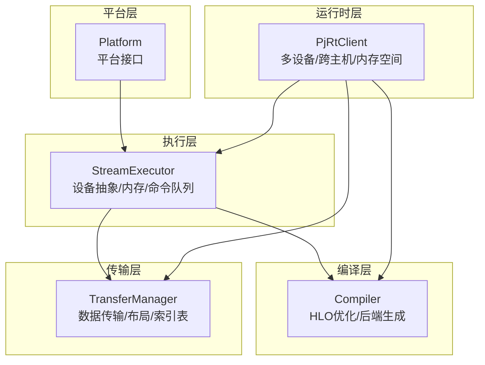
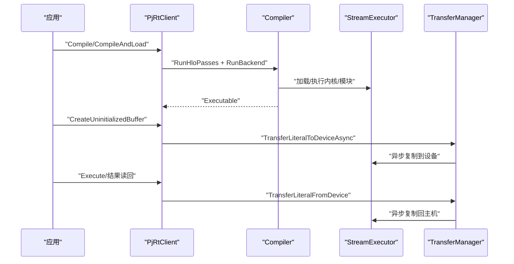
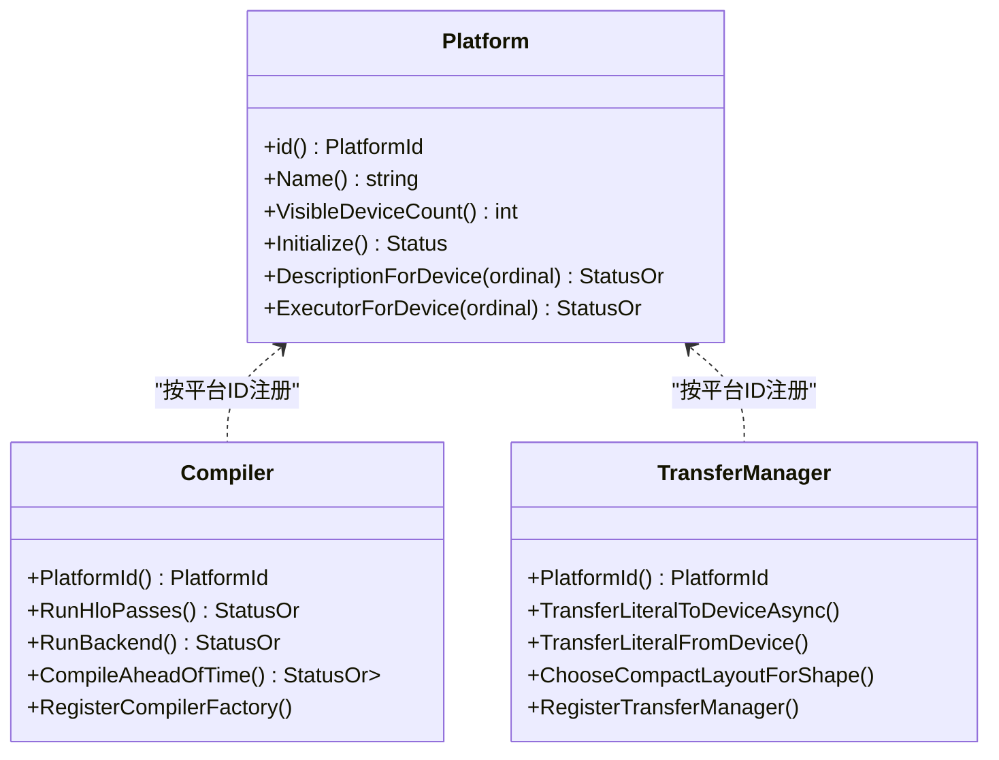
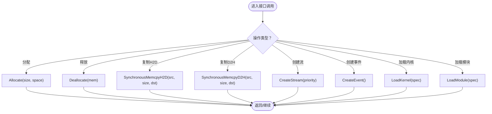
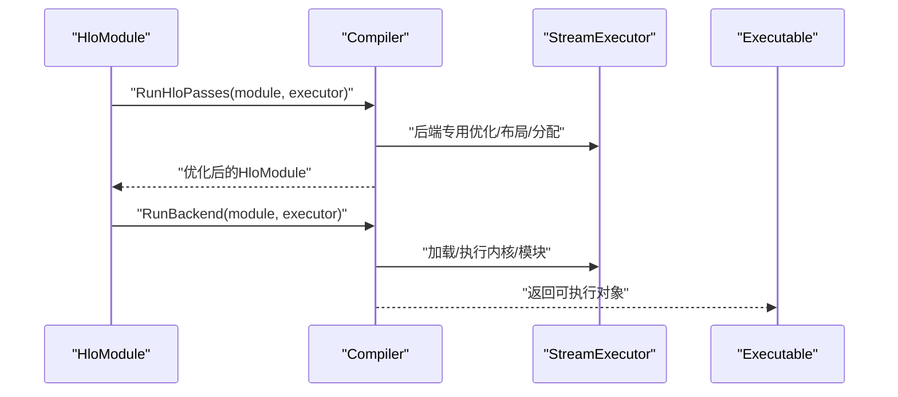
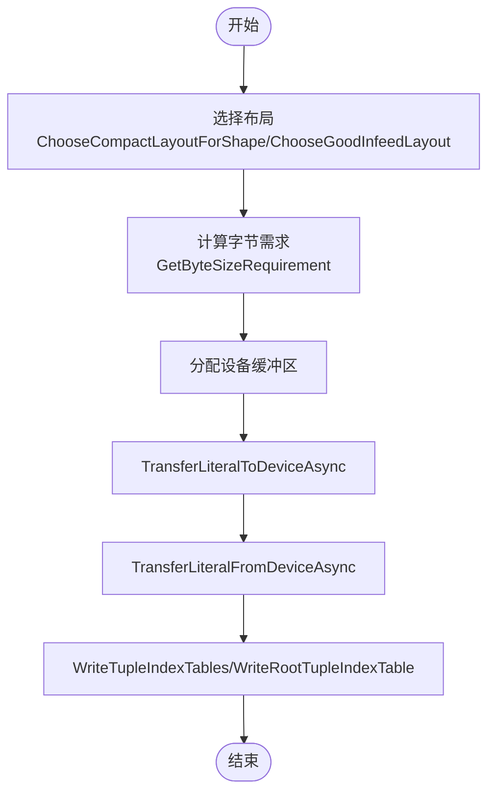
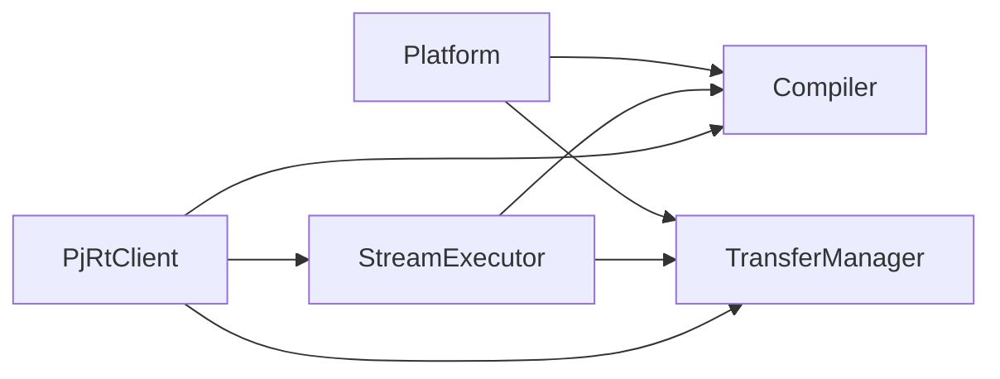

# 后端扩展机制

<cite>
**本文引用的文件**
- [developing_new_backend.md](file://docs/developing_new_backend.md)
- [platform.h](file://xla/stream_executor/platform.h)
- [stream_executor.h](file://xla/stream_executor/stream_executor.h)
- [compiler.h](file://xla/service/compiler.h)
- [transfer_manager.h](file://xla/service/transfer_manager.h)
- [pjrt_client.h](file://xla/pjrt/pjrt_client.h)
- [BUILD.bazel](file://BUILD.bazel)
- [tensorflow.bazelrc](file://tensorflow.bazelrc)
- [xla.default.bzl](file://xla/xla.default.bzl)
- [cpu_compiler.cc](file://xla/service/cpu/cpu_compiler.cc)
- [nvptx_compiler.cc](file://xla/service/gpu/nvptx_compiler.cc)
</cite>

## 目录
1. [简介](#简介)
2. [项目结构](#项目结构)
3. [核心组件](#核心组件)
4. [架构总览](#架构总览)
5. [详细组件分析](#详细组件分析)
6. [依赖关系分析](#依赖关系分析)
7. [性能考量](#性能考量)
8. [故障排查指南](#故障排查指南)
9. [结论](#结论)
10. [附录](#附录)

## 简介
本文件面向系统工程师，系统性阐述如何在XLA中开发新的硬件后端，覆盖以下主题：
- 平台接口与注册机制
- 动态加载与Bazel配置
- StreamExecutor接口实现要点（设备抽象、内存管理、命令队列）
- 编译器适配器开发（HLO到目标代码的转换流程）
- 传输管理器实现（数据类型映射与内存布局）
- 测试框架与验证方法
- 示例项目与模板路径
- 兼容性与迁移策略
- 社区贡献与维护流程

## 项目结构
XLA后端扩展涉及多个层次：
- 平台层：定义平台标识、可见设备数、初始化、设备描述、执行器获取等
- 执行层：StreamExecutor封装单设备能力（流、事件、内核、模块、内存分配、复制、BLAS/FFT/DNN支持等）
- 编译层：Compiler负责HLO优化与后端生成，支持即时编译与提前编译
- 传输层：TransferManager负责主机与设备之间的数据传输、布局选择、索引表写入等
- 运行时层：PJRT客户端抽象多设备、跨主机拓扑、内存空间、异步传输等

图表来源
- [platform.h](file://xla/stream_executor/platform.h#L44-L104)
- [stream_executor.h](file://xla/stream_executor/stream_executor.h#L70-L429)
- [compiler.h](file://xla/service/compiler.h#L107-L350)
- [transfer_manager.h](file://xla/service/transfer_manager.h#L45-L334)
- [pjrt_client.h](file://xla/pjrt/pjrt_client.h#L509-L800)

章节来源
- [platform.h](file://xla/stream_executor/platform.h#L44-L104)
- [stream_executor.h](file://xla/stream_executor/stream_executor.h#L70-L429)
- [compiler.h](file://xla/service/compiler.h#L107-L350)
- [transfer_manager.h](file://xla/service/transfer_manager.h#L45-L334)
- [pjrt_client.h](file://xla/pjrt/pjrt_client.h#L509-L800)

## 核心组件
- 平台接口（Platform）：提供平台唯一ID、名称、可见设备数、初始化、设备描述、执行器获取等能力
- 设备执行器（StreamExecutor）：封装单设备的流、事件、内核加载/卸载、模块加载、内存分配/释放、同步/异步复制、BLAS/FFT/DNN支持、命令缓冲、统计信息等
- 编译器（Compiler）：面向平台的编译器抽象，负责HLO优化、后端生成、提前编译导出、反序列化、度量钩子等
- 传输管理器（TransferManager）：面向平台的数据传输抽象，负责从设备读取/写入字面值、布局选择、Infeed/Outfeed、索引表写入、尺寸计算等
- 运行时客户端（PjRtClient）：多设备/跨主机抽象，提供编译、加载、缓冲区创建、异步传输、内存空间、拓扑描述等

章节来源
- [platform.h](file://xla/stream_executor/platform.h#L44-L104)
- [stream_executor.h](file://xla/stream_executor/stream_executor.h#L70-L429)
- [compiler.h](file://xla/service/compiler.h#L107-L350)
- [transfer_manager.h](file://xla/service/transfer_manager.h#L45-L334)
- [pjrt_client.h](file://xla/pjrt/pjrt_client.h#L509-L800)

## 架构总览
下图展示从上层调用到底层执行的关键交互：

图表来源
- [compiler.h](file://xla/service/compiler.h#L164-L240)
- [stream_executor.h](file://xla/stream_executor/stream_executor.h#L141-L176)
- [transfer_manager.h](file://xla/service/transfer_manager.h#L146-L172)
- [pjrt_client.h](file://xla/pjrt/pjrt_client.h#L634-L718)

## 详细组件分析

### 平台接口与注册机制
- 平台职责
  - 唯一ID与名称
  - 可见设备数量
  - 初始化与设备描述
  - 获取已存在的或新建的执行器
- 注册与发现
  - 平台通过唯一ID进行注册
  - 编译器与传输管理器按平台ID注册工厂或单例
  - 运行时通过平台ID查找对应编译器/传输管理器

图表来源
- [platform.h](file://xla/stream_executor/platform.h#L44-L104)
- [compiler.h](file://xla/service/compiler.h#L285-L295)
- [transfer_manager.h](file://xla/service/transfer_manager.h#L292-L300)

章节来源
- [platform.h](file://xla/stream_executor/platform.h#L44-L104)
- [compiler.h](file://xla/service/compiler.h#L285-L295)
- [transfer_manager.h](file://xla/service/transfer_manager.h#L292-L300)

### StreamExecutor接口实现要点
- 设备抽象
  - 设备序号、NUMA节点、设备描述缓存
- 内存管理
  - 同步/异步复制（主机↔设备）
  - 分配/释放设备内存
  - 主机侧注册内存用于异步拷贝
  - 指针内存空间查询
  - 内存限制与统计
- 命令队列与事件
  - 创建流与事件
  - 同步所有活动
  - 事件计时器
- 内核与模块
  - 加载/卸载内核与模块
  - 常量共享
  - TMA描述符与TensorMap（特定平台）
- 高级库支持
  - BLAS/FFT/DNN支持查询
- 资源管理
  - 附加资源生命周期与线程安全

图表来源
- [stream_executor.h](file://xla/stream_executor/stream_executor.h#L125-L176)
- [stream_executor.h](file://xla/stream_executor/stream_executor.h#L212-L228)
- [stream_executor.h](file://xla/stream_executor/stream_executor.h#L99-L103)
- [stream_executor.h](file://xla/stream_executor/stream_executor.h#L114-L117)
- [stream_executor.h](file://xla/stream_executor/stream_executor.h#L141-L159)

章节来源
- [stream_executor.h](file://xla/stream_executor/stream_executor.h#L70-L429)

### 编译器适配器开发方法
- 场景与参考
  - 已有CPU架构：可复用现有CPU后端逻辑，主要差异在于LLVM生成代码
  - 非CPU且已有LLVM：可参考现有GPU/TPU等后端，重用LLVM IR生成部分
  - 无LLVM：需从零实现编译器、可执行对象、内核加载/执行等
- 关键职责
  - HLO优化（RunHloPasses）
  - 后端生成（RunBackend）
  - 提前编译（CompileAheadOfTime）
  - 导出/反序列化（Export/DeserializeExecutable）
  - 默认设备形状表示与缓冲区大小函数
- 参考实现
  - CPU编译器：[cpu_compiler.cc](file://xla/service/cpu/cpu_compiler.cc)
  - GPU编译器：[nvptx_compiler.cc](file://xla/service/gpu/nvptx_compiler.cc)

图表来源
- [compiler.h](file://xla/service/compiler.h#L164-L190)
- [compiler.h](file://xla/service/compiler.h#L263-L272)
- [developing_new_backend.md](file://docs/developing_new_backend.md#L39-L76)

章节来源
- [compiler.h](file://xla/service/compiler.h#L107-L350)
- [developing_new_backend.md](file://docs/developing_new_backend.md#L39-L76)

### 传输管理器实现要求
- 数据类型映射与布局
  - 主机形状到设备形状映射
  - 紧凑布局选择与Infeed布局选择
  - 子字节类型打包策略
- 数据传输
  - 异步/同步从设备读取字面值
  - 异步/同步向设备写入字面值
  - 数组级别传输便捷方法
- 索引表与动态形状
  - 写入元组索引表（完整/根节点）
  - 读取动态维度
- 尺寸与可用性
  - 字节需求计算
  - 缓冲区立即访问可行性判断

图表来源
- [transfer_manager.h](file://xla/service/transfer_manager.h#L231-L237)
- [transfer_manager.h](file://xla/service/transfer_manager.h#L223-L223)
- [transfer_manager.h](file://xla/service/transfer_manager.h#L244-L255)
- [transfer_manager.h](file://xla/service/transfer_manager.h#L146-L172)
- [transfer_manager.h](file://xla/service/transfer_manager.h#L206-L218)

章节来源
- [transfer_manager.h](file://xla/service/transfer_manager.h#L45-L334)

### 动态加载与Bazel构建配置
- 平台注册与工厂
  - 编译器与传输管理器通过静态工厂注册到平台ID
  - 运行时按平台ID查找对应实例
- Bazel配置要点
  - 使用顶层BUILD.bazel与tensorflow.bazelrc组织构建
  - 通过xla.default.bzl提供默认规则与宏
  - 新后端需在BUILD中声明平台相关目标并接入注册流程
- 示例参考
  - CPU/GPU后端的编译器实现可作为模板：[cpu_compiler.cc](file://xla/service/cpu/cpu_compiler.cc)、[nvptx_compiler.cc](file://xla/service/gpu/nvptx_compiler.cc)

章节来源
- [compiler.h](file://xla/service/compiler.h#L285-L295)
- [transfer_manager.h](file://xla/service/transfer_manager.h#L292-L300)
- [BUILD.bazel](file://BUILD.bazel)
- [tensorflow.bazelrc](file://tensorflow.bazelrc)
- [xla.default.bzl](file://xla/xla.default.bzl)

### 测试框架与验证方法
- 单元测试与集成测试
  - 编译器：验证RunHloPasses与RunBackend输出一致性、提前编译导出/加载
  - 传输管理器：验证布局选择、异步传输正确性、索引表写入
  - StreamExecutor：验证内存分配/释放、复制、事件计时、内核加载
- 性能基准
  - 利用内置统计与计时器评估复制带宽、内核启动开销
- 多设备/跨主机验证
  - PjRtClient的多设备/跨主机拓扑、内存空间、异步传输验证

章节来源
- [compiler.h](file://xla/service/compiler.h#L320-L336)
- [stream_executor.h](file://xla/stream_executor/stream_executor.h#L317-L350)
- [transfer_manager.h](file://xla/service/transfer_manager.h#L188-L218)
- [pjrt_client.h](file://xla/pjrt/pjrt_client.h#L499-L508)

### 示例项目与模板代码
- 开发指南
  - 参考文档：[developing_new_backend.md](file://docs/developing_new_backend.md)
- 模板与参考实现
  - CPU编译器：[cpu_compiler.cc](file://xla/service/cpu/cpu_compiler.cc)
  - GPU编译器：[nvptx_compiler.cc](file://xla/service/gpu/nvptx_compiler.cc)

章节来源
- [developing_new_backend.md](file://docs/developing_new_backend.md#L1-L77)
- [cpu_compiler.cc](file://xla/service/cpu/cpu_compiler.cc)
- [nvptx_compiler.cc](file://xla/service/gpu/nvptx_compiler.cc)

### 兼容性与迁移策略
- 与现有后端的兼容性
  - 平台ID必须唯一，避免重复注册
  - 编译器/传输管理器需实现对应平台ID的工厂或单例
  - 运行时通过平台ID自动发现与绑定
- 迁移策略
  - 若已有LLVM后端，优先复用LLVM IR生成逻辑
  - 若无LLVM，逐步实现内核加载/执行、内存管理、命令队列等核心接口
  - 以CPU/GPU现有实现为对照，确保行为一致

章节来源
- [compiler.h](file://xla/service/compiler.h#L285-L295)
- [transfer_manager.h](file://xla/service/transfer_manager.h#L292-L300)
- [developing_new_backend.md](file://docs/developing_new_backend.md#L39-L76)

### 社区贡献与维护流程
- 贡献流程
  - 遵循仓库贡献指南与拉取请求模板
  - 提供充分测试与性能验证
- 维护建议
  - 保持平台ID稳定
  - 严格遵循接口契约，避免破坏性变更
  - 文档与示例同步更新

章节来源
- [CONTRIBUTING.md](file://CONTRIBUTING.md)

## 依赖关系分析
- 组件耦合
  - Platform是编译器与传输管理器的共同依赖入口
  - StreamExecutor向上为Compiler/TransferManager提供底层能力
  - PjRtClient协调多设备与跨主机场景
- 外部依赖
  - Bazel构建系统与规则
  - 第三方库（如LLVM、BLAS/FFT/DNN库等）

图表来源
- [platform.h](file://xla/stream_executor/platform.h#L44-L104)
- [compiler.h](file://xla/service/compiler.h#L107-L160)
- [transfer_manager.h](file://xla/service/transfer_manager.h#L45-L99)
- [stream_executor.h](file://xla/stream_executor/stream_executor.h#L70-L121)
- [pjrt_client.h](file://xla/pjrt/pjrt_client.h#L509-L572)

章节来源
- [platform.h](file://xla/stream_executor/platform.h#L44-L104)
- [compiler.h](file://xla/service/compiler.h#L107-L160)
- [transfer_manager.h](file://xla/service/transfer_manager.h#L45-L99)
- [stream_executor.h](file://xla/stream_executor/stream_executor.h#L70-L121)
- [pjrt_client.h](file://xla/pjrt/pjrt_client.h#L509-L572)

## 性能考量
- 内存与带宽
  - 优先使用异步复制与主机侧注册内存
  - 合理选择紧凑布局以减少填充
- 并行与流水线
  - 多流并发与事件计时
  - 命令缓冲与批处理
- 编译优化
  - 提前编译与缓存
  - 度量钩子与剖析

## 故障排查指南
- 常见问题
  - 平台未初始化：确认Platform::Initialize先于ExecutorForDevice调用
  - 设备内存不足：检查StreamExecutor::GetMemoryLimitBytes与分配大小
  - 传输失败：核对布局与尺寸，确认异步传输完成回调
- 定位手段
  - 启用API追踪与统计
  - 使用事件计时器测量瓶颈
  - 逐步缩小至最小可复现样例

章节来源
- [platform.h](file://xla/stream_executor/platform.h#L72-L98)
- [stream_executor.h](file://xla/stream_executor/stream_executor.h#L317-L350)
- [transfer_manager.h](file://xla/service/transfer_manager.h#L188-L218)

## 结论
XLA后端扩展以平台抽象为核心，围绕StreamExecutor、Compiler、TransferManager三大支柱构建。通过明确的注册机制与Bazel配置，开发者可在既有CPU/GPU实现基础上快速落地新后端；对于无LLVM场景，则需要补齐内核加载、内存管理与命令队列等关键能力。配合完善的测试与性能验证，可确保新后端在正确性与性能上满足生产要求。

## 附录
- 快速参考
  - 平台接口：[platform.h](file://xla/stream_executor/platform.h#L44-L104)
  - 设备执行器：[stream_executor.h](file://xla/stream_executor/stream_executor.h#L70-L429)
  - 编译器接口：[compiler.h](file://xla/service/compiler.h#L107-L350)
  - 传输管理器：[transfer_manager.h](file://xla/service/transfer_manager.h#L45-L334)
  - 运行时客户端：[pjrt_client.h](file://xla/pjrt/pjrt_client.h#L509-L800)
  - 开发指南：[developing_new_backend.md](file://docs/developing_new_backend.md#L1-L77)
  - Bazel配置：[BUILD.bazel](file://BUILD.bazel)、[tensorflow.bazelrc](file://tensorflow.bazelrc)、[xla.default.bzl](file://xla/xla.default.bzl)
  - 参考实现：[cpu_compiler.cc](file://xla/service/cpu/cpu_compiler.cc)、[nvptx_compiler.cc](file://xla/service/gpu/nvptx_compiler.cc)