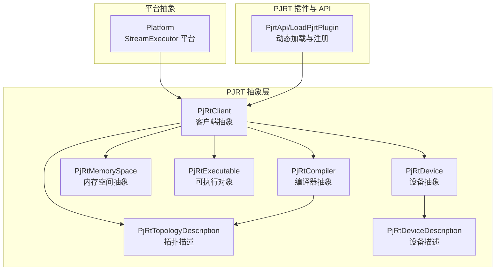
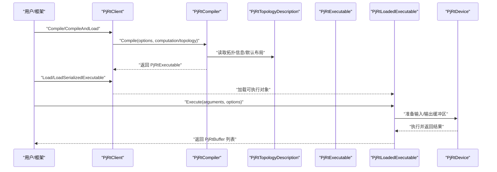
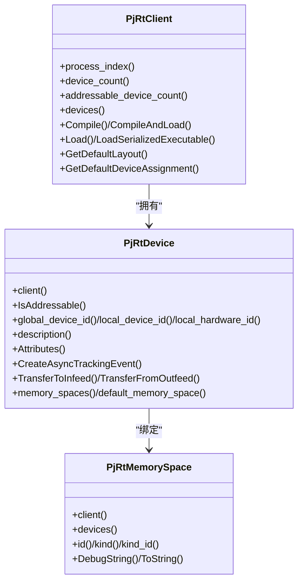
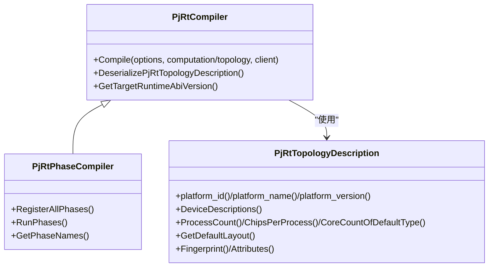
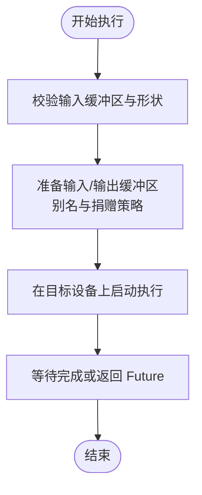
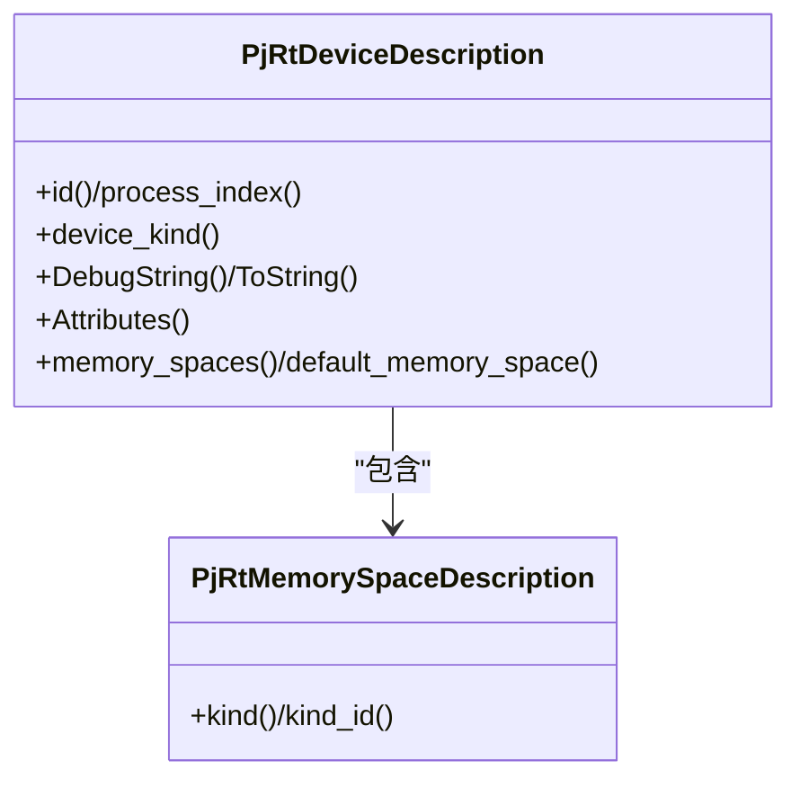
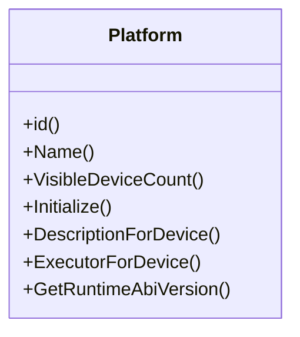
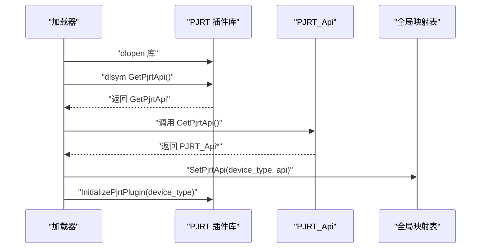
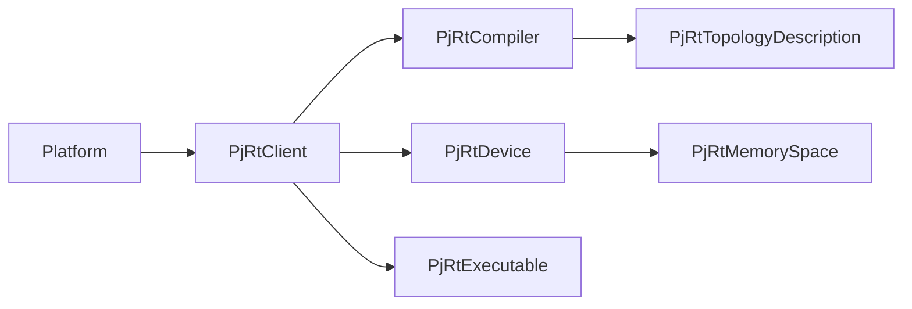

# 后端抽象层

<cite>
**本文引用的文件**
- [xla\pjrt\pjrt_api.h](file://xla/pjrt/pjrt_api.h)
- [xla\pjrt\pjrt_client.h](file://xla/pjrt/pjrt_client.h)
- [xla\pjrt\common_pjrt_client.h](file://xla/pjrt/common_pjrt_client.h)
- [xla\pjrt\pjrt_compiler.h](file://xla/pjrt/pjrt_compiler.h)
- [xla\pjrt\pjrt_executable.h](file://xla/pjrt/pjrt_executable.h)
- [xla\pjrt\pjrt_device_description.h](file://xla/pjrt/pjrt_device_description.h)
- [xla\stream_executor\platform.h](file://xla/stream_executor/platform.h)
</cite>

## 目录
1. [引言](#引言)
2. [项目结构](#项目结构)
3. [核心组件](#核心组件)
4. [架构总览](#架构总览)
5. [详细组件分析](#详细组件分析)
6. [依赖关系分析](#依赖关系分析)
7. [性能考量](#性能考量)
8. [故障排查指南](#故障排查指南)
9. [结论](#结论)
10. [附录](#附录)

## 引言
本文件系统化梳理 XLA 的后端抽象层与 PJRT（Python Extension for XLA Runtime）设计，重点阐述：
- 后端抽象层的设计目标：以硬件无关的方式完成编译与执行，屏蔽底层设备差异。
- 接口定义、职责分离与扩展机制：通过统一的客户端、编译器、可执行对象与设备描述接口，实现多后端一致性。
- 主要后端实现特点：CPU/GPU/TPU 的技术差异与适配策略。
- PJRT 的设计理念与实现方式：以插件化、可动态加载的 C API 为核心，提供跨语言一致的运行时接口。
- 注册机制、动态加载与配置管理：平台/编译器/拓扑描述的注册与初始化流程。
- 新硬件集成路径与一致性保障：最小改动接入、ABI 版本控制与默认布局策略。

## 项目结构
围绕后端抽象层与 PJRT 的关键代码组织如下：
- PJRT 核心接口与运行时抽象：客户端、设备、内存空间、可执行对象、编译器、拓扑描述等。
- 平台抽象：StreamExecutor 平台接口，用于传统后端（如 CPU/GPU）的底层能力封装。
- PJRT 插件与 API：动态加载 PJRT 插件、设置全局 API 映射、初始化插件生命周期。

**图表来源**
- [xla\pjrt\pjrt_client.h](file://xla/pjrt/pjrt_client.h#L509-L800)
- [xla\pjrt\pjrt_executable.h](file://xla/pjrt/pjrt_executable.h#L321-L431)
- [xla\pjrt\pjrt_compiler.h](file://xla/pjrt/pjrt_compiler.h#L186-L381)
- [xla\pjrt\pjrt_device_description.h](file://xla/pjrt/pjrt_device_description.h#L51-L100)
- [xla\stream_executor\platform.h](file://xla/stream_executor/platform.h#L44-L104)
- [xla\pjrt\pjrt_api.h](file://xla/pjrt/pjrt_api.h#L29-L47)

**章节来源**
- [xla\pjrt\pjrt_client.h](file://xla/pjrt/pjrt_client.h#L509-L800)
- [xla\pjrt\pjrt_executable.h](file://xla/pjrt/pjrt_executable.h#L321-L431)
- [xla\pjrt\pjrt_compiler.h](file://xla/pjrt/pjrt_compiler.h#L186-L381)
- [xla\pjrt\pjrt_device_description.h](file://xla/pjrt/pjrt_device_description.h#L51-L100)
- [xla\stream_executor\platform.h](file://xla/stream_executor/platform.h#L44-L104)
- [xla\pjrt\pjrt_api.h](file://xla/pjrt/pjrt_api.h#L29-L47)

## 核心组件
- 客户端（PjRtClient）
  - 统一入口，负责设备枚举、编译、加载、执行、缓冲区管理与拓扑信息。
  - 提供默认布局、设备分配、成本分析等平台特定能力的虚接口。
- 设备（PjRtDevice）
  - 表达单个硬件设备，支持地址可达性、ID 管理、属性查询、异步事件跟踪、入出站队列传输等。
- 内存空间（PjRtMemorySpace）
  - 表达设备侧内存域，提供 kind/kind_id、调试字符串、绑定设备集合等。
- 可执行对象（PjRtExecutable/PjRtLoadedExecutable）
  - 编译产物的序列化、反序列化、ABI 版本、成本分析、输出形状/布局/分片等元数据访问。
- 编译器（PjRtCompiler）
  - 面向平台的编译器抽象，支持默认/变体注册、工厂延迟初始化、拓扑描述解析、多阶段编译管线。
- 拓扑描述（PjRtTopologyDescription）
  - 描述多主机/多芯片/多核心拓扑，提供进程数、芯片数、逻辑设备计数、坐标映射、默认布局等。
- 设备描述（PjRtDeviceDescription）
  - 描述单设备的静态属性（类型、进程索引、内存空间等），用于兼容性判断与默认布局选择。
- 平台（Platform）
  - StreamExecutor 平台抽象，提供平台 ID、可见设备数、设备描述、执行器获取与运行时 ABI 版本。
- PJRT 插件 API（PjrtApi/LoadPjrtPlugin）
  - 动态加载后端插件、设置全局 API 映射、初始化插件生命周期。

**章节来源**
- [xla\pjrt\pjrt_client.h](file://xla/pjrt/pjrt_client.h#L114-L265)
- [xla\pjrt\pjrt_client.h](file://xla/pjrt/pjrt_client.h#L84-L112)
- [xla\pjrt\pjrt_executable.h](file://xla/pjrt/pjrt_executable.h#L321-L431)
- [xla\pjrt\pjrt_compiler.h](file://xla/pjrt/pjrt_compiler.h#L399-L428)
- [xla\pjrt\pjrt_compiler.h](file://xla/pjrt/pjrt_compiler.h#L186-L381)
- [xla\pjrt\pjrt_device_description.h](file://xla/pjrt/pjrt_device_description.h#L51-L100)
- [xla\stream_executor\platform.h](file://xla/stream_executor/platform.h#L44-L104)
- [xla\pjrt\pjrt_api.h](file://xla/pjrt/pjrt_api.h#L29-L47)

## 架构总览
后端抽象层通过“编译器-可执行对象-客户端-设备/内存空间”链路实现硬件无关的执行；平台层提供底层能力封装；PJRT 插件机制实现动态加载与扩展。

**图表来源**
- [xla\pjrt\pjrt_compiler.h](file://xla/pjrt/pjrt_compiler.h#L400-L428)
- [xla\pjrt\pjrt_executable.h](file://xla/pjrt/pjrt_executable.h#L321-L431)
- [xla\pjrt\pjrt_client.h](file://xla/pjrt/pjrt_client.h#L634-L695)

## 详细组件分析

### 客户端与设备抽象
- 客户端职责
  - 设备枚举与查找、默认设备分配、默认布局、成本分析、编译/加载/执行、跨主机传输、插件属性与 ABI 版本查询。
- 设备职责
  - 地址可达性、ID 管理（全局/本地/物理）、属性与调试字符串、异步事件、入出站队列、内存空间枚举与默认内存空间、流句柄等。
- 内存空间职责
  - 唯一标识（kind/kind_id）、调试字符串、绑定设备集合、归属客户端。

**图表来源**
- [xla\pjrt\pjrt_client.h](file://xla/pjrt/pjrt_client.h#L509-L626)
- [xla\pjrt\pjrt_client.h](file://xla/pjrt/pjrt_client.h#L114-L265)
- [xla\pjrt\pjrt_client.h](file://xla/pjrt/pjrt_client.h#L84-L112)

**章节来源**
- [xla\pjrt\pjrt_client.h](file://xla/pjrt/pjrt_client.h#L509-L626)
- [xla\pjrt\pjrt_client.h](file://xla/pjrt/pjrt_client.h#L114-L265)
- [xla\pjrt\pjrt_client.h](file://xla/pjrt/pjrt_client.h#L84-L112)

### 编译器与拓扑描述
- 编译器注册与变体
  - 支持默认编译器与变体编译器注册、工厂延迟初始化、全局注册表、按平台/变体检索。
- 多阶段编译
  - PjRtPhaseCompiler 支持注册多个编译阶段，按顺序执行，并在每个阶段进行验证。
- 拓扑描述
  - 提供平台 ID/名称/版本、设备描述列表、进程/芯片/核心计数、坐标映射、默认布局、指纹、属性等。

**图表来源**
- [xla\pjrt\pjrt_compiler.h](file://xla/pjrt/pjrt_compiler.h#L399-L428)
- [xla\pjrt\pjrt_compiler.h](file://xla/pjrt/pjrt_compiler.h#L186-L381)
- [xla\pjrt\pjrt_compiler.h](file://xla/pjrt/pjrt_compiler.h#L494-L549)

**章节来源**
- [xla\pjrt\pjrt_compiler.h](file://xla/pjrt/pjrt_compiler.h#L103-L152)
- [xla\pjrt\pjrt_compiler.h](file://xla/pjrt/pjrt_compiler.h#L494-L549)
- [xla\pjrt\pjrt_compiler.h](file://xla/pjrt/pjrt_compiler.h#L186-L381)

### 可执行对象与执行选项
- 可执行对象
  - 输出形状/元素类型/维度、参数/输出布局、内存种类、分片策略、序列化、ABI 版本、指纹、成本分析。
- 执行选项
  - 严格形状检查、send/recv 回调、主序布局回调开关、执行模式（同步/异步/默认）、执行流 ID、调用位置信息等。

**图表来源**
- [xla\pjrt\pjrt_executable.h](file://xla/pjrt/pjrt_executable.h#L224-L319)
- [xla\pjrt\common_pjrt_client.h](file://xla/pjrt/common_pjrt_client.h#L532-L576)

**章节来源**
- [xla\pjrt\pjrt_executable.h](file://xla/pjrt/pjrt_executable.h#L321-L431)
- [xla\pjrt\pjrt_executable.h](file://xla/pjrt/pjrt_executable.h#L224-L319)
- [xla\pjrt\common_pjrt_client.h](file://xla/pjrt/common_pjrt_client.h#L532-L576)

### 设备与内存空间描述
- 设备描述
  - 设备 ID、进程索引、设备类型、调试字符串、属性、内存空间列表与默认内存空间。
- 内存空间描述
  - kind/kind_id、调试字符串。

**图表来源**
- [xla\pjrt\pjrt_device_description.h](file://xla/pjrt/pjrt_device_description.h#L51-L100)

**章节来源**
- [xla\pjrt\pjrt_device_description.h](file://xla/pjrt/pjrt_device_description.h#L51-L100)

### 平台抽象与后端适配
- 平台接口
  - 平台 ID、名称、可见设备数、初始化、设备描述、执行器获取、运行时 ABI 版本。
- 与 PJRT 的关系
  - 平台层提供底层能力封装，PJRT 层通过统一接口屏蔽差异，实现硬件无关。

**图表来源**
- [xla\stream_executor\platform.h](file://xla/stream_executor/platform.h#L44-L104)

**章节来源**
- [xla\stream_executor\platform.h](file://xla/stream_executor/platform.h#L44-L104)

### PJRT 插件与动态加载
- 全局 API 映射
  - 通过设备类型（大小写不敏感）映射到 PJRT_Api*，支持查询已注册设备类型、设置/获取。
- 插件加载与初始化
  - 动态加载库、符号导出 GetPjrtApi、SetPjrtApi、初始化与状态查询。
- 与客户端协作
  - 客户端可查询插件属性、ABI 版本，实现跨后端一致性。

**图表来源**
- [xla\pjrt\pjrt_api.h](file://xla/pjrt/pjrt_api.h#L29-L47)

**章节来源**
- [xla\pjrt\pjrt_api.h](file://xla/pjrt/pjrt_api.h#L29-L47)

## 依赖关系分析
- 耦合与内聚
  - 客户端对编译器、拓扑、设备/内存空间存在强依赖；编译器对拓扑描述有强依赖；设备/内存空间对客户端存在弱依赖（仅用于调试/属性）。
- 外部依赖
  - 运行时 ABI 版本、设备描述、平台接口等作为外部契约，确保跨后端一致性。
- 循环依赖
  - 当前接口设计避免循环依赖，通过纯虚接口与组合关系维持清晰边界。

**图表来源**
- [xla\pjrt\pjrt_client.h](file://xla/pjrt/pjrt_client.h#L509-L626)
- [xla\pjrt\pjrt_compiler.h](file://xla/pjrt/pjrt_compiler.h#L399-L428)
- [xla\stream_executor\platform.h](file://xla/stream_executor/platform.h#L44-L104)

**章节来源**
- [xla\pjrt\pjrt_client.h](file://xla/pjrt/pjrt_client.h#L509-L626)
- [xla\pjrt\pjrt_compiler.h](file://xla/pjrt/pjrt_compiler.h#L399-L428)
- [xla\stream_executor\platform.h](file://xla/stream_executor/platform.h#L44-L104)

## 性能考量
- 默认布局与内存空间
  - 通过拓扑描述提供默认布局，减少主机到设备传输的布局转换开销。
- 缓冲区复用与别名
  - 支持别名缓冲区与捐赠策略，降低内存拷贝与分配次数。
- 多阶段编译与缓存
  - PjRtPhaseCompiler 支持阶段化编译，便于在各阶段插入优化与缓存。
- 异步执行与事件跟踪
  - 设备异步事件与客户端事件集，提升并发与可观测性。

[本节为通用指导，无需列出具体文件来源]

## 故障排查指南
- 编译失败
  - 检查编译器注册与变体初始化是否正确，确认拓扑描述与平台匹配。
- 执行异常
  - 关注输入缓冲区形状与设备形状兼容性、严格形状检查开关、别名与捐赠策略。
- 插件问题
  - 确认动态加载成功、API 符号导出、初始化状态查询与 ABI 版本匹配。

**章节来源**
- [xla\pjrt\pjrt_compiler.h](file://xla/pjrt/pjrt_compiler.h#L103-L152)
- [xla\pjrt\pjrt_executable.h](file://xla/pjrt/pjrt_executable.h#L224-L319)
- [xla\pjrt\pjrt_api.h](file://xla/pjrt/pjrt_api.h#L29-L47)

## 结论
XLA 后端抽象层通过 PJRT 客户端、编译器、可执行对象与设备/内存空间的统一抽象，实现了硬件无关的编译与执行；结合平台抽象与 PJRT 插件机制，既保证了多后端一致性，又提供了灵活的扩展能力。CPU/GPU/TPU 等后端差异主要体现在默认布局、内存空间与设备属性上，通过拓扑描述与设备描述接口即可适配。对于新硬件，只需实现对应接口并注册编译器与设备描述，即可快速接入。

[本节为总结性内容，无需列出具体文件来源]

## 附录
- 平台标识与识别
  - 提供 CPU/GPU/TPU 平台名称与 ID 的常量与识别函数，便于编译器与客户端区分后端类型。
- 多切片配置
  - 支持跨切片拓扑的编译与执行配置，便于大规模分布式训练场景。

**章节来源**
- [xla\pjrt\pjrt_compiler.h](file://xla/pjrt/pjrt_compiler.h#L51-L90)
- [xla\pjrt\pjrt_executable.h](file://xla/pjrt/pjrt_executable.h#L68-L83)